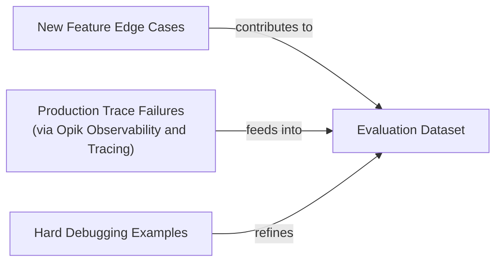
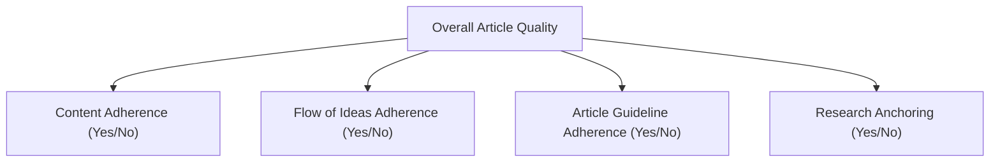

# Evaluation-Driven Development: Your North Star for AI Engineering

In our last two lessons, we set up the infrastructure for observing and evaluating our AI agents. We learned how to instrument our systems with Opik for detailed tracing in Lesson 27, and in Lesson 28, we began assembling the offline datasets that form the bedrock of our evaluation process. Now, we move to the core theoretical framework of designing the metrics themselves.

In classical machine learning, evaluation is a non-negotiable discipline. We live by metrics like accuracy, precision, recall, and F1 scores. We debate the nuances of statistical significance. Yet, in the world of AI engineering, a concerning trend has emerged: the "vibe check." Too often, we assess our systems by glancing at a few outputs and deciding if they "feel right." This intuition-driven approach, or worse, skipping evaluation entirely, is a critical mistake that leads to unreliable systems and slow, unpredictable progress.

Prioritizing a robust evaluation layer can feel like a thankless task. It does not add a flashy new feature for users, it demands upfront effort to design datasets and metrics, and it constantly competes with the pressure to ship. However, this investment pays dividends by accelerating long-term development. It replaces subjective guesswork with an objective signal, allowing you to quantify the impact of every change and catch regressions instantly. A systematic evaluation framework is the only way to move from building demos to shipping dependable products [[18]](https://www.decodingai.com/p/escaping-poc-purgatory-evaluation).

Evals are the north star of AI engineering. They are the single source of truth that tells you whether your modifications are improving your system or silently breaking it. In this lesson, we will establish the theoretical foundation for this evaluation-driven approach. We will cover:
- The optimization flywheel and its three core use cases.
- Trade-offs between different metric types for unstructured outputs.
- Why custom business metrics are superior to public benchmarks and generic scores.
- Why binary pass/fail judgments are more robust than 1-5 star ratings.

With the problem and its importance clear, we will now examine how to operationalize evals inside a repeatable optimization flywheel that replaces intuition with evidence.

## Using Evals Through the Optimization Flywheel

To build intuition, let's examine how we can effectively use and integrate AI evaluations into our application development lifecycle. There are three core scenarios where evaluations provide value.

First, evals **quantify the quality of your system** on a given set of metrics, creating a snapshot of its current performance. This baseline is your anchor. Without it, you are flying blind, unable to know if your system is production-ready or if your changes are leading to genuine improvements. It establishes a clear, objective starting point for all future work.

Second, these metrics serve as **guidance when optimizing your system**. They provide the evidence needed to run targeted experiments, shifting development from being intuition-based to evidence-based. Instead of "this prompt feels better," you can say, "this prompt improved our 'Constraint Violation' pass rate by 7%." This data-driven approach allows you to prioritize changes that have a measurable impact on quality.

Finally, evals act as **regression tests** that protect shared components. This is essential in AI engineering, where prompts, tools, and retrieval logic are often interconnected. A small change in one area, intended to fix a specific bug or add a new feature, can have unintended and detrimental consequences elsewhere. A robust evaluation suite acts as a safety net, catching these regressions before they reach production.

### The Optimization Process

How does this look in a real-world scenario? Let's look at a step-by-step plan of attack for the optimization flywheel. This process provides a structured way to iterate on your AI system, ensuring that every change is measured and validated.

1.  **Gather your dataset:** Assemble the offline evaluation dataset you want to test against. This set should be a representative sample of the inputs your system will handle, including common cases and known edge cases. As we discussed in Lesson 28, this dataset is a living artifact that grows over time.
2.  **Build your metrics:** Define the business-aligned metrics you will use to measure performance. As we will see later, these should be custom metrics that reflect your specific product goals, not generic, off-the-shelf scores.
3.  **Establish a baseline:** Run your current system against the dataset to compute your initial baseline scores. This snapshot is your single source of truth for all future comparisons. Every subsequent change will be measured against this baseline.
4.  **Start the optimization:** Make one, isolated change that you believe will improve performance. This could be tweaking a prompt, changing a model parameter, or swapping out an embedding model.
5.  **Compute the new score:** Re-run the full evaluation suite on the entire dataset with the modified system. This step must be comprehensive to catch both improvements and regressions.
6.  **Compare:** Compare the new scores to your baseline, considering statistical significance. A statistically significant result is one that is unlikely to have occurred by chance, giving you confidence that the change you made had a real effect [[1]](https://www.nngroup.com/articles/practical-significance).
7.  **Decide:** Based on whether the score is better, the same, or worse, decide to keep the change, revert it, or investigate further. You must also consider the complexity and cost of the change. A marginal improvement might not be worth a significant increase in latency or cost.
8.  **Repeat:** Continue this cycle until your scores meet the desired quality bar for production. This iterative process is the engine of continuous improvement.

<https://images.spr.so/cdn-cgi/imagedelivery/j42No7y-dcokJuNgXeA0ig/3fe225f6-9114-4d87-943c-d5bbe3fbbdfc/ai_evals/w=1920,quality=90,fit=scale-down>
Image 1: The iterative optimization flywheel for AI applications using evaluations.

A critical discipline in this process is to change only one variable at a time. If you modify the prompt and the retrieval chunk size in the same cycle, you create confounding variables. It becomes impossible to attribute a score change to a specific modification, turning your evidence-based process back into guesswork.

Furthermore, statistical significance must be anchored to real-world **business impact**. A p-value is a measure of reliability, not importance. It tells you if a result is likely real, but not if it matters [[1]](https://www.nngroup.com/articles/practical-significance).

For a high-volume customer support bot handling millions of queries, a 0.5% reduction in checkout errors could translate to hundreds of thousands of dollars in saved revenue. In this context, a small but statistically significant improvement is highly valuable [[1]](https://www.nngroup.com/articles/practical-significance). In contrast, for a low-volume creative writing tool, a 1-second reduction in response time might be statistically significant but practically unnoticeable to users. Whether a change is "better" is always relative to the business context.

### Regression Testing

The flywheel can also be adapted for regression testing. Before merging any change that touches shared components, you run the full eval suite to guard against breaking existing functionality. These components can include prompts, tool descriptions, orchestration logic, or memory retrieval. This is an effective technique for maintaining stability as your system grows in complexity, especially in a team environment where multiple engineers are making changes.

The process is a simplified version of the optimization flywheel:

1.  **Implement a new feature:** You write the code and verify it works locally for the new use case. This is standard development practice.
2.  **Run the AI evaluations:** You run the full suite of assessments, covering all previous use cases, not just the new one. This ensures your change has not negatively impacted existing functionality.
3.  **Compare Scores:** Compare the new scores against the established baseline for existing features. The focus here is on stability, not necessarily improvement across the board.
4.  **Metrics similar to baseline:** If the scores for existing features are identical or within an acceptable tolerance of the baseline, your change is safe. You can merge the feature into your production codebase.
5.  **Metrics lower than the baseline:** If scores have dropped, you have introduced a regression. You must fix the issue and repeat the evaluation cycle until performance is restored. This prevents the gradual degradation of your system's quality.

<https://images.spr.so/cdn-cgi/imagedelivery/j42No7y-dcokJuNgXeA0ig/81fa7407-fdcd-4427-8468-669a31e2ca3f/ai_evals_-1/w=1920,quality=90,fit=scale-down>
Image 2: Integrating AI evaluations into CI pipelines for regression testing.

This treats your AI evaluations like integration tests in traditional software, but with a key difference. Instead of a strict pass/fail threshold, you are often comparing performance against a moving baseline, allowing for a more nuanced understanding of system health.

An important part of this process is that the evaluation dataset must be a living artifact. It should continuously expand with new data points that challenge the system. Instead of writing new tests in code, you broaden your test coverage by adding new samples to the dataset. For example, when debugging, if you find a particularly tricky edge case, add it to your dataset. This ensures that future changes will be tested against this known failure mode. This data can come from various sources.

Diagram 1: A flowchart illustrating the continuous expansion of AI evaluation datasets from various inputs.

By converting production traces from tools like Opik into new evaluation items, you can use real-world interactions to create test cases. This process of using production data to expand your test suite ensures that your evaluations remain relevant and reflect the actual challenges your system faces [[2]](https://www.comet.com/docs/opik/evaluation/advanced/manage_datasets), [[3]](https://www.decodingai.com/p/generate-synthetic-datasets-for-ai-evals).

With the flywheel mechanics clear, we can now examine the different families of metrics we might plug into it when dealing with unstructured outputs.

## Exploring Possible Metric Types

The core difficulty in evaluating AI systems is that we are often dealing with unstructured outputs like text, reasoning traces, or images. Unlike classical ML with its clean, structured labels, standard accuracy metrics do not apply. This forces us to consider other families of metrics.

### 1. BLEU and ROUGE

Metrics like BLEU (Bilingual Evaluation Understudy) and ROUGE (Recall-Oriented Understudy for Gisting Evaluation) measure the lexical overlap between a generated text and a reference text. They work by counting matching n-grams (sequences of words). Their main advantages are that they are fast, deterministic, easy to understand, and require no additional models to run [[4]](https://wandb.ai/ai-team-articles/llm-evaluation/reports/LLM-evaluation-benchmarking-Beyond-BLEU-and-ROUGE--VmlldzoxNTIzMTY0NQ), [[5]](https://www.traceloop.com/blog/demystifying-the-bleu-metric). However, their reliance on word-for-word matches is also their biggest weakness. They are blind to semantic meaning, penalizing correct paraphrases or valid reasoning that simply uses different words [[4]](https://wandb.ai/ai-team-articles/llm-evaluation/reports/LLM-evaluation-benchmarking-Beyond-BLEU-and-ROUGE--VmlldzoxNTIzMTY0NQ), [[6]](https://medium.com/@sthanikamsanthosh1994/understanding-bleu-and-rouge-score-for-nlp-evaluation-1ab334ecadcb). For example, if a reference is "Jane Austen wrote Pride and Prejudice," a model output of "The author is Jane Austen" would receive a low BLEU score despite being semantically identical [[4]](https://wandb.ai/ai-team-articles/llm-evaluation/reports/LLM-evaluation-benchmarking-Beyond-BLEU-and-ROUGE--VmlldzoxNTIzMTY0NQ). They also do not care about factual accuracy.

### 2. BERTScore

Embedding-based metrics like BERTScore improve on lexical methods by comparing the semantic meaning of texts. They work by embedding both the generated and reference texts into a high-dimensional vector space and calculating their cosine similarity. This allows them to recognize that "The child is joyful" is a good match for "The boy is happy," something BLEU or ROUGE would miss. While this captures semantic closeness far better, it is still fundamentally a comparison metric. It cannot verify complex business logic or ensure adherence to specific guidelines that are not present in the reference text.

### 3. LLM Judges

The LLM-as-a-judge approach uses a powerful language model to evaluate the output of another system. You provide the judge model with the input, the generated output, a detailed set of criteria, and sometimes few-shot examples and chain-of-thought instructions. This method is highly flexible, allowing you to evaluate subjective qualities like tone, creativity, or adherence to complex, domain-specific rules [[7]](https://www.braintrust.dev/articles/what-is-llm-as-a-judge), [[8]](https://www.evidentlyai.com/llm-guide/llm-as-a-judge). For example, you can ask a judge to verify if a legal summary correctly identifies all relevant precedents, a task impossible for lexical or semantic metrics.

The main downside is that their performance depends heavily on the prompt and the judge model. They can be slower, more expensive, and, if not carefully designed, can inherit the biases of the underlying LLM, such as favoring longer responses or answers that align with their own style [[9]](https://www.linkedin.com/posts/allaabdella_llm-aijudge-genai-activity-7353053642590932994-s3sw), [[10]](https://cameronrwolfe.substack.com/p/llm-as-a-judge). We will dedicate Lesson 30 to implementing them.

Table 1 provides a summary of the trade-offs between these metric families.

| Metric Family | Speed | Cost | Semantic Awareness | Business Alignment | Explainability |
| :--- | :--- | :--- | :--- | :--- | :--- |
| **BLEU/ROUGE** | Very Fast | Very Low | None | Low | Low |
| **BERTScore** | Fast | Low | High | Medium | Low |
| **LLM Judges** | Slow | High | Very High | Very High | High |
Table 1: A trade-off comparison of common metric families for evaluating unstructured text.

Our capstone writing agent has complex requirements, such as guideline adherence, structural fidelity, and grounding in research. For these needs, LLM judges are the most practical choice. They are the only metric family that can handle the nuanced, multi-faceted criteria that define a high-quality output.

Now, you kept hearing from us: *"business metrics here, business metrics there"*. Thus, let's understand why defining your own business metrics is such an essential and underrated step in building your AI evals strategy.

## Why Business Metrics Over Benchmarks

It is a common mistake to use public benchmarks and leaderboards to make product decisions. While they appear to offer an objective measure of model performance, they are often deceiving and should not be your primary guide.

There are two core reasons for this. First, public benchmarks often function as marketing artifacts. Once a test set is released, it is only a matter of time before models are trained on it, intentionally or not [[11]](https://www.evidentlyai.com/llm-guide/llm-benchmarks), [[12]](https://launchdarkly.com/blog/llm-evaluation). This data contamination leads to inflated scores that do not reflect a model's true reasoning capabilities on unseen data. Research on benchmark overfitting has shown that even powerful models memorize solution patterns rather than developing flexible reasoning skills, leading to high scores on benchmarks but poor performance on slightly modified problems [[19]](https://openreview.net/forum?id=XbVMiW0jTM). This turns the benchmark into a measure of memorization, not generalization.

Second, there is a fundamental mismatch between the tasks in most benchmarks and the demands of real-world business applications. A model that excels at solving grade-school math problems (like in the GSM8K benchmark) may be completely unsuitable for generating nuanced legal analysis or providing empathetic customer support. Your product has specific constraints and user expectations that generic benchmarks cannot capture [[13]](https://magazine.sebastianraschka.com/p/llm-evaluation-4-approaches).

The proper role for benchmarks is narrow. They are useful for pushing research frontiers and for initial model filtering during the exploratory phase of a project. However, they should never be used as a proxy for product-level quality or as the target for your optimization efforts.

If benchmarks are misleading, generic prefab metrics that claim to measure universal qualities are even more dangerous; we must instead build metrics that are deeply tied to our specific application.

## Why Custom Business Metrics Over Generic Metrics

Generic, off-the-shelf metrics for qualities like "toxicity," "helpfulness," or "hallucination" are a mirage. They create a false sense of confidence by optimizing for the wrong signal. These metrics lack the context of your product, your users, and your brand voice. A model can score brilliantly on a generic "helpfulness" metric and still fail catastrophically on your specific constraints.

<https://images.spr.so/cdn-cgi/imagedelivery/j42No7y-dcokJuNgXeA0ig/585bb9f6-0bf3-427f-a9d3-994dd5849a1a/322c2e07-ee9a-4139-b51d-8f0c4787d880_1600x822/w=1920,quality=90,fit=scale-down>
Image 3: A dashboard showing generic metrics like Helpfulness and Truthfulness, labeled "Don't Do This!"

Consider the dashboard above. It looks impressive, with scores for "Truthfulness" and "Personalization." But what does a "3.7" in "Personalization" actually mean? Without a clear, context-specific definition, the number is meaningless and unactionable.

Let's assume we want to check if the article written by our Brown agent contains hallucinations. If we use a generic `hallucination` score and it returns "positive," what does that tell us? Did it add information not present in the research? Did it deviate from the article guidelines? Or did it simply include a personal story that wasn't in the source text but is factually correct and relevant? A generic detector might flag an engaging personal anecdote as a fabrication, but that same anecdote might be exactly what your brand voice requires. The generic metric cannot distinguish between undesirable invention and desirable creative elaboration [[14]](https://www.linkedin.com/posts/shivanshu-aggarwal_evals-aievals-llm-activity-7375884554177449985-16kP).

These prefab scores suffer from several limitations. They cannot account for domain-specific constraints, they cannot tell you which part of an output failed, and they introduce statistical noise that makes decision-making harder [[15]](https://arxiv.org/html/2508.13816v1).

This does not mean generic metrics are useless. They have a narrow but valid role during exploratory data analysis. You can use them as a "flashlight" to surface interesting examples for manual review. Here are a few examples:

1.  **Verbosity:** Sorting your outputs by length can reveal if your most verbose answers are rambling and unhelpful, or if your shortest answers are curt and missing information. For instance, a team building a summarization tool might sort by verbosity and discover that the longest summaries are often just rephrased sections of the source text, indicating a failure in abstraction. This insight can lead to prompt adjustments that encourage more concise and original summaries.
2.  **Similarity Score:** You can use a similarity score to evaluate your RAG retriever specifically. This is a valid component-level check. If the similarity between the user query and the retrieved chunks is consistently low, it is a strong signal that your retriever is failing to find relevant information, which will inevitably lead to poor final outputs. A team might use this to discover that their chunking strategy is creating fragments that lack context, prompting them to experiment with larger chunk sizes or sentence-based splitting.
3.  **BERTScore:** If you find a cluster of outputs with a low BERTScore against your "golden" reference, a manual review might reveal that the LLM found a more creative or even a better solution than the one you provided. This can help you challenge your own assumptions about what constitutes a good answer and improve the quality of your reference dataset itself. This happened on a project where the reference answer was a direct quote, but the model generated a more fluent paraphrase that was actually better for the user experience.

In all these cases, the generic metric is the start of an investigation, not the final verdict. Every metric you use to drive production decisions must be application-centric, derived from your specific product requirements, user success criteria, and explicit constraints.

Once we have rejected both benchmarks and generic metrics, the remaining design choice is how to elicit judgments from our LLM judge; here binary pass/fail criteria outperform every alternative.

## Choosing Binary Metrics Over Anything Else

When designing these custom metrics, you will face a choice: should you use a Likert scale (e.g., 1-5 stars) or a binary pass/fail? We strongly recommend **binary metrics**.

Likert scales are seductive because they seem to offer more nuance. However, they introduce several problems that undermine the reliability of your evaluations [[16]](https://www.decodingai.com/p/the-5-star-lie-you-are-doing-ai-evals).

1.  **Inconsistent Labeling:** The difference between a '3' and a '4' is subjective. One person's '4' is another's '3', leading to low inter-annotator agreement and noisy data. This ambiguity makes it difficult to establish a consistent quality bar [[17]](https://www.ellamind.com/blog/binary-vs-likert-scales).
2.  **Statistical Noise:** Detecting a meaningful improvement from an average score of 3.2 to 3.5 requires a much larger sample size than detecting a shift in a binary pass rate from 60% to 70%. Small movements are often indistinguishable from random variance, slowing down your iteration cycle as you wait for a clear signal [[17]](https://www.ellamind.com/blog/binary-vs-likert-scales).
3.  **Lazy Decision-Making:** Both human annotators and LLM judges often default to the middle value ('3') to avoid a difficult judgment. This "satisficing" behavior flattens your signal and hides real problems, leaving you with a dashboard of "okay" scores that provide no direction for improvement [[16]](https://www.decodingai.com/p/the-5-star-lie-you-are-doing-ai-evals).

Binary evaluations work because they **force decisions**. They solve these problems by demanding clarity. An output either meets the criterion or it does not.

1.  **Clearer Thinking:** You cannot hide in ambiguity. This forces you to have the hard conversations and create precise, unambiguous definitions of quality for your specific use case.
2.  **Consistency:** Binary decisions are faster and lead to higher agreement among both human and AI evaluators. This reduces noise and gives you a more reliable signal.
3.  **Actionability:** A 75% pass rate on "Constraint Violation" is a clear signal tied to a specific problem, unlike a vague overall score of 3.8. It tells your engineers exactly where to focus their efforts.

<aside>
💡 **Note:** The 3 points above translate exceptionally well to LLM Judges. Using binary scoring is a key design choice to mitigate the inherent randomness of LLMs. LLMs are much more stable when asked to make a binary decision than when asked to assign a scalar value. A binary metric translates to a more robust and repeatable evaluation pipeline.

</aside>

### Capturing Nuance

The standard objection is, "But I'm losing nuance! A 1-5 scale captures shades of gray." This is a misconception. You capture nuance not by making your scale fuzzier, but by making your criteria more **granular**. Instead of one subjective rating for "Quality," you decompose it into multiple, specific, binary checks [[17]](https://www.ellamind.com/blog/binary-vs-likert-scales).

For our writing agent, instead of rating an article 1-5 for "Quality," we create multiple binary evaluations that capture specific dimensions of quality:

Diagram 2: A hierarchy diagram illustrating the decomposition of overall article quality into granular, binary evaluation criteria.

1.  **Content Adherence:** Does the generated article contain the same core concepts as the expected article? (Yes/No)
2.  **Flow of Ideas Adherence:** Does the generated article present ideas in the same order as the expected article? (Yes/No)
3.  **Article Guideline Adherence:** Does the generated article follow the flow of ideas from the article guideline input? (Yes/No)
4.  **Research Anchoring:** Is every claim in the article supported by the provided research? (Yes/No)

You can get a nuanced view of performance by aggregating these binary signals, perhaps as a simple average or a weighted sum. This approach eliminates scale noise and middle-value bias. You can now say, "We are passing 95% on Content Adherence but only 60% on Research Anchoring." This is a far more actionable insight than an overall quality score of "3.5." This approach is simple, intuitive, scalable, and robust in production systems.

With the full theoretical picture in place, we can now summarize the mindset shift required and preview the hands-on implementation that follows in the next lesson.

## Conclusion

The path to building reliable AI products requires a fundamental shift in mindset. We must move away from subjective vibe checks, misleading leaderboards, and generic scores. Instead, we need to embrace a rigorous, evaluation-driven development process built on a foundation of custom, binary, and business-aligned metrics. Granular pass/fail criteria deliver the clearest optimization signal while avoiding the statistical noise and subjectivity inherent in scalar scales.

This theoretical framework is the blueprint for building trustworthy AI systems. In our next lesson, we will put this theory into practice, implementing custom LLM judges from scratch to evaluate our Brown writing workflow.

## References

- [1] https://www.nngroup.com/articles/practical-significance
- [2] https://www.comet.com/docs/opik/evaluation/advanced/manage_datasets
- [3] https://www.decodingai.com/p/generate-synthetic-datasets-for-ai-evals
- [4] https://wandb.ai/ai-team-articles/llm-evaluation/reports/LLM-evaluation-benchmarking-Beyond-BLEU-and-ROUGE--VmlldzoxNTIzMTY0NQ
- [5] https://www.traceloop.com/blog/demystifying-the-bleu-metric
- [6] https://medium.com/@sthanikamsanthosh1994/understanding-bleu-and-rouge-score-for-nlp-evaluation-1ab334ecadcb
- [7] https://www.braintrust.dev/articles/what-is-llm-as-a-judge
- [8] https://www.evidentlyai.com/llm-guide/llm-as-a-judge
- [9] https://www.linkedin.com/posts/allaabdella_llm-aijudge-genai-activity-7353053642590932994-s3sw
- [10] https://cameronrwolfe.substack.com/p/llm-as-a-judge
- [11] https://www.evidentlyai.com/llm-guide/llm-benchmarks
- [12] https://launchdarkly.com/blog/llm-evaluation
- [13] https://magazine.sebastianraschka.com/p/llm-evaluation-4-approaches
- [14] https://www.linkedin.com/posts/shivanshu-aggarwal_evals-aievals-llm-activity-7375884554177449985-16kP
- [15] https://arxiv.org/html/2508.13816v1
- [16] https://www.decodingai.com/p/the-5-star-lie-you-are-doing-ai-evals
- [17] https://www.ellamind.com/blog/binary-vs-likert-scales
- [18] https://www.decodingai.com/p/escaping-poc-purgatory-evaluation
- [19] https://openreview.net/forum?id=XbVMiW0jTM