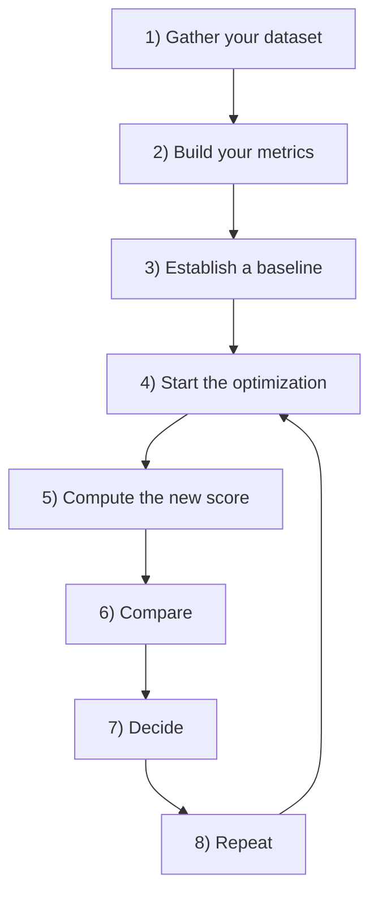

# Beyond Vibe Checks: A Framework for AI Evaluation

In our previous lessons, we instrumented our AI agents with observability tools like Opik and learned how to build offline datasets from production traces. With these foundational pieces in place, we can now move to the core of Evaluation-Driven Development (EDD): designing the metrics themselves. In classical Machine Learning, we rely on rigorous standards like accuracy, precision, and recall. In AI engineering, however, it is common to see teams rely on "vibe checks." This is a subjective sense that an output "feels more coherent" or "looks better."

Investing in a proper evaluation layer can feel difficult to prioritize. It delivers no immediate, user-visible feature and requires upfront effort to design datasets and metrics, all while competing with the pressure to ship. However, this same investment greatly accelerates long-term iteration. It provides an objective signal on every change, catches regressions instantly, and focuses your efforts on what truly improves the system. Evals are the north star of AI engineering. They are the single source of truth that tells you exactly which modifications improve your product and which degrade it.

In this lesson, we will establish the theoretical foundation for building a robust evaluation framework. We will cover:

-   The optimization flywheel and its three core use cases.
-   The trade-offs between different metric types for unstructured outputs.
-   Why custom business metrics are superior to public benchmarks and generic scores.
-   Why binary pass/fail judgments are more effective than Likert scales.

With the problem and its importance clear, we will now examine how to operationalize evaluations inside a repeatable optimization flywheel that replaces intuition with evidence.

## Using Evals Through the Optimization Flywheel

To build intuition, let's examine how we can effectively use and integrate AI evaluations into our application development lifecycle. There are three core scenarios where evaluations provide significant value.

First, evals **quantify the quality of your system**. They take a snapshot of your application's current performance against a set of given metrics, establishing a baseline. This baseline is your "golden dataset," a ground truth that represents the expected quality for a set of diverse inputs [[44]](https://towardsdatascience.com/stop-evaluating-llms-with-vibe-checks). Without a baseline, you cannot know if your system is production-ready or if your changes are leading to improvements. It provides a stable reference point for all future development.

Second, these metrics serve as **guidance when optimizing your system**. They provide objective evidence for your experiments, shifting development from being intuition-based to evidence-based [[3]](https://www.decodingai.com/p/escaping-poc-purgatory-evaluation). Instead of making changes based on a hunch, you can form a hypothesis, implement a change, and measure its impact against the baseline. This allows you to iterate with confidence, knowing that each change is measured against a consistent and meaningful standard. This systematic approach turns product development into a scientific process of experimentation and validation.

Finally, evals act as **regression tests** that protect shared components. Unlike optimization, the goal here is stability. This is critical in AI engineering, where components like prompts, tool definitions, and retrieval logic are often interconnected and shared across different parts of an application. A small change in a shared prompt intended to improve one feature can inadvertently break another. A comprehensive evaluation suite acts as a safety net, catching these regressions before they reach production and ensuring that new features do not degrade existing functionality.

### The Optimization Process

How does this look in a real-world scenario? The optimization flywheel provides a step-by-step plan of attack.

1.  **Gather your dataset:** Assemble an offline dataset that represents the diverse inputs your system will encounter. This dataset should cover a wide range of user personas, scenarios, and edge cases.
2.  **Build your metrics:** Define a set of business-aligned metrics that capture what "quality" means for your specific application. We will explore how to design these metrics later in this lesson.
3.  **Establish a baseline:** Run your evaluation suite on the current version of your system to compute baseline scores for each metric. This baseline represents your starting point.
4.  **Start the optimization:** Make one, isolated change that you believe will improve performance. This could be tweaking a prompt, changing a model parameter, or updating retrieval logic.
5.  **Compute the new score:** Re-evaluate the entire dataset by re-running the full evaluation suite on the modified system.
6.  **Compare:** Compare the new scores to your baseline, considering statistical significance to ensure the change is meaningful and not just random noise.
7.  **Decide:** Based on whether the score is better, the same, or worse, decide to keep the change, revert it, or reconsider its complexity and potential trade-offs.
8.  **Repeat:** Continue this cycle, making one change at a time, until your scores meet the desired quality threshold for production.

Image 1: The iterative optimization flywheel for AI applications using evaluations.

It is critical to change only one variable per cycle. If you modify the prompt and swap the model simultaneously, you create confounding variables. It becomes impossible to attribute any score changes to a specific modification, turning your evidence-based process back into guesswork [[27]](http://www.jmlr.org/papers/volume7/MLOPT-intro06a/MLOPT-intro06a.pdf). While isolating variables is the gold standard, akin to a randomized controlled trial, it is not always feasible in complex systems. When you cannot avoid making multiple changes, you are entering the domain of causal inference. This field provides statistical techniques like propensity score matching or difference-in-differences to help estimate the true effect of a change even with confounding variables, though they rely on assumptions that must be carefully validated [[56]](https://www.statsig.com/perspectives/causal-inference-in-product-experimentation).

The concept of "better" is always relative to your business use case. Statistical significance should be anchored to actual business impact, not arbitrary p-values [[47]](https://www.statsig.com/perspectives/understanding-statistical-significance). For a high-volume customer support bot processing two million checkouts per year, a 0.5% reduction in checkout errors might sound small. However, it translates to 10,000 fewer failed transactions. If each failure costs the business $15 in lost revenue or support time, that small improvement is worth $150,000 annually [[46]](https://www.nngroup.com/articles/practical-significance). In this context, even a small, statistically significant improvement matters.

In contrast, for a low-volume creative writing tool used by a small group of authors, a similar small improvement in a "creativity" score might be negligible. A much larger performance gain would be required before declaring victory and shipping the change, especially if the change increases cost or latency [[48]](https://www.quirks.com/articles/effective-uses-of-effect-size-statistics-to-demonstrate-business-value), [[49]](https://www.cloudresearch.com/resources/guides/statistical-significance/what-is-statistical-significance). This distinction is formalized in decision theory, which separates statistical significance (is the effect detectable?) from practical significance (is the effect large enough to matter?). Before starting an optimization cycle, you should pre-specify a practical significance threshold based on implementation costs, the scale of the application, and the task's criticality. This ensures you are optimizing for changes that deliver meaningful business value, not just chasing p-values [[55]](https://arxiv.org/html/2605.02050v1).

### Regression Testing

The optimization flywheel can be adapted for regression testing. Before merging any new feature that touches shared components—prompts, tools, or memory—you run the full evaluation suite to guard against breaking existing functionality. This practice mirrors the concept of "quality gates" from software engineering, where automated pass/fail checkpoints enforce standards on every change [[57]](https://www.softwareseni.com/building-quality-gates-for-ai-generated-code-with-practical-implementation-strategies). This is an effective technique to ensure new features do not degrade the performance of old ones.

The process involves five steps:

1.  **Implement a new feature:** You write the code and verify it works locally for the new use case. This initial check ensures the feature functions as intended in isolation.
2.  **Run the AI evaluations:** You run the full suite of assessments, covering all previous use cases, not just the new one. This comprehensive testing is crucial for detecting unintended side effects.
3.  **Compare Scores:** You compare the new scores against the established baseline for all existing use cases. The focus is on stability and ensuring that performance on old tasks has not degraded.
4.  **Metrics similar to baseline:** If the scores are identical or within an acceptable range of the baseline, your new feature has not introduced a regression. You can merge it into your production codebase.
5.  **Metrics lower than the baseline:** If any score is significantly worse, you have introduced a regression. You must fix your code and repeat the process until all scores are back to the baseline.

https://images.spr.so/cdn-cgi/imagedelivery/j42No7y-dcokJuNgXeA0ig/81fa7407-fdcd-4427-8468-669a31e2ca3f/ai_evals_-1/w=1920,quality=90,fit=scale-down
Image 2: Integrating AI evaluations into CI pipelines for regression testing.

This process is similar to unit or integration testing in traditional software, but with a key difference: instead of a strict pass/fail threshold, we often compare scores against a moving baseline. The goal is to ensure performance does not degrade, while allowing for slight variations inherent in AI systems.

Your evaluation dataset cannot remain static. It must continuously expand to remain effective. As you add new features, you must add new examples that cover their specific edge cases. Observability tools like Opik, which we covered in Lesson 27, are essential for capturing real-world failures from production traces [[29]](https://www.decodingai.com/p/generate-synthetic-datasets-for-ai-evals). These failures become new, high-value additions to your evaluation dataset. Instead of writing new tests in code, you broaden your test coverage by adding new, challenging samples to your dataset [[28]](https://www.comet.com/docs/opik/evaluation/advanced/manage_datasets).

For example, while debugging, you might discover that your agent fails when a user asks a multi-part question. You should add this specific example, along with several variations, to your dataset. This ensures that any future changes are tested against this known failure mode, preventing the same bug from reappearing.

With the flywheel mechanics clear, we can now examine the different families of metrics we might plug into it when dealing with unstructured outputs.

## Exploring Possible Metric Types

The core difficulty in evaluating AI systems is that we are often dealing with unstructured outputs like text or images. Unlike classical ML with structured labels, standard accuracy metrics are not directly applicable. We can group the available metrics into three core families.

### 1. BLEU and ROUGE

N-gram overlap metrics like BLEU (Bilingual Evaluation Understudy) and ROUGE (Recall-Oriented Understudy for Gisting Evaluation) work by counting lexical overlap. They measure how many words or phrases (n-grams) in the generated text match a reference text [[30]](https://wandb.ai/ai-team-articles/llm-evaluation/reports/LLM-evaluation-benchmarking-Beyond-BLEU-and-ROUGE--VmlldzoxNTIzMTY0NQ), [[33]](https://medium.com/@sthanikamsanthosh1994/understanding-bleu-and-rouge-score-for-nlp-evaluation-1ab334ecadcb). ROUGE has several variants, such as ROUGE-N for n-gram overlap, ROUGE-L for the longest common subsequence, and ROUGE-W, which gives more weight to longer matching sequences [[25]](https://datumo.com/en/blog/insight/key-nlp-evaluation-metrics/).

Their main advantages are that they are fast to compute, deterministic, widely understood, and require no additional models [[31]](https://www.traceloop.com/blog/demystifying-the-bleu-metric). However, they are blind to semantic meaning. They penalize correct answers that use different wording (paraphrasing) and cannot assess factual accuracy or logical reasoning [[30]](https://wandb.ai/ai-team-articles/llm-evaluation/reports/LLM-evaluation-benchmarking-Beyond-BLEU-and-ROUGE--VmlldzoxNTIzMTY0NQ), [[32]](https://docs.galileo.ai/concepts/metrics/expression-and-readability/bleu-and-rouge). For example, "The test was successful" would get a near-zero BLEU score if the reference is "The experiment succeeded," despite meaning the same thing [[30]](https://wandb.ai/ai-team-articles/llm-evaluation/reports/LLM-evaluation-benchmarking-Beyond-BLEU-and-ROUGE--VmlldzoxNTIzMTY0NQ).

### 2. BERTScore

Embedding similarity metrics, such as BERTScore or cosine similarity, address the semantic blindness of n-gram metrics. They use a language model like BERT to convert the generated text and the reference text into high-dimensional vectors (embeddings). The similarity between these embeddings is then calculated, typically using cosine similarity, to measure how close they are in meaning [[26]](https://spotintelligence.com/2024/08/20/bertscore/).

This approach is better at capturing semantic equivalence and recognizing paraphrases. However, it is still fundamentally a comparison metric. It cannot verify complex business logic or ensure adherence to specific guidelines that are not present in the reference text. Furthermore, it is more computationally expensive than lexical methods and its scores can be less interpretable [[26]](https://spotintelligence.com/2024/08/20/bertscore/).

### 3. LLM Judges

The LLM-as-a-judge approach uses a powerful LLM to evaluate an output based on a set of detailed criteria. You provide the judge model with the input, the generated output, a rubric defining what constitutes a "good" response, and often a few examples (few-shot learning) and chain-of-thought instructions [[35]](https://www.confident-ai.com/blog/why-llm-as-a-judge-is-the-best-llm-evaluation-method), [[39]](https://arize.com/llm-as-a-judge).

This method is highly flexible and can be customized to evaluate subjective qualities like tone, style, and adherence to complex, domain-specific rules [[50]](https://www.evidentlyai.com/llm-guide/llm-as-a-judge). For example, an LLM judge can check if a response is polite, follows a specific JSON schema, or avoids making medical claims. The main drawbacks are that performance depends heavily on the prompt and the judge model, and they can be slower, more expensive, and inherit the biases of the LLM [[52]](https://www.linkedin.com/posts/allaabdella_llm-aijudge-genai-activity-7353053642590932994-s3sw), [[53]](https://cameronrwolfe.substack.com/p/llm-as-a-judge). Despite these costs, their ability to provide detailed, human-like critiques makes them invaluable for many applications [[54]](https://www.confident-ai.com/blog/why-llm-as-a-judge-is-the-best-llm-evaluation-method).

| Metric Family | Speed | Cost | Semantic Awareness | Business Alignment | Explainability |
| :--- | :--- | :--- | :--- | :--- | :--- |
| **BLEU/ROUGE** | Very Fast | Very Low | Low | Very Low | High |
| **BERTScore** | Moderate | Low | High | Low | Moderate |
| **LLM Judges** | Slow | High | Very High | Very High | High (with CoT) |
Table 1: A trade-off summary of different metric families for evaluating unstructured text.

Given the complex requirements of our capstone writing agent—such as guideline adherence, structural fidelity, and grounding in research—LLM judges emerge as the most practical choice.

Now, you have heard from us repeatedly: *"business metrics here, business metrics there"*. Thus, let's understand why defining your own business metrics is such an essential and underrated step in building your AI evals strategy.

## Why Business Metrics Over Benchmarks

It is often a mistake to look at popular leaderboards or open benchmarks to find the best LLM for your product. Benchmarks are the most deceiving type of metric for two core reasons.

First, they often act as marketing artifacts. Once a test set becomes public, it is a target for overfitting. Teams may inadvertently or intentionally train their models on the test data, leading to inflated scores that do not reflect true capabilities on unseen data [[11]](https://www.evidentlyai.com/llm-guide/llm-benchmarks), [[15]](https://world.hey.com/bhari/ai-benchmark-scores-are-becoming-marketing-dynamic-eval-is-the-only-antidote-dedd7053). High scores can misrepresent actual reasoning ability, and using these benchmarks as feedback can even degrade a model's true performance [[23]](https://openreview.net/forum?id=XbVMiW0jTM). For example, the PROBE benchmark was designed to detect this "reasoning-level overfitting," where models memorize solution patterns for classic puzzles. The study found that even powerful models performed poorly on slight variations of these puzzles, revealing a gap between benchmark performance and genuine reasoning [[23]](https://openreview.net/forum?id=XbVMiW0jTM).

Second, there is a fundamental mismatch between the tasks in most benchmarks and the requirements of real-world business applications. A model's ability to solve math problems from the GSM8k benchmark says little about its capacity for long-form creative writing, nuanced legal analysis, or personalized customer support [[12]](https://magazine.sebastianraschka.com/p/llm-evaluation-4-approaches), [[14]](https://arxiv.org/html/2601.20617v1). If you are building an LLM for legal tasks, you need to evaluate it on your own proprietary legal data, not just a generic benchmark like MMLU [[12]](https://magazine.sebastianraschka.com/p/llm-evaluation-4-approaches).

The proper role for benchmarks is narrow. They are useful for advancing research and for initial model filtering during early exploration. They should never be used as a proxy for product-level decisions or as the primary target for optimization [[13]](https://launchdarkly.com/blog/llm-evaluation).

If benchmarks are misleading, generic prefab metrics that claim to measure universal qualities are even more dangerous. We must instead build metrics that are deeply tied to our specific application.

## Why Custom Business Metrics Over Generic Metrics

Generic, off-the-shelf metrics for qualities like "helpfulness," "toxicity," or "hallucination" create a mirage. They feel objective and produce a score, but they optimize for the wrong signal and create false confidence because they lack context about your product, your users, and your brand voice [[16]](https://www.linkedin.com/posts/shivanshu-aggarwal_evals-aievals-llm-activity-7375884554177449985-16kP), [[17]](https://www.decodingai.com/p/the-mirage-of-generic-ai-metrics). This problem has a strong parallel in healthcare AI evaluation. Researchers have found that generic machine learning metrics like the F1 score are often "improper" for clinical use because they can be gamed and do not account for the real-world costs of a misdiagnosis. A model can improve its F1 score with changes that make its clinical decisions worse. Just as in medicine, your AI metrics must measure utility for the end user, not just statistical performance [[58]](https://sarahgebauermd.substack.com/p/three-metrics-for-healthcare-ai-evaluation).

A model can score brilliantly on a generic "helpfulness" benchmark and still fail catastrophically on your specific constraints. Consider the dashboard below. It looks impressive, with scores for "Truthfulness" and "Personalization." But what does a 3.7 in "Personalization" actually mean? How do you improve it? These vague scores are not actionable.

https://images.spr.so/cdn-cgi/imagedelivery/j42No7y-dcokJuNgXeA0ig/585bb9f6-0bf3-427f-a9d3-994dd5849a1a/322c2e07-ee9a-4139-b51d-8f0c4787d880_1600x822/w=1920,quality=90,fit=scale-down
Image 3: A dashboard showing generic metrics like Helpfulness and Truthfulness, labeled "Don't Do This!" (Source [The 5-Star Lie: You’re Doing AI Evaluations Wrong](https://www.decodingai.com/p/the-5-star-lie-you-are-doing-ai-evals))

Let's assume we want to check if the article written by our Brown agent contains hallucinations. If we use a generic `hallucination` score and it returns "positive," what does that tell us? Did it add information not present in the research? Did it deviate from the article guidelines? Or did it simply include a personal story that was not in the source text but is factually correct and relevant? A generic detector cannot distinguish between undesirable invention and desirable creative elaboration. It might flag an engaging personal anecdote as a fabrication, even though that same anecdote is exactly what your brand voice requires.

Prefab scores are limited by their absence of domain-specific constraints and their inability to localize which part of an output failed. They also introduce statistical noise into your decision-making process [[18]](https://arxiv.org/html/2508.13816v1), [[20]](https://toloka.ai/blog/llm-evaluation-from-classic-metrics-to-modern-methods).

There is a narrow, valid role for generic metrics, but only during exploratory data analysis. They can act as a "flashlight" to surface interesting examples for manual review, not as a "report card" for grading overall quality. Here are a few ways to use them effectively:

1.  **Verbosity:** Sort your outputs by length. This can help you find rambling, unhelpful responses or, conversely, answers that are too curt. This is a simple way to spot potential failure modes in long-form generation.
2.  **Similarity Score:** Use a similarity metric to evaluate your RAG retriever specifically. If the similarity between a user's query and the retrieved document chunks is consistently low, it is a strong signal that your retriever is failing. This is a valid component-level check.
3.  **BERTScore:** Use this to check the quality of your "golden" reference answers. If you find a cluster of generated outputs with a low BERTScore against a reference you expected to be similar, a manual review might reveal that the LLM found a more creative or even a better way to solve the problem.

In all these cases, the generic metric is the starting point of an investigation, not the final verdict [[19]](https://galileo.ai/blog/human-evaluation-metrics-ai). Every production metric must be deeply application-centric, derived from concrete product requirements, user success criteria, and explicit constraints.

Once we have rejected both benchmarks and generic metrics, the remaining design choice is how to elicit judgments from our LLM judge. Here, binary pass/fail criteria outperform every alternative.

## Choosing Binary Metrics Over Anything Else

When designing these custom metrics, you will face a choice: should you use a Likert scale (e.g., 1-5 stars) or a binary pass/fail?

We strongly recommend **binary metrics**.

Likert scales are a seductive trap. They promise nuance but often deliver noise and ambiguity. They suffer from several problems [[4]](https://www.decodingai.com/p/the-5-star-lie-you-are-doing-ai-evals):

1.  **Inconsistent Labeling:** The difference between a '3' and a '4' is subjective. One person's '4' is another's '3', leading to low inter-annotator agreement and a fuzzy rubric [[5]](https://www.ellamind.com/blog/binary-vs-likert-scales).
2.  **Statistical Noise:** Detecting a meaningful improvement from an average score of 3.2 to 3.4 requires a much larger sample size than detecting a shift in a binary pass rate from 75% to 80%. You can waste weeks on changes without knowing if you are making real progress [[5]](https://www.ellamind.com/blog/binary-vs-likert-scales). From an information theory perspective, the ambiguity in a 1-5 scale introduces entropy (uncertainty). This noise reduces the mutual information between your system change and the measured outcome [[59]](https://arxiv.org/html/2602.07168). Binary metrics provide a cleaner signal.
3.  **Lazy Decision-Making:** Annotators and LLM judges often default to the middle value ('3') to avoid a difficult judgment. This "satisficing" behavior hides uncertainty rather than resolving it, leaving you with a dashboard of vague "okay" scores [[4]](https://www.decodingai.com/p/the-5-star-lie-you-are-doing-ai-evals), [[6]](https://www.scribbr.com/methodology/likert-scale), [[7]](https://inmoment.com/blog/likert-scale).

Binary evaluations work because they **force decisions**. An output either met the specific criterion or it did not. This simple constraint pushes you toward a more rigorous, error-analysis-driven workflow. The benefits are immediate:

1.  **Clearer Thinking:** You cannot hide in ambiguity. This sharpens your definitions of quality.
2.  **Consistency:** Binary decisions are faster and more consistent for both human annotators and LLM judges, increasing throughput and reliability.
3.  **Actionability:** The output is not a fuzzy number but a clear signal tied to a specific problem. A spike in the "Constraint Violation" failure rate tells an engineer exactly where to start debugging.

<aside>
💡

**Note:** The three points above translate exceptionally well to LLM Judges. Using binary scoring is a key design choice to mitigate the inherent randomness of LLMs. LLMs are much more stable when asked to make a binary decision than when asked to assign a scalar value. A binary metric translates to a more robust and repeatable evaluation pipeline.

</aside>

### Capturing Nuance

The standard objection is that binary metrics lose the nuance of a 1-5 scale. This is a valid concern, but the solution is not a fuzzier scale, but more granular criteria [[9]](https://www.ellamind.com/blog/binary-vs-likert-scales). Instead of one subjective rating, you decompose a complex quality into multiple, specific, binary checks [[10]](https://medium.com/@adnanmasood/rubric-based-evals-llm-as-a-judge-methodologies-and-empirical-validation-in-domain-context-71936b989e80).

For our writing agent, instead of rating an article 1-5 for "Quality," we can create multiple binary evaluations that capture specific dimensions of quality:

1.  **Content Adherence:** Does the generated article contain the same core concepts as the expected article? (Yes/No)
2.  **Flow of Ideas Adherence:** Does the generated article contain the ideas in the same order as the expected article? (Yes/No)
3.  **Article Guideline Adherence:** Does the generated article follow the flow of ideas from the article guideline input? (Yes/No)
4.  **Research Anchoring:** Is every claim in the article supported by the provided research? (Yes/No)

Decision theory offers a formal way to set these thresholds. A method like net benefit analysis defines a pass/fail cutoff by weighing the business costs of a false positive versus a false negative, connecting your evaluation directly to real-world trade-offs [[58]](https://sarahgebauermd.substack.com/p/three-metrics-for-healthcare-ai-evaluation).

Aggregating these binary signals gives you a nuanced view of performance. You can now say, "Our system passes Content Adherence 95% of the time but fails Research Anchoring 30%," an actionable insight. This captures nuance without sacrificing clarity and allows you to track each dimension independently.

With the full theoretical picture in place, we can now summarize the mindset shift required and preview the hands-on implementation that follows in the next lesson.

## Conclusion

The path to building a robust AI product requires a shift away from vibe checks, leaderboards, and generic scores. It demands a commitment to rigorous, evaluation-driven development built on a foundation of custom, binary, and business-aligned metrics. Granular pass/fail criteria deliver the clearest optimization signal, avoiding the statistical noise and subjectivity inherent in scalar ratings. This systematic approach is the engine of product improvement, turning a messy, intuition-driven process into a disciplined engineering practice.

In our next lesson, we will translate this theory into practice by implementing and calibrating custom LLM judges from scratch to evaluate our Brown writing workflow.

## References

- [1] Galileo. (n.d.). [A Powerful Data Flywheel for De-Risking Agentic AI](https://galileo.ai/blog/nvidia-data-flywheel-for-de-risking-agentic-ai)
- [2] NVIDIA. (n.d.). [What Is a Data Flywheel?](https://www.nvidia.com/en-us/glossary/data-flywheel)
- [3] Iusztin, P. (2025, October 16). [Escaping POC Purgatory: Evaluation-Driven Development for AI Systems](https://www.decodingai.com/p/escaping-poc-purgatory-evaluation)
- [4] Iusztin, P. (2025, October 30). [The 5-Star Lie: You’re Doing AI Evaluations Wrong](https://www.decodingai.com/p/the-5-star-lie-you-are-doing-ai-evals)
- [5] EllaMind. (n.d.). [Binary vs Likert Scales in LLM Evaluation](https://www.ellamind.com/blog/binary-vs-likert-scales)
- [6] Streefkerk, R. (2023, June 22). [Likert Scale | Definition, Examples, and Analysis](https://www.scribbr.com/methodology/likert-scale)
- [7] InMoment. (n.d.). [What Is a Likert Scale? And How to Use It](https://inmoment.com/blog/likert-scale)
- [8] Iusztin, P. (2025, October 30). [Stop Launching AI Apps Without This Framework](https://www.decodingai.com/p/stop-launching-ai-apps-without-this)
- [9] Husain, H. (2025, November 11). [The 5-Star Lie: You’re Doing AI Evaluations Wrong](https://www.ellamind.com/blog/binary-vs-likert-scales)
- [10] Masood, A. (2024, May 15). [Rubric-Based Evals, LLM-as-a-Judge Methodologies and Empirical Validation in Domain Context](https://medium.com/@adnanmasood/rubric-based-evals-llm-as-a-judge-methodologies-and-empirical-validation-in-domain-context-71936b989e80)
- [11] Evidently AI. (n.d.). [LLM benchmarks: all you need to know](https://www.evidentlyai.com/llm-guide/llm-benchmarks)
- [12] Raschka, S. (2024, February 19). [4 Approaches to Evaluating LLMs](https://magazine.sebastianraschka.com/p/llm-evaluation-4-approaches)
- [13] Kumar, A. (2024, April 18). [LLM evaluation: A comprehensive guide to validation and testing](https://launchdarkly.com/blog/llm-evaluation)
- [14] Kapoor, S., et al. (2025). [Reliability, Contamination, and Evolution in LLM Agents](https://arxiv.org/html/2601.20617v1)
- [15] Hari, B. (2026, April 26). [AI — Benchmark scores are becoming marketing; dynamic eval is the only antidote](https://world.hey.com/bhari/ai-benchmark-scores-are-becoming-marketing-dynamic-eval-is-the-only-antidote-dedd7053)
- [16] Aggarwal, S. (2025, September 29). [AI evaluation is broken when we hide behind generic metrics](https://www.linkedin.com/posts/shivanshu-aggarwal_evals-aievals-llm-activity-7375884554177449985-16kP)
- [17] Husain, H. (2025, September 29). [The Mirage of Generic AI Metrics](https://www.decodingai.com/p/the-mirage-of-generic-ai-metrics)
- [18] Belz, A., et al. (2025). [On the State of the Art in Evaluation in Natural Language Generation](https://arxiv.org/html/2508.13816v1)
- [19] Galileo. (n.d.). [Human Evaluation Metrics in AI: A Practical Guide](https://galileo.ai/blog/human-evaluation-metrics-ai)
- [20] Toloka. (n.d.). [LLM Evaluation: From Classic Metrics to Modern Methods](https://toloka.ai/blog/llm-evaluation-from-classic-metrics-to-modern-methods)
- [21] Husain, H. (n.d.). [Using LLM-as-a-Judge For Evaluation: A Complete Guide](https://hamel.dev/blog/posts/llm-judge/)
- [22] Yan, E. (2024, July 7). [Evaluating the Effectiveness of LLM-Evaluators (aka LLM-as-Judge)](https://eugeneyan.com/writing/llm-evaluators/)
- [23] Shi, F., et al. (2024). [PROBE: BENCHMARKING REASONING PARADIGM OVERFITTING IN LARGE LANGUAGE MODELS](https://openreview.net/forum?id=XbVMiW0jTM)
- [24] Mansuy, R. (2023, September 20). [Evaluating NLP Models: A Comprehensive Guide to ROUGE, BLEU, METEOR, and BERTScore Metrics](https://plainenglish.io/blog/evaluating-nlp-models-a-comprehensive-guide-to-rouge-bleu-meteor-and-bertscore-metrics-d0f1b1)
- [25] Datumo. (2024, November 1). [Key NLP Evaluation Metrics](https://datumo.com/en/blog/insight/key-nlp-evaluation-metrics/)
- [26] Van Otten, N. (2024, August 20). [BERTScore explained: A modern metric for evaluating text generation](https://spotintelligence.com/2024/08/20/bertscore/)
- [27] Platt, J. C. (2006). [Sequential Minimal Optimization for SVM](http://www.jmlr.org/papers/volume7/MLOPT-intro06a/MLOPT-intro06a.pdf)
- [28] Comet. (n.d.). [Managing Datasets in Opik](https://www.comet.com/docs/opik/evaluation/advanced/manage_datasets)
- [29] Iusztin, P. (2025, October 30). [Generate Synthetic Datasets for AI Evals](https://www.decodingai.com/p/generate-synthetic-datasets-for-ai-evals)
- [30] Ferrer, J. (2025, December 9). [LLM evaluation benchmarking: Beyond BLEU and ROUGE](https://wandb.ai/ai-team-articles/llm-evaluation/reports/LLM-evaluation-benchmarking-Beyond-BLEU-and-ROUGE--VmlldzoxNTIzMTY0NQ)
- [31] Traceloop. (n.d.). [Demystifying the BLEU Metric](https://www.traceloop.com/blog/demystifying-the-bleu-metric)
- [32] Galileo. (n.d.). [BLEU and ROUGE](https://docs.galileo.ai/concepts/metrics/expression-and-readability/bleu-and-rouge)
- [33] S, S. (2023, April 13). [Understanding BLEU and ROUGE score for NLP evaluation](https://medium.com/@sthanikamsanthosh1994/understanding-bleu-and-rouge-score-for-nlp-evaluation-1ab334ecadcb)
- [34] Elastic. (n.d.). [Evaluating RAG: A deep dive into metrics](https://www.elastic.co/search-labs/blog/evaluating-rag-metrics)
- [35] Confident AI. (n.d.). [Why LLM-as-a-Judge is the Best LLM Evaluation Method](https://www.confident-ai.com/blog/why-llm-as-a-judge-is-the-best-llm-evaluation-method)
- [36] Arize. (2024, May 15). [LLM-as-a-Judge: When to Use Reasoning (CoT) and Explanations](https://medium.com/data-science-collective/llm-as-a-judge-when-to-use-reasoning-cot-and-explanations-964ad82ebc3d)
- [37] Arize. (2024, May 15). [Evidence-Based Prompting Strategies for LLM-as-a-Judge: Explanations and Chain-of-Thought](https://arize.com/blog/evidence-based-prompting-strategies-for-llm-as-a-judge-explanations-and-chain-of-thought)
- [38] Braintrust. (n.d.). [What is LLM-as-a-judge?](https://www.braintrust.dev/articles/what-is-llm-as-a-judge)
- [39] Arize. (n.d.). [LLM-as-a-Judge](https://arize.com/llm-as-a-judge)
- [40] Olshansky, D. (2024, May 19). [Vibe Checks Are All You Need](https://olshansky.substack.com/p/vibe-checks-are-all-you-need)
- [41] Zhang, Y., et al. (2024). [VibeCheck: A Self-Supervised Metric for Text-to-Image Generation](https://arxiv.org/html/2410.12851v1)
- [42] GrowthBook. (n.d.). [AI Evals vs. A/B Testing: Why You Need Both to Ship GenAI](https://www.growthbook.io/blog/ai-evals-vs-a-b-testing-why-you-need-both-to-ship-genai)
- [43] Google Cloud. (2024, May 15). [From Vibe Checks to Continuous Evaluation: Engineering Reliable AI Agents](https://cloud.google.com/blog/topics/developers-practitioners/from-vibe-checks-to-continuous-evaluation-engineering-reliable-ai-agents)
- [44] Towards Data Science. (2024, May 15). [Stop Evaluating LLMs with Vibe Checks](https://towardsdatascience.com/stop-evaluating-llms-with-vibe-checks)
- [45] Corporate Finance Institute. (n.d.). [Statistical Significance](https://corporatefinanceinstitute.com/resources/data-science/statistical-significance)
- [46] Budiu, R. (2022, November 20). [Practical vs. Statistical Significance](https://www.nngroup.com/articles/practical-significance)
- [47] Statsig. (n.d.). [Understanding Statistical Significance](https://www.statsig.com/perspectives/understanding-statistical-significance)
- [48] Burns, A. (2001, October 1). [Effective uses of effect size statistics to demonstrate business value](https://www.quirks.com/articles/effective-uses-of-effect-size-statistics-to-demonstrate-business-value)
- [49] CloudResearch. (n.d.). [What is Statistical Significance?](https://www.cloudresearch.com/resources/guides/statistical-significance/)
- [50] Evidently AI. (2026, May 19). [LLM-as-a-judge: a complete guide to using LLMs for evaluations](https://www.evidentlyai.com/llm-guide/llm-as-a-judge)
- [51] Galileo. (n.d.). [LLM-as-a-Judge vs. Human Evaluation](https://galileo.ai/blog/llm-as-a-judge-vs-human-evaluation)
- [52] Abdella, A. (2025, July 15). [LLM as a Judge](https://www.linkedin.com/posts/allaabdella_llm-aijudge-genai-activity-7353053642590932994-s3sw)
- [53] Wolfe, C. (2024, February 26). [LLM as a Judge](https://cameronrwolfe.substack.com/p/llm-as-a-judge)
- [54] Confident AI. (n.d.). [Why LLM-as-a-Judge is the Best LLM Evaluation Method](https://www.confident-ai.com/blog/why-llm-as-a-judge-is-the-best-llm-evaluation-method)
- [55] Benjamin, D., et al. (2024). [Guidelines for transparent and credible causal inference in education RCTs with AI](https://arxiv.org/html/2605.02050v1)
- [56] Statsig. (2024, November 15). [Causal inference in product experimentation](https://www.statsig.com/perspectives/causal-inference-in-product-experimentation)
- [57] SoftwareSeni. (n.d.). [Building Quality Gates for AI-Generated Code with Practical Implementation Strategies](https://www.softwareseni.com/building-quality-gates-for-ai-generated-code-with-practical-implementation-strategies)
- [58] Gebauer, S. (2024). [Three Metrics for Healthcare AI Evaluation You Need to Know](https://sarahgebauermd.substack.com/p/three-metrics-for-healthcare-ai-evaluation)
- [59] Yang, Z., et al. (2026). [Information Theoretic Analysis of Post-Processing in X-ray CT](https://arxiv.org/html/2602.07168)