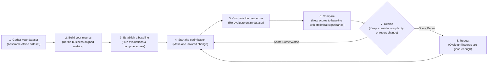
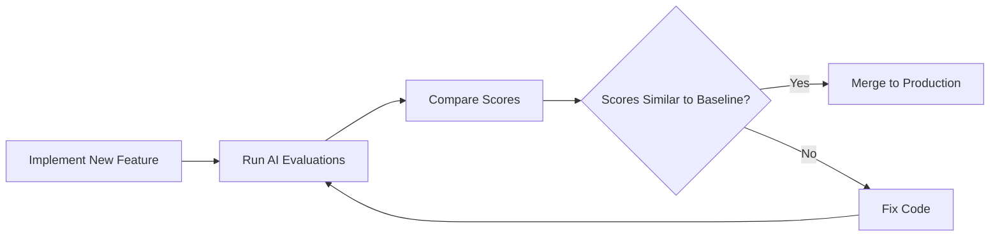

# Lesson 29: The Theoretical Foundations of AI Evals

In our previous lessons, we instrumented our agents with observability tools like Opik and assembled our first offline evaluation datasets. We now have the raw materials for evaluation: traces and test cases. But how do we move from a folder of examples to a rigorous, repeatable system for measuring quality? With a well-defined evaluation layer, we know exactly what to optimize, and when developing new features, we can easily catch regressions.

This lesson moves to the core theoretical framework of designing the metrics themselves. In classical machine learning, we would never ship a model without a deep understanding of its accuracy, precision, recall, and F1 score, all validated with statistical significance. Yet in AI engineering, it has become common to rely on "vibe checks"—running a few queries and deciding a change "feels more coherent." This intuition-driven approach is a primary reason so many AI projects get stuck in proof-of-concept purgatory.

Investing in a proper evaluation layer can feel difficult to prioritize. It delivers no immediate user-visible feature, requires upfront effort to design datasets and metrics, and competes with the constant pressure to ship new functionality. However, this investment is what unlocks long-term velocity. It replaces subjective guesswork with an objective signal that quantifies the impact of every change, catches regressions instantly, and focuses your team on what actually improves the system. Evals are the north star of AI engineering: the single source of truth that guides you toward a better product.

In this lesson, we will establish the theoretical foundation for evaluation-driven development. We will cover:
- How to operationalize evals inside a repeatable optimization flywheel.
- The trade-offs between different metric types for unstructured outputs.
- Why custom, business-aligned metrics are superior to public benchmarks and generic scores.
- Why binary pass/fail judgments provide a clearer signal than 1-5 star ratings.

With the problem and its importance clear, we will now examine how to operationalize evals inside a repeatable optimization flywheel that replaces intuition with evidence.

## Using Evals Through the Optimization Flywheel

To build intuition, let's examine how we can effectively use and integrate AI evaluations into our application development lifecycle. There are three core scenarios where evaluations provide value.

First, evals **quantify the quality of your system** on a given set of metrics, creating a baseline snapshot of its current performance. Without a baseline, you cannot know if your system is production-ready or if your changes are making it better or worse. Second, these metrics serve as **guidance when optimizing your system**. They provide objective evidence for experiments, shifting development from being intuition-based to evidence-based. Finally, evals act as **regression tests** that protect shared components from unintended degradation. This is critical in AI engineering, where prompts, tools, and retrieval strategies are often interconnected, and a small change in one area can have unforeseen consequences elsewhere.

### The Optimization Process

How does this look in a real-world scenario? The optimization flywheel provides a step-by-step plan of attack.

1.  **Gather your dataset:** Assemble an offline dataset of representative examples, as we discussed in Lesson 28.
2.  **Build your metrics:** Define a set of metrics that are deeply aligned with your business goals.
3.  **Establish a baseline:** Run your evaluation suite on the current version of your system to compute baseline scores.
4.  **Start the optimization:** Make one, and only one, isolated change that you believe will improve performance.
5.  **Compute the new score:** Re-run the entire evaluation suite on the modified system.
6.  **Compare:** Compare the new scores to your baseline, checking for statistical significance.
7.  **Decide:** Based on whether the score is better, the same, or worse, decide to keep the change, revert it, or reconsider its complexity.
8.  **Repeat:** Continue this cycle until your scores meet the desired quality bar for production.

Image 1: An eight-step iterative optimization flywheel for AI applications using evaluations.

It is critical to keep all components fixed except for one variable per cycle. If you change the prompt, the model, and the retrieval strategy all at once, it becomes impossible to attribute any score movement to a specific cause. This turns a disciplined engineering process back into guesswork.

Furthermore, you must anchor the concept of a "better" score to actual business impact, not arbitrary p-values. A result being statistically significant says nothing about how valuable it is to users or the business [[46]](https://www.nngroup.com/articles/practical-significance). The practical significance depends entirely on your use case. For a high-volume customer support bot processing millions of requests, a 0.5% reduction in checkout errors could translate to hundreds of thousands of dollars in saved revenue and support costs. In this context, even a small, statistically significant improvement has a massive business impact [[46]](https://www.nngroup.com/articles/practical-significance). In contrast, for a low-volume internal creative writing tool, a similar percentage improvement might be negligible. "Better" is always relative to the business problem you are trying to solve.

### Regression Testing

A powerful variant of this flywheel is using evaluations for regression testing. Before merging any new feature that touches shared components—prompts, tool definitions, orchestration logic, or memory retrieval—you run the full evaluation suite. This guards against breaking existing functionality.

This is because AI systems fail in ways that traditional software testing never anticipated. A unit test cannot catch a plausible-sounding but completely fabricated answer, and an integration test will not sound an alarm when performance degrades gradually as user behavior shifts. This is why structured evaluation frameworks are not just best practices; they are the core infrastructure that separates organizations deploying AI responsibly from those simply rolling the dice [[55]](https://agility-at-scale.com/ai/architecture/evaluation-and-testing-frameworks).

Running AI evaluations as regression tests is a powerful technique to ensure new features do not break old ones. The process can be adapted from the optimization flywheel into five steps:

1.  **Implement a new feature:** You write the code and verify it works locally for the new use case.
2.  **Run the AI evaluations:** You run the full suite of assessments, covering all previous use cases, not just the new one.
3.  **Compare Scores:** You compare the new scores from your feature branch against the baseline scores from the main branch.
4.  **Metrics similar to baseline:** If the scores are statistically identical to the baseline, your feature has not introduced a regression. You can merge it into your production codebase.
5.  **Metrics lower than the baseline:** If the scores are worse, you have introduced a regression. You must fix your code and then repeat the evaluation cycle.

Image 2: A flowchart illustrating the five-step regression testing process using AI evaluations within CI pipelines.

This treats your evaluation suite like unit or integration tests, but with a crucial difference: instead of asserting a strict pass or fail, you compare performance against a moving baseline. This is necessary because of the probabilistic nature of AI systems.

Your evaluation dataset must be a living artifact. It should continuously expand with edge cases from new features, real-world failures captured from production traces via observability tools like Opik, and difficult examples that expose current failure modes [[28]](https://www.comet.com/docs/opik/evaluation/advanced/manage_datasets), [[29]](https://www.decodingai.com/p/generate-synthetic-datasets-for-ai-evals). For example, when debugging a regression found in production, you should add the specific trace that caused the failure to your evaluation dataset. This ensures that once you fix the issue, the same regression will be caught automatically in the future. In AI engineering, you broaden your test coverage not just by writing new test code, but by adding new, challenging samples to your dataset.

With the flywheel mechanics clear, we can now examine the different families of metrics we might plug into it when dealing with unstructured text and image outputs.

## Exploring Possible Metric Types

The core difficulty in evaluating LLM applications is that we are often dealing with unstructured outputs like text, reasoning traces, or images. Unlike classical ML with its clean, structured labels, we cannot use standard accuracy metrics directly. This has led to the development of several families of metrics, each with its own trade-offs.

### 1. BLEU and ROUGE

Metrics like BLEU (Bilingual Evaluation Understudy) and ROUGE (Recall-Oriented Understudy for Gisting Evaluation) are based on lexical overlap. They work by counting the overlap of n-grams (sequences of words) between the generated text and a reference text [[Evaluating NLP Models: A Comprehensive Guide to ROUGE, BLEU, METEOR, and BERTScore Metrics]](https://plainenglish.io/blog/evaluating-nlp-models-a-comprehensive-guide-to-rouge-bleu-meteor-and-bertscore-metrics-d0f1b1). They are fast and deterministic but are blind to semantic meaning, penalizing correct paraphrasing and ignoring factual accuracy or logic [[30]](https://wandb.ai/ai-team-articles/llm-evaluation/reports/LLM-evaluation-benchmarking-Beyond-BLEU-and-ROUGE--VmlldzoxNTIzMTY0NQ), [[33]](https://medium.com/@sthanikamsanthosh1994/understanding-bleu-and-rouge-score-for-nlp-evaluation-1ab334ecadcb).

### 2. BERTScore

Embedding similarity metrics, like BERTScore, represent an improvement over lexical methods. They use a pre-trained language model like BERT to embed both the generated text and the reference text into a high-dimensional vector space. The similarity between these embeddings is used as the evaluation score [[BERTScore explained: A modern metric for evaluating text generation]](https://spotintelligence.com/2024/08/20/bertscore/). This captures semantic closeness better than lexical overlap but remains a comparison metric, unable to verify complex business rules or logical reasoning [[34]](https://www.elastic.co/search-labs/blog/evaluating-rag-metrics).

### 3. LLM Judges

The LLM-as-a-judge approach uses a powerful LLM to evaluate the output of another model. You provide the judge model with the original input, the generated output, a detailed set of evaluation criteria, and often a few-shot examples and chain-of-thought instructions [[35]](https://www.confident-ai.com/blog/why-llm-as-a-judge-is-the-best-llm-evaluation-method), [[39]](https://arize.com/llm-as-a-judge). The approach gained popularity with the release of GPT-4, as it was one of the first models powerful enough to reliably evaluate the nuances of text generated by other models [[56]](https://cameronrwolfe.substack.com/p/llm-as-a-judge). This method is highly flexible and can be customized to evaluate against complex, domain-specific requirements that other metrics cannot capture. For example, you can ask an LLM judge to verify if a generated legal summary correctly identifies all relevant precedents while maintaining a formal tone.

The main advantage of LLM judges is their ability to evaluate subjective qualities and provide detailed, human-like critiques [[50]](https://www.evidentlyai.com/llm-guide/llm-as-a-judge). However, their performance is highly dependent on the quality of the prompt and the capability of the evaluator model. They can also be slower and more expensive than automated metrics and may inherit the biases of the underlying LLM if not carefully designed and tested [[52]](https://www.linkedin.com/posts/allaabdella_llm-aijudge-genai-activity-7353053642590932994-s3sw), [[53]](https://cameronrwolfe.substack.com/p/llm-as-a-judge). These weaknesses can be mitigated through calibration, such as using multi-judge consensus or aligning the judge with human-scored golden datasets to correct for bias [[57]](https://galileo.ai/blog/llm-as-a-judge-vs-human-evaluation), [[58]](https://deepchecks.com/llm-judge-calibration-automated-issues).

Table 1: A comparison of trade-offs between different metric families for AI evaluations.

| Metric Family | Speed | Cost | Semantic Awareness | Business Alignment | Explainability |
| :--- | :--- | :--- | :--- | :--- | :--- |
| **BLEU/ROUGE** | High | Low | Low | Low | Medium |
| **BERTScore** | Medium | Medium | High | Low | Low |
| **LLM Judges** | Low | High | Very High | Very High | High |

For complex tasks like our capstone writing workflow, which requires adherence to specific guidelines, structural fidelity, and grounding in research, LLM judges are the most practical choice. They are the only method that can flexibly encode and evaluate against such nuanced, multi-faceted criteria.

Now, you keep hearing from us: *"business metrics here, business metrics there"*. Thus, let's understand why defining your own business metrics is such an essential and underrated step in building your AI evals strategy.

## Why Business Metrics Over Benchmarks

It is a common mistake to look at popular leaderboards or open benchmarks to select a model or make product decisions. Benchmarks are often the most deceiving type of metric, and relying on them is a path to failure [[13]](https://launchdarkly.com/blog/llm-evaluation).

There are two core reasons for this. First, public benchmarks often function as marketing artifacts. Once a test set becomes public, models can be trained on the test data, intentionally or not, leading to data contamination and inflated scores [[11]](https://www.evidentlyai.com/llm-guide/llm-benchmarks), [[15]](https://world.hey.com/bhari/ai-benchmark-scores-are-becoming-marketing-dynamic-eval-is-the-only-antidote-dedd7053). This "training to the test" means the benchmark no longer represents unseen data, and high scores become a misleading indicator of a model's true reasoning ability [[Benchmark Overfitting in Large Language Models]](https://openreview.net/forum?id=XbVMiW0jTM). There have even been instances where models were deliberately fine-tuned on test sets just to climb the leaderboards.

Second, there is a fundamental mismatch between the tasks found in most benchmarks and the workloads of real business applications. A model's ability to solve grade-school math problems (like in GSM8K) or answer multiple-choice questions (like in MMLU) has little bearing on its performance in tasks like long-form creative writing, nuanced legal analysis, or personalized customer support [[12]](https://magazine.sebastianraschka.com/p/llm-evaluation-4-approaches), [[14]](https://arxiv.org/html/2601.20617v1).

The proper role for benchmarks is narrow: they are useful for advancing research frontiers and for initial model filtering during the early exploration phase of a project. They should never be used as a proxy for product-level decisions or as the primary target for optimization.

If benchmarks are misleading, generic prefab metrics that claim to measure universal qualities are even more dangerous. We must instead build metrics that are deeply tied to our specific application.

## Why Custom Business Metrics Over Generic Metrics

Generic, off-the-shelf metrics for qualities like "toxicity," "helpfulness," or "hallucination" create a mirage of progress. They optimize for the wrong signal and generate false confidence because they lack essential context about your product, your users, and your brand voice [[16]](https://www.linkedin.com/posts/shivanshu-aggarwal_evals-aievals-llm-activity-7375884554177449985-16kP), [[The Mirage of Generic AI Metrics]](https://www.decodingai.com/p/the-mirage-of-generic-ai-metrics). A model can score brilliantly on a generic "helpfulness" metric but fail catastrophically on your specific constraints.

Consider the dashboard below. It looks impressive, with scores for "Truthfulness" and "Personalization." But what does a 3.7 in "Personalization" actually mean? And what should the team do to improve it? These vague scores are often un-actionable vanity metrics [[The 5-Star Lie: You’re Doing AI Evaluations Wrong]](https://www.decodingai.com/p/the-5-star-lie-you-are-doing-ai-evals).
Image 3: A dashboard showing generic metrics like Helpfulness and Truthfulness, labeled "Don't Do This!" (Source [The 5-Star Lie: You’re Doing AI Evaluations Wrong](https://www.decodingai.com/p/the-5-star-lie-you-are-doing-ai-evals))

Let's assume we want to check if the article written by our Brown agent contains hallucinations. A generic `hallucination` score might return "positive," but what does that tell us? Did the model invent information not present in the research? Did it deviate from the article guidelines? Or did it simply include a personal story that, while not in the source text, is factually correct and relevant to the narrative? A generic detector might flag an engaging personal anecdote as a fabrication, but that same anecdote might be exactly what your brand voice requires. The generic metric cannot distinguish between undesirable invention and desirable creative elaboration.

Prefab scores suffer from several limitations: they cannot account for domain-specific constraints, they cannot localize which part of an output failed, and they introduce additional statistical noise into your decision-making process.

This does not mean generic metrics are useless. They have a narrow but valid role during exploratory data analysis. You can use them as a "flashlight" to surface interesting examples for manual review, not as a final "report card" for quality [[The Mirage of Generic AI Metrics]](https://www.decodingai.com/p/the-mirage-of-generic-ai-metrics). Here are some examples:
1.  **Verbosity:** Sort your outputs by length. This can help you quickly find responses that are either too brief and unhelpful or too long and rambling, pointing to potential failure modes in your generation logic.
2.  **Similarity Score:** In a RAG system, you can use a similarity score to evaluate the retriever component specifically. A low similarity between the user's query and the retrieved document chunks is a strong signal that your retriever is failing.
3.  **BERTScore:** Use this to challenge your own assumptions about what a "good" answer is. If you have a set of "golden" reference answers and find a cluster of generated outputs with low BERTScore, a manual review might reveal that the LLM found a more creative or even more correct solution than the one you provided.

In all these cases, the generic metric is the start of an investigation, not the final verdict. Every production metric must be deeply application-centric, derived from concrete product requirements, user success criteria, and explicit constraints.

Once we have rejected both benchmarks and generic metrics, the remaining design choice is how to elicit judgments from our LLM judge. Here, binary pass/fail criteria outperform every alternative.

## Choosing Binary Metrics Over Anything Else

When designing these custom metrics, you will face a choice: should you use a Likert scale (e.g., 1-5 stars) or a binary pass/fail? We strongly recommend **binary metrics**.

Likert scales are a seductive trap. They promise nuance but often deliver noise. They suffer from several core problems [[4]](https://www.decodingai.com/p/the-5-star-lie-you-are-doing-ai-evals), [[5]](https://www.ellamind.com/blog/binary-vs-likert-scales):
1.  **Inconsistent Labeling:** The difference between a '3' and a '4' is subjective. One person's '4' is another's '3', leading to low inter-annotator agreement and a fuzzy rubric.
2.  **Statistical Noise:** Detecting a meaningful improvement from an average score of 3.2 to 3.4 is difficult to distinguish from random variance and requires a much larger sample size than detecting a shift in a binary pass rate. For one common scenario, moving from a 60% to 70% pass rate requires less than half the samples to reach statistical significance compared to an equivalent shift on a 5-point scale [[5]](https://www.ellamind.com/blog/binary-vs-likert-scales).
3.  **Lazy Decision-Making:** Annotators—both human and LLM—often default to the middle value ('3') to avoid making a difficult judgment. This creates a "mushy middle" where most ratings cluster, hiding uncertainty rather than resolving it and leaving you with a sea of '3's that tells you your system is vaguely "okay" but not what to fix [[4]](https://www.decodingai.com/p/the-5-star-lie-you-are-doing-ai-evals), [[5]](https://www.ellamind.com/blog/binary-vs-likert-scales).

Binary evaluations solve these problems by forcing clarity. The benefits are immediate:
1.  **Clearer Thinking:** You cannot hide in ambiguity. An output either met a specific criterion or it did not. This forces you to create precise, unambiguous definitions of quality.
2.  **Consistency:** Binary decisions are faster and more consistent for both humans and LLMs, leading to higher agreement and a more reliable signal.
3.  **Actionability:** The output is not a fuzzy number but a clear signal tied to a specific failure mode. A spike in the "Constraint Violation" failure rate tells an engineer exactly where to start debugging.

The real value is often in the reasoning, not the score. A binary "Fail" paired with an explanation provides a specific diagnosis of what to fix, whereas a numeric '3' is ambiguous. This is why pairing binary judgments with explanations is so powerful for debugging [[5]](https://www.ellamind.com/blog/binary-vs-likert-scales).

<aside>
💡
**Note:** The 3 points above translate exceptionally well to LLM Judges. Using binary scoring is a key design choice to mitigate the inherent randomness of LLMs. LLMs are much more stable when asked to make a binary decision than when asked to assign a scalar value. A binary metric translates to a more robust and repeatable evaluation pipeline.
</aside>

### Capturing Nuance

The standard objection is, "But I'm losing nuance! A 1-5 scale captures shades of gray." This is a valid concern, but a Likert scale is the wrong solution. The right way to capture nuance is not by making your scale fuzzier, but by making your criteria more **granular** [[9]](https://www.ellamind.com/blog/binary-vs-likert-scales).

Instead of a single, subjective rating, you decompose overall quality into multiple, specific, binary checks. For our Brown writing agent, instead of rating an article 1-5 for "Quality," we can create multiple binary evaluations that capture specific dimensions:
1.  **Content Adherence:** Does the generated article contain the same core concepts as the expected article? (Yes/No)
2.  **Flow of Ideas Adherence:** Does the generated article present ideas in the same order as the expected article? (Yes/No)
3.  **Article Guideline Adherence:** Does the generated article follow the structural flow from the article guideline input? (Yes/No)
4.  **Research Anchoring:** Is every claim in the article supported by the provided research? (Yes/No)

By aggregating these binary signals (using a simple average or a weighted sum), you get a nuanced, multi-dimensional view of performance. You can now say, "Our system has a 95% pass rate on Content Adherence but only a 60% pass rate on Research Anchoring." That is a clear, actionable signal. You have captured the nuance without sacrificing clarity, all while eliminating the statistical noise and middle-value bias inherent in Likert scales. This approach is simple, intuitive, and robust enough for production systems.

With the full theoretical picture in place, we can now summarize the mindset shift required and preview the hands-on implementation that follows in the next lesson.

## Conclusion

The path to building reliable AI products requires a fundamental shift in mindset: away from vibe checks, leaderboards, and generic scores, and toward a rigorous practice of evaluation-driven development. This means building custom, business-aligned metrics that measure what actually matters to your users.

We have seen that granular, binary pass/fail criteria provide the clearest and most actionable signal for optimization. They force clarity, reduce noise, and allow you to capture nuance without the subjectivity and statistical pitfalls of scalar ratings. This disciplined approach is the engine of product improvement. In our next lesson, we will translate this theory into practice by implementing custom LLM judges from scratch to evaluate our Brown writing workflow.

## References

- [2]  https://galileo.ai/blog/nvidia-data-flywheel-for-de-risking-agentic-ai
- [3]  https://www.nvidia.com/en-us/glossary/data-flywheel
- [4]  https://www.decodingai.com/p/the-5-star-lie-you-are-doing-ai-evals
- [5]  https://www.ellamind.com/blog/binary-vs-likert-scales
- [6]  https://www.scribbr.com/methodology/likert-scale
- [7]  https://inmoment.com/blog/likert-scale
- [9]  https://www.ellamind.com/blog/binary-vs-likert-scales
- [10]  https://medium.com/@adnanmasood/rubric-based-evals-llm-as-a-judge-methodologies-and-empirical-validation-in-domain-context-71936b989e80
- [11]  https://www.evidentlyai.com/llm-guide/llm-benchmarks
- [12]  https://magazine.sebastianraschka.com/p/llm-evaluation-4-approaches
- [13]  https://launchdarkly.com/blog/llm-evaluation
- [14]  https://arxiv.org/html/2601.20617v1
- [15]  https://world.hey.com/bhari/ai-benchmark-scores-are-becoming-marketing-dynamic-eval-is-the-only-antidote-dedd7053
- [16]  https://www.linkedin.com/posts/shivanshu-aggarwal_evals-aievals-llm-activity-7375884554177449985-16kP
- [18]  https://arxiv.org/html/2508.13816v1
- [19]  https://galileo.ai/blog/human-evaluation-metrics-ai
- [20]  https://toloka.ai/blog/llm-evaluation-from-classic-metrics-to-modern-methods
- [28]  https://www.comet.com/docs/opik/evaluation/advanced/manage_datasets
- [29]  https://www.decodingai.com/p/generate-synthetic-datasets-for-ai-evals
- [30]  https://wandb.ai/ai-team-articles/llm-evaluation/reports/LLM-evaluation-benchmarking-Beyond-BLEU-and-ROUGE--VmlldzoxNTIzMTY0NQ
- [31]  https://www.traceloop.com/blog/demystifying-the-bleu-metric
- [32]  https://docs.galileo.ai/concepts/metrics/expression-and-readability/bleu-and-rouge
- [33]  https://medium.com/@sthanikamsanthosh1994/understanding-bleu-and-rouge-score-for-nlp-evaluation-1ab334ecadcb
- [34]  https://www.elastic.co/search-labs/blog/evaluating-rag-metrics
- [35]  https://www.confident-ai.com/blog/why-llm-as-a-judge-is-the-best-llm-evaluation-method
- [36]  https://medium.com/data-science-collective/llm-as-a-judge-when-to-use-reasoning-cot-and-explanations-964ad82ebc3d
- [37]  https://arize.com/blog/evidence-based-prompting-strategies-for-llm-as-a-judge-explanations-and-chain-of-thought
- [38]  https://www.braintrust.dev/articles/what-is-llm-as-a-judge
- [39]  https://arize.com/llm-as-a-judge
- [40]  https://olshansky.substack.com/p/vibe-checks-are-all-you-need
- [42]  https://www.growthbook.io/blog/ai-evals-vs-a-b-testing-why-you-need-both-to-ship-genai
- [43]  https://cloud.google.com/blog/topics/developers-practitioners/from-vibe-checks-to-continuous-evaluation-engineering-reliable-ai-agents
- [44]  https://towardsdatascience.com/stop-evaluating-llms-with-vibe-checks
- [45]  https://corporatefinanceinstitute.com/resources/data-science/statistical-significance
- [46]  https://www.nngroup.com/articles/practical-significance
- [47]  https://www.statsig.com/perspectives/understanding-statistical-significance
- [48]  https://www.quirks.com/articles/effective-uses-of-effect-size-statistics-to-demonstrate-business-value
- [49]  https://www.cloudresearch.com/resources/guides/statistical-significance/what-is-statistical-significance
- [50]  https://www.evidentlyai.com/llm-guide/llm-as-a-judge
- [51]  https://galileo.ai/blog/llm-as-a-judge-vs-human-evaluation
- [52]  https://www.linkedin.com/posts/allaabdella_llm-aijudge-genai-activity-7353053642590932994-s3sw
- [53]  https://cameronrwolfe.substack.com/p/llm-as-a-judge
- [54]  https://www.confident-ai.com/blog/why-llm-as-a-judge-is-the-best-llm-evaluation-method
- [55]  https://agility-at-scale.com/ai/architecture/evaluation-and-testing-frameworks
- [56]  https://cameronrwolfe.substack.com/p/llm-as-a-judge
- [57]  https://galileo.ai/blog/llm-as-a-judge-vs-human-evaluation
- [58]  https://deepchecks.com/llm-judge-calibration-automated-issues
- [Benchmark Overfitting in Large Language Models](https://openreview.net/forum?id=XbVMiW0jTM)
- [Escaping POC Purgatory: Evaluation-Driven Development for AI Systems](https://www.decodingai.com/p/escaping-poc-purgatory-evaluation)
- [Evaluating the Effectiveness of LLM-Evaluators (aka LLM-as-Judge)](https://eugeneyan.com/writing/llm-evaluators/)
- [Stop Launching AI Apps Without This Framework](https://www.decodingai.com/p/stop-launching-ai-apps-without-this)
- [The 5-Star Lie: You’re Doing AI Evaluations Wrong](https://www.decodingai.com/p/the-5-star-lie-you-are-doing-ai-evals)
- [The Mirage of Generic AI Metrics](https://www.decodingai.com/p/the-mirage-of-generic-ai-metrics)
- [Using LLM-as-a-Judge For Evaluation: A Complete Guide](https://hamel.dev/blog/posts/llm-judge/)
- [BERTScore explained: A modern metric for evaluating text generation](https://spotintelligence.com/2024/08/20/bertscore/)
- [Evaluating NLP Models: A Comprehensive Guide to ROUGE, BLEU, METEOR, and BERTScore Metrics](https://plainenglish.io/blog/evaluating-nlp-models-a-comprehensive-guide-to-rouge-bleu-meteor-and-bertscore-metrics-d0f1b1)
- [Key NLP Evaluation Metrics](https://datumo.com/en/blog/insight/key-nlp-evaluation-metrics/)