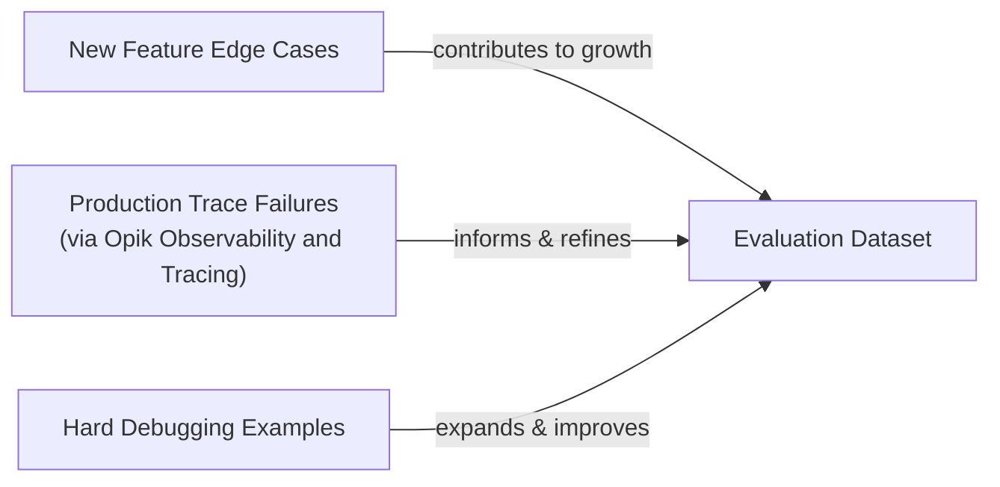
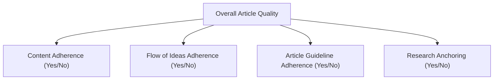

# Lesson 29: Evaluation-Driven Development

In our last lessons, we set up agent observability with Opik and built an offline dataset to evaluate our writing agent. Now, we move to the core theoretical framework of designing the metrics themselves. In classical machine learning, we rely on rigorous evaluation standards like accuracy, precision, recall, and F1 scores to measure performance. In AI engineering, however, it is common to see teams rely on "vibe checks"—a subjective sense that "this output feels more coherent."

Investing in a proper evaluation layer can feel hard to prioritize. It delivers no immediate user-visible feature, requires upfront effort to design datasets and metrics, and competes with the pressure to ship new functionality. But this same investment dramatically accelerates long-term iteration. It provides an objective signal on every change and catches regressions instantly.

Evals are the north star of AI engineering: the single source of truth that tells you exactly which modifications improve the system and which degrade it.

In this lesson, we will cover the theoretical foundation for evaluation-driven development (EDD). We will explore:

*   The optimization flywheel and its three core use cases.
*   The trade-offs between different metric types for unstructured outputs.
*   Why custom business metrics beat benchmarks and generic scores.
*   Why binary judgments are superior to Likert scales for most use cases.

With the problem and its importance clear, we now examine how to operationalize evaluations inside a repeatable optimization flywheel that replaces intuition with evidence.

## Using Evals Through the Optimization Flywheel

To build intuition, let's examine how we can effectively use and integrate AI evaluations into our application development lifecycle. There are three core scenarios where evaluations provide value.

First, evals **quantify the quality of your system** on a given set of metrics, creating a snapshot of its current performance. Without this baseline, you cannot know if the system is ready for production or if subsequent changes are making it better or worse. Second, these metrics serve as **guidance when optimizing your system**. They provide objective evidence for experiments, shifting development from intuition-based tweaks to a data-driven process. Finally, evals act as **regression tests** that protect shared components. This is critical in AI engineering, where prompts, tools, and memory systems are often interconnected. A change intended to improve one feature can easily break another.

### The Optimization Process

How does this look in a real-world scenario? Let's look at a step-by-step plan for the optimization flywheel.

1.  **Gather your dataset:** Assemble an offline dataset that represents the real-world scenarios your application will face.
2.  **Build your metrics:** Define metrics that are aligned with your specific business goals and user success criteria.
3.  **Establish a baseline:** Run your evaluation suite on the current version of the system to compute baseline scores for each metric.
4.  **Start the optimization:** Make one, isolated change that you believe will improve performance, such as modifying a prompt or swapping a model.
5.  **Compute the new score:** Re-evaluate the entire dataset by re-running the evaluation suite on the modified system.
6.  **Compare:** Compare the new scores to the baseline, considering statistical significance to ensure the change is real and not just noise.
7.  **Decide:** Based on whether the score is better, the same, or worse, decide to keep the change, revert it, or investigate further, also considering the complexity of the change.
8.  **Repeat:** Continue this cycle until the scores reach your desired performance targets.

This iterative process turns system improvement into a methodical, evidence-based practice.

Image 1: The iterative optimization flywheel for AI applications using evaluations.

It is critical to keep all components fixed except for one variable per cycle. Confounding multiple modifications makes it impossible to attribute score movements to a specific change, turning the process back into guesswork [[https://www.decodingai.com/p/escaping-poc-purgatory-evaluation]](https://www.decodingai.com/p/escaping-poc-purgatory-evaluation).

You must also anchor statistical significance to actual **business impact** rather than arbitrary p-value thresholds. A result is practically significant if it meaningfully affects business outcomes, such as saving time or money at scale [[https://www.nngroup.com/articles/practical-significance]](https://www.nngroup.com/articles/practical-significance). For example, for a high-volume support bot processing millions of checkouts a year, a tiny 0.5% reduction in checkout errors could translate to hundreds of thousands of dollars in saved revenue, making even small, statistically significant movements matter. In contrast, for a low-volume creative writing tool, you would need to see much larger improvements before declaring a change successful [[https://www.nngroup.com/articles/practical-significance]](https://www.nngroup.com/articles/practical-significance), [[https://corporatefinanceinstitute.com/resources/data-science/statistical-significance]](https://corporatefinanceinstitute.com/resources/data-science/statistical-significance). "Better" is always relative to the business use case.

### Regression Testing

A powerful variant of this flywheel is using evaluations for regression testing. Before merging any new feature that touches shared prompts, tool descriptions, or orchestration logic, you run the full evaluation suite to guard against breaking existing behavior. Running AI evaluations as regression tests is an extremely powerful technique to ensure that new features do not break old ones.

The process is a modification of the optimization flywheel:

1.  **Implement a new feature:** You write the code and verify it works locally for the new use case.
2.  **Run the AI evaluations:** You run the full suite of assessments, covering all previous use cases, not just the new one.
3.  **Compare Scores:** Compare the new scores against the baseline from before your changes.
4.  **Metrics similar to baseline:** If the scores are identical or within an acceptable range of the baseline, your feature has not introduced a regression. You can merge it into your production codebase.
5.  **Metrics lower than the baseline:** If the scores are worse, you have introduced a regression. You should fix your code and then repeat the process from step 2.

Image 2: Integrating AI evaluations into CI pipelines for regression testing.

This approach treats evaluations like unit or integration tests, but instead of enforcing a strict pass/fail threshold, we compare scores against a moving baseline.

A key part of this process is that the dataset must continuously expand. Unlike traditional software tests that are written in code, we broaden our AI tests by adding new samples to the dataset. For example, when debugging, you might add hard examples that expose current failure modes. As you add new features, you add edge cases relevant to them. And using an observability tool like Opik, you can capture real-world failures from production traces and add them to your evaluation set to prevent regressions [[https://www.comet.com/docs/opik/evaluation/advanced/manage_datasets]](https://www.comet.com/docs/opik/evaluation/advanced/manage_datasets).

Image 3: A flowchart illustrating the continuous expansion of AI evaluation datasets from various inputs.

With the flywheel mechanics clear, we can now examine the different families of metrics we might plug into it when dealing with unstructured outputs.

## Exploring Possible Metric Types

The core difficulty in evaluating AI systems is that we are often dealing with unstructured text, reasoning traces, or even images. Standard metrics like accuracy are not available. Instead, we have three main families of metrics.

### BLEU and ROUGE

Metrics like BLEU (Bilingual Evaluation Understudy) and ROUGE (Recall-Oriented Understudy for Gisting Evaluation) measure the lexical overlap of n-grams between a generated text and a reference text [[https://datumo.com/en/blog/insight/key-nlp-evaluation-metrics/]](https://datumo.com/en/blog/insight/key-nlp-evaluation-metrics/). They are fast to compute, deterministic, and widely understood. However, their major drawback is that they are blind to semantic meaning. They cannot recognize paraphrasing or correct reasoning that uses different words, and they do not care about factual accuracy. A sentence can have a high BLEU score and be complete nonsense [[https://wandb.ai/ai-team-articles/llm-evaluation/reports/LLM-evaluation-benchmarking-Beyond-BLEU-and-ROUGE--VmlldzoxNTIzMTY0NQ]](https://wandb.ai/ai-team-articles/llm-evaluation/reports/LLM-evaluation-benchmarking-Beyond-BLEU-and-ROUGE--VmlldzoxNTIzMTY0NQ).

### BERTScore

Embedding similarity metrics, such as BERTScore, address the semantic blindness of n-gram metrics. They embed both the generated and reference texts into a high-dimensional vector space and measure their cosine similarity [[https://spotintelligence.com/2024/08/20/bertscore/]](https://spotintelligence.com/2024/08/20/bertscore/). This allows them to capture semantic closeness, recognizing that "the child is joyful" means the same thing as "the boy is happy." Their main limitation is that they are still comparison metrics and cannot verify complex business logic or rules on their own [[https://plainenglish.io/blog/evaluating-nlp-models-a-comprehensive-guide-to-rouge-bleu-meteor-and-bertscore-metrics-d0f1b1]](https://plainenglish.io/blog/evaluating-nlp-models-a-comprehensive-guide-to-rouge-bleu-meteor-and-bertscore-metrics-d0f1b1).

### LLM Judges

The LLM-as-a-judge approach uses a capable LLM to evaluate the output of another model [[https://www.confident-ai.com/blog/why-llm-as-a-judge-is-the-best-llm-evaluation-method]](https://www.confident-ai.com/blog/why-llm-as-a-judge-is-the-best-llm-evaluation-method). You provide the judge model with the input, the output, a detailed set of criteria, few-shot examples, and chain-of-thought instructions. This method is highly flexible and can be customized to evaluate complex, domain-specific requirements, such as whether a legal summary correctly interprets a contract clause.

The main advantage of LLM judges is their ability to evaluate subjective qualities and provide detailed, human-like critiques. However, their performance depends heavily on the prompt and the evaluator model. They can be slower, more expensive, and inherit the biases of the underlying LLM if not carefully designed and tested [[https://www.evidentlyai.com/llm-guide/llm-as-a-judge]](https://www.evidentlyai.com/llm-guide/llm-as-a-judge).

Table 1 provides a summary of the trade-offs between these metric families. For the complex requirements of our capstone writing agent, such as guideline adherence and research grounding, LLM judges are the most practical choice.

| Metric Family | Speed | Cost | Semantic Awareness | Business Alignment | Explainability |
| :--- | :--- | :--- | :--- | :--- | :--- |
| **BLEU/ROUGE** | High | Low | Low | Low | Low |
| **BERTScore** | Medium | Medium | High | Medium | Low |
| **LLM Judges** | Low | High | Very High | Very High | High |

Table 1: A comparison of trade-offs for different evaluation metric families.

Now, you have heard from us: *"business metrics here, business metrics there"*. Thus, let's understand why defining your own business metrics is such an essential and underrated step in building your AI evaluation strategy.

## Why Business Metrics Over Benchmarks

It is a common mistake to use popular leaderboards or open benchmarks to choose an LLM for a product. Benchmarks are often deceiving, for two main reasons.

First, benchmarks often function as marketing artifacts. Once a test set becomes public, teams can train their models on it to inflate scores, a phenomenon known as benchmark overfitting [[https://openreview.net/forum?id=XbVMiW0jTM]](https://openreview.net/forum?id=XbVMiW0jTM). The scores no longer reflect performance on unseen data, undermining their validity. This is why you sometimes see "too-good-to-be-true" results on public leaderboards [[https://www.evidentlyai.com/llm-guide/llm-benchmarks]](https://www.evidentlyai.com/llm-guide/llm-benchmarks).

Second, there is a fundamental mismatch between typical benchmark tasks and real business workloads. A model that excels at solving grade-school math problems (like GSM8K) or answering generic trivia questions may fail completely at tasks requiring nuanced legal analysis, long-form creative writing, or personalized customer support [[https://magazine.sebastianraschka.com/p/llm-evaluation-4-approaches]](https://magazine.sebastianraschka.com/p/llm-evaluation-4-approaches).

Benchmarks have a narrow but proper role: advancing research, providing a quick sanity check, or filtering models during early exploration. They should never be the primary target for optimization or the basis for product-level decisions [[https://launchdarkly.com/blog/llm-evaluation]](https://launchdarkly.com/blog/llm-evaluation).

If benchmarks are misleading, generic prefab metrics that claim to measure universal qualities are even more dangerous. We must instead build metrics that are deeply tied to our specific application.

## Why Custom Business Metrics Over Generic Metrics

Generic, off-the-shelf metrics for qualities like "toxicity," "helpfulness," or "hallucination" create a mirage. They generate scores that feel objective but lack the context of your product, user expectations, and brand voice. Relying on them creates false confidence and can lead you to optimize for the wrong signals [[https://www.decodingai.com/p/the-mirage-of-generic-ai-metrics]](https://www.decodingai.com/p/the-mirage-of-generic-ai-metrics).

A model can score brilliantly on "helpfulness" but fail catastrophically on your specific constraints. Consider the dashboard below. It looks impressive, with scores for "Truthfulness" and "Personalization." But what does a 3.7 in "Personalization" actually mean?

Image 4: A dashboard showing generic metrics like Helpfulness and Truthfulness, labeled "Don't Do This!"

Let's assume we want to check if the article written by our Brown agent contains hallucinations. A generic `hallucination` score might return "positive," but what does that tell us? Did it add information not present in the research? Did it deviate from the article guidelines? Or did it simply include a personal story that was not in the source text but is factually correct and relevant? A generic detector might flag an engaging personal anecdote as a fabrication, yet that same anecdote may be exactly what your brand voice requires. The generic metric cannot distinguish between undesirable invention and desirable creative elaboration [[https://www.decodingai.com/p/the-mirage-of-generic-ai-metrics]](https://www.decodingai.com/p/the-mirage-of-generic-ai-metrics).

Prefab scores are limited by their absence of domain-specific constraints, their inability to localize which part of an output failed, and the statistical noise they introduce into decision-making.

This does not mean generic metrics are useless. They have a narrow, valid role during exploratory data analysis. You can use them as a "flashlight" to surface interesting examples for manual review, but never as the final report card [[https://www.decodingai.com/p/the-mirage-of-generic-ai-metrics]](https://www.decodingai.com/p/the-mirage-of-generic-ai-metrics).

Here are some useful examples:

1.  **Verbosity:** Sort your outputs by length. This can help reveal if your most verbose answers are rambling and unhelpful, or if your shortest answers are curt and missing information.
2.  **Similarity Score:** In a RAG system, you can use a similarity score to evaluate the retriever component specifically. A low similarity between the user query and the retrieved document chunks indicates your retriever may be failing.
3.  **BERTScore:** Use this to check the quality of your reference answers. If you find a cluster of outputs with a low BERTScore against a reference you expected to be similar, it might be that the LLM found a more creative or even better solution than your reference.

Every production metric must be deeply application-centric, derived from concrete product requirements and user success criteria.

Once we have rejected both benchmarks and generic metrics, the remaining design choice is how to elicit judgments from our LLM judge. Here, binary pass/fail criteria outperform every alternative.

## Choosing Binary Metrics Over Anything Else

When designing these custom metrics, you will face a choice: should you use a Likert scale (e.g., 1-5 stars) or a binary pass/fail? We strongly recommend **binary metrics**.

Likert scales introduce several problems:

1.  **Inconsistent Labeling:** The difference between a '3' and a '4' is subjective. One person's '4' is another's '3', leading to low inter-annotator agreement and noisy data [[https://www.decodingai.com/p/the-5-star-lie-you-are-doing-ai-evals]](https://www.decodingai.com/p/the-5-star-lie-you-are-doing-ai-evals).
2.  **Statistical Noise:** Detecting a meaningful improvement from an average score of 3.2 to 3.4 requires a much larger sample size than detecting a shift in a binary pass rate from 75% to 80%. Small movements are often indistinguishable from random variance [[https://www.ellamind.com/blog/binary-vs-likert-scales]](https://www.ellamind.com/blog/binary-vs-likert-scales).
3.  **Lazy Decision-Making:** Evaluators, both human and LLM, often default to the middle value ('3') to avoid making a difficult judgment. This "satisficing" behavior flattens the signal and hides real failure modes [[https://www.decodingai.com/p/the-5-star-lie-you-are-doing-ai-evals]](https://www.decodingai.com/p/the-5-star-lie-you-are-doing-ai-evals).

Binary evaluations work because they **force decisions**. They solve these problems by requiring a clear "pass" or "fail," which brings immediate benefits:

1.  **Clearer Thinking:** You cannot label an output as "fail" without knowing why. This forces you to create precise, unambiguous definitions of quality.
2.  **Consistency:** Binary decisions are faster and more consistent for both humans and LLMs, leading to higher-quality evaluation data.
3.  **Actionability:** The output is a clear failure signal tied to a specific problem, not a vague score change.

<aside>
💡

**Note:** The points above translate exceptionally well to LLM Judges. Using binary scoring is a key design choice to mitigate the inherent randomness of LLMs. LLMs are much more stable when asked to make a binary decision than when asked to assign a scalar value. A binary metric translates to a more robust and repeatable evaluation pipeline [[https://eugeneyan.com/writing/llm-evaluators/]](https://eugeneyan.com/writing/llm-evaluators/).

</aside>

### Capturing Nuance

The standard objection is, "But I'm losing nuance! A 1-5 scale captures shades of gray."

This is a valid concern, but a Likert scale is the wrong solution. The right way to capture nuance is not by making your scale fuzzier, but by making your criteria more **granular**. Instead of one subjective rating for "Quality," you decompose it into multiple, specific, binary checks [[https://www.ellamind.com/blog/binary-vs-likert-scales]](https://www.ellamind.com/blog/binary-vs-likert-scales).

For our writing agent, instead of rating an article 1-5, we create multiple binary evaluations:

1.  **Content Adherence:** Does the generated article contain the same core concepts as the expected article? (Yes/No)
2.  **Flow of Ideas Adherence:** Does the generated article contain the ideas in the same order as the expected article? (Yes/No)
3.  **Article Guideline Adherence:** Does the generated article follow the flow of ideas from the article guideline input? (Yes/No)
4.  **Research Anchoring:** Is every claim in the article supported by the provided research? (Yes/No)

Image 5: A hierarchy diagram illustrating the decomposition of overall article quality into granular, binary evaluation criteria.

By aggregating these binary signals, you get a nuanced view of performance without the noise and bias of a scalar rating. This approach is simple, scalable, and robust for production systems.

With the full theoretical picture in place, we can now summarize the mindset shift required and preview the hands-on implementation that follows in the next lesson.

## Conclusion

This lesson has laid out the core shift from vibe checks, leaderboards, and generic scores to a rigorous, evaluation-driven development process. This process is built on custom, binary, business-aligned metrics that provide a clear signal for improvement. Granular pass/fail criteria deliver the most reliable optimization signal while avoiding the statistical noise and subjectivity of scalar ratings.

This theory provides the "why" behind a robust evaluation strategy. In the next lesson, we will translate this into practice by implementing custom LLM judges from scratch to evaluate our Brown writing workflow, giving you the "how."

## References

- [1] https://www.decodingai.com/p/escaping-poc-purgatory-evaluation
- [2] https://www.nngroup.com/articles/practical-significance
- [3] https://corporatefinanceinstitute.com/resources/data-science/statistical-significance
- [4] https://www.comet.com/docs/opik/evaluation/advanced/manage_datasets
- [5] https://datumo.com/en/blog/insight/key-nlp-evaluation-metrics/
- [6] https://wandb.ai/ai-team-articles/llm-evaluation/reports/LLM-evaluation-benchmarking-Beyond-BLEU-and-ROUGE--VmlldzoxNTIzMTY0NQ
- [7] https://spotintelligence.com/2024/08/20/bertscore/
- [8] https://plainenglish.io/blog/evaluating-nlp-models-a-comprehensive-guide-to-rouge-bleu-meteor-and-bertscore-metrics-d0f1b1
- [9] https://www.confident-ai.com/blog/why-llm-as-a-judge-is-the-best-llm-evaluation-method
- [10] https://www.evidentlyai.com/llm-guide/llm-as-a-judge
- [11] https://openreview.net/forum?id=XbVMiW0jTM
- [12] https://www.evidentlyai.com/llm-guide/llm-benchmarks
- [13] https://magazine.sebastianraschka.com/p/llm-evaluation-4-approaches
- [14] https://launchdarkly.com/blog/llm-evaluation
- [15] https://www.decodingai.com/p/the-mirage-of-generic-ai-metrics
- [16] https://www.ellamind.com/blog/binary-vs-likert-scales
- [17] https://www.decodingai.com/p/the-5-star-lie-you-are-doing-ai-evals
- [18] https://eugeneyan.com/writing/llm-evaluators/
- [19] https://hamel.dev/blog/posts/llm-judge/
- [20] https://www.decodingai.com/p/stop-launching-ai-apps-without-this