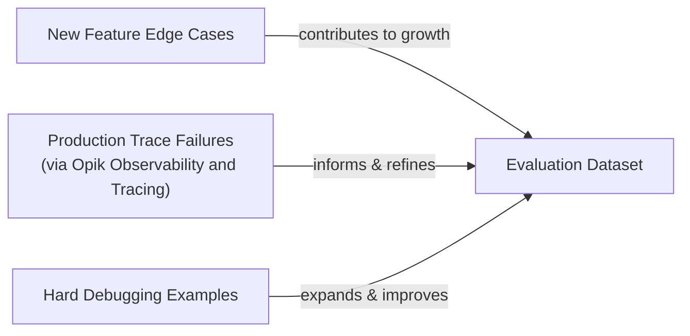
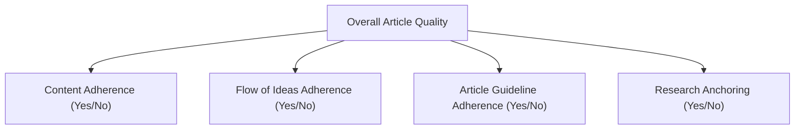

# Lesson 29: The Theoretical Foundations of AI Evals

In our last few lessons, we set up the infrastructure for building production-ready AI systems. We learned how to instrument our agents with observability tools like Opik and how to construct offline datasets to test them. Now, with our data and tracing in place, we can move to the core of building reliable AI: designing the metrics that will guide our development.

In classical machine learning, evaluation is a rigorous, non-negotiable discipline. We would never ship a classification model without first measuring its accuracy, precision, and recall. We anchor our decisions in statistical significance. Yet, in AI engineering, a surprising amount of work is still driven by "vibe checks." We tweak a prompt, run a few examples, and if the output "feels more coherent," we merge the change. This intuition-driven approach is a recipe for silent regressions and slow, unpredictable progress.

Investing in a proper evaluation layer can feel like a detour. It does not add a new feature for users, it requires upfront effort to design metrics and build datasets, and it competes with the constant pressure to ship. However, this investment is what separates prototypes from products. It creates a feedback loop that dramatically accelerates long-term iteration by providing an objective signal on every change and catching regressions before they reach production.

Evals are the north star of AI engineering. They are the single source of truth that tells you which modifications improve your system and which degrade it. In this lesson, we will establish the theoretical foundation for evaluation-driven development. We will explore:

- The optimization flywheel and its three core use cases.
- Trade-offs between different metric types for unstructured outputs.
- Why custom business metrics are superior to public benchmarks and generic scores.
- Why binary pass/fail judgments are more reliable than 1-5 Likert scales.

With the problem and its importance clear, we will now examine how to operationalize evals inside a repeatable optimization flywheel that replaces intuition with evidence.

## Using Evals Through the Optimization Flywheel

To build intuition, let's examine how we can effectively use and integrate AI evaluations into our application development lifecycle. There are three core scenarios where evaluations provide value. First, evals **quantify the quality of your system** on a set of given metrics, snapshotting a baseline of its current performance. Without a baseline, you cannot know if your system is ready for production or if your changes are making it better. Second, metrics **guide the optimization process** by providing evidence for experiments, shifting development from intuition-based to evidence-based. Third, they act as **regression tests** that protect shared components from unintended breakage, ensuring stability as the system evolves.

### The Optimization Process

How does this look in a real-world scenario? Let's look at a step-by-step plan for the optimization flywheel.

1.  **Gather your dataset:** Assemble an offline dataset of representative examples, as we did in the previous lesson.
2.  **Build your metrics:** Define a set of business-aligned metrics to measure performance.
3.  **Establish a baseline:** Run the evals on your current system to compute baseline scores.
4.  **Start the optimization:** Make one isolated change that you believe will improve performance.
5.  **Compute the new score:** Re-evaluate the entire dataset by re-running the evals.
6.  **Compare:** Compare the new scores to the baseline, considering statistical significance.
7.  **Decide:** Based on whether the score is better, the same, or worse, decide to keep the change, consider its complexity, or revert it.
8.  **Repeat:** Repeat the cycle until the scores meet your target for production.

This iterative process turns system improvement into a methodical, evidence-driven discipline.

<https://images.spr.so/cdn-cgi/imagedelivery/j42No7y-dcokJuNgXeA0ig/3fe225f6-9114-4d87-943c-d5bbe3fbbdfc/ai_evals/w=1920,quality=90,fit=scale-down> 
Image 1: The iterative optimization flywheel for AI applications using evaluations.

It is critical to change only one variable per cycle. If you modify the prompt, the model, and the retrieval logic all at once, it becomes impossible to attribute any score change to a specific modification [[2]](https://www.decodingai.com/p/escaping-poc-purgatory-evaluation). This turns the optimization process back into guesswork. By isolating each change, you can confidently measure its impact and build a clear understanding of what drives performance in your system.

Furthermore, "better" is always relative to the business use case. A statistically significant result does not always have practical significance [[46]](https://www.nngroup.com/articles/practical-significance). For a high-volume customer support bot that handles millions of queries, a 0.5% reduction in checkout errors could translate to hundreds of thousands of dollars in saved revenue and support costs [[46]](https://www.nngroup.com/articles/practical-significance). In this context, even a small improvement is a massive win. In contrast, for a low-volume creative writing tool, a similar percentage improvement might be imperceptible to users and not justify the engineering effort. The decision to ship a change must always be anchored to its real-world business impact.

### Regression Testing

The optimization flywheel can also be adapted for regression testing. Before merging any new feature that touches shared components—like prompts, tool descriptions, or memory retrieval logic—you run the full evaluation suite. This guards against the new code breaking existing behavior. Running AI evaluations as regression tests is a powerful technique to ensure that new features do not degrade the performance of old ones.

The process is a simplified version of the optimization flywheel:

1.  **Implement a new feature:** You write the code and verify it works for the new use case.
2.  **Run the AI evaluations:** You run the full suite of assessments, covering all previous use cases.
3.  **Compare Scores:** You compare the new scores against the established baseline.
4.  **Metrics similar to baseline:** If the scores are identical to or better than the baseline, your feature is safe to merge.
5.  **Metrics lower than the baseline:** If any score is worse, you have introduced a regression. You must fix the issue and re-run the evaluations.

<https://images.spr.so/cdn-cgi/imagedelivery/j42No7y-dcokJuNgXeA0ig/81fa7407-fdcd-4427-8468-669a31e2ca3f/ai_evals_-1/w=1920,quality=90,fit=scale-down> 
Image 2: Integrating AI evaluations into CI pipelines for regression testing.

This approach treats evals like integration tests, but instead of a strict pass/fail threshold, we compare scores against a moving baseline [[40]](https://olshansky.substack.com/p/vibe-checks-are-all-you-need). This acknowledges the probabilistic nature of AI systems while still enforcing quality control.

A robust evaluation dataset is not static; it must continuously expand. As you add new features, you must add new edge cases to the dataset. When you find failures in production through observability tools like Opik, you should add those traces to your dataset to prevent the same regression from happening again [[28]](https://www.comet.com/docs/opik/evaluation/advanced/manage_datasets), [[29]](https://www.decodingai.com/p/generate-synthetic-datasets-for-ai-evals). Hard examples found during debugging should also be included. Instead of writing new tests in code, you broaden your test coverage by adding new, challenging samples to the dataset.

Image 3: A flowchart illustrating the continuous expansion of AI evaluation datasets from various inputs.

For example, if you are debugging a regression where your agent fails to correctly format a JSON output, you should add that specific failing input to your evaluation dataset. This ensures that any future changes are automatically tested against this known failure mode. This continuous feedback loop between production monitoring and offline evaluation is the engine of reliable AI development.

With the flywheel mechanics clear, we can now examine the different families of metrics we might plug into it when dealing with unstructured text and image outputs.

## Exploring Possible Metric Types

The core difficulty in evaluating modern AI systems is that we are often dealing with unstructured outputs like text or reasoning traces, not the structured labels of classical ML. This means standard metrics like accuracy are not directly applicable. Instead, we have three main families of metrics to choose from.

### 1. BLEU and ROUGE

N-gram overlap metrics like BLEU (Bilingual Evaluation Understudy) and ROUGE (Recall-Oriented Understudy for Gisting Evaluation) are the oldest and simplest [[33]](https://medium.com/@sthanikamsanthosh1994/understanding-bleu-and-rouge-score-for-nlp-evaluation-1ab334ecadcb). They work by counting the number of overlapping words or sequences of words (n-grams) between the generated text and a reference text. They are fast, deterministic, and require no additional models [[31]](https://www.traceloop.com/blog/demystifying-the-bleu-metric). However, their reliance on exact lexical matches is also their biggest weakness. They are blind to semantic meaning, penalizing correct answers that use different phrasing and failing to detect factual inaccuracies if the wording is similar [[30]](https://wandb.ai/ai-team-articles/llm-evaluation/reports/LLM-evaluation-benchmarking-Beyond-BLEU-and-ROUGE--VmlldzoxNTIzMTY0NQ).

### 2. BERTScore

Embedding similarity metrics, like BERTScore, address the semantic blindness of n-gram metrics [[34]](https://www.elastic.co/search-labs/blog/evaluating-rag-metrics). They use a language model like BERT to convert both the generated and reference texts into high-dimensional vectors, or embeddings. The similarity between these embeddings is then calculated, typically using cosine similarity. This approach is much better at capturing semantic meaning and recognizing paraphrases [[32]](https://docs.galileo.ai/concepts/metrics/expression-and-readability/bleu-and-rouge). However, it is still fundamentally a comparison metric. It can tell you how similar two pieces of text are, but it cannot verify complex business logic or adherence to abstract guidelines.

### 3. LLM Judges

The LLM-as-a-judge approach uses a powerful LLM to evaluate the output of another model [[38]](https://www.braintrust.dev/articles/what-is-llm-as-a-judge). You provide the judge model with the input, the generated output, and a detailed prompt containing your evaluation criteria, few-shot examples, and chain-of-thought instructions [[35]](https://www.confident-ai.com/blog/why-llm-as-a-judge-is-the-best-llm-evaluation-method). This method is highly flexible and allows you to evaluate against complex, domain-specific requirements that are impossible to capture with lexical or semantic similarity. For example, you can ask an LLM judge to verify if a response is not only factually correct but also adheres to a specific brand voice.

The main pros are its ability to evaluate subjective qualities and provide detailed, human-like critiques [[52]](https://www.linkedin.com/posts/allaabdella_llm-aijudge-genai-activity-7353053642590932994-s3sw). However, its performance is highly dependent on the prompt and the judge model itself. LLM judges can be slower, more expensive, and may inherit the biases of the underlying model if not carefully designed and tested [[50]](https://www.evidentlyai.com/llm-guide/llm-as-a-judge).

Table 1: A trade-off comparison of different metric families for AI evaluation.

| Metric Family | Speed | Cost | Semantic Awareness | Business Alignment | Explainability |
| :--- | :--- | :--- | :--- | :--- | :--- |
| **BLEU/ROUGE** | Very Fast | Very Low | Low | Low | Low |
| **BERTScore** | Moderate | Low | High | Moderate | Low |
| **LLM Judges** | Slow | High | Very High | Very High | High |

For the complex requirements of our capstone writing projects, such as guideline adherence and research grounding, LLM judges are the most practical choice. They offer the necessary flexibility to encode our specific business rules.

Now, you kept hearing from us: *"business metrics here, business metrics there"*. Thus, let's understand why defining your own business metrics is such an essential and underrated step in building your AI evals strategy.

## Why Business Metrics Over Benchmarks

It is a common mistake to rely on public leaderboards or academic benchmarks to make product decisions. These benchmarks are often misleading and do not reflect real-world performance for two core reasons [[13]](https://launchdarkly.com/blog/llm-evaluation).

First, benchmarks often function as marketing artifacts. Once a test set is made public, it is inevitable that models will be trained on it, intentionally or not [[11]](https://www.evidentlyai.com/llm-guide/llm-benchmarks). This data contamination leads to inflated scores that do not represent a model's true generalization capabilities. We have seen instances where models achieve near-perfect scores on a benchmark simply because they have memorized the test set during training, a phenomenon known as overfitting [[page-10-1]](https://openreview.net/forum?id=XbVMiW0jTM). This makes leaderboard rankings an unreliable signal of quality [[15]](https://world.hey.com/bhari/ai-benchmark-scores-are-becoming-marketing-dynamic-eval-is-the-only-antidote-dedd7053).

Second, there is a fundamental mismatch between the tasks in most benchmarks and the requirements of real business applications [[12]](https://magazine.sebastianraschka.com/p/llm-evaluation-4-approaches). A model that excels at solving grade-school math problems (like those in the GSM8K benchmark) may be completely unsuitable for generating nuanced legal analysis or providing empathetic customer support [[14]](https://arxiv.org/html/2601.20617v1). Your product has a unique context, domain, and set of user expectations that generic benchmarks cannot capture.

The proper role of benchmarks is narrow: they are useful for advancing research, and they can serve as an initial filter during the early exploration phase of a project. However, they should never be the primary driver of product-level decisions or the target for your optimization efforts.

If benchmarks are misleading, generic prefab metrics that claim to measure universal qualities are even more dangerous. We must instead build metrics that are deeply tied to our specific application.

## Why Custom Business Metrics Over Generic Metrics

Generic, off-the-shelf metrics for qualities like "helpfulness," "toxicity," or "faithfulness" create a mirage of progress. They feel objective because they produce a number, but they optimize for the wrong signal and create false confidence because they lack the context of your product, users, and brand voice [[16]](https://www.linkedin.com/posts/shivanshu-aggarwal_evals-aievals-llm-activity-7375884554177449985-16kP).

A model can score brilliantly on a generic "helpfulness" metric but fail catastrophically on your specific constraints [[18]](https://arxiv.org/html/2508.13816v1). Consider the dashboard below. It looks impressive, with scores for "Truthfulness" and "Personalization." But what does a 3.7 in Personalization actually mean?

<https://images.spr.so/cdn-cgi/imagedelivery/j42No7y-dcokJuNgXeA0ig/585bb9f6-0bf3-427f-a9d3-994dd5849a1a/322c2e07-ee9a-4139-b51d-8f0c4787d880_1600x822/w=1920,quality=90,fit=scale-down> 
Image 4: A dashboard showing generic metrics like Helpfulness and Truthfulness, labeled "Don't Do This!" (Source [The 5-Star Lie: You’re Doing AI Evaluations Wrong](https://www.decodingai.com/p/the-5-star-lie-you-are-doing-ai-evals))

Let's assume we want to check if the article written by our Brown agent contains hallucinations. A generic `hallucination` score might return "positive," but what does that tell us? Did the agent invent information not present in the research? Did it deviate from the article guidelines? Or did it simply include a personal story that, while not in the source text, is factually correct and aligns with the desired tone? The generic metric cannot distinguish between undesirable invention and desirable creative elaboration. A detector might flag an engaging anecdote as a hallucination, even though that same anecdote is exactly what your brand voice requires.

Prefabricated scores are limited by their inability to incorporate domain-specific constraints, their failure to pinpoint which part of an output is problematic, and the statistical noise they introduce into the decision-making process [[20]](https://toloka.ai/blog/llm-evaluation-from-classic-metrics-to-modern-methods).

This does not mean generic metrics are useless. They have a narrow but valid role during exploratory data analysis. You can use them as a "flashlight" to surface interesting examples for manual review. Here are a few ways to do this:

1.  **Verbosity:** Sort your outputs by length. This can help you find rambling, unhelpful responses at one end and curt, incomplete answers at the other, quickly identifying failure modes in generation.
2.  **Similarity Score:** Use a similarity metric to evaluate your RAG retriever specifically. If the similarity between the user's query and the retrieved document chunks is low, your retriever is likely failing. This is a valid component-level check.
3.  **BERTScore:** Use this to audit the quality of your reference answers. If you find a cluster of generated outputs with a low BERTScore against a reference you expected to be similar, it might be because the LLM found a more creative or even a better solution than your "golden" answer.

In all these cases, the generic metric is not the final verdict but the start of an investigation. Every production metric must be application-centric, derived from your product requirements, user success criteria, and explicit constraints.

Once we have rejected both benchmarks and generic metrics, the remaining design choice is how to elicit judgments from our LLM judge. Here, binary pass/fail criteria outperform every alternative.

## Choosing Binary Metrics Over Anything Else

When designing these custom metrics, you will face a choice: should you use a Likert scale (e.g., 1-5 stars) or a binary pass/fail? We strongly recommend **binary metrics**.

Likert scales are seductive because they seem to offer more nuance. However, in practice, they introduce more problems than they solve [[4]](https://www.decodingai.com/p/the-5-star-lie-you-are-doing-ai-evals).

1.  **Inconsistent Labeling:** The difference between a '3' and a '4' is subjective. One person's '4' is another's '3', leading to low inter-annotator agreement and noisy data [[5]](https://www.ellamind.com/blog/binary-vs-likert-scales).
2.  **Statistical Noise:** Detecting a meaningful improvement from an average score of 3.2 to 3.5 requires a much larger sample size than detecting a shift in a binary pass rate from 60% to 70%. Small movements are often indistinguishable from random variance [[5]](https://www.ellamind.com/blog/binary-vs-likert-scales).
3.  **Lazy Decision-Making:** Evaluators—both human and LLM—often default to the middle value ('3') to avoid making a difficult judgment. This behavior, known as "satisficing," flattens the signal and hides the very failures you need to find [[4]](https://www.decodingai.com/p/the-5-star-lie-you-are-doing-ai-evals), [[6]](https://www.scribbr.com/methodology/likert-scale).

Binary evaluations work because they **force decisions**. An output either met the criterion or it did not. This simple constraint brings clarity and rigor to the evaluation process.

1.  **Clearer Thinking:** Binary metrics force you to create precise, unambiguous definitions of quality. You cannot hide in the "mushy middle."
2.  **Consistency:** They yield higher consistency across both human annotators and LLM judges.
3.  **Actionability:** They deliver an immediate, actionable signal. A 75% pass rate on a specific failure mode tells you exactly where to focus your efforts.

<aside>
💡

**Note:** The 3 points above translate exceptionally well to LLM Judges. Using binary scoring is a key design choice to mitigate the inherent randomness of LLMs. LLMs are much more stable when asked to make a binary decision than when asked to assign a scalar value [[10]](https://medium.com/@adnanmasood/rubric-based-evals-llm-as-a-judge-methodologies-and-empirical-validation-in-domain-context-71936b989e80). A binary metric translates to a more robust and repeatable evaluation pipeline.

</aside>

### Capturing Nuance

The standard objection is, "But I'm losing nuance! A 1-5 scale captures shades of gray." This is a misconception. The right way to capture nuance is not by making your scale fuzzier, but by making your criteria more **granular** [[9]](https://www.ellamind.com/blog/binary-vs-likert-scales).

Instead of a single, subjective 1-5 rating for "Quality," you should decompose the concept into multiple, specific, binary checks. For our writing agent, instead of one "Quality" score, we can create several binary evaluations:

1.  **Content Adherence:** Does the generated article contain the same core concepts as the expected article? (Yes/No)
2.  **Flow of Ideas Adherence:** Does the generated article present ideas in the same order as the expected article? (Yes/No)
3.  **Article Guideline Adherence:** Does the generated article follow the structural rules from the article guideline input? (Yes/No)
4.  **Research Anchoring:** Is every factual claim in the article supported by the provided research? (Yes/No)

Image 5: A hierarchy diagram illustrating the decomposition of overall article quality into granular, binary evaluation criteria.

This approach gives you a far more precise and actionable view of performance. You can track your pass rate on each dimension independently, identifying exactly where the system is failing. Aggregating these binary signals, perhaps with a weighted sum, provides a nuanced overall score without the noise and bias of a Likert scale. This method is simple, scalable, and robust enough for production systems.

With the full theoretical picture in place, we can now summarize the mindset shift required and preview the hands-on implementation that follows in the next lesson.

## Conclusion

The path to building reliable AI products requires a fundamental shift in mindset: from vibe checks, leaderboards, and generic scores to a rigorous, evaluation-driven development process. This process must be built on a foundation of custom, binary, business-aligned metrics that provide a clear and actionable signal for improvement. Granular pass/fail criteria are not a simplification; they are a tool for clarity, delivering the most reliable optimization signal while avoiding the statistical noise and subjectivity of scalar ratings.

This lesson has provided the theoretical framework for designing such a system. In our next lesson, we will put this theory into practice, implementing custom LLM judges from scratch to evaluate our Brown writing workflow.

## References

- [1] The 5-Star Lie: You’re Doing AI Evaluations Wrong. (https://www.decodingai.com/p/the-5-star-lie-you-are-doing-ai-evals)
- [2] Escaping POC Purgatory: Evaluation-Driven Development for AI Systems. (https://www.decodingai.com/p/escaping-poc-purgatory-evaluation)
- [3] The Mirage of Generic AI Metrics. (https://www.decodingai.com/p/the-mirage-of-generic-ai-metrics)
- [4] The 5-Star Lie: You’re Doing AI Evaluations Wrong. (https://www.decodingai.com/p/the-5-star-lie-you-are-doing-ai-evals)
- [5] Why We Use Binary Yes/No Evaluations (And You Should Too). (https://www.ellamind.com/blog/binary-vs-likert-scales)
- [6] Likert Scale: What It Is & How to Use It. (https://www.scribbr.com/methodology/likert-scale)
- [7] The Pros and Cons of a Likert Scale. (https://inmoment.com/blog/likert-scale)
- [8] Stop Launching AI Apps Without This Framework. (https://www.decodingai.com/p/stop-launching-ai-apps-without-this)
- [9] Why We Use Binary Yes/No Evaluations (And You Should Too). (https://www.ellamind.com/blog/binary-vs-likert-scales)
- [10] Rubric-Based Evals, LLM as a Judge Methodologies and Empirical Validation in Domain Context. (https://medium.com/@adnanmasood/rubric-based-evals-llm-as-a-judge-methodologies-and-empirical-validation-in-domain-context-71936b989e80)
- [11] 30 LLM evaluation benchmarks and how they work. (https://www.evidentlyai.com/llm-guide/llm-benchmarks)
- [12] LLM Evaluation: 4 Must-Know Approaches for Evaluating Your LLMs. (https://magazine.sebastianraschka.com/p/llm-evaluation-4-approaches)
- [13] A practical guide to LLM evaluation. (https://launchdarkly.com/blog/llm-evaluation)
- [14] Benchmarking Agentic RAG in the Public Sector. (https://arxiv.org/html/2601.20617v1)
- [15] AI — Benchmark scores are becoming marketing; dynamic eval is the only antidote. (https://world.hey.com/bhari/ai-benchmark-scores-are-becoming-marketing-dynamic-eval-is-the-only-antidote-dedd7053)
- [16] Shivanshu Aggarwal on LinkedIn. (https://www.linkedin.com/posts/shivanshu-aggarwal_evals-aievals-llm-activity-7375884554177449985-16kP)
- [17] Using LLM-as-a-Judge For Evaluation: A Complete Guide. (https://hamel.dev/blog/posts/llm-judge/)
- [18] A Meta-Evaluation of Evaluation Metrics for Cross-Lingual Summarization. (https://arxiv.org/html/2508.13816v1)
- [19] Evaluating the Effectiveness of LLM-Evaluators (aka LLM-as-Judge). (https://eugeneyan.com/writing/llm-evaluators/)
- [20] LLM Evaluation: From Classic Metrics to Modern Methods. (https://toloka.ai/blog/llm-evaluation-from-classic-metrics-to-modern-methods)
- [21] Evaluating NLP Models: A Comprehensive Guide to ROUGE, BLEU, METEOR, and BERTScore Metrics. (https://plainenglish.io/blog/evaluating-nlp-models-a-comprehensive-guide-to-rouge-bleu-meteor-and-bertscore-metrics-d0f1b1)
- [22] Key NLP Evaluation Metrics. (https://datumo.com/en/blog/insight/key-nlp-evaluation-metrics/)
- [23] BERTScore explained: A modern metric for evaluating text generation. (https://spotintelligence.com/2024/08/20/bertscore/)
- [24] PROBE: BENCHMARKING REASONING PARADIGM OVERFITTING IN LARGE LANGUAGE MODELS. (https://openreview.net/forum?id=XbVMiW0jTM)
- [25] Using LLM-as-a-Judge For Evaluation: A Complete Guide. (https://hamel.dev/blog/posts/llm-judge/)
- [26] Stop Launching AI Apps Without This Framework. (https://www.decodingai.com/p/stop-launching-ai-apps-without-this)
- [27] The Mirage of Generic AI Metrics. (https://www.decodingai.com/p/the-mirage-of-generic-ai-metrics)
- [28] Manage datasets. (https://www.comet.com/docs/opik/evaluation/advanced/manage_datasets)
- [29] Generate Synthetic Datasets for AI Evals. (https://www.decodingai.com/p/generate-synthetic-datasets-for-ai-evals)
- [30] LLM evaluation benchmarking: Beyond BLEU and ROUGE. (https://wandb.ai/ai-team-articles/llm-evaluation/reports/LLM-evaluation-benchmarking-Beyond-BLEU-and-ROUGE--VmlldzoxNTIzMTY0NQ)
- [31] Demystifying the BLEU Metric: A Comprehensive Guide to Machine Translation Evaluation. (https://www.traceloop.com/blog/demystifying-the-bleu-metric)
- [32] What are BLEU and ROUGE scores?. (https://docs.galileo.ai/concepts/metrics/expression-and-readability/bleu-and-rouge)
- [33] Understanding BLEU and ROUGE score for NLP evaluation. (https://medium.com/@sthanikamsanthosh1994/understanding-bleu-and-rouge-score-for-nlp-evaluation-1ab334ecadcb)
- [34] Evaluating RAG: a practical guide to evaluation metrics. (https://www.elastic.co/search-labs/blog/evaluating-rag-metrics)
- [35] LLM-as-a-Judge Simply Explained. (https://www.confident-ai.com/blog/why-llm-as-a-judge-is-the-best-llm-evaluation-method)
- [36] LLM-as-a-Judge: When to Use Reasoning (CoT) and Explanations. (https://medium.com/data-science-collective/llm-as-a-judge-when-to-use-reasoning-cot-and-explanations-964ad82ebc3d)
- [37] Evidence-Based Prompting Strategies for LLM-as-a-Judge. (https://arize.com/blog/evidence-based-prompting-strategies-for-llm-as-a-judge-explanations-and-chain-of-thought)
- [38] What is LLM-as-a-judge?. (https://www.braintrust.dev/articles/what-is-llm-as-a-judge)
- [39] LLM-as-a-Judge. (https://arize.com/llm-as-a-judge)
- [40] Vibe Checks are all you need. (https://olshansky.substack.com/p/vibe-checks-are-all-you-need)
- [41] VibeCheck: A Self-Adaptive System for Aligning Language Models with Human-Written Text. (https://arxiv.org/html/2410.12851v1)
- [42] AI Evals vs. A/B Testing: Why You Need Both to Ship GenAI. (https://www.growthbook.io/blog/ai-evals-vs-a-b-testing-why-you-need-both-to-ship-genai)
- [43] From “vibe checks” to continuous evaluation. (https://cloud.google.com/blog/topics/developers-practitioners/from-vibe-checks-to-continuous-evaluation-engineering-reliable-ai-agents)
- [44] Stop Evaluating LLMs with Vibe Checks. (https://towardsdatascience.com/stop-evaluating-llms-with-vibe-checks)
- [45] Statistical Significance. (https://corporatefinanceinstitute.com/resources/data-science/statistical-significance)
- [46] Statistical Significance Isn’t the Same as Practical Significance. (https://www.nngroup.com/articles/practical-significance)
- [47] Understanding Statistical Significance. (https://www.statsig.com/perspectives/understanding-statistical-significance)
- [48] Effective uses of effect size statistics to demonstrate business value. (https://www.quirks.com/articles/effective-uses-of-effect-size-statistics-to-demonstrate-business-value)
- [49] What Is Statistical Significance?. (https://www.cloudresearch.com/resources/guides/statistical-significance/what-is-statistical-significance)
- [50] LLM as a judge: what is it and how to use it?. (https://www.evidentlyai.com/llm-guide/llm-as-a-judge)
- [51] LLM-as-a-Judge vs. Human Evaluation. (https://galileo.ai/blog/llm-as-a-judge-vs-human-evaluation)
- [52] Alla Abdella on LinkedIn. (https://www.linkedin.com/posts/allaabdella_llm-aijudge-genai-activity-7353053642590932994-s3sw)
- [53] LLM as a Judge. (https://cameronrwolfe.substack.com/p/llm-as-a-judge)
- [54] LLM-as-a-Judge Simply Explained. (https://www.confident-ai.com/blog/why-llm-as-a-judge-is-the-best-llm-evaluation-method)