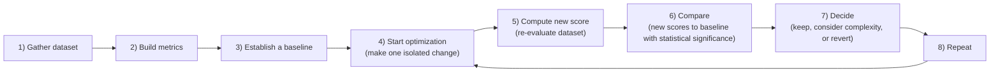
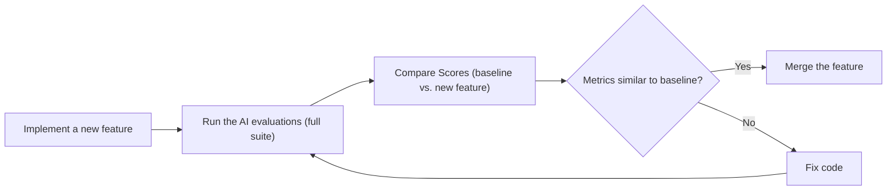
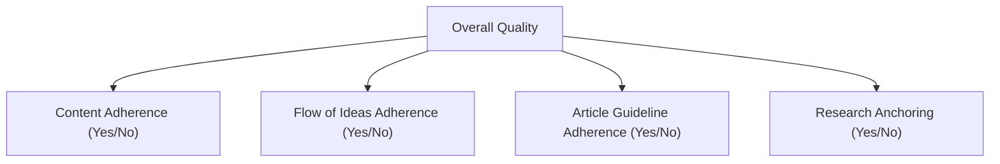

# The North Star of AI Engineering: A Guide to Evaluation-Driven Development

In our last lessons, we instrumented our agents with observability tools like Opik and built our first offline evaluation datasets. We can now see what our system is doing and have a collection of test cases to run against it. With these foundations in place, we can now tackle the core theoretical framework of designing the metrics themselves.

In classical machine learning, evaluation is a non-negotiable discipline. We live by metrics like accuracy, precision, recall, and F1 scores, and we anchor our findings in statistical significance. Yet, in modern AI engineering, many teams rely on "vibe checks." An engineer runs a few prompts, looks at the output, and declares, "This feels more coherent." This intuition-driven approach is a primary reason so many AI projects get stuck in proof-of-concept purgatory [[8]](https://www.decodingai.com/p/escaping-poc-purgatory-evaluation), [[42]](https://www.growthbook.io/blog/ai-evals-vs-a-b-testing-why-you-need-both-to-ship-genai), [[44]](https://towardsdatascience.com/stop-evaluating-llms-with-vibe-checks).

Investing in a proper evaluation layer can feel hard to prioritize. It delivers no immediate, user-visible feature. It requires upfront effort to design datasets and metrics, competing with the constant pressure to ship. However, this same investment dramatically accelerates long-term iteration. It provides an objective signal on every change, catches regressions instantly, and focuses your team's effort on what truly matters. Evals are the north star of AI engineering: the single source of truth that tells you which modifications improve the system and which degrade it.

In this lesson, we will establish the framework for evaluation-driven development (EDD). We will cover:
- The optimization flywheel and its three core use cases.
- Trade-offs between different metric types for unstructured outputs.
- Why custom business metrics are superior to public benchmarks and generic scores.
- Why binary pass/fail judgments are more robust than Likert scales.

With the problem and its importance clear, we will now examine how to operationalize evaluations inside a repeatable optimization flywheel that replaces intuition with evidence.

## Using Evals Through the Optimization Flywheel

To build intuition, let's examine how we can effectively use and integrate AI evaluations into our application development lifecycle. There are three core scenarios where evaluations provide value [[25]](https://galileo.ai/blog/nvidia-data-flywheel-for-de-risking-agentic-ai), [[26]](https://www.nvidia.com/en-us/glossary/data-flywheel).

First, evals **quantify the quality of your system** on a given set of metrics, creating a baseline snapshot of its current performance. Without a baseline, you cannot know if your system is production-ready or if your changes are leading to improvements.

Second, these metrics serve as **guidance when optimizing your system**. They provide the evidence needed to run optimization experiments, shifting development from being intuition-based to evidence-based.

Third, evals act as **regression tests** that protect shared components from unintended breakage. Unlike optimization, the goal here is stability. This is critical in AI engineering, as components like prompts, tools, and retrieval logic are often tightly coupled and shared across different parts of an application.

### The Optimization Process

How does this look in a real-world scenario? The optimization flywheel provides a step-by-step plan of attack.

1.  **Gather your dataset:** Assemble the offline dataset that represents the key scenarios and edge cases for your application.
2.  **Build your metrics:** Define the business-aligned metrics that measure what success looks like for your product.
3.  **Establish a baseline:** Run your evaluation suite on the current version of the system to compute the baseline scores.
4.  **Start the optimization:** Make one, isolated change that you believe will improve performance. This could be a prompt tweak, a change in the retrieval strategy, or swapping out the LLM.
5.  **Compute the new score:** Re-evaluate the entire dataset by re-running the evaluation suite against the modified system.
6.  **Compare:** Compare the new scores to the baseline, checking for statistical significance.
7.  **Decide:** Based on whether the score is better, the same, or worse, decide to keep the change, revert it, or investigate further, always considering any added complexity.
8.  **Repeat:** Continue the cycle until your scores meet the desired quality bar for production.

Image 1: An eight-step iterative optimization flywheel for AI applications using evaluations.

It is critical to keep all components fixed except for one variable per cycle. If you change the prompt, the model, and the retrieval chunk size all at once, it becomes impossible to attribute any score movements to a specific cause. This turns a disciplined engineering process back into guesswork. This discipline is even more critical for agentic systems, which are inherently probabilistic. Changing multiple variables at once can lead to unpredictable emergent behavior and cascading failures that are nearly impossible to trace back to a root cause [[55]](https://arxiv.org/html/2505.10468v1), [[56]](https://www.datarobot.com/blog/agentic-ai-enterprise-design).

Furthermore, statistical significance must be anchored to actual business impact, not arbitrary p-value thresholds. A "better" score is always relative to the use case. For a high-volume customer support bot that handles millions of interactions, a 0.5% reduction in checkout errors could translate to thousands of fewer failed transactions and significant cost savings. In this context, a small but statistically significant improvement matters [[46]](https://www.nngroup.com/articles/practical-significance).

In contrast, for a low-volume creative writing tool, a small improvement in a "creativity" score might be statistically significant but practically meaningless to the user experience. For such applications, you would require a much larger improvement before declaring victory. The decision to ship a change depends not just on the numbers, but on what those numbers mean for your business [[45]](https://corporatefinanceinstitute.com/resources/data-science/statistical-significance), [[47]](https://www.statsig.com/perspectives/understanding-statistical-significance), [[48]](https://www.quirks.com/articles/effective-uses-of-effect-size-statistics-to-demonstrate-business-value), [[49]](https://www.cloudresearch.com/resources/guides/statistical-significance/what-is-statistical-significance). This same evaluation loop can even be embedded within an autonomous agent itself. In a pattern known as **reflection**, an agent can generate a provisional output, then shift personas to critically evaluate its own work against predefined criteria before delivering the final result. This allows the agent to autonomously self-correct, trading some latency for significantly higher output quality [[57]](https://bhargavaparv.medium.com/architecting-autonomous-ai-systems-a-comprehensive-guide-to-agents-tool-calls-and-agent-skills-731d5576d557).

### Regression Testing

A powerful variation of this flywheel is using it for regression testing. Before merging any new feature that touches shared prompts, tool descriptions, or orchestration logic, you should run the full evaluation suite to guard against breaking existing behavior. This is an extremely effective technique for ensuring system stability.

This process can be simplified into five steps:

1.  **Implement a new feature:** You write the code and verify it works locally for the new use case.
2.  **Run the AI evaluations:** You run the full suite of assessments, covering all existing use cases, not just the new one.
3.  **Compare Scores:** You compare the new scores against your established baseline.
4.  **Metrics similar to baseline?** If the scores are statistically identical to the baseline, your feature has not introduced a regression. You can merge it into your production codebase.
5.  **Metrics lower than the baseline?** If scores are worse, you have introduced a regression. You must fix your code and repeat the process from step 2.

Image 2: A flowchart illustrating the five-step regression testing process using AI evaluations.

This treats your evaluation suite like a set of integration tests. However, instead of a strict pass/fail threshold, you are comparing scores against a moving baseline. This is a crucial distinction for probabilistic systems where outputs can vary. This shift in mindset is necessary because AI systems fail in ways that traditional software does not. A classic unit test cannot catch a plausible-sounding hallucination, and a standard integration test will not detect gradual performance degradation as user behavior shifts. This is why structured evaluation frameworks are replacing ad-hoc testing, ensuring that systems are reliable and safe before deployment [[58]](https://agility-at-scale.com/ai/architecture/evaluation-and-testing-frameworks).

Your evaluation dataset must also be a living artifact. It should continuously expand with new edge cases from feature development, real-world failures captured from production traces via observability tools like Opik, and difficult examples that expose current failure modes. For example, when debugging, instead of only writing a new unit test in code, you add the failing example to your evaluation dataset [[28]](https://www.comet.com/docs/opik/evaluation/advanced/manage_datasets), [[29]](https://www.decodingai.com/p/generate-synthetic-datasets-for-ai-evals). This broadens the test coverage and ensures the same regression does not happen again. This practice, often called **continuous evaluation**, extends pre-deployment testing into the production environment. It allows you to track real-world performance and catch drift as your agent encounters evolving user inputs and new edge cases, which is essential for any business-critical system [[59]](https://datagrid.com/blog/4-frameworks-test-non-deterministic-ai-agents).

With the mechanics of the flywheel clear, we can now examine the different families of metrics we might plug into it when dealing with unstructured outputs.

## Exploring Possible Metric Types

The core difficulty in evaluating LLM applications is that we are often dealing with unstructured outputs like text or images. Unlike classical ML with structured labels, standard accuracy metrics are not directly applicable. The field has evolved from early lexical-overlap metrics to modern approaches that can evaluate complex reasoning [[60]](https://toloka.ai/blog/history-of-llms), [[61]](https://cameronrwolfe.substack.com/p/llm-as-a-judge). There are three main families of metrics designed to handle this challenge.

### 1. BLEU and ROUGE

Metrics like BLEU (Bilingual Evaluation Understudy) and ROUGE (Recall-Oriented Understudy for Gisting Evaluation) measure the lexical overlap between a generated text and a reference text. They work by counting matching n-grams (sequences of words).

-   **Pros:** They are fast to compute, deterministic, widely understood, and do not require an additional model [[31]](https://www.traceloop.com/blog/demystifying-the-bleu-metric), [[32]](https://docs.galileo.ai/concepts/metrics/expression-and-readability/bleu-and-rouge).
-   **Cons:** They are blind to semantic equivalence. If a generated sentence uses different words to express the same meaning as the reference (paraphrasing), it will be penalized. They also do not assess factual accuracy or the soundness of reasoning [[30]](https://wandb.ai/ai-team-articles/llm-evaluation/reports/LLM-evaluation-benchmarking-Beyond-BLEU-and-ROUGE--VmlldzoxNTIzMTY0NQ), [[33]](https://medium.com/@sthanikamsanthosh1994/understanding-bleu-and-rouge-score-for-nlp-evaluation-1ab334ecadcb), [[34]](https://www.elastic.co/search-labs/blog/evaluating-rag-metrics).

### 2. BERTScore

Embedding similarity metrics like BERTScore address the semantic limitations of n-gram overlap. They use a pre-trained language model like BERT to convert both the generated and reference texts into vector embeddings. Their cosine similarity becomes the evaluation score.

-   **Pros:** This approach captures semantic closeness, meaning it can recognize paraphrases and synonyms as good matches.
-   **Cons:** While better at semantics, it is still a comparison-based metric. It cannot verify complex business rules or logical constraints that are not present in the reference text. It is also slower and more computationally expensive than lexical metrics.

### 3. LLM Judges

The LLM-as-a-judge approach uses a powerful LLM (like GPT-4 or Gemini Pro) to evaluate the output of another model. The judge receives the input, output, detailed criteria, and few-shot examples to guide its reasoning [[35]](https://www.confident-ai.com/blog/why-llm-as-a-judge-is-the-best-llm-evaluation-method), [[38]](https://www.braintrust.dev/articles/what-is-llm-as-a-judge), [[39]](https://arize.com/llm-as-a-judge).

-   **Pros:** This method is highly flexible and customizable. It can evaluate subjective qualities like tone and creativity, and it can be programmed with natural language to check for adherence to complex, domain-specific business rules. This allows for detailed, human-like critiques [[50]](https://www.evidentlyai.com/llm-guide/llm-as-a-judge).
-   **Cons:** Performance depends heavily on the quality of the prompt and the capability of the evaluator model. LLM judges can be slower and more expensive than other automated metrics. They can also inherit the biases of the underlying model, such as a preference for longer answers (verbosity bias) or answers generated by the same model family (self-enhancement bias) [[52]](https://www.linkedin.com/posts/allaabdella_llm-aijudge-genai-activity-7353053642590932994-s3sw), [[53]](https://cameronrwolfe.substack.com/p/llm-as-a-judge). However, these limitations are being actively addressed. Recent work focuses on calibrating LLM judges against human-scored "golden" datasets and using multi-judge consensus to improve correlation with human evaluators and mitigate bias [[62]](https://deepchecks.com/llm-judge-calibration-automated-issues), [[63]](https://galileo.ai/blog/llm-as-a-judge-vs-human-evaluation).

| Metric Family | Speed | Cost | Semantic Awareness | Business Alignment | Explainability |
| :--- | :--- | :--- | :--- | :--- | :--- |
| **BLEU/ROUGE** | High | Low | Low | Low | Medium |
| **BERTScore** | Medium | Medium | High | Medium | Low |
| **LLM Judges** | Low | High | High | High | High |

Table 1: A trade-off comparison of different metric families for evaluating unstructured outputs.

For complex tasks like our capstone writing agent, where we need to evaluate guideline adherence, structural fidelity, and grounding in research, LLM judges are the most practical choice. They offer the necessary flexibility to encode our specific business logic.

You have heard from us repeatedly: *"business metrics here, business metrics there."* Thus, let's understand why defining your own business metrics is such an essential and underrated step in building your AI evaluation strategy.

## Why Business Metrics Over Benchmarks

Using popular leaderboards or public benchmarks to choose an LLM for a product is often a mistake. Benchmarks are one of the most deceiving types of metrics. There are two core reasons for this.

First, benchmarks often function as marketing artifacts [[15]](https://world.hey.com/bhari/ai-benchmark-scores-are-becoming-marketing-dynamic-eval-is-the-only-antidote-dedd7053). Once a test set is public, models can become overfitted to it as developers "teach to the test" to climb the leaderboard. This compromises the benchmark's validity, as high scores no longer reflect performance on unseen data. There have been instances where models were found to have been trained on the test sets, leading to inflated and misleading scores [[11]](https://www.evidentlyai.com/llm-guide/llm-benchmarks), [[13]](https://launchdarkly.com/blog/llm-evaluation).

Second, there is a fundamental mismatch between the tasks in most benchmarks and the demands of real business workloads [[12]](https://magazine.sebastianraschka.com/p/llm-evaluation-4-approaches), [[14]](https://arxiv.org/html/2601.20617v1). A model that excels at solving grade-school math problems (like in the GSM8K benchmark) may be terrible at generating long-form, creative marketing copy or performing nuanced legal analysis. The skills tested are often not the skills your application needs.

This defines the proper, narrow role of benchmarks. They are valuable for advancing research frontiers and can be useful for initial model filtering during early exploration. However, they should never be used as a proxy for product-level decisions or as the primary target for optimization.

If benchmarks are misleading, generic prefab metrics that claim to measure universal qualities are even more dangerous. We must instead build metrics that are deeply tied to our specific application.

## Why Custom Business Metrics Over Generic Metrics

Generic, off-the-shelf metrics for qualities like "toxicity," "helpfulness," or "hallucination" create a mirage. They give the illusion of progress while optimizing for the wrong signal, leading to false confidence. They lack the context of your product, your users' expectations, and your brand's voice [[16]](https://www.linkedin.com/posts/shivanshu-aggarwal_evals-aievals-llm-activity-7375884554177449985-16kP). A model can score brilliantly on a generic "helpfulness" metric but fail catastrophically on your specific constraints.

Consider the dashboard below. It looks impressive, with scores for "Truthfulness" and "Personalization." But what does a 3.7 in "Personalization" actually mean? These vague scores are not actionable.

https://substackcdn.com/image/fetch/w_1456,c_limit,f_auto,q_auto:good,fl_progressive:steep/https%3A%2F%2Fsubstack-post-media.s3.amazonaws.com%2Fpublic%2Fimages%2F322c2e07-ee9a-4139-b51d-8f0c4787d880_1600x822.png
Image 3: A dashboard showing generic metrics like Helpfulness and Truthfulness, labeled "Don't Do This!" (Source [The 5-Star Lie: You’re Doing AI Evaluations Wrong](https://www.decodingai.com/p/the-5-star-lie-you-are-doing-ai-evals))

For example, let's assume we want to check if an article written by our Brown agent contains hallucinations. A generic `hallucination` score might return "positive." But what does that tell us? Did the model invent a fact not present in the research? Did it deviate from the article guidelines? Or did it simply include a personal story—factually correct and relevant to the topic—that wasn't in the source text? A generic detector might flag an engaging personal anecdote as a fabrication, yet that same anecdote may be exactly what your brand voice requires. The generic metric cannot distinguish between undesirable invention and desirable creative elaboration [[19]](https://galileo.ai/blog/human-evaluation-metrics-ai), [[20]](https://toloka.ai/blog/llm-evaluation-from-classic-metrics-to-modern-methods).

Prefab scores are limited because they lack domain-specific constraints, cannot localize which part of an output failed, and introduce statistical noise into your decision-making [[18]](https://arxiv.org/html/2508.13816v1).

This carves out a narrow, valid role for generic metrics: strictly during exploratory data analysis. They can be used as a "flashlight" to surface interesting examples for manual review, but should never be the primary optimization target. Here are some useful examples:
1.  **Verbosity:** Sorting your outputs by length can reveal if your most verbose answers are rambling and unhelpful or if your shortest answers are curt and missing information. This helps you spot failure modes in long-form generation.
2.  **Similarity Score:** This can be used to evaluate your RAG retriever specifically. If the similarity between the user query and the retrieved document chunks is low, your retriever is likely failing. This is a valid component-level check.
3.  **BERTScore:** This can help check the quality of your "golden" reference answers. If a cluster of outputs receives a low BERTScore against a reference you expected to be similar, a manual review might reveal that the LLM found a more creative or even better solution than your reference.

Every production metric must be deeply application-centric, derived from concrete product requirements, user success criteria, and explicit constraints.

Once we have rejected both benchmarks and generic metrics, the remaining design choice is how to elicit judgments from our LLM judge. Here, binary pass/fail criteria outperform every alternative.

## Choosing Binary Metrics Over Anything Else

When designing custom metrics, you face a choice: should you use a Likert scale (e.g., 1-5 stars) or a binary pass/fail judgment? We strongly recommend **binary metrics**.

Likert scales introduce several problems that undermine the evaluation process [[4]](https://www.decodingai.com/p/the-5-star-lie-you-are-doing-ai-evals), [[5]](https://www.ellamind.com/blog/binary-vs-likert-scales), [[6]](https://www.scribbr.com/methodology/likert-scale), [[7]](https://inmoment.com/blog/likert-scale):

1.  **Inconsistent Labeling:** The difference between a '3' and a '4' is subjective and varies between annotators. This makes it difficult to achieve high inter-annotator agreement and introduces noise into your labels.
2.  **Statistical Noise:** Detecting a meaningful improvement from an average score of 3.2 to 3.5 requires a much larger sample size than detecting a shift in a binary pass rate from 60% to 70%. To illustrate, detecting a statistically significant improvement from a 60% to 70% pass rate requires roughly 150 samples, while detecting a shift in a 5-point Likert scale from an average of 3.2 to 3.5 can require over 350 samples [[64]](https://www.ellamind.com/blog/binary-vs-likert-scales).
3.  **Lazy Decision-Making:** Annotators—both human and LLM—often default to the middle value ('3') to avoid a difficult judgment. This "satisficing" behavior, which often leads to a "mushy middle" where most ratings cluster around '3', flattens the signal and hides the very failures you need to find [[64]](https://www.ellamind.com/blog/binary-vs-likert-scales).

In contrast, binary evaluations work because they **force decisions**. This clarity provides several advantages. An output either meets a specific criterion or it does not, which forces you to create precise, unambiguous definitions of quality. This leads to faster, more consistent decisions for both humans and LLMs. A "fail" signal is also directly actionable and tied to a specific problem, telling an engineer exactly where to start debugging. Furthermore, the real value often lies in the reasoning behind a score. A binary "No" accompanied by an explanation of *why* an output failed provides a specific, actionable diagnosis, which is far more useful than an abstract '2' on a 5-point scale.

<aside>
💡 **Note:** The points above translate exceptionally well to LLM Judges. Using binary scoring is a key design choice to mitigate the inherent randomness of LLMs. LLMs are much more stable when asked to make a binary decision than when asked to assign a scalar value. A binary metric translates to a more robust and repeatable evaluation pipeline.
</aside>

### Capturing Nuance

The standard objection is, "But I'm losing nuance! A 1-5 scale captures shades of gray."

This is a valid concern, but a Likert scale is the wrong tool to address it. You capture nuance not by making your scale fuzzier, but by making your criteria more **granular** [[9]](https://www.ellamind.com/blog/binary-vs-likert-scales), [[10]](https://medium.com/@adnanmasood/rubric-based-evals-llm-as-a-judge-methodologies-and-empirical-validation-in-domain-context-71936b989e80). Instead of a single, subjective rating for "Quality," you decompose it into multiple, specific, binary checks.

For our writing agent, instead of rating an article 1-5 for "Quality," we can create multiple binary evaluations:

1.  **Content Adherence:** Does the generated article contain the same core concepts as the expected article? (Yes/No)
2.  **Flow of Ideas Adherence:** Does the generated article present ideas in the same order as the expected article? (Yes/No)
3.  **Article Guideline Adherence:** Does the generated article follow the flow of ideas from the article guideline input? (Yes/No)
4.  **Research Anchoring:** Is every claim in the article supported by the provided research? (Yes/No)

Image 4: A diagram showing the decomposition of Overall Quality into specific binary checks for a writing agent.

By aggregating these binary signals (using a simple average or a weighted sum), you get a nuanced view of performance that is far more precise and actionable. This approach eliminates scale noise and middle-value bias, resulting in a system that is simple, intuitive, scalable, and robust.

With the full theoretical picture in place, we can now summarize the mindset shift required and preview the hands-on implementation that follows in the next lesson.

## Conclusion

This lesson has laid out the case for a fundamental shift in how we approach AI engineering: away from vibe checks, leaderboards, and generic scores, and toward a rigorous, evaluation-driven development cycle. This cycle is built on custom, binary, business-aligned metrics that provide a clear and actionable signal for improvement.

We have seen that granular pass/fail criteria deliver the clearest optimization signal while avoiding the statistical noise and subjectivity inherent in scalar ratings. This framework is not just a theoretical ideal; it is a practical necessity for building reliable, production-grade AI systems.

In our next lesson, we will translate this theory into practice. We will implement custom LLM judges from scratch to evaluate our Brown writing workflow, putting these principles to work in a real-world application.

## References

- [1] Using LLM-as-a-Judge For Evaluation: A Complete Guide (https://hamel.dev/blog/posts/llm-judge/)
- [2] Evaluating the Effectiveness of LLM-Evaluators (aka LLM-as-a-Judge) (https://eugeneyan.com/writing/llm-evaluators/)
- [3] Benchmark Overfitting in Large Language Models (https://openreview.net/forum?id=XbVMiW0jTM)
- [4] The 5-Star Lie: You’re Doing AI Evaluations Wrong (https://www.decodingai.com/p/the-5-star-lie-you-are-doing-ai-evals)
- [5] Binary vs. Likert Scales (https://www.ellamind.com/blog/binary-vs-likert-scales)
- [6] Likert Scale (https://www.scribbr.com/methodology/likert-scale)
- [7] Likert Scale (https://inmoment.com/blog/likert-scale)
- [8] Escaping POC Purgatory: Evaluation-Driven Development for AI Systems (https://www.decodingai.com/p/escaping-poc-purgatory-evaluation)
- [9] Granular binary criteria capture nuance (https://www.ellamind.com/blog/binary-vs-likert-scales)
- [10] Rubric-Based Evals & LLM-as-a-Judge Methodologies (https://medium.com/@adnanmasood/rubric-based-evals-llm-as-a-judge-methodologies-and-empirical-validation-in-domain-context-71936b989e80)
- [11] 30 LLM evaluation benchmarks and how they work (https://www.evidentlyai.com/llm-guide/llm-benchmarks)
- [12] LLM Evaluation: 4 Approaches (https://magazine.sebastianraschka.com/p/llm-evaluation-4-approaches)
- [13] LLM evaluation (https://launchdarkly.com/blog/llm-evaluation)
- [14] Reliability, Contamination, and Evolution in LLM Agents (https://arxiv.org/html/2601.20617v1)
- [15] AI benchmark scores are becoming marketing; dynamic eval is the only antidote (https://world.hey.com/bhari/ai-benchmark-scores-are-becoming-marketing-dynamic-eval-is-the-only-antidote-dedd7053)
- [16] Generic metrics create a mirage (https://www.linkedin.com/posts/shivanshu-aggarwal_evals-aievals-llm-activity-7375884554177449985-16kP)
- [17] Stop Launching AI Apps Without This Framework (https://www.decodingai.com/p/stop-launching-ai-apps-without-this)
- [18] Metric validation methodologies vary significantly (https://arxiv.org/html/2508.13816v1)
- [19] Human Evaluation Metrics in AI (https://galileo.ai/blog/human-evaluation-metrics-ai)
- [20] LLM evaluation: From classic metrics to modern methods (https://toloka.ai/blog/llm-evaluation-from-classic-metrics-to-modern-methods)
- [21] Evaluating NLP Models: A Comprehensive Guide to ROUGE, BLEU, METEOR, and BERTScore Metrics (https://plainenglish.io/blog/evaluating-nlp-models-a-comprehensive-guide-to-rouge-bleu-meteor-and-bertscore-metrics-d0f1b1)
- [22] Key NLP Evaluation Metrics (https://datumo.com/en/blog/insight/key-nlp-evaluation-metrics/)
- [23] BERTScore explained: A modern metric for evaluating text generation (https://spotintelligence.com/2024/08/20/bertscore/)
- [24] The Mirage of Generic AI Metrics (https://www.decodingai.com/p/the-mirage-of-generic-ai-metrics)
- [25] A Powerful Data Flywheel for De-Risking Agentic AI (https://galileo.ai/blog/nvidia-data-flywheel-for-de-risking-agentic-ai)
- [26] NVIDIA Data Flywheel Glossary (https://www.nvidia.com/en-us/glossary/data-flywheel)
- [28] Manage Datasets - Opik Documentation (https://www.comet.com/docs/opik/evaluation/advanced/manage_datasets)
- [29] Generate Synthetic Datasets for AI Evals (https://www.decodingai.com/p/generate-synthetic-datasets-for-ai-evals)
- [30] LLM evaluation benchmarking: Beyond BLEU and ROUGE (https://wandb.ai/ai-team-articles/llm-evaluation/reports/LLM-evaluation-benchmarking-Beyond-BLEU-and-ROUGE--VmlldzoxNTIzMTY0NQ)
- [31] Demystifying the BLEU Metric (https://www.traceloop.com/blog/demystifying-the-bleu-metric)
- [32] BLEU and ROUGE (https://docs.galileo.ai/concepts/metrics/expression-and-readability/bleu-and-rouge)
- [33] Understanding BLEU and ROUGE Score for NLP Evaluation (https://medium.com/@sthanikamsanthosh1994/understanding-bleu-and-rouge-score-for-nlp-evaluation-1ab334ecadcb)
- [34] Evaluating RAG: Metrics (https://www.elastic.co/search-labs/blog/evaluating-rag-metrics)
- [35] Why LLM-as-a-Judge is the Best LLM Evaluation Method (https://www.confident-ai.com/blog/why-llm-as-a-judge-is-the-best-llm-evaluation-method)
- [38] What is LLM-as-a-judge? (https://www.braintrust.dev/articles/what-is-llm-as-a-judge)
- [39] LLM-as-a-Judge (https://arize.com/llm-as-a-judge)
- [42] AI Evals vs A/B Testing: Why You Need Both to Ship GenAI (https://www.growthbook.io/blog/ai-evals-vs-a-b-testing-why-you-need-both-to-ship-genai)
- [44] Stop Evaluating LLMs with “Vibe Checks” (https://towardsdatascience.com/stop-evaluating-llms-with-vibe-checks)
- [45] Statistical Significance (https://corporatefinanceinstitute.com/resources/data-science/statistical-significance)
- [46] Practical Significance (https://www.nngroup.com/articles/practical-significance)
- [47] Understanding Statistical Significance (https://www.statsig.com/perspectives/understanding-statistical-significance)
- [48] Effective uses of effect size statistics to demonstrate business value (https://www.quirks.com/articles/effective-uses-of-effect-size-statistics-to-demonstrate-business-value)
- [49] What Is Statistical Significance? (https://www.cloudresearch.com/resources/guides/statistical-significance/what-is-statistical-significance)
- [50] LLM-as-a-judge (https://www.evidentlyai.com/llm-guide/llm-as-a-judge)
- [52] LLM as a Judge (https://www.linkedin.com/posts/allaabdella_llm-aijudge-genai-activity-7353053642590932994-s3sw)
- [53] LLM as a Judge (https://cameronrwolfe.substack.com/p/llm-as-a-judge)
- [55] Inter-agent misalignment, error propagation, unpredictability of emergent behavior (https://arxiv.org/html/2505.10468v1)
- [56] Agents are probabilistic: the same input might trigger different paths, decisions, or outcomes (https://www.datarobot.com/blog/agentic-ai-enterprise-design)
- [57] Architecting Autonomous AI Systems: A Comprehensive Guide to Agents, Tool Calls, and Agent Skills (https://bhargavaparv.medium.com/architecting-autonomous-ai-systems-a-comprehensive-guide-to-agents-tool-calls-and-agent-skills-731d5576d557)
- [58] Evaluation and Testing Frameworks for AI Systems (https://agility-at-scale.com/ai/architecture/evaluation-and-testing-frameworks)
- [59] 4 Frameworks to Test Non-Deterministic AI Agents (https://datagrid.com/blog/4-frameworks-test-non-deterministic-ai-agents)
- [60] A brief history of LLMs (https://toloka.ai/blog/history-of-llms)
- [61] LLM as a Judge (https://cameronrwolfe.substack.com/p/llm-as-a-judge)
- [62] Calibrating Your LLM Judge: A Guide to Automating Subjective Evaluations (https://deepchecks.com/llm-judge-calibration-automated-issues)
- [63] LLM-as-a-Judge vs. Human Evaluation (https://galileo.ai/blog/llm-as-a-judge-vs-human-evaluation)
- [64] Why We Use Binary Yes/No Evaluations (And You Should Too) (https://www.ellamind.com/blog/binary-vs-likert-scales)