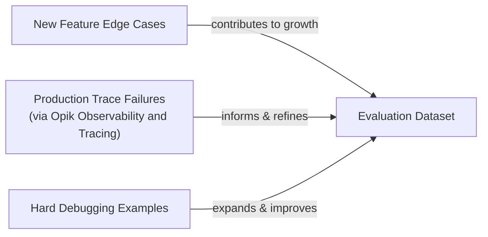
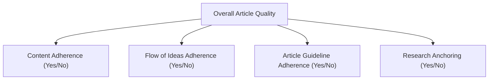

# Lesson 29: The Theoretical Foundations of AI Evals

In our previous lessons, we instrumented our agents with observability tools like Opik and built our first offline evaluation datasets. Now, we move to the core theoretical framework of designing the metrics themselves. In classical machine learning, we rely on rigorous evaluation standards like accuracy, precision, recall, and F1 scores to measure performance. In AI engineering, however, it is common to see teams rely on "vibe checks" or skip evaluation altogether, judging outputs with subjective phrases like "this feels more coherent."

Investing in a proper evaluation layer can feel hard to prioritize. It delivers no immediate user-visible feature, requires upfront effort to design datasets and metrics, and competes with the pressure to ship new functionality. However, this same investment dramatically accelerates long-term iteration. It provides an objective signal on every change and catches regressions instantly.

Evals are the north star of AI engineering: the single source of truth that tells you exactly which modifications improve the system and which degrade it. This lesson establishes the theoretical foundation for evaluation-driven development (EDD). We will explore:

-   The optimization flywheel and its three core use cases.
-   The trade-offs between different metric types for unstructured outputs.
-   Why business-aligned metrics are superior to public benchmarks and generic scores.
-   Why binary pass/fail judgments consistently outperform Likert scales.

With the problem and importance clear, we now examine how to operationalize evals inside a repeatable optimization flywheel that replaces intuition with evidence.

## Using Evals Through the Optimization Flywheel

To build intuition, let's examine how we can effectively use and integrate AI evaluations into our application development lifecycle. There are three core scenarios where evaluations provide value.

First, evals **quantify the quality of your system** on a set of given metrics, snapshotting a baseline of its current performance. Without a baseline, you cannot know if your system is ready for production or if subsequent changes are making it better or worse. Second, these metrics serve as **guidance when optimizing your system**. They provide objective evidence for optimization experiments, shifting development from being intuition-based to evidence-based. Finally, they act as **regression tests** that protect shared components. Unlike optimization, the goal here is stability. This is critical in AI engineering, where components like prompts, tools, and memory systems are often shared and interconnected.

### The Optimization Process

How does this look in a real-world scenario? Let's look at a step-by-step plan for the optimization flywheel.

1.  **Gather your dataset:** You assemble an offline dataset that represents real-world use cases, as we did in the previous lesson.
2.  **Build your metrics:** You define a set of metrics aligned with your business goals that will measure the quality of your system's outputs.
3.  **Establish a baseline:** You run your evaluation suite on the current version of the system to compute baseline scores for each metric.
4.  **Start the optimization:** You make one isolated change that you believe will improve performance, such as modifying a prompt or swapping an LLM.
5.  **Compute the new score:** You re-evaluate the entire dataset by re-running the evaluation suite on the modified system.
6.  **Compare:** You compare the new scores to the baseline, considering statistical significance to ensure the change is not just noise.
7.  **Decide:** Based on whether the score is better, the same, or worse, you decide to keep the change, revert it, or consider its complexity if the improvement is minor.
8.  **Repeat:** You repeat this cycle, making one change at a time, until the scores meet your target for production readiness.

Image 1: The iterative optimization flywheel for AI applications using evaluations. (Source [https://www.decodingai.com/p/stop-launching-ai-apps-without-this](https://www.decodingai.com/p/stop-launching-ai-apps-without-this))

It is critical to keep all components fixed except for one variable per cycle. Confounding multiple modifications makes it impossible to attribute score movements to a specific change, turning a systematic process into guesswork. This disciplined, single-variable iteration is what separates professional AI engineering from casual hacking [[1]](https://www.decodingai.com/p/escaping-poc-purgatory-evaluation).

When you compare scores, you must anchor statistical significance to actual business impact rather than arbitrary p-value thresholds. A result is statistically significant if it is unlikely to have occurred by chance, but this does not automatically mean it has practical significance [[2]](https://www.nngroup.com/articles/practical-significance). "Better" is always relative to the business use case. For a high-volume support bot processing millions of checkouts a year, a tiny numerical improvement can translate to a massive real-world gain. A 0.5% reduction in checkout errors might seem small, but at scale, it could mean 10,000 fewer failed transactions and save the business $150,000 annually [[2]](https://www.nngroup.com/articles/practical-significance). In contrast, for a low-volume creative writing tool, a similar small improvement is likely negligible, and larger movements are required before declaring victory.

### Regression Testing

The optimization flywheel can be adapted for regression testing. Before merging any new feature that touches shared prompts, tool descriptions, orchestration logic, or memory retrieval, you run the full eval suite against the offline dataset to guard against breaking existing behavior. Running AI evaluations as regression tests is an extremely powerful technique to ensure that your new features do not break old ones.

The strategy involves five steps:

1.  **Implement a new feature:** You write the code and verify it works locally for the new use case.
2.  **Run the AI evaluations:** You run the full suite of assessments, covering all previous use cases, not just the new one.
3.  **Compare Scores:** You compare the new scores against the established baseline for your production system.
4.  **Metrics similar to baseline:** If the scores for existing use cases are identical or within an acceptable range of the baseline, your feature is safe to merge.
5.  **Metrics lower than the baseline:** If a score is worse, you have introduced a regression. You must fix your code and repeat the process until scores return to the baseline.

Image 2: Integrating AI evaluations into CI pipelines for regression testing. (Source [https://www.decodingai.com/p/stop-launching-ai-apps-without-this](https://www.decodingai.com/p/stop-launching-ai-apps-without-this))

This approach treats evals like integration tests, but instead of enforcing a strict pass/fail threshold, we compare scores against a moving baseline. The dataset itself must also evolve. It should continuously expand with new feature edge cases, production trace failures captured via observability tools like Opik, and hard debugging examples that expose current failure modes [[3]](https://www.comet.com/docs/opik/evaluation/advanced/manage_datasets). For instance, after debugging a code-related issue, you can add the problematic production data to your dataset to prevent similar regressions in the future. Instead of writing new tests in code, you broaden the test coverage by adding new samples to the dataset.

Image 3: A flowchart illustrating the continuous expansion of AI evaluation datasets from various inputs.

With the flywheel mechanics clear, we can now examine the different families of metrics we might plug into it when dealing with unstructured text and image outputs.

## Exploring Possible Metric Types

The core difficulty in evaluating AI systems is that we are often dealing with unstructured outputs like text or reasoning traces, unlike classical ML with its structured labels. Standard accuracy metrics are unavailable, so we turn to three families of metrics designed for this challenge.

### 1. BLEU and ROUGE

N-gram overlap metrics like BLEU (Bilingual Evaluation Understudy) and ROUGE (Recall-Oriented Understudy for Gisting Evaluation) are the oldest and simplest. They work by counting the overlap of word sequences (n-grams) between the generated text and a reference text [[4]](https://plainenglish.io/blog/evaluating-nlp-models-a-comprehensive-guide-to-rouge-bleu-meteor-and-bertscore-metrics-d0f1b1), [[5]](https://datumo.com/en/blog/insight/key-nlp-evaluation-metrics/). BLEU focuses on precision, making it suitable for tasks like translation, while ROUGE focuses on recall, making it better for summarization [[5]](https://datumo.com/en/blog/insight/key-nlp-evaluation-metrics/). Their pros are that they are fast, deterministic, and require no additional models [[6]](https://wandb.ai/ai-team-articles/llm-evaluation/reports/LLM-evaluation-benchmarking-Beyond-BLEU-and-ROUGE--VmlldzoxNTIzMTY0NQ). Their main con is that they are blind to semantic meaning. They cannot recognize paraphrasing and do not care about factual accuracy, only lexical overlap [[6]](https://wandb.ai/ai-team-articles/llm-evaluation/reports/LLM-evaluation-benchmarking-Beyond-BLEU-and-ROUGE--VmlldzoxNTIzMTY0NQ), [[7]](https://www.traceloop.com/blog/demystifying-the-bleu-metric).

### 2. BERTScore

Embedding similarity metrics like BERTScore represent an improvement. They embed both the generated and reference texts into a high-dimensional vector space using a model like BERT and then measure their cosine similarity [[8]](https://spotintelligence.com/2024/08/20/bertscore/). This allows them to capture semantic closeness, giving credit for paraphrasing and synonymous language where lexical methods would fail [[8]](https://spotintelligence.com/2024/08/20/bertscore/). However, they are still comparison metrics and cannot verify complex business rules or logical correctness on their own.

### 3. LLM Judges

The LLM-as-a-judge approach is the most flexible and powerful. It involves prompting a capable evaluator LLM with the input, the generated output, a set of detailed criteria, few-shot examples, and chain-of-thought instructions [[9]](https://www.confident-ai.com/blog/why-llm-as-a-judge-is-the-best-llm-evaluation-method). The judge then produces a structured judgment, such as a score or a pass/fail decision [[10]](https://www.braintrust.dev/articles/what-is-llm-as-a-judge). This method allows you to evaluate against complex, domain-specific criteria that other metrics cannot handle. For example, you can ask a judge to verify if a generated legal summary correctly interprets a specific clause according to company policy.

The main pros of LLM judges are their ability to evaluate subjective aspects and provide detailed, human-like critiques [[11]](https://www.evidentlyai.com/llm-guide/llm-as-a-judge). The cons are that their performance depends heavily on the prompt and the evaluator model. They can be slower and more expensive, and if not properly developed, they can inherit the LLM's biases, such as favoring longer responses or its own outputs [[12]](https://cameronrwolfe.substack.com/p/llm-as-a-judge), [[13]](https://www.linkedin.com/posts/allaabdella_llm-aijudge-genai-activity-7353053642590932994-s3sw). We will learn how to implement them from scratch in the next lesson.

| Metric Family | Speed | Cost | Semantic Awareness | Business Alignment | Explainability |
| :--- | :--- | :--- | :--- | :--- | :--- |
| **BLEU/ROUGE** | High | Low | Low | Low | Low |
| **BERTScore** | Medium | Medium | Medium | Medium | Low |
| **LLM Judges** | Low | High | High | High | High |

Table 1: A trade-off summary of different metric families for evaluating unstructured text.

For the kind of guideline adherence, structure fidelity, and research grounding needed for our capstone writing project, LLM judges are the most practical choice.

Now, you kept hearing from us: "business metrics here, business metrics there". Thus, let's understand why defining your own business metrics is such an essential and underrated step in building your AI evals strategy.

## Why Business Metrics Over Benchmarks

It is a common mistake to use popular leaderboards or open benchmarks to select an LLM for a product. Benchmarks are the most deceiving type of metrics, and relying on them for product decisions is often a mistake for two core reasons [[14]](https://www.evidentlyai.com/llm-guide/llm-benchmarks), [[15]](https://launchdarkly.com/blog/llm-evaluation).

First, benchmarks often act as marketing artifacts. Once a test set becomes public, teams can overfit to it, either intentionally or not, by "training to the test" [[16]](https://world.hey.com/bhari/ai-benchmark-scores-are-becoming-marketing-dynamic-eval-is-the-only-antidote-dedd7053). There have been instances where models were fine-tuned on benchmark test sets to inflate their final scores. This "benchmark overfitting" undermines the evaluation's effectiveness, as high scores no longer represent true reasoning ability but rather a form of memorization [[17]](https://openreview.net/forum?id=XbVMiW0jTM).

Second, there is a fundamental mismatch between typical benchmark tasks and real business workloads. A benchmark might test an LLM's ability to solve grade-school math problems (like GSM8K) or answer generic multiple-choice questions (like MMLU), but these tasks have little in common with the demands of long-form creative writing, nuanced legal analysis, or personalized customer support [[18]](https://magazine.sebastianraschka.com/p/llm-evaluation-4-approaches), [[19]](https://arxiv.org/html/2601.20617v1). The proper role of benchmarks is narrow: they are useful for advancing research, for initial model filtering during early exploration, but never as a proxy for product-level decisions or optimization targets.

If benchmarks are misleading, generic prefab metrics that claim to measure universal qualities are even more dangerous. We must instead build metrics that are deeply tied to our specific application.

## Why Custom Business Metrics Over Generic Metrics

Generic, off-the-shelf metrics for qualities like "toxicity," "helpfulness," or "hallucination" act as a mirage. They create a false sense of confidence by optimizing for the wrong signal, because they lack context about your product, your users, and your brand voice. A model can score brilliantly on a generic "helpfulness" metric but fail catastrophically on your specific constraints [[20]](https://www.linkedin.com/posts/shivanshu-aggarwal_evals-aievals-llm-activity-7375884554177449985-16kP). This leads to wrongful optimization, where teams waste time improving a score that does not matter to users.

Consider the dashboard below. It looks impressive, with scores for "Truthfulness" and "Personalization." But what does a 3.7 in "Personalization" actually mean? These abstract scores provide little actionable information.

Image 4: A dashboard showing generic metrics like Helpfulness and Truthfulness, labeled "Don't Do This!" (Source [https://www.decodingai.com/p/the-5-star-lie-you-are-doing-ai-evals](https://www.decodingai.com/p/the-5-star-lie-you-are-doing-ai-evals))

Let's assume we want to check if the article written by our Brown agent contains hallucinations. A generic `hallucination` score might return "positive," but this tells us very little. Did the agent add information not present in the research? Did it deviate from the article guidelines? Or did it simply include a personal story that, while not in the source text, is factually correct and aligns with the desired tone? A generic detector might flag an engaging personal anecdote as a fabrication, yet that same anecdote may be exactly what your brand voice requires [[21]](https://www.decodingai.com/p/the-mirage-of-generic-ai-metrics). The metric cannot distinguish between undesirable invention and desirable creative elaboration.

Prefab scores are limited by their absence of domain-specific constraints, their inability to localize which part of an output failed, and the statistical noise they introduce into decision-making. Their only valid role is during exploratory data analysis, where they can act as a "flashlight" to surface interesting examples for manual review, but they should never be the primary optimization target [[21]](https://www.decodingai.com/p/the-mirage-of-generic-ai-metrics).

Here are some useful ways to use generic metrics for exploration:

1.  **Verbosity:** Sort your outputs by length. This can reveal if your most verbose answers are rambling and unhelpful, or if your shortest answers are curt and missing information, helping you spot failure modes in long-form generation.
2.  **Similarity Score:** Use this to evaluate your RAG retriever specifically. If the similarity between the user query and retrieved chunks is low, your retriever is likely failing. This is a valid component-level check.
3.  **BERTScore:** Use this to check the quality of your golden references. If you find a cluster of outputs with a low BERTScore against a reference you expected to be similar, it might be that the LLM found a more creative or even better way to solve the problem.

Every production metric must be application-centric, derived from concrete product requirements, user success criteria, and explicit constraints.

Once we have rejected both benchmarks and generic metrics, the remaining design choice is how to elicit judgments from our LLM judge. Here, binary pass/fail criteria outperform every alternative.

## Choosing Binary Metrics Over Anything Else

When designing these custom metrics, you will face a choice: should you use a Likert scale (e.g., 1-5 stars) or a binary pass/fail? We strongly recommend **binary metrics**.

Likert scales are plagued with problems that make them unsuitable for rigorous AI evaluation [[22]](https://www.decodingai.com/p/the-5-star-lie-you-are-doing-ai-evals).

1.  **Inconsistent Labeling:** The difference between a '3' and a '4' is subjective and varies between annotators. This makes it difficult to achieve high inter-annotator agreement, and you spend more time debating the rubric than evaluating the system [[22]](https://www.decodingai.com/p/the-5-star-lie-you-are-doing-ai-evals).
2.  **Statistical Noise:** Detecting a meaningful improvement from an average score of 3.2 to 3.4 requires a much larger sample size than detecting a shift in a binary pass rate from 60% to 70%. This noise makes it hard to know if your changes are having a real impact [[23]](https://www.ellamind.com/blog/binary-vs-likert-scales).
3.  **Lazy Decision-Making:** Annotators often default to the middle value ('3') to avoid making a difficult judgment. This "satisficing" behavior hides uncertainty rather than resolving it, leaving you with a sea of '3's that tell you nothing about what to fix [[22]](https://www.decodingai.com/p/the-5-star-lie-you-are-doing-ai-evals), [[24]](https://www.scribbr.com/methodology/likert-scale).

Binary evaluations work because they **force decisions**. They solve these problems by forcing clarity and pushing you toward a more rigorous error analysis workflow. The benefits are immediate [[22]](https://www.decodingai.com/p/the-5-star-lie-you-are-doing-ai-evals).

1.  **Clearer Thinking:** An output either meets the criterion or it does not. There is no ambiguity, which sharpens your definitions of quality.
2.  **Consistency:** Binary decisions are faster for annotators to make and yield higher consistency, whether the evaluator is a human or an LLM.
3.  **Actionability:** The output is a clear signal tied to a specific problem. A spike in a specific failure rate tells an engineer exactly where to start debugging.

<aside>
💡
**Note:** The 3 points above translate exceptionally well to LLM Judges. Using binary scoring is a key design choice to mitigate the inherent randomness of LLMs. LLMs are much more stable when asked to make a binary decision than when asked to assign a scalar value. A binary metric translates to a more robust and repeatable evaluation pipeline.

</aside>

### Capturing Nuance

The standard objection is, "But I'm losing nuance! A 1-5 scale captures shades of gray." This is a valid concern, but a Likert scale is the wrong solution. The right way to capture nuance is not by making your scale fuzzier, but by making your criteria more **granular**. Instead of a single, subjective rating, you should decompose a complex quality into multiple, specific, binary checks [[23]](https://www.ellamind.com/blog/binary-vs-likert-scales).

For our writing agent, instead of rating an article 1-5 for "Quality," we can create multiple binary evaluations that capture specific dimensions of it:

1.  **Content Adherence:** Does the generated article contain the same core concepts as the expected article? (Yes/No)
2.  **Flow of Ideas Adherence:** Does the generated article contain the ideas in the same order as the expected article? (Yes/No)
3.  **Article Guideline Adherence:** Does the generated article follow the flow of ideas from the article guideline input? (Yes/No)
4.  **Research Anchoring:** Is every claim in the article supported by the provided research? (Yes/No)

Image 5: A hierarchy diagram illustrating the decomposition of overall article quality into granular, binary evaluation criteria.

This approach gives you a far more precise and actionable view of your system's performance. Aggregating these binary signals, perhaps with a simple average or a weighted sum, yields a nuanced performance view while eliminating the noise and bias of scalar ratings. This method is simple, intuitive, and robust enough for production systems.

With the full theoretical picture in place, we can now summarize the mindset shift required and preview the hands-on implementation that follows in the next lesson.

## Conclusion

This lesson has laid out the core theoretical shift from vibe checks, leaderboards, and generic scores to a rigorous, evaluation-driven development process. This process is built on custom, binary, business-aligned metrics that provide a clear and actionable signal for improvement. Granular pass/fail criteria deliver the strongest optimization signal while avoiding the statistical noise and subjectivity inherent in scalar ratings.

This is the foundation of building reliable AI. In the next lesson, we will translate this theory into practice by implementing custom LLM judges from scratch to evaluate our Brown writing workflow.

## References

- [1] [Escaping POC Purgatory: Evaluation-Driven Development for AI Systems](https://www.decodingai.com/p/escaping-poc-purgatory-evaluation)
- [2] [Statistical Significance Isn’t the Same as Practical Significance](https://www.nngroup.com/articles/practical-significance)
- [3] [manage-datasets-opik-documentation-opik-documentation](https://www.comet.com/docs/opik/evaluation/advanced/manage_datasets)
- [4] [Evaluating NLP Models: A Comprehensive Guide to ROUGE, BLEU, METEOR, and BERTScore Metrics](https://plainenglish.io/blog/evaluating-nlp-models-a-comprehensive-guide-to-rouge-bleu-meteor-and-bertscore-metrics-d0f1b1)
- [5] [Key NLP Evaluation Metrics](https://datumo.com/en/blog/insight/key-nlp-evaluation-metrics/)
- [6] [LLM-evaluation-benchmarking-Beyond-BLEU-and-ROUGE](https://wandb.ai/ai-team-articles/llm-evaluation/reports/LLM-evaluation-benchmarking-Beyond-BLEU-and-ROUGE--VmlldzoxNTIzMTY0NQ)
- [7] [Demystifying the BLEU Metric: A Comprehensive Guide to Machine Translation Evaluation](https://www.traceloop.com/blog/demystifying-the-bleu-metric)
- [8] [BERTScore explained: A modern metric for evaluating text generation](https://spotintelligence.com/2024/08/20/bertscore/)
- [9] [LLM-as-a-Judge Simply Explained: The Complete Guide to Run LLM Evals at Scale](https://www.confident-ai.com/blog/why-llm-as-a-judge-is-the-best-llm-evaluation-method)
- [10] [what-is-llm-as-a-judge](https://www.braintrust.dev/articles/what-is-llm-as-a-judge)
- [11] [llm-as-a-judge](https://www.evidentlyai.com/llm-guide/llm-as-a-judge)
- [12] [llm-as-a-judge](https://cameronrwolfe.substack.com/p/llm-as-a-judge)
- [13] [llm-aijudge-genai-activity](https://www.linkedin.com/posts/allaabdella_llm-aijudge-genai-activity-7353053642590932994-s3sw)
- [14] [30 LLM evaluation benchmarks and how they work](https://www.evidentlyai.com/llm-guide/llm-benchmarks)
- [15] [llm-evaluation](https://launchdarkly.com/blog/llm-evaluation)
- [16] [ai-benchmark-scores-are-becoming-marketing-dynamic-eval-is-the-only-antidote-dedd7053](https://world.hey.com/bhari/ai-benchmark-scores-are-becoming-marketing-dynamic-eval-is-the-only-antidote-dedd7053)
- [17] [Benchmark Overfitting in Large Language Models](https://openreview.net/forum?id=XbVMiW0jTM)
- [18] [llm-evaluation-4-approaches](https://magazine.sebastianraschka.com/p/llm-evaluation-4-approaches)
- [19] [2601.20617v1](https://arxiv.org/html/2601.20617v1)
- [20] [evals-aievals-llm-activity](https://www.linkedin.com/posts/shivanshu-aggarwal_evals-aievals-llm-activity-7375884554177449985-16kP)
- [21] [The Mirage of Generic AI Metrics](https://www.decodingai.com/p/the-mirage-of-generic-ai-metrics)
- [22] [The 5-Star Lie: You’re Doing AI Evaluations Wrong](https://www.decodingai.com/p/the-5-star-lie-you-are-doing-ai-evals)
- [23] [Why We Use Binary Yes/No Evaluations (And You Should Too) | ellamind Blog](https://www.ellamind.com/blog/binary-vs-likert-scales)
- [24] [likert-scale](https://www.scribbr.com/methodology/likert-scale)