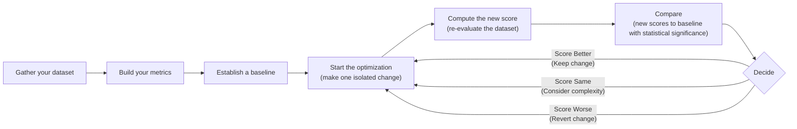

# The North Star of AI Engineering: A Framework for Evaluation-Driven Development

In our previous lessons, we instrumented our agents with observability tools and learned how to construct offline evaluation datasets. We now have the raw materials: traces and data. But this brings us to a fundamental question: what, exactly, should we measure? In classical machine learning, the answer is clear. We rely on rigorous standards like accuracy, precision, recall, and F1 scores, all validated by statistical significance. In AI engineering, however, the common practice is often to "vibe check" an output and decide if it "feels more coherent."

This reliance on intuition is a trap. Investing in a proper evaluation layer is hard to prioritize; it delivers no immediate user-visible features and requires upfront effort to design datasets and metrics. It constantly competes with the pressure to ship. Yet, this same investment is what greatly accelerates long-term development. It provides an objective signal on every change, catches regressions instantly, and turns a guessing game into an engineering discipline. Without it, teams fly blind, making changes based on gut feelings and hoping for the best, which often leads to silent regressions and stalled progress.

Evals are the north star of AI engineering. They are the single source of truth that tells you exactly which modifications improve your system and which degrade it. In this lesson, we will establish the theoretical foundation for building this system.

We will cover:
- The optimization flywheel and its three core use cases.
- Metric-type trade-offs for unstructured outputs.
- Why business-aligned metrics beat benchmarks and generic scores.
- Why binary pass/fail judgments are superior to Likert scales.

With the problem and its importance clear, we will now examine how to operationalize evals inside a repeatable optimization flywheel that replaces intuition with evidence.

## Using Evals Through the Optimization Flywheel

To build intuition, let's examine how we can effectively use and integrate AI evaluations into our application development lifecycle. There are three core scenarios where evaluations provide value. First, evals **quantify the quality of your system** on a given set of metrics, creating a baseline snapshot of its current performance. This baseline is your ground truth, a quantitative measure of how well your system performs today. Without it, you cannot know if your system is production-ready or if your changes are making a genuine improvement. It answers the fundamental question: "How good is our system right now?"

Second, these metrics serve as **guidance when optimizing your system**. They provide objective evidence for experiments, shifting development from being intuition-based to evidence-based. Instead of saying a new prompt "feels better," you can prove that it increased the pass rate on a key metric by a specific, measurable amount. This transforms optimization from an art into a science, allowing you to systematically iterate toward a better product.

Finally, they act as **regression tests** that protect shared components from unintended breakage. This is critical in AI engineering, as prompts, tools, and retrieval strategies are often interconnected. A small change in one area, intended to fix one problem, can have cascading negative effects on others. A robust evaluation suite acts as a safety net, automatically flagging these regressions before they reach production.

### The Optimization Process

How does this look in a real-world scenario? The optimization flywheel is a systematic, step-by-step plan for iterative improvement.

1.  **Gather your dataset:** Assemble the offline dataset of inputs and expected outputs that represents your use cases. This dataset, which we covered in Lesson 28, must be representative of the real-world scenarios your system will encounter. It is the foundation of your entire evaluation process.
2.  **Build your metrics:** Define the business-aligned metrics that measure what success looks like for your application. As we will see later, these must be custom-built to reflect your specific product requirements, not generic, off-the-shelf scores.
3.  **Establish a baseline:** Run your evaluation suite on the current system to compute the initial baseline scores. This snapshot is your reference point for all future changes, the stake in the ground against which all improvements are measured.
4.  **Start the optimization:** Make one, isolated change that you believe will improve performance. This could be a prompt modification, a model swap, or a change in retrieval strategy. The key is to change only one variable at a time.
5.  **Compute the new score:** Re-evaluate the entire dataset by running the full evaluation suite on the modified system. It is essential to run it on the complete dataset to catch potential regressions in areas you were not directly targeting.
6.  **Compare:** Compare the new scores to the baseline, checking for statistical significance. This step quantifies the impact of your single, isolated change, telling you precisely how much better or worse your system has become.
7.  **Decide:** Based on the comparison, decide whether to keep the change (score is better), consider its complexity (score is the same), or revert it (score is worse). This decision is now data-driven, not based on a vibe.
8.  **Repeat:** Continue the cycle, making one change at a time, until your scores meet the desired quality threshold for production release.


Image 1: The iterative optimization flywheel for AI applications using evaluations.

It is critical to change only one variable per cycle. If you modify the prompt, the model, and the retrieval strategy all at once, it becomes impossible to attribute any score changes to a specific modification. This turns the process back into guesswork and defeats the purpose of a systematic framework.

This disciplined, one-variable-at-a-time approach is a practical application of causal inference. When you change multiple variables simultaneously, their effects become confounded, making it impossible to determine which change caused the improvement or regression [[17]](https://www.statsig.com/perspectives/causal-inference-in-product-experimentation). The flywheel is designed to mimic a randomized controlled trial (like an A/B test), isolating the impact of each specific change to establish a clear cause-and-effect relationship between your modification and the system's performance [[18]](https://telnyx.com/learn-ai/casual-inference-explained).

Furthermore, you must anchor statistical significance to actual business impact, not arbitrary p-values. A "better" score is always relative to the use case. For a high-volume customer support bot processing millions of queries, a 0.5% reduction in checkout errors could translate to thousands of fewer failed transactions and substantial savings [[1]](https://www.nngroup.com/articles/practical-significance). In this context, even a small, statistically significant improvement has a massive real-world gain.

Conversely, for a low-volume creative writing tool, a similar small improvement is likely negligible; you would require a much larger movement before declaring victory. This distinction mirrors the difference between statistical significance and practical significance, a core concept in fields like clinical trials. A drug might show a statistically significant effect on a biomarker, but if the effect is too small to improve a patient's quality of life, it lacks practical significance [[19]](https://arxiv.org/html/2605.02050v1). You must pre-specify what magnitude of change constitutes a meaningful business outcome before starting the optimization cycle.

### Regression Testing

The optimization flywheel can be adapted for regression testing. Before merging any new feature that touches shared components—like prompts, tool definitions, or memory—you run the full evaluation suite. This guards against breaking existing functionality. This is an effective technique to ensure new features do not degrade established performance.

This process can be simplified into five steps:
1.  **Implement a new feature:** You write the code and verify it works locally for the new use case, ensuring it delivers the intended functionality.
2.  **Run the AI evaluations:** You run the full suite of assessments, which covers all previous use cases, not just the new one. This comprehensive check is the key to catching unintended side effects.
3.  **Compare Scores:** You compare the baseline scores against the evaluation scores from your new feature branch. This comparison isolates the impact of your change on the entire system.
4.  **Metrics similar to baseline:** If the scores are statistically identical to the baseline, your feature has not negatively impacted existing behavior. You can merge it into your production codebase.
5.  **Metrics lower than the baseline:** If the scores are worse, you have introduced a regression. You must fix your code and then repeat the evaluation cycle.

```mermaid
flowchart LR
    A["Implement a new feature<br/>(verify locally)"] --> B["Run the AI evaluations<br/>(covering all previous use cases)"]
    B --> C["Compare Scores<br/>(baseline vs. new feature's eval scores)"]
    C --> D{"Metrics similar to baseline?"}
    D -->|Yes| E["Feature is OK<br/>(merge)"]
    D -->|No<br/>(Metrics lower than baseline)| F["Regression introduced<br/>(requires a fix)"]
    F --> B
```
Image 2: Integrating AI evaluations into CI pipelines for regression testing.

This treats evals like integration tests, but with a key difference: instead of enforcing a strict pass/fail threshold, you compare scores against a moving baseline. The goal is to maintain stability rather than achieve a fixed score.

Your evaluation dataset must also evolve. It should continuously expand with edge cases from new features, real-world failures captured via observability tools like Opik, and difficult examples discovered during debugging [[2]](https://www.comet.com/docs/opik/evaluation/advanced/manage_datasets), [[3]](https://www.decodingai.com/p/generate-synthetic-datasets-for-ai-evals).

For instance, if production traces reveal a regression where the agent fails to handle a specific type of user query, that trace should be added to the evaluation dataset. Instead of writing new tests in code, you broaden your test coverage by adding new, challenging samples to your dataset.

With the flywheel mechanics clear, we can now examine the different families of metrics we might plug into it when dealing with unstructured text and image outputs.

## Exploring Possible Metric Types

The core difficulty in evaluating AI systems is that we are often working with unstructured outputs like text, reasoning traces, or images. Unlike classical ML with its structured labels, standard accuracy metrics are not directly applicable. We must turn to other families of metrics.

### 1. BLEU and ROUGE

N-gram overlap metrics like BLEU (Bilingual Evaluation Understudy) and ROUGE (Recall-Oriented Understudy for Gisting Evaluation) are the oldest and simplest. They work by counting the lexical overlap of words and phrases (n-grams) between the generated output and a reference text [[4]](https://wandb.ai/ai-team-articles/llm-evaluation/reports/LLM-evaluation-benchmarking-Beyond-BLEU-and-ROUGE--VmlldzoxNTIzMTY0NQ), [[5]](https://medium.com/@sthanikamsanthosh1994/understanding-bleu-and-rouge-score-for-nlp-evaluation-1ab334ecadcb). Their main advantages are that they are fast, deterministic, and require no additional models. However, they are blind to semantic meaning. An answer that is a valid paraphrase will score poorly if it does not use the exact same words as the reference. They also cannot assess factual accuracy or logical reasoning. For example, if a reference is "The test was successful," and the model outputs "The experiment succeeded," the BLEU score would be near zero despite the identical meaning [[4]](https://wandb.ai/ai-team-articles/llm-evaluation/reports/LLM-evaluation-benchmarking-Beyond-BLEU-and-ROUGE--VmlldzoxNTIzMTY0NQ).

### 2. BERTScore

Embedding similarity metrics, such as BERTScore, address the semantic limitations of n-gram overlap. They use a language model like BERT to convert both the generated and reference texts into high-dimensional vector embeddings. By calculating the cosine similarity between these embeddings, they measure semantic closeness rather than lexical overlap [[4]](https://wandb.ai/ai-team-articles/llm-evaluation/reports/LLM-evaluation-benchmarking-Beyond-BLEU-and-ROUGE--VmlldzoxNTIzMTY0NQ). This allows them to recognize paraphrases and capture meaning far better than BLEU or ROUGE. Their main limitation is that they are still fundamentally comparison metrics and cannot verify complex business logic or rules. They can confirm that two statements mean the same thing, but not whether that meaning is factually correct or adheres to a specific guideline.

### 3. LLM Judges

The LLM-as-a-judge approach uses a powerful LLM to evaluate an output based on a detailed prompt. This prompt typically includes the original input, the generated output, a set of evaluation criteria, few-shot examples, and chain-of-thought instructions [[6]](https://www.confident-ai.com/blog/why-llm-as-a-judge-is-the-best-llm-evaluation-method), [[7]](https://arize.com/llm-as-a-judge). This method is highly flexible and can be customized to evaluate against complex, domain-specific requirements that other metrics cannot handle. For example, an LLM judge can check if a response adheres to a specific brand voice or follows a multi-step legal guideline.

The main advantage of LLM judges is their ability to evaluate subjective qualities and provide detailed, human-like critiques [[8]](https://www.evidentlyai.com/llm-guide/llm-as-a-judge). However, their performance depends heavily on the prompt and the evaluator model. They can be slower and more expensive, and if not carefully validated, they can inherit the biases of the underlying LLM, such as a preference for longer answers or for outputs generated by the same model family [[9]](https://cameronrwolfe.substack.com/p/llm-as-a-judge).

| Metric Family | Speed | Cost | Semantic Awareness | Business Alignment | Explainability |
| :--- | :--- | :--- | :--- | :--- | :--- |
| **BLEU/ROUGE** | High | Low | Low | Low | Medium |
| **BERTScore** | Medium | Low | High | Medium | Low |
| **LLM Judges** | Low | High | High | High | High |

Table 1: A trade-off summary of different evaluation metric families.

For the complex requirements of our capstone writing projects, such as guideline adherence and research grounding, LLM judges are the most practical choice.

Now, you kept hearing from us: "business metrics here, business metrics there." Thus, let's understand why defining your own business metrics is such an essential and underrated step in building your AI evals strategy.

## Why Business Metrics Over Benchmarks

It is a common mistake to look at popular leaderboards or public benchmarks to select an LLM or make product decisions. Benchmarks are often deceiving and can lead you down the wrong path [[10]](https://launchdarkly.com/blog/llm-evaluation).

There are two core reasons for this. First, benchmarks often function as marketing artifacts. Once a test set becomes public, models can be trained on it, and teams begin to "teach to the test." This is known as data contamination, where test data unintentionally leaks into training datasets, compromising the integrity of the evaluation [[11]](https://world.hey.com/bhari/ai-benchmark-scores-are-becoming-marketing-dynamic-eval-is-the-only-antidote-dedd7053). This leads to inflated scores that no longer reflect performance on unseen data. In some cases, models have been found to have overfitted to benchmarks, achieving high scores through memorization rather than genuine reasoning ability [[12]](https://openreview.net/forum?id=XbVMiW0jTM).

Second, there is a fundamental mismatch between the tasks on most benchmarks and the demands of real business applications. A model that excels at solving math problems from GSM8k or answering trivia questions from MMLU may fail completely at tasks like long-form creative writing, nuanced legal analysis, or personalized customer support [[13]](https://magazine.sebastianraschka.com/p/llm-evaluation-4-approaches). The synthetic or toy tasks common in benchmarks often lack ecological validity, meaning they do not represent the messy, complex workflows of real-world use cases.

Benchmarks have a proper, but narrow, role. They are useful for advancing research, and they can serve as an initial filter when selecting a model during early exploration. However, they should never be used as a proxy for product-level decisions or as a primary optimization target.

If benchmarks are misleading, generic prefab metrics that claim to measure universal qualities are even more dangerous. We must instead build metrics that are deeply tied to our specific application.

## Why Custom Business Metrics Over Generic Metrics

Generic, off-the-shelf metrics like "toxicity," "helpfulness," or RAGAS-style "faithfulness" are a mirage. They create a false sense of confidence by optimizing for the wrong signal, because they lack context about your product, your users, and your brand voice [[14]](https://www.linkedin.com/posts/shivanshu-aggarwal_evals-aievals-llm-activity-7375884554177449985-16kP).

A model can score brilliantly on "helpfulness" but fail catastrophically on your specific constraints. Consider the dashboard below. It looks impressive, with scores for "Truthfulness" and "Personalization." But what does a 3.7 in Personalization actually mean?
Image 3: A dashboard showing generic metrics like Helpfulness and Truthfulness, labeled "Don't Do This!" (Source [The 5-Star Lie: You’re Doing AI Evaluations Wrong](https://www.decodingai.com/p/the-5-star-lie-you-are-doing-ai-evals) [[15]])

This is a problem because the metric does not align with what users actually need, leading to wrongful optimization. For example, let's assume we want to check if an article written by our Brown agent contains hallucinations. If we use a generic `hallucination` score and it returns "positive," what does that tell us? Did the agent add information not present in the research? Did it deviate from the article guidelines? Or did it simply include a personal story that was not in the source text but is factually correct and relevant? A generic score cannot provide this level of specific, actionable feedback.

A generic hallucination detector might flag an engaging personal anecdote as a fabrication. Yet, that same anecdote may be exactly what your brand voice requires. The generic metric cannot distinguish between undesirable invention and desirable creative elaboration.

This problem is not unique to AI engineering. In high-stakes fields like medicine, using generic statistical metrics is actively discouraged. For example, the F1 score, widely used in machine learning, is considered an improper metric for clinical AI because it can be "gamed" by a model in ways that lead to worse patient decisions. It ignores the importance of true negatives—correctly identifying a patient who *doesn't* need surgery is a critical outcome, not an irrelevant data point [[20]](https://sarahgebauermd.substack.com/p/three-metrics-for-healthcare-ai-evaluation). Instead, medical AI evaluation focuses on metrics of clinical utility, like "net benefit," which directly measures whether using the model leads to better decisions by incorporating the real-world costs of misclassification [[20]](https://sarahgebauermd.substack.com/p/three-metrics-for-healthcare-ai-evaluation).

Prefab scores are limited because they lack domain-specific constraints, cannot pinpoint which part of an output failed, and introduce statistical noise. They do have a narrow, valid role, but only during exploratory data analysis. You can use them as a "flashlight" to surface interesting examples for manual review, not as a report card for quality.

Here are some valid uses for generic metrics:
1.  **Verbosity:** Sorting your outputs by length can reveal if your most verbose answers are rambling and unhelpful, helping you spot failure modes in long-form generation. This can also highlight outputs that are too brief and lack necessary detail.
2.  **Similarity Score:** You can use this to evaluate your RAG retriever. If the similarity between a user's query and the retrieved document chunks is low, your retriever is likely failing. This is a valid component-level check that helps diagnose one specific part of your system.
3.  **BERTScore:** This can be used to check the quality of your "golden" reference answers. If a cluster of outputs has a low BERTScore against a reference you expected to be similar, it might be because the LLM found a more creative or even better solution than your reference.

Every production metric must be deeply application-centric, derived from concrete product requirements, user success criteria, and explicit constraints.

Once we have rejected both benchmarks and generic metrics, the remaining design choice is how to elicit judgments from our LLM judge. Here, binary pass/fail criteria outperform every alternative.

## Choosing Binary Metrics Over Anything Else

When designing these custom metrics, you will face a choice: should you use a Likert scale (e.g., 1-5 stars) or a binary pass/fail? We strongly recommend **binary metrics**.

Likert scales are plagued with problems that undermine the evaluation process [[15]](https://www.decodingai.com/p/the-5-star-lie-you-are-doing-ai-evals).
1.  **Inconsistent Labeling:** The difference between a '3' and a '4' is subjective. One person's '4' is another's '3', leading to low inter-annotator agreement and endless debates over rubric definitions.
2.  **Statistical Noise:** Detecting a meaningful improvement from an average score of 3.2 to 3.4 requires a much larger sample size than detecting a shift in a binary pass rate from 60% to 70%. The ambiguity in scalar ratings introduces high entropy, or uncertainty, making it hard to distinguish signal from random variance [[23]](https://vinvashishta.substack.com/p/an-information-theory-approach-to). You can waste weeks on changes without knowing if you are making real progress [[16]](https://www.ellamind.com/blog/binary-vs-likert-scales).
3.  **Lazy Decision-Making:** Evaluators—both human and LLM—often default to the middle value ('3') to avoid a difficult judgment. This "satisficing" behavior hides uncertainty rather than resolving it, leaving you with a vague signal that your system is just "okay" [[15]](https://www.decodingai.com/p/the-5-star-lie-you-are-doing-ai-evals).

In contrast, binary evaluations work because they **force decisions**. The benefits are immediate.
1.  **Clearer Thinking:** You cannot simply label an output as "Fail" without knowing *why*. This forces you to create precise, unambiguous definitions of quality.
2.  **Consistency:** Binary decisions are faster and more consistent for both human annotators and LLM judges, leading to more reliable data.
3.  **Actionability:** A binary evaluation produces a clear signal tied to a specific problem. A spike in the "Constraint Violation" failure rate tells an engineer exactly where to start debugging. This approach transforms your evaluation suite into a set of **quality gates**, a concept borrowed from software engineering and manufacturing. A quality gate is an automated checkpoint with predefined pass/fail criteria that stops a pipeline early if standards are not met, preventing regressions and technical debt [[21]](https://www.softwareseni.com/building-quality-gates-for-ai-generated-code-with-practical-implementation-strategies), [[22]](https://www.codecentric.de/en/knowledge-hub/blog/evaluating-machine-learning-models-quality-gates). This is analogous to how manufacturing uses binary classification to label products as 'good' or 'defective' based on sensor data, a practice now enhanced by AI to handle complex, real-time data streams [[24]](https://www.qualitymag.com/articles/98430-beyond-dmaic-leveraging-ai-and-quality-40-for-manufacturing-innovation-in-the-fourth-industrial-revolution).

<aside>
💡
**Note:** The 3 points above translate exceptionally well to LLM Judges. Using binary scoring is a key design choice to mitigate the inherent randomness of LLMs. LLMs are much more stable when asked to make a binary decision than when asked to assign a scalar value. A binary metric translates to a more robust and repeatable evaluation pipeline.
</aside>

### Capturing Nuance

The standard objection is, "But I'm losing nuance! A 1-5 scale captures shades of gray." This is a misconception. You capture nuance not by making your scale fuzzier, but by making your criteria more **granular** [[16]](https://www.ellamind.com/blog/binary-vs-likert-scales).

Instead of a single, subjective 1-5 rating for "Quality," you should create multiple, specific, binary checks. For our writing agent, this might look like:
1.  **Content Adherence:** Does the generated article contain the same core concepts as the expected article? (Yes/No)
2.  **Flow of Ideas Adherence:** Does the generated article present ideas in the same order as the expected article? (Yes/No)
3.  **Article Guideline Adherence:** Does the generated article follow the flow of ideas from the article guideline input? (Yes/No)
4.  **Research Anchoring:** Is every claim in the article supported by the provided research? (Yes/No)

By aggregating these binary signals, you get a nuanced, multi-dimensional view of performance without the noise and ambiguity of a Likert scale. This approach is simple, scalable, and robust enough for production systems.

With the full theoretical picture in place, we can now summarize the mindset shift required and preview the hands-on implementation that follows in the next lesson.

## Conclusion

The path to building reliable AI products requires a fundamental shift in mindset: away from vibe checks, leaderboards, and generic scores, and toward a rigorous, evaluation-driven development process. This framework is built on custom, business-aligned metrics that measure what truly matters for your application.

Granular, binary pass/fail criteria provide the clearest and most actionable signal for optimization, allowing you to iterate with confidence. They eliminate the statistical noise and subjectivity inherent in scalar ratings. In our next lesson, we will put this theory into practice by implementing custom LLM judges from scratch to evaluate our Brown writing workflow.

## References

- [1] Kate Moran. (2024). Practical Significance: What It Is and How to Report It. Nielsen Norman Group. (https://www.nngroup.com/articles/practical-significance)
- [2] Manage Datasets. (n.d.). Comet. (https://www.comet.com/docs/opik/evaluation/advanced/manage_datasets)
- [3] Paul Iusztin. (2025). Generate Synthetic Datasets for AI Evals. Decoding AI. (https://www.decodingai.com/p/generate-synthetic-datasets-for-ai-evals)
- [4] Josep Ferrer. (2025). LLM evaluation benchmarking: Beyond BLEU and ROUGE. Weights & Biases. (https://wandb.ai/ai-team-articles/llm-evaluation/reports/LLM-evaluation-benchmarking-Beyond-BLEU-and-ROUGE--VmlldzoxNTIzMTY0NQ)
- [5] Santosh Kumar Stanimikam. (2023). Understanding BLEU and ROUGE Score for NLP Evaluation. Medium. (https://medium.com/@sthanikamsanthosh1994/understanding-bleu-and-rouge-score-for-nlp-evaluation-1ab334ecadcb)
- [6] Why LLM-as-a-Judge is the Best LLM Evaluation Method. (n.d.). Confident AI. (https://www.confident-ai.com/blog/why-llm-as-a-judge-is-the-best-llm-evaluation-method)
- [7] LLM-as-a-Judge. (n.d.). Arize. (https://arize.com/llm-as-a-judge)
- [8] LLM-as-a-judge: a complete guide to using LLMs for evaluations. (2026). Evidently AI. (https://www.evidentlyai.com/llm-guide/llm-as-a-judge)
- [9] Cameron R. Wolfe. (2024). LLM as a Judge. The AI Tidings. (https://cameronrwolfe.substack.com/p/llm-as-a-judge)
- [10] Alex G. (2025). LLM Evaluation: Beyond Basic Benchmarks. LaunchDarkly. (https://launchdarkly.com/blog/llm-evaluation)
- [11] B Hari. (2026). AI — Benchmark scores are becoming marketing; dynamic eval is the only antidote. HEY World. (https://world.hey.com/bhari/ai-benchmark-scores-are-becoming-marketing-dynamic-eval-is-the-only-antidote-dedd7053)
- [12] Emilio Barkett, Olivia Long, and Madhavendra Thakur. Reasoning isn't enough: Examining truthbias and sycophancy in llms. *arXiv preprint arXiv:2506.21561*, 2025. (https://openreview.net/forum?id=XbVMiW0jTM)
- [13] Sebastian Raschka. (2024). 4 Approaches for LLM Evaluation. Ahead of AI. (https://magazine.sebastianraschka.com/p/llm-evaluation-4-approaches)
- [14] Shivanshu Aggarwal. (2025). LinkedIn Post on Generic AI Metrics. LinkedIn. (https://www.linkedin.com/posts/shivanshu-aggarwal_evals-aievals-llm-activity-7375884554177449985-16kP)
- [15] Paul Iusztin. (2025). The 5-Star Lie: You’re Doing AI Evaluations Wrong. Decoding AI. (https://www.decodingai.com/p/the-5-star-lie-you-are-doing-ai-evals)
- [16] Binary vs. Likert Scales in AI Evaluation. (n.d.). Ellamind. (https://www.ellamind.com/blog/binary-vs-likert-scales)
- [17] Causal inference in product experimentation. (2024). Statsig. (https://www.statsig.com/perspectives/causal-inference-in-product-experimentation)
- [18] Causal Inference Explained. (n.d.). Telnyx. (https://telnyx.com/learn-ai/casual-inference-explained)
- [19] Toward Foundational Principles for Evaluation of AI-based Medical Products in Interventional Clinical Trials. (2026). arXiv. (https://arxiv.org/html/2605.02050v1)
- [20] Sarah Gebauer. (2024). Three Metrics for Healthcare AI Evaluation You Need to Know. Substack. (https://sarahgebauermd.substack.com/p/three-metrics-for-healthcare-ai-evaluation)
- [21] Building Quality Gates for AI-Generated Code with Practical Implementation Strategies. (n.d.). SoftwareSeni. (https://www.softwareseni.com/building-quality-gates-for-ai-generated-code-with-practical-implementation-strategies)
- [22] Evaluating Machine Learning Models with Quality Gates. (n.d.). codecentric. (https://www.codecentric.de/en/knowledge-hub/blog/evaluating-machine-learning-models-quality-gates)
- [23] Vin Vashishta. (2024). An Information Theory Approach to AI Evaluations. Substack. (https://vinvashishta.substack.com/p/an-information-theory-approach-to)
- [24] Beyond DMAIC: Leveraging AI and Quality 4.0 for Manufacturing Innovation in the Fourth Industrial Revolution. (n.d.). Quality Magazine. (https://www.qualitymag.com/articles/98430-beyond-dmaic-leveraging-ai-and-quality-40-for-manufacturing-innovation-in-the-fourth-industrial-revolution)