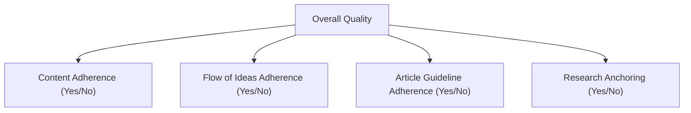

# The North Star of AI Engineering: A Guide to Evaluation-Driven Development

In our previous lessons, we instrumented our AI agents with observability tools like Opik and constructed offline datasets for testing. We now have the raw materials for evaluation. The next step is to build the theoretical framework for designing the metrics themselves. In classical machine learning, we rely on rigorous standards like accuracy, precision, recall, and F1 scores to measure performance. In AI engineering, however, it is all too common to see teams rely on "vibe checks." This is a subjective sense that an output "feels more coherent" or "seems better."

Investing in a proper evaluation layer can feel difficult to prioritize. It does not deliver an immediate, user-visible feature. It requires upfront effort to design datasets and metrics, competing with the constant pressure to ship new functionality. However, this investment is what separates prototypes from production-ready systems. It substantially accelerates long-term iteration by providing an objective signal on every change and catching regressions instantly. This is the core of Evaluation-Driven Development (EDD), a systematic approach where continuous testing guides every stage of an application's lifecycle [[1]](https://www.decodingai.com/p/escaping-poc-purgatory-evaluation).

Evals are the north star of AI engineering. They are the single source of truth that tells you exactly which modifications improve your system and which degrade it. With a well-defined evaluation layer, you know what to optimize and can catch regressions before they reach users.

In this lesson, we will cover the core principles of evaluation-driven development:
*   The optimization flywheel and its three core use cases.
*   Trade-offs between different metric types for unstructured outputs.
*   Why custom business metrics beat public benchmarks and generic scores.
*   Why binary pass/fail judgments are superior to Likert scales.

With the problem and its importance clear, we will now examine how to operationalize evaluations inside a repeatable optimization flywheel that replaces intuition with evidence.

## Using Evals Through the Optimization Flywheel

To build intuition, let's examine how we can effectively use and integrate AI evaluations into our application development lifecycle. There are three core scenarios where evaluations provide value.

First, evaluations **quantify the quality of your system** on a given set of metrics, creating a baseline snapshot of its current performance. This is your source of truth. Without this baseline, you cannot know if your system is ready for production or if your changes are actually improving it. This initial step moves you from subjective "vibes" to an objective, measurable state. It is the foundational act of turning an art into an engineering discipline [[2]](https://www.decodingai.com/p/stop-launching-ai-apps-without-this).

Second, these metrics serve as **guidance when optimizing your system**. They provide objective evidence for experiments, shifting development from being intuition-based to evidence-based. Instead of guessing if a new prompt is better, you can measure its impact directly. This creates a tight feedback loop where you build, deploy to a test environment, monitor, evaluate, and iterate. This cycle, driven by error analysis, is the engine of improvement. The NVIDIA data flywheel, for example, uses this process to continuously refine agentic AI systems by curating data, customizing models, and running comprehensive evaluations to improve performance on specific tasks like tool selection [[3]](https://galileo.ai/blog/nvidia-data-flywheel-for-de-risking-agentic-ai).

Finally, evaluations act as **regression tests that protect shared components**. This is critical in AI engineering, where prompts, tool descriptions, and retrieval logic are often shared and interconnected. A change intended to improve one feature can inadvertently break another. Automated evals catch these regressions before they cause problems in production. The goal here is stability rather than improvement. This is especially important for enterprise applications where reliability and consistency are paramount [[4]](https://www.nvidia.com/en-us/glossary/data-flywheel).

### The Optimization Process

How does this look in a real-world scenario? The optimization flywheel provides a step-by-step plan of attack.

1.  **Gather your dataset:** You start with the offline dataset you have assembled, representing key use cases and edge cases for your application. This can be built from real user interactions or bootstrapped with synthetic data generated from user personas and scenarios. The goal is to create a dataset that accurately models the data-generating process of your real users [[2]](https://www.decodingai.com/p/stop-launching-ai-apps-without-this).
2.  **Build your metrics:** You define a set of business-aligned metrics that measure what success looks like for your product. This involves identifying a principal domain expert whose judgment sets the standard for quality and using their insights to craft specific, binary pass/fail criteria [[5]](https://hamel.dev/blog/posts/llm-judge/).
3.  **Establish a baseline:** You run your evaluation suite on the current version of your system to compute baseline scores for each metric. This initial labeling is best done by hand to build intuition before automating with an LLM judge. This baseline is your "control" in the scientific method of product development [[2]](https://www.decodingai.com/p/stop-launching-ai-apps-without-this).
4.  **Start the optimization:** You make one, and only one, isolated change that you believe will improve performance, such as modifying a prompt or swapping an embedding model. This disciplined, single-variable approach is crucial for clear attribution.
5.  **Compute the new score:** You re-evaluate the entire dataset by re-running the evals on the modified system. This step must be automated to allow for rapid iteration.
6.  **Compare:** You compare the new scores to the baseline, checking for statistical significance to ensure the change is meaningful and not just random noise.
7.  **Decide:** Based on whether the score is better, the same, or worse, you decide to keep the change, revert it, or consider its complexity if the improvement is minor. This decision should always be tied back to business impact.
8.  **Repeat:** You repeat this cycle, continuously iterating until the scores meet your target for production readiness.

Image 1: A flowchart illustrating the eight-step optimization flywheel for AI applications using evaluations.

It is critical to keep all components fixed except for one variable per cycle [[1]](https://www.decodingai.com/p/escaping-poc-purgatory-evaluation). If you change the prompt and the retrieval strategy at the same time, it becomes impossible to attribute any score changes. This turns a disciplined process back into guesswork. However, this single-variable approach has its own theoretical limitations, especially in complex, interconnected agentic systems. Agents are probabilistic, and a single change can trigger different reasoning paths or emergent behaviors that are hard to isolate. In multi-agent systems, this is amplified; a change in one agent can cause cascading failures or inter-agent misalignment that a simple A/B comparison might not capture [[6]](https://arxiv.org/html/2505.10468v1). While the "change one thing at a time" rule is a powerful starting point, be aware that in highly agentic systems, you are evaluating a complex system, not just an isolated component.

Furthermore, you must anchor statistical significance to actual business impact, not arbitrary p-values [[7]](https://www.nngroup.com/articles/practical-significance). "Better" is always relative to the use case. For a high-volume customer support bot that handles two million checkouts a year, a 0.5% reduction in checkout errors might seem small. But at scale, that translates to 10,000 fewer failed transactions. If each failure costs $15, that small improvement is worth $150,000 annually [[7]](https://www.nngroup.com/articles/practical-significance). In contrast, for a low-volume creative writing tool used by a few hundred people, a similar small improvement is likely negligible. A much larger movement would be required before declaring victory. This principle is widely used in business, from pharmaceutical companies testing new drugs to online retailers optimizing ad campaigns [[8]](https://corporatefinanceinstitute.com/resources/data-science/statistical-significance).

### Regression Testing

A powerful variation of this flywheel is using evaluations for regression testing. Before merging any new feature that touches a shared component, you must run the full evaluation suite. These components can include a system prompt, a tool, or orchestration logic. This guards against unintended breakage in existing behavior and is an extremely powerful technique to ensure your new features do not break old ones.

The process is a simplified, sequential version of the optimization flywheel:

1.  **Implement a new feature:** You write the code and verify it works locally for the new use case.
2.  **Run the AI evaluations:** You run the full suite of assessments, covering all previous use cases, not just the new one.
3.  **Compare Scores:** You compare the new scores from your feature branch against the established baseline from the main branch.
4.  **Analyze and Decide:** If the scores are identical or better, the feature has not introduced a regression and can be merged. If the scores are worse, you have introduced a regression that must be fixed before merging.
5.  **Merge or Fix:** You either merge the feature into your production codebase or return to step 1 to fix the regression, repeating the cycle.

<https://images.spr.so/cdn-cgi/imagedelivery/j42No7y-dcokJuNgXeA0ig/81fa7407-fdcd-4427-8468-669a31e2ca3f/ai_evals_-1/w=1920,quality=90,fit=scale-down> 
Image 2: Integrating AI evaluations into CI pipelines for regression testing.

This treats your evaluation suite like unit or integration tests in traditional software, with one key difference: instead of a strict pass/fail threshold, you compare scores against a moving baseline. This approach is necessary because AI systems fail in ways traditional software does not. A standard unit test cannot catch a plausible-sounding hallucination, and an integration test will not sound the alarm when performance degrades gradually as user behavior shifts over time [[9]](https://agility-at-scale.com/ai/architecture/evaluation-and-testing-frameworks). Your evaluation suite is designed to detect these unique, probabilistic failure modes.

Your dataset must also continuously evolve. It is not a static artifact. You should constantly expand it with new edge cases discovered during development, failures captured from production traces via observability tools like Opik, and difficult examples that expose current failure modes [[10]](https://www.comet.com/docs/opik/evaluation/advanced/manage_datasets).

For instance, if you notice a real-world regression in production, you can add the specific trace that caused it to your evaluation dataset. This ensures that the same mistake will be caught automatically in the future. Instead of writing new tests in code, you broaden your test coverage by adding new samples to the dataset [[11]](https://www.decodingai.com/p/generate-synthetic-datasets-for-ai-evals).

With the flywheel mechanics clear, we can now examine the different families of metrics we might plug into it when dealing with unstructured text and image outputs.

## Exploring Possible Metric Types

The core difficulty in evaluating AI systems is that we are often dealing with unstructured text, reasoning traces, or even images, where standard accuracy metrics do not apply. There are three main families of metrics designed to handle these outputs.

### 1. BLEU and ROUGE

Metrics like BLEU (Bilingual Evaluation Understudy) and ROUGE (Recall-Oriented Understudy for Gisting Evaluation) operate by measuring n-gram overlap [[12]](https://medium.com/@sthanikamsanthosh1994/understanding-bleu-and-rouge-score-for-nlp-evaluation-1ab334ecadcb). They count how many sequences of words in the generated text match sequences in a reference text. Their primary advantages are that they are fast, deterministic, and require no additional models to compute [[13]](https://www.traceloop.com/blog/demystifying-the-bleu-metric). However, their reliance on lexical overlap is also their biggest weakness. They are blind to semantic meaning. If a model produces a correct answer using different words, like "The test was successful" instead of the reference "The experiment succeeded," BLEU and ROUGE will penalize it. They also do not care about factual accuracy at all [[14]](https://wandb.ai/ai-team-articles/llm-evaluation/reports/LLM-evaluation-benchmarking-Beyond-BLEU-and-ROUGE--VmlldzoxNTIzMTY0NQ).

### 2. BERTScore

Embedding similarity metrics, like BERTScore, address the semantic blindness of n-gram metrics. They use a language model like BERT to convert both the generated text and the reference text into high-dimensional vectors, or embeddings. By calculating the cosine similarity between these embeddings, they measure how close the texts are in meaning [[15]](https://www.elastic.co/search-labs/blog/evaluating-rag-metrics). This allows them to recognize paraphrases and semantic equivalence, which is a major advantage over purely lexical methods. However, they are still fundamentally comparison metrics. They cannot verify complex business logic or ensure adherence to specific guidelines that are not captured in the reference text. They also come with higher computational costs and can be less interpretable than simple overlap metrics.

### 3. LLM Judges

The LLM-as-a-judge approach uses a powerful LLM to evaluate the output of another model. You provide the judge model with the input, the generated output, a set of detailed criteria, and often a few examples (few-shot prompting) and a reasoning structure (chain-of-thought) [[16]](https://www.confident-ai.com/blog/why-llm-as-a-judge-is-the-best-llm-evaluation-method). This method is highly flexible and customizable, allowing you to evaluate against complex, domain-specific requirements that other metrics cannot handle. For example, you can ask a judge to verify if a response adheres to a specific brand voice or follows a multi-step instruction [[17]](https://www.braintrust.dev/articles/what-is-llm-as-a-judge).

The main advantage of LLM judges is their ability to evaluate subjective qualities and provide detailed, human-like critiques. The primary disadvantages are that their performance depends heavily on the prompt and the judge model, and they can be slower and more expensive [[18]](https://www.evidentlyai.com/llm-guide/llm-as-a-judge). They can also inherit the biases of the underlying LLM, such as a preference for longer answers or a tendency to agree with their own style of response [[19]](https://cameronrwolfe.substack.com/p/llm-as-a-judge). To mitigate these issues, LLM judges must be calibrated. This often involves building a "golden" dataset of human-annotated examples to create few-shot prompts for the judge or using multi-judge consensus to improve scoring consistency. We will cover the practical implementation of calibrating judges in a future lesson [[20]](https://www.langchain.com/resources/llm-as-a-judge).

While this lesson focuses on text, these evaluation principles extend to multi-modal agents that process images, audio, and other data types. Multi-modal evaluation shifts the focus from model-centric metrics to system-level assessments. Instead of just measuring text similarity, you evaluate the agent's reasoning coherence, its accuracy in selecting and using tools across different modalities, and its success in completing complex, multi-step tasks. This holistic approach is essential for validating the performance of agents that interact with the world through more than just text [[21]](https://arxiv.org/html/2512.12791v2).

| Metric Family | Speed | Cost | Semantic Awareness | Business Alignment | Explainability |
| :--- | :--- | :--- | :--- | :--- | :--- |
| **BLEU/ROUGE** | High | Low | Low | Low | Medium |
| **BERTScore** | Medium | Low | High | Medium | Low |
| **LLM Judge** | Low | High | Very High | Very High | High |

Table 1: A comparison of trade-offs between different evaluation metric families.

For the complex requirements of our capstone writing agent—such as guideline adherence, structural fidelity, and grounding in research—LLM judges are the most practical choice.

You have heard us repeatedly mention "business metrics." Let's now understand why defining your own business metrics is such an essential and underrated step in building your AI evaluation strategy.

## Why Business Metrics Over Benchmarks

Benchmarks are the most deceiving type of metric. Making product decisions based on popular leaderboards or open benchmarks is often a mistake. There are two core reasons for this.

First, public benchmarks often function as marketing artifacts [[22]](https://world.hey.com/bhari/ai-benchmark-scores-are-becoming-marketing-dynamic-eval-is-the-only-antidote-dedd7053). Once a test set is public, models inevitably begin to overfit to it. Teams "teach to the test," and the leaderboard scores become inflated, losing their validity as a measure of performance on unseen data [[23]](https://launchdarkly.com/blog/llm-evaluation). This phenomenon, known as reasoning paradigm overfitting, occurs when models memorize solution patterns specific to a benchmark rather than developing generalizable reasoning skills. For example, a model might learn the specific template for solving a type of logic puzzle but fail when a slight variation renders that template useless [[24]](https://openreview.net/forum?id=XbVMiW0jTM). There have even been instances where models were found to have been trained on the test sets, compromising the integrity of the evaluation entirely [[25]](https://www.evidentlyai.com/llm-guide/llm-benchmarks).

Second, there is a fundamental mismatch between the tasks in most benchmarks and the workloads of real business applications [[26]](https://magazine.sebastianraschka.com/p/llm-evaluation-4-approaches). A model that excels at solving grade-school math problems, like those in the Grade School Math 8K (GSM8K) benchmark, or answering multiple-choice questions from the Massive Multitask Language Understanding (MMLU) benchmark may not be good at long-form creative writing, nuanced legal analysis, or personalized customer support. These benchmarks often test for narrow, well-defined skills that do not capture the complexity of real-world workflows [[27]](https://arxiv.org/html/2601.20617v1).

The proper role for benchmarks is narrow: they are useful for advancing research, and for initial model filtering during the early exploration phase of a project. They should never be used as a proxy for product-level decisions or as the primary target for optimization.

If benchmarks are misleading, generic prefab metrics that claim to measure universal qualities are even more dangerous. We must instead build metrics that are deeply tied to our specific application.

## Why Custom Business Metrics Over Generic Metrics

Generic, off-the-shelf metrics for qualities like "toxicity," "helpfulness," or "hallucination" create a mirage. They give the illusion of progress while optimizing for the wrong signal and creating false confidence. They lack the context of your product, your users' expectations, and your brand's voice [[28]](https://www.linkedin.com/posts/shivanshu-aggarwal_evals-aievals-llm-activity-7375884554177449985-16kP). A model can score brilliantly on a generic "helpfulness" metric but fail catastrophically on your specific constraints [[29]](https://www.decodingai.com/p/the-mirage-of-generic-ai-metrics).

Consider the dashboard below. It looks impressive, with scores for "Truthfulness" and "Personalization." But what does a 3.7 in "Personalization" actually mean? This is the trap of vague, abstract metrics.

<https://images.spr.so/cdn-cgi/imagedelivery/j42No7y-dcokJuNgXeA0ig/585bb9f6-0bf3-427f-a9d3-994dd5849a1a/322c2e07-ee9a-4139-b51d-8f0c4787d880_1600x822/w=1920,quality=90,fit=scale-down>
Image 3: A dashboard showing generic metrics like Helpfulness and Truthfulness, labeled "Don't Do This!"

Let's assume we want to check if an article written by our Brown agent contains hallucinations. A generic `hallucination` score might return "positive." But what does that tell us? Did the model invent a fact that contradicts the provided research? Did it deviate from the article guidelines? Or did it simply include a personal story that was not in the source text but is factually correct and aligns with the desired tone? A generic metric cannot distinguish between undesirable invention and desirable creative elaboration. It might flag an engaging personal anecdote as a fabrication, even though that anecdote is exactly what your brand voice requires [[29]](https://www.decodingai.com/p/the-mirage-of-generic-ai-metrics).

Prefabricated scores suffer from several limitations: they cannot enforce domain-specific constraints, they cannot localize which part of an output failed, and they introduce statistical noise into your decision-making process. This inconsistency in validation makes direct comparisons between different metrics unreliable and can call into question the validity of the evaluation itself [[30]](https://arxiv.org/html/2508.13816v1).

This does not mean generic metrics have no use. They can act as a "flashlight" during exploratory data analysis, helping you surface interesting traces for manual review [[29]](https://www.decodingai.com/p/the-mirage-of-generic-ai-metrics).

Here are some valid uses for generic metrics:
1.  **Verbosity:** Sorting your outputs by length can reveal if your most verbose answers are rambling and unhelpful, or if your shortest answers are curt and missing information. This helps you spot failure modes in long-form generation by clustering problematic traces at the extremes.
2.  **Similarity Score:** You can use a similarity score to evaluate your RAG retriever. If the similarity between a user's query and the retrieved document chunks is low, your retriever is likely failing. This is a valid component-level check that helps diagnose a specific part of your system, not the final output's overall quality.
3.  **BERTScore:** You can use BERTScore to check the quality of your "golden" reference answers. If you find a cluster of outputs with a low score against a reference, a manual review might reveal that the LLM found a more creative or even a better solution than your reference. This challenges your assumptions about what a "good" answer is.

In all these cases, the generic metric is the start of an investigation, not the final verdict. Every production metric must be deeply application-centric, derived from concrete product requirements and user success criteria.

Once we have rejected both benchmarks and generic metrics, the remaining design choice is how to elicit judgments from our LLM judge. Here, binary pass/fail criteria outperform every alternative.

## Choosing Binary Metrics Over Anything Else

When designing custom metrics, you face a choice: a Likert scale (e.g., 1-5 stars) or a simple binary pass/fail. We strongly recommend **binary metrics**.

Likert scales are plagued with problems that undermine the evaluation process [[31]](https://www.decodingai.com/p/the-5-star-lie-you-are-doing-ai-evals):
1.  **Inconsistent Labeling:** The difference between a '3' and a '4' is subjective. One annotator's '4' is another's '3', leading to low inter-annotator agreement and noisy data. This ambiguity makes it difficult to achieve a high Cohen's Kappa score, a common measure of agreement [[32]](https://www.ellamind.com/blog/binary-vs-likert-scales).
2.  **Statistical Noise:** Detecting a meaningful improvement from an average score of 3.2 to 3.5 requires significantly more data than detecting a shift in a binary pass rate from 60% to 70%. In some cases, you may need more than double the samples to reach statistical significance, wasting weeks without knowing if you are making real progress [[32]](https://www.ellamind.com/blog/binary-vs-likert-scales).
3.  **Lazy Decision-Making:** Annotators—both human and LLM—often default to the middle value ('3') to avoid making a difficult judgment, creating a "mushy middle" where ratings cluster and drown the signal. This "satisficing" behavior hides uncertainty rather than resolving it, leaving you with a dashboard full of vague "okay" scores [[31]](https://www.decodingai.com/p/the-5-star-lie-you-are-doing-ai-evals).

In contrast, binary evaluations work because they **force decisions**. This simple constraint has several powerful benefits:
1.  **Clearer Thinking:** You cannot simply label an output as "Fail." You are forced to define precisely what a failure looks like for a specific criterion. This sharpens your definitions of quality.
2.  **Consistency:** Binary decisions are faster and more consistent for both humans and LLMs, yielding higher agreement and more reliable data.
3.  **Actionability:** The output is not a fuzzy number but a clear signal tied to a specific problem. A spike in the "Constraint Violation" failure rate tells an engineer exactly where to start debugging.

The real information, however, often lives in the reasoning behind the score. When a binary evaluator says "No" and explains why, you get something far more valuable: a specific, actionable diagnosis that tells you exactly what to fix. This is why pairing binary decisions with explanations for failures is a powerful technique for debugging [[32]](https://www.ellamind.com/blog/binary-vs-likert-scales).

<aside>
💡
**Note:** The 3 points above translate exceptionally well to LLM Judges. Using binary scoring is a key design choice to mitigate the inherent randomness of LLMs. LLMs are much more stable when asked to make a binary decision than when asked to assign a scalar value. A binary metric translates to a more robust and repeatable evaluation pipeline.
</aside>

### Capturing Nuance

The standard objection is the perceived loss of nuance: "What if a response is partially correct?" The solution is not a fuzzier scale, but more **granular** criteria. Instead of a single "Overall Quality" rating, you decompose it into multiple, specific, binary checks [[32]](https://www.ellamind.com/blog/binary-vs-likert-scales).

For our writing agent, instead of rating an article 1-5 for "Quality," we create multiple binary evaluations that capture specific dimensions of quality:

1.  **Content Adherence:** Does the generated article contain the same core concepts as the expected article? (Yes/No)
2.  **Flow of Ideas Adherence:** Does the generated article contain the ideas in the same order as the expected article? (Yes/No)
3.  **Article Guideline Adherence:** Does the generated article follow the flow of ideas from the article guideline input? (Yes/No)
4.  **Research Anchoring:** Is every claim in the article supported by the provided research? (Yes/No)

Image 4: A hierarchical diagram showing the decomposition of overall quality into specific binary evaluation criteria for a writing agent.

Aggregating these binary signals gives you a nuanced performance view without the noise and bias of Likert scales. This approach is simple, intuitive, and robust enough for production systems.

With the full theoretical picture in place, we can now summarize the mindset shift required and preview the hands-on implementation that follows in the next lesson.

## Conclusion

This lesson has laid out the case for a fundamental shift in how we approach AI engineering: moving away from vibe checks, leaderboards, and generic scores toward a rigorous practice of evaluation-driven development. This new practice is built on a foundation of custom, binary, and business-aligned metrics.

We have seen that granular pass/fail criteria deliver the clearest signal for optimization, avoiding the statistical noise and subjectivity inherent in scalar ratings. This disciplined approach, operationalized through the optimization flywheel, is what enables confident, evidence-based iteration. In our next lesson, we will translate this theory into practice by implementing custom LLM judges from scratch to evaluate our Brown writing workflow, showing you how to build, calibrate, and deploy these evaluators in a real-world project.

## References

- [1] Iusztin, P. (2025, October 16). Escaping POC Purgatory: Evaluation-Driven Development for AI Systems. *Decoding AI Magazine*. https://www.decodingai.com/p/escaping-poc-purgatory-evaluation
- [2] Iusztin, P. (2025, October 30). Stop Launching AI Apps Without This Framework. *Decoding AI Magazine*. https://www.decodingai.com/p/stop-launching-ai-apps-without-this
- [3] A Powerful Data Flywheel for De-Risking Agentic AI. (2024, July 16). *Galileo*. https://galileo.ai/blog/nvidia-data-flywheel-for-de-risking-agentic-ai
- [4] What Is a Data Flywheel? (2024, May 22). *NVIDIA*. https://www.nvidia.com/en-us/glossary/data-flywheel
- [5] Husain, H. (2024, November 11). Using LLM-as-a-Judge For Evaluation: A Complete Guide. *Hamel Husain's Blog*. https://hamel.dev/blog/posts/llm-judge/
- [6] Azaria, A., et al. (2025). *Inter-Agent Misalignment and Error Propagation in Agentic AI Systems*. arXiv:2505.10468v1. https://arxiv.org/html/2505.10468v1
- [7] Practical Significance: What It Is and How to Report It. (2024, January 21). *Nielsen Norman Group*. https://www.nngroup.com/articles/practical-significance
- [8] What is Statistical Significance? (2023, October 26). *Corporate Finance Institute*. https://corporatefinanceinstitute.com/resources/data-science/statistical-significance
- [9] Evaluation and Testing Frameworks for AI Applications. (2024, September 24). *Agility at Scale*. https://agility-at-scale.com/ai/architecture/evaluation-and-testing-frameworks
- [10] Manage datasets - Opik Documentation. (n.d.). *Opik*. https://www.comet.com/docs/opik/evaluation/advanced/manage_datasets
- [11] Iusztin, P. (2025, November 6). Generate Synthetic Datasets for AI Evals. *Decoding AI Magazine*. https://www.decodingai.com/p/generate-synthetic-datasets-for-ai-evals
- [12] S, S. (2023, June 28). Understanding BLEU and ROUGE score for NLP evaluation. *Medium*. https://medium.com/@sthanikamsanthosh1994/understanding-bleu-and-rouge-score-for-nlp-evaluation-1ab334ecadcb
- [13] Demystifying the BLEU Metric. (2024, May 15). *Traceloop*. https://www.traceloop.com/blog/demystifying-the-bleu-metric
- [14] LLM evaluation benchmarking: Beyond BLEU and ROUGE. (2025, January 15). *Weights & Biases*. https://wandb.ai/ai-team-articles/llm-evaluation/reports/LLM-evaluation-benchmarking-Beyond-BLEU-and-ROUGE--VmlldzoxNTIzMTY0NQ
- [15] Evaluating RAG: A new framework with new metrics. (2024, April 18). *Elastic*. https://www.elastic.co/search-labs/blog/evaluating-rag-metrics
- [16] What is LLM-as-a-Judge and Why is it The Best LLM Evaluation Method? (2024, May 29). *Confident AI*. https://www.confident-ai.com/blog/why-llm-as-a-judge-is-the-best-llm-evaluation-method
- [17] What is LLM-as-a-Judge? (2024, July 18). *Braintrust*. https://www.braintrust.dev/articles/what-is-llm-as-a-judge
- [18] What is LLM-as-a-judge? A guide to the LLM-based evaluation method. (2024, July 11). *Evidently AI*. https://www.evidentlyai.com/llm-guide/llm-as-a-judge
- [19] Wolfe, C. R. (2024, June 6). LLM as a Judge. *More is different*. https://cameronrwolfe.substack.com/p/llm-as-a-judge
- [20] LLM As A Judge. (n.d.). *LangChain*. https://www.langchain.com/resources/llm-as-a-judge
- [21] Liu, Y., et al. (2025). *Multi-Modal Evaluation for Agentic AI*. arXiv:2512.12791v2. https://arxiv.org/html/2512.12791v2
- [22] Hari, B. (2026, April 26). AI — Benchmark scores are becoming marketing; dynamic eval is the only antidote. *HEY World*. https://world.hey.com/bhari/ai-benchmark-scores-are-becoming-marketing-dynamic-eval-is-the-only-antidote-dedd7053
- [23] LLM Evaluation: Best Practices for Performant and Reliable LLM-based Apps. (2024, July 15). *LaunchDarkly*. https://launchdarkly.com/blog/llm-evaluation
- [24] Li, Z., et al. (2025). *PROBE: BENCHMARKING REASONING PARADIGM OVERFITTING IN LARGE LANGUAGE MODELS*. OpenReview. https://openreview.net/forum?id=XbVMiW0jTM
- [25] 30 LLM evaluation benchmarks and how they work. (2026, May 19). *Evidently AI*. https://www.evidentlyai.com/llm-guide/llm-benchmarks
- [26] Raschka, S. (2024, August 29). LLM Evaluation in 4 Steps. *Ahead of AI*. https://magazine.sebastianraschka.com/p/llm-evaluation-4-approaches
- [27] Bean, S., et al. (2025). *Easily Fooled? A Case Study in Synthetic Data for Evaluating Public Sector LLMs*. arXiv:2601.20617v1. https://arxiv.org/html/2601.20617v1
- [28] Aggarwal, S. (2026, September 1). *[Post on AI evaluation metrics]*. LinkedIn. https://www.linkedin.com/posts/shivanshu-aggarwal_evals-aievals-llm-activity-7375884554177449985-16kP
- [29] Iusztin, P. (2024, December 12). The Mirage of Generic AI Metrics. *Decoding AI Magazine*. https://www.decodingai.com/p/the-mirage-of-generic-ai-metrics
- [30] Belz, A., et al. (2025). *To Ship or not to Ship: A Meta-Evaluation of Evaluation Metrics for Natural Language Generation*. arXiv:2508.13816v1. https://arxiv.org/html/2508.13816v1
- [31] Iusztin, P. (2024, December 19). The 5-Star Lie: You’re Doing AI Evaluations Wrong. *Decoding AI Magazine*. https://www.decodingai.com/p/the-5-star-lie-you-are-doing-ai-evals
- [32] Binary vs. Likert Scales in LLM Evals. (2024, August 27). *Ella*. https://www.ellamind.com/blog/binary-vs-likert-scales