# Lesson 31: Continuous Integration for AI Agents

In our recent lessons, we integrated Opik for observability, built offline evaluation datasets, and established an evaluation-driven development framework. These steps gave us the visibility needed to understand agent behavior. Now, it is time to shift our focus to Continuous Integration (CI), the automated infrastructure that keeps your codebase maintainable and prevents regressions from reaching production. This is the engineering discipline that separates prototypes from products.

## What is Continuous Integration?

Continuous Integration is the practice of frequently merging code changes from multiple developers into a central repository. Each merge triggers an automated build and test sequence, which catches integration issues early and prevents the classic "it works on my machine" problem [[43]](https://www.atlassian.com/continuous-delivery/continuous-integration). While traditional software CI focuses on deterministic logic, compile checks, and unit tests, AI agent development introduces unique challenges. LLM calls are non-deterministic, prompts evolve rapidly, and API costs make running extensive test suites on every commit impractical [[1]](https://galileo.ai/blog/continuous-integration-ci-ai-fundamentals), [[2]](https://www.guild.ai/glossary/non-deterministic-systems).

Without a CI strategy tailored for AI, teams often encounter three recurring failure modes.

1.  **Inconsistent code formatting across the team.** When team members use different formatters or apply formatting manually, the result is cluttered code. This leads to time-wasting code reviews focused on style nitpicks instead of logic.
2.  **Skipped pre-commit checks, leading to CI failures.** Under pressure, developers might forget to run the full test suite before pushing code. Without automated enforcement, this leads to broken builds and CI failures that block the entire team.
3.  **Non-deterministic tests that call real LLM APIs.** Tests that rely on live LLM calls are slow, expensive, and flaky. They fail unpredictably due to API latency, rate limits, or the inherent randomness of LLM outputs, slowing down development and eroding trust in the test suite [[9]](https://agiflow.io/blog/effective-practices-for-mocking-llm-responses-during-the-software-development-lifecycle).

To address these challenges, we use a three-tier model that calibrates our checks by cost and speed.

*   **Tier 1: Formatting and Linting (Always Run).** These checks are fast, taking only seconds, and have no API costs. They catch syntactic errors and enforce a consistent code style across the project. This tier is identical to traditional CI.
*   **Tier 2: Unit and Integration Tests (Always Run).** These tests verify the deterministic logic of your agent, such as data parsing, schema validation, and state transitions, without calling external APIs. By mocking LLM responses, these tests run quickly (typically under a minute) and produce reliable, repeatable results.
*   **Tier 3: AI Evaluations (Manual/Release).** This tier is unique to AI systems. It involves running expensive, LLM-based quality checks against a curated dataset to evaluate the agent's semantic performance. We run these evaluations selectively, either manually before a major release or after a significant change to a prompt or model.

https://images.spr.so/cdn-cgi/imagedelivery/j42No7y-dcokJuNgXeA0ig/6bf41859-7dd2-4a23-9a88-55720f54114e/image/w=1920,quality=90,fit=scale-down
Image 1: A three-tier CI model for AI agents, showing the flow from commit checks to PR tests and finally to manual/release AI evaluations, with each tier distinctly colored.

The AI evaluations in Tier 3 serve as regression tests for semantic quality. Built on the offline evaluation datasets and Opik traces we covered in previous lessons, they catch performance drops that traditional unit tests structurally cannot detect [[16]](https://galileo.ai/blog/continuous-integration-ci-ai-fundamentals).

This lesson covers the CI essentials for building production-ready AI agents. We focus on the practical techniques you will use daily: automated quality checks, testing with mocked LLMs, and structuring CI pipelines around cost constraints. We will not cover comprehensive DevOps topics like Kubernetes or Terraform. Instead, we will show you how to effectively move from prototype to production-ready agents.

We will cover:
- Setting up pre-commit hooks to enforce code quality automatically.
- Configuring Ruff for linting and formatting.
- Writing unit tests for deterministic agent code with mocked LLM responses.
- Building a CI pipeline that runs automatically on every change.
- Using AI evaluations as selective regression tests in CI.

This lesson includes a hands-on notebook where you will practice running formatting checks, linting, and tests on Brown, our writing agent. With the three-tier model established, the fastest feedback comes from running the first tier locally before you even commit code. This is where pre-commit hooks come in.

## Pre-commit Hooks: Automated Local Guardrails

Pre-commit hooks are automated checks that run on your machine before your code enters the repository [[25]](https://pre-commit.com/). They act as local guardrails, providing immediate feedback and preventing common issues like formatting errors or syntax mistakes from ever reaching the shared codebase [[22]](https://blog.gitguardian.com/automated-guard-rails-for-vibe-coding).

The `pre-commit` framework manages these hooks through a declarative YAML file, `.pre-commit-config.yaml`. In this file, you define the hooks you want to use by referencing external repositories where they are maintained. The framework then handles the installation and execution of these hooks for you.

<aside>
💡
You can experiment with the code for this lesson in this [Colab](https://colab.research.google.com/github/louisfb01/agent-course-notebooks/blob/main/notebooks/lesson_31_notebook.ipynb#scrollTo=b30eba1a). Alternatively, you can find the code for this lesson in the notebook for Lesson 31 of the course GitHub repository.
</aside>

### Brown’s Pre-commit Configuration

Here is the `.pre-commit-config.yaml` file from our Brown writing agent.

```yaml
fail_fast: false

repos:
  - repo: https://github.com/abravalheri/validate-pyproject
    rev: v0.24.1
    hooks:
      - id: validate-pyproject

  - repo: https://github.com/pre-commit/mirrors-prettier
    rev: v3.1.0
    hooks:
      - id: prettier
        types_or: [yaml, json5]

  - repo: https://github.com/astral-sh/ruff-pre-commit
    # Ruff version. Keep in sync with the CI workflows (.github/workflows/*.yml).
    rev: v0.14.6
    hooks:
      # Run the linter.
      - id: ruff-check
        args: [--fix, --exit-non-zero-on-fix]
      # Run the formatter.
      - id: ruff-format
```

Let's walk through the three hooks we use.
*   **`validate-pyproject`**: This tool validates that your `pyproject.toml` file is structurally correct according to PEP standards. A malformed file can break the entire project.
*   **`prettier`**: A popular code formatter we use for configuration files like `.github/workflows/ci.yml`. Consistent formatting makes these files readable and reduces merge conflicts.
*   **`ruff-check` and `ruff-format`**: These hooks run Ruff, a modern Python linter and formatter. The `--fix` flag automatically fixes issues, and `--exit-non-zero-on-fix` ensures the hook fails even after auto-fixing, forcing you to review and re-stage the changes. The `ruff-check` hook runs before `ruff-format` as recommended by Ruff’s authors.

### Setting Up Pre-commit

In the `lessons/writing_workflow` repo, you can set up pre-commit hooks with these commands.
```bash
# Install dependencies (includes pre-commit)
uv sync --dev

# Install the Git hooks
pre-commit install
```
The `pre-commit install` command creates a Git hook at `.git/hooks/pre-commit`. Now, every time you run `git commit`, pre-commit runs automatically. You can also run hooks manually.
```bash
# Run all hooks on all files
make pre-commit
```
The workflow is simple: make changes, stage them with `git add`, and run `git commit`. If hooks fail, you review the errors, fix them, re-stage the files, and commit again. This tight feedback loop keeps code quality high.

Pre-commit hooks often rely on fast tools like Ruff to do the actual work. Next, we will examine Ruff in depth and show how to configure and run it both locally and in CI.

## Ruff: Fast Python Linting and Formatting

Ruff is a Python linter and code formatter written in Rust. It is designed to be extremely fast, often 10-100x faster than the tools it replaces, such as Black, isort, and Flake8 [[28]](https://docs.astral.sh/ruff). By consolidating multiple tools into a single binary, Ruff simplifies configuration, eliminates version conflicts, and dramatically reduces CI run times.

It is important to distinguish between formatting and linting.
*   **Formatting** automatically rewrites your code to follow a consistent style, handling details like indentation, line breaks, and spacing. It is opinionated and designed to be run without manual intervention.
*   **Linting** analyzes your code for potential bugs, stylistic issues, and violations of best practices, such as unused variables or missing imports. It flags problems but does not always fix them automatically.

### Brown’s Ruff Configuration

Ruff is configured in the `pyproject.toml` file, which keeps all project settings in one place [[53]](https://betterstack.com/community/guides/scaling-python/pyproject-explained/). Here is the configuration for our Brown agent.

```toml
[tool.ruff]
target-version = "py312"
line-length = 140

[tool.ruff.lint]
select = [
    "F",    # Pyflakes
    "E",    # pycodestyle errors
    "I",    # isort
]

[tool.ruff.lint.isort]
known-first-party = ["src", "tests"]

[tool.pytest.ini_options]
pythonpath = ["src"]
markers = [
    "integration: end-to-end workflow tests (mocked LLMs, no network). Select with `-m integration` or skip with `-m 'not integration'`.",
]
```

Here’s what each setting does:
*   `target-version = "py312"` tells Ruff to apply rules compatible with Python 3.12.
*   `line-length = 140` sets the maximum line length.
*   `select = ["F", "E", "I"]` enables rule sets from Pyflakes (for bug detection), pycodestyle (for PEP 8 compliance), and isort (for import sorting).
*   `known-first-party = ["src", "tests"]` helps isort correctly group your project’s internal imports.

To make running these checks easier, we have defined shortcuts in our `Makefile`.
```makefile
# --- Tests & QA ---

tests: # Run tests.
	CONFIG_FILE=configs/debug.yaml uv run pytest

pre-commit: # Run pre-commit hooks.
	uv run pre-commit run --all-files

format-fix: # Auto-format Python code using ruff formatter.
	uv run ruff format $(QA_FOLDERS)

lint-fix: # Auto-fix linting issues using ruff linter.
	uv run ruff check --fix $(QA_FOLDERS)

format-check: # Check code formatting without making changes using ruff formatter.
	uv run ruff format --check $(QA_FOLDERS) 

lint-check: # Check code for linting issues without fixing them using ruff linter.
	uv run ruff check $(QA_FOLDERS)
```
Each command uses `uv run` to execute Ruff within the project’s virtual environment, which `uv` manages automatically without needing manual activation [[54]](https://devcenter.upsun.com/posts/why-python-developers-should-switch-to-uv/).

### Hands-On Example: Fixing Formatting Issues

Let's see Ruff in action. First, we create a Python file with deliberate formatting errors.
```bash
# Create a Python file with various formatting issues
cat > test_formatting.py << 'EOF'
# This file has formatting issues
def  badly_formatted_function(x,y,z):
    result=x+y+z
    my_list=[1,2,3,4,5,6,7,8,9,10]
    my_dict={"key1":"value1","key2":"value2","key3":"value3"}
    if result>10:
        print("Result is greater than 10")
    else:
        print("Result is 10 or less")
    return result

class   BadlyFormattedClass:
    def __init__(self,name,age):
        self.name=name
        self.age=age
    def get_info(self):
        return f"{self.name} is {self.age} years old"
EOF

echo "Created test_formatting.py"
```
It outputs:
```text
Created test_formatting.py
```
Now, we run the format checker. The `--check` flag reports issues without changing the file.
```bash
uv run ruff format --check test_formatting.py
```
It outputs:
```text
Would reformat: test_formatting.py
1 file would be reformatted
```
To fix the issues, we run the command without `--check`.
```bash
uv run ruff format test_formatting.py
```
It outputs:
```text
1 file reformatted
```
Ruff automatically corrects spacing, indentation, and other stylistic inconsistencies, making the code clean and readable.

### Hands-On Example: Fixing Linting Issues

Next, let's fix some linting errors. We create a file with unused imports, a duplicate import, and an undefined variable.
```bash
cat > test_linting.py << 'EOF'
import os
import sys
import json # Unused import

def calculate_sum(numbers):
    """Calculate sum of numbers."""
    total = 0
    for num in numbers:
        total = total + num
    return total

def process_data(data):
    """Process some data."""
    result = calculate_sum(data)
    print(f"Result: {result}")
    _ = os.getcwd()  # Use os
    _ = sys.argv[0]  # Use sys
    undefined_variable = some_undefined_function()  # Using undefined name
    return result

import sys # Duplicate import
EOF

echo "Created test_linting.py"
```
It outputs:
```text
Created test_linting.py
```
Running the linter check reveals several issues.
```bash
uv run ruff check test_linting.py
```
It outputs:
```text
Found 7 errors.
[ *] 4 fixable with the `--fix` option (1 hidden fix can be enabled with the `--unsafe-fixes` option).
```
Ruff identifies the unused `json` import (`F401`), the redefinition of `sys` (`F811`), and the use of an undefined name (`F821`). To fix what we can automatically, we use the `--fix` flag.
```bash
uv run ruff check --fix test_linting.py
```
It outputs:
```text
Found 5 errors (3 fixed, 2 remaining).
No fixes available (1 hidden fix can be enabled with the `--unsafe-fixes` option).
```
Ruff removes the unused and duplicate imports but leaves the `F821` error (undefined name) because it is a logic bug that requires manual intervention.

Once formatting and linting guardrails are in place, our attention turns to verifying the deterministic logic inside the agent nodes. This is the role of unit tests.

## Unit Tests for Agent Repos

The core challenge in testing AI agents is the non-determinism of LLMs. Making live API calls in tests leads to several problems: they are slow, which discourages frequent running; they are expensive, adding significant costs to your CI pipeline; and they are flaky, as identical inputs can produce different outputs or fail due to network issues or rate limits [[2]](https://www.guild.ai/glossary/non-deterministic-systems), [[12]](https://www.iamraghuveer.com/posts/unit-testing-custom-agents).

Unit tests solve this by focusing on the deterministic parts of your agent. They verify specific pieces of logic in isolation, ensuring that components like data parsers, schema validators, routing logic, and utility functions work correctly without involving a live LLM [[30]](https://www.guild.ai/glossary/unit-testing-ai-agents). For an AI agent, this means testing things like:
*   **Parsing and rendering:** Does your markdown loader correctly extract article sections?
*   **Schema validation:** Does your Pydantic model raise an error for invalid data?
*   **Routing decisions:** Given a specific state, does your workflow transition to the correct node?
*   **Utilities:** Do helper functions for text cleaning or data transformation behave as expected?

### Unit Tests vs. Integration Tests

In traditional software, a **unit test** verifies a single function or class in isolation, while an **integration test** checks how multiple components work together. In agentic systems, this distinction can blur. A single agent "node" might combine prompt templating, an LLM call, and structured output parsing.

We take a pragmatic approach: if a test verifies deterministic logic, runs quickly with mocked dependencies, and does not make network calls, we consider it a unit test. This allows us to test meaningful chunks of our agent's logic while keeping our test suite fast and reliable.

The key to achieving this is mocking LLM responses. Instead of patching network calls at the HTTP layer, we use a response injection strategy. We have a fake model class that mimics the real LLM interface but returns pre-defined responses. This gives us precise control over the test environment and is simpler to implement for most agentic applications [[9]](https://agiflow.io/blog/effective-practices-for-mocking-llm-responses-during-the-software-development-lifecycle), [[13]](https://docs.langchain.com/oss/javascript/integrations/chat/fake).

<aside>
💡
Another option to mock LLM calls in tests is HTTP mocking, where you intercept API requests and return canned responses using libraries like `responses` or `httpretty`. Some teams prefer fixture-based mocking with pytest fixtures and `unittest.mock.patch` to replace LLM calls with fixed outputs. There's also record and replay, which captures real API responses once and then replays them in tests using tools like `VCR.py`.
</aside>

### Our Implementation: The FakeModel Pattern

In our Brown agent, we implement response injection with a `FakeModel` class that is compatible with LangChain’s interface. This pattern has three parts:
1.  **Configuration specifies the fake model:** The `debug.yaml` configuration at `lessons/writing_workflow/configs/debug.yaml` sets all nodes to use `model_id: “fake”`.
2.  **Model factory returns FakeModel:** The model builder in `src/brown/models/get_model.py` returns a `FakeModel` instance when the configuration specifies it.
3.  **Tests inject specific responses:** The `FakeModel` in `src/brown/models/fake_model.py` extends LangChain’s `FakeListChatModel` and allows tests to inject a list of responses.

Here is the implementation of our `FakeModel` class.
```python
class FakeModel(FakeListChatModel):
    def __init__(self, responses: list[str]) -> None:
        super().__init__(responses=responses)

        self._structured_output_type: Type[Any] | None = None
        self._include_raw: bool = False

    ...

    async def ainvoke(self, inputs, *args, **kwargs) -> Any:
        if len(self.responses) == 0:
            return []

        if self._structured_output_type is not None:
            # For structured output, we need to handle the mocked response directly
            # without going through the parent's ainvoke method which creates AIMessage
            response_content = self.responses[0]

            if isinstance(response_content, dict):
                structured_response = self._structured_output_type(**response_content)
            elif isinstance(response_content, str):
                try:
                    data = json.loads(response_content)
                    structured_response = self._structured_output_type(**data)
                except Exception:
                    logger.warning(f"Failed to parse response as JSON: {response_content}")
                    raise ValueError(f"Failed to parse response as JSON: {response_content}")
            else:
                raise NotImplementedError(f"Unsupported response type: {type(response_content)}")

            if self._include_raw:
                # For raw output, we still need to create a proper AIMessage
                from langchain_core.messages import AIMessage

                raw_message = AIMessage(content=response_content)
                return {
                    "parsed": structured_response,
                    "raw": raw_message,
                }
            else:
                return structured_response

        # For non-structured output, use the parent's implementation
        response = await super().ainvoke(inputs, *args, **kwargs)
        return response
```
An instance of the `FakeModel` class takes a list of pre-scripted responses in its constructor. When `ainvoke()` is called, it returns and consumes the next response from the list. This design ensures that all unit tests run with a fake model by default, and individual tests can inject specific responses when needed.

### Example: Testing Nodes with Mocked Responses

For nodes that call LLMs, you mock the responses. Here is an example from `lessons/writing_workflow/tests/brown/nodes/test_article_writer.py`.
```python
@pytest.mark.asyncio
async def test_article_writer_ainvoke_success(
    # ... pytest fixtures for mock data
) -> None:
    """Test article generation with mocked response."""
    mock_response = '{"content": "# Generated Article..."}'

    app_config = get_app_config()
    model, _ = build_model(app_config, node="write_article")
    model.responses = [mock_response]

    writer = ArticleWriter(
        # ... inject dependencies
        model=model,
    )

    result = await writer.ainvoke()

    assert isinstance(result, Article)
    assert "# Generated Article" in result.content
```
The test creates a mock JSON response, builds a fake model, and injects the response into it. It then instantiates the `ArticleWriter` node with this fake model and asserts that the output is correct. This pattern keeps our tests fast, deterministic, and free.

### Running Brown’s Tests

To run Brown’s full test suite, use the command from the `Makefile`.
```bash
# From the writing_workflow directory
make tests
```
This command runs `CONFIG_FILE=configs/debug.yaml uv run pytest`. The `debug.yaml` configuration ensures that all tests use fake models and never make real LLM API calls.

Local tests and hooks provide fast feedback, but enforcement at the repository level requires automated CI workflows that run on every pull request.

## CI Workflows: Automated Enforcement

For the Brown and Nova agents, we use GitHub Actions for our CI platform. It integrates seamlessly with GitHub repositories, triggers workflows on events like pull requests or pushes, and supports features like job isolation and parallel execution to keep feedback loops fast [[36]](https://docs.github.com/actions/get-started/quickstart).

### Our Complete CI Configuration

Our entire CI configuration is defined in a single file at `.github/workflows/ci.yml`.
```yaml
name: CI
on:
  pull_request:
    branches: [main, dev]
  push:
    branches: [main]

env:
  QA_FOLDERS: "src/brown src/nova scripts/ tests/"

jobs:
  qa:
    runs-on: ubuntu-latest
    steps:
      - name: 🛎️ Checkout
        uses: actions/checkout@v4

      - name: 📦 Install uv
        uses: astral-sh/setup-uv@v4

      - name: 🐍 Set up Python
        uses: actions/setup-python@v5
        with:
          python-version-file: ".python-version"

      - name: 🦾 Install the project
        run: |
          uv sync --dev

      - name: 💅 Format Check
        run: |
          uv run ruff format --check $QA_FOLDERS

      - name: 🔎 Lint Check
        run: uv run ruff check $QA_FOLDERS

  tests:
    runs-on: ubuntu-latest
    steps:
      - name: 🛎️ Checkout
        uses: actions/checkout@v4

      - name: 📦 Install uv
        uses: astral-sh/setup-uv@v4

      - name: 🐍 Set up Python
        uses: actions/setup-python@v5
        with:
          python-version-file: ".python-version"

      - name: 🦾 Install the project
        run: |
          uv sync

      - name: 🧪 Run tests
        run: |
          CONFIG_FILE=configs/debug.yaml uv run pytest
```
This configuration defines when the workflow runs and what checks it performs. The `on` section specifies that the workflow triggers on pull requests to the `main` and `dev` branches, as well as on direct pushes to `main`. This ensures every code change is validated before it can be merged.

The `env` section defines an environment variable, `QA_FOLDERS`, that lists all directories to be checked. It includes both `src/brown` and `src/nova`, allowing us to use a single CI configuration for both agents in a monorepo structure.

### Understanding the Job Structure

The workflow defines two independent jobs that run in parallel: `qa` and `tests`. Splitting them provides clear, fast feedback. If formatting fails, you immediately see "QA job failed" without waiting for tests to complete. This parallel execution saves time and makes it easier to identify which category of checks failed.

Each job runs on `ubuntu-latest`, a virtual machine provided by GitHub. The jobs are completely isolated, meaning they can run simultaneously without interference.

The `qa` job focuses on code quality checks that do not require running the application. It begins by checking out your code with `actions/checkout@v4` and then installs `uv` using `astral-sh/setup-uv@v4`. The Python setup step, `actions/setup-python@v5`, reads the Python version from your `.python-version` file, ensuring consistency between local development and CI. After syncing dependencies with `uv sync --dev` (which includes development dependencies for formatting and linting), it runs two checks. The format check, `uv run ruff format --check`, verifies that all code follows consistent formatting rules without modifying any files. The lint check, `uv run ruff check`, detects code quality issues, unused imports, and potential bugs.

The `tests` job follows a similar setup process but runs `uv sync` without the `--dev` flag, as tests do not require development tools like formatters. The test step uses `CONFIG_FILE=configs/debug.yaml` to ensure tests run with the fake model configuration, preventing any real LLM API calls during CI. This keeps tests fast, deterministic, and free.

### Setting Up GitHub Actions for Your Repository

To enable this CI workflow, you need to create the workflow file in the correct location. GitHub Actions looks for workflow files in the `.github/workflows/` directory at the root of your repository.

First, create the directory structure by running `mkdir -p .github/workflows` from your repository root. Then, create the file `.github/workflows/ci.yml` and paste the complete configuration shown above. Ensure your repository has a `.python-version` file specifying the Python version (e.g., `3.12`) and that `configs/debug.yaml` exists and is configured to use fake models for testing.

Once you commit and push this file, the workflow becomes active. You do not need to configure anything in the GitHub UI for basic workflows, though you will need to add secrets for advanced scenarios, such as API keys for evaluation workflows.

### Running the Pipeline and Observing Results

The pipeline runs automatically when its trigger conditions are met. When you open a pull request, the workflow executes and reports its status on the pull request page.

You can also trigger a workflow manually. In your GitHub repository, go to the "Actions" tab, select "CI" from the list, and click the "Run workflow" button. This is useful for testing changes or re-running failed checks without creating a new commit. To monitor a run, click on it in the list. The interface shows both the `qa` and `tests` jobs and their status. You can click on each job to view the output of its individual steps. If a step fails, its output is expanded and highlighted in red, making it easy to identify the problem.

### Interpreting CI Results and Fixing Issues

When the CI pipeline runs, it produces a success (green checkmark) or failure (red X) status for each job. GitHub displays the overall status on your pull request and blocks merges when checks fail.

If the `qa` job fails, the output will show which files have formatting or linting issues. You can fix these locally by running `make format-fix` and `make lint-fix` from the `writing_workflow/` directory, then committing and pushing the corrected code. If the `tests` job fails, the pytest output will show which test failed and provide a traceback to help you identify the issue.

A critical principle is that CI should run the exact same commands you run locally. The `qa` job executes the same `ruff` commands as your Makefile targets, and the `tests` job runs the same `pytest` command as `make tests`. This parity eliminates "it works on my machine" problems. If your checks pass locally, they will pass in CI.

### Trying It Out

The best way to understand CI is to see it in action. Try introducing a formatting error, committing it, and opening a pull request. Watch the `qa` job fail and show you exactly what to fix. Then, run `make format-fix` locally, push the corrected code, and watch the pipeline pass. This hands-on experience will solidify your understanding and build confidence in the automated system.

The first two tiers of our model run on every commit, but ensuring semantic quality requires a more expensive third tier. This is where AI evaluations enter as selective regression tests.

## AI Evaluations as Regression Tests

AI evaluations are essential for catching semantic quality regressions, such as a drop in helpfulness or an increase in hallucinations, which deterministic unit tests cannot detect [[14]](https://kinde.com/learn/ai-for-software-engineering/ai-devops/ci-cd-for-evals-running-prompt-and-agent-regression-tests-in-github-actions).

### Why AI Evals Are Unique to AI Systems

Evaluations are a Tier 3 gate because each run involves real LLM API calls, which are slow and costly. For example, running an evaluation on a 500-example dataset where each example consumes 2,000 tokens could cost several dollars per run, depending on the model. Running this on every commit would be prohibitively expensive.

### Manual-Trigger CI Workflow for AI Evals

To control costs, we run evaluations using a separate, manually triggered workflow. This pattern uses the `workflow_dispatch` event in GitHub Actions, which means the workflow only runs when someone clicks a button in the GitHub UI [[19]](https://graphite.com/guides/github-actions-workflow-dispatch). Here is an illustrative example of an `eval.yml` file. A working implementation would use the actual evaluation scripts we developed in previous lessons.

```yaml
name: AI Evaluations

on:
  workflow_dispatch:  # Manual trigger only

jobs:
  evaluate:
    runs-on: ubuntu-latest
    steps:
      - uses: actions/checkout@v4
      - uses: astral-sh/setup-uv@v4
      - uses: actions/setup-python@v5
        with:
          python-version-file: ".python-version"
      - run: uv sync
      - name: Run evaluations
        env:
          LLM_API_KEY: ${{ secrets.LLM_API_KEY }}
        run: |
          # Replace with your actual evaluation script from previous lessons
          # Example: CONFIG_FILE=./configs/production.yaml python -m scripts.run_eval
          CONFIG_FILE=./configs/production.yaml python -m scripts.run_eval
```
This workflow differs from our main CI pipeline in a few key ways:
1.  The `workflow_dispatch` trigger ensures it never runs automatically, preventing accidental costs [[20]](https://docs.github.com/actions/managing-workflow-runs/manually-running-a-workflow).
2.  It uses a production configuration (`configs/production.yaml`) to ensure evaluations run against real LLM models.
3.  The `LLM_API_KEY` is pulled from GitHub Secrets, which you can configure in your repository settings under **Settings → Secrets and variables → Actions**. This keeps your API keys secure.

To trigger this workflow, go to the Actions tab in your repository, select **AI Evaluations**, click **Run workflow**, choose your branch, and confirm. The workflow will execute, and you can view the evaluation metrics in the logs.

The frequency of running evaluations depends on your project's maturity.
*   **Early development:** Run evaluations manually once a week or after major changes to track progress.
*   **Active development:** Run them before merging significant features to catch regressions early.
*   **Mature product:** Integrate them into your release process as a final quality gate to ensure production reliability never degrades.

With all three tiers understood, we can now assemble them into a cohesive daily development workflow.

## Daily Development Workflow

With these tools and workflows in place, a typical daily development process keeps velocity high while protecting quality.

```mermaid
flowchart LR
  %% Development Phase
  subgraph "Development"
    A["Write Code & Tests"]
    B["Run Local Checks<br/>(Linting & Formatting)"]
    C["Execute Unit Tests"]
  end

  %% Automated Checks
  subgraph "Automated Checks"
    D["Run Pre-commit Hooks"]
    E["Push Code & Open PR"]
    F["Automated CI Workflows"]
  end

  %% Release Preparation
  subgraph "Release Preparation"
    G["Manual AI Evaluations"]
    H["Release"]
  end

  A -- "proceeds to" --> B
  B -- "then" --> C
  C -- "upon commit" --> D
  D -- "if successful" --> E
  E -- "triggers" --> F
  F -- "before release" --> G
  G -- "if quality OK" --> H

  %% Visual grouping
  classDef automated_check stroke-width:2px
  classDef manual_evaluation stroke-dasharray:3,3

  class D,F automated_check
  class G manual_evaluation
```


Image 2: A flowchart illustrating the daily development workflow for AI agents, integrating continuous integration practices.

1.  **Write code** and corresponding tests for any new logic.
2.  **Run quick checks** locally using `make lint-check` and `make format-check`.
3.  **Run tests** to verify your changes with `make tests`.
4.  **Commit your changes**, which automatically triggers the pre-commit hooks.
5.  **Push and open a pull request**, which triggers the automated CI workflow on GitHub.
6.  **Before releasing**, manually run the AI evaluation workflow to check for semantic regressions.

This structured workflow catches most issues in seconds on your local machine, ensuring that by the time your code reaches CI, it is already clean and correct.

We have now covered the full spectrum from theory to daily practice. The conclusion ties everything together.

## Conclusion

The three-tier CI model is a pragmatic adaptation of traditional software engineering practices to the unique realities of building with LLMs. The upfront investment in setting up pre-commit hooks, configuring Ruff, implementing the `FakeModel` pattern, and building CI workflows pays off by catching regressions before they impact your users. CI is the foundational engineering step that moves your project from a fragile prototype to a reliable, maintainable, and scalable production agent. These practices will be the bedrock for the topics we will cover in future lessons, including automated deployment, production monitoring, and cost optimization.

## References

- [1] https://galileo.ai/blog/continuous-integration-ci-ai-fundamentals
- [2] https://www.guild.ai/glossary/non-deterministic-systems
- [4] https://www.youtube.com/watch?v=4u64WEuQHYE&vl=en
- [9] https://agiflow.io/blog/effective-practices-for-mocking-llm-responses-during-the-software-development-lifecycle
- [11] https://langchain-contrib.readthedocs.io/en/latest/llms/fake.html
- [12] https://www.iamraghuveer.com/posts/unit-testing-custom-agents
- [13] https://docs.langchain.com/oss/javascript/integrations/chat/fake
- [14] https://kinde.com/learn/ai-for-software-engineering/ai-devops/ci-cd-for-evals-running-prompt-and-agent-regression-tests-in-github-actions
- [15] https://www.braintrust.dev/articles/best-ai-evals-tools-cicd-2025
- [16] https://galileo.ai/blog/continuous-integration-ci-ai-fundamentals
- [17] https://testgrid.io/blog/what-is-ai-regression-testing
- [18] https://dev.to/kuldeep_paul/a-practical-guide-to-integrating-ai-evals-into-your-cicd-pipeline-3mlb
- [19] https://graphite.com/guides/github-actions-workflow-dispatch
- [20] https://docs.github.com/actions/managing-workflow-runs/manually-running-a-workflow
- [21] https://learn.microsoft.com/en-us/azure/foundry/how-to/evaluation-github-action
- [22] https://blog.gitguardian.com/automated-guard-rails-for-vibe-coding
- [23] https://blog.gitguardian.com/local-guardrails-for-secrets-security
- [24] https://github.com/pre-commit/pre-commit-hooks
- [25] https://pre-commit.com
- [26] https://www.atlassian.com/git/tutorials/git-hooks
- [27] https://docs.astral.sh/ruff/faq
- [28] https://docs.astral.sh/ruff
- [29] https://github.com/astral-sh/ruff
- [30] https://www.guild.ai/glossary/unit-testing-ai-agents
- [31] https://oneuptime.com/blog/post/2026-01-30-agent-testing/view
- [32] https://datagrid.com/blog/4-frameworks-test-non-deterministic-ai-agents
- [33] https://arxiv.org/html/2509.19185v1
- [34] https://galileo.ai/blog/unit-testing-ai-systems
- [35] https://intersect-training.org/CI-CD/yaml-and-github-actions.html
- [36] https://docs.github.com/actions/get-started/quickstart
- [37] https://medium.com/@donovan.brown_75022/week-8-diving-into-ci-cd-github-actions-and-a-little-lambda-magic-997cf8a1e193
- [38] https://github.com/readme/guides/sothebys-github-actions
- [39] https://galileo.ai/blog/continuous-integration-ci-ai-fundamentals
- [42] https://developers.redhat.com/articles/2026/05/18/ci-cd-delivery-agentic-ai
- [43] https://www.atlassian.com/continuous-delivery/continuous-integration
- [44] https://octopus.com/devops/ci-cd
- [45] https://gatling.io/blog/ci-cd-best-practices
- [46] https://www.ibm.com/think/topics/continuous-integration
- [47] https://www.sunnydata.ai/blog/cicd-best-practices-data-projects-validation-testing
- [49] https://www.mitre.org/news-insights/publication/mitre-ai-maturity-model-and-organizational-assessment-tool-guide
- [50] https://www.infotech.com/research/ss/assess-your-ai-maturity
- [52] https://owasp.org/www-project-ai-maturity-assessment
- [53] https://betterstack.com/community/guides/scaling-python/pyproject-explained/
- [54] https://devcenter.upsun.com/posts/why-python-developers-should-switch-to-uv/