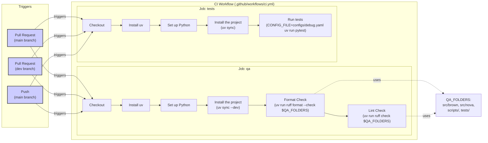
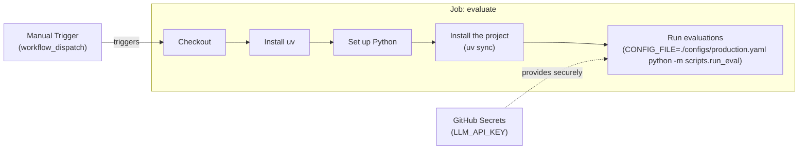
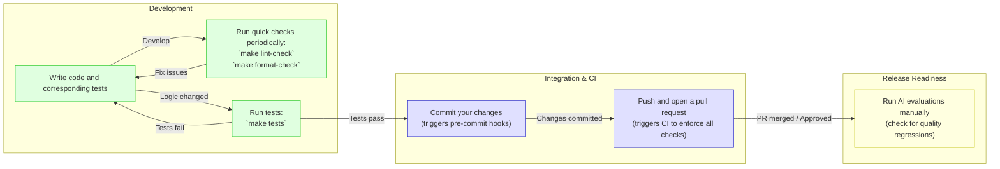

# Continuous Integration for AI Agents

In previous lessons, we established evaluation-driven development using Opik for observability and custom datasets to measure agent performance. You now have the visibility to understand agent behavior. We now shift to Continuous Integration (CI), the automated infrastructure that ensures your codebase is maintainable and prevents regressions from reaching production. With the problem clear, we will define CI in an AI context and introduce a three-tier model to solve these challenges.

## What is Continuous Integration?

Continuous Integration (CI) is the practice of frequently merging code changes from multiple developers into a shared repository. Each merge triggers an automated build and test sequence that catches integration issues early, preventing the classic "it works on my machine" problem [[36]](https://www.atlassian.com/continuous-delivery/continuous-integration).

However, CI for AI agents is different from traditional software CI. Traditional CI focuses on deterministic logic, compilation checks, and unit tests where the same input always produces the same output [[1]](https://galileo.ai/blog/continuous-integration-ci-ai-fundamentals). AI agents operate in a world of non-determinism. A single prompt change can alter an agent's behavior in unpredictable ways, and the cost of LLM API calls makes running comprehensive tests on every commit impractical. This is compounded by model drift, where an agent’s performance silently degrades as user patterns, data schemas, or upstream APIs change [[1]](https://galileo.ai/blog/continuous-integration-ci-ai-fundamentals). Without a CI strategy tailored for these realities, teams often fall into three failure modes.

### Failure Modes Without AI-Specific CI

1.  **Inconsistent code formatting across the team.** Without automated style enforcement, team members using different formatters (or manual formatting) introduce noise into every pull request. This leads to cluttered code, meaningless diffs, and code reviews bogged down by trivial style nitpicks instead of focusing on logic.
2.  **Skipped pre-commit checks, leading to CI failures.** When quality checks are manual, developers under pressure might forget to run the full test suite before pushing code. This results in broken builds, wasted CI resources, and a loss of trust in the development process. Automated enforcement is the only reliable solution.
3.  **Non-deterministic tests that call real LLM APIs.** The biggest anti-pattern is writing tests that make live API calls to LLMs. These tests are slow, expensive, and flaky. They fail unpredictably due to network issues, rate limits, or the inherent non-determinism of LLMs, even with temperature set to zero [[2]](https://www.guild.ai/glossary/non-deterministic-systems). This erodes confidence in the test suite and slows the entire team down.

To solve these problems, we need a layered approach that balances speed, cost, and coverage. This brings us to the three-tier model for AI agent CI.

### The Three-Tier CI Model

Our CI model is calibrated by cost and speed, ensuring we get the fastest feedback for the cheapest price.

### Tier 1: Formatting and Linting (Always Run)

These checks are extremely fast, typically taking only a few seconds, and are free because they involve no API calls. They run on every commit to catch syntactic issues, enforce a consistent code style, and prevent common bugs before they are even committed. This tier is identical to what you would find in a traditional software CI pipeline and forms the first line of defense against code quality degradation.

### Tier 2: Unit and Integration Tests (Always Run)

These tests verify the deterministic logic of your agent. This includes parsing, schema validation, routing, and tool use. Critically, these tests do not call external APIs. By mocking all LLM responses, these tests run quickly (usually under a minute), are completely deterministic, and cost nothing. They form the reliable backbone of your test suite, ensuring that the core mechanics of your agent work as expected.

### Tier 3: AI Evaluations (Manual/Release)

This tier is unique to AI systems. It involves running your agent against a curated dataset of inputs to evaluate its semantic quality using real LLM calls. Because these evaluations are slow and expensive, we run them selectively. They can be triggered manually before a major release or scheduled to run nightly to catch behavioral regressions that deterministic tests would miss.

Image 1: A three-tier CI model for AI agents, showing the flow from commit checks to PR tests and finally to manual/release AI evaluations, with each tier distinctly colored.

This lesson focuses on the CI essentials for building production-ready AI agents. We will not cover comprehensive DevOps topics like Kubernetes or Terraform. Instead, we will teach you how to effectively move from prototype to production-ready agents by covering:
*   Setting up pre-commit hooks to enforce code quality automatically.
*   Configuring Ruff for linting and formatting.
*   Writing unit tests for deterministic agent code with mocked LLM responses.
*   Building a CI pipeline that runs automatically on every change.
*   Using AI evaluations as selective regression tests in CI.

This lesson includes a hands-on notebook where you will practice running formatting checks, linting, and tests on Brown, our writing agent. With the three-tier model established, the fastest feedback comes from running the first tier locally before you even commit code. This is where pre-commit hooks come in.

## Pre-commit Hooks: Automated Local Guardrails

Pre-commit hooks are automated checks that run on your local machine every time you make a commit [[21]](https://pre-commit.com/). They act as a local guardrail, providing immediate feedback and preventing improperly formatted or broken code from ever entering the shared repository [[18]](https://blog.gitguardian.com/automated-guard-rails-for-vibe-coding). This local enforcement is the fastest way to catch simple errors, saving you from waiting for a remote CI pipeline to fail.

The `pre-commit` framework manages these Git hooks using a declarative YAML file, `.pre-commit-config.yaml`. In this file, you define the hooks you want to run, which are often references to external repositories maintained by the community. The framework handles the installation and execution of these hooks for you, creating isolated environments for each tool to prevent dependency conflicts. This means you can use a linter written in Ruby on a Python project without needing to manage a Ruby installation yourself [[21]](https://pre-commit.com/).

<aside>
💡
You can experiment with the code for this lesson in this [Colab](https://colab.research.google.com/github/louisfb01/agent-course-notebooks/blob/main/notebooks/lesson_31_notebook.ipynb#scrollTo=b30eba1a).
Alternatively, you can find the code for this lesson in the notebook for Lesson 31 of the course GitHub repository.
</aside>

### Brown’s Pre-commit Configuration

Let's examine the configuration used in our Brown agent, located at `lessons/writing_workflow/.pre-commit-config.yaml`.

```yaml
fail_fast: false

repos:
  - repo: https://github.com/abravalheri/validate-pyproject
    rev: v0.24.1
    hooks:
      - id: validate-pyproject

  - repo: https://github.com/pre-commit/mirrors-prettier
    rev: v3.1.0
    hooks:
      - id: prettier
        types_or: [yaml, json5]

  - repo: https://github.com/astral-sh/ruff-pre-commit
    # Ruff version. Keep in sync with the CI workflows (.github/workflows/*.yml).
    rev: v0.14.6
    hooks:
      # Run the linter.
      - id: ruff-check
        args: [--fix, --exit-non-zero-on-fix]
      # Run the formatter.
      - id: ruff-format
```

This configuration defines three sets of hooks:
*   **`validate-pyproject`**: This tool validates that your `pyproject.toml` file is structurally correct according to PEP standards [[46]](https://betterstack.com/community/guides/scaling-python/pyproject-explained/). A malformed file can break your entire build and dependency management process.
*   **`prettier`**: A popular code formatter that we use to ensure consistent formatting for configuration files like `.github/workflows/ci.yml`. This keeps them readable and reduces merge conflicts.
*   **`ruff-check` and `ruff-format`**: These hooks run Ruff, our chosen Python linter and formatter. The `--fix` argument automatically corrects any fixable issues, and `--exit-non-zero-on-fix` ensures the commit fails even after auto-fixing. This forces you to review and re-stage the changes, confirming you accept them. As recommended by Ruff’s authors, `ruff-check` runs before `ruff-format`.

### Setting Up Pre-commit

In the `lessons/writing_workflow` repo, you can set up pre-commit hooks with these commands:

```bash
# Install dependencies (includes pre-commit)
uv sync --dev

# Install the Git hooks
pre-commit install
```

The `pre-commit install` command creates a script at `.git/hooks/pre-commit`. Now, every time you run `git commit`, these hooks will execute automatically. You can also run them manually on all files in the repository:

```bash
# Run all hooks on all files
make pre-commit
```

The daily workflow is straightforward: make your code changes, stage them with `git add`, and then `git commit`. If a hook fails, you review the error, fix it, re-stage the files, and commit again. This tight feedback loop keeps the codebase clean from the start.

Pre-commit hooks often rely on fast, powerful tools like Ruff to do the actual work. Next, we will examine Ruff in more detail and show how to configure it for both local development and CI.

## Ruff: Fast Python Linting and Formatting

Ruff is an extremely fast Python linter and code formatter written in Rust. It replaces a suite of older tools like Black, isort, Flake8, and pydocstyle with a single, high-performance binary [[24]](https://docs.astral.sh/ruff). Its sub-second performance on large codebases makes it ideal for the fast feedback loops required in CI.

It is important to distinguish between formatting and linting:
*   **Formatting** automatically rewrites your code to follow a consistent style, handling details like indentation, line length, and quote style. It is opinionated and designed to be run without manual intervention.
*   **Linting** analyzes your code for potential bugs, violations of best practices, and suspicious patterns, such as unused variables or missing imports. It identifies issues that formatting alone cannot fix.

### Brown’s Ruff Configuration

Ruff is configured in the `pyproject.toml` file. Here is the configuration for our Brown agent from `lessons/writing_workflow/pyproject.toml`:

```toml
[tool.ruff]
target-version = "py312"
line-length = 140

[tool.ruff.lint]
select = [
    "F",    # Pyflakes
    "E",    # pycodestyle errors
    "I",    # isort
]

[tool.ruff.lint.isort]
known-first-party = ["src", "tests"]

[tool.pytest.ini_options]
pythonpath = ["src"]
markers = [
    "integration: end-to-end workflow tests (mocked LLMs, no network). Select with `-m integration` or skip with `-m 'not integration'`.",
]
```

Here is what each key does:
*   `target-version = "py312"` tells Ruff to enforce rules compatible with Python 3.12 syntax.
*   `line-length = 140` sets the maximum line length, a common adjustment for modern screens.
*   `select = ["F", "E", "I"]` enables three core rule sets: `F` for Pyflakes (detects bugs like unused imports), `E` for pycodestyle (enforces PEP 8 style), and `I` for isort (organizes imports).
*   `known-first-party = ["src", "tests"]` helps isort correctly group your project's internal modules separately from third-party libraries.

Our `Makefile` provides convenient shortcuts for running Ruff:

```makefile
# --- Tests & QA ---

tests: # Run tests.
	CONFIG_FILE=configs/debug.yaml uv run pytest

pre-commit: # Run pre-commit hooks.
	uv run pre-commit run --all-files

format-fix: # Auto-format Python code using ruff formatter.
	uv run ruff format $(QA_FOLDERS)

lint-fix: # Auto-fix linting issues using ruff linter.
	uv run ruff check --fix $(QA_FOLDERS)

format-check: # Check code formatting without making changes using ruff formatter.
	uv run ruff format --check $(QA_FOLDERS) 

lint-check: # Check code for linting issues without fixing them using ruff linter.
	uv run ruff check $(QA_FOLDERS)
```

Each command uses `uv run` to execute within the project's virtual environment, which `uv` manages automatically without needing manual activation [[47]](https://devcenter.upsun.com/posts/why-python-developers-should-switch-to-uv/).

### Hands-On Example: Fixing Formatting Issues

To see Ruff's formatter in action, let's create a file with deliberate formatting errors.

1.  Create a file named `test_formatting.py` with inconsistent spacing and structure.
    ```bash
    # Create a Python file with various formatting issues
    cat > test_formatting.py << 'EOF'
    # This file has formatting issues
    def  badly_formatted_function(x,y,z):
        result=x+y+z
        my_list=[1,2,3,4,5,6,7,8,9,10]
        my_dict={"key1":"value1","key2":"value2","key3":"value3"}
        if result>10:
            print("Result is greater than 10")
        else:
            print("Result is 10 or less")
        return result
    
    class   BadlyFormattedClass:
        def __init__(self,name,age):
            self.name=name
            self.age=age
        def get_info(self):
            return f"{self.name} is {self.age} years old"
    EOF
    
    echo "Created test_formatting.py"
    ```
    It outputs:
    ```text
    Created test_formatting.py
    ```

2.  Run the format checker. The `--check` flag reports issues without modifying the file.
    ```bash
    uv run ruff format --check test_formatting.py
    ```
    It outputs:
    ```text
    Would reformat: test_formatting.py
    1 file would be reformatted
    ```

3.  Now, run the auto-fix command.
    ```bash
    uv run ruff format test_formatting.py
    ```
    It outputs:
    ```text
    1 file reformatted
    ```

4.  Inspect the file to see the changes. Ruff has corrected all spacing around operators, in function signatures, and within class definitions, ensuring the code is clean and consistent.
    ```bash
    cat test_formatting.py
    ```
    It outputs:
    ```python
    # This file has formatting issues
    def badly_formatted_function(x, y, z):
        result = x + y + z
        my_list = [1, 2, 3, 4, 5, 6, 7, 8, 9, 10]
        my_dict = {"key1": "value1", "key2": "value2", "key3": "value3"}
        if result > 10:
            print("Result is greater than 10")
        else:
            print("Result is 10 or less")
        return result


    class BadlyFormattedClass:
        def __init__(self, name, age):
            self.name = name
            self.age = age

        def get_info(self):
            return f"{self.name} is {self.age} years old"
    ```

### Hands-On Example: Fixing Linting Issues

Linting catches a different class of problems, from potential bugs to style violations.

1.  Create `test_linting.py` with issues like unused imports and undefined variables.
    ```bash
    cat > test_linting.py << 'EOF'
    import os
    import sys
    import json # Unused import
    
    def calculate_sum(numbers):
        """Calculate sum of numbers."""
        total = 0
        for num in numbers:
            total = total + num
        return total
    
    def process_data(data):
        """Process some data."""
        result = calculate_sum(data)
        print(f"Result: {result}")
        _ = os.getcwd()  # Use os
        _ = sys.argv[0]  # Use sys
        undefined_variable = some_undefined_function()  # Using undefined name
        return result
    
    import sys # Duplicate import
    EOF
    
    echo "Created test_linting.py"
    ```
    It outputs:
    ```text
    Created test_linting.py
    ```

2.  Run the linter to see the reported errors.
    ```bash
    uv run ruff check test_linting.py
    ```
    It outputs:
    ```text
    Found 7 errors.
    [*] 4 fixable with the `--fix` option (1 hidden fix can be enabled with the `--unsafe-fixes` option).
    ```
    Ruff reports several issues. `F401` indicates an unused import (`json`), `F811` flags a redefinition of an import (`sys`), and `F821` points to an undefined name (`some_undefined_function`). These are not just style issues; they can indicate real bugs.

3.  Run with the `--fix` flag to automatically correct what you can.
    ```bash
    uv run ruff check --fix test_linting.py
    ```
    It outputs:
    ```text
    Found 5 errors (3 fixed, 2 remaining).
    ```
    Ruff automatically removes the unused `json` import and the duplicate `sys` import. However, it leaves the `undefined_variable` error. This is because fixing it would require making a logical decision about the code's intent, which is beyond the scope of a linter. This demonstrates how linting helps you focus on the real logic errors that require manual intervention.

By consolidating over ten legacy linters into a single binary, Ruff eliminates version conflicts and dramatically reduces CI execution times.

Once formatting and linting guardrails are in place, our attention turns to verifying the deterministic logic inside the agent nodes; this is the role of unit tests.

## Unit Tests for Agent Repos

The core challenge in testing AI agents is the non-determinism of LLMs. Making real API calls in tests is a source of instability and high costs. An identical prompt can produce different outputs on different runs, and you might hit rate limits or network errors, causing tests to fail unpredictably [[2]](https://www.guild.ai/glossary/non-deterministic-systems).

Unit tests solve this by verifying the deterministic logic within your agent. This includes any code that does not require a live LLM call, such as:
*   **Parsing and rendering:** Does your markdown loader correctly extract article sections?
*   **Schema validation:** Does your Pydantic model reject invalid data structures?
*   **Routing decisions:** Given a specific state, does your workflow route to the correct node?
*   **Utilities:** Do helper functions for text cleaning or data transformation work as expected?

### Unit Tests vs. Integration Tests

In traditional software, a **unit test** verifies a single, isolated piece of code, like a function. An **integration test** checks how multiple components work together. For AI agents, these lines blur. A single agent "node" often combines several responsibilities: prompt templating, response parsing, and routing logic.

We take a pragmatic approach: if a test runs quickly, uses mocked dependencies to avoid network calls, and verifies deterministic logic, we consider it a unit test. This allows us to test meaningful chunks of our agent's behavior without the fragility of live API calls. The goal of the test suite is to verify that the code *around* the LLM call is correct: that the prompt is constructed properly, the API is called with the right parameters, and the response is parsed into a valid output [[9]](https://www.iamraghuveer.com/posts/unit-testing-custom-agents).

The most effective mocking strategy for AI agents is response injection. Instead of patching network calls at the HTTP layer, we use a fake model class that allows us to directly inject pre-scripted responses into our tests. This gives us precise control over what the "LLM" returns, making our tests simple and reliable.

<aside>
💡
Another option to mock LLM calls in tests is HTTP mocking, where you intercept API requests and return canned responses using libraries like `responses` or `httpretty`. Some teams prefer fixture-based mocking with `pytest` fixtures and `unittest.mock.patch` to replace LLM calls with fixed outputs. There's also record and replay, which captures real API responses once and then replays them in tests using tools like VCR.py [[6]](https://agiflow.io/blog/effective-practices-for-mocking-llm-responses-during-the-software-development-lifecycle).
</aside>

### Our Implementation: The FakeModel Pattern

In our Brown agent, we implement response injection using a `FakeModel` class that is compatible with LangChain’s interface. This pattern has three parts:

1.  **Configuration specifies the fake model:** The `debug.yaml` configuration at `lessons/writing_workflow/configs/debug.yaml` sets all nodes to use `model_id: “fake”`.
2.  **Model factory returns FakeModel:** The model builder in `src/brown/models/get_model.py` checks for this ID and returns an instance of our `FakeModel`.
3.  **Tests inject specific responses:** The `FakeModel` in `src/brown/models/fake_model.py` extends LangChain’s `FakeListChatModel` and allows tests to provide a list of canned responses.

Here is a simplified version of our `FakeModel` implementation:
```python
class FakeModel(FakeListChatModel):
    def __init__(self, responses: list[str]) -> None:
        super().__init__(responses=responses)
        self._structured_output_type: Type[Any] | None = None
        self._include_raw: bool = False

    ...

    async def ainvoke(self, inputs, *args, **kwargs) -> Any:
        if len(self.responses) == 0:
            return []

        if self._structured_output_type is not None:
            # For structured output, we handle the mocked response directly
            response_content = self.responses[0]

            if isinstance(response_content, dict):
                structured_response = self._structured_output_type(**response_content)
            elif isinstance(response_content, str):
                try:
                    data = json.loads(response_content)
                    structured_response = self._structured_output_type(**data)
                except Exception:
                    logger.warning(f"Failed to parse response as JSON: {response_content}")
                    raise ValueError(f"Failed to parse response as JSON: {response_content}")
            else:
                raise NotImplementedError(f"Unsupported response type: {type(response_content)}")

            if self._include_raw:
                from langchain_core.messages import AIMessage
                raw_message = AIMessage(content=response_content)
                return {"parsed": structured_response, "raw": raw_message}
            else:
                return structured_response

        # For non-structured output, use the parent's implementation
        response = await super().ainvoke(inputs, *args, **kwargs)
        return response
```
An instance of `FakeModel` takes a list of pre-scripted responses in its constructor. When `ainvoke()` is called, it returns and consumes the next response from the list. The implementation also correctly handles structured outputs by parsing the mocked JSON string into the expected Pydantic model, which is crucial for testing nodes that rely on schema validation. This design ensures that all unit tests use a fake model by default, and each test can inject the specific responses needed to verify its logic.

### Example: Testing Nodes with Mocked Responses

Here is how we write a test for a node that calls an LLM, taken from `lessons/writing_workflow/tests/brown/nodes/test_article_writer.py`.

```python
@pytest.mark.asyncio
async def test_article_writer_ainvoke_success(
    # ... pytest fixtures for mock data
) -> None:
    """Test article generation with mocked response."""
    mock_response = '{"content": "# Generated Article..."}'

    app_config = get_app_config()
    model, _ = build_model(app_config, node="write_article")
    model.responses = [mock_response]

    writer = ArticleWriter(
        # ... inject dependencies
        model=model,
    )

    result = await writer.ainvoke()

    assert isinstance(result, Article)
    assert "# Generated Article" in result.content
```
The test follows a clear recipe. It creates a mock JSON response, builds a fake model using our factory, and injects the response into it. Then, it instantiates the `ArticleWriter` node with that model. The `@pytest.mark.asyncio` decorator is used because our agent's `ainvoke` methods are asynchronous. The test asserts that the writer correctly parses the model's output into an `Article` object. This pattern allows us to test the node's core logic without any external dependencies, keeping our tests fast, deterministic, and free.

### Running Brown’s Tests

To run the entire test suite for the Brown agent, you can use the shortcut defined in the `Makefile`:

```bash
# From the writing_workflow directory
make tests
```

This command executes `CONFIG_FILE=configs/debug.yaml uv run pytest`. The `CONFIG_FILE` environment variable points to our `debug.yaml` configuration, ensuring that all tests run with fake models and never make real LLM API calls. The entire suite of over 200 tests runs in less than a second.

Local tests and hooks provide fast feedback, but enforcement at the repository level requires automated CI workflows that run on every pull request.

## CI Workflows: Automated Enforcement

GitHub Actions is our CI platform for both the Brown and Nova agents. It automatically triggers workflows on events like pull requests or pushes to the main branch. It supports job isolation, matrix builds for testing across multiple environments, and parallel execution to ensure feedback remains fast. Its seamless integration with GitHub repositories requires minimal setup [[32]](https://docs.github.com/actions/get-started/quickstart).

### Our Complete CI Configuration

Our entire CI pipeline is defined in a single YAML file located at `.github/workflows/ci.yml`. This file acts as the blueprint for our automated checks.

```yaml
name: CI
on:
  pull_request:
    branches: [main, dev]
  push:
    branches: [main]

env:
  QA_FOLDERS: "src/brown src/nova scripts/ tests/"

jobs:
  qa:
    runs-on: ubuntu-latest
    steps:
      - name: 🛎️ Checkout
        uses: actions/checkout@v4

      - name: 📦 Install uv
        uses: astral-sh/setup-uv@v4

      - name: 🐍 Set up Python
        uses: actions/setup-python@v5
        with:
          python-version-file: ".python-version"

      - name: 🦾 Install the project
        run: |
          uv sync --dev

      - name: 💅 Format Check
        run: |
          uv run ruff format --check $QA_FOLDERS

      - name: 🔎 Lint Check
        run: uv run ruff check $QA_FOLDERS

  tests:
    runs-on: ubuntu-latest
    steps:
      - name: 🛎️ Checkout
        uses: actions/checkout@v4

      - name: 📦 Install uv
        uses: astral-sh/setup-uv@v4

      - name: 🐍 Set up Python
        uses: actions/setup-python@v5
        with:
          python-version-file: ".python-version"

      - name: 🦾 Install the project
        run: |
          uv sync

      - name: 🧪 Run tests
        run: |
          CONFIG_FILE=configs/debug.yaml uv run pytest
```
This configuration defines when the workflow runs and what checks it performs. The `on` section specifies that the workflow triggers on pull requests to the `main` and `dev` branches, as well as on direct pushes to `main`. This ensures every code change is validated.

The `env` section defines an environment variable, `QA_FOLDERS`, that lists all directories to check. It includes both `src/brown` and `src/nova`, allowing us to use a single CI configuration for both agents in a monorepo structure.

### Understanding the Job Structure

The workflow defines two independent jobs, `qa` and `tests`, that run in parallel. This split provides clear and fast feedback; if formatting fails, you immediately see "QA job failed" without waiting for tests to complete. Each job runs on `ubuntu-latest`, a virtual machine provided by GitHub, and is completely isolated.


Image 2: Mermaid diagram illustrating the CI workflow for Brown and Nova agents.

The `qa` job focuses on code quality. It begins by checking out your code with `actions/checkout@v4`, then installs `uv` using the official `astral-sh/setup-uv@v4` action. The Python setup step, `actions/setup-python@v5`, reads the required Python version from your `.python-version` file, ensuring consistency between local development and CI. After syncing all dependencies, including development tools, with `uv sync --dev`, it runs two crucial checks. The format check uses `uv run ruff format --check` to verify that all code follows consistent formatting rules without modifying any files. The lint check uses `uv run ruff check` to detect code quality issues, unused imports, and potential bugs.

The `tests` job follows a similar setup process but is dedicated to running the test suite. It runs `uv sync` without the `--dev` flag, as tests only require production dependencies. The final and most important step runs the test suite using `CONFIG_FILE=configs/debug.yaml uv run pytest`. This command ensures all tests execute with the fake model configuration, preventing any real LLM API calls during CI. This practice is what keeps our tests fast, deterministic, and free.

### Setting Up GitHub Actions for Your Repository

To enable this workflow, you need to create the `ci.yml` file in the `.github/workflows/` directory at the root of your repository. If the directory does not exist, create it by running `mkdir -p .github/workflows` from your repository root. Paste the complete configuration into a new file named `.github/workflows/ci.yml`.

You also need to ensure a few other files are in place. Create a `.python-version` file at the root of your repository specifying the Python version you use, such as `3.12`. Also, make sure your `configs/debug.yaml` file exists and is configured to use fake models for testing.

Once you commit and push this file, the workflow becomes active. You do not need to configure anything in the GitHub UI for this basic CI setup, though you will need to add secrets for more advanced workflows, like those involving API keys for evaluations.

### Running the Pipeline and Observing Results

The pipeline runs automatically when its trigger conditions are met, such as when you open a pull request. You can also trigger it manually. To do so, navigate to your repository on GitHub, click the "Actions" tab, select "CI" from the workflow list, and click the "Run workflow" button. This is useful for testing changes or re-running failed checks without a new commit.

To monitor a run, click on it in the "Actions" tab. The interface shows both the `qa` and `tests` jobs with their status. You can click into each job to see the detailed output of every step. If a step fails, it expands automatically and is highlighted in red, making it easy to diagnose the problem.

### Interpreting CI Results and Fixing Issues

Each job reports a status: success (green checkmark), failure (red X), or in progress (yellow dot). GitHub displays the overall status on your pull request and blocks merging if any check fails.

If the `qa` job fails on a formatting check, the logs will show exactly which files need to be reformatted. You can fix this locally by running `make format-fix` from the `writing_workflow/` directory, then committing and pushing the changes. If it fails on a linting check, the output will list each violation with its file, line number, and error code. Many of these can be fixed automatically with `make lint-fix`.

If the `tests` job fails, the pytest output provides a traceback showing which test failed and why. This helps you identify the logic error or incorrect mock response. Fix the issue, run `make tests` locally to verify, and then push your changes.

A key principle is that CI should run the exact same commands you run locally. This eliminates "it works on my machine" problems. If your checks pass locally, they will pass in CI.

### Trying It Out

The best way to learn is by doing. Try introducing a formatting error into a file, commit it, and open a pull request. Watch the `qa` job fail and inspect the logs. Then, run `make format-fix` locally, commit the fix, and push again. The CI pipeline will re-run automatically, and this time it will pass. This hands-on experience will solidify your understanding of how a robust CI pipeline protects your codebase.

The first two tiers of our model run on every commit, providing fast and cheap feedback. However, to ensure semantic quality, we need a more powerful—and expensive—third tier. This is where AI evaluations come in as selective regression tests.

## AI Evaluations as Regression Tests

AI evaluations are essential for catching semantic quality regressions—like a drop in helpfulness or an increase in hallucinations—that deterministic unit tests cannot detect [[11]](https://kinde.com/learn/ai-for-software-engineering/ai-devops/ci-cd-for-evals-running-prompt-and-agent-regression-tests-in-github-actions). They are the cornerstone of our third CI tier.

The backbone of this process is golden flow validation, where you benchmark every build against a representative set of production interactions, common tasks, and known failure modes. To make this reliable, you must version not just your code, but also your prompt templates, tool definitions, and evaluation datasets. When a regression occurs, this traceability allows you to pinpoint whether the cause was a code, prompt, or data change [[1]](https://galileo.ai/blog/continuous-integration-ci-ai-fundamentals).

### Why AI Evals Are Unique to AI Systems

Evaluations are unique to AI systems because they involve making real LLM calls, which are both slow and costly. A single evaluation run can add up quickly. For example, if your evaluation dataset has 500 examples, and each example consumes an average of 2,000 tokens with a model like GPT-4o (at ~$5 per million tokens), a single eval run costs about $5.00. Running this on every commit is not feasible. Latency is also a critical factor; a model update that improves accuracy but significantly slows down response time can still degrade the user experience. Therefore, we treat these evaluations as a Tier 3 gate, running them selectively rather than on every change [[1]](https://galileo.ai/blog/continuous-integration-ci-ai-fundamentals).

### Manual-Trigger CI Workflow for AI Evals

To manage costs and ensure evaluations are run deliberately, we use a separate GitHub Actions workflow with a manual trigger. This workflow, defined in `.github/workflows/eval.yml`, is only executed when someone clicks a button in the GitHub UI.

```yaml
name: AI Evaluations

on:
  workflow_dispatch:  # Manual trigger only

jobs:
  evaluate:
    runs-on: ubuntu-latest
    steps:
      - uses: actions/checkout@v4
      - uses: astral-sh/setup-uv@v4
      - uses: actions/setup-python@v5
        with:
          python-version-file: ".python-version"
      - run: uv sync
      - name: Run evaluations
        env:
          LLM_API_KEY: ${{ secrets.LLM_API_KEY }}
        run: |
          # Replace with your actual evaluation script from previous lessons
          # Example: CONFIG_FILE=./configs/production.yaml python -m scripts.run_eval
          CONFIG_FILE=./configs/production.yaml python -m scripts.run_eval
```

This workflow differs from our main CI pipeline in a few critical ways:
1.  The `workflow_dispatch` trigger ensures it never runs automatically, preventing accidental, expensive runs [[15]](https://graphite.com/guides/github-actions-workflow-dispatch).
2.  It uses a production configuration (`configs/production.yaml`) to ensure evaluations run against real LLM models, not our fake ones.
3.  The `LLM_API_KEY` is securely accessed from GitHub Secrets, which you configure in your repository settings under **Settings → Secrets and variables → Actions**.


Image 3: CI workflow for AI evaluations triggered manually

To trigger this workflow, go to the **Actions** tab in your GitHub repository, select **AI Evaluations**, and click the **Run workflow** button.

The frequency of running these evaluations depends on your project's maturity:
*   **Early development:** Run evaluations manually once a week to track progress.
*   **Active development:** Run them before merging significant changes to catch regressions early.
*   **Mature product:** Run them as a required step in your release process to guarantee production quality.

The maturity of your evaluation process also evolves. Beyond just deciding *when* to run evals, you should track production metrics like deployment rollback frequency to quantify their effectiveness. A high rollback rate suggests your evaluation suite is missing key failure modes [[48]](https://semaphore.io/what-metrics-should-you-use-to-evaluate-ai-in-your-ci-cd-pipeline). The most mature teams create a feedback loop where every production incident is encoded into a new evaluation case, ensuring the regression can never happen again [[1]](https://galileo.ai/blog/continuous-integration-ci-ai-fundamentals).

With all three tiers of our CI model in place, we can now assemble them into a cohesive daily development workflow that keeps velocity high while protecting quality.

## Daily Development Workflow

With these tools and workflows established, your daily development process becomes a streamlined, quality-focused loop.

1.  **Write code** and the corresponding unit tests for any new deterministic logic.
2.  **Run quick checks** periodically on your machine using `make lint-check` and `make format-check`.
3.  **Run tests** locally with `make tests` after making any logic changes to ensure nothing has broken.
4.  **Commit your changes.** The pre-commit hooks will automatically run, catching any issues you missed.
5.  **Push and open a pull request.** The main CI workflow will trigger, running all formatting, linting, and unit tests as an independent verification step.
6.  **Before releasing, run AI evaluations** manually from the GitHub Actions UI to check for any semantic quality regressions.


Image 4: Daily development workflow for AI agents

This workflow provides feedback in seconds for most changes, catching issues early and ensuring that only high-quality, well-tested code reaches your main branch.

We have now covered the full spectrum from theory to daily practice. The conclusion will tie everything together.

## Conclusion

We have adapted traditional CI for the unique challenges of AI agents, creating a three-tier model that balances speed, cost, and quality. By combining fast local hooks, deterministic mocked tests, and selective AI evaluations, you can catch regressions before they impact your users. This investment in automation is what moves a project from a fragile prototype to a reliable, production-ready system. In future lessons, we will build on this foundation to cover full CI/CD pipelines, runtime guardrails, and production monitoring.

## References

- [1] [How to Build a Continuous Integration Pipeline for AI Agents](https://galileo.ai/blog/continuous-integration-ci-ai-fundamentals)
- [2] [Non-Deterministic Systems](https://www.guild.ai/glossary/non-deterministic-systems)
- [3] [Deterministic, non-deterministic, and probabilistic AI for AppSec](https://cycode.com/blog/deterministic-vs-non-deterministic-vs-probabilistic-ai-appsec)
- [4] [AI Agents, Evals, and Non-Determinism](https://www.youtube.com/watch?v=4u64WEuQHYE&vl=en)
- [5] [The Double-Edged Sword: AI’s Non-Determinism in Software and IT](https://codenotary.com/blog/the-double-edged-sword-ais-non-determinism-in-software-and-it)
- [6] [Effective Practices for Mocking LLM Responses During the Software Development Lifecycle](https://agiflow.io/blog/effective-practices-for-mocking-llm-responses-during-the-software-development-lifecycle)
- [7] [Effective Practices for Mocking LLM Responses During the Software Development Lifecycle](https://home.mlops.community/public/blogs/effective-practices-for-mocking-llm-responses-during-the-software-development-lifecycle)
- [8] [Fake LLM](https://langchain-contrib.readthedocs.io/en/latest/llms/fake.html)
- [9] [Unit Testing Custom LangChain Agents](https://www.iamraghuveer.com/posts/unit-testing-custom-agents)
- [10] [Fake Chat Models](https://docs.langchain.com/oss/javascript/integrations/chat/fake)
- [11] [CI/CD for Evals: Running prompt and agent regression tests in GitHub Actions](https://kinde.com/learn/ai-for-software-engineering/ai-devops/ci-cd-for-evals-running-prompt-and-agent-regression-tests-in-github-actions)
- [12] [Best AI Eval Tools for CI/CD Pipelines (2026 Review)](https://www.braintrust.dev/articles/best-ai-evals-tools-cicd-2025)
- [13] [What is AI Regression Testing?](https://testgrid.io/blog/what-is-ai-regression-testing)
- [14] [A practical guide to integrating AI evals into your CI/CD pipeline](https://dev.to/kuldeep_paul/a-practical-guide-to-integrating-ai-evals-into-your-cicd-pipeline-3mlb)
- [15] [How to use workflow_dispatch in GitHub Actions](https://graphite.com/guides/github-actions-workflow-dispatch)
- [16] [Manually running a workflow](https://docs.github.com/actions/managing-workflow-runs/manually-running-a-workflow)
- [17] [Use GitHub Actions to run evaluations on your AI agent](https://learn.microsoft.com/en-us/azure/foundry/how-to/evaluation-github-action)
- [18] [Automated guard rails for vibe coding](https://blog.gitguardian.com/automated-guard-rails-for-vibe-coding)
- [19] [Local Guardrails for Secrets Security](https://blog.gitguardian.com/local-guardrails-for-secrets-security)
- [20] [pre-commit-hooks](https://github.com/pre-commit/pre-commit-hooks)
- [21] [pre-commit](https://pre-commit.com)
- [22] [Git Hooks](https://www.atlassian.com/git/tutorials/git-hooks)
- [23] [Ruff FAQ](https://docs.astral.sh/ruff/faq)
- [24] [Ruff](https://docs.astral.sh/ruff)
- [25] [ruff](https://github.com/astral-sh/ruff)
- [26] [Unit Testing AI Agents](https://www.guild.ai/glossary/unit-testing-ai-agents)
- [27] [Testing AI Agents: A Guide for Developers](https://oneuptime.com/blog/post/2026-01-30-agent-testing/view)
- [28] [4 Frameworks to Test Non-Deterministic AI Agents](https://datagrid.com/blog/4-frameworks-test-non-deterministic-ai-agents)
- [29] [How Do We Test Agentic AI Systems?](https://arxiv.org/html/2509.19185v1)
- [30] [A Guide to Unit Testing for AI Systems](https://galileo.ai/blog/unit-testing-ai-systems)
- [31] [YAML and GitHub Actions](https://intersect-training.org/CI-CD/yaml-and-github-actions.html)
- [32] [Quickstart for GitHub Actions](https://docs.github.com/actions/get-started/quickstart)
- [33] [Diving into CI/CD, GitHub Actions, and a little Lambda magic](https://medium.com/@donovan.brown_75022/week-8-diving-into-ci-cd-github-actions-and-a-little-lambda-magic-997cf8a1e193)
- [34] [How Sotheby’s uses GitHub Actions to automate its workflows](https://github.com/readme/guides/sothebys-github-actions)
- [35] [CI/CD for Agentic AI: A Practical Guide](https://developers.redhat.com/articles/2026/05/18/ci-cd-delivery-agentic-ai)
- [36] [What is continuous integration?](https://www.atlassian.com/continuous-delivery/continuous-integration)
- [37] [What is CI/CD?](https://octopus.com/devops/ci-cd)
- [38] [CI/CD Best Practices](https://gatling.io/blog/ci-cd-best-practices)
- [39] [What is continuous integration?](https://www.ibm.com/think/topics/continuous-integration)
- [40] [CI/CD Best Practices for Data Projects: Validation and Testing](https://www.sunnydata.ai/blog/cicd-best-practices-data-projects-validation-testing)
- [41] [AI Maturity Assessment Framework](https://www.ness.com/blog/ai-maturity-assessment-framework)
- [42] [The MITRE AI Maturity Model and Organizational Assessment Tool Guide](https://www.mitre.org/news-insights/publication/mitre-ai-maturity-model-and-organizational-assessment-tool-guide)
- [43] [Assess Your AI Maturity](https://www.infotech.com/research/ss/assess-your-ai-maturity)
- [44] [The AI Maturity Model for 2026 and Beyond](https://sema4.ai/blog/ai-maturity-model-2026)
- [45] [OWASP AI Maturity Assessment (AIMA)](https://owasp.org/www-project-ai-maturity-assessment)
- [46] [pyproject.toml explained](https://betterstack.com/community/guides/scaling-python/pyproject-explained/)
- [47] [Why Python developers should switch to uv](https://devcenter.upsun.com/posts/why-python-developers-should-switch-to-uv/)
- [48] [What Metrics Should You Use to Evaluate AI in Your CI/CD Pipeline?](https://semaphore.io/what-metrics-should-you-use-to-evaluate-ai-in-your-ci-cd-pipeline)