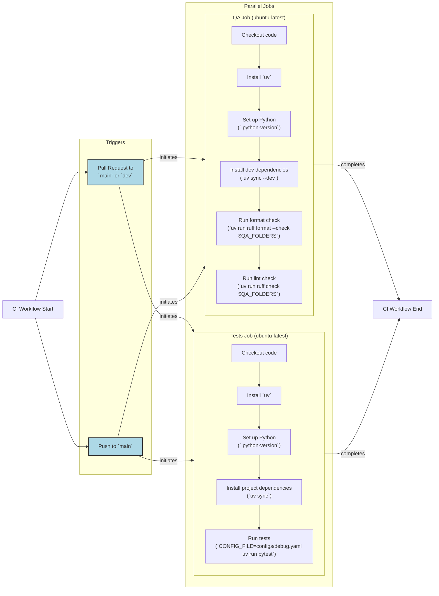

# Continuous Integration for AI Agents

In our recent lessons, we have covered how to observe agent behavior with Opik, create datasets for evaluation, and implement an evaluation-driven development framework. These tools give you the visibility and measurement capabilities needed to build reliable AI systems. Now, it is time to shift our focus to Continuous Integration (CI): the automated infrastructure that keeps your codebase maintainable and prevents regressions from reaching production.

With the problem and failure modes clear, we will now define what Continuous Integration means in an AI context and introduce the three-tier model that solves these issues.

## What is Continuous Integration?

Continuous Integration is the practice of frequently merging code changes from multiple developers into a shared repository [[1]](https://www.atlassian.com/continuous-delivery/continuous-integration). Each merge triggers an automated build and test sequence, which allows teams to detect integration issues early and prevent the classic "it works on my machine" problem [[2]](https://octopus.com/devops/ci-cd).

However, CI for AI agents is different from traditional software CI. Traditional CI focuses on deterministic logic, compile-time checks, and fast unit tests. This approach verifies code correctness: does a function return the expected output for a given input? AI agents demand a shift in focus to behavioral correctness: does the agent make reliable decisions across a distribution of inputs [[3]](https://galileo.ai/blog/continuous-integration-ci-ai-fundamentals)? This introduces new challenges:

-   **Non-determinism:** LLMs can produce different outputs for the same input, even with temperature set to 0, making traditional pass/fail tests unreliable [[4]](https://www.guild.ai/glossary/non-deterministic-systems).
-   **Prompt Sensitivity:** Small changes to a prompt can cause significant, unexpected changes in an agent's behavior, leading to silent quality regressions [[5]](https://kinde.com/learn/ai-for-software-engineering/ai-devops/ci-cd-for-evals-running-prompt-and-agent-regression-tests-in-github-actions).
-   **Data Drift:** The data your agent sees in production can shift over time, causing performance to degrade silently because the model is operating on a reality different from its training data. This is one of the most common failure modes for AI in production [[6]](https://www.neenopal.com/blog/ai-model-deployment-challenges-production).
-   **Cost and Latency:** Naive test suites that make live LLM calls are slow and expensive, making it impractical to run them on every commit.

Without a CI strategy tailored for AI, teams often fall into common failure modes.

### Failure Modes Without CI

1.  **Inconsistent code formatting across the team.** When team members use different formatters or apply formatting manually, the codebase becomes cluttered with inconsistent styles. This leads to time-wasting code reviews focused on trivial nitpicks instead of logic and architecture.
2.  **Skipped pre-commit checks, leading to CI failures.** Under pressure to deliver features quickly, developers might forget to run local tests or linters before pushing code. This results in the main branch breaking, blocking other team members and wasting time on avoidable fixes.
3.  **Non-deterministic tests that call real LLM APIs.** Tests that rely on live LLM calls are inherently flaky. They can fail due to network issues, API rate limits, or the model's probabilistic nature, causing silent quality degradation. For example, a retrieval system might pull from a low-quality source, or an agent might misuse a tool with a malformed argument, corrupting all downstream steps [[7]](https://medium.com/data-science-collective/why-ai-agents-keep-failing-in-production-cdd335b22219), [[8]](https://latitude.so/blog/ai-agent-failure-detection-guide). These unreliable tests slow down development and erode trust in the test suite.

To address these challenges, we use a three-tier model that calibrates our checks by cost and speed.

### A Three-Tier CI Model for AI Agents

-   **Tier 1: Formatting and Linting (Always Run).** These checks are fast (seconds) and free (no API calls). They enforce consistent code style and catch basic errors like unused variables or syntax issues. This tier is identical to traditional CI.
-   **Tier 2: Unit and Integration Tests (Always Run).** These tests verify the deterministic parts of your agent, such as data parsing, schema validation, and workflow routing. By mocking LLM responses, we ensure these tests are fast (under a minute), reliable, and free.
-   **Tier 3: AI Evaluations (Manual/Release).** This tier is unique to AI systems. It involves running the agent against a curated dataset to measure semantic quality, such as helpfulness or factuality. These "evals" use real LLM calls, making them slow and expensive. We run them selectively, either manually before a major release or after a significant prompt change.

Image 1: A three-tier CI model for AI agents, showing the flow from commit checks to PR tests and finally to manual/release AI evaluations, with each tier distinctly colored.

AI evaluations, which we covered in Lesson 30, act as Tier 3 regression tests. They are uniquely suited to catch semantic quality regressions that traditional unit tests structurally cannot detect [[9]](https://galileo.ai/blog/continuous-integration-ci-ai-fundamentals).

This lesson covers the CI essentials for building production-ready AI agents. We focus on practical techniques you will use daily: automated quality checks, testing with mocked LLMs, and structuring CI pipelines around cost constraints. We will not cover comprehensive DevOps topics like Kubernetes or Terraform. Instead, we teach you how to effectively move from prototype to production-ready agents.

We will cover:
- Setting up pre-commit hooks to enforce code quality automatically.
- Configuring Ruff for linting and formatting.
- Writing unit tests for deterministic agent code with mocked LLM responses.
- Building a CI pipeline that runs automatically on every change.
- Using AI evaluations as selective regression tests in CI.

This lesson includes a hands-on notebook where you will practice running formatting checks, linting, and tests on Brown, our writing agent.

With the three-tier model established, the fastest feedback comes from running the first tier locally before you even commit code. This is where pre-commit hooks come in.

## Pre-commit Hooks: Automated Local Guardrails

Pre-commit hooks are automated checks that run on your local machine every time you make a commit [[10]](https://pre-commit.com). They act as local guardrails, providing immediate feedback and preventing simple errors like formatting mistakes or syntax issues from ever entering your version control history.

The `pre-commit` framework manages these Git hooks using a declarative YAML configuration file, `.pre-commit-config.yaml`. Instead of writing and maintaining complex shell scripts, you define a list of hooks that point to external repositories. The framework handles the installation and execution of these tools in isolated environments, ensuring consistency across your team.

### Brown’s Pre-commit Configuration

<aside>
💡

You can experiment with the code for this lesson in this [Colab](https://colab.research.google.com/github/louisfb01/agent-course-notebooks/blob/main/notebooks/lesson_31_notebook.ipynb#scrollTo=b30eba1a). Alternatively, you can find the code for this lesson in the notebook for Lesson 31 of the course GitHub repository.

</aside>

Let's look at the configuration used in our Brown agent, located at `lessons/writing_workflow/.pre-commit-config.yaml`.

```bash
!cat .pre-commit-config.yaml
```

It outputs:

```text
fail_fast: false

repos:
  - repo: https://github.com/abravalheri/validate-pyproject
    rev: v0.24.1
    hooks:
      - id: validate-pyproject

  - repo: https://github.com/pre-commit/mirrors-prettier
    rev: v3.1.0
    hooks:
      - id: prettier
        types_or: [yaml, json5]

  - repo: https://github.com/astral-sh/ruff-pre-commit
    # Ruff version. Keep in sync with the CI workflows (.github/workflows/*.yml).
    rev: v0.14.6
    hooks:
      # Run the linter.
      - id: ruff-check
        args: [--fix, --exit-non-zero-on-fix]
      # Run the formatter.
      - id: ruff-format
```

This configuration defines three sets of hooks:

-   **`validate-pyproject`**: This tool validates that your `pyproject.toml` file is structurally correct according to PEP standards. A malformed file can break your entire project build and dependency management [[11]](https://betterstack.com/community/guides/scaling-python/pyproject-explained/).
-   **`prettier`**: A popular code formatter that we use to ensure configuration files like `.github/workflows/ci.yml` have a consistent style. This makes them more readable and helps reduce merge conflicts.
-   **`ruff-check` and `ruff-format`**: These hooks run Ruff, a modern Python linter and formatter. The `--fix` argument automatically corrects any fixable issues, and `--exit-non-zero-on-fix` ensures the hook fails even after auto-fixing. This forces you to review and re-stage the corrected files, confirming the changes. As recommended by Ruff’s authors, `ruff-check` runs before `ruff-format`.

### Setting Up Pre-commit

In the `lessons/writing_workflow` repository, you can set up these hooks with two commands:

```bash
# Install dependencies (includes pre-commit)
uv sync --dev

# Install the Git hooks
pre-commit install
```

The `pre-commit install` command creates a script at `.git/hooks/pre-commit`. From now on, every time you run `git commit`, pre-commit will execute these hooks automatically. You can also run them manually on all files at any time:

```bash
# Run all hooks on all files
make pre-commit
```

The daily workflow is simple: you make your code changes, stage them with `git add`, and then run `git commit`. If any hooks fail, you review the errors, fix them (often automatically), re-stage the changes, and commit again. This tight feedback loop keeps the codebase clean from the start.

Pre-commit hooks often rely on fast, powerful tools like Ruff to do the actual work. Next, we will examine Ruff in more detail and show how to configure it for both local development and CI.

## Ruff: Fast Python Linting and Formatting

Ruff is an extremely fast Python linter and code formatter written in Rust [[12]](https://docs.astral.sh/ruff). It replaces a suite of older, slower tools like Black, isort, Flake8, and pydocstyle with a single, consolidated binary. Its performance is a game-changer, delivering results in sub-seconds even on large codebases, which makes it perfect for fast feedback in pre-commit hooks and CI pipelines.

It is important to distinguish between formatting and linting:

-   **Formatting** automatically rewrites your code to follow a consistent style, enforcing rules for indentation, line length, and quote style. It is opinionated and designed to eliminate style debates.
-   **Linting** analyzes your code for potential bugs, violations of best practices, and "code smells" like unused variables or overly complex functions. It helps improve code quality and prevent errors [[13]](https://docs.astral.sh/ruff/faq).

### Brown’s Ruff Configuration

Ruff is configured in the `pyproject.toml` file under the `[tool.ruff]` section. Here is the configuration from `lessons/writing_workflow/pyproject.toml`:

```bash
!grep -A 20 "\[tool.ruff\]" pyproject.toml
```

It outputs:

```text
[tool.ruff]
target-version = "py312"
line-length = 140

[tool.ruff.lint]
select = [
    "F",    # Pyflakes
    "E",    # pycodestyle errors
    "I",    # isort
]

[tool.ruff.lint.isort]
known-first-party = ["src", "tests"]

[tool.pytest.ini_options]
pythonpath = ["src"]
markers = [
    "integration: end-to-end workflow tests (mocked LLMs, no network). Select with `-m integration` or skip with `-m 'not integration'`.",
]
```

-   `target-version = "py312"` tells Ruff to check for syntax compatibility with Python 3.12.
-   `line-length = 140` sets the maximum line length, a common adjustment for modern, wider screens.
-   `select = ["F", "E", "I"]` enables specific rule sets: `F` for Pyflakes (detects bugs like undefined names), `E` for pycodestyle (enforces PEP 8 style), and `I` for isort (organizes imports) [[14]](https://docs.astral.sh/ruff/linter/).
-   `known-first-party = ["src", "tests"]` tells isort how to group our project-specific imports separately from third-party libraries.

The `Makefile` in our project provides convenient shortcuts for running these checks:

```bash
!sed -n '/# --- Tests & QA ---/,$p' Makefile | tail -n +2
```

It outputs:

```text
tests: # Run tests.
	CONFIG_FILE=configs/debug.yaml uv run pytest

pre-commit: # Run pre-commit hooks.
	uv run pre-commit run --all-files

format-fix: # Auto-format Python code using ruff formatter.
	uv run ruff format $(QA_FOLDERS)

lint-fix: # Auto-fix linting issues using ruff linter.
	uv run ruff check --fix $(QA_FOLDERS)

format-check: # Check code formatting without making changes using ruff formatter.
	uv run ruff format --check $(QA_FOLDERS) 

lint-check: # Check code for linting issues without fixing them using ruff linter.
	uv run ruff check $(QA_FOLDERS)
```

Each target uses `uv run` to execute commands within the project’s virtual environment, which `uv` manages automatically without needing manual activation [[15]](https://devcenter.upsun.com/posts/why-python-developers-should-switch-to-uv/).

### Hands-On Example: Fixing Formatting Issues

Let's see Ruff's formatter in action. We will create a Python file with deliberate formatting errors, check it, and then fix it.

1.  First, create a poorly formatted file.

    ```bash
    %%bash

    # Create a Python file with various formatting issues
    cat > test_formatting.py << 'EOF'
    # This file has formatting issues
    def  badly_formatted_function(x,y,z):
        result=x+y+z
        my_list=[1,2,3,4,5,6,7,8,9,10]
        my_dict={"key1":"value1","key2":"value2","key3":"value3"}
        if result>10:
            print("Result is greater than 10")
        else:
            print("Result is 10 or less")
        return result

    class   BadlyFormattedClass:
        def __init__(self,name,age):
            self.name=name
            self.age=age
        def get_info(self):
            return f"{self.name} is {self.age} years old"
    EOF

    echo "Created test_formatting.py"
    ```

    It outputs:

    ```text
    Created test_formatting.py
    ```

2.  Now, run the format checker. The `--check` flag reports issues without changing the file.

    ```bash
    !uv run ruff format --check test_formatting.py
    ```

    It outputs:

    ```text
    warning: `VIRTUAL_ENV=/Users/jai/Documents/code-repo/agentic-ai-engineering-course/.venv` does not match the project environment path `.venv` and will be ignored; use `--active` to target the active environment instead
    Would reformat: test_formatting.py
    1 file would be reformatted
    ```

3.  Finally, auto-fix the file by running the command without `--check`.

    ```bash
    !uv run ruff format test_formatting.py
    ```

    It outputs:

    ```text
    warning: `VIRTUAL_ENV=/Users/jai/Documents/code-repo/agentic-ai-engineering-course/.venv` does not match the project environment path `.venv` and will be ignored; use `--active` to target the active environment instead
    1 file reformatted
    ```

    The file is now perfectly formatted, with consistent spacing and structure.

### Hands-On Example: Fixing Linting Issues

Now let's do the same for linting.

1.  Create a file with common linting errors like unused imports and undefined variables.

    ```bash
    %%bash

    cat > test_linting.py << 'EOF'
    import os
    import sys
    import json # Unused import

    def calculate_sum(numbers):
        """Calculate sum of numbers."""
        total = 0
        for num in numbers:
            total = total + num
        return total

    def process_data(data):
        """Process some data."""
        result = calculate_sum(data)
        print(f"Result: {result}")
        _ = os.getcwd()  # Use os
        _ = sys.argv[0]  # Use sys
        undefined_variable = some_undefined_function()  # Using undefined name
        return result

    import sys # Duplicate import
    EOF

    echo "Created test_linting.py"
    ```

    It outputs:

    ```text
    Created test_linting.py
    ```

2.  Run the linter to see the errors.

    ```bash
    !uv run ruff check test_linting.py
    ```

    It outputs:

    ```text
    ...
    Found 7 errors.
    [*] 4 fixable with the `--fix` option (1 hidden fix can be enabled with the `--unsafe-fixes` option).
    ```

    Ruff reports several issues, including an unused `json` import (`F401`), a duplicate `sys` import (`F811`), and an undefined name (`F821`).

3.  Auto-fix the fixable issues with the `--fix` flag.

    ```bash
    !uv run ruff check --fix test_linting.py
    ```

    It outputs:

    ```text
    ...
    Found 5 errors (3 fixed, 2 remaining).
    No fixes available (1 hidden fix can be enabled with the `--unsafe-fixes` option).
    ```

    Ruff automatically removes the unused and duplicate imports but leaves the `undefined_variable` error, as that is a logic bug that requires manual intervention.

With formatting and linting guardrails in place, our attention turns to verifying the deterministic logic inside the agent nodes. This is the role of unit tests.

## Unit Tests for Agent Repos

The core challenge in testing AI agents is the non-determinism of LLMs. Making live API calls in tests is a bad practice because it makes them slow, expensive, and flaky. The same prompt can produce slightly different outputs on each run, or the API might be down or hit a rate limit, causing tests to fail unpredictably [[16]](https://docs.langchain.com/oss/python/langchain/test).

Unit tests solve this by focusing on the deterministic logic within your agent. This includes:

-   **Parsing and rendering:** Does your markdown loader correctly extract article content?
-   **Schema validation:** Does your Pydantic model reject invalid data, as we discussed in Lesson 4?
-   **Routing decisions:** Given a specific state, does your workflow route to the correct node?
-   **Utilities:** Do helper functions for text cleaning or data transformation work as expected?

### Unit Tests vs. Integration Tests

In traditional software, a **unit test** verifies a single, isolated piece of code, like one function. An **integration test** checks how multiple components work together [[17]](https://brightsec.com/blog/unit-testing-best-practices/).

In agentic systems, this line blurs. A single agent "node" often combines several responsibilities: it templates a prompt, calls an LLM, parses the structured output, and makes a routing decision. Is testing this node a unit or integration test?

We take a pragmatic approach: if a test runs quickly, uses mocked dependencies, and verifies deterministic logic, we consider it a unit test. Its purpose is to give fast, reliable feedback during development [[18]](https://www.guild.ai/glossary/unit-testing-ai-agents).

To achieve this, we must mock the LLM. The most effective strategy for AI agents is response injection, where we replace the LLM client with a fake object that returns pre-scripted responses. This gives us full control over the LLM's output in our tests.

<aside>
💡

Other options for mocking LLM calls exist. **Record and replay** uses a library like `VCR.py` to record a real API interaction once to a "cassette" file and then deterministically replays it in all subsequent test runs. This is useful for integration tests that need to verify code against a real LLM output structure. **Network-level mocking** uses a mock server like `WireMock` to create a local, drop-in replacement for the OpenAI API, allowing full-stack testing without any API keys or costs [[19]](https://agiflow.io/blog/effective-practices-for-mocking-llm-responses-during-the-software-development-lifecycle).

</aside>

### Our Implementation: The FakeModel Pattern

In our Brown agent, we use a `FakeModel` class that is compatible with LangChain’s interface. This pattern has three parts:

1.  **Configuration specifies the fake model:** The `debug.yaml` configuration at `lessons/writing_workflow/configs/debug.yaml` sets all nodes to use `model_id: "fake"`.
2.  **Model factory returns FakeModel:** The model builder in `src/brown/models/get_model.py` checks the configuration and returns a `FakeModel` instance when specified.
3.  **Tests inject specific responses:** The `FakeModel` class, located in `src/brown/models/fake_model.py`, extends LangChain’s `FakeListChatModel` and allows tests to provide a list of canned responses.

Here is a simplified look at the `FakeModel` implementation:

```python
class FakeModel(FakeListChatModel):
    def __init__(self, responses: list[str]) -> None:
        super().__init__(responses=responses)

        self._structured_output_type: Type[Any] | None = None
        self._include_raw: bool = False

    ...

    async def ainvoke(self, inputs, *args, **kwargs) -> Any:
        if len(self.responses) == 0:
            return []

        if self._structured_output_type is not None:
            # For structured output, we need to handle the mocked response directly
            # without going through the parent's ainvoke method which creates AIMessage
            response_content = self.responses[0]

            if isinstance(response_content, dict):
                structured_response = self._structured_output_type(**response_content)
            elif isinstance(response_content, str):
                try:
                    data = json.loads(response_content)
                    structured_response = self._structured_output_type(**data)
                except Exception:
                    logger.warning(f"Failed to parse response as JSON: {response_content}")
                    raise ValueError(f"Failed to parse response as JSON: {response_content}")
            else:
                raise NotImplementedError(f"Unsupported response type: {type(response_content)}")

            if self._include_raw:
                # For raw output, we still need to create a proper AIMessage
                from langchain_core.messages import AIMessage

                raw_message = AIMessage(content=response_content)
                return {
                    "parsed": structured_response,
                    "raw": raw_message,
                }
            else:
                return structured_response

        # For non-structured output, use the parent's implementation
        response = await super().ainvoke(inputs, *args, **kwargs)
        return response
```

An instance of the `FakeModel` class takes a list of pre-scripted responses in its constructor. When `ainvoke()` is called, it returns and consumes the next response from the list. This design allows us to run tests with a default fake model and inject specific responses when needed.

### Example: Testing Nodes with Mocked Responses

Here is a test for our `ArticleWriter` node from `lessons/writing_workflow/tests/brown/nodes/test_article_writer.py`, which follows a simple recipe for testing nodes that call LLMs:

```python
@pytest.mark.asyncio
async def test_article_writer_ainvoke_success(
    # ... pytest fixtures for mock data
) -> None:
    """Test article generation with mocked response."""
    mock_response = '{"content": "# Generated Article..."}'

    app_config = get_app_config()
    model, _ = build_model(app_config, node="write_article")
    model.responses = [mock_response]

    writer = ArticleWriter(
        # ... inject dependencies
        model=model,
    )

    result = await writer.ainvoke()

    assert isinstance(result, Article)
    assert "# Generated Article" in result.content
```

The test first defines a mock JSON response. It then builds a `FakeModel` instance using our model factory and injects the mock response into it. Finally, it instantiates the `ArticleWriter` with this fake model and asserts that the output is correct. This pattern keeps our tests fast, deterministic, and free.

### Running Brown’s Tests

To run the complete test suite for our Brown agent, we use a simple command from the `Makefile`:

```bash
# From the writing_workflow directory
make tests
```

This command executes `CONFIG_FILE=configs/debug.yaml uv run pytest`. The `CONFIG_FILE` environment variable ensures that our tests always use the `debug.yaml` configuration, which is set up to use fake models and never call real LLMs.

Local tests and hooks provide fast feedback, but true enforcement at the repository level requires automated CI workflows that run on every pull request.

## CI Workflows: Automated Enforcement

GitHub Actions is our CI platform for both the Brown and Nova agents. It automatically runs workflows on triggers like pull requests or pushes to the main branch [[20]](https://docs.astral.sh/uv/guides/integration/github/). It provides isolated environments for each job, supports parallel execution to keep feedback fast, and integrates seamlessly with GitHub repositories, requiring minimal setup.

### Our Complete CI Configuration

Our entire CI configuration is defined in a single file at `.github/workflows/ci.yml`.

```yaml
name: CI
on:
  pull_request:
    branches: [main, dev]
  push:
    branches: [main]

env:
  QA_FOLDERS: "src/brown src/nova scripts/ tests/"

jobs:
  qa:
    runs-on: ubuntu-latest
    steps:
      - name: 🛎️ Checkout
        uses: actions/checkout@v4

      - name: 📦 Install uv
        uses: astral-sh/setup-uv@v4

      - name: 🐍 Set up Python
        uses: actions/setup-python@v5
        with:
          python-version-file: ".python-version"

      - name: 🦾 Install the project
        run: |
          uv sync --dev

      - name: 💅 Format Check
        run: |
          uv run ruff format --check $QA_FOLDERS

      - name: 🔎 Lint Check
        run: uv run ruff check $QA_FOLDERS

  tests:
    runs-on: ubuntu-latest
    steps:
      - name: 🛎️ Checkout
        uses: actions/checkout@v4

      - name: 📦 Install uv
        uses: astral-sh/setup-uv@v4

      - name: 🐍 Set up Python
        uses: actions/setup-python@v5
        with:
          python-version-file: ".python-version"

      - name: 🦾 Install the project
        run: |
          uv sync

      - name: 🧪 Run tests
        run: |
          CONFIG_FILE=configs/debug.yaml uv run pytest
```

The `on` section specifies that the workflow triggers on pull requests targeting the `main` and `dev` branches, and on direct pushes to `main`. This ensures every code change is validated. The `env` section defines `QA_FOLDERS`, which lists all directories to check. This allows us to use the same CI configuration for both our Brown and Nova agents in a monorepo structure.

### Understanding the Job Structure

The workflow defines two independent jobs, `qa` and `tests`, that run in parallel. This split provides clear and fast feedback. If formatting fails, you see "QA job failed" immediately, without waiting for the entire test suite to run. This parallel execution saves time and makes it easier to pinpoint which category of checks failed [[21]](https://dev.to/cicube/how-to-run-jobs-in-parallel-with-github-actions-4png).

Each job runs on a fresh `ubuntu-latest` virtual machine provided by GitHub, ensuring they are completely isolated and can run simultaneously without interference.

The `qa` job handles code quality checks. It uses `actions/checkout@v4` to get the code, `astral-sh/setup-uv@v4` to install `uv`, and `actions/setup-python@v5` to set up the Python version specified in our `.python-version` file. This guarantees consistency between local and CI environments. After installing dependencies with `uv sync --dev`, it runs `ruff format --check` and `ruff check` to verify formatting and linting.

The `tests` job follows a similar setup but installs dependencies with `uv sync` (without `--dev`, as testing does not require development tools). The final step runs our test suite using `CONFIG_FILE=configs/debug.yaml uv run pytest`, ensuring tests execute with our fake model configuration and never make real LLM API calls.



Image 2: A flowchart illustrating the Continuous Integration (CI) workflow for AI agents, showing parallel QA and Tests jobs initiated by pull requests or pushes.

### Setting Up GitHub Actions for Your Repository

To enable this CI workflow, you need to place the YAML file in the correct directory. GitHub Actions automatically discovers and runs workflows defined in the `.github/workflows/` directory at the root of your repository.

First, create this directory structure if it does not exist: `mkdir -p .github/workflows`. Then, create a file named `ci.yml` inside it and paste the complete configuration shown above. Ensure your repository also contains a `.python-version` file specifying your Python version (e.g., `3.12`) and the `configs/debug.yaml` file that configures your agents to use fake models for testing.

Once you commit and push this file, the workflow becomes active. No further configuration in the GitHub UI is needed for this basic setup, though you will need to add secrets for more advanced workflows, like those involving API keys.

### Running the Pipeline and Observing Results

The pipeline runs automatically when triggered. On a push to `main` or a new pull request, GitHub Actions executes the workflow. The status is reported directly on the pull request page, blocking merges if any checks fail.

You can also trigger a workflow manually. Go to the "Actions" tab in your GitHub repository, select the "CI" workflow, and click the "Run workflow" button. This is useful for re-running failed checks or testing a branch without opening a pull request [[22]](https://docs.github.com/actions/managing-workflow-runs/manually-running-a-workflow).

To monitor a run, click on it from the Actions tab. You will see the status of both the `qa` and `tests` jobs. You can drill down into each job to see the logs for every step. If a step fails, its output is expanded and highlighted in red, making it easy to diagnose the problem.

### Interpreting CI Results and Fixing Issues

The CI pipeline reports a clear success (green checkmark) or failure (red X) for each job. If the `qa` job fails, the logs will show exactly which files have formatting or linting issues. You can fix these locally by running `make format-fix` or `make lint-fix` from the `writing_workflow/` directory, then committing and pushing the changes.

If the `tests` job fails, the `pytest` output will show a detailed traceback for the failed test [[23]](https://docs.pytest.org/). This helps you identify the logic error or incorrect mock response. Fix the issue, run `make tests` locally to confirm, and then push your changes.

A critical principle is that CI should run the exact same commands you run locally. This symmetry eliminates "it works on my machine" problems. If your checks pass locally, they will pass in CI.

### Trying It Out

The best way to learn is by doing. Try intentionally introducing a formatting error, committing it, and opening a pull request. Watch the `qa` job fail and inspect the logs. Then, run `make format-fix` locally, push the fix, and watch the CI pipeline turn green. This hands-on experience will build your confidence in the automated system.

The first two tiers of our CI model run on every commit, but verifying semantic quality requires a more expensive third tier. This is where AI evaluations enter the picture as selective regression tests.

## AI Evaluations as Regression Tests

AI evaluations are essential for catching semantic quality regressions, such as a drop in helpfulness or an increase in hallucinations, that deterministic unit tests cannot detect [[24]](https://www.braintrust.dev/articles/best-ai-evals-tools-cicd-2025).

### Why AI Evals Are Unique to AI Systems

Evals form a unique, Tier 3 gate in our CI model because they involve real LLM calls, which are both slow and costly. A single evaluation run can take several minutes and incur significant API costs. For example, a single evaluation run of 20 conversations can cost around $0.64 with a frontier model [[25]](https://developers.redhat.com/articles/2026/05/18/ci-cd-delivery-agentic-ai). Running this on every commit is not feasible, especially as development often involves underestimating inference costs at production scale [[26]](https://www.digitalapplied.com/blog/88-percent-ai-agents-never-reach-production-failure-framework).

This need for extensive evaluation against diverse scenarios is similar to the practices in autonomous vehicle development, where companies like Waymo test their software over billions of simulated miles to ensure safety and robustness before real-world deployment [[27]](https://shiftasia.com/column/how-software-testing-can-increase-agent-autonomy).

### Manual-Trigger CI Workflow for AI Evals

To manage this cost, we run AI evaluations using a separate, manually triggered GitHub Actions workflow. This pattern uses `workflow_dispatch` to ensure the workflow only runs when a developer explicitly starts it, reserving it for deliberate quality checks [[28]](https://graphite.com/guides/github-actions-workflow-dispatch).

Here is an illustrative example of what `.github/workflows/eval.yml` might look like. Note that a real implementation would use the evaluation scripts we developed in previous lessons.

```yaml
name: AI Evaluations

on:
  workflow_dispatch:  # Manual trigger only

jobs:
  evaluate:
    runs-on: ubuntu-latest
    steps:
      - uses: actions/checkout@v4
      - uses: astral-sh/setup-uv@v4
      - uses: actions/setup-python@v5
        with:
          python-version-file: ".python-version"
      - run: uv sync
      - name: Run evaluations
        env:
          LLM_API_KEY: ${{ secrets.LLM_API_KEY }}
        run: |
          # Replace with your actual evaluation script from previous lessons
          # Example: CONFIG_FILE=./configs/production.yaml python -m scripts.run_eval
          CONFIG_FILE=./configs/production.yaml python -m scripts.run_eval
```

This workflow differs from our main CI pipeline in a few key ways:

1.  The `workflow_dispatch` trigger means it never runs automatically, preventing accidental, expensive runs.
2.  It uses a production configuration (`configs/production.yaml`) to ensure evaluations run against real LLM models.
3.  It securely accesses an API key via `secrets.LLM_API_KEY`, which you configure in your repository settings under **Settings → Secrets and variables → Actions**.

To run this workflow, you navigate to the "Actions" tab in your GitHub repository, select "AI Evaluations," and click "Run workflow."

The frequency of running evals depends on your project's maturity [[29]](https://www.ness.com/blog/ai-maturity-assessment-framework):

-   **Early development:** Run manually on a weekly basis or after major architectural changes to track progress. A robust CI system versions not just code, but also prompt templates, tool definitions, and evaluation datasets to ensure reproducibility [[3]](https://galileo.ai/blog/continuous-integration-ci-ai-fundamentals).
-   **Active development:** Run before merging significant features to catch regressions early. Over time, this process becomes stronger as production failures are converted into new, permanent regression tests in your evaluation dataset [[30]](https://www.braintrust.dev/articles/ai-agent-evaluation-framework).
-   **Mature product:** Run as a formal quality gate before every production release to ensure quality never degrades.

With all three tiers of our CI model in place, we can assemble them into a cohesive daily workflow that balances development speed with production quality.

## Daily Development Workflow

With these automated guardrails, a typical daily workflow becomes streamlined and efficient:

1.  **Write code** and the corresponding unit tests for any new logic.
2.  **Run quick checks** locally as you work using `make lint-check` and `make format-check`.
3.  **Run tests** after making significant changes to verify deterministic logic with `make tests`.
4.  **Commit your changes.** The pre-commit hooks will automatically run, catching any issues you missed.
5.  **Push and open a pull request.** The CI workflow will run automatically, providing a final layer of validation.
6.  **Before a release, run AI evaluations** manually from the GitHub Actions tab to confirm there are no semantic quality regressions.

This workflow provides feedback in seconds for most changes, catching errors at the earliest possible stage while reserving expensive checks for when they matter most.

We have now covered the full spectrum of Continuous Integration for AI agents, from theory to daily practice.

## Conclusion

The three-tier CI model is a pragmatic adaptation of traditional software engineering practices to the unique challenges of AI agents, such as non-determinism, prompt volatility, and API costs. The initial investment in setting up pre-commit hooks, configuring Ruff, implementing the `FakeModel` pattern, and building CI workflows pays for itself by catching regressions before they impact users.

This CI framework is the foundational step that moves your project from a fragile prototype to a reliable, maintainable, and production-ready system. The practices established here, such as turning development evals into runtime safeguards, will be the bedrock for our future lessons on full CI/CD pipelines and production monitoring [[3]](https://galileo.ai/blog/continuous-integration-ci-ai-fundamentals).

## References

- [1] https://www.atlassian.com/continuous-delivery/continuous-integration
- [2] https://octopus.com/devops/ci-cd
- [3] https://galileo.ai/blog/continuous-integration-ci-ai-fundamentals
- [4] https://www.guild.ai/glossary/non-deterministic-systems
- [5] https://kinde.com/learn/ai-for-software-engineering/ai-devops/ci-cd-for-evals-running-prompt-and-agent-regression-tests-in-github-actions
- [6] https://www.neenopal.com/blog/ai-model-deployment-challenges-production
- [7] https://medium.com/data-science-collective/why-ai-agents-keep-failing-in-production-cdd335b22219
- [8] https://latitude.so/blog/ai-agent-failure-detection-guide
- [9] https://galileo.ai/blog/continuous-integration-ci-ai-fundamentals
- [10] https://pre-commit.com
- [11] https://betterstack.com/community/guides/scaling-python/pyproject-explained/
- [12] https://docs.astral.sh/ruff
- [13] https://docs.astral.sh/ruff/faq
- [14] https://docs.astral.sh/ruff/linter/
- [15] https://devcenter.upsun.com/posts/why-python-developers-should-switch-to-uv/
- [16] https://docs.langchain.com/oss/python/langchain/test
- [17] https://brightsec.com/blog/unit-testing-best-practices/
- [18] https://www.guild.ai/glossary/unit-testing-ai-agents
- [19] https://agiflow.io/blog/effective-practices-for-mocking-llm-responses-during-the-software-development-lifecycle
- [20] https://docs.astral.sh/uv/guides/integration/github/
- [21] https://dev.to/cicube/how-to-run-jobs-in-parallel-with-github-actions-4png
- [22] https://docs.github.com/actions/managing-workflow-runs/manually-running-a-workflow
- [23] https://docs.pytest.org/
- [24] https://www.braintrust.dev/articles/best-ai-evals-tools-cicd-2025
- [25] https://developers.redhat.com/articles/2026/05/18/ci-cd-delivery-agentic-ai
- [26] https://www.digitalapplied.com/blog/88-percent-ai-agents-never-reach-production-failure-framework
- [27] https://shiftasia.com/column/how-software-testing-can-increase-agent-autonomy
- [28] https://graphite.com/guides/github-actions-workflow-dispatch
- [29] https://www.ness.com/blog/ai-maturity-assessment-framework
- [30] https://www.braintrust.dev/articles/ai-agent-evaluation-framework