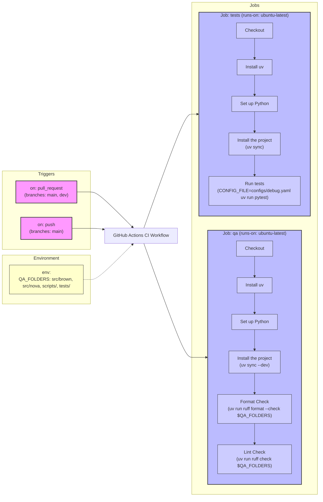
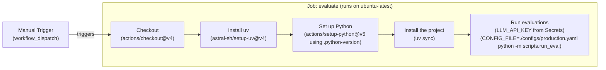
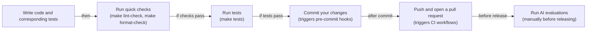

# Continuous Integration for AI Agents

In our recent lessons, we have built a solid foundation for creating and evaluating AI agents. We integrated Opik for observability, learned to create datasets for offline evaluation, and adopted an evaluation-driven development framework. These practices give us the visibility we need to understand agent behavior. Now, it is time to shift our focus to Continuous Integration (CI), the automated infrastructure that keeps your codebase maintainable and prevents regressions from reaching production. With the problem and failure modes clear, we now define what Continuous Integration means in an AI context and introduce the three-tier model that solves these issues.

## What is Continuous Integration?

Continuous Integration (CI) is the practice of frequently merging code changes from multiple developers into a central repository. After each merge, an automated build and test sequence runs to detect integration issues early [[43]](https://www.atlassian.com/continuous-delivery/continuous-integration). This process prevents the classic "it works on my machine" problem by ensuring that all code is validated in a consistent, shared environment [[44]](https://octopus.com/devops/ci-cd).

However, traditional software CI, which focuses on deterministic logic, compile checks, and unit tests, falls short when applied to AI agents. AI systems introduce unique challenges that legacy CI pipelines were not designed to handle [[1]](https://galileo.ai/blog/continuous-integration-ci-ai-fundamentals). These include non-determinism from LLM calls, rapid prompt iteration that can silently break previous assumptions, and high API costs that make naive test suites impractical.

Without a CI process tailored for AI, teams often encounter three common failure modes.

### Failure Modes without CI

1.  **Inconsistent code formatting across the team.** When team members use different formatters or apply formatting manually, the codebase becomes cluttered with inconsistent styles. This leads to time-wasting discussions during code reviews about trivial issues like spacing and line breaks, distracting from the actual logic.
2.  **Skipped pre-commit checks, leading to CI failures.** Under pressure to deliver quickly, developers might forget or intentionally skip running the full test suite locally before pushing their code. Without automated enforcement, this leads to broken builds in the main branch, disrupting the entire team's workflow.
3.  **Non-deterministic tests that call real LLM APIs.** Tests that rely on live LLM calls are inherently flaky. They are slow, expensive, and non-deterministic, meaning they can pass or fail unpredictably even when the underlying code has not changed [[2]](https://www.guild.ai/glossary/non-deterministic-systems). This erodes trust in the test suite and slows down development as engineers chase down phantom failures.

### A Three-Tier Model for AI Agent CI

To address these challenges, we need a layered approach that balances feedback speed, cost, and coverage. We use a three-tier model that calibrates our checks by their expense and execution time.

*   **Tier 1: Formatting and Linting (Always Run).** These checks are extremely fast, taking only seconds to run, and are free as they involve no API calls. They catch syntactic errors and enforce a consistent coding style across the project. This tier is identical to what you would find in a traditional CI pipeline.
*   **Tier 2: Unit and Integration Tests (Always Run).** These tests verify the deterministic logic within your agent, such as data parsing, schema validation, and state transitions, without calling external APIs. By mocking LLM responses, these tests run quickly (typically under a minute), are completely deterministic, and cost nothing.
*   **Tier 3: AI Evaluations (Manual/Release).** This tier is unique to AI systems. It involves running expensive, LLM-based quality checks against a curated dataset to evaluate the agent's semantic performance. Because these evaluations use real API calls, we run them selectively. We run them either manually before a major release or after an important change to a prompt or model.

Image 1: A three-tier CI model for AI agents, showing the flow from commit checks to PR tests and finally to manual/release AI evaluations, with each tier distinctly colored.

The AI evaluations in Tier 3, which we built using our offline datasets and Opik traces from previous lessons, serve as regression tests for AI. They are uniquely suited to catch semantic quality regressions that traditional unit tests structurally cannot detect [[14]](https://kinde.com/learn/ai-for-software-engineering/ai-devops/ci-cd-for-evals-running-prompt-and-agent-regression-tests-in-github-actions).

This lesson focuses on the CI essentials for building production-ready AI agents. We will cover practical techniques you will use daily, such as automated quality checks, testing with mocked LLMs, and structuring CI pipelines around cost constraints. We will not cover comprehensive DevOps topics like Kubernetes or Terraform. Instead, we will show you how to effectively move your agent from a prototype to a production-ready system.

We will cover:
*   Setting up pre-commit hooks to enforce code quality automatically.
*   Configuring Ruff for linting and formatting.
*   Writing unit tests for deterministic agent code with mocked LLM responses.
*   Building a CI pipeline that runs automatically on every change.
*   Using AI evaluations as selective regression tests in CI.

This lesson includes a hands-on notebook where you will practice running formatting checks, linting, and tests on Brown, our writing agent. The fastest feedback comes from running the first tier locally before you even commit code; pre-commit hooks provide this capability.

## Pre-commit Hooks: Automated Local Guardrails

Pre-commit hooks are local guardrails that run on your machine every time you make a commit [[25]](https://pre-commit.com/). They provide immediate feedback, catching simple issues like trailing whitespace or missing semicolons before the code ever reaches the shared repository [[26]](https://www.atlassian.com/git/tutorials/git-hooks). This tight feedback loop saves time and ensures a baseline of quality for every change.

The `pre-commit` framework manages these Git hooks using a declarative YAML configuration [[25]](https://pre-commit.com/). You define the hooks you want to use in a `.pre-commit-config.yaml` file, and the framework handles their installation and execution. It can manage hooks written in any language, automatically handling the setup of isolated environments for tools like Node.js or Ruby, even if they are not installed on your system. These hooks often reference external repositories, allowing you to use community-maintained tools for popular linters and formatters without adding them as direct project dependencies.

### Brown’s Pre-commit Configuration

<aside>
💡
You can experiment with the code for this lesson in this [Colab](https://colab.research.google.com/github/louisfb01/agent-course-notebooks/blob/main/notebooks/lesson_31_notebook.ipynb#scrollTo=b30eba1a). Alternatively, you can find the code for this lesson in the notebook for Lesson 31 of the course GitHub repository.
</aside>

Let's examine the configuration used for our Brown agent, located at `lessons/writing_workflow/.pre-commit-config.yaml`.

```bash
!cat .pre-commit-config.yaml
```

It outputs:

```yaml
fail_fast: false

repos:
  - repo: https://github.com/abravalheri/validate-pyproject
    rev: v0.24.1
    hooks:
      - id: validate-pyproject

  - repo: https://github.com/pre-commit/mirrors-prettier
    rev: v3.1.0
    hooks:
      - id: prettier
        types_or: [yaml, json5]

  - repo: https://github.com/astral-sh/ruff-pre-commit
    # Ruff version. Keep in sync with the CI workflows (.github/workflows/*.yml).
    rev: v0.14.6
    hooks:
      # Run the linter.
      - id: ruff-check
        args: [--fix, --exit-non-zero-on-fix]
      # Run the formatter.
      - id: ruff-format
```

This configuration defines three sets of hooks:

*   **`validate-pyproject`**: This tool validates that your `pyproject.toml` file is structurally correct according to PEP standards. A malformed file can break your entire build process, so this check is a simple but important safeguard.
*   **`prettier`**: A popular code formatter that we use for configuration files like `.github/workflows/ci.yml`. Consistent formatting makes these files more readable and helps reduce merge conflicts.
*   **`ruff-check` and `ruff-format`**: These hooks run Ruff, our modern Python linter and formatter. The `--fix` argument automatically corrects any fixable issues, and `--exit-non-zero-on-fix` ensures the hook fails even after auto-fixing. This forces you to review and re-stage the changes, confirming that you accept the automated modifications. As recommended by Ruff’s authors, the `ruff-check` hook runs before `ruff-format`.

### Setting Up Pre-commit

In the `lessons/writing_workflow` repo, or any repository where you have a `.pre-commit-config.yaml` file, you can set up the hooks with two commands:

```bash
# Install dependencies (includes pre-commit)
uv sync --dev

# Install the Git hooks
pre-commit install
```

The `pre-commit install` command creates a script at `.git/hooks/pre-commit`. Now, every time you run `git commit`, these hooks will execute automatically. You can also run them manually on all files in the repository:

```bash
# Run all hooks on all files
make pre-commit
```

The workflow is simple: make your code changes, stage them with `git add`, and then run `git commit`. If any hooks fail, you can review the errors, fix them (often automatically), re-stage the modified files, and commit again. Pre-commit hooks often rely on fast tools like Ruff to do the actual work. Next, we will examine Ruff in more detail.

## Ruff: Fast Python Linting and Formatting

Ruff is a Python linter and code formatter written in Rust. It is designed to be extremely fast, often 10 to 100 times faster than legacy tools like Black, isort, and Flake8 [[28]](https://docs.astral.sh/ruff/). It consolidates the functionality of over a dozen separate tools into a single, cohesive binary, which eliminates version conflicts and greatly reduces CI execution times [[27]](https://docs.astral.sh/ruff/faq).

It is important to distinguish between formatting and linting:

*   **Formatting** automatically rewrites your code to follow a consistent and opinionated style, managing details like indentation, line breaks, and quote style.
*   **Linting** analyzes your code for potential bugs, suspicious patterns, and violations of best practices, such as identifying unused variables or missing imports.

### Brown’s Ruff Configuration

Ruff is configured in the `pyproject.toml` file, which centralizes settings for many Python development tools. Here is the configuration from `lessons/writing_workflow/pyproject.toml`:

```bash
!grep -A 20 "\[tool.ruff\]" pyproject.toml
```

It outputs:

```toml
[tool.ruff]
target-version = "py312"
line-length = 140

[tool.ruff.lint]
select = [
    "F",    # Pyflakes
    "E",    # pycodestyle errors
    "I",    # isort
]

[tool.ruff.lint.isort]
known-first-party = ["src", "tests"]

[tool.pytest.ini_options]
pythonpath = ["src"]
markers = [
    "integration: end-to-end workflow tests (mocked LLMs, no network). Select with `-m integration` or skip with `-m 'not integration'`.",
]
```

Here is what each key does:
*   `target-version = "py312"` tells Ruff to enforce rules compatible with Python 3.12 syntax.
*   `line-length = 140` sets the maximum line length for both the formatter and linter.
*   `select = ["F", "E", "I"]` enables three core rule sets: `F` for Pyflakes (catches common bugs), `E` for pycodestyle (enforces PEP 8 style), and `I` for isort (organizes imports).
*   `known-first-party = ["src", "tests"]` helps isort correctly group project-specific imports separately from third-party libraries.

We also provide convenient shortcuts in our `Makefile` for running these checks:

```bash
!sed -n '/# --- Tests & QA ---/,$p' Makefile | tail -n +2
```

It outputs:

```makefile
tests: # Run tests.
	CONFIG_FILE=configs/debug.yaml uv run pytest

pre-commit: # Run pre-commit hooks.
	uv run pre-commit run --all-files

format-fix: # Auto-format Python code using ruff formatter.
	uv run ruff format $(QA_FOLDERS)

lint-fix: # Auto-fix linting issues using ruff linter.
	uv run ruff check --fix $(QA_FOLDERS)

format-check: # Check code formatting without making changes using ruff formatter.
	uv run ruff format --check $(QA_FOLDERS) 

lint-check: # Check code for linting issues without fixing them using ruff linter.
	uv run ruff check $(QA_FOLDERS)
```

Each target uses `uv run` to execute commands within the project’s virtual environment, which is managed automatically and does not require manual activation. You can run these from the `writing_workflow/` directory to check or fix your code before committing.

### Hands-On Example: Fixing Formatting Issues

Let's see Ruff's formatter in action. First, we will create a Python file with deliberate formatting errors.

1.  We create a file named `test_formatting.py` with inconsistent spacing and layout.
    ```bash
    %%bash

    # Create a Python file with various formatting issues
    cat > test_formatting.py << 'EOF'
    # This file has formatting issues
    def  badly_formatted_function(x,y,z):
        result=x+y+z
        my_list=[1,2,3,4,5,6,7,8,9,10]
        my_dict={"key1":"value1","key2":"value2","key3":"value3"}
        if result>10:
            print("Result is greater than 10")
        else:
            print("Result is 10 or less")
        return result

    class   BadlyFormattedClass:
        def __init__(self,name,age):
            self.name=name
            self.age=age
        def get_info(self):
            return f"{self.name} is {self.age} years old"
    EOF

    echo "Created test_formatting.py"
    ```
    It outputs:
    ```text
    Created test_formatting.py
    ```

2.  Next, we run the format checker. The `--check` flag reports issues without modifying the file.
    ```bash
    !uv run ruff format --check test_formatting.py
    ```
    It outputs:
    ```text
    Would reformat: test_formatting.py
    1 file would be reformatted
    ```

3.  Now, we run the formatter again, this time without `--check`, to automatically fix the file.
    ```bash
    !uv run ruff format test_formatting.py
    ```
    It outputs:
    ```text
    1 file reformatted
    ```

4.  Finally, we inspect the corrected file. Ruff has fixed all spacing issues, creating clean, readable code.
    ```bash
    !cat test_formatting.py
    ```
    It outputs:
    ```python
    # This file has formatting issues
    def badly_formatted_function(x, y, z):
        result = x + y + z
        my_list = [1, 2, 3, 4, 5, 6, 7, 8, 9, 10]
        my_dict = {"key1": "value1", "key2": "value2", "key3": "value3"}
        if result > 10:
            print("Result is greater than 10")
        else:
            print("Result is 10 or less")
        return result


    class BadlyFormattedClass:
        def __init__(self, name, age):
            self.name = name
            self.age = age

        def get_info(self):
            return f"{self.name} is {self.age} years old"
    ```

### Hands-On Example: Fixing Linting Issues

Now let's do the same for linting, which catches potential bugs and style violations.

1.  We create a file named `test_linting.py` with several issues, including unused imports, a duplicate import, and an undefined function call.
    ```bash
    %%bash

    cat > test_linting.py << 'EOF'
    import os
    import sys
    import json # Unused import

    def calculate_sum(numbers):
        """Calculate sum of numbers."""
        total = 0
        for num in numbers:
            total = total + num
        return total

    def process_data(data):
        """Process some data."""
        result = calculate_sum(data)
        print(f"Result: {result}")
        _ = os.getcwd()  # Use os
        _ = sys.argv[0]  # Use sys
        undefined_variable = some_undefined_function()  # Using undefined name
        return result

    import sys # Duplicate import
    EOF

    echo "Created test_linting.py"
    ```
    It outputs:
    ```text
    Created test_linting.py
    ```

2.  We run the linter to see what issues it finds.
    ```bash
    !uv run ruff check test_linting.py
    ```
    It outputs:
    ```text
    I001 [*] Import block is un-sorted or un-formatted
     --> test_linting.py:1:1
    ...
    F401 [*] `json` imported but unused
     --> test_linting.py:3:8
    ...
    F821 Undefined name `some_undefined_function`
      --> test_linting.py:18:26
    ...
    F811 [*] Redefinition of unused `sys` from line 2
      --> test_linting.py:21:8
    ...
    Found 7 errors.
    [*] 4 fixable with the `--fix` option...
    ```

3.  Ruff reports several issues, including unused imports (`F401`), duplicate imports (`F811`), and an undefined name (`F821`). We run the linter with the `--fix` flag to automatically correct what it can.
    ```bash
    !uv run ruff check --fix test_linting.py
    ```
    It outputs:
    ```text
    ...
    F821 Undefined name `some_undefined_function`
      --> test_linting.py:18:26
    ...
    Found 5 errors (3 fixed, 2 remaining).
    ```

4.  Ruff automatically removes the unused and duplicate imports but leaves the undefined function call, which is a logic error that requires manual intervention.
    ```bash
    !cat test_linting.py
    ```
    It outputs:
    ```python
    import os
    import sys


    def calculate_sum(numbers):
        """Calculate sum of numbers."""
        total = 0
        for num in numbers:
            total = total + num
        return total

    def process_data(data):
        """Process some data."""
        result = calculate_sum(data)
        print(f"Result: {result}")
        _ = os.getcwd()  # Use os
        _ = sys.argv[0]  # Use sys
        undefined_variable = some_undefined_function()  # Using undefined name
        return result
    ```

Once formatting and linting guardrails are in place, our attention turns to verifying the deterministic logic inside the agent nodes. This is the role of unit tests.

## Unit Tests for Agent Repos

The core challenge in testing AI agents is the non-determinism of LLMs. Making real API calls in tests leads to several problems: they are slow, which discourages frequent running; they are expensive, adding cost to each CI run; and they are flaky, as identical prompts can produce different outputs or hit rate limits [[12]](https://www.iamraghuveer.com/posts/unit-testing-custom-agents).

Unit tests solve this by focusing only on the deterministic logic within your agent. This includes components that do not require live LLM calls to be verified, such as:

*   **Parsing and rendering:** Does your markdown loader extract articles correctly?
*   **Schema validation:** Does your Pydantic model reject invalid data as expected?
*   **Routing decisions:** Given a specific state, does your workflow consistently route to the correct node?
*   **Utilities:** Do helper functions for URL extraction or text cleaning work as intended?

### Unit Tests vs. Integration Tests

In traditional software, a **unit test** verifies a single, isolated piece of code, like a function, in complete isolation from its dependencies. An **integration test** verifies that multiple components work together correctly. For AI agents, these lines often blur. A single agent "node" might combine prompt templating, structured output parsing, and routing logic into one cohesive unit.

We follow a pragmatic approach: if a test runs quickly, uses mocked dependencies, and verifies deterministic logic, we consider it a unit test, regardless of how many internal components it touches. This allows us to test meaningful chunks of our agent's logic without the flakiness of real network calls. The "unit" in an agent can be a prompt template, a tool selector, or a memory module, each of which can be tested in isolation to ensure its specific function is correct [[30]](https://www.guild.ai/glossary/unit-testing-ai-agents).

The key to achieving this is mocking. We use a strategy called response injection, where we provide a pre-scripted, or "canned," response directly to our agent node. For the Brown writing agent, we implement this with a compatible fake model class rather than patching at the HTTP layer. This approach provides a good balance of simplicity and control for most AI agent projects.

<aside>
💡
Another option to mock LLM calls in tests is HTTP mocking, where you intercept API requests and return canned responses using libraries like `responses` or `httpretty`. Some teams prefer fixture-based mocking with `pytest` fixtures and `unittest.mock.patch` to replace LLM calls with fixed outputs. There's also record and replay, which captures real API responses once and then replays them in tests using tools like VCR.py.
</aside>

### Our Implementation: The FakeModel Pattern

In our Brown agent, we implement response injection with a `FakeModel` class that is compatible with LangChain’s interface. This pattern has three parts:

1.  **Configuration specifies the fake model:** The `debug.yaml` configuration at `lessons/writing_workflow/configs/debug.yaml` sets all nodes to use `model_id: “fake`”.
2.  **Model factory returns FakeModel:** The model builder in `src/brown/models/get_model.py` returns a `FakeModel` instance when the configuration specifies it.
3.  **Tests inject specific responses:** The `FakeModel` in `src/brown/models/fake_model.py` extends LangChain’s `FakeListChatModel` and allows tests to inject a list of canned responses.

Here is the implementation of the `FakeModel` class:

```python
class FakeModel(FakeListChatModel):
    def __init__(self, responses: list[str]) -> None:
        super().__init__(responses=responses)

        self._structured_output_type: Type[Any] | None = None
        self._include_raw: bool = False

    ...

    async def ainvoke(self, inputs, *args, **kwargs) -> Any:
        if len(self.responses) == 0:
            return []

        if self._structured_output_type is not None:
            # For structured output, we need to handle the mocked response directly
            # without going through the parent's ainvoke method which creates AIMessage
            response_content = self.responses[0]

            if isinstance(response_content, dict):
                structured_response = self._structured_output_type(**response_content)
            elif isinstance(response_content, str):
                try:
                    data = json.loads(response_content)
                    structured_response = self._structured_output_type(**data)
                except Exception:
                    logger.warning(f"Failed to parse response as JSON: {response_content}")
                    raise ValueError(f"Failed to parse response as JSON: {response_content}")
            else:
                raise NotImplementedError(f"Unsupported response type: {type(response_content)}")

            if self._include_raw:
                # For raw output, we still need to create a proper AIMessage
                from langchain_core.messages import AIMessage

                raw_message = AIMessage(content=response_content)
                return {
                    "parsed": structured_response,
                    "raw": raw_message,
                }
            else:
                return structured_response

        # For non-structured output, use the parent's implementation
        response = await super().ainvoke(inputs, *args, **kwargs)
        return response
```

An instance of the `FakeModel` class takes a list of pre-scripted responses in its constructor. When its `ainvoke()` method is called, it simply returns the next response from the list. This design ensures that all unit tests run with a fake model by default, and individual tests can inject specific responses as needed.

### Example: Testing Nodes with Mocked Responses

For nodes that call LLMs, you mock the responses. Here is an example test from `lessons/writing_workflow/tests/brown/nodes/test_article_writer.py` that shows how to write a test for the `ArticleWriter` node:

```python
@pytest.mark.asyncio
async def test_article_writer_ainvoke_success(
    # ... pytest fixtures for mock data
) -> None:
    """Test article generation with mocked response."""
    mock_response = '{"content": "# Generated Article..."}'

    app_config = get_app_config()
    model, _ = build_model(app_config, node="write_article")
    model.responses = [mock_response]

    writer = ArticleWriter(
        # ... inject dependencies
        model=model,
    )

    result = await writer.ainvoke()

    assert isinstance(result, Article)
    assert "# Generated Article" in result.content
```

The test creates a mock JSON response, builds a fake model, and injects the response into it. It then instantiates the `ArticleWriter` node with that fake model and asserts that the output is correct. This pattern keeps tests fast, deterministic, and free.

### Running Brown’s Tests

To run Brown’s test suite, use the command from the `Makefile`:

```bash
# From the writing_workflow directory
make tests
```

This command runs `CONFIG_FILE=configs/debug.yaml uv run pytest`. The `debug.yaml` configuration ensures all tests use the fake models and never call real LLMs. Local tests and hooks provide fast feedback, but enforcement at the repository level requires automated CI workflows that run on every pull request.

## CI Workflows: Automated Enforcement

GitHub Actions is the CI platform we use for both the Brown and Nova agents. It integrates seamlessly with GitHub repositories and requires minimal setup. Workflows trigger automatically on events like pull requests or pushes, run jobs in isolated environments, and support parallel execution to keep feedback loops fast [[36]](https://docs.github.com/actions/get-started/quickstart).

### Our Complete CI Configuration

Our entire CI configuration is defined in a single workflow file at `.github/workflows/ci.yml`.

```yaml
name: CI
on:
  pull_request:
    branches: [main, dev]
  push:
    branches: [main]

env:
  QA_FOLDERS: "src/brown src/nova scripts/ tests/"

jobs:
  qa:
    runs-on: ubuntu-latest
    steps:
      - name: 🛎️ Checkout
        uses: actions/checkout@v4

      - name: 📦 Install uv
        uses: astral-sh/setup-uv@v4

      - name: 🐍 Set up Python
        uses: actions/setup-python@v5
        with:
          python-version-file: ".python-version"

      - name: 🦾 Install the project
        run: |
          uv sync --dev

      - name: 💅 Format Check
        run: |
          uv run ruff format --check $QA_FOLDERS

      - name: 🔎 Lint Check
        run: uv run ruff check $QA_FOLDERS

  tests:
    runs-on: ubuntu-latest
    steps:
      - name: 🛎️ Checkout
        uses: actions/checkout@v4

      - name: 📦 Install uv
        uses: astral-sh/setup-uv@v4

      - name: 🐍 Set up Python
        uses: actions/setup-python@v5
        with:
          python-version-file: ".python-version"

      - name: 🦾 Install the project
        run: |
          uv sync

      - name: 🧪 Run tests
        run: |
          CONFIG_FILE=configs/debug.yaml uv run pytest
```

This configuration defines when the workflow runs and what checks it performs. The `on` section specifies that the workflow triggers on pull requests to the `main` and `dev` branches, as well as on direct pushes to `main`. This ensures every code change is validated before it can be merged. The `env` section defines an environment variable, `QA_FOLDERS`, that lists all directories to check. Notice it includes both `src/brown` and `src/nova`, allowing us to use the same CI configuration for both agents in a monorepo structure.



Image 2: GitHub Actions CI workflow for AI agents, showing triggers, environment variables, and parallel qa and tests jobs with their sequential steps.

### Understanding the Job Structure

The workflow defines two independent jobs that run in parallel: `qa` and `tests`. Splitting them provides clear, fast feedback. If formatting fails, you immediately see “QA job failed” without waiting for tests to complete. This parallel execution saves time and makes it easier to identify which category of checks failed.

Each job runs on `ubuntu-latest`, a virtual machine provided by GitHub, and is completely isolated from the other.

The `qa` job focuses on code quality checks. It starts by checking out your code with `actions/checkout@v4`, then installs `uv` using `astral-sh/setup-uv@v4`. The Python setup step uses `actions/setup-python@v5` and reads the Python version from your `.python-version` file, ensuring consistency between local development and CI. After syncing dependencies with `uv sync --dev`, it runs a format check (`uv run ruff format --check`) and a lint check (`uv run ruff check`).

The `tests` job follows a similar setup process but runs `uv sync` without the `--dev` flag, as tests do not require development tools. The test step uses `CONFIG_FILE=configs/debug.yaml uv run pytest` to ensure tests run with the fake model configuration, preventing any real LLM API calls.

### Setting Up GitHub Actions for Your Repository

To enable this workflow, create the directory `.github/workflows/` at the root of your repository. Inside it, create a file named `ci.yml` and paste the complete configuration shown above. Ensure your repository also has a `.python-version` file specifying your Python version (e.g., `3.12`) and a `configs/debug.yaml` file that configures your agents to use fake models for testing.

Once you commit and push this file, the workflow becomes active. You do not need to configure anything in the GitHub UI for basic workflows, though you will need to add secrets for more advanced scenarios, like API keys.

### Running the Pipeline and Observing Results

The pipeline runs automatically when its trigger conditions are met, such as opening a pull request. The status is reported directly on the pull request page, blocking merges if checks fail.

You can also trigger the workflow manually. Navigate to your repository’s “Actions” tab, select the “CI” workflow, and click the “Run workflow” button. This is useful for testing changes without creating a new commit. To monitor a run, click on it to see the status of both the `qa` and `tests` jobs. If a step fails, its output is expanded and highlighted in red, making it easy to spot the problem.

### Interpreting CI Results and Fixing Issues

When a CI job fails, the logs tell you exactly what went wrong. If the `qa` job fails on formatting, the output shows which files need changes. You can fix this locally by running `make format-fix`, then committing and pushing the formatted code. If it fails on linting, the output lists each violation by file and line number. Running `make lint-fix` will correct many of these automatically.

If the `tests` job fails, the `pytest` output will show a detailed traceback for the failed test. The key principle here is that CI should run the exact same commands you run locally. This eliminates “it works on my machine” problems. If tests pass with `make tests`, they will pass in CI.

### Trying It Out

The best way to learn is by doing. Try introducing a formatting error, committing it, and opening a pull request. Watch the `qa` job fail and show you the error. Then, fix it locally with `make format-fix`, push the change, and watch the pipeline automatically re-run and pass. This hands-on experience will solidify your understanding and build confidence in the system.

The first two tiers of our CI model run on every commit, but ensuring semantic quality requires a more expensive third tier. This is where AI evaluations enter the picture as selective regression tests.

## AI Evaluations as Regression Tests

AI evaluations are essential for catching semantic quality regressions, such as a drop in helpfulness or an increase in hallucinations, that deterministic unit tests cannot detect [[15]](https://www.braintrust.dev/articles/best-ai-evals-tools-cicd-2025). They form the third and most specialized tier of our CI model for AI agents.

### Why AI Evals Are Unique to AI Systems

Evaluations are unique because they involve making real LLM calls, which makes them both slow and expensive. A single evaluation run can take several minutes and incur API costs. For example, running an evaluation on a 500-example dataset where each run consumes 2,000 tokens could cost around $1 per run at $0.01 per 1,000 tokens, depending on the model. This cost makes it impractical to run them on every single commit.

### Manual-Trigger CI Workflow for AI Evals

To manage this cost, we run evaluations using a separate CI workflow that is triggered manually, not automatically. This pattern is configured using `workflow_dispatch` in GitHub Actions and prevents accidental, expensive runs on every commit or pull request [[19]](https://graphite.com/guides/github-actions-workflow-dispatch). Here is an example of what this workflow, `.github/workflows/eval.yml`, might look like:

```yaml
name: AI Evaluations

on:
  workflow_dispatch:  # Manual trigger only

jobs:
  evaluate:
    runs-on: ubuntu-latest
    steps:
      - uses: actions/checkout@v4
      - uses: astral-sh/setup-uv@v4
      - uses: actions/setup-python@v5
        with:
          python-version-file: ".python-version"
      - run: uv sync
      - name: Run evaluations
        env:
          LLM_API_KEY: ${{ secrets.LLM_API_KEY }}
        run: |
          # Replace with your actual evaluation script
          CONFIG_FILE=./configs/production.yaml python -m scripts.run_eval
```

This workflow differs from our main CI pipeline in a few key ways:
1.  The `workflow_dispatch` trigger means it only runs when manually started from the Actions tab in GitHub [[19]](https://graphite.com/guides/github-actions-workflow-dispatch). This is important for controlling costs.
2.  It uses a production configuration (`configs/production.yaml`) to ensure evaluations run against real LLM models, not the fake ones used in unit tests.
3.  The `LLM_API_KEY` is securely pulled from GitHub Secrets, which are configured in your repository settings under **Settings → Secrets and variables → Actions**.



Image 3: GitHub Actions CI workflow for AI evaluations, triggered manually and running a sequence of steps including checkout, setup, installation, and evaluation with a production configuration.

To trigger this workflow, you navigate to the Actions tab, select “AI Evaluations,” click “Run workflow,” choose your branch, and confirm. The results will appear in the Actions interface, with logs showing all computed metrics.

The frequency of running these evaluations depends on your project's maturity:

*   **Early development:** Run evaluations manually to measure progress. This might be done weekly or after major architectural changes to get a baseline understanding of quality.
*   **Active development:** Run them before merging important changes, such as a new prompt, a model upgrade, or a change in the RAG pipeline. This helps catch regressions before they are integrated into the main branch.
*   **Mature product:** Integrate them into your formal release process. Running a full evaluation suite becomes a required quality gate before deploying a new version to production, ensuring that quality never degrades for your users.

With all three tiers of our CI model understood, we can now assemble them into a cohesive daily development workflow.

## Daily Development Workflow

With these tools and processes in place, your daily development workflow becomes a streamlined and reliable cycle that catches issues early and keeps development velocity high.



Image 4: A daily development workflow for AI agents.

Here is what a typical day looks like:

1.  **Write code** and the corresponding unit tests for any new logic.
2.  **Run quick checks** periodically on your local machine using `make lint-check` and `make format-check`.
3.  **Run tests** after changing any logic by running `make tests`.
4.  **Commit your changes.** The pre-commit hooks will run automatically, catching any last-minute issues.
5.  **Push and open a pull request.** The main CI workflow runs automatically, providing a final layer of enforcement.
6.  **Before releasing, run AI evaluations** manually to check for any semantic quality regressions.

This workflow takes only seconds for most commits and ensures that issues are caught at the earliest possible stage.

## Conclusion

We have adapted traditional Continuous Integration practices to fit the unique realities of building LLM-powered agents. Our three-tier model provides a pragmatic framework that balances speed, cost, and quality. The upfront investment in hooks, Ruff, and automated workflows pays off by catching regressions early. This CI foundation moves an agent from a fragile prototype to a reliable, production-ready system. These practices will be essential as we move on to full CI/CD integration, production monitoring, and cost optimization in future lessons.

## References

- [1] Galileo. (n.d.). *How to Build a Continuous Integration Pipeline for AI Agents*. https://galileo.ai/blog/continuous-integration-ci-ai-fundamentals
- [2] Guild.ai team. (2026, February 23). *Non-Deterministic Systems*. Guild.ai. https://www.guild.ai/glossary/non-deterministic-systems
- [4] YouTuber. (n.d.). *Non-determinism in AI models* [Video]. YouTube. https://www.youtube.com/watch?v=4u64WEuQHYE&vl=en
- [9] Agiflow. (n.d.). *Effective Practices for Mocking LLM Responses During the Software Development Lifecycle*. Agiflow Blog. https://agiflow.io/blog/effective-practices-for-mocking-llm-responses-during-the-software-development-lifecycle
- [11] LangChain Contrib. (n.d.). *Fake LLM*. LangChain Contrib Docs. https://langchain-contrib.readthedocs.io/en/latest/llms/fake.html
- [12] Raghuveer. (n.d.). *Unit Testing Custom Agents*. I am Raghuveer. https://www.iamraghuveer.com/posts/unit-testing-custom-agents
- [13] LangChain. (n.d.). *Fake Chat Model*. LangChain Docs. https://docs.langchain.com/oss/javascript/integrations/chat/fake
- [14] Kinde. (n.d.). *CI/CD for AI Evals: Running Prompt and Agent Regression Tests in GitHub Actions*. Kinde Learn. https://kinde.com/learn/ai-for-software-engineering/ai-devops/ci-cd-for-evals-running-prompt-and-agent-regression-tests-in-github-actions
- [15] Braintrust. (n.d.). *Best AI Eval Tools for CI/CD Pipelines (2026 Review)*. Braintrust Articles. https://www.braintrust.dev/articles/best-ai-evals-tools-cicd-2025
- [17] TestGrid. (n.d.). *What is AI Regression Testing?* TestGrid Blog. https://testgrid.io/blog/what-is-ai-regression-testing
- [18] Paul, K. (n.d.). *A practical guide to integrating AI evals into your CI/CD pipeline*. Dev.to. https://dev.to/kuldeep_paul/a-practical-guide-to-integrating-ai-evals-into-your-cicd-pipeline-3mlb
- [19] Graphite. (n.d.). *GitHub Actions: workflow_dispatch*. Graphite Guides. https://graphite.com/guides/github-actions-workflow-dispatch
- [20] GitHub. (n.d.). *Manually running a workflow*. GitHub Docs. https://docs.github.com/actions/managing-workflow-runs/manually-running-a-workflow
- [21] Microsoft. (n.d.). *Evaluation with GitHub Action*. Microsoft Learn. https://learn.microsoft.com/en-us/azure/foundry/how-to/evaluation-github-action
- [22] GitGuardian. (n.d.). *Automated Guard Rails for Vibe Coding*. GitGuardian Blog. https://blog.gitguardian.com/automated-guard-rails-for-vibe-coding
- [23] GitGuardian. (n.d.). *Local Guardrails for Secrets Security*. GitGuardian Blog. https://blog.gitguardian.com/local-guardrails-for-secrets-security
- [24] pre-commit. (n.d.). *pre-commit-hooks*. GitHub. https://github.com/pre-commit/pre-commit-hooks
- [25] pre-commit. (n.d.). *pre-commit*. https://pre-commit.com
- [26] Atlassian. (n.d.). *Git Hooks*. Atlassian Git Tutorial. https://www.atlassian.com/git/tutorials/git-hooks
- [27] Astral. (n.d.). *Ruff FAQ*. Ruff Docs. https://docs.astral.sh/ruff/faq
- [28] Astral. (n.d.). *Ruff*. Ruff Docs. https://docs.astral.sh/ruff/
- [29] Astral. (n.d.). *ruff*. GitHub. https://github.com/astral-sh/ruff
- [30] Guild.ai team. (n.d.). *Unit Testing (AI Agents)*. Guild.ai. https://www.guild.ai/glossary/unit-testing-ai-agents
- [31] OneUptime. (n.d.). *Agent Testing*. OneUptime Blog. https://oneuptime.com/blog/post/2026-01-30-agent-testing/view
- [32] DataGrid. (n.d.). *4 Frameworks to Test Non-Deterministic AI Agents*. DataGrid Blog. https://datagrid.com/blog/4-frameworks-test-non-deterministic-ai-agents
- [33] arXiv. (2025, September 19). *Unit Testing in Agent-based Systems*. arXiv. https://arxiv.org/html/2509.19185v1
- [34] Galileo. (n.d.). *Unit Testing AI Systems*. Galileo Blog. https://galileo.ai/blog/unit-testing-ai-systems
- [35] Intersect Training. (n.d.). *YAML and GitHub Actions*. https://intersect-training.org/CI-CD/yaml-and-github-actions.html
- [36] GitHub. (n.d.). *Quickstart for GitHub Actions*. GitHub Docs. https://docs.github.com/actions/get-started/quickstart
- [37] Brown, D. (n.d.). *Week 8: Diving into CI/CD, GitHub Actions, and a little Lambda magic*. Medium. https://medium.com/@donovan.brown_75022/week-8-diving-into-ci-cd-github-actions-and-a-little-lambda-magic-997cf8a1e193
- [38] GitHub. (n.d.). *Sotheby's GitHub Actions*. GitHub Guides. https://github.com/readme/guides/sothebys-github-actions
- [42] Red Hat. (2026, May 18). *CI/CD Delivery for Agentic AI*. Red Hat Developer. https://developers.redhat.com/articles/2026/05/18/ci-cd-delivery-agentic-ai
- [43] Atlassian. (n.d.). *Continuous Integration*. Atlassian. https://www.atlassian.com/continuous-delivery/continuous-integration
- [44] Octopus. (n.d.). *CI/CD*. Octopus. https://octopus.com/devops/ci-cd
- [45] Gatling. (n.d.). *CI/CD Best Practices*. Gatling Blog. https://gatling.io/blog/ci-cd-best-practices
- [46] IBM. (n.d.). *Continuous Integration*. IBM Think. https://www.ibm.com/think/topics/continuous-integration
- [47] SunnyData. (n.d.). *CI/CD Best Practices for Data Projects*. SunnyData Blog. https://www.sunnydata.ai/blog/cicd-best-practices-data-projects-validation-testing
- [49] MITRE. (n.d.). *MITRE AI Maturity Model*. https://www.mitre.org/news-insights/publication/mitre-ai-maturity-model-and-organizational-assessment-tool-guide
- [50] Info-Tech Research Group. (n.d.). *Assess Your AI Maturity*. https://www.infotech.com/research/ss/assess-your-ai-maturity
- [52] OWASP. (n.d.). *OWASP AI Maturity Assessment*. https://owasp.org/www-project-ai-maturity-assessment