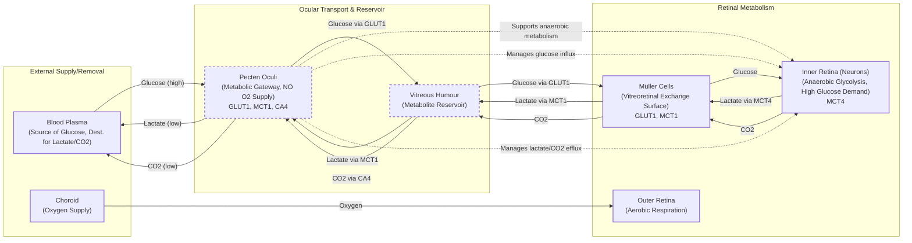

# The Bird's Eye Paradox: How Nature Achieves Sight Without Oxygen

In human medicine, a blocked retinal artery is an emergency. The sudden loss of oxygenated blood flow, known as vascular occlusion, rapidly destroys retinal tissue and causes irreversible blindness [[4]](https://www.genengnews.com/topics/translational-medicine/how-bird-retinas-function-without-oxygen-may-inform-future-stroke-therapies), [[6]](https://www.eurekalert.org/news-releases/1113036). Yet, birds operate with retinas that are almost entirely avascular, meaning they lack blood vessels. This biological design choice allows them to achieve some of the sharpest vision in the animal kingdom, enabling a hawk to spot a lizard from hundreds of feet in the air [[7]](https://www.sdu.dk/en/om-sdu/fakulteterne/naturvidenskab/nyheder-2026/bird-retina).

This presents a profound paradox. The retina is one of the body’s most energetically expensive tissues, consuming two to three times more energy than an equivalent mass of brain tissue [[8]](https://www.quantamagazine.org/how-the-bird-eye-was-pushed-to-an-evolutionary-extreme-20260513). For centuries, scientists assumed birds must have a unique, undiscovered process for acquiring oxygen, because without it, their high-performance vision seemed impossible. As evolutionary physiologist Christian Damsgaard of Aarhus University noted, “According to everything we know about physiology, this tissue should not be able to function.” [[4]](https://www.genengnews.com/topics/translational-medicine/how-bird-retinas-function-without-oxygen-may-inform-future-stroke-therapies)

A recent study published in *Nature* finally solves this mystery [[1]](https://doi.org/10.1038/s41586-025-09978-w). Birds do not have a novel oxygen-delivery system. Instead, their inner retinas exist in a permanent state of oxygen deprivation, or chronic anoxia. They survive by relying on anaerobic glycolysis, a much less efficient metabolic pathway. This finding documents the first known case of a vertebrate tissue thriving without oxygen for a lifetime, pushing our understanding of biological extremes.

https://www.quantamagazine.org/wp-content/uploads/2026/05/ChristianDamsgaard-crJesperEkmann-scaled.webp 
Image 1: The evolutionary physiologist Christian Damsgaard measured gas exchange in bird eyes with microsensors, revealing that the highly active inner retina used no oxygen. (Image by Jesper Ekmann from [Quanta Magazine](https://www.quantamagazine.org/how-the-bird-eye-was-pushed-to-an-evolutionary-extreme-20260513))

This work has direct implications for human health. Understanding how nature has engineered a system to tolerate chronic hypoxia could inspire new treatments for conditions like stroke and ischemic retinal disease, where tissue damage is caused by a lack of oxygen [[4]](https://www.genengnews.com/topics/translational-medicine/how-bird-retinas-function-without-oxygen-may-inform-future-stroke-therapies). Before we can appreciate how birds solved this paradox, we need to revisit how oxygen came to dominate complex life and why its absence is normally catastrophic.

## Oxygenated Life: The Great Oxidation Event and Metabolic Trade-offs

Around 3.4 billion years ago, cyanobacteria developed photosynthesis, a process that steadily pumped oxygen into the atmosphere. This Great Oxidation Event changed the course of life on Earth, enabling a far more efficient method of energy production [[8]](https://www.quantamagazine.org/how-the-bird-eye-was-pushed-to-an-evolutionary-extreme-20260513).

The biochemical advantage is stark. Anaerobic glycolysis, the breakdown of glucose without oxygen, yields only two molecules of ATP, life’s universal energy currency. In contrast, aerobic respiration, which uses oxygen, can produce up to 30 additional molecules of ATP from the same single glucose molecule. This fifteen-fold increase in efficiency was transformative, giving oxygen-using organisms a massive competitive advantage [[8]](https://www.quantamagazine.org/how-the-bird-eye-was-pushed-to-an-evolutionary-extreme-20260513), [[5]](https://www.thetransmitter.org/vision/inner-retina-of-birds-powers-sight-sans-oxygen).

https://www.quantamagazine.org/wp-content/uploads/2026/05/BirdFlying-crJean-PaulWettstein-scaled.webp 
Image 2: Birds, such as this alpine chough, use their exceptional vision for hunting, foraging, and migration, all powered by an inefficient metabolism. (Image by Jean-Paul Wettstein from [Quanta Magazine](https://www.quantamagazine.org/how-the-bird-eye-was-pushed-to-an-evolutionary-extreme-20260513))

This new atmospheric reality led to a mass extinction event, as organisms that could harness oxygen outcompeted those that could not. As molecular physiologist Gary Lewin of the Max Delbrück Center in Berlin puts it, “We’ve been hooked on 20% [atmospheric] oxygen for millions of years.” [[8]](https://www.quantamagazine.org/how-the-bird-eye-was-pushed-to-an-evolutionary-extreme-20260513) Consequently, nearly all complex, multicellular life, especially warm-blooded animals, depends on a constant oxygen supply to fuel energy-demanding tissues like the brain and retina.

Anoxia tolerance varies widely across the animal kingdom. Humans can suffer irreversible brain damage after just a few minutes without oxygen. The naked mole-rat, a subterranean mammal, can survive for 18 minutes by switching to a fructose-based anaerobic metabolism [[3]](https://doi.org/10.1126/science.aab3896). At the far end of the spectrum, some cold-blooded creatures like freshwater turtles can survive for months in anoxic conditions at the bottom of a frozen lake [[8]](https://www.quantamagazine.org/how-the-bird-eye-was-pushed-to-an-evolutionary-extreme-20260513). For most vertebrates, however, oxygen deprivation shuts down cellular processes and leads to rapid cell death.

https://www.quantamagazine.org/wp-content/uploads/2026/05/NakedMoleRats-crJavierAbalos-scaled.webp 
Image 3: Naked mole rats can survive without oxygen for 18 minutes by using anaerobic glycolysis fueled by fructose. (Image by Javier Ábalos from [Quanta Magazine](https://www.quantamagazine.org/how-the-bird-eye-was-pushed-to-an-evolutionary-extreme-20260513))

With this metabolic context established, we can now examine the mysterious vascular structure that enables birds to push the vertebrate eye to an extreme never seen in other lineages.

## A Mysterious Structure: The Pecten Oculi and Chronic Anoxia

When Damsgaard first encountered the paradox of the avascular bird retina in 2019, he reviewed the extensive historical research on the subject. Most of it pointed to a strange organ called the pecten oculi. First described by anatomists in the 17th century, it is a comb-like, highly vascularized structure that protrudes into the eye. For centuries, its function remained a mystery, generating over 30 different hypotheses based on anatomy alone [[8]](https://www.quantamagazine.org/how-the-bird-eye-was-pushed-to-an-evolutionary-extreme-20260513), [[4]](https://www.genengnews.com/topics/translational-medicine/how-bird-retinas-function-without-oxygen-may-inform-future-stroke-therapies). "Nobody had really done direct physiological measurements on this structure," Damsgaard said. "That’s where we came in." [[8]](https://www.quantamagazine.org/how-the-bird-eye-was-pushed-to-an-evolutionary-extreme-20260513)

https://www.quantamagazine.org/wp-content/uploads/2026/05/Bird_Retina-Fig1-crMarkBelan_Desktopv1.svg 
Image 4: A diagram of the bird eye, showing the position of the pecten oculi protruding into the vitreous body toward the retina. (Image by Mark Belan from [Quanta Magazine](https://www.quantamagazine.org/how-the-bird-eye-was-pushed-to-an-evolutionary-extreme-20260513))

In a series of technically challenging experiments, Damsgaard’s team used microsensors to measure oxygen levels directly in the retinas of living birds, including zebra finches, pigeons, and chickens. The results were striking. While the outer retina, near the oxygen-rich choroid, had oxygen, the inner retina was completely anoxic [[1]](https://doi.org/10.1038/s41586-025-09978-w), [[8]](https://www.quantamagazine.org/how-the-bird-eye-was-pushed-to-an-evolutionary-extreme-20260513). "Half of the retina lives in a chronic state of anoxia, where there’s no oxygen present at all," Damsgaard explained [[8]](https://www.quantamagazine.org/how-the-bird-eye-was-pushed-to-an-evolutionary-extreme-20260513). This overturned centuries of speculation that the pecten supplied oxygen.

To understand how the tissue survived, the researchers used spatial transcriptomics to map gene activity. They found a clear metabolic division: genes for aerobic respiration were active in the oxygenated outer retina, while genes for anaerobic glycolysis were exclusively active in the anoxic inner retina [[1]](https://doi.org/10.1038/s41586-025-09978-w). This inefficient process requires a massive amount of fuel, and further tests revealed that the inner retina’s glucose demand was 2.5 times higher than other parts of the bird brain [[8]](https://www.quantamagazine.org/how-the-bird-eye-was-pushed-to-an-evolutionary-extreme-20260513).

This led the team back to the pecten oculi. Their data showed high activity of genes for glucose transporters, indicating the structure's true function. The pecten is not an oxygen supplier; it is a metabolic gateway that pumps huge amounts of glucose into the eye and removes lactate, the toxic byproduct of anaerobic glycolysis [[1]](https://doi.org/10.1038/s41586-025-09978-w), [[2]](https://uol.de/en/news/article/birds-retinas-function-without-oxygen). Genes for lactate transporters were also highly active in the pecten, preventing waste buildup [[8]](https://www.quantamagazine.org/how-the-bird-eye-was-pushed-to-an-evolutionary-extreme-20260513).

Image 5: A detailed architecture diagram illustrating the metabolic exchange and transport mechanisms in the bird retina, focusing on the role of the pecten oculi and Müller cells.

https://www.quantamagazine.org/wp-content/uploads/2026/05/BirdEyeGrid-scaled.webp 
Image 6: The diversity of bird eyes, which lack blood vessels. Top (L-R): Northern gannet, Eurasian eagle-owl, maguari stork. Center: rooster, rockhopper penguin, parrot. Bottom: bald eagle, blue-and-yellow macaw, unknown species. (Images by Chris Hellier, Jiří Dočkal, Annette Lozinski, Mohammed Brzan, Nico Marín, Shyamli Kashyap, Ingo Doerrie, David Clode, Hasan Almasi from [Quanta Magazine](https://www.quantamagazine.org/how-the-bird-eye-was-pushed-to-an-evolutionary-extreme-20260513))

Thomas Baden, a neuroscientist at the University of Sussex, called the finding surprising, noting that the oxygen level "really gets properly down to zero." [[8]](https://www.quantamagazine.org/how-the-bird-eye-was-pushed-to-an-evolutionary-extreme-20260513) This metabolic pathway is used by cancer cells and temporarily by strained muscles, but no vertebrate tissue was previously known to survive in completely anoxic conditions for a lifetime. This is a permanent, healthy state with no prior vertebrate precedent. Having established how the avian retina operates, we can now trace when and why this radical solution evolved and what it teaches us about selective pressures and future applications.

## Eyes Like a Hawk: Evolutionary Origins, Selective Pressures, and Implications

The bird’s retina and its no-oxygen power system are so unusual that they naturally raise questions about how they could have evolved. This system is a prime example of what the biologist François Jacob described as "evolution as tinkering" [[9]](https://doi.org/10.1126/science.860134). Instead of inventing a completely new oxygen-delivery mechanism, evolution repurposed existing structures to solve a problem in an unexpected way. It worked with the materials at hand, transforming a piece of the eye's vascular system into a high-flux metabolic gateway.

By comparing the retinas of birds to their reptilian relatives, researchers pinpointed when this adaptation likely arose. Reptiles like turtles and caimans have normal oxygen levels in their retinas and show no signs of anaerobic glycolysis. This suggests the oxygen-free tissue evolved in the theropod dinosaur lineage, after birds split from crocodiles but before they evolved into modern forms [[1]](https://doi.org/10.1038/s41586-025-09978-w), [[8]](https://www.quantamagazine.org/how-the-bird-eye-was-pushed-to-an-evolutionary-extreme-20260513). This transition coincided with a thickening of the retina, which would have increased the diffusion distance for oxygen, making a new solution necessary.

The selective pressures driving this change were likely tied to the demand for exceptional vision. Activities like hunting prey, foraging for food, and navigating during long-distance migrations all benefit from high-resolution sight [[7]](https://www.sdu.dk/en/om-sdu/fakulteterne/naturvidenskab/nyheder-2026/bird-retina). Blood vessels scatter light, which can degrade visual acuity. By eliminating them from the retina, birds could pack photoreceptors and other neurons more densely, enabling sharper vision [[8]](https://www.quantamagazine.org/how-the-bird-eye-was-pushed-to-an-evolutionary-extreme-20260513), [[10]](https://doi.org/10.1371/journal.pone.0008992). This avascular design may have also served as a pre-adaptation, or exaptation, for high-altitude flight, where atmospheric oxygen levels are low [[1]](https://doi.org/10.1038/s41586-025-09978-w).

However, it is difficult to know for sure whether the vessel-free retina is a direct adaptation for better vision or an evolutionary coincidence that was later co-opted for this purpose. Physiologist Gary Lewin cautions against overextending the results to all birds, particularly since migratory species have not yet been studied in this context [[8]](https://www.quantamagazine.org/how-the-bird-eye-was-pushed-to-an-evolutionary-extreme-20260513).

Beyond its evolutionary significance, this discovery has profound biomedical implications. Many human diseases, including stroke and ischemic retinal conditions, are caused by a drop in oxygen delivery to tissues. The mechanisms that allow the bird retina and the naked mole-rat brain to tolerate anoxia could provide a blueprint for developing new therapies to protect human tissues from hypoxic damage.

The bird's eye demonstrates how nature solves complex physiological problems through millions of years of natural selection. As Damsgaard concluded, “Maybe we can get inspiration for how nature solved these problems... There’s so much to be learned from these animals that are able to do something that we cannot do.” [[8]](https://www.quantamagazine.org/how-the-bird-eye-was-pushed-to-an-evolutionary-extreme-20260513)

## References

- [1]  https://doi.org/10.1038/s41586-025-09978-w
- [2]  https://uol.de/en/news/article/birds-retinas-function-without-oxygen
- [3]  https://doi.org/10.1126/science.aab3896
- [4]  https://www.genengnews.com/topics/translational-medicine/how-bird-retinas-function-without-oxygen-may-inform-future-stroke-therapies
- [5]  https://www.thetransmitter.org/vision/inner-retina-of-birds-powers-sight-sans-oxygen
- [6]  https://www.eurekalert.org/news-releases/1113036
- [7]  https://www.sdu.dk/en/om-sdu/fakulteterne/naturvidenskab/nyheder-2026/bird-retina
- [8]  https://www.quantamagazine.org/how-the-bird-eye-was-pushed-to-an-evolutionary-extreme-20260513
- [9]  https://doi.org/10.1126/science.860134
- [10]  https://doi.org/10.1371/journal.pone.0008992
- [11]  https://doi.org/10.1016/j.cub.2025.12.028