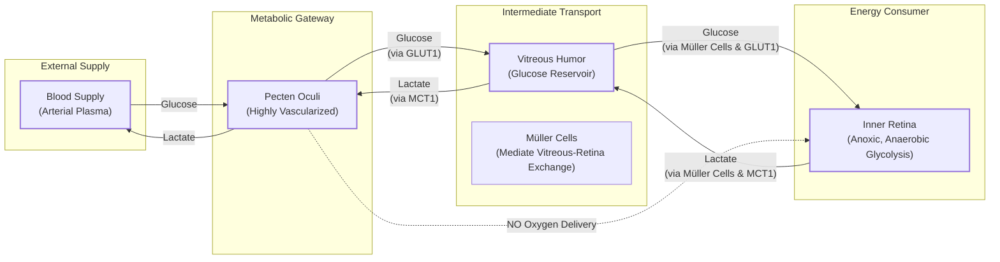
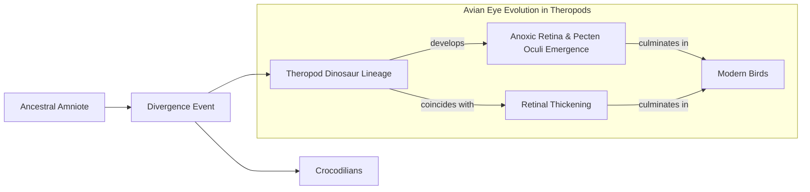

# How Birds See Without Oxygen: A Lesson in Evolutionary Tinkering

In humans, a blockage in the retinal artery is a medical emergency that causes irreversible vision loss within minutes. Yet, birds of prey, like a hawk spotting a mouse from hundreds of feet in the air, possess some of the sharpest vision in the animal kingdom, all while having retinas completely devoid of blood vessels. This superiority is reflected in raw cellular density: while humans have about 200,000 photoreceptors per square millimeter, a common buzzard has 1,000,000 [[18]](https://en.wikipedia.org/wiki/Bird_vision). This presents a profound biological puzzle. The retina is one of the most energy-hungry tissues in the body, consuming oxygen and glucose at rates two to three times higher than the brain itself. Without a direct blood supply, how can it possibly function, let alone outperform our own vascularized eyes?

For centuries, this avascular paradox has stumped scientists. The prevailing assumption was that birds must have some undiscovered mechanism for acquiring oxygen. As evolutionary physiologist Christian Damsgaard of Aarhus University notes, “According to everything we know about physiology, this tissue should not be able to function” [[1]](https://www.nature.com/articles/s41586-025-09978-w).

A groundbreaking 2026 study in *Nature* finally provides the answer, and it’s not what anyone expected. Birds didn’t evolve a new way to deliver oxygen; their retinas evolved to live without it. The inner half of the bird retina exists in a permanent state of oxygen deprivation, or anoxia, sustained by a less efficient but effective process called anaerobic glycolysis [[1]](https://www.nature.com/articles/s41586-025-09978-w). This discovery reveals an evolutionary extreme of metabolic survival, offering a new perspective on tissue resilience that could have significant implications for human conditions like stroke and ischemic diseases.

<https://www.quantamagazine.org/wp-content/uploads/2026/05/ChristianDamsgaard-crJesperEkmann-scaled.webp>
Image 1: The evolutionary physiologist Christian Damsgaard measured gas exchange in bird eyes with microsensors. Surprisingly, the inner retina, a highly active tissue, used no oxygen. (Image by Jesper Ekmann from [Quanta Magazine](https://www.quantamagazine.org/how-the-bird-eye-was-pushed-to-an-evolutionary-extreme-20260513))

Before we can appreciate how birds solved this paradox, we need to revisit how oxygen came to dominate complex life and why its absence is normally catastrophic.

## Oxygenated Life: The Great Oxidation Event and Metabolic Trade-offs

Life on Earth spent its first two billion years in an anaerobic world. Then, around 2.4 billion years ago, cyanobacteria began pumping vast quantities of oxygen into the atmosphere through photosynthesis, triggering the Great Oxidation Event. This fundamentally reshaped our planet’s chemistry and unlocked a far more efficient way to produce energy. Anaerobic glycolysis, the ancient pathway for breaking down glucose, yields a meager two molecules of ATP. In contrast, aerobic respiration, which uses oxygen, can generate up to 32 ATP from a single glucose molecule [[1]](https://www.nature.com/articles/s41586-025-09978-w), [[12]](https://www.thetransmitter.org/vision/inner-retina-of-birds-powers-sight-sans-oxygen).

<https://www.quantamagazine.org/wp-content/uploads/2026/05/BirdFlying-crJean-PaulWettstein-scaled.webp>
Image 2: Birds, such as this alpine chough (in the crow family), use their exceptional vision to hunt, forage, and migrate. (Image by Jean-Paul Wettstein from [Quanta Magazine](https://www.quantamagazine.org/how-the-bird-eye-was-pushed-to-an-evolutionary-extreme-20260513))

This massive energetic advantage allowed oxygen-using organisms to outcompete nearly everything else, driving the evolution of complex, multicellular life. As molecular physiologist Gary Lewin of the Max Delbrück Center in Berlin puts it, “We’ve been hooked on 20% [atmospheric] oxygen for millions of years” [[13]](https://www.science.org/doi/10.1126/science.aab3896). This dependence, however, came with a critical vulnerability. For most vertebrates, the absence of oxygen is catastrophic. Humans suffer irreversible brain damage within minutes. Neural tissues, with their high metabolic rates, are particularly susceptible.

The human retina is a prime example of this vulnerability. It relies on a dual vascular network: the choroid supplies the outer layers (including photoreceptors), while branches of the central retinal artery supply the inner layers where signals are processed. This inner retinal vasculature is essential, and its failure, as in a stroke, characteristically injures the inner retina far more than the outer layers, which have a separate supply [[19]](https://www.mdpi.com/1422-0067/22/7/3689). This standard vertebrate design highlights just how radical the avian solution is.

Still, some species have evolved remarkable anoxia tolerance. The naked mole-rat, living in crowded, low-oxygen burrows, can survive for 18 minutes without any oxygen by switching to a fructose-based metabolic pathway [[13]](https://www.science.org/doi/10.1126/science.aab3896). Certain freshwater turtles can endure months submerged in icy, anoxic water by dramatically suppressing their metabolism. These are exceptions that prove the rule: for most vertebrates, and especially for their neural tissues, a constant supply of oxygen is non-negotiable.

<https://www.quantamagazine.org/wp-content/uploads/2026/05/NakedMoleRats-crJavierAbalos-scaled.webp>
Image 3: Naked mole rats can survive without oxygen for 18 minutes. To generate energy without oxygen, they use anaerobic glycolysis fueled by fructose. (Image by Javier Ábalos from [Quanta Magazine](https://www.quantamagazine.org/how-the-bird-eye-was-pushed-to-an-evolutionary-extreme-20260513))

With this metabolic context established, we can now examine the mysterious vascular structure that enables birds to push the vertebrate eye to an extreme never seen in other lineages.

## A Mysterious Structure: The Pecten Oculi and Chronic Anoxia

Protruding into the vitreous humor of the bird eye is a strange, comb-like structure called the pecten oculi. First described in the 17th century, its function has been a subject of speculation for hundreds of years, generating over 30 different hypotheses [[1]](https://www.nature.com/articles/s41586-025-09978-w), [[14]](https://www.sdu.dk/en/om-sdu/fakulteterne/naturvidenskab/nyheder-2026/bird-retina). The most dominant theory was that this highly vascularized organ must be the secret to the retina's oxygen supply. Damsgaard, having spent years studying gas exchange in animals, found this puzzle irresistible. “The retina is a tissue made up of nerve cells that consume a lot of energy,” he explains. “It is, so to speak, a highly specialised extension of the brain” [[15]](https://uol.de/en/news/article/birds-retinas-function-without-oxygen).

<https://www.quantamagazine.org/wp-content/uploads/2026/05/Bird_Retina-Fig1-crMarkBelan_Desktopv1.svg>
Image 4: A diagram illustrating the structure of the bird eye, including the pecten oculi and the different layers of the retina. (Source: Mark Belan/ [Quanta Magazine](https://www.quantamagazine.org/how-the-bird-eye-was-pushed-to-an-evolutionary-extreme-20260513))

To test the long-held assumption, Damsgaard’s team performed a technically demanding experiment: they inserted microsensors into the eyes of anesthetized zebra finches, pigeons, and chickens to directly measure oxygen levels [[11]](https://www.quantamagazine.org/how-the-bird-eye-was-pushed-to-an-evolutionary-extreme-20260513). The results were definitive and shocking. Oxygen was present in the outer retina, supplied by the choroid at the back of the eye, but it was rapidly consumed by the photoreceptors. Deeper inside, the oxygen levels dropped to zero. “Half of the retina lives in a chronic state of anoxia, where there’s no oxygen present at all,” Damsgaard said [[11]](https://www.quantamagazine.org/how-the-bird-eye-was-pushed-to-an-evolutionary-extreme-20260513). The pecten oculi was not delivering oxygen to the inner retina.

To understand how the tissue survived, the researchers used spatial transcriptomics to map gene activity. The results revealed a stark metabolic divide. Genes for aerobic respiration were active only in the oxygenated outer retina. In the anoxic inner retina, only genes for anaerobic glycolysis were expressed [[1]](https://www.nature.com/articles/s41586-025-09978-w). This less efficient process demands a huge amount of fuel. Indeed, further tests using radiolabeled glucose showed that the bird retina takes up sugar at a rate 2.5 times higher than the rest of the brain [[1]](https://www.nature.com/articles/s41586-025-09978-w), [[16]](https://www.quantamagazine.org/how-the-bird-eye-was-pushed-to-an-evolutionary-extreme-20260513).

This led the team back to the pecten. Their data showed high expression of genes for glucose and lactate transporters in the structure. The pecten’s true function was revealed: it acts as a metabolic gateway, pumping massive amounts of glucose into the eye and removing lactate, the toxic waste product of anaerobic glycolysis [[1]](https://www.nature.com/articles/s41586-025-09978-w), [[15]](https://uol.de/en/news/article/birds-retinas-function-without-oxygen). This constant fueling and waste removal allows the inner retina to function indefinitely without oxygen. As senior author Jens Randel Nyengaard summarized, “The pecten is not an oxygen supplier. It is a transport system for fuel in and waste out” [[7]](https://www.genengnews.com/topics/translational-medicine/how-bird-retinas-function-without-oxygen-may-inform-future-stroke-therapies). Thomas Baden, a neuroscientist at the University of Sussex, called the finding surprising: “The insight that the retina basically goes oxygen-free, at least in some layers, is surprising... It really gets properly down to zero” [[4]](https://www.quantamagazine.org/how-the-bird-eye-was-pushed-to-an-evolutionary-extreme-20260513).

Image 5: Mermaid diagram illustrating the metabolic support provided by the pecten oculi to the avian inner retina.

This strategy is reminiscent of the Warburg effect, where cancer cells favor glycolysis even when oxygen is present, or the temporary anaerobic respiration our muscles use during intense exercise. However, what is happening in the bird retina is unprecedented: it is a permanent, healthy, and lifelong adaptation to anoxia in a vertebrate neural tissue [[4]](https://www.quantamagazine.org/how-the-bird-eye-was-pushed-to-an-evolutionary-extreme-20260513).

Having established how the avian retina operates, we can now trace when and why this radical solution evolved and what it teaches us about selective pressures and future applications.

## Eyes Like a Hawk: Evolutionary Origins, Selective Pressures, and Implications

The bird’s retina and its no-oxygen power system are so unusual that they naturally raise questions about how they could have evolved. Evolution, as biologist François Jacob described in 1977, often works not like an engineer with a blueprint, but like a tinkerer, repurposing existing parts for new functions [[17]](https://www.science.org/doi/10.1126/science.860134). This appears to be exactly what happened with the avian eye. Instead of inventing a new oxygen-delivery system, evolution repurposed the ancient vertebrate eye blueprint to function without it.

<https://www.quantamagazine.org/wp-content/uploads/2026/05/BirdEyeGrid-scaled.webp>
Image 6: The diversity of bird eyes, lacking blood vessels (left to right). Top: Northern gannet, Eurasian eagle-owl, maguari stork. Center: rooster, rockhopper penguin, parrot (species unknown). Bottom: bald eagle, blue-and-yellow macaw, unknown species. (Source: (Left to right) Top: Chris Hellier, Jiří Dočkal, Annette Lozinski. Center: Mohammed Brzan, Nico Marín, Shyamli Kashyap. Bottom: Ingo Doerrie, David Clode, Hasan Almasi from [Quanta Magazine](https://www.quantamagazine.org/how-the-bird-eye-was-pushed-to-an-evolutionary-extreme-20260513))

Phylogenetic analysis pinpoints when this change occurred. By comparing the avian retina to those of reptiles like Chinese pond turtles and broad-snouted caimans—which have normal oxygen levels—the researchers concluded that the adaptation arose in the theropod dinosaur lineage, the ancestors of modern birds, after they split from crocodilians [[4]](https://www.quantamagazine.org/how-the-bird-eye-was-pushed-to-an-evolutionary-extreme-20260513). This evolutionary shift coincided with a measurable thickening of the retina, allowing for more densely packed neurons [[1]](https://www.nature.com/articles/s41586-025-09978-w).

The selective pressure driving this change was likely the intense demand for high-acuity vision. For predators, foragers, and long-distance migrants, sharp vision is critical for survival. The visual acuity gains are quantifiable: while a hummingbird resolves 4.6 cycles per degree (cpd), a wedge-tailed eagle can resolve up to 143 cpd, one of the highest in the animal kingdom [[20]](https://pmc.ncbi.nlm.nih.gov/articles/PMC10906485). However, blood vessels within the retina scatter light, which degrades visual resolution.

By eliminating these vessels, evolution cleared a path for superior optics. As Damsgaard explains, this “allowed the retina to become thicker and more cell-dense without needing internal vessels, which in combination leads to better visual acuity” [[5]](https://www.thetransmitter.org/vision/inner-retina-of-birds-powers-sight-sans-oxygen). The trade-off was a severe oxygen diffusion limit, a problem solved by anoxia tolerance. This trait likely served as an exaptation, a feature that evolved for one purpose but was later co-opted for another: maintaining retinal function during high-altitude migrations where oxygen is scarce [[1]](https://www.nature.com/articles/s41586-025-09978-w).

While the evidence is compelling, some researchers caution that the model remains a powerful hypothesis that invites further investigation. Michael Berenbrink of the University of Liverpool notes that future studies should quantify the energy provided by this pathway and clarify the role of the pecten in CO₂ removal, as anaerobic glycolysis itself does not produce CO₂ [[5]](https://www.thetransmitter.org/vision/inner-retina-of-birds-powers-sight-sans-oxygen). These open questions highlight the ongoing work to fully map this unique metabolic strategy.

Image 7: Evolutionary timeline of the avian anoxic retina and pecten oculi, showing divergence from crocodilians and key developments within the theropod lineage.

This evolutionary story has a significant biomedical payoff. Conditions like stroke and ischemic retinal diseases are caused by reduced oxygen delivery and the buildup of metabolic waste. “In the bird retina, we see a system that copes with oxygen deprivation in a very different way,” says Jens Randel Nyengaard, a senior author on the study [[15]](https://uol.de/en/news/article/birds-retinas-function-without-oxygen). Understanding how birds maintain a healthy, high-functioning neural tissue in the complete absence of oxygen could inspire new strategies to protect human tissues from hypoxic damage. As Damsgaard concludes, this research highlights how studying nature’s extremes can provide unexpected solutions to long-standing medical challenges, reminding us that millions of years of evolution have produced biological innovations we are only just beginning to understand [[14]](https://www.sdu.dk/en/om-sdu/fakulteterne/naturvidenskab/nyheder-2026/bird-retina).

## Conclusion

We have explored the resolution to a centuries-old biological paradox: how birds sustain one of the most metabolically active tissues in their bodies without a direct blood supply. The answer lies not in a novel oxygen-delivery system, but in a radical adaptation to permanent anoxia. The inner avian retina thrives without oxygen by relying on anaerobic glycolysis, a feat made possible by the pecten oculi, which functions as a dedicated gateway for nutrient supply and waste removal.

This remarkable case of evolutionary tinkering, where an ancient structure was repurposed to support an unprecedented physiological state, underscores a fundamental principle of biology. It demonstrates how selective pressures can drive organisms to physiological extremes, revealing metabolic strategies that challenge our understanding of what is possible. Beyond its significance for evolutionary biology, the discovery offers a natural model for tissue resilience, providing potential inspiration for new therapies to combat human diseases caused by oxygen deprivation.

## References

- [1] [https://www.nature.com/articles/s41586-025-09978-w](https://www.nature.com/articles/s41586-025-09978-w)
- [2] [https://www.eurekalert.org/news-releases/1113036](https://www.eurekalert.org/news-releases/1113036)
- [3] [https://www.sdu.dk/en/om-sdu/fakulteterne/naturvidenskab/nyheder-2026/bird-retina](https://www.sdu.dk/en/om-sdu/fakulteterne/naturvidenskab/nyheder-2026/bird-retina)
- [4] [https://www.quantamagazine.org/how-the-bird-eye-was-pushed-to-an-evolutionary-extreme-20260513](https://www.quantamagazine.org/how-the-bird-eye-was-pushed-to-an-evolutionary-extreme-20260513)
- [5] [https://www.thetransmitter.org/vision/inner-retina-of-birds-powers-sight-sans-oxygen](https://www.thetransmitter.org/vision/inner-retina-of-birds-powers-sight-sans-oxygen)
- [6] [https://bio.au.dk/en/about-biology/news-and-events/show/artikel/fugles-nethinder-lever-uden-ilt-aarhundredgammelt-biologisk-mysterium-er-opklaret](https://bio.au.dk/en/about-biology/news-and-events/show/artikel/fugles-nethinder-lever-uden-ilt-aarhundredgammelt-biologisk-mysterium-er-opklaret)
- [7] [https://www.genengnews.com/topics/translational-medicine/how-bird-retinas-function-without-oxygen-may-inform-future-stroke-therapies](https://www.genengnews.com/topics/translational-medicine/how-bird-retinas-function-without-oxygen-may-inform-future-stroke-therapies)
- [8] [https://www.eyefox.com/news/2724/sight-without-oxygen-secret-of-the-bird-retina-unraveled](https://www.eyefox.com/news/2724/sight-without-oxygen-secret-of-the-bird-retina-unraveled)
- [9] [https://www.science.org/doi/10.1126/science.860134](https://www.science.org/doi/10.1126/science.860134)
- [10] [https://www.doi.org/10.1371/journal.pone.0008992](https://www.doi.org/10.1371/journal.pone.0008992)
- [11] [https://www.quantamagazine.org/how-the-bird-eye-was-pushed-to-an-evolutionary-extreme-20260513](https://www.quantamagazine.org/how-the-bird-eye-was-pushed-to-an-evolutionary-extreme-20260513)
- [12] [https://www.thetransmitter.org/vision/inner-retina-of-birds-powers-sight-sans-oxygen](https://www.thetransmitter.org/vision/inner-retina-of-birds-powers-sight-sans-oxygen)
- [13] [https://www.science.org/doi/10.1126/science.aab3896](https://www.science.org/doi/10.1126/science.aab3896)
- [14] [https://www.sdu.dk/en/om-sdu/fakulteterne/naturvidenskab/nyheder-2026/bird-retina](https://www.sdu.dk/en/om-sdu/fakulteterne/naturvidenskab/nyheder-2026/bird-retina)
- [15] [https://uol.de/en/news/article/birds-retinas-function-without-oxygen](https://uol.de/en/news/article/birds-retinas-function-without-oxygen)
- [16] [https://www.quantamagazine.org/how-the-bird-eye-was-pushed-to-an-evolutionary-extreme-20260513](https://www.quantamagazine.org/how-the-bird-eye-was-pushed-to-an-evolutionary-extreme-20260513)
- [17] [https://www.science.org/doi/10.1126/science.860134](https://www.science.org/doi/10.1126/science.860134)
- [18] [https://en.wikipedia.org/wiki/Bird_vision](https://en.wikipedia.org/wiki/Bird_vision)
- [19] [https://www.mdpi.com/1422-0067/22/7/3689](https://www.mdpi.com/1422-0067/22/7/3689)
- [20] [https://pmc.ncbi.nlm.nih.gov/articles/PMC10906485](https://pmc.ncbi.nlm.nih.gov/articles/PMC10906485)