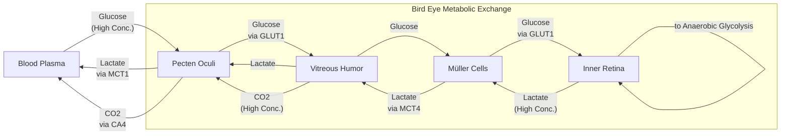
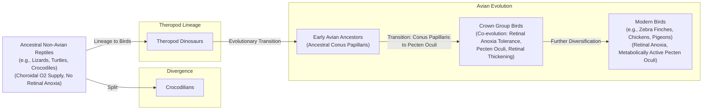

# Sight Without Oxygen: How Birds Solved a Centuries-Old Biological Paradox

In humans, a blocked retinal artery is a medical emergency. Deprived of oxygen, the delicate neural tissue of the retina begins to die within minutes, leading to irreversible vision loss. Yet, birds of prey, such as a hawk that can spot a mouse from hundreds of feet in the air, operate with retinas that are almost entirely avascular. They have no blood vessels at all. This presents a fundamental paradox. The retina is one of the most energy-hungry tissues in the animal kingdom, consuming more energy than any other tissue in the body and using oxygen and glucose at two to three times the rate of the brain. For centuries, scientists assumed birds must have some undiscovered mechanism for acquiring oxygen, because survival without it seemed impossible.

The puzzle has persisted since the 1600s, generating over 30 different theories. Christian Damsgaard, an evolutionary physiologist at Aarhus University, captured the long-standing confusion perfectly: “According to everything we know about physiology, this tissue should not be able to function.” The long-held assumption was that a mysterious, comb-like structure in the bird eye, the pecten oculi, must be supplying the missing oxygen. However, a recent landmark study has overturned centuries of thinking. Direct measurements revealed that the inner half of the bird retina exists in a permanent state of anoxia, or total oxygen deprivation. Birds do not have a secret oxygen delivery system. Instead, their retinas have evolved to function entirely without it, relying on a less efficient process called anaerobic glycolysis.

https://www.quantamagazine.org/wp-content/uploads/2026/05/ChristianDamsgaard-crJesperEkmann-scaled.webp 
Image 1: <small><em>The evolutionary physiologist Christian Damsgaard measured gas exchange in bird eyes with microsensors. Surprisingly, the inner retina, a highly active tissue, used no oxygen. - Jesper Ekmann</em></small>

This discovery pushes our understanding of metabolic extremes in living tissue. It also has direct relevance for treating human conditions like stroke and ischemic retinal disease, where oxygen deprivation causes catastrophic damage. To appreciate how birds solved this paradox, you first need to revisit how oxygen came to dominate complex life and why its absence is normally so destructive [[3], [4]].

## Oxygenated Life: The Great Oxidation Event and Metabolic Trade-offs

Around 3.4 billion years ago, cyanobacteria developed photosynthesis, a process that released enormous quantities of oxygen into the atmosphere. This Great Oxidation Event permanently altered Earth’s chemistry and the course of evolution. Oxygen made cellular energy production incredibly efficient. While anaerobic glycolysis, the breakdown of glucose without oxygen, yields a mere two molecules of ATP—life’s energy currency—aerobic respiration can produce up to 32. This fifteen-fold increase in energy efficiency was a transformative advantage that led to a mass extinction, as organisms using oxygen outcompeted nearly everyone else [[2]].

https://www.quantamagazine.org/wp-content/uploads/2026/05/BirdFlying-crJean-PaulWettstein-scaled.webp 
Image 2: <small><em>Birds, such as this alpine chough (in the crow family), use their exceptional vision to hunt, forage, and migrate. - Jean-Paul Wettstein</em></small>

Evolution quickly selected for organisms that could harness this new power source. As molecular physiologist Gary Lewin puts it, “We’ve been hooked on 20% [atmospheric] oxygen for millions of years.” This dependence means that for most complex animals, a constant oxygen supply is non-negotiable. Without it, energy-intensive tissues like the brain and retina shut down, as their complex processes cannot be sustained by the meager energy yield of anaerobic metabolism [[2]].

The tolerance for anoxia varies across the animal kingdom. Humans suffer irreversible brain damage after just a few minutes without oxygen. The naked mole-rat, a subterranean rodent living in hypoxic burrows, can survive for 18 minutes by switching to a fructose-based anaerobic metabolism that bypasses key regulatory blocks in standard glycolysis. At the far end of the spectrum, some freshwater turtles can survive for months, or even a year or two, at the bottom of frozen, oxygen-depleted lakes. For most vertebrates, however, the brain and retina are exquisitely sensitive to oxygen loss. This is what makes the bird retina so extraordinary. It is not just temporarily surviving anoxia, but thriving in it for a lifetime [[2], [9]].

With this metabolic context established, you can now examine the unique structure that allows birds to push the vertebrate eye to an evolutionary extreme never seen in other lineages.

## A Mysterious Structure: The Pecten Oculi and Chronic Anoxia

For centuries, the primary suspect for the bird retina's mysterious energy supply was the pecten oculi. First described in the 17th century, this peculiar, radiator-like organ is rich with blood vessels and protrudes into the vitreous humor of the eye. Its large surface area led to over 30 different hypotheses about its function, with most centered on oxygen delivery. But as Damsgaard notes, “Nobody had really done direct physiological measurements on this structure. That’s where we came in” [[2], [3]].

https://www.quantamagazine.org/wp-content/uploads/2026/05/Bird_Retina-Fig1-crMarkBelan_Desktopv1.svg 
Image 3: <small><em>Mark Belan/ _Quanta Magazine_</em></small>

Performing such measurements was technically extremely challenging, requiring the animal to be kept under stable physiological conditions during the delicate procedure. Using microsensors, Damsgaard’s team did what no one had done before. They measured oxygen levels directly inside the eyes of living birds, including zebra finches, pigeons, and chickens. The results were stunning. While the outer retina, near the oxygen-rich choroid, had oxygen, the inner retina was completely anoxic. There was no oxygen present at all. Damsgaard found this “striking,” concluding that “half of the retina lives in a chronic state of anoxia.” The pecten was not delivering oxygen [[1], [2]].

So, how does the inner retina produce energy? The team turned to spatial transcriptomics, a technique that maps gene activity within tissues. They found a clear metabolic divide. Genes for aerobic respiration (oxidative phosphorylation) were active only in the oxygenated outer retina. In the anoxic inner retina, only genes for anaerobic glycolysis were highly expressed. This less efficient process requires a massive amount of fuel. Further experiments using radiolabeled glucose confirmed that the bird retina’s glucose uptake was 2.5 times higher than other parts of the bird brain [[1], [5]].

This led the researchers back to the pecten. Their transcriptomics data revealed it was packed with genes for glucose transporters (GLUT1), lactate transporters (MCT1), and carbonic anhydrase (CA4). The pecten was not an oxygen supplier; it was a metabolic gateway. It functions as a high-capacity pump, flooding the retina with glucose to fuel anaerobic glycolysis and, just as importantly, removing the toxic byproduct, lactic acid, and excess CO2. Specialized glial cells known as Müller cells, which have end-feet at the retinal surface, appear to mediate this exchange, using their own GLUT1 and MCT1 transporters to shuttle metabolites between the vitreous humor and the retinal neurons [[1], [6], [7]].

Image 4: A detailed flowchart illustrating the metabolic exchange in the bird eye, focusing on the pecten oculi and Müller cells, showing the flow of glucose, lactate, and CO2, along with relevant transporters and concentration gradients.

https://www.quantamagazine.org/wp-content/uploads/2026/05/NakedMoleRats-crJavierAbalos-scaled.webp 
Image 5: <small><em>Naked mole rats can survive without oxygen for 18 minutes. To generate energy without oxygen, they use anaerobic glycolysis fueled by fructose. - Javier Ábalos</em></small>

This finding provides compelling evidence that the bird's inner retina survives in a permanent state of healthy anoxia. Thomas Baden, a neuroscientist at the University of Sussex, called the insight "surprising," noting that the oxygen level "really gets properly down to zero." This metabolic strategy is similar to the Warburg effect seen in cancer cells or the temporary state in our muscles during intense exercise. However, until this discovery, no vertebrate tissue was known to survive in completely anoxic conditions for its entire lifetime [[2]].

Having established how the avian retina operates, you can now trace when and why this radical solution evolved and what it teaches us about selective pressures and future applications.

## Eyes Like a Hawk: Evolutionary Origins, Selective Pressures, and Implications

The bird’s retina and its oxygen-free power system are so unusual that they raise deep questions about their evolutionary origins. Evolution does not invent complex systems from scratch. As biologist François Jacob argued in his 1977 essay, evolution acts more like a tinkerer than an engineer, repurposing existing parts for new functions. An engineer works from a preconceived plan with specialized tools, but a tinkerer uses "whatever he finds around him whether it be pieces of string, fragments of wood, or old cardboards." Instead of designing a novel oxygen-delivery system, evolution tinkered with the vertebrate eye blueprint, pushing it to a new extreme [[2], [10]].

By comparing the retinas of birds to their relatives—turtles, lizards, and caimans—researchers pinpointed when this adaptation likely arose. The reptile retinas showed normal oxygen levels and no signs of anaerobic glycolysis. This suggests the oxygen-free retina evolved sometime in the dinosaur era, within the theropod lineage that leads to modern birds, after it had split from crocodiles. This transition coincided with a noticeable thickening of the retina, a feature that would have made oxygen diffusion from the choroid even more challenging. The reptilian precursor to the pecten, the conus papillaris, likely served as the structural foundation that was later repurposed for its new metabolic role in birds [[1], [2]].

Image 6: Evolutionary timeline of retinal anoxia tolerance and pecten oculi in birds.

What drove this change? The leading hypothesis is intense selective pressure for exceptional vision. Birds use their sight for everything from hunting and foraging to navigating during long-distance migrations. Blood vessels, however, scatter light, which degrades visual acuity. By eliminating vessels from the retina, birds could pack photoreceptors and neurons more densely, achieving higher resolution. The avascular design, supported by the metabolic functions of the pecten, was an elegant solution to this optical-respiratory compromise. Damsgaard speculates that the system first evolved in theropod dinosaurs for "tracking prey and identifying mates" and was later co-opted, or became an exaptation, for maintaining vision during high-altitude flights where oxygen is scarce [[1], [2], [11]].

https://www.quantamagazine.org/wp-content/uploads/2026/05/BirdEyeGrid-scaled.webp 
Image 7: <small><em>The diversity of bird eyes, lacking blood vessels (left to right). Top: Northern gannet, Eurasian eagle-owl, maguari stork. Center: rooster, rockhopper penguin, parrot (species unknown). Bottom: bald eagle, blue-and-yellow macaw, unknown species.

(Left to right) Top: Chris Hellier, Jiří Dočkal, Annette Lozinski. Center: Mohammed Brzan, Nico Marín, Shyamli Kashyap. Bottom: Ingo Doerrie, David Clode, Hasan Almasi</em></small>

While this is a compelling narrative, researchers are cautious about overextending the interpretation to all birds, as migratory species have not yet been studied in this context. It remains an open question whether the vessel-free retina is a direct adaptation for sharp vision or an evolutionary coincidence that proved useful later. Regardless of its origin, the discovery has significant biomedical implications. In conditions like stroke, human tissues are damaged not just by the lack of oxygen but also by the buildup of metabolic waste. The bird retina offers a natural model of a system that has solved both problems. By studying how birds and other anoxia-tolerant animals like the naked mole-rat cope with oxygen deprivation, scientists can gain new insights into how to protect human tissues from similar damage. As Damsgaard suggests, “Maybe we can get inspiration for how nature solved these problems by millions of years of natural selection. There’s so much to be learned from these animals that are able to do something that we cannot do” [[2], [3], [4], [5]].

## Conclusion

The resolution of the avascular retina paradox is a powerful example of how evolution works under constraint. It reveals that the bird retina, one of the most metabolically active tissues known, thrives without oxygen by relying on anaerobic glycolysis. This feat is made possible by the pecten oculi, a structure repurposed from a simple vascular extension into a sophisticated metabolic engine that supplies glucose and removes waste.

This discovery not only rewrites a chapter in vertebrate physiology but also opens new avenues for medical research. Understanding the molecular machinery that protects the bird retina from the damaging effects of anoxia could inspire novel therapies for human diseases rooted in oxygen deprivation, such as stroke and ischemic retinopathies. It reminds us that nature has already run countless experiments, and by studying its most extreme solutions, we can find inspiration for solving our own biological challenges.

## References

- [1] Damsgaard, C., et al. (2026). Oxygen-free metabolism in the bird inner retina supported by the pecten. *Nature*. https://doi.org/10.1038/s41586-025-09978-w
- [2] Saplakoglu, Y. (2026, May 13). How the Bird Eye Was Pushed to an Evolutionary Extreme. *Quanta Magazine*. https://www.quantamagazine.org/how-the-bird-eye-was-pushed-to-an-evolutionary-extreme-20260513
- [3] EurekAlert!. (2026, January 21). *Bird retinas function without oxygen – solving a centuries-old biological mystery*. https://www.eurekalert.org/news-releases/1113036
- [4] SDU. (2026, January 22). *Bird retinas work without oxygen – solving an old biological puzzle*. https://www.sdu.dk/en/om-sdu/fakulteterne/naturvidenskab/nyheder-2026/bird-retina
- [5] GEN. (2026, January 22). *How Bird Retinas Function Without Oxygen May Inform Future Stroke Therapies*. https://www.genengnews.com/topics/translational-medicine/how-bird-retinas-function-without-oxygen-may-inform-future-stroke-therapies
- [6] The Transmitter. (2026, February 18). *Inner retina of birds powers sight sans oxygen*. https://www.thetransmitter.org/vision/inner-retina-of-birds-powers-sight-sans-oxygen
- [7] University of Oldenburg. (2026, January 21). *Birds' retinas function without oxygen*. https://uol.de/en/news/article/birds-retinas-function-without-oxygen
- [8] Aarhus University. (2026, January 22). *Fugles nethinder lever uden ilt: århundredgammelt biologisk mysterium er opklaret*. https://bio.au.dk/en/about-biology/news-and-events/show/artikel/fugles-nethinder-lever-uden-ilt-aarhundredgammelt-biologisk-mysterium-er-opklaret
- [9] Park, T. J., et al. (2017). Fructose-driven glycolysis supports anoxia resistance in the naked mole-rat. *Science*, 356(6335), 307-311. https://doi.org/10.1126/science.aab3896
- [10] Jacob, F. (1977). Evolution and Tinkering. *Science*, 196(4295), 1161-1166. https://doi.org/10.1126/science.860134
- [11] Kram, Y. A., Mantey, S., & Corbo, J. C. (2010). Avian Cone Photoreceptors Tile the Retina as Five Independent, Self-Organizing Mosaics. *PLOS ONE*, 5(2), e8992. https://doi.org/10.1371/journal.pone.0008992
- [12] Kafetzis, G., et al. (2025). Evolution of the vertebrate retina by repurposing of a composite ancestral median eye. *Current Biology*. https://doi.org/10.1016/j.cub.2025.12.028
- [13] EyeFox. (2026, January 23). *Sight without oxygen: Secret of the bird retina unraveled*. https://www.eyefox.com/news/2724/sight-without-oxygen-secret-of-the-bird-retina-unraveled