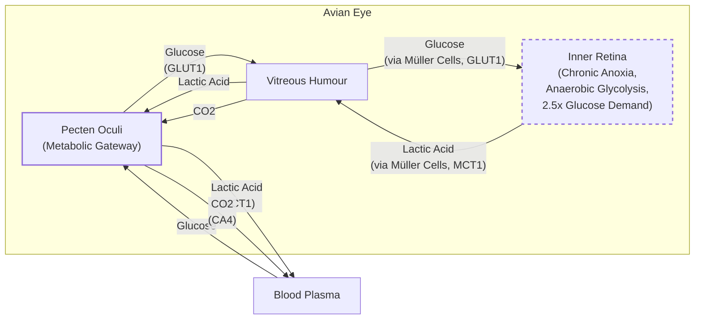

# The Avascular Retina Paradox

In human medicine, a retinal vascular occlusion is a critical emergency. When blood flow to the eye’s light-sensing tissue is blocked, vision is rapidly and often permanently destroyed. Yet, birds, renowned for their extraordinary eyesight, operate with completely avascular retinas. A hawk can spot a mouse from hundreds of feet in the air, a feat of visual acuity that seems to defy a fundamental biological rule. This is the avascular retina paradox, a puzzle that has intrigued scientists for centuries.

The retina is one of the most energy-hungry tissues in the body, consuming oxygen and glucose at two to three times the rate of the brain [[21]](https://www.nature.com/articles/s41586-025-09978-w). This is a much higher metabolic cost than other neural tissues we have discussed in our engineering explorations. Without a direct blood supply, how could such a metabolically demanding organ function? For centuries, the prevailing assumption was that birds must have some unknown, highly efficient mechanism for acquiring oxygen. As evolutionary physiologist Christian Damsgaard notes, "According to everything we know about physiology, this tissue should not be able to function" [[21]](https://www.nature.com/articles/s41586-025-09978-w).
Image 1: The evolutionary physiologist Christian Damsgaard measured gas exchange in bird eyes with microsensors. Surprisingly, the inner retina, a highly active tissue, used no oxygen. (Image by Jesper Ekmann from [Quanta Magazine](https://www.quantamagazine.org/how-the-bird-eye-was-pushed-to-an-evolutionary-extreme-20260513))

Recent research has finally resolved this long-standing paradox. The answer is not a novel oxygen-delivery system, but a radical metabolic adaptation. The inner layers of the bird retina exist in a permanent state of oxygen deprivation, or chronic anoxia. They have evolved to not just tolerate but thrive without oxygen, relying entirely on anaerobic glycolysis for energy [[21]](https://www.nature.com/articles/s41586-025-09978-w).

This discovery reveals an evolutionary extreme in vertebrate physiology. It shows how evolution solves hard problems by repurposing ancient systems in unexpected ways, with potential applications for human conditions involving oxygen deprivation, such as stroke and ischemic diseases. Before we can appreciate how birds solved this paradox, we need to revisit how oxygen came to dominate complex life and why its absence is normally catastrophic.

## Oxygenated Life: The Great Oxidation Event and Metabolic Trade-offs

Life on Earth operated without significant oxygen for billions of years. That changed with the Great Oxidation Event, when cyanobacteria began releasing vast quantities of oxygen into the atmosphere through photosynthesis. This event fundamentally reshaped our planet's chemistry and unlocked a far more efficient way to produce energy. While the ancient pathway of anaerobic glycolysis yields a mere 2 adenosine triphosphate (ATP) molecules per molecule of glucose, aerobic respiration can generate up to 32 ATP [[20]](https://www.science.org/doi/10.1126/science.aab3896). This enormous energetic advantage allowed for the evolution of complex, multicellular organisms and locked most of them into a deep dependency on oxygen.
Image 2: Birds, such as this alpine chough (in the crow family), use their exceptional vision to hunt, forage, and migrate. (Image by Jean-Paul Wettstein from [Quanta Magazine](https://www.quantamagazine.org/how-the-bird-eye-was-pushed-to-an-evolutionary-extreme-20260513))

As molecular physiologist Gary Lewin puts it, "We’ve been hooked on 20% [atmospheric] oxygen for millions of years” [[16]](https://www.quantamagazine.org/how-the-bird-eye-was-pushed-to-an-evolutionary-extreme-20260513). This dependency is most acute in neural tissues. The human brain, for example, suffers irreversible damage within minutes of oxygen deprivation. Even in a healthy, vascularized vertebrate retina, metabolism is more complex than simple aerobic respiration. The inner retina, for instance, converts only about 20% of its glucose supply to lactate, relying on a mix of aerobic and anaerobic pathways [[26]](https://www.mdpi.com/1422-0067/22/7/3689). This metabolic flexibility provides a baseline that makes the bird's complete reliance on anaerobic glycolysis all the more extreme.

Other species show a wider range of tolerance. The naked mole-rat, living in hypoxic underground burrows, can survive for 18 minutes without oxygen by switching to a fructose-based anaerobic metabolism [[20]](https://www.science.org/doi/10.1126/science.aab3896). Some turtles can endure years of anoxia by drastically suppressing their metabolism. For most vertebrates, however, including humans, the high energy demands of the brain and retina mean that any interruption in oxygen supply is devastating.
Image 3: Naked mole rats can survive without oxygen for 18 minutes. To generate energy without oxygen, they use anaerobic glycolysis fueled by fructose. (Image by Javier Ábalos from [Quanta Magazine](https://www.quantamagazine.org/how-the-bird-eye-was-pushed-to-an-evolutionary-extreme-20260513))

With this metabolic context established, we can now examine the mysterious vascular structure that enables birds to push the vertebrate eye to an extreme never seen in other lineages.

## A Mysterious Structure: The Pecten Oculi and Chronic Anoxia

At the heart of the avian eye is the pecten oculi, a comb-like, highly vascularized structure that protrudes into the vitreous humor. First described in the 17th century, its function has been the subject of speculation for hundreds of years, generating more than 30 competing hypotheses [[21]](https://www.nature.com/articles/s41586-025-09978-w). The most common theory was that it supplied the avascular retina with oxygen. As Damsgaard states, “Nobody had really done direct physiological measurements on this structure. That’s where we came in” [[16]](https://www.quantamagazine.org/how-the-bird-eye-was-pushed-to-an-evolutionary-extreme-20260513).
Image 4: A diagram of the bird retina. (Source [Mark Belan/ Quanta Magazine](https://www.quantamagazine.org/how-the-bird-eye-was-pushed-to-an-evolutionary-extreme-20260513))

Damsgaard's team performed the first direct physiological measurements using delicate oxygen microsensors inserted into the eyes of anesthetized birds like zebra finches. The results were stunning. They found a steep oxygen gradient declining from the choroid (the vascular layer behind the retina), but effectively zero oxygen tension throughout the entire inner retina. The pecten contributed almost nothing to the retina's oxygen supply [[11]](https://www.quantamagazine.org/how-the-bird-eye-was-pushed-to-an-evolutionary-extreme-20260513), [[15]](https://www.genengnews.com/topics/translational-medicine/how-bird-retinas-function-without-oxygen-may-inform-future-stroke-therapies), [[21]](https://www.nature.com/articles/s41586-025-09978-w). This single experiment overturned centuries of assumptions. "The pecten is not an oxygen supplier," concludes senior author Jens Randel Nyengaard. "It is a transport system for fuel in and waste out” [[22]](https://uol.de/en/news/article/birds-retinas-function-without-oxygen). As Nyengaard later commented, "We are essentially collapsing one house of cards and replacing it with another” [[27]](https://www.genengnews.com/topics/translational-medicine/how-bird-retinas-function-without-oxygen-may-inform-future-stroke-therapies).

To understand how the retina could function without oxygen, the researchers turned to spatial transcriptomics, a technique that maps gene activity within tissues. The data revealed a clear metabolic division. Genes for aerobic respiration were active only in the oxygenated outer layers of the retina, near the choroid. In the anoxic inner layers, only genes for anaerobic glycolysis were expressed [[21]](https://www.nature.com/articles/s41586-025-09978-w). This anaerobic process is far less efficient, which explains another key finding: the bird retina's glucose demand is about 2.5 times higher than that of its brain [[16]](https://www.quantamagazine.org/how-the-bird-eye-was-pushed-to-an-evolutionary-extreme-20260513), [[2]](https://www.eurekalert.org/news-releases/1113036).

The pecten, it turns out, is not an oxygen pipe but a metabolic gateway. It is rich in glucose transporter 1 (GLUT1) that pumps sugar from the blood into the eye, and monocarboxylate transporter 1 (MCT1) that removes the waste products of anaerobic metabolism, preventing toxic buildup [[1]](https://uol.de/en/news/article/birds-retinas-function-without-oxygen), [[5]](https://www.thetransmitter.org/vision/inner-retina-of-birds-powers-sight-sans-oxygen), [[21]](https://www.nature.com/articles/s41586-025-09978-w). This system allows roughly half of the bird's retinal tissue to exist in a state of permanent, healthy anoxia.

Image 5: A flowchart illustrating the metabolic exchange in the avian eye, showing the flow of glucose, lactic acid, and CO2 between Blood Plasma, Pecten Oculi, Vitreous Humour, and Inner Retina, highlighting key transporters and metabolic characteristics.

Neuroscientist Thomas Baden, who was not involved in the study, commented on the finding: “The insight that the retina basically goes oxygen-free, at least in some layers, is surprising. … It really gets properly down to zero” [[4]](https://www.quantamagazine.org/how-the-bird-eye-was-pushed-to-an-evolutionary-extreme-20260513). While the findings are compelling, some researchers advise caution. "The proposed model is still a hypothesis, but it is the best one we have," notes Michael Berenbrink, who co-authored a commentary on the study [[5]](https://www.thetransmitter.org/vision/inner-retina-of-birds-powers-sight-sans-oxygen).

This metabolic strategy has parallels to the Warburg effect in cancer cells or the temporary anaerobic respiration in strained muscles, but with a critical difference: in the bird retina, this is a permanent, lifelong adaptation, a state never before documented in any vertebrate tissue [[4]](https://www.quantamagazine.org/how-the-bird-eye-was-pushed-to-an-evolutionary-extreme-20260513). The Warburg effect itself is understood as a manifestation of both high energy demands and relatively reduced oxygen consumption, which aligns perfectly with the metabolic profile observed in the avian inner retina [[26]](https://www.mdpi.com/1422-0067/22/7/3689).
Image 6: The diversity of bird eyes, lacking blood vessels (left to right). Top: Northern gannet, Eurasian eagle-owl, maguari stork. Center: rooster, rockhopper penguin, parrot (species unknown). Bottom: bald eagle, blue-and-yellow macaw, unknown species. (Image by Chris Hellier, Jiří Dočkal, Annette Lozinski, Mohammed Brzan, Nico Marín, Shyamli Kashyap, Ingo Doerrie, David Clode, Hasan Almasi from [Quanta Magazine](https://www.quantamagazine.org/how-the-bird-eye-was-pushed-to-an-evolutionary-extreme-20260513))

Having established how the avian retina operates, we can now trace when and why this radical solution evolved and what it teaches us about selective pressures and future applications.

## Eyes Like a Hawk: Evolutionary Origins, Selective Pressures, and Implications

The bird’s retina and its no-oxygen power system are so unusual that they naturally raise questions about how they could have evolved. Evolution does not create perfect designs from scratch. As François Jacob argued in his 1977 essay, evolution works like a tinkerer, not an engineer, repurposing what already exists to solve new problems [[25]](https://www.science.org/doi/10.1126/science.860134). Karthik Shekhar, a researcher at UC Berkeley, notes that the avian eye is a prime example: "It takes parts that have existed long before, and it recombines, reinvents, and reshapes" [[4]](https://www.quantamagazine.org/how-the-bird-eye-was-pushed-to-an-evolutionary-extreme-20260513). Instead of inventing a new oxygen-delivery system, evolution tinkered with the ancestral vertebrate eye, pushing its metabolic strategy to an extreme.

Phylogenetic analysis pinpoints the origin of this adaptation. The anoxic retina and the metabolically supportive pecten oculi appear to have arisen in the lineage of theropod dinosaurs, after their split from the ancestors of modern crocodilians. This evolutionary innovation coincided with a significant thickening of the retina [[21]](https://www.nature.com/articles/s41586-025-09978-w). As Damsgaard explains, "the vasculature that forms the pecten oculi is an old structure originating before the diversification of reptiles but gained its metabolic support of glucose and waste removal when the retina became anoxic" [[5]](https://www.thetransmitter.org/vision/inner-retina-of-birds-powers-sight-sans-oxygen). This suggests a powerful selective driver: the intense pressure for high-acuity vision. For predators, foragers, and long-distance migrants, sharper vision provides a decisive survival advantage.

The main obstacle to sharper vision is optical. Blood vessels, though necessary for oxygen supply in most thick retinas, scatter light and interfere with the clean transmission of an image to the photoreceptors. By eliminating these vessels, birds could pack photoreceptors and ganglion cells much more densely, directly enabling higher spatial resolution [[23]](https://journals.plos.org/plosone/article?id=10.1371/journal.pone.0008992), [[24]](https://www.cell.com/current-biology/fulltext/S0960-9822(25)01479-7), [[21]](https://www.nature.com/articles/s41586-025-09978-w). The numbers are striking: while humans have about 200,000 photoreceptors per square millimeter, a house sparrow has 400,000, and a common buzzard has 1,000,000 [[28]](https://en.wikipedia.org/wiki/Bird_vision). This density directly translates to superior visual acuity, particularly for species that need to detect prey from afar or navigate complex environments [[29]](https://pmc.ncbi.nlm.nih.gov/articles/PMC10906485).

The evolution of retinal anoxia tolerance was the key that unlocked this potential. It was an exaptation, a trait that evolved for one purpose (or as a byproduct of another change) and was later co-opted for a new one. The anoxia-tolerant retina, supported by the repurposed pecten, was likely crucial for enabling birds to maintain vision during high-altitude migrations, where oxygen levels are extremely low [[21]](https://www.nature.com/articles/s41586-025-09978-w). However, it remains an open question whether this is a direct adaptation or an evolutionary coincidence. Researchers like Gary Lewin caution against overextending these interpretations to all birds without further study, particularly of migratory species [[4]](https://www.quantamagazine.org/how-the-bird-eye-was-pushed-to-an-evolutionary-extreme-20260513).

This discovery carries significant biomedical weight. Human conditions like stroke and retinal ischemia are devastating precisely because our neural tissues cannot cope with oxygen deprivation. The mechanisms that protect the bird retina—the reliance on anaerobic glycolysis and the efficient removal of metabolic waste—offer potential pathways for developing new therapies. "In conditions like stroke, human tissues suffer because oxygen delivery is reduced and metabolic waste accumulates," says Nyengaard. "In the bird retina, we see a system that copes with oxygen deprivation in a very different way” [[22]](https://uol.de/en/news/article/birds-retinas-function-without-oxygen).

By studying these natural solutions, we might find inspiration for our own engineering challenges. As Damsgaard concludes, “Maybe we can get inspiration for how nature solved these problems by millions of years of natural selection. There’s so much to be learned from these animals that are able to do something that we cannot do” [[4]](https://www.quantamagazine.org/how-the-bird-eye-was-pushed-to-an-evolutionary-extreme-20260513). The humble bird's eye, a product of millions of years of tinkering, may hold the key to treating some of our most challenging medical conditions.

## Conclusion

The resolution of the avascular retina paradox is a powerful example of how nature engineers solutions under extreme constraints. We have seen that birds did not invent a new way to deliver oxygen; instead, they evolved to thrive without it in one of their most critical tissues. By repurposing the ancient pecten oculi into a metabolic gateway for fuel and waste, they achieved superior vision by eliminating light-scattering blood vessels.

This discovery reminds us that the most elegant engineering solutions are often not about creating something entirely new, but about reconfiguring existing components in clever ways. The bird retina's permanent reliance on anaerobic glycolysis challenges our assumptions about vertebrate metabolism and opens new avenues for biomedical research. Understanding these principles can inspire new approaches to treating human diseases caused by oxygen deprivation, offering a lesson in resilience from one of nature's most remarkable adaptations.

## References

- [1] [Birds retinas function without oxygen](https://uol.de/en/news/article/birds-retinas-function-without-oxygen)
- [2] [Bird retinas function without oxygen – solving a centuries-old biological mystery](https://www.eurekalert.org/news-releases/1113036)
- [3] [Bird retinas work without oxygen – solving an old biological puzzle](https://www.sdu.dk/en/om-sdu/fakulteterne/naturvidenskab/nyheder-2026/bird-retina)
- [4] [How the Bird Eye Was Pushed to an Evolutionary Extreme](https://www.quantamagazine.org/how-the-bird-eye-was-pushed-to-an-evolutionary-extreme-20260513)
- [5] [Inner retina of birds powers sight sans oxygen](https://www.thetransmitter.org/vision/inner-retina-of-birds-powers-sight-sans-oxygen)
- [6] [Birds retinas function without oxygen](https://uol.de/en/news/article/birds-retinas-function-without-oxygen)
- [7] [How the Bird Eye Was Pushed to an Evolutionary Extreme](https://www.quantamagazine.org/how-the-bird-eye-was-pushed-to-an-evolutionary-extreme-20260513)
- [8] [Bird retinas function without oxygen – solving a centuries-old biological mystery](https://bio.au.dk/en/about-biology/news-and-events/show/artikel/fugles-nethinder-lever-uden-ilt-aarhundredgammelt-biologisk-mysterium-er-opklaret)
- [9] [Sight without oxygen: Secret of the bird retina unraveled](https://www.eyefox.com/news/2724/sight-without-oxygen-secret-of-the-bird-retina-unraveled)
- [10] [How Bird Retinas Function Without Oxygen May Inform Future Stroke Therapies](https://www.genengnews.com/topics/translational-medicine/how-bird-retinas-function-without-oxygen-may-inform-future-stroke-therapies)
- [11] [How the Bird Eye Was Pushed to an Evolutionary Extreme](https://www.quantamagazine.org/how-the-bird-eye-was-pushed-to-an-evolutionary-extreme-20260513)
- [12] [Inner retina of birds powers sight sans oxygen](https://www.thetransmitter.org/vision/inner-retina-of-birds-powers-sight-sans-oxygen)
- [13] [Sight without oxygen: Secret of the bird retina unraveled](https://www.eyefox.com/news/2724/sight-without-oxygen-secret-of-the-bird-retina-unraveled)
- [14] [Bird retinas function without oxygen – solving a centuries-old biological mystery](https://www.eurekalert.org/news-releases/1113036)
- [15] [How Bird Retinas Function Without Oxygen May Inform Future Stroke Therapies](https://www.genengnews.com/topics/translational-medicine/how-bird-retinas-function-without-oxygen-may-inform-future-stroke-therapies)
- [16] [How the Bird Eye Was Pushed to an Evolutionary Extreme](https://www.quantamagazine.org/how-the-bird-eye-was-pushed-to-an-evolutionary-extreme-20260513)
- [17] [Inner retina of birds powers sight sans oxygen](https://www.thetransmitter.org/vision/inner-retina-of-birds-powers-sight-sans-oxygen)
- [18] [Bird retinas function without oxygen – solving a centuries-old biological mystery](https://bio.au.dk/en/about-biology/news-and-events/show/artikel/fugles-nethinder-lever-uden-ilt-aarhundredgammelt-biologisk-mysterium-er-opklaret)
- [19] [Bird retinas function without oxygen – solving a centuries-old biological mystery](https://www.eurekalert.org/news-releases/1113036)
- [20] [Fructose-driven glycolysis supports anoxia resistance in the naked mole-rat](https://www.science.org/doi/10.1126/science.aab3896)
- [21] [Oxygen-free metabolism in the bird inner retina supported by the pecten](https://www.nature.com/articles/s41586-025-09978-w)
- [22] [Birds retinas function without oxygen](https://uol.de/en/news/article/birds-retinas-function-without-oxygen)
- [23] [Avian Cone Photoreceptors Tile the Retina as Five Independent, Self-Organizing Mosaics](https://journals.plos.org/plosone/article?id=10.1371/journal.pone.0008992)
- [24] [Evolution of the vertebrate retina by repurposing of a composite ancestral median eye](https://www.cell.com/current-biology/fulltext/S0960-9822(25)01479-7)
- [25] [Evolution and Tinkering](https://www.science.org/doi/10.1126/science.860134)
- [26] [Energy Metabolism in the Inner Retina in Health and Glaucoma](https://www.mdpi.com/1422-0067/22/7/3689)
- [27] [How Bird Retinas Function Without Oxygen May Inform Future Stroke Therapies](https://www.genengnews.com/topics/translational-medicine/how-bird-retinas-function-without-oxygen-may-inform-future-stroke-therapies)
- [28] [Bird vision](https://en.wikipedia.org/wiki/Bird_vision)
- [29] [Ecological and morphological correlates of visual acuity in birds](https://pmc.ncbi.nlm.nih.gov/articles/PMC10906485)