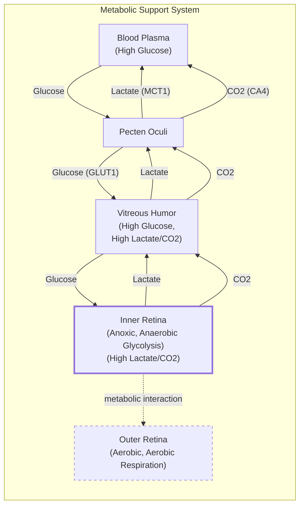
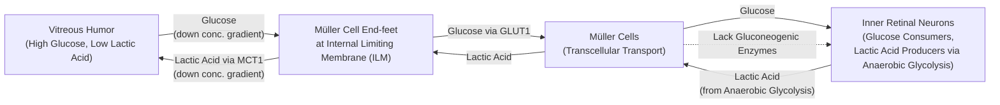
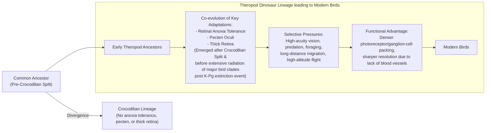

# The Bird's Eye Paradox: How a Retina Thrives Without Oxygen

In human medicine, a blood clot in the retinal artery is a catastrophic event. Known as a retinal vascular occlusion, it starves the eye's light-sensing tissue of oxygen, causing rapid and often irreversible vision loss. Yet, birds, whose visual acuity far surpasses our own, operate with retinas that are almost entirely avascular—they have no internal blood vessels. A hawk can spot a mouse from hundreds of feet in the air, a feat of biological engineering powered by a system that, by our standards, should not work at all.

The retina is one of the most energy-hungry tissues in the body—in fact, it consumes more energy than any other tissue, using oxygen and glucose at two to three times the rate of the brain [[how-the-bird-eye-was-pushed-to-an-evolutionary-extreme-quant], [14]](https://www.eurekalert.org/news-releases/1113036). For centuries, this created a paradox that puzzled scientists. The prevailing assumption was that birds must have some undiscovered mechanism for acquiring oxygen, because the alternative—a high-performance neural tissue functioning without it—seemed impossible. As evolutionary physiologist Christian Damsgaard of Aarhus University noted, "According to everything we know about physiology, this tissue should not be able to function" [[birds-retinas-function-without-oxygen-university-of-oldenbur]].

A recent study finally resolves this long-standing mystery. The inner layers of the bird retina exist in a permanent state of anoxia, or total oxygen deprivation [[Oxygen-free metabolism in the bird inner retina supported by the pecten]]. Instead of evolving a novel oxygen-delivery system, birds evolved a tolerance for its absence, relying on a less efficient metabolic pathway called anaerobic glycolysis. This discovery highlights a fundamental principle of evolutionary problem-solving and offers new perspectives on treating human conditions caused by oxygen deprivation, such as stroke.

https://www.quantamagazine.org/wp-content/uploads/2026/05/ChristianDamsgaard-crJesperEkmann-scaled.webp
Image 1: The evolutionary physiologist Christian Damsgaard measured gas exchange in bird eyes with microsensors. Surprisingly, the inner retina, a highly active tissue, used no oxygen. (Image by Jesper Ekmann from [Quanta Magazine](https://www.quantamagazine.org/how-the-bird-eye-was-pushed-to-an-evolutionary-extreme-20260513))

This work pushes our understanding of the extremes of life and how highly active tissues can survive under conditions that would normally be lethal [[how-the-bird-eye-was-pushed-to-an-evolutionary-extreme-quant]]. Before we can appreciate how birds solved this paradox, we need to revisit how oxygen came to dominate complex life and why its absence is normally catastrophic.

## Oxygenated Life: The Great Oxidation Event and Metabolic Trade-offs

Around 3.4 billion years ago, cyanobacteria developed photosynthesis, a process that fundamentally reshaped our planet. By releasing massive quantities of oxygen into the atmosphere, these tiny organisms triggered the Great Oxidation Event, changing the course of life on Earth [[how-the-bird-eye-was-pushed-to-an-evolutionary-extreme-quant]]. This new, oxygen-rich environment unlocked a far more efficient way to produce cellular energy.

The biochemical trade-off is stark. Anaerobic glycolysis, which breaks down a glucose molecule without oxygen, yields just two molecules of ATP, the universal energy currency of life. Aerobic respiration, which uses oxygen, can produce up to 30 additional molecules of ATP from the same starting glucose. This fifteen-fold increase in energy efficiency was a transformative advantage [[how-the-bird-eye-was-pushed-to-an-evolutionary-extreme-quant]].

https://www.quantamagazine.org/wp-content/uploads/2026/05/BirdFlying-crJean-PaulWettstein-scaled.webp
Image 2: Birds, such as this alpine chough (in the crow family), use their exceptional vision to hunt, forage, and migrate. (Image by Jean-Paul Wettstein from [Quanta Magazine](https://www.quantamagazine.org/how-the-bird-eye-was-pushed-to-an-evolutionary-extreme-20260513))

This energetic advantage drove evolution to favor organisms that could harness oxygen. As molecular physiologist Gary Lewin puts it, "We’ve been hooked on 20% [atmospheric] oxygen for millions of years" [[how-the-bird-eye-was-pushed-to-an-evolutionary-extreme-quant]]. The event led to a mass extinction, as oxygen-breathing organisms outcompeted nearly everything else. Today, all complex, multicellular life depends on this oxygen advantage to survive.

The spectrum of anoxia tolerance among vertebrates is narrow. Humans suffer irreversible brain damage within minutes. The naked mole rat, a mammal adapted to low-oxygen underground burrows, can survive for 18 minutes without oxygen by switching its metabolism to use fructose [[Fructose-driven glycolysis supports anoxia resistance in the naked mole-rat], [how-the-bird-eye-was-pushed-to-an-evolutionary-extreme-quant]]. At the far end of the spectrum, some freshwater turtles can survive at the bottom of frozen lakes for months. For most animals, however, a steady supply of oxygen is non-negotiable, especially for metabolically demanding tissues like the brain and retina [[how-the-bird-eye-was-pushed-to-an-evolutionary-extreme-quant]].

https://www.quantamagazine.org/wp-content/uploads/2026/05/NakedMoleRats-crJavierAbalos-scaled.webp
Image 3: Naked mole rats can survive without oxygen for 18 minutes. To generate energy without oxygen, they use anaerobic glycolysis fueled by fructose. (Image by Javier Ábalos from [Quanta Magazine](https://www.quantamagazine.org/how-the-bird-eye-was-pushed-to-an-evolutionary-extreme-20260513))

With this metabolic context established, we can now examine the mysterious vascular structure that enables birds to push the vertebrate eye to an extreme never seen in other lineages.

## A Mysterious Structure: The Pecten Oculi and Chronic Anoxia

In 2019, when Damsgaard first learned that bird retinas lack blood vessels, he was puzzled by the same paradox that had stumped scientists for centuries. His research led him to the pecten oculi, a comb-like vascular structure first described in the 17th century. While unique to birds, similar but smaller vascular structures exist in other vertebrates, such as the conus papillaris in lizards and the falciform process in teleost fish, hinting at a shared evolutionary toolkit for nourishing avascular eyes [[15]](https://www.thetransmitter.org/vision/inner-retina-of-birds-powers-sight-sans-oxygen). It sits in the vitreous humor of the bird's eye and has been the subject of over 30 different functional hypotheses, most centered on oxygen delivery. "Nobody had really done direct physiological measurements on this structure," Damsgaard said. "That’s where we came in" [[how-the-bird-eye-was-pushed-to-an-evolutionary-extreme-quant]].

https://www.quantamagazine.org/wp-content/uploads/2026/05/Bird_Retina-Fig1-crMarkBelan_Desktopv1.svg
Image 4: The structure of a bird's eye, showing the location of the pecten oculi. (Image by Mark Belan from [Quanta Magazine](https://www.quantamagazine.org/how-the-bird-eye-was-pushed-to-an-evolutionary-extreme-20260513))

Using microsensors to measure oxygen levels directly in the retinas of zebra finches, pigeons, and chickens, Damsgaard's team made a striking discovery. The inner retina, which lacks blood vessels, had no oxygen at all. The outer retina, which sits near the oxygen-rich choroid layer, did have oxygen. This meant that "half of the retina lives in a chronic state of anoxia, where there’s no oxygen present at all," he explained [[how-the-bird-eye-was-pushed-to-an-evolutionary-extreme-quant]]. This finding overturned centuries of assumptions.

To understand how the anoxic tissue produced energy, the team used spatial transcriptomics, a technique that maps gene activity across tissue sections. Damsgaard described it as "a kind of molecular GPS," allowing them to see not just which genes were active, but precisely where [[14]](https://www.eurekalert.org/news-releases/1113036). The results were clear: genes associated with aerobic respiration were active only in the oxygenated outer retina. In the anoxic inner retina, only genes for anaerobic glycolysis were active [[Oxygen-free metabolism in the bird inner retina supported by the pecten]]. This metabolic strategy, however, comes at a high cost. Anaerobic glycolysis is far less efficient, so to meet its energy demands, the inner retina required 2.5 times more glucose than other parts of the bird's brain [[how-the-bird-eye-was-pushed-to-an-evolutionary-extreme-quant]].

This led the researchers back to the pecten oculi. Their data revealed that genes for the glucose transporter GLUT1 were highly active there. The pecten was not an oxygen supplier; it was a metabolic gateway. It pumped massive amounts of glucose into the retina to fuel the inefficient anaerobic process [[1], [4], [Oxygen-free metabolism in the bird inner retina supported by the pecten]].

Image 5: A flowchart illustrating the metabolic support provided by the pecten oculi to the anoxic inner bird retina, including glucose, lactate, and CO2 flows, key transporters, and metabolic states of the retina.

Anaerobic glycolysis also produces lactic acid, a toxic byproduct that must be removed. The team found that genes for lactic acid transporters, such as MCT1, were also highly active in the pecten, confirming its role in waste removal [[1], [4], [Oxygen-free metabolism in the bird inner retina supported by the pecten]]. Supporting cells in the retina, known as Müller cells, facilitate this exchange by transporting glucose to the nerve cells and shuttling lactate away [[1], [Oxygen-free metabolism in the bird inner retina supported by the pecten]].

Image 6: Flowchart illustrating the Müller-cell-mediated nutrient exchange at the vitreoretinal interface, showing glucose and lactic acid transport and key transporters.

https://www.quantamagazine.org/wp-content/uploads/2026/05/BirdEyeGrid-scaled.webp
Image 7: The diversity of bird eyes, lacking blood vessels (left to right). Top: Northern gannet, Eurasian eagle-owl, maguari stork. Center: rooster, rockhopper penguin, parrot (species unknown). Bottom: bald eagle, blue-and-yellow macaw, unknown species. (Image by Chris Hellier, Jiří Dočkal, Annette Lozinski, Mohammed Brzan, Nico Marín, Shyamli Kashyap, Ingo Doerrie, David Clode, Hasan Almasi from [Quanta Magazine](https://www.quantamagazine.org/how-the-bird-eye-was-pushed-to-an-evolutionary-extreme-20260513))

The findings provide compelling evidence for this new metabolic model. "The insight that the retina basically goes oxygen-free, at least in some layers, is surprising... It really gets properly down to zero," said Thomas Baden, a neuroscientist who was not involved in the study [[4]]. One of the study's senior authors, Jens Randel Nyengaard, framed the discovery as a fundamental part of scientific progress: "We are essentially collapsing one house of cards and replacing it with another... New results can add new knowledge. That is how science progresses" [[14]](https://www.eurekalert.org/news-releases/1113036). While this anaerobic pathway is used by cancer cells and temporarily by strained muscles, no vertebrate tissue was previously known to survive in a completely anoxic state for its entire lifetime [[how-the-bird-eye-was-pushed-to-an-evolutionary-extreme-quant]].

Having established how the avian retina operates, we can now trace when and why this radical solution evolved and what it teaches us about selective pressures and future applications.

## Eyes Like a Hawk: Evolutionary Origins, Selective Pressures, and Implications

The bird’s retina and its no-oxygen power system are so unusual that they naturally raise questions about how they could have evolved. Evolution does not invent new systems from scratch. As biologist François Jacob argued in his 1977 essay, evolution acts more like a tinkerer than an engineer, repurposing existing parts for new functions [[Evolution and tinkering]]. The vertebrate eye is an ancient, highly conserved structure, but birds tinkered with its blueprint to fit their unique needs [[Evolution of the vertebrate retina by repurposing of a], [how-the-bird-eye-was-pushed-to-an-evolutionary-extreme-quant]].

By comparing the retinas of birds to those of reptiles like turtles and caimans, Damsgaard's team pinpointed when this adaptation likely arose. Reptile retinas have normal oxygen levels and show no signs of anaerobic glycolysis. This suggests the oxygen-free retina evolved sometime in the dinosaur era, within the theropod lineage that gave rise to modern birds, after it had split from crocodiles. Sensory biologist Dan-Eric Nilsson, who was not involved in the research, supported this interpretation, stating, "I fully support their interpretation that the anoxic retina probably evolved in the dinosaur lineage" [[15]](https://www.thetransmitter.org/vision/inner-retina-of-birds-powers-sight-sans-oxygen). This evolutionary change coincided with a thickening of the retina [[Oxygen-free metabolism in the bird inner retina supported by the pecten], [how-the-bird-eye-was-pushed-to-an-evolutionary-extreme-quant]].

Image 8: A phylogenetic timeline illustrating the co-evolution of retinal anoxia tolerance, the pecten oculi, and a thick retina in the theropod dinosaur lineage leading to modern birds.

The selective pressures driving this change were likely intense. Damsgaard suggests the system evolved "in response to selection for sharp vision for tracking prey and identifying mates." Coen Elemans, a professor who contributed to the work, gives a vivid example: "This pecten allows a snake eagle the incredible acuity of vision to spot a tiny still lizard from great heights" [[16]](https://www.sdu.dk/en/om-sdu/fakulteterne/naturvidenskab/nyheder-2026/bird-retina). Later, as birds took to the skies, it may have served as a pre-adaptation for "maintaining retinal function" during high-altitude flights where oxygen is scarce [[how-the-bird-eye-was-pushed-to-an-evolutionary-extreme-quant]]. The primary advantage of an avascular retina is optical. Blood vessels scatter light, which degrades image quality. By removing them, evolution allowed for a denser packing of photoreceptor and ganglion cells, leading to higher resolution [[Avian Cone Photoreceptors Tile the Retina as Five Independent, Self-Organizing Mosaics], [how-the-bird-eye-was-pushed-to-an-evolutionary-extreme-quant]].

Whether this is a direct adaptation or an evolutionary coincidence is still an open question. Researchers are cautious about extending these findings to all birds without further study, especially since migratory species have not yet been examined [[how-the-bird-eye-was-pushed-to-an-evolutionary-extreme-quant]]. Other researchers note that while the proposed model is compelling, it remains a hypothesis. Future studies are needed to quantify the energy provided by this new pathway and to further investigate the pecten’s role in removing waste products like CO₂ [[15]](https://www.thetransmitter.org/vision/inner-retina-of-birds-powers-sight-sans-oxygen). Nonetheless, the biomedical implications are significant. Many human medical conditions, most notably stroke, are caused by a drop in oxygen delivery to tissues. Our brains can only tolerate about a minute of total anoxia before cells begin to malfunction and die [[how-the-bird-eye-was-pushed-to-an-evolutionary-extreme-quant]].

By studying how animals like naked mole rats and birds have solved these problems through millions of years of natural selection, we can find inspiration for new therapies. The mechanisms allowing the bird retina to thrive without oxygen—from its reliance on anaerobic glycolysis to the pecten's role in nutrient supply and waste removal—offer a biological blueprint for tissue resilience. Jens Randel Nyengaard, a senior author on the study, put it more directly: "Nature has solved a physiological problem in birds that makes humans sick. We hope that understanding this evolutionary solution can inspire new ways of thinking about why tissues fail under oxygen deprivation in disease, and how such diseases can be treated" [[17]](https://www.eyefox.com/news/2724/sight-without-oxygen-secret-of-the-bird-retina-unraveled).

## References

- [1] https://uol.de/en/news/article/birds-retinas-function-without-oxygen
- [2] https://www.eurekalert.org/news-releases/1113036
- [3] https://www.sdu.dk/en/om-sdu/fakulteterne/naturvidenskab/nyheder-2026/bird-retina
- [4] https://www.quantamagazine.org/how-the-bird-eye-was-pushed-to-an-evolutionary-extreme-20260513
- [5] https://www.thetransmitter.org/vision/inner-retina-of-birds-powers-sight-sans-oxygen
- [6] https://www.eyefox.com/news/2724/sight-without-oxygen-secret-of-the-bird-retina-unraveled
- [7] https://www.genengnews.com/topics/translational-medicine/how-bird-retinas-function-without-oxygen-may-inform-future-stroke-therapies
- [8] https://bio.au.dk/en/about-biology/news-and-events/show/artikel/fugles-nethinder-lever-uden-ilt-aarhundredgammelt-biologisk-mysterium-er-opklaret
- [9] Oxygen-free metabolism in the bird inner retina supported by the pecten. (https://doi.org/10.1038/s41586-025-09978-w)
- [10] Fructose-driven glycolysis supports anoxia resistance in the naked mole-rat. (https://doi.org/10.1126/science.aab3896)
- [11] Evolution and Tinkering. (https://doi.org/10.1126/science.860134)
- [12] Avian Cone Photoreceptors Tile the Retina as Five Independent, Self-Organizing Mosaics. (https://doi.org/10.1371/journal.pone.0008992)
- [13] Evolution of the vertebrate retina by repurposing of a composite ancestral median eye. (https://doi.org/10.1016/j.cub.2025.12.028)
- [14] https://www.eurekalert.org/news-releases/1113036
- [15] https://www.thetransmitter.org/vision/inner-retina-of-birds-powers-sight-sans-oxygen
- [16] https://www.sdu.dk/en/om-sdu/fakulteterne/naturvidenskab/nyheder-2026/bird-retina
- [17] https://www.eyefox.com/news/2724/sight-without-oxygen-secret-of-the-bird-retina-unraveled