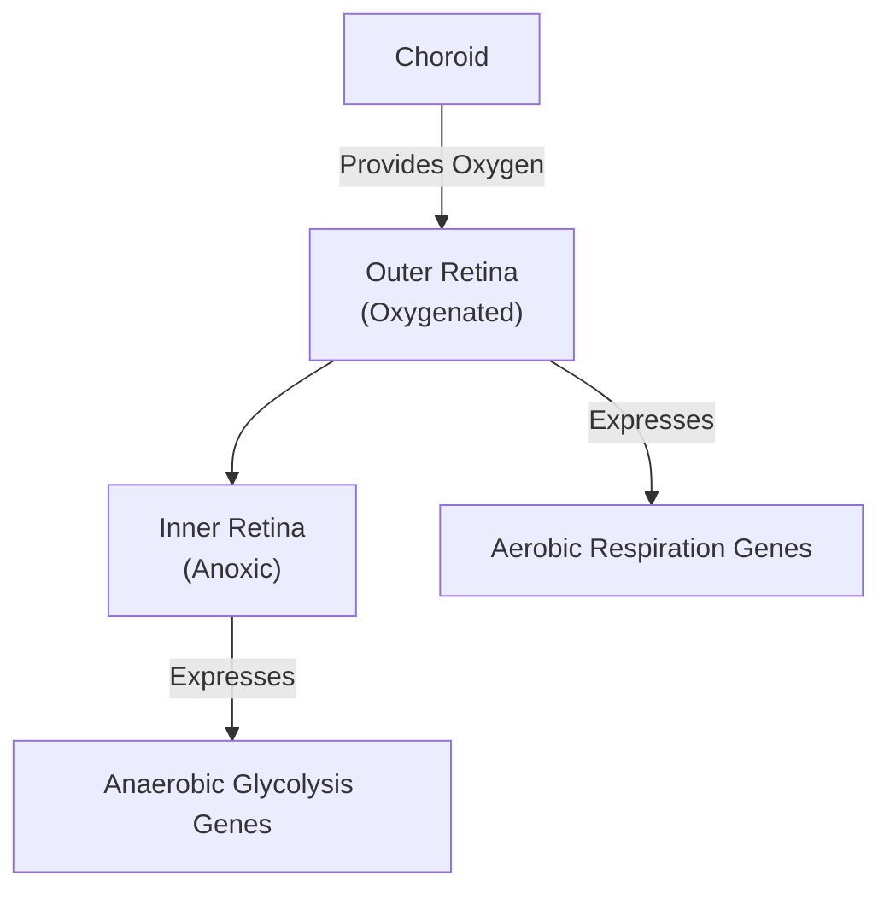
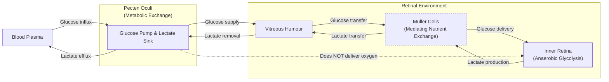
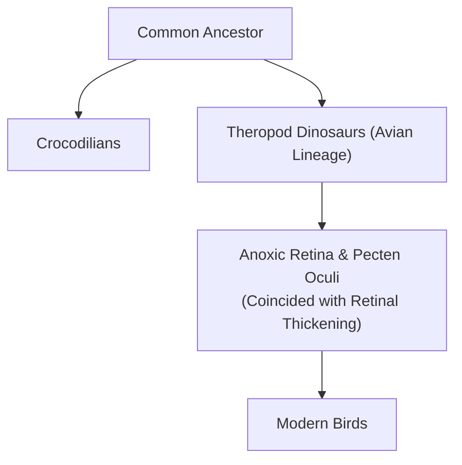

# How Bird Eyes See Without Oxygen

In humans, a blockage in a retinal blood vessel is a medical emergency that can cause irreversible blindness within hours. Yet, birds, renowned for their extraordinary vision, operate with retinas that are completely avascular—they have no blood vessels at all. A hawk can spot a mouse from hundreds of feet away, achieving a level of visual acuity that is a marvel of the natural world. This superiority is not just anecdotal; it's written in the retina's structure. While the human retina contains about 200,000 photoreceptors per square millimeter, a house sparrow has 400,000, and a common buzzard packs in 1,000,000 [[9]](https://en.wikipedia.org/wiki/Bird_vision). This incredible density allows some raptors, like the wedge-tailed eagle, to achieve a visual acuity of 143 cycles per degree—the ability to distinguish 143 pairs of black-and-white lines within a single degree of their visual field. This is more than double the resolution of human vision [[10]](https://pmc.ncbi.nlm.nih.gov/articles/PMC10906485).

This presents a long-standing biological paradox: how can a tissue with such extreme performance demands function without the very blood supply that, in all other known vertebrates, is essential for high metabolic activity? The retina is one of the most energy-hungry tissues in the animal kingdom, consuming oxygen and glucose at a rate two to three times that of the brain [[1]](https://www.nature.com/articles/s41586-025-09978-w). For centuries, scientists assumed that birds must possess some unknown, highly efficient mechanism for acquiring oxygen, because standard vertebrate physiology seemed impossible without it. As evolutionary physiologist Christian Damsgaard of Aarhus University puts it, "According to everything we know about physiology, this tissue should not be able to function" [[2]](https://www.quantamagazine.org/how-the-bird-eye-was-pushed-to-an-evolutionary-extreme-20260513).

A recent study finally resolves this mystery, and the answer overturns centuries of assumptions. The inner layers of the bird retina exist in a permanent state of chronic anoxia, or total oxygen deprivation [[1]](https://www.nature.com/articles/s41586-025-09978-w), [[3]](https://uol.de/en/news/article/birds-retinas-function-without-oxygen). Instead of relying on a novel oxygen-delivery system, the avian retina has evolved to tolerate its absence, fueling its intense activity through anaerobic glycolysis—a less efficient but life-sustaining metabolic pathway.
Image 1: The evolutionary physiologist Christian Damsgaard measured gas exchange in bird eyes with microsensors. Surprisingly, the inner retina, a highly active tissue, used no oxygen. (Image by Jesper Ekmann from [Quanta Magazine](https://www.quantamagazine.org/how-the-bird-eye-was-pushed-to-an-evolutionary-extreme-20260513))

This discovery frames the bird eye as an evolutionary extreme, a case study in how metabolically active tissue can survive without oxygen. It not only solves a classic biological puzzle but also holds potential for developing new treatments for human conditions caused by ischemia, such as stroke and retinal disease [[1]](https://www.nature.com/articles/s41586-025-09978-w), [[4]](https://www.eurekalert.org/news-releases/1113036). Before we can appreciate how birds solved this paradox, we need to revisit how oxygen came to dominate complex life and why its absence is normally catastrophic.

## Oxygenated Life: The Great Oxidation Event and Metabolic Trade-offs

Billions of years ago, the rise of cyanobacteria triggered the Great Oxidation Event, a planetary transformation that flooded Earth’s atmosphere with oxygen. This event unlocked a far more efficient method of energy production: aerobic respiration. While the ancient pathway of anaerobic glycolysis yields only two molecules of ATP per molecule of glucose, aerobic respiration can produce up to 32 ATP [[5]](https://www.thetransmitter.org/vision/inner-retina-of-birds-powers-sight-sans-oxygen). This enormous energetic advantage allowed for the evolution of complex, multicellular organisms and effectively locked them into a dependency on oxygen.
Image 2: Birds, such as this alpine chough (in the crow family), use their exceptional vision to hunt, forage, and migrate. (Image by Jean-Paul Wettstein from [Quanta Magazine](https://www.quantamagazine.org/how-the-bird-eye-was-pushed-to-an-evolutionary-extreme-20260513))

This transformation was so profound that it shaped nearly all life that followed. As Gary Lewin, a molecular physiologist at the Max Delbrück Center in Berlin, remarked, "We’ve been hooked on 20% [atmospheric] oxygen for millions of years" [[2]](https://www.quantamagazine.org/how-the-bird-eye-was-pushed-to-an-evolutionary-extreme-20260513). Our own tissues are a testament to this dependency; the human brain suffers irreversible damage after just a few minutes without oxygen [[1]](https://www.nature.com/articles/s41586-025-09978-w).

However, life has found ways to cope with low-oxygen environments. The spectrum of anoxia tolerance across the animal kingdom is vast. At one end, there are humans. At the other, certain species of freshwater turtles can survive for months without oxygen during winter hibernation [[2]](https://www.quantamagazine.org/how-the-bird-eye-was-pushed-to-an-evolutionary-extreme-20260513). An interesting intermediate is the naked mole-rat, a subterranean rodent that can survive for 18 minutes in complete anoxia by switching to a fructose-driven metabolic pathway that bypasses the normal feedback mechanisms of glycolysis [[6]](https://www.sciencemag.org/doi/10.1126/science.aab3896). These exceptions highlight that while oxygen provides a massive energetic advantage, specialized adaptations can allow life to persist where it is scarce.
Image 3: Naked mole rats can survive without oxygen for 18 minutes. To generate energy without oxygen, they use anaerobic glycolysis fueled by fructose. (Image by Javier Ábalos from [Quanta Magazine](https://www.quantamagazine.org/how-the-bird-eye-was-pushed-to-an-evolutionary-extreme-20260513))

In both the human brain and retina, energy-intensive neural processes shut down rapidly without a constant oxygen supply. This makes the avian solution all the more remarkable. With this metabolic context established, we can now examine the mysterious vascular structure that enables birds to push the vertebrate eye to an extreme never seen in other lineages.

## A Mysterious Structure: The Pecten Oculi and Chronic Anoxia

At the heart of the avian eye is the pecten oculi, a comb-like, highly vascularized structure that protrudes into the vitreous humor. First described in the 17th century, its function has been the subject of speculation for centuries, generating more than 30 competing hypotheses [[1]](https://www.nature.com/articles/s41586-025-09978-w), [[3]](https://uol.de/en/news/article/birds-retinas-function-without-oxygen). Damsgaard notes that the function of this enigmatic structure "had never been directly tested" [[3]](https://uol.de/en/news/article/birds-retinas-function-without-oxygen). The prevailing theory was that it supplied the retina with oxygen, but no one had ever managed to perform the delicate measurements needed to confirm this.
Image 4: The pecten oculi, a vascular structure in the bird eye, was long thought to supply oxygen to the retina, but new research shows it serves a different metabolic function. (Image by Mark Belan from [Quanta Magazine](https://www.quantamagazine.org/how-the-bird-eye-was-pushed-to-an-evolutionary-extreme-20260513))

Damsgaard’s team was the first to succeed. Using highly sensitive microsensors, they measured oxygen levels directly within the eyes of living birds. The results were stunning. They found a steep oxygen gradient declining from the choroid—the vascular layer behind the retina—but effectively zero oxygen tension throughout the inner half of the retina [[1]](https://www.nature.com/articles/s41586-025-09978-w). "Half of the retina lives in a chronic state of anoxia, where there’s no oxygen present at all," Damsgaard said [[2]](https://www.quantamagazine.org/how-the-bird-eye-was-pushed-to-an-evolutionary-extreme-20260513). This finding overturned centuries of assumptions.

To understand how the anoxic tissue produced energy, the researchers turned to spatial transcriptomics, a technique that maps gene activity within a tissue. The results revealed a clear metabolic division. Genes for aerobic respiration were active only in the oxygenated outer retina, near the choroid. In contrast, genes for anaerobic glycolysis were highly expressed exclusively in the anoxic inner retina [[1]](https://www.nature.com/articles/s41586-025-09978-w).

Image 5: Spatial distribution of metabolic gene expression in the bird retina.

This anaerobic pathway is far less efficient, so the inner retina’s glucose demand is about 2.5 times higher than other parts of the bird brain, compensating for the inefficiency through massive-scale glycolysis [[1]](https://www.nature.com/articles/s41586-025-09978-w), [[2]](https://www.quantamagazine.org/how-the-bird-eye-was-pushed-to-an-evolutionary-extreme-20260513), [[5]](https://www.thetransmitter.org/vision/inner-retina-of-birds-powers-sight-sans-oxygen). This led the team back to the pecten oculi. Their data showed high expression of genes for glucose transporters, suggesting the pecten’s true function: it acts as a metabolic gateway, pumping massive amounts of glucose into the retina to fuel anaerobic glycolysis [[1]](https://www.nature.com/articles/s41586-025-09978-w).

This metabolic handoff is mediated by Müller cells, a type of glial cell that spans the retina. These cells, which themselves rely heavily on glycolysis, express specific transporters—GLUT1 for glucose and MCTs for lactate—that shuttle fuel from the vitreous humor to the anoxic neurons and ferry waste products back out [[5]](https://www.thetransmitter.org/vision/inner-retina-of-birds-powers-sight-sans-oxygen), [[11]](https://www.mdpi.com/1422-0067/22/7/3689).

Anaerobic glycolysis also produces lactic acid, a toxic byproduct that must be removed. The researchers found that genes for lactic acid transporters were also highly active in the pecten, indicating that it simultaneously removes waste to prevent buildup [[2]](https://www.quantamagazine.org/how-the-bird-eye-was-pushed-to-an-evolutionary-extreme-20260513). "The pecten is not an oxygen supplier,” says senior author Jens Randel Nyengaard. “It is a transport system for fuel in and waste out" [[3]](https://uol.de/en/news/article/birds-retinas-function-without-oxygen). In essence, the pecten functions as a reverse exchanger, swapping glucose for metabolic byproducts like lactic acid and carbon dioxide [[12]](https://www.genengnews.com/topics/translational-medicine/how-bird-retinas-function-without-oxygen-may-inform-future-stroke-therapies).

Image 6: A flowchart illustrating the metabolic role of the pecten oculi in the bird retina, showing glucose influx and lactate efflux, mediated by Müller cells, to support anaerobic glycolysis in the inner retina.
Image 7: The diversity of bird eyes, lacking blood vessels (left to right). Top: Northern gannet, Eurasian eagle-owl, maguari stork. Center: rooster, rockhopper penguin, parrot (species unknown). Bottom: bald eagle, blue-and-yellow macaw, unknown species. (Image by Chris Hellier, Jiří Dočkal, Annette Lozinski, Mohammed Brzan, Nico Marín, Shyamli Kashyap, Ingo Doerrie, David Clode, Hasan Almasi from [Quanta Magazine](https://www.quantamagazine.org/how-the-bird-eye-was-pushed-to-an-evolutionary-extreme-20260513))

This confirmation that roughly half the bird retina exists in a state of chronic anoxia is extraordinary. Thomas Baden, a neuroscientist at the University of Sussex, called the finding surprising, noting, "The insight that the retina basically goes oxygen-free, at least in some layers... really gets properly down to zero" [[2]](https://www.quantamagazine.org/how-the-bird-eye-was-pushed-to-an-evolutionary-extreme-20260513). While cancer cells use a similar pathway (the Warburg effect) and our muscles resort to it temporarily during intense exercise, no vertebrate tissue was known to survive in completely anoxic conditions for a lifetime [[2]](https://www.quantamagazine.org/how-the-bird-eye-was-pushed-to-an-evolutionary-extreme-20260513). Having established how the avian retina operates, we can now trace when and why this radical solution evolved and what it teaches us about selective pressures and future applications.

## Eyes Like a Hawk: Evolutionary Origins, Selective Pressures, and Implications

The bird’s retina and its no-oxygen power system are so unusual that they raise questions about how they could have evolved. Evolution does not design new systems from scratch; it acts as a "tinkerer," repurposing existing structures for new functions [[7]](https://www.science.org/doi/10.1126/science.860134). Instead of inventing a novel oxygen-delivery system, natural selection modified the ancestral vertebrate eye blueprint to function without it.

The evolutionary timing of this adaptation is revealing. The anoxic retina and the metabolic function of the pecten oculi appear to have arisen in the theropod dinosaur lineage, after the split from crocodilians. To pinpoint this timing, researchers compared the bird retina to those of broad-snouted caimans and Chinese pond turtles, finding no evidence of anaerobic metabolism [[2]](https://www.quantamagazine.org/how-the-bird-eye-was-pushed-to-an-evolutionary-extreme-20260513). This change coincided with a measurable thickening of the retina [[1]](https://www.nature.com/articles/s41586-025-09978-w). Interestingly, the pecten's vascular structure is ancient, predating the diversification of reptiles, but its specialized role in metabolic support appears to have been gained only when the avian retina became anoxic [[5]](https://www.thetransmitter.org/vision/inner-retina-of-birds-powers-sight-sans-oxygen).

Image 8: Evolutionary timeline showing the divergence of theropod dinosaurs from crocodilians and key retinal developments in the avian lineage.

The selective pressure behind this change was likely an intense demand for high-acuity vision. For predation, foraging, and navigating during long-distance or high-altitude migrations, sharp vision is critical [[1]](https://www.nature.com/articles/s41586-025-09978-w), [[8]](https://www.sdu.dk/en/om-sdu/fakulteterne/naturvidenskab/nyheder-2026/bird-retina). Damsgaard speculates this was a two-step process. First, the system evolved "in theropod dinosaurs in response to selection for sharp vision for tracking prey and identifying mates." Later, as birds evolved flight, this pre-existing tolerance for anoxia "served as the physiological basis for maintaining retinal function" during high-altitude migrations where oxygen is scarce—a classic case of exaptation, where a trait evolved for one purpose is co-opted for another [[2]](https://www.quantamagazine.org/how-the-bird-eye-was-pushed-to-an-evolutionary-extreme-20260513).

Blood vessels, however, scatter light, which would have limited the packing density of neurons and compromised visual resolution. By eliminating retinal blood vessels, birds could pack their retinas with a higher density of photoreceptors and ganglion cells, directly enabling sharper vision [[1]](https://www.nature.com/articles/s41586-025-09978-w). This trade-off allowed the retina to become thicker and more cell-dense without the physical constraints of internal blood vessels, a key factor in achieving superior visual acuity [[5]](https://www.thetransmitter.org/vision/inner-retina-of-birds-powers-sight-sans-oxygen). Large-scale comparative studies support this, showing that acuity is consistently higher in predatory birds and those living in open habitats, where detecting objects from a distance is a key survival factor [[10]](https://pmc.ncbi.nlm.nih.gov/articles/PMC10906485). This avascularity, however, came at the cost of oxygen supply, forcing the evolution of anoxia tolerance as a necessary trade-off.

It remains an open question whether the vessel-free retina was a direct adaptation for better vision or an evolutionary coincidence that was later co-opted. Caution is warranted against making universal claims. The avascular design might represent an optimal solution to the dual constraints of high metabolic demand and the need for a clear optical path [[1]](https://www.nature.com/articles/s41586-025-09978-w).

The biomedical payoff of this research is significant. Understanding how the bird retina and other anoxia-tolerant tissues like those of the naked mole-rat avoid damage could inspire new treatments for human conditions where oxygen deprivation is a key factor. "In conditions like stroke, human tissues suffer because oxygen delivery is reduced and metabolic waste accumulates," says Nyengaard. "In the bird retina, we see a system that copes with oxygen deprivation in a very different way" [[3]](https://uol.de/en/news/article/birds-retinas-function-without-oxygen). By studying these natural solutions, we may learn how to protect human neural tissues from ischemic injury.

Ultimately, the bird retina is a powerful example of how evolution, through tinkering and repurposing, can push biological systems to their absolute limits. It shows that even a constraint as fundamental as oxygen dependency can be circumvented when the selective pressure is strong enough. As Damsgaard suggests, these findings offer a new perspective on how tissues can survive long-term oxygen deprivation, potentially inspiring future medical solutions [[4]](https://www.eurekalert.org/news-releases/1113036).

## References

- [1] https://www.nature.com/articles/s41586-025-09978-w
- [2] https://www.quantamagazine.org/how-the-bird-eye-was-pushed-to-an-evolutionary-extreme-20260513
- [3] https://uol.de/en/news/article/birds-retinas-function-without-oxygen
- [4] https://www.eurekalert.org/news-releases/1113036
- [5] https://www.thetransmitter.org/vision/inner-retina-of-birds-powers-sight-sans-oxygen
- [6] https://www.sciencemag.org/doi/10.1126/science.aab3896
- [7] https://www.science.org/doi/10.1126/science.860134
- [8] https://www.sdu.dk/en/om-sdu/fakulteterne/naturvidenskab/nyheder-2026/bird-retina
- [9] https://en.wikipedia.org/wiki/Bird_vision
- [10] https://pmc.ncbi.nlm.nih.gov/articles/PMC10906485
- [11] https://www.mdpi.com/1422-0067/22/7/3689
- [12] https://www.genengnews.com/topics/translational-medicine/how-bird-retinas-function-without-oxygen-may-inform-future-stroke-therapies