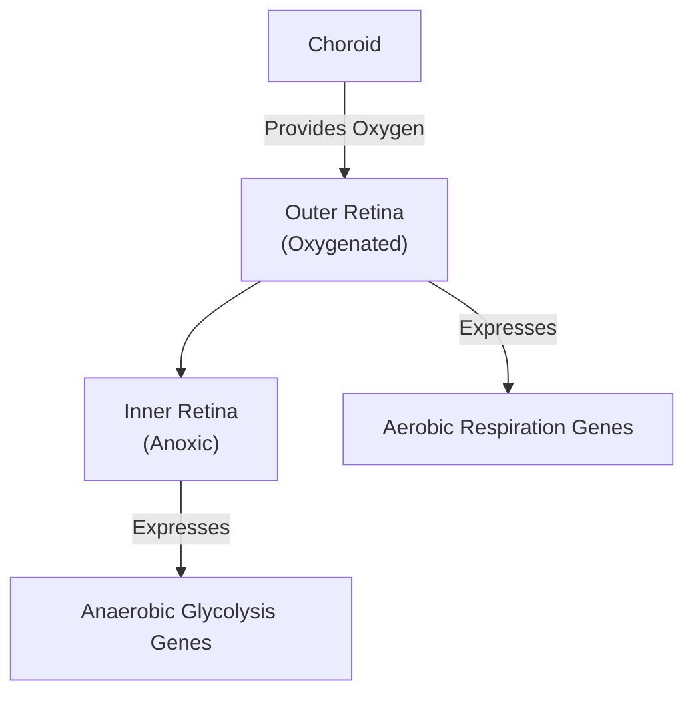
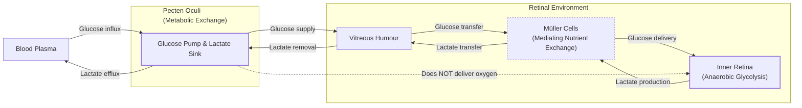
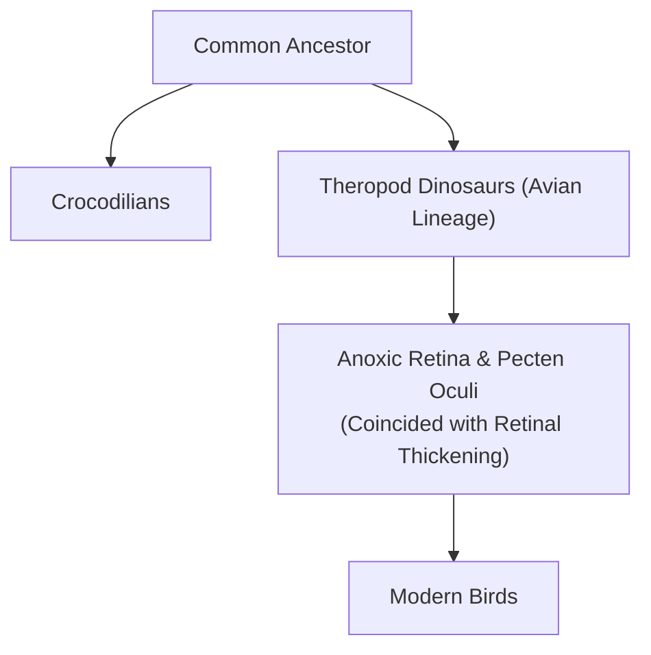

<article>
    # How Bird Eyes See Without Oxygen

As AI engineers, we design systems to be robust. Yet, we often face the reality of brittle dependencies. In human biology, the retina is a prime example. A blockage in one of its tiny blood vessels can cause irreversible blindness within hours, a catastrophic single point of failure. Now, consider the bird. Birds operate with completely avascular retinas, meaning they have no blood vessels at all. Despite this, they possess some of the most powerful visual systems on the planet. A snake eagle can spot a tiny lizard from great heights, a feat of biological engineering that far surpasses our own visual capabilities [[8]](https://www.sdu.dk/en/om-sdu/fakulteterne/naturvidenskab/nyheder-2026/bird-retina).

This performance is rooted in raw data density. While the human retina has about 200,000 photoreceptors per square millimeter, a common buzzard packs in 1,000,000 [[9]](https://en.wikipedia.org/wiki/Bird_vision). This allows raptors like the wedge-tailed eagle to achieve a visual acuity of 143 cycles per degree, more than double human resolution [[10]](https://pmc.ncbi.nlm.nih.gov/articles/PMC10906485). This presents a striking paradox. The retina is one of the most metabolically expensive tissues known, consuming energy at a rate two to three times that of the brain [[1]](https://www.nature.com/articles/s41586-025-09978-w). As we've discussed in previous lessons on neural network efficiency, high performance typically demands high energy consumption.

For centuries, scientists assumed birds must have a secret, highly efficient oxygen-delivery mechanism. The structure has been known since the 1600s, but its function remained speculative [[4]](https://www.eurekalert.org/news-releases/1113036). As evolutionary physiologist Christian Damsgaard of Aarhus University puts it, "According to everything we know about physiology, this tissue should not be able to function" [[2]](https://www.quantamagazine.org/how-the-bird-eye-was-pushed-to-an-evolutionary-extreme-20260513). A recent study finally resolves this mystery by challenging a core assumption. The inner layers of the bird retina exist in a permanent state of chronic anoxia, or total oxygen deprivation [[1]](https://www.nature.com/articles/s41586-025-09978-w), [[3]](https://uol.de/en/news/article/birds-retinas-function-without-oxygen). Instead of a novel oxygen-delivery system, the avian retina evolved to tolerate its absence. It fuels its intense activity through anaerobic glycolysis, a less efficient but stable metabolic pathway.

<https://www.quantamagazine.org/wp-content/uploads/2026/05/ChristianDamsgaard-crJesperEkmann-scaled.webp>
Image 1: The evolutionary physiologist Christian Damsgaard measured gas exchange in bird eyes with microsensors. Surprisingly, the inner retina, a highly active tissue, used no oxygen. (Image by Jesper Ekmann from [Quanta Magazine](https://www.quantamagazine.org/how-the-bird-eye-was-pushed-to-an-evolutionary-extreme-20260513))

This discovery frames the bird eye as an evolutionary extreme, a case study in how a metabolically active system can survive without its primary fuel source. This has direct relevance for human medicine, offering potential insights for treating conditions caused by ischemia, like stroke and retinal disease [[1]](https://www.nature.com/articles/s41586-025-09978-w), [[4]](https://www.eurekalert.org/news-releases/1113036). To appreciate how birds engineered this solution, you first need to understand why oxygen became the dominant fuel for complex life and why its absence is normally catastrophic.

## Oxygenated Life: The Great Oxidation Event and Metabolic Trade-offs

Around 3.4 billion years ago, cyanobacteria invented photosynthesis and began pumping oxygen into the atmosphere, triggering the Great Oxidation Event. This fundamentally reshaped Earth’s environment and unlocked a far more efficient method of energy production [[2]](https://www.quantamagazine.org/how-the-bird-eye-was-pushed-to-an-evolutionary-extreme-20260513). As you may recall from our lessons on computational efficiency, the choice of energy pathway involves significant trade-offs. The ancient anaerobic glycolysis pathway yields a mere two molecules of ATP per molecule of glucose. In contrast, aerobic respiration can generate up to 32 ATP, a 15-fold increase in efficiency that powered the rise of complex, multicellular organisms [[5]](https://www.thetransmitter.org/vision/inner-retina-of-birds-powers-sight-sans-oxygen).

<https://www.quantamagazine.org/wp-content/uploads/2026/05/BirdFlying-crJean-PaulWettstein-scaled.webp>
Image 2: Birds, such as this alpine chough (in the crow family), use their exceptional vision to hunt, forage, and migrate. (Image by Jean-Paul Wettstein from [Quanta Magazine](https://www.quantamagazine.org/how-the-bird-eye-was-pushed-to-an-evolutionary-extreme-20260513))

This energetic advantage was transformative. Once oxygen became abundant, evolution favored organisms that could use it, leading to a mass extinction of those that could not. This created a critical dependency. As molecular physiologist Gary Lewin notes, "We’ve been hooked on 20% [atmospheric] oxygen for millions of years" [[2]](https://www.quantamagazine.org/how-the-bird-eye-was-pushed-to-an-evolutionary-extreme-20260513). Our own tissues are a testament to this fragility. The human brain, for instance, suffers irreversible damage after just a few minutes without oxygen, as its energy-intensive processes grind to a halt [[1]](https://www.nature.com/articles/s41586-025-09978-w).

However, nature provides remarkable edge cases that push the boundaries of this dependency. The spectrum of anoxia tolerance in the animal kingdom is wide. At one extreme, humans are incredibly fragile. At the other, certain freshwater turtles and goldfish can survive for months or even years without oxygen at the bottom of frozen lakes [[2]](https://www.quantamagazine.org/how-the-bird-eye-was-pushed-to-an-evolutionary-extreme-20260513). A compelling intermediate is the naked mole-rat. This subterranean rodent can survive 18 minutes of complete anoxia by switching its metabolism to run on fructose. This alternate fuel source allows it to bypass the normal feedback inhibition of glycolysis, providing a temporary lifeline when oxygen is unavailable in its crowded burrows [[6]](https://www.sciencemag.org/doi/10.1126/science.aab3896).

<https://www.quantamagazine.org/wp-content/uploads/2026/05/NakedMoleRats-crJavierAbalos-scaled.webp>
Image 3: Naked mole rats can survive without oxygen for 18 minutes. To generate energy without oxygen, they use anaerobic glycolysis fueled by fructose. (Image by Javier Ábalos from [Quanta Magazine](https://www.quantamagazine.org/how-the-bird-eye-was-pushed-to-an-evolutionary-extreme-20260513))

These examples show that while oxygen is the standard high-performance fuel, evolution has engineered workarounds for low-resource environments. The rapid failure of human brain and retinal tissue without oxygen underscores the standard vertebrate model. This makes the avian solution all the more impressive. With this metabolic context established, you can now examine the mysterious structure that allowed birds to push their visual system to an evolutionary extreme.

## A Mysterious Structure: The Pecten Oculi and Chronic Anoxia

The key to the bird's anoxic retina is the pecten oculi, a comb-like, vascular structure that extends into the vitreous humor. First described in the 17th century, its function was a long-standing puzzle, generating more than 30 competing hypotheses over the centuries [[1]](https://www.nature.com/articles/s41586-025-09978-w), [[3]](https://uol.de/en/news/article/birds-retinas-function-without-oxygen). It looked like a radiator, riveted with blood vessels, and had a large surface area, leading most to assume it supplied oxygen [[2]](https://www.quantamagazine.org/how-the-bird-eye-was-pushed-to-an-evolutionary-extreme-20260513). As Damsgaard noted, "Nobody had really done direct physiological measurements on this structure" [[2]](https://www.quantamagazine.org/how-the-bird-eye-was-pushed-to-an-evolutionary-extreme-20260513). The physics of diffusion made direct oxygen supply seem unlikely, but the alternative was unthinkable.

<https://www.quantamagazine.org/wp-content/uploads/2026/05/Bird_Retina-Fig1-crMarkBelan_Desktopv1.svg>
Image 4: The structure of the bird eye, highlighting the pecten oculi and the different retinal layers. (Image by Mark Belan from [Quanta Magazine](https://www.quantamagazine.org/how-the-bird-eye-was-pushed-to-an-evolutionary-extreme-20260513))

Damsgaard's team was the first to perform the technically challenging in-vivo measurements required to solve the mystery. Using microsensors carefully inserted into the eyes of living birds, they measured oxygen levels directly. The results were definitive. While there was a steep oxygen gradient from the choroid (the vascular layer behind the retina), the oxygen level dropped to zero in the inner retinal layers [[1]](https://www.nature.com/articles/s41586-025-09978-w). "Half of the retina lives in a chronic state of anoxia, where there’s no oxygen present at all," Damsgaard explained [[2]](https://www.quantamagazine.org/how-the-bird-eye-was-pushed-to-an-evolutionary-extreme-20260513). This overturned centuries of assumptions.

To understand the metabolic architecture supporting this, the researchers used spatial transcriptomics to map gene expression across the retinal tissue. The results showed a clear division of labor. Genes associated with aerobic respiration were active only in the oxygenated outer retina, near the choroid. In the anoxic inner retina, only genes for anaerobic glycolysis were expressed [[1]](https://www.nature.com/articles/s41586-025-09978-w).

Image 5: Spatial distribution of metabolic gene expression in the bird retina.

Because anaerobic glycolysis is so inefficient, the inner retina’s glucose demand is immense, about 2.5 times higher than other parts of the bird brain [[1]](https://www.nature.com/articles/s41586-025-09978-w), [[2]](https://www.quantamagazine.org/how-the-bird-eye-was-pushed-to-an-evolutionary-extreme-20260513). This led the team back to the pecten. They found high expression of glucose transporters, revealing its true function. The pecten is not an oxygen supplier; it is a metabolic gateway. It pumps huge quantities of glucose into the retina to fuel this high-throughput anaerobic process [[1]](https://www.nature.com/articles/s41586-025-09978-w). This nutrient exchange is mediated by Müller cells, specialized glial cells that express high levels of glucose (GLUT1) and lactate (MCT) transporters, effectively shuttling fuel in and waste out [[5]](https://www.thetransmitter.org/vision/inner-retina-of-birds-powers-sight-sans-oxygen), [[11]](https://www.mdpi.com/1422-0067/22/7/3689).

A byproduct of this process is lactic acid, which can be toxic. The researchers also found that genes for lactic acid transporters were highly active in the pecten, showing that it simultaneously functions as a waste removal system [[2]](https://www.quantamagazine.org/how-the-bird-eye-was-pushed-to-an-evolutionary-extreme-20260513). "The pecten is not an oxygen supplier," concluded senior author Jens Randel Nyengaard. "It is a transport system for fuel in and waste out" [[3]](https://uol.de/en/news/article/birds-retinas-function-without-oxygen). It operates as a reverse exchanger, swapping glucose for metabolic waste products like lactic acid and CO2 [[12]](https://www.genengnews.com/topics/translational-medicine/how-bird-retinas-function-without-oxygen-may-inform-future-stroke-therapies).

Image 6: A flowchart illustrating the metabolic role of the pecten oculi in the bird retina, showing glucose influx and lactate efflux, mediated by Müller cells, to support anaerobic glycolysis in the inner retina.

<https://www.quantamagazine.org/wp-content/uploads/2026/05/BirdEyeGrid-scaled.webp>
Image 7: The diversity of bird eyes, lacking blood vessels (left to right). Top: Northern gannet, Eurasian eagle-owl, maguari stork. Center: rooster, rockhopper penguin, parrot (species unknown). Bottom: bald eagle, blue-and-yellow macaw, unknown species. (Image by Chris Hellier, Jiří Dočkal, Annette Lozinski, Mohammed Brzan, Nico Marín, Shyamli Kashyap, Ingo Doerrie, David Clode, Hasan Almasi from [Quanta Magazine](https://www.quantamagazine.org/how-the-bird-eye-was-pushed-to-an-evolutionary-extreme-20260513))

This confirmation that roughly half the bird retina operates in chronic anoxia is extraordinary. Thomas Baden, a neuroscientist at the University of Sussex, called the finding surprising, noting that the oxygen level "really gets properly down to zero" [[2]](https://www.quantamagazine.org/how-the-bird-eye-was-pushed-to-an-evolutionary-extreme-20260513). This metabolic strategy resembles the Warburg effect seen in cancer cells, where glycolysis is favored even when oxygen is present [[11]](https://www.mdpi.com/1422-0067/22/7/3689). However, in birds, this is not a pathological or temporary state; it is a permanent, healthy adaptation with no known precedent in vertebrates [[2]](https://www.quantamagazine.org/how-the-bird-eye-was-pushed-to-an-evolutionary-extreme-20260513). Having established this unique operational model, you can now trace its evolutionary origins and implications.

## Eyes Like a Hawk: Evolutionary Origins, Selective Pressures, and Implications

The bird’s retina and its no-oxygen power system are so unusual that they naturally raise questions about how they could have evolved. In his 1977 essay, biologist François Jacob described evolution not as an engineer with a master plan, but as a "tinkerer" who works with whatever parts are available [[7]](https://www.science.org/doi/10.1126/science.860134). This is a perfect analogy for the avian eye. Instead of inventing a completely new oxygen-delivery system, evolution repurposed existing structures to solve a new problem. The vertebrate eye is a highly conserved structure, with origins dating back 560 million years to a simple light-sensitive patch [[13]](https://doi.org/10.1016/j.cub.2025.12.028). The bird eye is a brilliant example of how this ancient blueprint was modified to meet new, extreme demands.

The evolutionary timing of this adaptation is revealing. By comparing bird retinas to those of their reptilian relatives, like caimans and turtles, researchers found no evidence of anaerobic metabolism in the latter [[2]](https://www.quantamagazine.org/how-the-bird-eye-was-pushed-to-an-evolutionary-extreme-20260513). This suggests that the anoxic retina and the metabolic function of the pecten oculi evolved in the theropod dinosaur lineage after it split from crocodilians. This change coincided with a measurable thickening of the retina, indicating a push towards higher cell density [[1]](https://www.nature.com/articles/s41586-025-09978-w). The pecten's vascular structure itself is ancient, predating the diversification of reptiles, but its specialized role in metabolic support appears to have been co-opted only when the avian retina became anoxic [[5]](https://www.thetransmitter.org/vision/inner-retina-of-birds-powers-sight-sans-oxygen).

Image 8: Evolutionary timeline showing the divergence of theropod dinosaurs from crocodilians and key retinal developments in the avian lineage.

The selective pressure driving this change was likely an intense demand for high-acuity vision. For predators tracking prey, foragers identifying food sources, and migratory birds navigating vast distances, sharp vision is essential for survival [[1]](https://www.nature.com/articles/s41586-025-09978-w), [[8]](https://www.sdu.dk/en/om-sdu/fakulteterne/naturvidenskab/nyheder-2026/bird-retina). Damsgaard speculates this was a two-step process. First, the system evolved "in theropod dinosaurs in response to selection for sharp vision for tracking prey and identifying mates."

Later, as birds took to the skies, this pre-existing tolerance for anoxia "served as the physiological basis for maintaining retinal function" during high-altitude flights where oxygen is scarce. This is a classic case of exaptation, where a trait evolved for one purpose is repurposed for another [[2]](https://www.quantamagazine.org/how-the-bird-eye-was-pushed-to-an-evolutionary-extreme-20260513). This strategy parallels metabolic adaptations seen in high-altitude insect flight muscles, which also rely on anaerobic pathways to function in low-oxygen environments [[14]](https://pubmed.ncbi.nlm.nih.gov/41565811).

The functional advantage is clear. Blood vessels scatter light, creating noise in the visual signal and limiting how densely neurons can be packed. By eliminating them, birds could evolve thicker retinas with a higher density of photoreceptors and ganglion cells, directly enabling sharper resolution [[1]](https://www.nature.com/articles/s41586-025-09978-w). This avascular design allowed the retina to become thicker and more cell-dense without the physical constraints of an internal blood supply, a key factor in achieving superior visual acuity [[5]](https://www.thetransmitter.org/vision/inner-retina-of-birds-powers-sight-sans-oxygen). This is supported by large-scale comparative studies showing that acuity is consistently higher in predatory birds and those living in open habitats, where detecting objects from a distance is a primary survival factor [[10]](https://pmc.ncbi.nlm.nih.gov/articles/PMC10906485).

It remains an open question whether the vessel-free retina was a direct adaptation for better vision or an evolutionary coincidence that was later co-opted. Caution is warranted, as the researchers have not yet studied migratory species [[2]](https://www.quantamagazine.org/how-the-bird-eye-was-pushed-to-an-evolutionary-extreme-20260513). Still, the avascular design appears to be an optimal solution to the dual constraints of high metabolic demand and the need for a clear optical path [[1]](https://www.nature.com/articles/s41586-025-09978-w).

The biomedical payoff of this research is significant. Insights from the anoxia tolerance of birds and naked mole-rats offer potential pathways for treating human conditions like stroke and ischemic retinal disease. "Nature has solved a physiological problem in birds that makes humans sick," Nyengaard noted [[12]](https://www.genengnews.com/topics/translational-medicine/how-bird-retinas-function-without-oxygen-may-inform-future-stroke-therapies). This research could even inspire new strategies for mitigating hypoxia in extreme environments, such as human spaceflight [[15]](https://www.frontiersin.org/journals/physiology/articles/10.3389/fphys.2025.1637834/full). As Damsgaard concluded, "Maybe we can get inspiration for how nature solved these problems by millions of years of natural selection. There’s so much to be learned from these animals that are able to do something that we cannot do" [[2]](https://www.quantamagazine.org/how-the-bird-eye-was-pushed-to-an-evolutionary-extreme-20260513).

## Conclusion

The avian retina offers a powerful lesson in system design, demonstrating how nature solves extreme resource constraints through architectural innovation rather than brute force. By abandoning oxygen dependency and re-engineering the pecten oculi into a high-throughput metabolic gateway, evolution produced a visual system that is both incredibly high-performance and remarkably robust. This biological case study shows that what seems like a fundamental system requirement—in this case, oxygen—can sometimes be engineered around.

As AI engineers, we constantly face similar trade-offs between performance, efficiency, and robustness. The bird's eye reminds us that the most elegant solutions are often not about adding more resources, but about fundamentally rethinking the problem. By studying how nature has optimized its own complex systems over millions of years, we can find inspiration for building more resilient and efficient AI.

## References

- [1] Oxygen-free metabolism in the bird inner retina supported by the pecten https://www.nature.com/articles/s41586-025-09978-w
- [2] How the Bird Eye Was Pushed to an Evolutionary Extreme https://www.quantamagazine.org/how-the-bird-eye-was-pushed-to-an-evolutionary-extreme-20260513
- [3] Birds retinas function without oxygen https://uol.de/en/news/article/birds-retinas-function-without-oxygen
- [4] Bird retinas function without oxygen – solving a centuries-old biological mystery https://www.eurekalert.org/news-releases/1113036
- [5] Inner retina of birds powers sight sans oxygen https://www.thetransmitter.org/vision/inner-retina-of-birds-powers-sight-sans-oxygen
- [6] Fructose-driven glycolysis supports anoxia resistance in the naked mole-rat https://www.sciencemag.org/doi/10.1126/science.aab3896
- [7] Evolution and Tinkering https://www.science.org/doi/10.1126/science.860134
- [8] Bird retinas work without oxygen – solving an old biological puzzle https://www.sdu.dk/en/om-sdu/fakulteterne/naturvidenskab/nyheder-2026/bird-retina
- [9] Bird vision https://en.wikipedia.org/wiki/Bird_vision
- [10] Ecological and morphological correlates of visual acuity in birds https://pmc.ncbi.nlm.nih.gov/articles/PMC10906485
- [11] Energy Metabolism in the Inner Retina in Health and Glaucoma https://www.mdpi.com/1422-0067/22/7/3689
- [12] How Bird Retinas Function Without Oxygen May Inform Future Stroke Therapies https://www.genengnews.com/topics/translational-medicine/how-bird-retinas-function-without-oxygen-may-inform-future-stroke-therapies
- [13] Evolution of the vertebrate retina by repurposing of a composite ancestral median eye https://doi.org/10.1016/j.cub.2025.12.028
- [14] Oxygen-free metabolism in the bird inner retina supported by the pecten https://pubmed.ncbi.nlm.nih.gov/41565811
- [15] The effect of routine cycling between mild hypoxia and mild hyperoxia on human physiology https://www.frontiersin.org/journals/physiology/articles/10.3389/fphys.2025.1637834/full
</article>