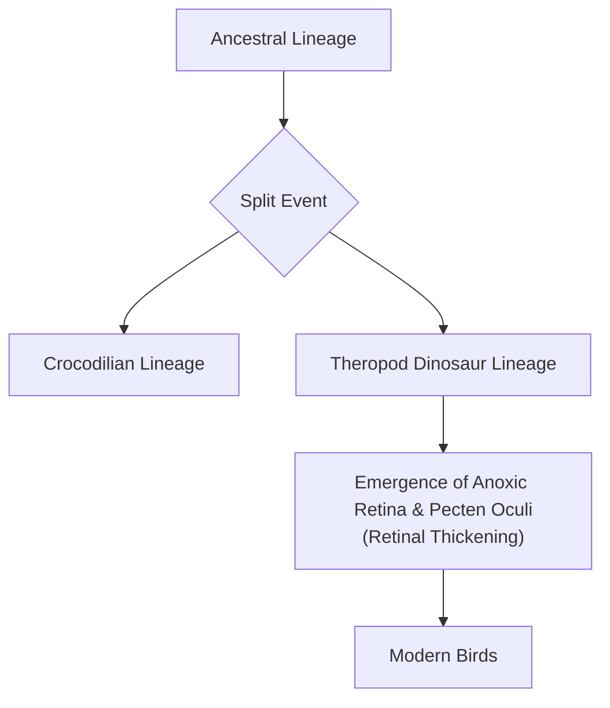

# The Bird That Sees Without Oxygen: An Evolutionary Tale of Metabolic Genius

In human medicine, a retinal vascular occlusion—a blood clot in the eye—is a crisis. When blood flow stops, the oxygen-starved tissue begins to die within minutes, and vision is lost, often permanently. Yet, birds navigate the world with retinas that have no blood vessels at all while achieving visual acuity that far surpasses our own. A hawk can spot a rabbit from a thousand feet in the air, resolving details with a clarity that would require binoculars for a human, a feat of biological engineering that has long puzzled scientists.

This ability seems to defy a fundamental rule of biology. The retina is one of the most energy-hungry tissues in the body, a thin layer of neurons that works tirelessly to convert photons into the neural signals that construct our reality. Per gram, it consumes oxygen and glucose at rates two to three times higher than the brain itself [[1]](https://www.nature.com/articles/s41586-025-09978-w). Without a direct blood supply, how could birds possibly fuel this metabolic furnace?

For centuries, this created a paradox. Scientists knew birds lacked retinal blood vessels, so they assumed some undiscovered mechanism must be delivering oxygen to power their extraordinary sight. The alternative—that the tissue could function without oxygen—was considered biologically impossible. As evolutionary physiologist Christian Damsgaard notes, "According to everything we know about physiology, this tissue should not be able to function" [[2]](https://www.quantamagazine.org/how-the-bird-eye-was-pushed-to-an-evolutionary-extreme-20260513). The failure was in the assumption that oxygen must always be present.

A recent study finally solves this mystery, and the answer is more radical than anyone expected. Birds do not have a secret oxygen delivery system. Instead, their inner retinas exist in a state of permanent oxygen deprivation, or chronic anoxia. They have evolved to power sight using anaerobic glycolysis, a less efficient but oxygen-free metabolic pathway [[1]](https://www.nature.com/articles/s41586-025-09978-w).
Image 1: The evolutionary physiologist Christian Damsgaard measured gas exchange in bird eyes with microsensors. Surprisingly, the inner retina, a highly active tissue, used no oxygen. (Source [Jesper Ekmann](https://www.quantamagazine.org/how-the-bird-eye-was-pushed-to-an-evolutionary-extreme-20260513))

This finding represents an evolutionary extreme, a case of metabolically active tissue thriving under conditions that would be lethal to most vertebrates. It offers a powerful example of how life adapts to operate at its metabolic limits and carries direct implications for human medicine. By understanding the mechanisms that allow the bird retina to thrive without oxygen, we may find new strategies for treating conditions caused by ischemia, from stroke to retinal disease. Before we can appreciate how birds solved this paradox, we need to revisit how oxygen came to dominate complex life and why its absence is normally catastrophic.

## Oxygenated Life: The Great Oxidation Event and Metabolic Trade-offs

Billions of years ago, early cyanobacteria began performing photosynthesis, releasing oxygen as a waste product. This triggered the Great Oxidation Event, a period that fundamentally reshaped Earth’s atmosphere and geochemistry. For the anaerobic life that dominated the planet, this was a catastrophe. For organisms that evolved to use oxygen, it unlocked a far more efficient way to produce energy. Aerobic respiration, which uses oxygen, can generate up to 32 ATP molecules from a single molecule of glucose. In contrast, anaerobic glycolysis, which operates without oxygen, yields only 2 ATP [[1]](https://www.nature.com/articles/s41586-025-09978-w).
Image 2: Birds, such as this alpine chough (in the crow family), use their exceptional vision to hunt, forage, and migrate. (Source [Jean-Paul Wettstein](https://www.quantamagazine.org/how-the-bird-eye-was-pushed-to-an-evolutionary-extreme-20260513))

This massive energy advantage allowed oxygen-using organisms to outcompete nearly everything else, leading to the evolution of complex, multicellular life. This dependence on oxygen became deeply embedded in our biology. As molecular physiologist Gary Lewin puts it, "We’ve been hooked on 20% [atmospheric] oxygen for millions of years” [[2]](https://www.quantamagazine.org/how-the-bird-eye-was-pushed-to-an-evolutionary-extreme-20260513). In mammalian retinas, specific biochemical barriers like the blood-retinal barrier and low expression of key glycolytic enzymes effectively block a permanent switch to anaerobic glycolysis, reinforcing this oxygen dependency [[9]](https://www.mdpi.com/1422-0067/22/7/3689). For humans, this dependency is a vulnerability; irreversible brain damage occurs within minutes of oxygen deprivation.

However, tolerance to anoxia varies across the animal kingdom. The naked mole-rat, a subterranean rodent, can survive for 18 minutes without oxygen by switching to a fructose-based anaerobic metabolism [[3]](https://www.science.org/doi/10.1126/science.aab3896). Some turtles can endure months or even years of oxygen deprivation while hibernating. Diving mammals employ yet another strategy, using hypometabolism and controlled hypothermia to dramatically reduce oxygen demand in the brain during long dives [[5]](https://www.eurekalert.org/news-releases/1113036). In human brain and retinal tissue, however, the energy-intensive processes that sustain neural function shut down almost immediately when oxygen is cut off [[1]](https://www.nature.com/articles/s41586-025-09978-w).
Image 3: Naked mole rats can survive without oxygen for 18 minutes. To generate energy without oxygen, they use anaerobic glycolysis fueled by fructose. (Source [Javier Ábalos](https://www.quantamagazine.org/how-the-bird-eye-was-pushed-to-an-evolutionary-extreme-20260513))

With this metabolic context established, we can now examine the mysterious vascular structure that enables birds to push the vertebrate eye to an extreme never seen in other lineages.

## A Mysterious Structure: The Pecten Oculi and Chronic Anoxia

The key to the bird's metabolic puzzle is the pecten oculi, a comb-like, highly vascularized structure that protrudes into the eye's vitreous humor. First described in the 17th century, its function has been debated for centuries, generating over 30 different hypotheses. Damsgaard recalls, "I was taught that the pecten supplies the retina with oxygen, but when I looked into the literature, I realized that this was just an assumption" [[2]](https://www.quantamagazine.org/how-the-bird-eye-was-pushed-to-an-evolutionary-extreme-20260513). The prevailing theory was that it acted as a supplementary oxygen source, but this had never been directly tested [[1]](https://www.nature.com/articles/s41586-025-09978-w).

While unique to birds, similar but smaller vascular structures exist in other vertebrates, such as the conus papillaris in lizards and the falciform process in teleost fish, hinting at a shared evolutionary toolkit for nourishing the eye [[4]](https://www.thetransmitter.org/vision/inner-retina-of-birds-powers-sight-sans-oxygen).
Image 4: In the bird eye, the retina lacks blood vessels. The pecten oculi, a vascularized structure, was long thought to supply the retina with oxygen. New research shows that it instead delivers glucose and removes waste. (Source [Mark Belan/ Quanta Magazine](https://www.quantamagazine.org/how-the-bird-eye-was-pushed-to-an-evolutionary-extreme-20260513))

To solve this, Damsgaard's team performed the first direct physiological measurements using microsensors to probe oxygen levels inside the eyes of living birds. The results were striking. They found a steep oxygen gradient declining from the choroid (the vascular layer behind the retina), but effectively zero oxygen tension throughout the inner retina. "Half of the retina lives in a chronic state of anoxia, where there’s no oxygen present at all,” Damsgaard said [[2]](https://www.quantamagazine.org/how-the-bird-eye-was-pushed-to-an-evolutionary-extreme-20260513). This single experiment overturned centuries of assumptions [[1]](https://www.nature.com/articles/s41586-025-09978-w).

To understand how the retina functions without oxygen, the researchers used spatial transcriptomics to map gene activity across the tissue. They found a clear metabolic division. Genes for aerobic respiration were active only in the outer retina, which receives oxygen from the choroid. In the anoxic inner retina, only genes for anaerobic glycolysis were expressed [[1]](https://www.nature.com/articles/s41586-025-09978-w). This metabolic strategy comes at a cost. The inner retina's glucose demand is 2.5 times higher than other parts of the bird brain to compensate for the inefficiency of anaerobic glycolysis [[1]](https://www.nature.com/articles/s41586-025-09978-w), [[4]](https://www.thetransmitter.org/vision/inner-retina-of-birds-powers-sight-sans-oxygen).

This led the team back to the pecten. Their data revealed it was not an oxygen supplier but a metabolic gateway. It is equipped with highly active glucose transporters (GLUT1) to pump fuel into the retina and lactate transporters (MCT1) to remove the toxic waste produced by lifelong anaerobic glycolysis [[1]](https://www.nature.com/articles/s41586-025-09978-w), [[5]](https://www.eurekalert.org/news-releases/1113036). Müller cells, a type of glial cell, help shuttle these metabolites between the vitreous humor and the retinal neurons [[6]](https://uol.de/en/news/article/birds-retinas-function-without-oxygen).

```mermaid
flowchart LR
  %% Metabolic Role of Pecten Oculi in Bird Retina

  BP["Blood Plasma"]
  PO["Pecten Oculi<br/>(Glucose Pump & Lactate Sink)"]
  VH["Vitreous Humour"]
  MC["Müller Cells"]
  IR["Inner Retina<br/>(Chronic Anoxia)"]
  AG["Anaerobic Glycolysis"]

  %% Glucose Flow
  BP -- "Glucose" --> PO
  PO -- "Glucose via GLUT1" --> VH
  VH -- "Glucose" --> MC
  MC -- "Glucose via GLUT1" --> IR
  IR -- "Glucose used" --> AG

  %% Lactate Flow
  AG -- "Lactate produced" --> IR
  IR -- "Lactate via MCT4 (neurons)<br/>MCT1 (Müller cells)" --> MC
  MC -- "Lactate" --> VH
  VH -- "Lactate" --> PO
  PO -- "Lactate via MCT1" --> BP

  %% Visual grouping and emphasis
  classDef pectenRole stroke-width:3px,stroke:#00796b
  class PO pectenRole
  classDef anoxiaState stroke-dasharray:5,5,stroke:#e65100
  class IR anoxiaState
```

Image 5: A flowchart illustrating the metabolic role of the pecten oculi in the bird retina, showing glucose uptake and lactate clearance.
Image 6: The diversity of bird eyes, lacking blood vessels (left to right). Top: Northern gannet, Eurasian eagle-owl, maguari stork. Center: rooster, rockhopper penguin, parrot (species unknown). Bottom: bald eagle, blue-and-yellow macaw, unknown species. (Source [Chris Hellier, Jiří Dočkal, Annette Lozinski, Mohammed Brzan, Nico Marín, Shyamli Kashyap, Ingo Doerrie, David Clode, Hasan Almasi](https://www.quantamagazine.org/how-the-bird-eye-was-pushed-to-an-evolutionary-extreme-20260513))

This confirmation that roughly half the bird retina exists in a state of chronic anoxia is extraordinary. Neuroscientist Thomas Baden, who was not involved in the study, commented, "The insight that the retina basically goes oxygen-free, at least in some layers, is surprising. … It really gets properly down to zero” [[2]](https://www.quantamagazine.org/how-the-bird-eye-was-pushed-to-an-evolutionary-extreme-20260513). This metabolic strategy is similar to the Warburg effect in cancer cells or the temporary anaerobic respiration in our muscles during intense exercise. However, in the bird retina, it is a permanent, healthy state with no known precedent in any other vertebrate tissue [[2]](https://www.quantamagazine.org/how-the-bird-eye-was-pushed-to-an-evolutionary-extreme-20260513).

Having established how the avian retina operates, we can now trace when and why this radical solution evolved and what it teaches us about selective pressures and future applications.

## Eyes Like a Hawk: Evolutionary Origins, Selective Pressures, and Implications

The bird’s retina and its no-oxygen power system are so unusual that they naturally raise questions about how they could have evolved. Evolution, as François Jacob described in his 1977 paper, often works not as an engineer with a clear plan, but as a "tinkerer" that repurposes existing parts for new functions [[7]](https://www.science.org/doi/10.1126/science.860134). The pecten itself is a prime example. While the underlying vascular structure is ancient, originating before the diversification of reptiles, its specialized role in providing metabolic support for an anoxic retina appears to be a later innovation that enabled retinal thickening [[4]](https://www.thetransmitter.org/vision/inner-retina-of-birds-powers-sight-sans-oxygen). Rather than inventing a new oxygen-delivery system, evolution co-opted the ancient vertebrate eye blueprint and pushed it to a metabolic extreme.

This adaptation appears to have occurred in the theropod dinosaur lineage after it split from crocodilians. Comparative analysis shows that non-avian reptiles like lizards, turtles, and crocodiles do not have anoxic retinas. This suggests that retinal anoxia tolerance co-evolved with the thickening of the retina in a common ancestor of modern birds [[1]](https://www.nature.com/articles/s41586-025-09978-w).

Image 7: Phylogenetic tree illustrating the evolutionary origin of the avian anoxic retina and pecten oculi.

The selective pressures driving this change were likely intense. Predation, foraging, long-distance migration, and high-altitude flight all demand exceptional vision. In most vertebrates, the need for a rich blood supply creates a trade-off. Blood vessels scatter light, which can degrade visual acuity. By eliminating vessels from the retina, birds were able to pack photoreceptors and ganglion cells more densely, directly enabling sharper resolution [[1]](https://www.nature.com/articles/s41586-025-09978-w). The anoxia-tolerant metabolism supported by the pecten was the key innovation that made this avascular design possible.

This is a potential case of exaptation, where a trait evolved for one purpose is later co-opted for another. The anoxic retina may have first evolved in dinosaurs to maximize visual acuity, and was later repurposed to maintain vision during high-altitude migratory flights where oxygen is scarce [[4]](https://www.thetransmitter.org/vision/inner-retina-of-birds-powers-sight-sans-oxygen).

It remains an open question whether the vessel-free retina was a direct adaptation for better vision or an evolutionary coincidence that was later co-opted for this purpose. The answer is likely complex, as evolution is a historical process full of contingency. What is clear is that this system works remarkably well, allowing birds to achieve some of the best vision in the animal kingdom [[8]](https://journals.plos.org/plosone/article?id=10.1371/journal.pone.0008992).

The biomedical implications of this discovery are significant. Conditions like stroke and ischemic retinal diseases in humans are caused by oxygen deprivation and the buildup of metabolic waste. The bird retina offers a natural model of a system that has solved both problems. Understanding how birds and other anoxia-tolerant animals like the naked mole-rat survive these conditions could inspire new therapies to protect human tissues from hypoxic damage [[3]](https://www.science.org/doi/10.1126/science.aab3896), [[6]](https://uol.de/en/news/article/birds-retinas-function-without-oxygen). One speculative but promising avenue is gene therapy; engineering the genes for the pecten's highly efficient glucose transporters into human retinal implants could one day help sustain damaged tissue, though significant translational challenges remain [[5]](https://www.eurekalert.org/news-releases/1113036). As Damsgaard suggests, "If we can learn from nature how to protect the brain from oxygen deprivation, we might be able to do it ourselves" [[2]](https://www.quantamagazine.org/how-the-bird-eye-was-pushed-to-an-evolutionary-extreme-20260513). Nature, through its endless tinkering, continues to provide blueprints for solving some of our most pressing medical challenges.

## Conclusion

The discovery that bird retinas function without oxygen resolves a centuries-old biological puzzle. It reveals a remarkable instance of evolutionary adaptation, where a highly active neural tissue thrives in a state of chronic anoxia. This is made possible by a switch to anaerobic glycolysis, fueled by the pecten oculi, which acts as a metabolic gateway for glucose and waste.

This unique system highlights how evolution works as a tinkerer, repurposing existing structures to overcome fundamental constraints. By eliminating blood vessels to enhance visual acuity, birds evolved a metabolic strategy previously thought impossible in vertebrates. This story not only deepens our understanding of animal physiology but also opens new avenues for medical research, offering insights that could one day help treat human diseases caused by oxygen deprivation.

## References

- [1] [Oxygen-free metabolism in the bird inner retina supported by the pecten](https://www.nature.com/articles/s41586-025-09978-w)
- [2] [How the Bird Eye Was Pushed to an Evolutionary Extreme](https://www.quantamagazine.org/how-the-bird-eye-was-pushed-to-an-evolutionary-extreme-20260513)
- [3] [Fructose-driven glycolysis supports anoxia resistance in the naked mole-rat](https://www.science.org/doi/10.1126/science.aab3896)
- [4] [Inner Retina of Birds Powers Sight Sans Oxygen](https://www.thetransmitter.org/vision/inner-retina-of-birds-powers-sight-sans-oxygen)
- [5] [Sight without oxygen: Secret of the bird retina unraveled](https://www.eurekalert.org/news-releases/1113036)
- [6] [Birds retinas function without oxygen](https://uol.de/en/news/article/birds-retinas-function-without-oxygen)
- [7] [Evolution and Tinkering](https://www.science.org/doi/10.1126/science.860134)
- [8] [Avian Cone Photoreceptors Tile the Retina as Five Independent, Self-Organizing Mosaics](https://journals.plos.org/plosone/article?id=10.1371/journal.pone.0008992)
- [9] [Biochemical and Functional Properties of Ecto-5′-Nucleotidase in the Retina of a Teleost Fish, the Zebrafish (Danio rerio)](https://www.mdpi.com/1422-0067/22/7/3689)