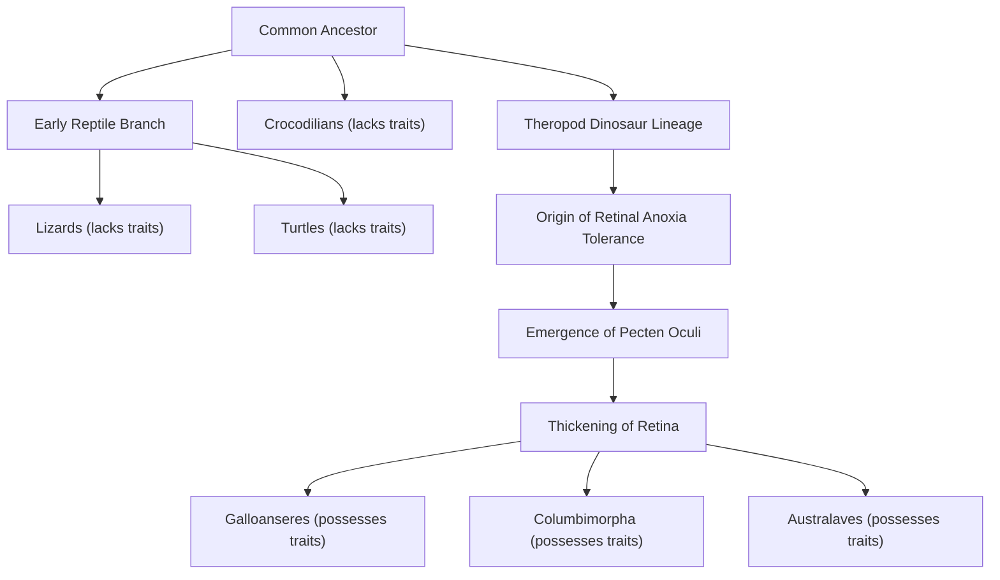

# How Bird Eyes Evolved to See Without Oxygen

## Introduction: The Avascular Retina Paradox

In human medicine, a blocked retinal artery is a crisis. Deprived of oxygen, the light-sensing tissue at the back of the eye dies within minutes, causing irreversible blindness. Yet, birds of prey operate with a biological paradox. Their retinas are almost entirely avascular, meaning they lack the dense network of blood vessels found in our own eyes. Despite this, a hawk can spot a lizard from hundreds of feet in the air, achieving a level of visual sharpness that far surpasses our own [[1]](https://www.quantamagazine.org/how-the-bird-eye-was-pushed-to-an-evolutionary-extreme-20260513), [[2]](https://doi.org/10.1371/journal.pone.0008992).

The retina, a specialized extension of the brain, is one of the most energy-hungry tissues in the animal kingdom. It consumes glucose and oxygen at two to three times the rate of typical brain tissue [[1]](https://www.quantamagazine.org/how-the-bird-eye-was-pushed-to-an-evolutionary-extreme-20260513), [[3]](https://doi.org/10.1038/s41586-025-09978-w). For centuries, this fact created a puzzle that scientists could not solve. If the avian retina needs so much energy, how does it function without a blood supply? The long-standing assumption was that birds must possess some undiscovered mechanism for acquiring oxygen. As evolutionary physiologist Christian Damsgaard of Aarhus University put it, "According to everything we know about physiology, this tissue should not be able to function" [[4]](https://www.genengnews.com/topics/translational-medicine/how-bird-retinas-function-without-oxygen-may-inform-future-stroke-therapies).

A recent study, the result of an eight-year investigation by an international team, finally resolves this long-standing mystery [[11]](https://www.eurekalert.org/news-releases/1113036). The answer is not a novel oxygen-delivery system. Instead, the inner layers of the bird retina exist in a permanent state of anoxia. This is a state of total oxygen deprivation. They survive by relying on anaerobic glycolysis, a far less efficient metabolic pathway that does not require oxygen [[3]](https://doi.org/10.1038/s41586-025-09978-w). This finding documents an evolutionary extreme, a vertebrate tissue that functions in conditions that would be lethal to our own. It also offers potential insights for treating human diseases caused by oxygen deprivation, such as stroke.

<https://www.quantamagazine.org/wp-content/uploads/2026/05/ChristianDamsgaard-crJesperEkmann-scaled.webp>
Image 1: The evolutionary physiologist Christian Damsgaard measured gas exchange in bird eyes with microsensors. Surprisingly, the inner retina, a highly active tissue, used no oxygen. (Image by Jesper Ekmann from [Quanta Magazine](https://www.quantamagazine.org/how-the-bird-eye-was-pushed-to-an-evolutionary-extreme-20260513))

Before you can appreciate how birds solved this paradox, you need to revisit how oxygen came to dominate complex life and why its absence is normally catastrophic.

## Oxygenated Life: The Great Oxidation Event and Metabolic Trade-offs

Around 3.4 billion years ago, cyanobacteria developed photosynthesis, a process that released enormous quantities of oxygen into the atmosphere. This Great Oxidation Event fundamentally reshaped life on Earth, leading to a mass extinction of organisms that could not tolerate oxygen [[1]](https://www.quantamagazine.org/how-the-bird-eye-was-pushed-to-an-evolutionary-extreme-20260513). For the survivors, the presence of oxygen unlocked a new, highly efficient method of energy production: aerobic respiration.

The biochemical advantage is stark. Anaerobic glycolysis, the process of breaking down glucose without oxygen, yields just two molecules of adenosine triphosphate (ATP). This is life's energy currency. With oxygen, aerobic respiration can break down the same glucose molecule to produce up to 30 additional molecules of ATP. This fifteen-fold increase in energy efficiency was a transformative evolutionary leap, allowing for the development of complex, multicellular organisms [[1]](https://www.quantamagazine.org/how-the-bird-eye-was-pushed-to-an-evolutionary-extreme-20260513). Organisms that could harness oxygen outcompeted those that could not. "We’ve been hooked on 20% [atmospheric] oxygen for millions of years," says molecular physiologist Gary Lewin [[1]](https://www.quantamagazine.org/how-the-bird-eye-was-pushed-to-an-evolutionary-extreme-20260513).

<https://www.quantamagazine.org/wp-content/uploads/2026/05/BirdFlying-crJean-PaulWettstein-scaled.webp>
Image 2: Birds, such as this alpine chough (in the crow family), use their exceptional vision to hunt, forage, and migrate. (Image by Jean-Paul Wettstein from [Quanta Magazine](https://www.quantamagazine.org/how-the-bird-eye-was-pushed-to-an-evolutionary-extreme-20260513))

This dependency, however, created a critical vulnerability. For most animals, a steady supply of oxygen is non-negotiable. Humans suffer irreversible brain damage within minutes of oxygen deprivation, as energy-intensive neural processes shut down [[5]](https://www.sdu.dk/en/om-sdu/fakulteterne/naturvidenskab/nyheder-2026/bird-retina). There are, however, exceptions that highlight nature's diverse strategies for survival. The naked mole rat, living in crowded, low-oxygen burrows, can survive for 18 minutes without oxygen. It achieves this by switching to a metabolic pathway fueled by fructose, which bypasses the normal feedback inhibition of glycolysis [[6]](https://doi.org/10.1126/science.aab3896). Some freshwater turtles can survive for months at the bottom of frozen lakes in anoxic conditions [[1]](https://www.quantamagazine.org/how-the-bird-eye-was-pushed-to-an-evolutionary-extreme-20260513).

<https://www.quantamagazine.org/wp-content/uploads/2026/05/NakedMoleRats-crJavierAbalos-scaled.webp>
Image 3: Naked mole rats can survive without oxygen for 18 minutes. To generate energy without oxygen, they use anaerobic glycolysis fueled by fructose. (Image by Javier Ábalos from [Quanta Magazine](https://www.quantamagazine.org/how-the-bird-eye-was-pushed-to-an-evolutionary-extreme-20260513))

These examples, while impressive, are temporary survival states. The bird retina, in contrast, operates in a permanent state of anoxia, a feat previously thought impossible for any vertebrate tissue. With this metabolic context established, you can now examine the mysterious vascular structure that enables birds to push the vertebrate eye to an extreme never seen in other lineages.

## A Mysterious Structure: The Pecten Oculi and Chronic Anoxia

When Christian Damsgaard first encountered the paradox of the avascular bird retina, he, like many before him, turned to the pecten oculi. This strange, comb-like structure, first described in the 17th century, is rich with blood vessels and protrudes into the eye's vitreous humor. For centuries, it was the leading candidate for the retina's missing oxygen supply, generating over 30 different hypotheses based on its anatomy alone [[1]](https://www.quantamagazine.org/how-the-bird-eye-was-pushed-to-an-evolutionary-extreme-20260513), [[3]](https://doi.org/10.1038/s41586-025-09978-w). "Nobody had really done direct physiological measurements on this structure," Damsgaard noted. "That’s where we came in" [[1]](https://www.quantamagazine.org/how-the-bird-eye-was-pushed-to-an-evolutionary-extreme-20260513).

<https://www.quantamagazine.org/wp-content/uploads/2026/05/Bird_Retina-Fig1-crMarkBelan_Desktopv1.svg>
Image 4: A diagram of the bird eye, showing the pecten oculi and retina. (Image by Mark Belan from [Quanta Magazine](https://www.quantamagazine.org/how-the-bird-eye-was-pushed-to-an-evolutionary-extreme-20260513))

Performing such measurements is technically extremely challenging, requiring delicate procedures on a living animal under stable physiological conditions [[11]](https://www.eurekalert.org/news-releases/1113036). Using highly sensitive microsensors, Damsgaard’s team performed the first direct measurements of oxygen levels inside the eyes of living birds, including zebra finches, pigeons, and chickens. The results were definitive and unexpected. While the outer retina, near the oxygen-rich choroid, had measurable oxygen, the inner retina had none [[3]](https://doi.org/10.1038/s41586-025-09978-w). "Half of the retina lives in a chronic state of anoxia, where there’s no oxygen present at all," Damsgaard said [[1]](https://www.quantamagazine.org/how-the-bird-eye-was-pushed-to-an-evolutionary-extreme-20260513). This finding, corroborated by the accumulation of the hypoxia marker pimonidazole in the inner retina, overturned centuries of assumptions. The pecten was not delivering oxygen.

To understand how the tissue survived, the researchers used spatial transcriptomics to map gene activity. The results revealed a clear metabolic division. Genes for aerobic respiration were active only in the oxygenated outer retina. In the anoxic inner retina, only genes for anaerobic glycolysis were expressed [[3]](https://doi.org/10.1038/s41586-025-09978-w). This less efficient process created a massive energy deficit. Using radiolabeled sugar, the team showed that the retina compensated by consuming glucose at a rate 2.5 times higher than the rest of the brain [[1]](https://www.quantamagazine.org/how-the-bird-eye-was-pushed-to-an-evolutionary-extreme-20260513), [[7]](https://www.thetransmitter.org/vision/inner-retina-of-birds-powers-sight-sans-oxygen).

This led the team back to the pecten oculi. Their data showed that genes for glucose transporter 1 (GLUT1) were highly active there. The pecten’s true function was not to supply oxygen, but to act as a metabolic gateway. It pumps massive amounts of glucose *into* the eye and removes lactic acid, the toxic byproduct of anaerobic glycolysis, *out* of it [[4]](https://www.genengnews.com/topics/translational-medicine/how-bird-retinas-function-without-oxygen-may-inform-future-stroke-therapies), [[8]](https://uol.de/en/news/article/birds-retinas-function-without-oxygen). Genes for monocarboxylate transporter 1 (MCT1) were also found to be highly active in the pecten, preventing the buildup of waste that would otherwise be lethal [[1]](https://www.quantamagazine.org/how-the-bird-eye-was-pushed-to-an-evolutionary-extreme-20260513). Further analysis showed that specialized glial cells, known as Müller cells, facilitate the exchange of glucose and lactate between the vitreous humor and the retinal neurons [[3]](https://doi.org/10.1038/s41586-025-09978-w).

```mermaid
flowchart LR
  %% Metabolic Exchange Mechanism of the Pecten Oculi in the Bird Eye

  Blood["Blood"]
  PectenOculi["Pecten Oculi<br/>(Metabolic Gateway)<br/>(GLUT1, MCT1, CA4)"]
  VitreousHumour["Vitreous Humour"]
  MullerCells["Müller Cells<br/>(Vitreoretinal Exchange Surface)<br/>(GLUT1, MCT1)"]
  InnerRetina["Inner Retina<br/>(Neurons)"]

  %% Glucose Flow (Uptake)
  Blood -- "Glucose" --> PectenOculi
  PectenOculi -- "Glucose transport<br/>(via GLUT1)" --> VitreousHumour
  VitreousHumour -- "Glucose" --> MullerCells
  MullerCells -- "Glucose transport<br/>(via GLUT1)" --> InnerRetina
  InnerRetina -- "Anaerobic Glycolysis" --> InnerRetina

  %% Lactic Acid & CO2 Efflux
  InnerRetina -- "Lactic Acid & CO2 efflux" --> MullerCells
  MullerCells -- "Lactic Acid & CO2 transport<br/>(via MCT1)" --> VitreousHumour
  VitreousHumour -- "Lactic Acid & CO2" --> PectenOculi
  PectenOculi -- "Lactic Acid & CO2 efflux<br/>(via MCT1 & CA4)" --> Blood

  %% Visual emphasis for key components
  classDef emphasized stroke-width:2px
  class PectenOculi,MullerCells emphasized
```

Image 5: A flowchart illustrating the metabolic exchange mechanism of the pecten oculi in the bird eye, showing glucose uptake and lactic acid/CO2 efflux.

<https://www.quantamagazine.org/wp-content/uploads/2026/05/BirdEyeGrid-scaled.webp>
Image 6: The diversity of bird eyes, lacking blood vessels (left to right). Top: Northern gannet, Eurasian eagle-owl, maguari stork. Center: rooster, rockhopper penguin, parrot (species unknown). Bottom: bald eagle, blue-and-yellow macaw, unknown species. (Image by Chris Hellier, Jiří Dočkal, Annette Lozinski, Mohammed Brzan, Nico Marín, Shyamli Kashyap, Ingo Doerrie, David Clode, Hasan Almasi from [Quanta Magazine](https://www.quantamagazine.org/how-the-bird-eye-was-pushed-to-an-evolutionary-extreme-20260513))

The findings were a revelation for the field. "The insight that the retina basically goes oxygen-free, at least in some layers, is surprising. … It really gets properly down to zero," said Thomas Baden, a neuroscientist at the University of Sussex [[1]](https://www.quantamagazine.org/how-the-bird-eye-was-pushed-to-an-evolutionary-extreme-20260513). While cancer cells also rely on anaerobic glycolysis (known as the Warburg effect), and our muscles use it temporarily during intense exercise, no vertebrate tissue had ever been observed to survive in a completely anoxic state for a lifetime [[1]](https://www.quantamagazine.org/how-the-bird-eye-was-pushed-to-an-evolutionary-extreme-20260513). Having established how the avian retina operates, you can now trace when and why this radical solution evolved and what it teaches us about selective pressures and future applications.

## Eyes Like a Hawk: Evolutionary Origins, Selective Pressures, and Implications

The bird’s retina and its no-oxygen power system are so unusual that they naturally raise questions about how they could have evolved. Evolution does not invent new systems from scratch. As biologist François Jacob argued in his 1977 essay, evolution acts more like a tinkerer, repurposing and modifying what already exists to fit new needs [[9]](https://doi.org/10.1126/science.860134). It recombines old parts in new ways. In this case, instead of creating a novel oxygen-delivery system, natural selection rewired the existing vertebrate eye to function without it. This tinkering is evident in how a piece of the jaw was repurposed to form part of the ear, or how a leg was modified into a wing [[9]](https://doi.org/10.1126/science.860134).

By comparing the retinas of birds to their living relatives—turtles, lizards, and caimans—the researchers pinpointed when this change likely occurred. Reptile retinas showed normal oxygen levels and no signs of anaerobic glycolysis [[1]](https://www.quantamagazine.org/how-the-bird-eye-was-pushed-to-an-evolutionary-extreme-20260513), [[3]](https://doi.org/10.1038/s41586-025-09978-w). This suggests that the anoxic retina and the metabolic function of the pecten oculi evolved in the theropod dinosaur lineage, after it split from crocodiles but before the emergence of modern birds. This evolutionary shift coincided with a significant thickening of the retina, a feature that allows for more densely packed neurons and, consequently, higher visual resolution [[1]](https://www.quantamagazine.org/how-the-bird-eye-was-pushed-to-an-evolutionary-extreme-20260513), [[10]](https://doi.org/10.1016/j.cub.2025.12.028).

Image 7: Phylogenetic tree illustrating the evolutionary origin of retinal anoxia tolerance and the pecten oculi.

What drove this adaptation? The leading hypothesis is an intense selective pressure for high-acuity vision. For hunting, foraging, and navigating during long-distance migrations, sharp vision is a major advantage. However, blood vessels scatter light, creating a fundamental trade-off between energy supply and visual resolution [[1]](https://www.quantamagazine.org/how-the-bird-eye-was-pushed-to-an-evolutionary-extreme-20260513). By eliminating vessels from the retina, birds could pack photoreceptors and ganglion cells more densely, enabling sharper vision [[2]](https://doi.org/10.1371/journal.pone.0008992). The ability to function without oxygen also likely served as an exaptation—a trait evolved for one purpose that is co-opted for another—for high-altitude flight, where atmospheric oxygen levels are critically low [[3]](https://doi.org/10.1038/s41586-025-09978-w).

Whether this is a direct adaptation or an evolutionary coincidence remains an open question. Some scientists, like Lewin, are "cautious about overextending the results and interpretations to every bird, given that the researchers haven’t looked at any migratory species" [[1]](https://www.quantamagazine.org/how-the-bird-eye-was-pushed-to-an-evolutionary-extreme-20260513). Still, the solution is a remarkable example of evolutionary problem-solving.

The implications of this research extend well beyond ornithology. Conditions like stroke and ischemic retinal diseases in humans are caused by a reduction in oxygen delivery and an accumulation of metabolic waste [[4]](https://www.genengnews.com/topics/translational-medicine/how-bird-retinas-function-without-oxygen-may-inform-future-stroke-therapies), [[5]](https://www.sdu.dk/en/om-sdu/fakulteterne/naturvidenskab/nyheder-2026/bird-retina). The mechanisms that allow the bird retina to function under these conditions could inspire new therapeutic strategies. By studying animals that have pushed the limits of physiology, we can gain insights into how to protect our own tissues from damage. As Damsgaard concludes, "Maybe we can get inspiration for how nature solved these problems by millions of years of natural selection. There’s so much to be learned from these animals that are able to do something that we cannot do" [[1]](https://www.quantamagazine.org/how-the-bird-eye-was-pushed-to-an-evolutionary-extreme-20260513).

## Conclusion

The discovery that bird retinas function without oxygen resolves a centuries-old biological paradox. It reveals that one of the most metabolically active tissues in the vertebrate body operates through permanent anaerobic glycolysis, a strategy previously thought to be unsustainable. This is made possible by the pecten oculi, a structure repurposed by evolution to act as a metabolic gateway, supplying glucose and removing waste. This system allowed birds to evolve thick, avascular retinas, a key adaptation for their exceptional vision.

This research not only deepens our understanding of avian biology but also provides a powerful example of evolutionary tinkering. It shows how natural selection can solve complex physiological problems by modifying existing structures rather than inventing new ones. Just as in AI engineering, where we constantly face constraints like memory or latency, evolution also works within tight physical and metabolic budgets. Understanding how nature engineers solutions to extreme problems can offer insights into building more resilient systems, whether biological or artificial.

Furthermore, the insights gained from this study have significant biomedical potential. Understanding how nature has engineered tissues to be anoxia-tolerant could lead to new treatments for human diseases like stroke, where oxygen deprivation causes catastrophic damage. It is a reminder that some of the most innovative solutions to our own biological challenges may already exist in the natural world, waiting to be discovered.

## References

- [1] [How the Bird Eye Was Pushed to an Evolutionary Extreme](https://www.quantamagazine.org/how-the-bird-eye-was-pushed-to-an-evolutionary-extreme-20260513)
- [2] [Avian Cone Photoreceptors Tile the Retina as Five Independent, Self-Organizing Mosaics](https://doi.org/10.1371/journal.pone.0008992)
- [3] [Oxygen-free metabolism in the bird inner retina supported by the pecten](https://doi.org/10.1038/s41586-025-09978-w)
- [4] [How Bird Retinas Function Without Oxygen May Inform Future Stroke Therapies](https://www.genengnews.com/topics/translational-medicine/how-bird-retinas-function-without-oxygen-may-inform-future-stroke-therapies)
- [5] [Bird retinas work without oxygen – solving an old biological puzzle](https://www.sdu.dk/en/om-sdu/fakulteterne/naturvidenskab/nyheder-2026/bird-retina)
- [6] [Fructose-driven glycolysis supports anoxia resistance in the naked mole-rat](https://doi.org/10.1126/science.aab3896)
- [7] [Inner retina of birds powers sight sans oxygen](https://www.thetransmitter.org/vision/inner-retina-of-birds-powers-sight-sans-oxygen)
- [8] [Birds' retinas function without oxygen](https://uol.de/en/news/article/birds-retinas-function-without-oxygen)
- [9] [Evolution and Tinkering](https://doi.org/10.1126/science.860134)
- [10] [Evolution of the vertebrate retina by repurposing of a composite ancestral median eye](https://doi.org/10.1016/j.cub.2025.12.028)
- [11] [Bird retinas function without oxygen – solving a centuries-old biological mystery](https://www.eurekalert.org/news-releases/1113036)