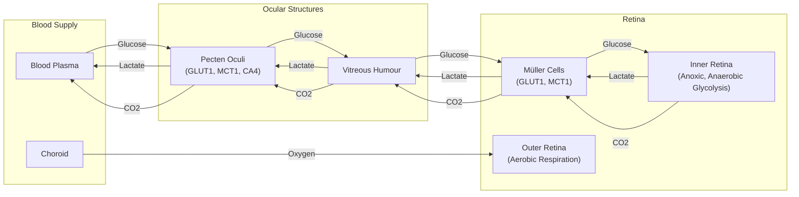

# How Birds See Without Oxygen: A Lesson in Evolutionary Tinkering

In human medicine, a retinal vascular occlusion is a medical emergency. This blockage of blood vessels in the eye starves the neural tissue of oxygen, causing rapid and irreversible blindness. Yet, birds operate with completely avascular retinas, meaning they have no blood vessels at all, while achieving visual acuity that far surpasses our own. This superiority is not just anecdotal; it is quantifiable. Where a human retina has about 200,000 photoreceptors per square millimeter, a house sparrow has 400,000, and a common buzzard has 1,000,000. This density allows for much finer spatial resolution, with some raptors like the wedge-tailed eagle achieving an acuity of 143 cycles per degree (cpd), more than double the human maximum. A hawk can spot a mouse from hundreds of feet in the air, a biological capability that has long puzzled scientists. This avascular design is thought to improve visual sharpness by allowing light to reach the photoreceptors without obstruction, but it comes at a steep physiological price [[6]](https://en.wikipedia.org/wiki/Bird_vision), [[7]](https://pmc.ncbi.nlm.nih.gov/articles/PMC10906485).

The retina is one of the most energy-hungry tissues in the animal kingdom. As a highly specialized extension of the brain, it consumes oxygen and glucose at two to three times the rate of an equivalent mass of brain tissue. In most vertebrates, this intense metabolic demand is met by a dense network of blood vessels that deliver a constant supply of fuel. This is considered essential, as neurons have exceptionally high energy requirements and neural tissue normally dies quickly without oxygen. Birds, however, represent a striking exception. For centuries, this created a paradox: how could birds power such a metabolically demanding organ without a direct blood supply? Scientists assumed there must be some undiscovered mechanism for oxygen acquisition, a mystery that persisted since the 17th-century discovery of a strange structure in the avian eye. As evolutionary physiologist Christian Damsgaard of Aarhus University puts it, “Our starting point was simple. According to everything we know about physiology, this tissue should not be able to function” [[2]](https://uol.de/en/news/article/birds-retinas-function-without-oxygen), [[4]](https://www.quantamagazine.org/how-the-bird-eye-was-pushed-to-an-evolutionary-extreme-20260513).

A recent study finally resolves this long-standing mystery. The inner layers of the bird retina exist in a state of chronic anoxia, a complete lack of oxygen. They survive not through a novel oxygen-delivery system, but by relying on anaerobic glycolysis, a less efficient but effective metabolic pathway. This finding overturns centuries of assumptions and shows that birds have solved a biological paradox by evolving a tolerance for permanent oxygen deprivation in one of their most critical tissues. This discovery frames the avian eye as an evolutionary extreme, an example of how life adapts to survive under intense metabolic constraints. Furthermore, it holds potential lessons for treating human conditions caused by oxygen deprivation, from stroke to ischemic eye diseases [[2]](https://uol.de/en/news/article/birds-retinas-function-without-oxygen), [[10]](https://www.genengnews.com/topics/translational-medicine/how-bird-retinas-function-without-oxygen-may-inform-future-stroke-therapies).
<small><em>The evolutionary physiologist Christian Damsgaard measured gas exchange in bird eyes with microsensors. Surprisingly, the inner retina, a highly active tissue, used no oxygen. - Jesper Ekmann</em></small>

Before you can appreciate how birds solved this paradox, you need to revisit how oxygen came to dominate complex life and why its absence is normally catastrophic.

## Oxygenated Life: The Great Oxidation Event and Metabolic Trade-offs

Around 3.4 billion years ago, cyanobacteria invented photosynthesis and began pumping oxygen, a by-product, into the atmosphere. This triggered the Great Oxidation Event, a period that fundamentally reshaped life on Earth by unlocking a far more efficient method of energy production: aerobic respiration. Oxygen molecules make this process extremely efficient. To extract energy, cells first break down a glucose molecule into two pyruvate molecules. This initial step, known as anaerobic glycolysis, releases only two molecules of adenosine triphosphate (ATP), life’s universal energy currency. A cell lacking oxygen can go no further. However, the presence of oxygen enables a series of further biochemical reactions that break down pyruvate and produce another 30 molecules of ATP. This means aerobic respiration is about 15 times more efficient, a massive advantage that explains the evolutionary lock-in of oxygen dependence across complex multicellular organisms [[4]](https://www.quantamagazine.org/how-the-bird-eye-was-pushed-to-an-evolutionary-extreme-20260513).

The energetic advantage of oxygen was transformative. Once it filled the atmosphere, evolution selected for organisms that could use it, leading to a mass extinction as oxygen-users outcompeted nearly everything else. This new metabolic power allowed for the evolution of complex, multicellular organisms. Oxygen-breathing lifeforms could grow larger, move faster, and develop energy-intensive tissues like brains, which require a constant, high-energy supply. As molecular physiologist Gary Lewin of the Max Delbrück Center in Berlin notes, “We’ve been hooked on 20% [atmospheric] oxygen for millions of years.” This dependency, however, came with a critical vulnerability. Without a steady supply of oxygen, a variety of processes shut down, especially in metabolically demanding tissues. Without that energy, our cells malfunction and die [[4]](https://www.quantamagazine.org/how-the-bird-eye-was-pushed-to-an-evolutionary-extreme-20260513).
<small><em>Birds, such as this alpine chough (in the crow family), use their exceptional vision to hunt, forage, and migrate. - Jean-Paul Wettstein</em></small>

Anoxia tolerance varies widely across the animal kingdom. Humans and most other animals can survive with little or no oxygen for only a few minutes at most before irreversible brain damage occurs. The mammal with the highest known tolerance is the naked mole-rat, which can survive for 18 minutes in anoxic air by switching to a fructose-based anaerobic metabolism, during which its heart rate drops to a steady 50 beats per minute. A few cold-blooded aquatic creatures, like freshwater turtles and goldfish, can persist in low-oxygen conditions for extended periods. For most animals, however, a steady supply of oxygen is non-negotiable. For human brain and retinal tissue, the shutdown is swift. The high energy demands of neurons cannot be met, leading to rapid and irreversible cell death [[1]](https://doi.org/10.1126/science.aab3896), [[4]](https://www.quantamagazine.org/how-the-bird-eye-was-pushed-to-an-evolutionary-extreme-20260513).
<small><em>Naked mole rats can survive without oxygen for 18 minutes. To generate energy without oxygen, they use anaerobic glycolysis fueled by fructose. - Javier Ábalos</em></small>

With this metabolic context established, you can now examine the mysterious vascular structure that enables birds to push the vertebrate eye to an extreme never seen in other lineages.

## A Mysterious Structure: The Pecten Oculi and Chronic Anoxia

At the back of the avian eye lies the pecten oculi, a comb-like, highly vascularized structure that has puzzled scientists since it was first described in the 17th century. Over the centuries, more than 30 hypotheses were proposed for its function, with most centered on the idea that it must be the retina's missing oxygen supply. "Nobody had really done direct physiological measurements on this structure," Damsgaard said. "That’s where we came in" [[4]](https://www.quantamagazine.org/how-the-bird-eye-was-pushed-to-an-evolutionary-extreme-20260513).
<small><em>Mark Belan/ _Quanta Magazine_</em></small>

To test this long-held assumption, Damsgaard’s team performed the first-ever direct physiological measurements inside a bird’s eye. The technical challenge was immense, requiring stable anesthesia while using microsensors with tips just 10-25 microns wide. They measured oxygen levels across the retina of anesthetized zebra finches and found a steep oxygen gradient declining from the choroid, the vascular layer behind the retina. However, almost no oxygen was coming from the pecten. The inner half of the retina showed zero oxygen tension. “Half of the retina lives in a chronic state of anoxia, where there’s no oxygen present at all,” Damsgaard said. This was confirmed by staining for pimonidazole, a marker for tissue hypoxia, which accumulated heavily in the inner retina. The model suggested that the pecten provides only 0.76% of the total retinal oxygen supply. The inner retina remains fully anoxic until the choroid oxygen partial pressure exceeds 150 mmHg, 50% higher than the maximum under normal conditions [[3]](https://doi.org/10.1038/s41586-025-09978-w), [[4]](https://www.quantamagazine.org/how-the-bird-eye-was-pushed-to-an-evolutionary-extreme-20260513).

To understand how this was possible, the researchers turned to spatial transcriptomics, a technique that maps gene activity directly onto tissue sections. This allowed them to create a "molecular GPS" for metabolic pathways. They found a clear metabolic division. Genes for aerobic respiration and oxidative phosphorylation were active only in the oxygenated outer retina, where the photoreceptors are located. In the anoxic inner retina, only genes for anaerobic glycolysis were expressed. This less-efficient pathway demands a huge amount of fuel, which raised another puzzle [[3]](https://doi.org/10.1038/s41586-025-09978-w), [[10]](https://www.genengnews.com/topics/translational-medicine/how-bird-retinas-function-without-oxygen-may-inform-future-stroke-therapies).

Further imaging studies using radiolabeled sugar confirmed the high energy demand. The team found that the bird retina’s glucose uptake is about 2.5 times higher than that of the brain, a massive-scale glycolysis necessary to compensate for a process that is 15 times less efficient than oxygen-based metabolism. This revealed the pecten’s true function as a metabolic gateway. It is rich in glucose transporter 1 (GLUT1) to pump sugar into the vitreous humor, which then diffuses into the retina. Simultaneously, it uses monocarboxylate transporter 1 (MCT1) to remove lactic acid, the toxic byproduct of anaerobic glycolysis. The pecten also appears to help remove CO2, though some researchers note this role deserves more study, as pure anaerobic glycolysis does not produce CO2 [[3]](https://doi.org/10.1038/s41586-025-09978-w), [[8]](https://www.thetransmitter.org/vision/inner-retina-of-birds-powers-sight-sans-oxygen).


Image 5: A flowchart illustrating the metabolic exchange function of the pecten oculi in the avian eye.

The system relies on another key player: Müller cells. These specialized glial cells span the entire thickness of the retina. The research showed that Müller cells highly express both GLUT1 and MCT1, particularly at their "endfeet" which form the boundary with the vitreous humor. This suggests they act as intermediaries, shuttling glucose from the vitreous into the retinal neurons and transporting lactate out. This elegant system connects the pecten's supply line to the metabolic engine of the inner retina [[2]](https://uol.de/en/news/article/birds-retinas-function-without-oxygen), [[3]](https://doi.org/10.1038/s41586-025-09978-w).

The finding that a vertebrate neural tissue can function optimally in a permanent state of anoxia is unprecedented. “The insight that the retina basically goes oxygen-free... is surprising,” said neuroscientist Thomas Baden. “It really gets properly down to zero.” This strategy has parallels to the Warburg effect in cancer cells or temporary anaerobic respiration in our muscles. However, in the bird retina, this is a permanent, healthy adaptation. In the vascularized inner retina of mammals, only about 20% of glucose is converted to lactate. The bird’s inner retina represents a complete reversal of this metabolic strategy [[4]](https://www.quantamagazine.org/how-the-bird-eye-was-pushed-to-an-evolutionary-extreme-20260513), [[9]](https://www.mdpi.com/1422-0067/22/7/3689).
<small><em>The diversity of bird eyes, lacking blood vessels (left to right). Top: Northern gannet, Eurasian eagle-owl, maguari stork. Center: rooster, rockhopper penguin, parrot (species unknown). Bottom: bald eagle, blue-and-yellow macaw, unknown species.

(Left to right) Top: Chris Hellier, Jiří Dočkal, Annette Lozinski. Center: Mohammed Brzan, Nico Marín, Shyamli Kashyap. Bottom: Ingo Doerrie, David Clode, Hasan Almasi</em></small>

Having established how the avian retina operates, you can now trace when and why this radical solution evolved and what it teaches us about selective pressures and future applications.

## Eyes Like a Hawk: Evolutionary Origins, Selective Pressures, and Implications

The bird’s retina and its no-oxygen power system are so unusual that they naturally raise questions about how they could have evolved. Evolution, as biologist François Jacob described in his 1977 essay, works not like an engineer with a preconceived plan, but like a tinkerer. It works on what already exists, either transforming a system to give it new functions or combining several systems to produce a more elaborate one. Rather than inventing a new oxygen-delivery system from scratch, evolution repurposed the ancient vertebrate eye, taking parts that existed long before and reshaping them to fit a new set of needs. The pecten itself is an ancient structure, but its role as a metabolic gateway appears to be a later innovation [[4]](https://www.quantamagazine.org/how-the-bird-eye-was-pushed-to-an-evolutionary-extreme-20260513), [[5]](https://doi.org/10.1126/science.860134).

By comparing oxygen levels in the retinas of birds with their reptilian relatives—like the Chinese pond turtle and broad-snouted caiman—researchers pinpointed the evolutionary timing of this adaptation. Reptile retinas showed normal oxygen levels and no signs of anaerobic glycolysis. This suggests the anoxic retina and the metabolic function of the pecten oculi arose in the theropod dinosaur lineage after they diverged from crocodilians. This innovation coincided with a measurable thickening of the retina. The pecten's vascular structure is ancient, originating before the diversification of reptiles, but its specialized role in metabolic support appears to be a later adaptation that coincided with the retina becoming anoxic [[3]](https://doi.org/10.1038/s41586-025-09978-w), [[8]](https://www.thetransmitter.org/vision/inner-retina-of-birds-powers-sight-sans-oxygen).

```mermaid
graph TD
    "Ancestral Reptile" --> "Crocodilians"
    "Ancestral Reptile" --> "Theropod Dinosaurs"
    "Theropod Dinosaurs" --> "Emergence of Anoxic Retina & Pecten Oculi"
    "Emergence of Anoxic Retina & Pecten Oculi" --> "Retinal Thickening"
    "Retinal Thickening" --> "Modern Birds"
```
Image 7: Phylogenetic tree illustrating the evolutionary origin of the anoxic retina and pecten oculi in birds.

The primary selective driver was likely the intense pressure for high-acuity vision. For predators, foragers, and long-distance migrants, sharp eyesight is a matter of survival. Damsgaard speculates, “I think the system evolved in theropod dinosaurs in response to selection for sharp vision for tracking prey and identifying mates.” Later, when birds took to the skies, this system “served as the physiological basis for maintaining retinal function” during high-altitude flights where oxygen levels are low. Blood vessels, however, scatter light, which would have limited the density at which neurons and photoreceptors could be packed. By eliminating intra-retinal vessels, birds could evolve thicker, denser retinas, directly enabling sharper resolution [[4]](https://www.quantamagazine.org/how-the-bird-eye-was-pushed-to-an-evolutionary-extreme-20260513).

This functional advantage is significant. As mentioned in the introduction, the removal of blood vessels permitted a dramatic increase in the density of both photoreceptors and ganglion cells. This anatomical change directly translates to the ability to resolve finer details at greater distances, a critical advantage for a soaring predator [[7]](https://pmc.ncbi.nlm.nih.gov/articles/PMC10906485). It remains an open question whether the vessel-free retina was a direct adaptation for superior vision or an evolutionary coincidence that was later co-opted for challenges like high-altitude flight. This is a case of exaptation, where a trait evolved for one purpose is later used for another. Caution is warranted, as researchers like Lewin point out that the initial study did not include any migratory species, whose metabolic needs during high-altitude flight present an even more extreme challenge. Therefore, while the evidence is compelling, it is important not to overextend the interpretations to every bird species without further research [[4]](https://www.quantamagazine.org/how-the-bird-eye-was-pushed-to-an-evolutionary-extreme-20260513).

The implications of this discovery stretch into biomedicine. Many devastating human conditions, like stroke, are caused by a drop in oxygen delivery to tissues. Human brains can tolerate maybe a minute of total anoxia before irreversible damage occurs. In these situations, tissues suffer not only from oxygen deprivation but also from the toxic accumulation of metabolic waste. By studying how creatures like birds and naked mole-rats have evolved to tolerate low-oxygen conditions, scientists can gain insight into how tissues can be protected. As Jens Randel Nyengaard notes, “Nature has solved a physiological problem in birds that makes humans sick. We hope that understanding this evolutionary solution can inspire new ways of thinking about why tissues fail under oxygen deprivation... and how such diseases can be treated.” The study provides a new model for how neural tissue can function without oxygen, challenging textbook knowledge. “Maybe we can get inspiration for how nature solved these problems,” Damsgaard said. “There’s so much to be learned from these animals that are able to do something that we cannot do” [[4]](https://www.quantamagazine.org/how-the-bird-eye-was-pushed-to-an-evolutionary-extreme-20260513), [[10]](https://www.genengnews.com/topics/translational-medicine/how-bird-retinas-function-without-oxygen-may-inform-future-stroke-therapies).

## References

- [1] Fructose-driven glycolysis supports anoxia resistance in the naked mole-rat (https://doi.org/10.1126/science.aab3896)
- [2] Birds retinas function without oxygen (https://uol.de/en/news/article/birds-retinas-function-without-oxygen)
- [3] Oxygen-free metabolism in the bird inner retina supported by the pecten (https://doi.org/10.1038/s41586-025-09978-w)
- [4] How the Bird Eye Was Pushed to an Evolutionary Extreme (https://www.quantamagazine.org/how-the-bird-eye-was-pushed-to-an-evolutionary-extreme-20260513)
- [5] Evolution and Tinkering (https://doi.org/10.1126/science.860134)
- [6] Bird vision (https://en.wikipedia.org/wiki/Bird_vision)
- [7] Ecological and morphological correlates of visual acuity in birds (https://pmc.ncbi.nlm.nih.gov/articles/PMC10906485)
- [8] Inner retina of birds powers sight sans oxygen (https://www.thetransmitter.org/vision/inner-retina-of-birds-powers-sight-sans-oxygen)
- [9] Energy Metabolism in the Inner Retina in Health and Glaucoma (https://www.mdpi.com/1422-0067/22/7/3689)
- [10] How Bird Retinas Function Without Oxygen May Inform Future Stroke Therapies (https://www.genengnews.com/topics/translational-medicine/how-bird-retinas-function-without-oxygen-may-inform-future-stroke-therapies)
</article>