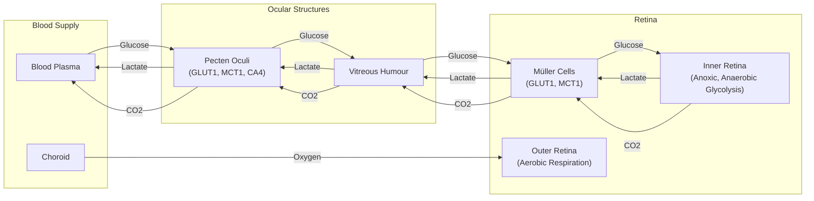

# How Birds See Without Oxygen: A Lesson in Evolutionary Tinkering

In human medicine, a retinal vascular occlusion—a blockage of the blood vessels in the eye—is a medical emergency that can cause rapid and irreversible blindness. Yet, birds operate with completely avascular retinas, meaning they have no blood vessels at all, while achieving visual acuity that far surpasses our own. This superiority is not just anecdotal; it's quantifiable. Where a human retina has about 200,000 photoreceptors per square millimeter, a house sparrow has 400,000, and a common buzzard has 1,000,000 [[6]](https://en.wikipedia.org/wiki/Bird_vision). This density allows for much finer spatial resolution, with some raptors like the wedge-tailed eagle achieving an acuity of 143 cycles per degree (cpd), more than double the human maximum [[7]](https://pmc.ncbi.nlm.nih.gov/articles/PMC10906485). A hawk can spot a mouse from hundreds of feet in the air, a feat of biological engineering that has long puzzled scientists.

The retina is one of the most energy-hungry tissues in the animal kingdom, consuming oxygen and glucose at two to three times the rate of the brain. For centuries, this created a paradox: how could birds power such a metabolically demanding organ without a direct blood supply? Scientists assumed there must be some undiscovered mechanism for oxygen acquisition. As evolutionary physiologist Christian Damsgaard of Aarhus University puts it, “According to everything we know about physiology, this tissue should not be able to function.”

A recent study finally resolves this long-standing mystery. The inner layers of the bird retina exist in a state of chronic anoxia—a complete lack of oxygen. They survive not through a novel oxygen-delivery system, but by relying on anaerobic glycolysis, a less efficient but effective metabolic pathway. This discovery frames the avian eye as an evolutionary extreme, a masterclass in how life adapts to survive under intense metabolic constraints, and it holds potential lessons for treating human conditions caused by oxygen deprivation, from stroke to ischemic eye diseases.
Image 1: The evolutionary physiologist Christian Damsgaard measured gas exchange in bird eyes with microsensors. Surprisingly, the inner retina, a highly active tissue, used no oxygen. (Image by Jesper Ekmann)

Before we can appreciate how birds solved this paradox, we need to revisit how oxygen came to dominate complex life and why its absence is normally catastrophic.

## Oxygenated Life: The Great Oxidation Event and Metabolic Trade-offs

Billions of years ago, the rise of cyanobacteria triggered the Great Oxidation Event, pumping oxygen into the atmosphere and fundamentally reshaping life on Earth. This shift unlocked a far more efficient method of energy production: aerobic respiration. While the ancient pathway of anaerobic glycolysis yields a mere 2 molecules of ATP per molecule of glucose, aerobic respiration can produce up to 32.

This enormous energetic advantage allowed for the evolution of complex, multicellular organisms. Oxygen-breathing lifeforms could grow larger, move faster, and develop energy-intensive tissues like brains. As molecular physiologist Gary Lewin of the Max Delbrück Center in Berlin notes, “We’ve been hooked on 20% [atmospheric] oxygen for millions of years.” This dependency, however, came with a critical vulnerability. When oxygen is cut off, our most active tissues fail catastrophically.
Image 2: Birds, such as this alpine chough (in the crow family), use their exceptional vision to hunt, forage, and migrate. (Image by Jean-Paul Wettstein)

Anoxia tolerance varies across the animal kingdom. Humans suffer irreversible brain damage within minutes. The naked mole-rat, a subterranean rodent living in hypoxic burrows, can survive for 18 minutes without oxygen by switching to a fructose-based anaerobic metabolism [[1]](https://doi.org/10.1126/science.aab3896). Some turtles can endure months or even years of anoxia by drastically suppressing their metabolism. For human brain and retinal tissue, however, the shutdown is swift. The high energy demands of neurons cannot be met, leading to cell death.
Image 3: Naked mole rats can survive without oxygen for 18 minutes. To generate energy without oxygen, they use anaerobic glycolysis fueled by fructose. (Image by Javier Ábalos)

With this metabolic context established, we can now examine the mysterious vascular structure that enables birds to push the vertebrate eye to an extreme never seen in other lineages.

## A Mysterious Structure: The Pecten Oculi and Chronic Anoxia

At the back of the avian eye lies the pecten oculi, a comb-like, highly vascularized structure that has puzzled scientists since it was first described in the 17th century. Over the centuries, more than 30 hypotheses were proposed for its function, with most centered on the idea that it must be the retina's missing oxygen supply. "The pecten is not an oxygen supplier,” says Damsgaard. “It is a transport system for fuel in and waste out" [[2]](https://uol.de/en/news/article/birds-retinas-function-without-oxygen).
Image 4: The structure of the avian eye, including the pecten oculi, which supports the retina's unique metabolism. (Image by Mark Belan/ Quanta Magazine)

To test this long-held assumption, Damsgaard’s team performed the first-ever direct physiological measurements inside a bird’s eye. Using microsensors with tips just a few microns wide, they carefully measured oxygen levels across the retina of anesthetized zebra finches. The results were stunning. They found a steep oxygen gradient declining from the choroid—the vascular layer behind the retina—but almost no oxygen coming from the pecten. The inner half of the retina, where most of the neural processing occurs, showed zero oxygen tension [[3]](https://doi.org/10.1038/s41586-025-09978-w). “Half of the retina lives in a chronic state of anoxia, where there’s no oxygen present at all,” Damsgaard said [[4]](https://www.quantamagazine.org/how-the-bird-eye-was-pushed-to-an-evolutionary-extreme-20260513).

To understand how this was possible, the researchers turned to spatial transcriptomics, a technique that maps gene activity directly onto tissue sections. They found a clear metabolic division. Genes for aerobic respiration were active only in the oxygenated outer retina, where the photoreceptors are located. In the anoxic inner retina, only genes for anaerobic glycolysis were expressed [[3]](https://doi.org/10.1038/s41586-025-09978-w). This less-efficient pathway demands a huge amount of fuel. The team found that the bird retina’s glucose uptake is about 2.5 times higher than that of the brain [[3]](https://doi.org/10.1038/s41586-025-09978-w). This massive-scale glycolysis is necessary to compensate for a process that is about 15 times less efficient than oxygen-based metabolism [[8]](https://www.thetransmitter.org/vision/inner-retina-of-birds-powers-sight-sans-oxygen).

This is where the pecten’s true function was revealed. Instead of supplying oxygen, it acts as a metabolic gateway. It is rich in glucose transporters (GLUT1) that pump sugar from the blood into the vitreous humor, the gel-like substance filling the eye, which then diffuses into the retina. At the same time, the pecten uses lactate transporters (MCT1) to remove lactic acid, the toxic byproduct of anaerobic glycolysis, preventing its buildup [[3]](https://doi.org/10.1038/s41586-025-09978-w). The pecten also appears to help remove CO2, though some researchers note this role deserves more study, as pure anaerobic glycolysis does not produce CO2 [[8]](https://www.thetransmitter.org/vision/inner-retina-of-birds-powers-sight-sans-oxygen).


Image 5: A flowchart illustrating the metabolic exchange function of the pecten oculi in the avian eye.

The finding that a vertebrate neural tissue can not only survive but thrive in a permanent state of anoxia is unprecedented. “The insight that the retina basically goes oxygen-free, at least in some layers, is surprising,” said Thomas Baden, a neuroscientist at the University of Sussex. “It really gets properly down to zero” [[4]](https://www.quantamagazine.org/how-the-bird-eye-was-pushed-to-an-evolutionary-extreme-20260513). This strategy has parallels to the Warburg effect, where cancer cells favor glycolysis even when oxygen is present, or the temporary anaerobic respiration in our muscles during intense exercise. The adaptation is even more striking when compared to other vertebrate retinas. In the vascularized inner retina of mammals, for instance, only about 20% of glucose is converted to lactate, with the tissue relying primarily on aerobic respiration. The bird’s inner retina represents a complete reversal of this metabolic strategy [[9]](https://www.mdpi.com/1422-0067/22/7/3689). However, in the bird retina, this is a permanent, healthy adaptation for life.
Image 6: The diversity of bird eyes, lacking blood vessels (left to right). Top: Northern gannet, Eurasian eagle-owl, maguari stork. Center: rooster, rockhopper penguin, parrot (species unknown). Bottom: bald eagle, blue-and-yellow macaw, unknown species. (Images by Chris Hellier, Jiří Dočkal, Annette Lozinski, Mohammed Brzan, Nico Marín, Shyamli Kashyap, Ingo Doerrie, David Clode, Hasan Almasi)

Having established how the avian retina operates, we can now trace when and why this radical solution evolved and what it teaches us about selective pressures and future applications.

## Eyes Like a Hawk: Evolutionary Origins, Selective Pressures, and Implications

The bird’s retina and its no-oxygen power system are so unusual that they naturally raise questions about how they could have evolved. Evolution, as biologist François Jacob famously described it in 1977, works not like an engineer with a blueprint, but like a tinkerer who cobbles together solutions from available parts [[5]](https://doi.org/10.1126/science.860134). Rather than inventing a new oxygen-delivery system from scratch, evolution repurposed the ancient vertebrate eye.

The anoxic retina and the metabolic function of the pecten oculi appear to have originated in the theropod dinosaur lineage, the ancestors of modern birds, after they diverged from crocodilians. This evolutionary innovation coincided with a significant thickening of the retina [[3]](https://doi.org/10.1038/s41586-025-09978-w). The pecten's vascular structure itself is ancient, originating before the diversification of reptiles. However, its specialized role in metabolic support—pumping in glucose and removing waste—appears to be a later adaptation that coincided with the retina becoming anoxic [[8]](https://www.thetransmitter.org/vision/inner-retina-of-birds-powers-sight-sans-oxygen).

```mermaid
graph TD
    "Ancestral Reptile" --> "Crocodilians"
    "Ancestral Reptile" --> "Theropod Dinosaurs"
    "Theropod Dinosaurs" --> "Emergence of Anoxic Retina & Pecten Oculi"
    "Emergence of Anoxic Retina & Pecten Oculi" --> "Retinal Thickening"
    "Retinal Thickening" --> "Modern Birds"
```
Image 7: Phylogenetic tree illustrating the evolutionary origin of the anoxic retina and pecten oculi in birds.

The primary selective driver was likely the intense pressure for high-acuity vision. For predators, foragers, and long-distance migrants, sharp eyesight is a matter of survival. Blood vessels, however, scatter light, which would have limited the density at which neurons and photoreceptors could be packed. By eliminating intra-retinal vessels, birds could evolve thicker, denser retinas, directly enabling sharper resolution. This increase in density is dramatic: while the human retina contains around 200,000 photoreceptors per square millimeter, a common buzzard’s has 1,000,000 [[6]](https://en.wikipedia.org/wiki/Bird_vision). This allows for visual acuity more than double that of humans, with some eagles reaching 143 cycles per degree (cpd) compared to a human maximum of around 60 [[7]](https://pmc.ncbi.nlm.nih.gov/articles/PMC10906485).

It remains an open question whether the vessel-free retina was a direct adaptation for superior vision or an evolutionary coincidence that was later co-opted for challenges like high-altitude flight, where oxygen is scarce. This caution is warranted, as the initial study did not include migratory species, whose metabolic needs during high-altitude flight present an even more extreme challenge [[4]](https://www.quantamagazine.org/how-the-bird-eye-was-pushed-to-an-evolutionary-extreme-20260513).

This discovery has significant biomedical implications. Understanding the molecular mechanisms that protect the bird retina from the toxic byproducts of anaerobic metabolism and prevent cell death could inspire new treatments for human conditions rooted in oxygen deprivation. As Jens Randel Nyengaard, a professor of clinical medicine at Aarhus University, notes, “Nature has solved a physiological problem in birds that makes humans sick” [[10]](https://www.genengnews.com/topics/translational-medicine/how-bird-retinas-function-without-oxygen-may-inform-future-stroke-therapies). By studying nature’s solutions to extreme physiological challenges, we may find new ways to protect our own vulnerable tissues. As Damsgaard suggests, this work could lead to therapies that help "tissues survive long-term oxygen deprivation," offering hope for patients suffering from ischemic diseases.

## References

- [1] https://doi.org/10.1126/science.aab3896
- [2] https://uol.de/en/news/article/birds-retinas-function-without-oxygen
- [3] https://doi.org/10.1038/s41586-025-09978-w
- [4] https://www.quantamagazine.org/how-the-bird-eye-was-pushed-to-an-evolutionary-extreme-20260513
- [5] https://doi.org/10.1126/science.860134
- [6] https://en.wikipedia.org/wiki/Bird_vision
- [7] https://pmc.ncbi.nlm.nih.gov/articles/PMC10906485
- [8] https://www.thetransmitter.org/vision/inner-retina-of-birds-powers-sight-sans-oxygen
- [9] https://www.mdpi.com/1422-0067/22/7/3689
- [10] https://www.genengnews.com/topics/translational-medicine/how-bird-retinas-function-without-oxygen-may-inform-future-stroke-therapies