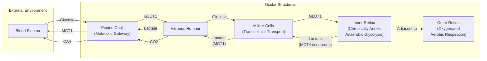
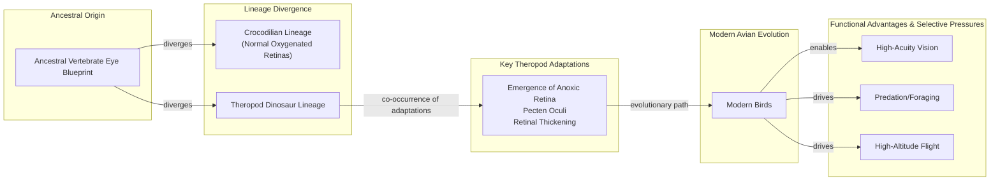

# How Birds See Without Oxygen: A Lesson in Evolutionary Tinkering

In humans, a blocked retinal artery is a medical emergency. Deprived of oxygen, the light-sensing tissue at the back of the eye begins to die within minutes, leading to irreversible blindness. Yet, birds operate with retinas that have no blood vessels at all. This avascular design, which should be a catastrophic failure, somehow supports visual acuity so sharp that a hawk can spot a lizard from hundreds of feet in the air.

This biological contradiction has puzzled scientists for centuries. The retina is one of the most energy-hungry tissues in the body, consuming oxygen and glucose at two to three times the rate of the brain [[1]](#1). Without a direct blood supply, how could it possibly function? The long-standing assumption was that birds must possess some undiscovered mechanism for acquiring oxygen. As evolutionary physiologist Christian Damsgaard of Aarhus University notes, "According to everything we know about physiology, this tissue should not be able to function" [[2]](#2).

A recent study finally resolves this paradox, and the answer is more radical than anyone expected. The inner layers of the bird retina exist in a permanent state of oxygen deprivation, or anoxia. Instead of evolving a novel way to deliver oxygen, birds evolved a way to live without it, fueling their vision through a process called anaerobic glycolysis [[2]](#2).

Image 1: The evolutionary physiologist Christian Damsgaard measured gas exchange in bird eyes with microsensors. Surprisingly, the inner retina, a highly active tissue, used no oxygen. (Source: Jesper Ekmann [[3]](#3))

This discovery reveals an evolutionary extreme in metabolic survival, offering a new perspective on how tissues can function under constraints once thought impossible. The mechanisms that allow the bird retina to thrive without oxygen have direct implications for treating human conditions caused by oxygen deprivation, such as stroke and ischemic retinal disease [[2]](#2), [[4]](#4). Before we can appreciate how birds solved this puzzle, we need to revisit how oxygen came to dominate complex life and why its absence is normally so catastrophic.

## Oxygenated Life: The Great Oxidation Event and Metabolic Trade-offs

Roughly 2.4 billion years ago, early cyanobacteria began releasing oxygen into the atmosphere as a byproduct of photosynthesis. This Great Oxidation Event fundamentally reshaped Earth’s chemistry, wiping out many anaerobic organisms and paving the way for a new, far more efficient way of producing energy. While anaerobic glycolysis, a metabolic pathway that predates this event, yields a mere two molecules of ATP per molecule of glucose, aerobic respiration can generate up to 32 [[5]](#5).

This enormous energetic advantage allowed for the evolution of large, complex, multicellular organisms. From insects to mammals, nearly all complex life became dependent on a steady supply of oxygen. As molecular physiologist Gary Lewin puts it, “We’ve been hooked on 20% [atmospheric] oxygen for millions of years” [[6]](#6). This dependency, however, created a critical vulnerability. In mammals, this vulnerability is acute in the retina, where biochemical barriers like the blood-retinal barrier and low expression of key glycolytic enzymes such as PKM2 lock the inner retinal tissue into aerobic metabolism [[7]](#7). It cannot switch to high-rate anaerobic glycolysis to survive. When oxygen is cut off, these energy-intensive tissues fail rapidly.

Image 2: Birds, such as this alpine chough (in the crow family), use their exceptional vision to hunt, forage, and migrate. (Source: Jean-Paul Wettstein [[3]](#3))

The spectrum of anoxia tolerance across the animal kingdom highlights how extreme the bird’s adaptation is. Humans suffer irreversible brain damage within minutes of oxygen deprivation [[2]](#2). The naked mole rat, a subterranean rodent living in hypoxic burrows, can survive for 18 minutes without oxygen by switching to a fructose-based anaerobic metabolism [[6]](#6). Some turtles can endure months or even years of anoxia by drastically suppressing their metabolism. Diving mammals employ a different strategy of metabolic depression, using hypometabolism and induced hypothermia to drastically reduce the brain's oxygen demand during long dives, thereby conserving their limited oxygen stores [[8]](#8). But no vertebrate was known to keep a highly active neural tissue running permanently without oxygen.

Image 3: Naked mole rats can survive without oxygen for 18 minutes. To generate energy without oxygen, they use anaerobic glycolysis fueled by fructose. (Source: Javier Ábalos [[3]](#3))

With this metabolic context established, we can now examine the mysterious vascular structure that enables birds to push the vertebrate eye to an extreme never seen in other lineages.

## A Mysterious Structure: The Pecten Oculi and Chronic Anoxia

At the heart of this story is the pecten oculi, a strange, comb-like structure rich in blood vessels that protrudes into the vitreous humor of the bird eye. First described in the 17th century, its function has been the subject of speculation for hundreds of years, generating more than 30 competing hypotheses [[2]](#2). While unique to birds, smaller, analogous vascular structures exist in other vertebrates, such as the conus papillaris in lizards and the falciform process in teleost fish [[8]](#8). "The pecten is not an oxygen supplier,” says Jens Randel Nyengaard, a senior author on the study. “It is a transport system for fuel in and waste out” [[9]](#9). The prevailing theory was that it must be the source of the retina's oxygen.

Image 4: A diagram of a bird's eye, highlighting the pecten oculi. (Source: Mark Belan/Quanta Magazine [[3]](#3))

To finally test this, Damsgaard’s team performed the technically challenging feat of inserting microsensors into the eyes of anesthetized birds to measure oxygen levels directly. The results were completely unexpected. They found that while the outer retina, near the oxygen-rich choroid tissue, was oxygenated, the inner half of the retina had an oxygen tension of zero [[3]](#3), [[10]](#10). "Half of the retina lives in a chronic state of anoxia, where there’s no oxygen present at all," Damsgaard said [[3]](#3). As Nyengaard puts it, “We are essentially collapsing one house of cards and replacing it with another” [[10]](#10).

This finding was confirmed using spatial transcriptomics, a technique that maps gene activity across tissue. The data revealed a clear metabolic division: genes for aerobic respiration were active only in the oxygenated outer retina, while genes for anaerobic glycolysis were exclusively active in the anoxic inner layers [[2]](#2). This anaerobic lifestyle comes at a cost. Because it is so inefficient, the inner retina demands 2.5 times more glucose than other parts of the bird brain to meet its energy needs [[1]](#1), [[2]](#2). The team confirmed this massive glucose consumption using radiolabeled sugar and autoradiography to trace its path through the tissue [[10]](#10).

This is where the pecten oculi comes in. Instead of supplying oxygen, it acts as a metabolic gateway. Genetic analysis showed that the pecten has high expression of glucose transporters, which pump massive amounts of sugar into the eye to fuel the retina [[11]](#11), [[12]](#12). As a byproduct, anaerobic glycolysis produces lactic acid, which can become toxic. The researchers also found that genes for lactate transporters are highly active in the pecten, allowing it to efficiently remove this waste product and prevent buildup [[3]](#3), [[13]](#13). This process is aided by Müller glial cells, which form a bridge between the inner retina and the vitreous humor, expressing transporters that shuttle lactate out toward the pecten for removal [[8]](#8).

Image 5: The diversity of bird eyes, lacking blood vessels (left to right). Top: Northern gannet, Eurasian eagle-owl, maguari stork. Center: rooster, rockhopper penguin, parrot (species unknown). Bottom: bald eagle, blue-and-yellow macaw, unknown species. (Source: Chris Hellier, Jiří Dočkal, Annette Lozinski, Mohammed Brzan, Nico Marín, Shyamli Kashyap, Ingo Doerrie, David Clode, Hasan Almasi [[3]](#3))

The conclusion was unavoidable: roughly half of the bird's retina exists in a state of permanent, healthy anoxia, a metabolic strategy never before documented in any vertebrate tissue. Thomas Baden, a neuroscientist at the University of Sussex, commented on the finding: “The insight that the retina basically goes oxygen-free, at least in some layers, is surprising. … It really gets properly down to zero” [[3]](#3). While cancer cells use a similar process known as the Warburg effect, and our muscles resort to it temporarily during intense exercise, this is the first known instance of a vertebrate tissue thriving this way for a lifetime [[3]](#3).

Image 6: Flowchart illustrating metabolic exchange in the bird eye, focusing on glucose, lactate, and CO2 transport pathways involving the pecten oculi and Müller cells.

Having established how the avian retina operates, we can now trace when and why this radical solution evolved and what it teaches us about selective pressures and future applications.

## Eyes Like a Hawk: Evolutionary Origins, Selective Pressures, and Implications

The bird’s retina and its no-oxygen power system are so unusual that they naturally raise questions about how they could have evolved. Evolution, as biologist François Jacob wrote in 1977, works not like an engineer with a blueprint, but like a tinkerer who cobbles together solutions from whatever parts are available [[14]](#14). Rather than inventing a new oxygen-delivery system from scratch, evolution repurposed the ancient vertebrate eye blueprint.

Phylogenetic analysis pinpoints the origin of this adaptation to the theropod dinosaur lineage, after its split from crocodilians. This evolutionary step coincided with a measurable thickening of the retina, suggesting the two traits evolved in tandem [[2]](#2). The primary driver for this change was likely an intense selective pressure for high-acuity vision. Predation, foraging, and navigating during long-distance or high-altitude flights all demand exceptional eyesight [[4]](#4). Blood vessels, however, scatter light, which would have limited how densely neurons could be packed.

By eliminating blood vessels from the retina, birds were able to pack photoreceptors and ganglion cells more densely, directly enabling sharper, higher-resolution vision [[15]](#15). The pecten, a structure already present, was repurposed to handle the metabolic consequences. Research suggests that while the vasculature that forms the pecten is an ancient reptilian structure, it only gained its crucial role in metabolic support when the retina became anoxic in the theropod lineage [[8]](#8). This represents a classic case of exaptation, an evolutionary process where a trait that evolved for one purpose is later co-opted for another. In this case, the avascular retina developed for sharp vision may have later proved essential for maintaining function during the high-altitude, low-oxygen flights of modern birds [[8]](#8).

It is an open question whether the vessel-free retina was a direct adaptation for better vision or an evolutionary coincidence that was later co-opted. The co-occurrence of retinal thickening and the emergence of the pecten's metabolic function suggests they evolved together under strong selective pressure [[2]](#2). However, some researchers caution against overextending these findings to all bird species. As physiologist Gary Lewin notes, the current research has not examined migratory birds, and it remains to be seen if this unique metabolic system is universal across all avians [[3]](#3).

Image 7: A phylogenetic tree illustrating the evolutionary origins of the avian anoxic retina and pecten oculi, showing divergence from an ancestral vertebrate eye blueprint, key theropod adaptations, and modern avian functional advantages.

The biomedical payoff of this research is significant. Insights from the anoxia tolerance of birds and naked mole rats offer potential pathways for treating human conditions where oxygen deprivation causes tissue damage. “In conditions like stroke, human tissues suffer because oxygen delivery is reduced and metabolic waste accumulates,” Nyengaard says. “In the bird retina, we see a system that copes with oxygen deprivation in a very different way” [[9]](#9). Understanding these natural solutions could inspire future medical interventions that help protect human neural tissue from hypoxic injury. In the future, it might even inform gene therapies aimed at engineering human tissues with greater hypoxia tolerance, for example by enhancing glucose delivery in retinal implants, though significant translational challenges remain [[11]](#11). Nature, through the relentless process of tinkering, has already solved some of our most pressing medical challenges. We just have to know where to look.

## References

- [1] https://www.quantamagazine.org/how-the-bird-eye-was-pushed-to-an-evolutionary-extreme-20260513
- [2] https://www.nature.com/articles/s41586-025-09978-w
- [3] https://www.quantamagazine.org/how-the-bird-eye-was-pushed-to-an-evolutionary-extreme-20260513
- [4] https://www.sdu.dk/en/om-sdu/fakulteterne/naturvidenskab/nyheder-2026/bird-retina
- [5] https://doi.org/10.1016/j.cub.2025.12.028
- [6] https://doi.org/10.1126/science.aab3896
- [7] https://www.frontiersin.org/journals/cell-and-developmental-biology/articles/10.3389/fcell.2020.00266/full
- [8] https://www.thetransmitter.org/vision/inner-retina-of-birds-powers-sight-sans-oxygen
- [9] https://uol.de/en/news/article/birds-retinas-function-without-oxygen
- [10] https://www.genengnews.com/topics/translational-medicine/how-bird-retinas-function-without-oxygen-may-inform-future-stroke-therapies
- [11] https://www.eurekalert.org/news-releases/1113036
- [12] https://bio.au.dk/en/about-biology/news-and-events/show/artikel/fugles-nethinder-lever-uden-ilt-aarhundredgammelt-biologisk-mysterium-er-opklaret
- [13] https://www.thetransmitter.org/vision/inner-retina-of-birds-powers-sight-sans-oxygen
- [14] https://doi.org/10.1126/science.860134
- [15] https://doi.org/10.1371/journal.pone.0008992