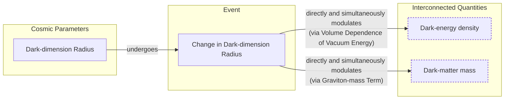

# The Dark Tango: Are Dark Matter and Dark Energy a Coupled Duo?

Our universe is overwhelmingly composed of ingredients we cannot see. Roughly 70% is dark energy, the mysterious force driving cosmic expansion, and 25% is dark matter, the unseen scaffolding upon which galaxies are built. The remaining 5% is the ordinary baryonic matter that forms stars, planets, and ourselves. These dark components are semantically invisible; they neither emit nor absorb light, making direct observation impossible [[1]](https://www.pnas.org/doi/10.1073/pnas.2524499122).

For decades, the standard model of cosmology, Lambda-CDM (ΛCDM), has treated dark energy and dark matter as independent phenomena. In this view, dark energy is a cosmological constant. It is an unvarying property of spacetime itself. However, emerging observational evidence is beginning to challenge this assumption, suggesting the two may be physically intertwined through a shared origin or a direct interaction [[2]](https://www.quantamagazine.org/a-dark-dimension-could-link-two-of-the-universes-great-unknowns-20260622).

The latest results from the Dark Energy Spectroscopic Instrument (DESI) collaboration are at the heart of this shift. As a Stage IV spectroscopic dark energy project involving 800 scientists, DESI has constructed the largest 3D map of the universe ever, cataloging over 14 million galaxies and quasars [[3]](https://indico.global/event/15767/contributions/138193/attachments/65687/127027/2025.12%20DPF%20Dark%20Energy%20and%20Cosmology%20v1%20(B%20Field).pdf). The 2025 data from this survey indicates that dark energy's strength has not been constant. Instead, it appears to have peaked around two billion years ago and has weakened since [[4]](https://www.ohio.edu/news/2025/03/universe-might-be-changing-new-desi-data-shows-dark-energy-may-evolve-over-time). The statistical significance of this finding, which was already intriguing at the three-sigma level in its first year, has now strengthened to between 2.8 and 4.2 sigma, compelling the scientific community to take the possibility of evolving dark energy seriously [[1]](https://www.pnas.org/doi/10.1073/pnas.2524499122).

The data even hints that dark energy could have been growing stronger in an earlier cosmic era. This behavior, known as a "phantom regime," is akin to a ball spontaneously rolling uphill, seemingly creating energy from nothing and violating fundamental conservation laws [[2]](https://www.quantamagazine.org/a-dark-dimension-could-link-two-of-the-universes-great-unknowns-20260622). This apparent paradox has invigorated theorists to explore models where the dark sectors are connected. If dark energy can draw energy from dark matter, its density could increase over time without violating physical laws. The phantom behavior becomes an illusion, a sign of an interaction we failed to account for.

As particle physicist Tim Tait notes, while scientists have long assumed the two are unrelated, "you can imagine a case where one influences the other. And it would not be surprising if [they] were manifestations of a kind of unified theory of the dark universe" [[2]](https://www.quantamagazine.org/a-dark-dimension-could-link-two-of-the-universes-great-unknowns-20260622).

We will next examine concrete dark-interaction models that turn this phantom appearance into a bookkeeping artifact and, in doing so, simultaneously offer a potential resolution to the long-standing Hubble tension.

## Dark Interactions

From a theoretical standpoint, the hints from DESI are not entirely surprising. Physicists have long been uncomfortable with a static cosmological constant for several reasons. These include the famous cosmological constant problem (a 120-order-of-magnitude discrepancy between theory and observation), the potential for instabilities in spacetime, and constraints from quantum gravity theories like superstring theory, which struggle to accommodate a constant, positive dark energy [[5]](https://cerncourier.com/four-reasons-dark-energy-should-evolve-with-time).

### The Phantom Menace: A Bookkeeping Artifact

The idea of a coupled dark sector is not new. In 2005, a model proposed by Justin Khoury and colleagues asked a hypothetical question: could dark energy's density increase over time by drawing energy from dark matter [[5]](https://cerncourier.com/four-reasons-dark-energy-should-evolve-with-time)? They found that such an interaction could produce what looked like phantom behavior without actually violating energy conservation. This arises because the interaction alters the redshift-dependence of the matter density. An observer who fits the data treating the dark matter as non-interacting will infer an effective dark energy fluid with an equation of state parameter, w, less than -1. "It is the most natural, simplest way of achieving this," Khoury explained [[2]](https://www.quantamagazine.org/a-dark-dimension-could-link-two-of-the-universes-great-unknowns-20260622).

An alternative model published in January 2025 proposes that dark matter transferred a small fraction of its energy to dark energy in a past cosmic era [[6]](https://www.pnas.org/doi/10.1073/pnas.2524499122). As one of the authors, cosmologist Elsa Teixeira, explained, "Dark matter is the main brake on [the universe’s] expansion," so easing up on that brake would naturally cause cosmic expansion to accelerate [[2]](https://www.quantamagazine.org/a-dark-dimension-could-link-two-of-the-universes-great-unknowns-20260622).

Physicist David Andriot argues that the appearance of phantom behavior is simply a result of bookkeeping. "Any change or evolution of the mass of dark matter has been put into the box of dark energy," he said [[2]](https://www.quantamagazine.org/a-dark-dimension-could-link-two-of-the-universes-great-unknowns-20260622). When cosmologists analyze data, they typically assume dark matter's contribution evolves in a fixed way. If its mass is actually changing, that unaccounted-for evolution gets incorrectly attributed to dark energy, making it seem phantom-like [[7]](https://arxiv.org/abs/2505.10410).

Harvard physicist Cumrun Vafa agrees, stating that the very premise of treating the two as separable is flawed. "The notion that you can compute dark energy independently of dark matter is wrong," he said. "That assumption, often made by cosmologists and also followed by the DESI team, led to the physically unacceptable phantom behavior" [[2]](https://www.quantamagazine.org/a-dark-dimension-could-link-two-of-the-universes-great-unknowns-20260622). This bookkeeping error has tangible consequences, introducing mathematical inconsistencies into cosmological simulations and requiring modifications to computational tools that model the early universe [[8]](https://www.osti.gov/servlets/purl/2582556).

### A Dark Sector QCD Analogue

Building on these ideas, the DESI findings spurred Khoury and his colleagues Meng-Xiang Lin and Mark Trodden to construct a more concrete model. They developed a framework based on a dark-sector analogue of quantum chromodynamics (QCD), a cornerstone theory of particle physics. In this model, both the energy density of dark energy and the mass of dark matter particles change in concert, providing a field-theoretic foundation for their interaction [[2]](https://www.quantamagazine.org/a-dark-dimension-could-link-two-of-the-universes-great-unknowns-20260622), [[9]](https://indico.global/event/14705/contributions/155116/attachments/72358/141320/PASCOS2026.pptx%20(1).pdf). This approach is distinct from theories of modified gravity; it preserves general relativity, attributing cosmic acceleration to energy exchange within the dark sector rather than a change in gravitational laws [[10]](https://www.preprints.org/manuscript/202606.1022).

### Reconciling the Hubble Tension

This interconnectedness may also resolve another major puzzle in cosmology: the Hubble tension. This refers to the ~9% discrepancy between measurements of the universe's expansion rate today (from supernovae) and predictions based on the early universe (from the cosmic microwave background). As Teixeira and her co-authors wrote, this tension "has provoked heated debates in the cosmology community about whether this difference could be due to systematic errors or whether it is a signal of new physics" [[11]](https://link.aps.org/doi/10.1103/9lf2-33zf), [[2]](https://www.quantamagazine.org/a-dark-dimension-could-link-two-of-the-universes-great-unknowns-20260622). In a coupled dark sector, the interaction modifies the expansion history, naturally reconciling the two measurements without needing to invoke errors or entirely new particles.

These phenomenological models receive a natural geometric origin within string theory, which we explore next through the "dark dimension" proposal.

## A Dark Dimension

String theory, our leading candidate for a quantum theory of gravity, provides a framework where dark energy is not a constant but can vary through fields known as moduli. This foundation naturally allows for the possibility of an evolving dark sector [[12]](https://indico.global/event/551/contributions/130592/attachments/61097/117637/Dark%20Sector%20and%20the%20Swampland.pdf). A specific proposal, developed by Vafa and collaborators, posits a shared geometric origin for both dark energy and dark matter within a "dark dimension" [[2]](https://www.quantamagazine.org/a-dark-dimension-could-link-two-of-the-universes-great-unknowns-20260622).

### A String Theory Foundation

This possibility is motivated by the "Swampland program," which aims to identify which theories are consistent with quantum gravity. A key idea, the Distance Conjecture, predicts that at extreme values of a field—like the one driving dark energy—a tower of light particles must emerge. For our universe's tiny cosmological constant, this implies a tower of particles with masses related to the dark energy density. This relationship, combined with observational constraints, points to a unique solution: a single extra dimension in the micron range [[13]](https://arxiv.org/abs/2205.12293).

While string theory requires the existence of six or seven extra spatial dimensions, they are traditionally thought to be curled up at the minuscule Planck scale (10⁻³⁵ meters). The dark dimension model proposes a bold alternative: one of these extra dimensions is much larger, on the order of a micron (10⁻⁶ meters) [[14]](https://www.quantamagazine.org/in-a-dark-dimension-physicists-search-for-missing-matter-20240201). This isn't just an arbitrary choice; a micron-sized dimension yields a vacuum energy density that aligns with the observed value of dark energy [[15]](https://www.advancedsciencenews.com/a-dark-dimension-could-help-explain-the-origin-of-dark-energy). The choice of a single large dimension is also not arbitrary. Astrophysical observations, particularly from the cooling rates of neutron stars and supernovae, strongly constrain the number of extra dimensions that gravity can access. These constraints rule out more than one extra dimension on a micron scale, leaving a single "dark dimension" as the only viable option [[16]](https://indico.in2p3.fr/event/24773/contributions/110484/attachments/70934/100876/The%20Dark%20Dimension.pdf).

This concept extends ideas from braneworld cosmology, where our universe is a "brane" embedded in a higher-dimensional space. In some braneworld models, large extra dimensions can influence gravity and drive cosmic acceleration without a traditional dark energy component, offering another perspective on modified gravity on cosmological scales [[17]](https://arxiv.org/abs/2507.07193), [[18]](https://pmc.ncbi.nlm.nih.gov/articles/PMC5479361).

### The Micron-Scale Unification

This enlarged dimension provides a mechanism to unify the dark sector. Gravitons, the theoretical particles that mediate gravity, can leak from our familiar four-dimensional spacetime into this dark dimension. In doing so, they acquire a small mass determined by the dimension's radius and become "dark gravitons." While residing in the dark dimension, their gravitational influence is still felt in our spacetime, and their cumulative effect precisely mimics the phenomena we attribute to dark matter [[2]](https://www.quantamagazine.org/a-dark-dimension-could-link-two-of-the-universes-great-unknowns-20260622).

Image 1: A flowchart illustrating how gravitons could leak into a dark dimension, become massive dark gravitons, and produce the effects we observe as dark matter.

This model has a built-in coupling between dark energy and dark matter. As University of Chicago physicist Georges Obied explains, "there is a very natural coupling between dark energy and dark matter" [[2]](https://www.quantamagazine.org/a-dark-dimension-could-link-two-of-the-universes-great-unknowns-20260622). Any change in the radius of the dark dimension simultaneously modulates both the dark energy density (which depends on the volume of extra dimensions) and the dark matter mass (set by the graviton's mass). The two quantities cannot be varied independently; they are locked together by the underlying geometry.

Image 2: A diagram illustrating the natural coupling between the dark dimension's radius, dark energy density, and dark matter mass.

### Testable Predictions and Observational Constraints

In a July 2025 paper, Obied and Vafa, along with Alek Bedroya and David Wu, showed that this scenario is consistent with the DESI data [[19]](https://ui.adsabs.harvard.edu/abs/2025arXiv250703090B/abstract). Their model, dubbed the Fading Dark Sector (FDS) model, predicts that both the strength of dark energy and the mass of dark matter should decrease over time, with the rate of change for dark energy being proportional to its density. Because dark energy's density is so small, "it won’t change fast," Vafa noted, a prediction that aligns with the slow evolution observed by DESI [[2]](https://www.quantamagazine.org/a-dark-dimension-could-link-two-of-the-universes-great-unknowns-20260622).

A direct consequence of this coupling is the emergence of a new, long-range force between dark matter particles, mediated by the massive gravitons. Such a force would alter the dynamics of galaxies in observable ways. Fortunately, astrophysical constraints already exist. In 2006, Michael Kesden and Marc Kamionkowski studied the tidal streams of satellite galaxies orbiting the Milky Way. They realized that a stronger self-attraction for dark matter would cause stars to be preferentially stripped into the trailing stream, creating an asymmetry. Based on observations of the Sagittarius dwarf galaxy, they set an upper bound on the strength of any such extra force [[20]](https://arxiv.org/abs/astro-ph/0608428).

The specific value predicted by the dark dimension model falls comfortably within this observational limit, keeping the theory viable. As Kamionkowski later reflected, "It is interesting that we are now finding connections between that fairly abstract work and observational and experimental work." While this correspondence with evidence does not prove the validity of these "stringy" models, it represents a significant step. Any correspondence between string theory and experiment is gratifying to Vafa, who has spent the past four decades trying to wrest the theory from the purely conceptual domain to the point of generating testable predictions [[2]](https://www.quantamagazine.org/a-dark-dimension-could-link-two-of-the-universes-great-unknowns-20260622).
Image 3: The search for a unified theory of the dark sector represents a convergence of observational cosmology and fundamental physics. (Source [PNAS [1]](https://www.pnas.org/doi/10.1073/pnas.2524499122))

The puzzle of the dark sector is being attacked from multiple, complementary directions: observational cosmology with instruments like DESI, particle-physics analogues, and string-theory completions. This interdisciplinary approach is essential. As Obied noted, with testable predictions emerging, "there could be astrophysical ways of testing this." Looking ahead, a range of future experiments could further test this scenario. These include searching for effects in high-energy cosmic rays with observatories like the Pierre Auger Observatory, or looking for specific signatures of dark dimension particles in neutrino experiments like KATRIN [[21]](https://www.emergentmind.com/topics/dark-dimension-proposal). As more data accumulates, we may finally be able to select the correct framework and understand the true nature of the universe's two greatest unknowns.

## Conclusion

The latest cosmological data challenges our standard picture of a universe composed of independent dark components. The hints of time-varying dark energy from DESI suggest a deeper connection, one where dark energy and dark matter are two sides of the same coin. We explored how interacting dark-sector models can explain these observations not as new physics, but as a consequence of their inherent coupling.

From phenomenological models of energy exchange to the geometric unity offered by string theory's dark dimension, a consistent narrative is emerging. The apparent "phantom" behavior of dark energy and the long-standing Hubble tension may both be artifacts of an incomplete assumption: that the dark sectors are separate. As our observational capabilities improve, the interdisciplinary effort between cosmologists, particle physicists, and string theorists will be essential to test these new ideas and potentially unveil a more connected cosmos than we ever imagined.

## References

- [1] Wolchover, N. (2025). Could dark energy be changing over time? *PNAS*. [https://www.pnas.org/doi/10.1073/pnas.2524499122](https://www.pnas.org/doi/10.1073/pnas.2524499122)
- [2] Wood, C. (2026). A ‘Dark Dimension’ Could Link Two of the Universe’s Great Unknowns. *Quanta Magazine*. [https://www.quantamagazine.org/a-dark-dimension-could-link-two-of-the-universes-great-unknowns-20260622](https://www.quantamagazine.org/a-dark-dimension-could-link-two-of-the-universes-great-unknowns-20260622)
- [3] Field, B. J. (2025). Dark Energy and Cosmology Science Updates. *Indico*. [https://indico.global/event/15767/contributions/138193/attachments/65687/127027/2025.12%20DPF%20Dark%20Energy%20and%20Cosmology%20v1%20(B%20Field).pdf](https://indico.global/event/15767/contributions/138193/attachments/65687/127027/2025.12%20DPF%20Dark%20Energy%20and%20Cosmology%20v1%20(B%20Field).pdf)
- [4] Universe might be changing: New DESI data shows dark energy may evolve over time. (2025). *Ohio University*. [https://www.ohio.edu/news/2025/03/universe-might-be-changing-new-desi-data-shows-dark-energy-may-evolve-over-time](https://www.ohio.edu/news/2025/03/universe-might-be-changing-new-desi-data-shows-dark-energy-may-evolve-over-time)
- [5] Brandenberger, R. (2025). Four reasons dark energy should evolve with time. *CERN Courier*. [https://cerncourier.com/four-reasons-dark-energy-should-evolve-with-time](https://cerncourier.com/four-reasons-dark-energy-should-evolve-with-time)
- [6] Andriot, D. (2025). Phantom matters. *arXiv*. [https://arxiv.org/abs/2505.10410](https://arxiv.org/abs/2505.10410)
- [7] Time-Varying Dark Matter Mass. (2024). *OSTI.GOV*. [https://www.osti.gov/servlets/purl/2582556](https://www.osti.gov/servlets/purl/2582556)
- [8] Interacting Dark Sector and Effective Gravity. (2026). *Preprints.org*. [https://www.preprints.org/manuscript/202606.1022](https://www.preprints.org/manuscript/202606.1022)
- [9] Denison, M. (2026). Screened Forces in a QCD-Like Dark Sector on Galactic Scales. *Indico*. [https://indico.global/event/14705/contributions/155116/attachments/72358/141320/PASCOS2026.pptx%20(1).pdf](https://indico.global/event/14705/contributions/155116/attachments/72358/141320/PASCOS2026.pptx%20(1).pdf)
- [10] Teixeira, E. M., Poulot, G., van de Bruck, C., Di Valentino, E., & Poulin, V. (2026). Alleviating cosmological tensions with a hybrid dark sector. *Physical Review D*. [https://link.aps.org/doi/10.1103/9lf2-33zf](https://link.aps.org/doi/10.1103/9lf2-33zf)
- [11] Vafa, C. (2025). Dark Sector and the Swampland. *Indico*. [https://indico.global/event/551/contributions/130592/attachments/61097/117637/Dark%20Sector%20and%20the%20Swampland.pdf](https://indico.global/event/551/contributions/130592/attachments/61097/117637/Dark%20Sector%20and%20the%20Swampland.pdf)
- [12] Montero, M., Vafa, C., & Valenzuela, I. (2022). The Dark Dimension and the Swampland. *arXiv*. [https://arxiv.org/abs/2205.12293](https://arxiv.org/abs/2205.12293)
- [13] Basile, I., & Lüst, D. (2024). A dark dimension could help explain the origin of dark energy. *Advanced Science News*. [https://www.advancedsciencenews.com/a-dark-dimension-could-help-explain-the-origin-of-dark-energy](https://www.advancedsciencenews.com/a-dark-dimension-could-help-explain-the-origin-of-dark-energy)
- [14] Ouellette, J. (2024). In a ‘Dark Dimension,’ Physicists Search for Missing Matter. *Quanta Magazine*. [https://www.quantamagazine.org/in-a-dark-dimension-physicists-search-for-missing-matter-20240201](https://www.quantamagazine.org/in-a-dark-dimension-physicists-search-for-missing-matter-20240201)
- [15] Vafa, C. (2022). The Dark Dimension. *Indico*. [https://indico.in2p3.fr/event/24773/contributions/110484/attachments/70934/100876/The%20Dark%20Dimension.pdf](https://indico.in2p3.fr/event/24773/contributions/110484/attachments/70934/100876/The%20Dark%20Dimension.pdf)
- [16] Braneworld Dark Energy in light of DESI DR2. (2025). *arXiv*. [https://arxiv.org/abs/2507.07193](https://arxiv.org/abs/2507.07193)
- [17] Brane-World Gravity. (2017). *PMC*. [https://pmc.ncbi.nlm.nih.gov/articles/PMC5479361](https://pmc.ncbi.nlm.nih.gov/articles/PMC5479361)
- [18] Bedroya, A., Obied, G., Vafa, C., & Wu, D. H. (2025). Evolving Dark Sector and the Dark Dimension Scenario. *arXiv*. [https://ui.adsabs.harvard.edu/abs/2025arXiv250703090B/abstract](https://ui.adsabs.harvard.edu/abs/2025arXiv250703090B/abstract)
- [19] Kesden, M., & Kamionkowski, M. (2006). Galilean Equivalence for Galactic Dark Matter. *arXiv*. [https://arxiv.org/abs/astro-ph/0608428](https://arxiv.org/abs/astro-ph/0608428)
- [20] Dark Dimension Proposal. (2024). *Emergent Mind*. [https://www.emergentmind.com/topics/dark-dimension-proposal](https://www.emergentmind.com/topics/dark-dimension-proposal)