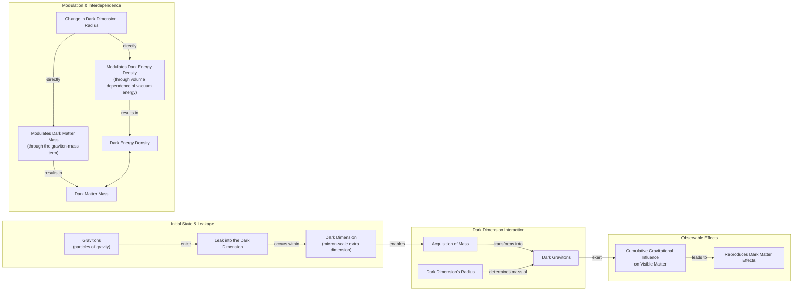

# The Cosmic Couple: Are Dark Matter and Dark Energy a Single Unified Force?

Our universe is dominated by substances we cannot see. Roughly 70% of its energy density is composed of dark energy, the mysterious force driving the accelerated expansion of the cosmos, while another 25% is dark matter, the invisible scaffolding that dictates the large-scale structure upon which galaxies form and cluster. The remaining 5% constitutes all the ordinary baryonic matter that makes up everything we can directly observe, from distant stars to our own bodies. These dominant components are not literally dark; they are semantically invisible, meaning they neither emit nor absorb any form of electromagnetic radiation, making them impossible to detect directly through telescopes.

For decades, the standard cosmological model, known as Lambda-CDM (ΛCDM), has successfully described a wide range of cosmic observations by treating these two giants as completely independent entities. In this framework, dark matter is a cold, non-interactive particle that clumps together under gravity, while dark energy is modeled as a strict cosmological constant (the "Lambda")—an intrinsic, unvarying energy of space itself that pushes everything apart. This separation has been a foundational and simplifying assumption, but emerging evidence now suggests they may be physically intertwined, perhaps interacting or even sharing a common origin.

Recent results from the Dark Energy Spectroscopic Instrument (DESI) are challenging our long-held assumptions. The 2024 and 2025 data releases, based on the largest 3D map of the universe ever created, indicate that dark energy's strength has not been constant. It appears to have peaked roughly two billion years ago and has been weakening ever since, with hints that it may have been even stronger in an earlier cosmic era [[3], [5]].

This behavior leads to a "phantom regime," where dark energy’s influence grows over time. This is like watching a ball on a flat surface spontaneously begin to roll uphill, gaining potential energy without any apparent push. It seemingly creates energy from nothing, a behavior that would appear to violate the fundamental laws of energy conservation unless an external influence or a coupling to another sector is at play.

The DESI findings provide observational weight to an idea that many theorists have long suspected for fundamental reasons. Some arguments suggest that an unchanging cosmological constant is theoretically problematic, pointing to the massive discrepancy between its predicted and observed values, instabilities in spacetime, and constraints from quantum gravity theories like superstring theory [[26]]. This has spurred researchers to investigate a profound connection between dark energy and dark matter. The possibility of a unified dark-sector theory, where one component directly influences the other, is moving from a theoretical curiosity to an observational necessity.

We will first examine the concrete dark-interaction models that reframe this apparent phantom behavior as a simple bookkeeping artifact, a perspective that also helps to ease the long-standing Hubble tension.

## Dark Interactions

The idea that dark matter and dark energy might interact is not new. As far back as 2005, a model proposed by Justin Khoury and his collaborators asked a hypothetical question: could dark energy's density increase over time by drawing energy from dark matter [[17]]? Such a transfer would create only the *appearance* of phantom behavior. It would not violate energy conservation but would instead be a signature of an interaction between the two dark sectors. As Khoury explained, "It is the most natural, simplest way of achieving this" [[17]].

Image 1: Justin Khoury, a theoretical physicist whose work explores interactions in the dark sector.

Two decades later, spurred by the DESI findings, Khoury, along with Meng-Xiang Lin and Mark Trodden, constructed a more explicit model based on a dark-sector analogue of quantum chromodynamics (QCD), the well-established theory of the strong nuclear force [[17], [18]]. Just as QCD describes the interactions between quarks and gluons, their model posits a hidden sector with its own set of "dark" forces and particles. In this framework, the energy density of dark energy and the mass of dark matter particles are not independent but evolve in concert, providing a robust and self-consistent field-theoretic mechanism for their coupled evolution.

Alternative models propose a similar dynamic through direct energy exchange. One theory, published in January 2025, suggests that dark matter could have transferred a small fraction of its energy to dark energy during a specific past cosmic era [[19], [20]]. This injection of energy would boost the repulsive force of dark energy, causing the observed acceleration. Elsa Teixeira, a cosmologist at the University of Montpellier and one of the paper's authors, vividly illustrates the underlying mechanism: "Dark matter is the main brake on [the universe’s] expansion, so easing up on that brake would have caused the expansion of the universe to accelerate" [[20]]. This process effectively lightens the gravitational drag on the cosmos, allowing dark energy's push to become more dominant over time.

These interactions lead to a powerful realization: the phantom regime might just be a misunderstanding. David Andriot, a physicist at CNRS, argues it is a bookkeeping artifact. When cosmologists analyze data, they assume dark matter's mass is constant. If its mass is actually evolving, that change gets incorrectly assigned to the dark energy ledger. As Andriot puts it, "Any change or evolution of the mass of dark matter has been put into the box of dark energy" [[20]].

This perspective is shared by Harvard physicist Cumrun Vafa, who argues that treating the two components independently is a fundamental mistake. "The notion that you can compute dark energy independently of dark matter is wrong," Vafa stated. "That assumption, often made by cosmologists and also followed by the DESI team, led to the physically unacceptable phantom behavior" [[12], [20]]. The two quantities are linked at a deeper level and must be solved for simultaneously.

It is important to distinguish this approach from modified gravity theories. Coupled-sector models do not alter the fundamental equations of General Relativity. Instead, they propose that the apparent cosmic acceleration is a macroscopic effect emerging from the energy exchange between the dark components, preserving the underlying gravitational framework [[27]].

This coupled-sector approach also offers a natural way to resolve the Hubble tension—the persistent ~9% discrepancy between measurements of the universe's expansion rate. Measurements based on the early universe, specifically the cosmic microwave background (CMB), predict a slower expansion rate than what is measured in the late universe using "local" indicators like Type Ia supernovae. As Teixeira and her co-authors wrote, this tension "has provoked heated debates in the cosmology community about whether this difference could be due to systematic errors or whether it is a signal of new physics" [[11]]. In a coupled model, the interaction between dark energy and dark matter is not constant; it can change the cosmic expansion history over time. This evolving relationship can naturally reconcile the early- and late-universe measurements without needing to invoke experimental errors or introduce entirely new, unrelated particles.

These phenomenological models provide a compelling framework for understanding the latest cosmic data. They receive a natural origin within string theory, which we will explore next through the "dark dimension" proposal.

## A Dark Dimension

String theory provides a natural foundation for a dynamic universe. Its framework includes moduli fields, which can allow dark energy to vary over time. This flexibility is not arbitrary. It stems from the "Swampland" program, which aims to identify criteria that separate consistent theories of quantum gravity from inconsistent ones. One such criterion, the Distance Conjecture, predicts that at extreme values of a field—such as the one corresponding to our universe's tiny cosmological constant—a tower of light particles must emerge. This tower modifies gravity at a new scale [[28]]. By extension, this also allows for the mass of dark matter particles to be time-dependent without any ad-hoc adjustments. This led Vafa and his collaborators to propose a shared geometric origin for both dark energy and dark matter: a single, micron-scale extra dimension [[11], [12]]. This "dark dimension" is orders of magnitude larger than the Planck-scale dimensions typically considered in string theory.

The proposed mechanism is precise. String theory posits the existence of gravitons, the quantum particles that mediate the force of gravity. In this model, these gravitons are not confined to our familiar three spatial dimensions. They can leak into the micron-sized dark dimension, and in doing so, they acquire a small mass whose value is inversely proportional to the dimension's radius. These massive "dark gravitons" are the proposed candidates for dark matter. While residing primarily in the extra dimension, their cumulative gravitational influence on the visible matter in our own dimensions would exactly reproduce the large-scale gravitational effects we attribute to dark matter, like the rotation curves of galaxies [[11]].

Astrophysical observations place tight constraints on such models. The emission of particles into extra dimensions can cool celestial objects like neutron stars and supernovae too quickly. These constraints have ruled out models with more than one large extra dimension, leaving a single micron-scale dimension as the only viable option [[28]].

Image 2: A flowchart illustrating the Dark Dimension mechanism, showing the transformation of gravitons into dark gravitons, their gravitational influence, and the interdependence of dark energy density and dark matter mass modulated by the dark dimension's radius.

This model features a built-in, natural coupling that elegantly links the two dark components. Any change in the radius of the dark dimension simultaneously modulates both the dark energy density—which is related to the volume of the extra dimension—and the dark matter mass, since the graviton's mass is set by that same radius. The two quantities, therefore, cannot be varied independently; they are locked together by the underlying geometry. According to Georges Obied, a physicist at the University of Chicago, "there is a very natural coupling between dark energy and dark matter" in this scenario, removing the need for contrived interactions [[20]].

A model published in July 2025 by Obied, Vafa, Alek Bedroya, and David Wu put this idea to the test. Their calculations predicted that the strength of dark energy should change slowly over time, in proportion to its energy density [[12], [13]]. Because the observed energy density of dark energy is extraordinarily small, "it won’t change fast," Vafa noted [[12]]. This prediction aligns perfectly with the DESI data, matching the observed peak around two billion years ago and its subsequent weakening.

A direct and testable consequence of this coupling is the emergence of a new, long-range "fifth force" between dark matter particles, mediated by the massive gravitons [[22]]. This force would be distinct from and in addition to standard gravity, altering the dynamics of galaxies in observable ways. In 2006, long before the dark dimension model was proposed, Marc Kamionkowski and Michael Kesden established an upper limit on the strength of any such extra force. They did so by studying the delicate tidal tails of satellite galaxies—streams of stars stripped away by the Milky Way's gravity. An extra dark-matter force would disrupt these streams in a specific way. Their analysis of existing observations found no such disruption, allowing them to constrain the strength of any potential fifth force [[22]]. The dark dimension model predicts a force that falls comfortably within this existing observational bound, a non-trivial check that lends it further credibility.

The model's proponents note that it is readily falsifiable, as an improvement in precision measurements of Newton's law by a factor of 10 to 100 could either detect or rule out the predicted deviation [[28]]. Future tests at the intersection of cosmology, particle physics, and gravitational wave astronomy are also poised to probe the theory's core predictions [[29]]. The fact that a prediction derived from string theory aligns with astrophysical evidence does not confirm the theory itself. However, as Vafa has expressed, any correspondence between string theory and experiment is gratifying for researchers who have spent decades working to generate testable predictions from a purely conceptual realm [[12]].

Ultimately, the puzzle of the dark sector is being attacked from complementary directions: observational cosmology with instruments like DESI, particle-physics analogues from theorists like Khoury, and string-theory completions from Vafa and his collaborators. This interdisciplinary convergence demonstrates a powerful methodology. As data continues to accumulate, it will eventually select the correct framework, reinforcing the idea that the universe's deepest mysteries require a unified approach.

## References

- [1] Field, B. J. (2025). *Dark Energy and Cosmology Science Updates*. [https://indico.global/event/15767/contributions/138193/attachments/65687/127027/2025.12%20DPF%20Dark%20Energy%20and%20Cosmology%20v1%20(B%20Field).pdf](https://indico.global/event/15767/contributions/138193/attachments/65687/127027/2025.12%20DPF%20Dark%20Energy%20and%20Cosmology%20v1%20(B%20Field).pdf)
- [2] *The Dark Energy Spectroscopic Instrument (DESI)*. (n.d.). [https://www.desi.lbl.gov](https://www.desi.lbl.gov)
- [3] Adame, A. G., et al. (DESI Collaboration). (2025). DESI DR2 results II: Measurements of baryon acoustic oscillations and cosmological constraints. *arXiv*. [https://doi.org/10.48550/arXiv.2503.14738](https://doi.org/10.48550/arXiv.2503.14738)
- [4] Ohio University. (2025, March). Universe might be changing: New DESI data shows dark energy may evolve over time. *OHIO News*. [https://www.ohio.edu/news/2025/03/universe-might-be-changing-new-desi-data-shows-dark-energy-may-evolve-over-time](https://www.ohio.edu/news/2025/03/universe-might-be-changing-new-desi-data-shows-dark-energy-may-evolve-over-time)
- [5] Choi, A. (2025). Could dark energy be changing over time?. *Proceedings of the National Academy of Sciences*, 122(44). [https://www.pnas.org/doi/10.1073/pnas.2524499122](https://www.pnas.org/doi/10.1073/pnas.2524499122)
- [6] *CERN Courier*. (2024). Four reasons dark energy should evolve with time. [https://cerncourier.com/four-reasons-dark-energy-should-evolve-with-time](https://cerncourier.com/four-reasons-dark-energy-should-evolve-with-time)
- [7] Basile, I., & Lüst, D. (2024). A ‘dark dimension’ could help explain the origin of dark energy. *Advanced Science News*. [https://www.advancedsciencenews.com/a-dark-dimension-could-help-explain-the-origin-of-dark-energy](https://www.advancedsciencenews.com/a-dark-dimension-could-help-explain-the-origin-of-dark-energy)
- [8] Wood, C. (2024, February 1). In a ‘Dark Dimension,’ Physicists Search for Missing Matter. *Quanta Magazine*. [https://www.quantamagazine.org/in-a-dark-dimension-physicists-search-for-missing-matter-20240201](https://www.quantamagazine.org/in-a-dark-dimension-physicists-search-for-missing-matter-20240201)
- [9] Montero, M., Vafa, C., & Valenzuela, I. (2022). The Dark Dimension and the Swampland. *arXiv*. [https://arxiv.org/abs/2205.12293](https://arxiv.org/abs/2205.12293)
- [10] Wood, C. (2026, June 22). A ‘Dark Dimension’ Could Link Two of the Universe’s Great Unknowns. *Quanta Magazine*. [https://www.quantamagazine.org/a-dark-dimension-could-link-two-of-the-universes-great-unknowns-20260622](https://www.quantamagazine.org/a-dark-dimension-could-link-two-of-the-universes-great-unknowns-20260622)
- [11] Teixeira, E. M., et al. (2026). Alleviating cosmological tensions with a hybrid dark sector. *Physical Review D*. [https://link.aps.org/doi/10.1103/9lf2-33zf](https://link.aps.org/doi/10.1103/9lf2-33zf)
- [12] Bedroya, A., Obied, G., Vafa, C., & Wu, D. H. (2025). Evolving Dark Sector and the Dark Dimension Scenario. *arXiv*. [https://arxiv.org/abs/2507.03090](https://arxiv.org/abs/2507.03090)
- [13] Bedroya, A., Obied, G., Vafa, C., & Wu, D. (2025). *Dark Sector and the Swampland*. [https://indico.global/event/551/contributions/130592/attachments/61097/117637/Dark%20Sector%20and%20the%20Swampland.pdf](https://indico.global/event/551/contributions/130592/attachments/61097/117637/Dark%20Sector%20and%20the%20Swampland.pdf)
- [14] Bedroya, A., Obied, G., Vafa, C., & Wu, D. H. (2025). Evolving Dark Sector and the Dark Dimension Scenario. *NASA/ADS*. [https://ui.adsabs.harvard.edu/abs/2025arXiv250703090B/abstract](https://ui.adsabs.harvard.edu/abs/2025arXiv250703090B/abstract)
- [15] Bedroya, A., Obied, G., Vafa, C., & Wu, D. H. (2025). Evolving dark sector and the dark dimension scenario. *Google Scholar*. [https://scholar.google.com/citations?user=24NnAxcAAAAJ&hl=en](https://scholar.google.com/citations?user=24NnAxcAAAAJ&hl=en)
- [16] Fermilab. (2025, March). New DESI results strengthen hints that dark energy may evolve. *Fermilab News*. [https://news.fnal.gov/2025/03/new-desi-results-strengthen-hints-that-dark-energy-may-evolve](https://news.fnal.gov/2025/03/new-desi-results-strengthen-hints-that-dark-energy-may-evolve)
- [17] Das, S., Corasaniti, P. S., & Khoury, J. (2005). Super-acceleration as Signature of Dark Sector Interaction. *arXiv*. [https://arxiv.org/abs/astro-ph/0510628](https://arxiv.org/abs/astro-ph/0510628)
- [18] Denison, M. (2026). *Screened Forces in a QCD-Like Dark Sector on Galactic Scales*. [https://indico.global/event/14705/contributions/155116/attachments/72358/141320/PASCOS2026.pptx%20(1).pdf](https://indico.global/event/14705/contributions/155116/attachments/72358/141320/PASCOS2026.pptx%20(1).pdf)
- [19] Kritpetch, C., Roy, N., & Banerjee, N. (2025). Interacting dark sector: A dynamical system perspective. *Physical Review D*, 111(10). [https://www.pnas.org/doi/10.1073/pnas.2524499122](https://www.pnas.org/doi/10.1073/pnas.2524499122)
- [20] Andriot, D. (2025). Phantom matters. *arXiv*. [https://arxiv.org/abs/2505.10410](https://arxiv.org/abs/2505.10410)
- [21] UC Riverside. (2021, June 2). A new dimension in the quest to understand dark matter. *UCR News*. [https://news.ucr.edu/articles/2021/06/02/new-dimension-quest-understand-dark-matter](https://news.ucr.edu/articles/2021/06/02/new-dimension-quest-understand-dark-matter)
- [22] Kesden, M., & Kamionkowski, M. (2006). Galilean Equivalence for Galactic Dark Matter. *arXiv*. [https://arxiv.org/abs/astro-ph/0608095](https://arxiv.org/abs/astro-ph/0608095)
- [23] *d-nb.info*. (n.d.). [https://d-nb.info/1336107839/34](https://d-nb.info/1336107839/34)
- [24] Gessner, S., et al. (2024). A test for the interaction between dark energy and dark matter from the complete sample of cosmic chronometers. *The European Physical Journal C*, 84(3). [https://link.springer.com/article/10.1140/epjc/s10052-024-12622-y](https://link.springer.com/article/10.1140/epjc/s10052-024-12622-y)
- [25] Tait, T. (n.d.). *A Dark SU(N)*. [https://indico.cern.ch/event/473000/contributions/1993414/attachments/1209863/1764345/tait-Aspen.pdf](https://indico.cern.ch/event/473000/contributions/1993414/attachments/1209863/1764345/tait-Aspen.pdf)
- [26] Brandenberger, R. (2025). Four reasons dark energy should evolve with time. *CERN Courier*. [https://cerncourier.com/four-reasons-dark-energy-should-evolve-with-time](https://cerncourier.com/four-reasons-dark-energy-should-evolve-with-time)
- [27] Di Valentino, E., et al. (2026). Coupled dark sectors. *Preprints.org*. [https://www.preprints.org/manuscript/202606.1022](https://www.preprints.org/manuscript/202606.1022)
- [28] Vafa, C. (2022). The Dark Dimension and the Swampland. *Planck 2022*. [https://indico.in2p3.fr/event/24773/contributions/110484/attachments/70934/100876/The%20Dark%20Dimension.pdf](https://indico.in2p3.fr/event/24773/contributions/110484/attachments/70934/100876/The%20Dark%20Dimension.pdf)
- [29] Anchordoqui, L. A., et al. (2022). The Dark Dimension Proposal. *Emergent Mind*. [https://www.emergentmind.com/topics/dark-dimension-proposal](https://www.emergentmind.com/topics/dark-dimension-proposal)