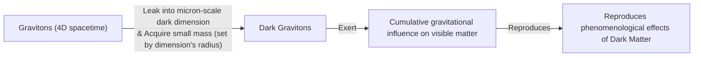
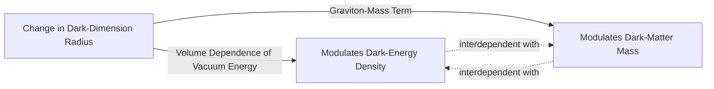

# The Dark Universe Might Not Be So Dark After All

As AI engineers, we are used to dealing with black boxes. But the universe has us beat. According to our best estimates, the stuff we can see and touch—stars, planets, and ourselves—makes up only 5% of the cosmos. The other 95% is a mysterious concoction of invisible components. Approximately 70% is dark energy, an unknown force pushing space to expand, and another 25% is dark matter, an unseen material holding galaxies together. Semantically speaking, they are not so much "dark" as they are invisible. They do not emit, reflect, nor absorb light, and have so far proven impossible to observe directly [[1]](https://www.quantamagazine.org/a-dark-dimension-could-link-two-of-the-universes-great-unknowns-20260622).

The standard model of cosmology, Lambda-CDM, treats dark energy as a cosmological constant (Lambda) and assumes it has nothing to do with Cold Dark Matter (CDM). They are considered separate, unrelated phenomena. This is the default assumption, the baseline model. However, emerging observational evidence challenges this view, suggesting they may be physically intertwined.

In 2024 and 2025, results from the Dark Energy Spectroscopic Instrument (DESI) indicated that the strength of dark energy has not been constant. The data, gathered by an instrument with 5,000 robotic "eyes" that can measure spectra from distant galaxies, suggests it peaked roughly 2 billion years ago and has been weakening ever since [[2]](https://www.instagram.com/reel/DZ5qWCPK7LF), [[3]](https://news.fnal.gov/2025/03/new-desi-results-strengthen-hints-that-dark-energy-may-evolve). More puzzling, in an earlier era, dark energy might have grown stronger [[2]](https://www.instagram.com/reel/DZ5qWCPK7LF). This behavior, where a component seems to gain energy as the universe expands, is known as the "phantom regime." Researchers liken it to a ball spontaneously rolling uphill, an act that seems to create energy from nothing and would violate conservation laws unless some external influence is at play [[1]](https://www.quantamagazine.org/a-dark-dimension-could-link-two-of-the-universes-great-unknowns-20260622).

A growing number of theorists are now investigating the possibility that this influence comes from an interaction with dark matter. As particle physicist Tim Tait explains, even though scientists have assumed they "don’t have anything to do with each other, you can imagine a case where one influences the other. And it would not be surprising if [they] were manifestations of a kind of unified theory of the dark universe" [[1]](https://www.quantamagazine.org/a-dark-dimension-could-link-two-of-the-universes-great-unknowns-20260622).

We will next examine concrete dark-interaction models that turn the phantom appearance into a bookkeeping artifact and simultaneously ease the long-standing Hubble tension.

## Dark Interactions

The idea that dark energy and dark matter interact is not new. Back in 2005, a model proposed by Justin Khoury and collaborators posed a hypothetical question: could there be a form of dark energy whose energy density increased over time? They found that if dark energy and dark matter could affect one another, they could produce what looked like, but was not, phantom behavior. This interaction offered a natural way to achieve this effect without violating fundamental laws [[4]](https://www.quantamagazine.org/a-dark-dimension-could-link-two-of-the-universes-great-unknowns-20260622). "It is the most natural, simplest way of achieving this," Khoury said [[4]](https://www.quantamagazine.org/a-dark-dimension-could-link-two-of-the-universes-great-unknowns-20260622).

Two decades later, the DESI findings spurred Khoury and his colleagues Meng-Xiang Lin and Mark Trodden to construct a new model based on a dark-sector analogue of quantum chromodynamics (QCD), a cornerstone theory of particle physics. In their model, both the energy density of dark energy and the mass of dark matter change in concert, providing a field-theoretic mechanism for their coupled evolution [[4]](https://www.quantamagazine.org/a-dark-dimension-could-link-two-of-the-universes-great-unknowns-20260622).

Another recent model, published in January 2025, imagines a similar energy transfer. According to this scenario, dark matter could have transferred a small fraction of its energy to dark energy in a previous cosmic era. Elsa Teixeira, a cosmologist and one of the study's authors, explained that "dark matter is the main brake on [the universe’s] expansion," so easing up on that brake would have caused the expansion to accelerate [[1]](https://www.quantamagazine.org/a-dark-dimension-could-link-two-of-the-universes-great-unknowns-20260622).

The appearance of a phantom regime, in this view, is simply a result of bookkeeping. David Andriot, a physicist at CNRS, argues that when we analyze cosmological data, we assume dark matter's mass is constant. If its mass is actually evolving, that change gets incorrectly lumped into the dark energy calculation. As he puts it, "any change or evolution of the mass of dark matter has been put into the box of dark energy" [[1]](https://www.quantamagazine.org/a-dark-dimension-could-link-two-of-the-universes-great-unknowns-20260622). This accounting error makes it look like dark energy is behaving in a physically impossible way.

Physicist Cumrun Vafa agrees, stating that "the notion that you can compute dark energy independently of dark matter is wrong. That assumption, often made by cosmologists and also followed by the DESI team, led to the physically unacceptable phantom behavior" [[1]](https://www.quantamagazine.org/a-dark-dimension-could-link-two-of-the-universes-great-unknowns-20260622).

Beyond explaining the phantom regime, coupled dark-sector models can also help resolve one of cosmology's most persistent problems: the Hubble tension. This tension refers to the discrepancy in the measured expansion rate of the universe, known as the Hubble constant. When scientists measure it using light from the early universe, like the Cosmic Microwave Background (CMB), they get one value. When they measure it using more recent phenomena, like exploding stars (supernovae), they get a different value, and the two vary by approximately 9%. According to Teixeira and her co-authors, this discrepancy "has provoked heated debates in the cosmology community about whether this difference could be due to systematic errors or whether it is a signal of new physics" [[4]](https://www.quantamagazine.org/a-dark-dimension-could-link-two-of-the-universes-great-unknowns-20260622). Their model posits that in a world where dark energy and dark matter interact, what seemed to be a crisis caused by disparate expansion rates instead becomes something to be expected [[4]](https://www.quantamagazine.org/a-dark-dimension-could-link-two-of-the-universes-great-unknowns-20260622).

These phenomenological interaction models receive a natural ultraviolet completion and common geometric origin within string theory, which we explore next through the dark-dimension proposal.

## A Dark Dimension

If dark energy and dark matter do interact, it could mean they share a common origin [[4]](https://www.quantamagazine.org/a-dark-dimension-could-link-two-of-the-universes-great-unknowns-20260622). Ongoing work in string theory, which posits that our universe is made of vibrating strings, suggests how. Building on this framework, Vafa and collaborators proposed in 2019 and 2022 that both dark energy and the mass of dark matter particles may vary over time, linked through a "dark dimension" [[1]](https://www.quantamagazine.org/a-dark-dimension-could-link-two-of-the-universes-great-unknowns-20260622).

String theory suggests the existence of six or seven extra spatial dimensions curled up to sizes so small they are undetectable, typically thought to be near the Planck scale (10⁻³⁵ meters) [[4]](https://www.quantamagazine.org/a-dark-dimension-could-link-two-of-the-universes-great-unknowns-20260622). The new proposal is that one of these—the dark dimension—is significantly larger, on the order of a micron (10⁻⁶ meters) [[5]](https://www.advancedsciencenews.com/a-dark-dimension-could-help-explain-the-origin-of-dark-energy). This is still minute, but enormous compared to the others, being 29 orders of magnitude larger than the Planck length [[5]](https://www.advancedsciencenews.com/a-dark-dimension-could-help-explain-the-origin-of-dark-energy), [[6]](https://www.quantamagazine.org/in-a-dark-dimension-physicists-search-for-missing-matter-20240201).

This dark dimension provides a shared origin for both dark components through a specific mechanism. Gravitons, the theoretical particles that carry the force of gravity, can leak into this enlarged dimension. In doing so, they acquire a small mass determined by the dimension's size and become "dark gravitons." While residing in the dark dimension, their gravitational effects can still be felt in our familiar dimensions. The cumulative influence of these massive gravitons could be what we have been calling dark matter [[4]](https://www.quantamagazine.org/a-dark-dimension-could-link-two-of-the-universes-great-unknowns-20260622).

Image 1: A flowchart illustrating the mechanism by which gravitons become dark matter in a dark dimension.

This scenario creates a natural link between dark matter and dark energy. As physicist Georges Obied explains, "there is a very natural coupling between dark energy and dark matter" [[1]](https://www.quantamagazine.org/a-dark-dimension-could-link-two-of-the-universes-great-unknowns-20260622). Any change in the size of the dark dimension would simultaneously affect both. The dark energy density is tied to the volume of extra dimensions, while the mass of dark gravitons (dark matter) is tied to its radius. The two quantities cannot be varied independently.

Image 2: A diagram illustrating the natural coupling between dark-dimension radius, dark-energy density, and dark-matter mass.

In a July 2025 paper, Obied and Vafa, along with Alek Bedroya and David Wu, found that this scenario was consistent with the DESI data. Their model, termed the Fading Dark Sector (FDS), predicts that both the strength of dark energy and the mass of dark matter will decrease over time. Specifically, it predicts that the rate at which dark energy changes is proportional to its energy density [[7]](file://Evolving%20Dark%20Sector%20and%20the%20Dark%20Dimension%20Scenario.md). Since the energy density of dark energy is extraordinarily small, "it won’t change fast," Vafa said. "It’s not surprising that we didn’t see it until now. We had to wait the entire age of the universe to detect something that small" [[1]](https://www.quantamagazine.org/a-dark-dimension-could-link-two-of-the-universes-great-unknowns-20260622). The model successfully reproduces the peak around 2 billion years ago and the subsequent weakening seen by DESI [[7]](file://Evolving%20Dark%20Sector%20and%20the%20Dark%20Dimension%20Scenario.md).

A direct consequence of this coupling is that dark matter particles could interact with one another through a new, long-range force separate from gravity. The good news, Obied noted, is that "there could be astrophysical ways of testing this" [[1]](https://www.quantamagazine.org/a-dark-dimension-could-link-two-of-the-universes-great-unknowns-20260622). In fact, such a test was already performed. In 2006, physicists Marc Kamionkowski and Michael Kesden looked for evidence of an extra attractive force on dark matter by studying tidal tails—extended streams of stars and gas pulled from galaxies during close encounters. If dark matter has a stronger self-attraction, it would lead to an enhanced trailing stream compared to the leading one. They found no such effect, which allowed them to set an upper limit on the strength of any such force [[8]](file://Galilean%20Equivalence%20for%20Galactic%20Dark%20Matter.md). The value predicted by Vafa's team fell well within this observational bound [[1]](https://www.quantamagazine.org/a-dark-dimension-could-link-two-of-the-universes-great-unknowns-20260622). "It is interesting that we are now finding connections between that fairly abstract work and observational and experimental work," Kamionkowski said [[1]](https://www.quantamagazine.org/a-dark-dimension-could-link-two-of-the-universes-great-unknowns-20260622).

The fact that a prediction based on string theory calculations roughly agreed with astrophysical evidence does not confirm these "stringy" models. But any correspondence between theory and experiment is gratifying to Vafa, who has spent decades trying to generate testable predictions from the purely conceptual realm of string theory [[4]](https://www.quantamagazine.org/a-dark-dimension-could-link-two-of-the-universes-great-unknowns-20260622).

This convergence of ideas underscores the value of attacking the dark-sector problem from multiple complementary directions. As Obied puts it, "it’s the job of theoretical physicists to explore everything that’s possible, to get all the possibilities on the table. And eventually, the data will help us decide" [[1]](https://www.quantamagazine.org/a-dark-dimension-could-link-two-of-the-universes-great-unknowns-20260622). By combining insights from observational cosmology, particle physics, and string theory, we move closer to a unified understanding of the universe's greatest unknowns.

## References

- [1] https://www.quantamagazine.org/a-dark-dimension-could-link-two-of-the-universes-great-unknowns-20260622
- [2] https://www.instagram.com/reel/DZ5qWCPK7LF
- [3] https://news.fnal.gov/2025/03/new-desi-results-strengthen-hints-that-dark-energy-may-evolve
- [4] https://www.quantamagazine.org/a-dark-dimension-could-link-two-of-the-universes-great-unknowns-20260622
- [5] https://www.advancedsciencenews.com/a-dark-dimension-could-help-explain-the-origin-of-dark-energy
- [6] https://www.quantamagazine.org/in-a-dark-dimension-physicists-search-for-missing-matter-20240201
- [7] file://Evolving Dark Sector and the Dark Dimension Scenario.md
- [8] file://Galilean Equivalence for Galactic Dark Matter.md