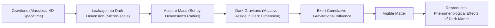
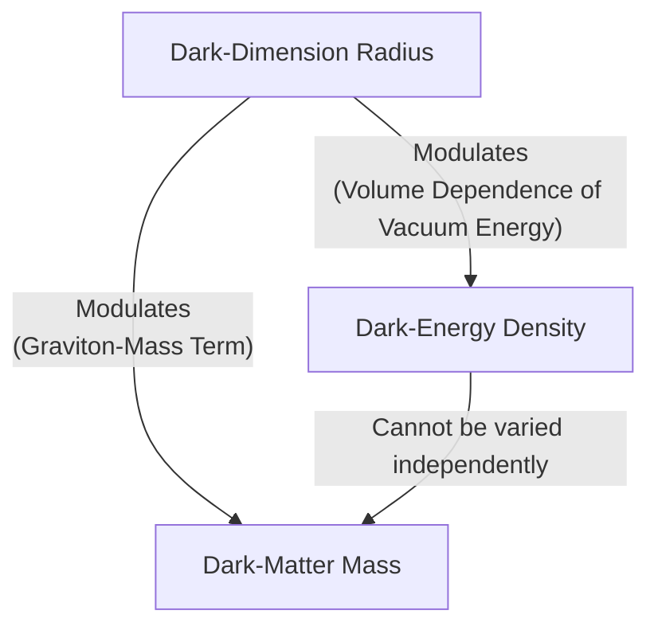

# The Dark Universe Might Not Be So Dark After All

According to our best cosmological models, the universe we see—the stars, galaxies, and planets—makes up a mere 5% of everything. The other 95% is a cosmic mystery. Approximately 70% is dark energy, an unknown force driving the accelerated expansion of space, and another 25% is dark matter, an invisible substance holding galaxies together. Semantically, they are not so much “dark” as they are invisible; they do not emit, reflect, or absorb light, and have so far proven impossible to observe directly [[11]](https://www.quantamagazine.org/a-dark-dimension-could-link-two-of-the-universes-great-unknowns-20260622).

The standard Lambda-CDM model assumes these two components are separate and unrelated. Dark energy is treated as a cosmological constant, unchanging in space and time, while dark matter interacts only through gravity. However, recent observations are challenging this picture. Data from the Dark Energy Spectroscopic Instrument (DESI) in 2024 and 2025 suggests that the strength of dark energy has not been constant. The results indicate it peaked about two billion years ago and has been weakening ever since. More puzzling, the data also suggests that in an earlier cosmic era, dark energy might have grown stronger [[2]](https://www.instagram.com/reel/DZ5qWCPK7LF), [[3]](https://indico.global/event/15767/contributions/138193/attachments/65687/127027/2025.12%20DPF%20Dark%20Energy%20and%20Cosmology%20v1%20(B%20Field).pdf).

This strengthening is described as dark energy entering the “phantom regime.” It is like watching a ball spontaneously roll uphill, seemingly creating energy from nothing and defying the laws of conservation [[2]](https://www.instagram.com/reel/DZ5qWCPK7LF), [[12]](https://www.quantamagazine.org/a-dark-dimension-could-link-two-of-the-universes-great-unknowns-20260622). Such behavior is only possible if an external force is at play. This has led a growing number of theorists to investigate a once-unpopular idea: that dark energy and dark matter are physically intertwined. As particle physicist Tim Tait notes, “you can imagine a case where one influences the other. And it would not be surprising if [they] were manifestations of a kind of unified theory of the dark universe” [[11]](https://www.quantamagazine.org/a-dark-dimension-could-link-two-of-the-universes-great-unknowns-20260622).

We will examine concrete dark-interaction models that turn the phantom appearance into a bookkeeping artifact and simultaneously ease the Hubble tension.

## Dark Interactions

The idea that dark energy and dark matter interact is not new. A 2005 model by physicist Justin Khoury and his collaborators posed a hypothetical question: could there be a form of dark energy whose density increased over time? They found that if dark energy could receive energy from dark matter, it could produce what looked like phantom behavior without actually violating energy conservation [[6]](https://cerncourier.com/four-reasons-dark-energy-should-evolve-with-time), [[17]](https://www.quantamagazine.org/a-dark-dimension-could-link-two-of-the-universes-great-unknowns-20260622). "It is the most natural, simplest way of achieving this," Khoury said [[17]](https://www.quantamagazine.org/a-dark-dimension-could-link-two-of-the-universes-great-unknowns-20260622).

Two decades later, the DESI findings spurred Khoury, Meng-Xiang Lin, and Mark Trodden to construct a more concrete model. They developed a dark-sector analogue of quantum chromodynamics (QCD), a cornerstone of particle physics. In this framework, both the energy density of dark energy and the mass of dark matter particles change in concert [[17]](https://www.quantamagazine.org/a-dark-dimension-could-link-two-of-the-universes-great-unknowns-20260622), [[18]](https://indico.global/event/14705/contributions/155116/attachments/72358/141320/PASCOS2026.pptx%20(1).pdf). Another recent study, published in January 2025, imagines a similar scenario where dark matter transferred a small fraction of its energy to dark energy in the past. As Elsa Teixeira, a cosmologist at the University of Montpellier, explained, “Dark matter is the main brake on [the universe’s] expansion,” so easing up on that brake would cause the expansion to accelerate [[20]](https://www.quantamagazine.org/a-dark-dimension-could-link-two-of-the-universes-great-unknowns-20260622).

These models suggest the phantom regime is an illusion—a bookkeeping artifact. Physicist David Andriot of CNRS argues that “Any change or evolution of the mass of dark matter has been put into the box of dark energy” [[20]](https://www.quantamagazine.org/a-dark-dimension-could-link-two-of-the-universes-great-unknowns-20260622). If cosmologists assume dark matter's properties are constant, any variation must be incorrectly attributed to dark energy's ledger. Harvard physicist Cumrun Vafa agrees, stating, “The notion that you can compute dark energy independently of dark matter is wrong. That assumption, often made by cosmologists and also followed by the DESI team, led to the physically unacceptable phantom behavior” [[20]](https://www.quantamagazine.org/a-dark-dimension-could-link-two-of-the-universes-great-unknowns-20260622).

This interaction does more than just explain away phantom energy; it can also help resolve one of cosmology's most persistent problems: the Hubble tension. This tension is a ~9% discrepancy between the universe's expansion rate as measured from the early universe (via the cosmic microwave background) and the more recent universe (via supernovae) [[11]](https://www.quantamagazine.org/a-dark-dimension-could-link-two-of-the-universes-great-unknowns-20260622). According to the standard model, these values should match. The discrepancy “has provoked heated debates in the cosmology community about whether this difference could be due to systematic errors or whether it is a signal of new physics,” Teixeira and her co-authors wrote. Their model suggests that in a world where dark energy and dark matter interact, this tension is not a crisis but an expected outcome of a changing expansion history [[11]](https://www.quantamagazine.org/a-dark-dimension-could-link-two-of-the-universes-great-unknowns-20260622).

These phenomenological interaction models receive a natural ultraviolet completion and common geometric origin within string theory, which we explore next through the dark-dimension proposal.

## A Dark Dimension

If dark energy and dark matter interact, it could mean they share a common origin [[17]](https://www.quantamagazine.org/a-dark-dimension-could-link-two-of-the-universes-great-unknowns-20260622). Ongoing work in string theory, pioneered by Cumrun Vafa and his collaborators, suggests how. Building on the idea that dark energy can vary over time, they proposed in 2019 that dark matter particle mass may also be time-dependent. This led them to a unified picture where both phenomena are linked to a "dark dimension" [[11]](https://www.quantamagazine.org/a-dark-dimension-could-link-two-of-the-universes-great-unknowns-20260622).

String theory posits the existence of extra spatial dimensions beyond our familiar three. While these are typically thought to be curled up at the unimaginably small Planck scale (10⁻³⁵ meters), this new theory proposes that one of these dimensions—the dark dimension—is much larger, on the order of a micron (10⁻⁶ meters) [[11]](https://www.quantamagazine.org/a-dark-dimension-could-link-two-of-the-universes-great-unknowns-20260622), [[9]](https://www.advancedsciencenews.com/a-dark-dimension-could-help-explain-the-origin-of-dark-energy). This relatively large dimension provides a shared geometric origin for both dark energy and dark matter.

The mechanism works like this: gravitons, the theoretical massless particles that carry the force of gravity, can leak into this enlarged dark dimension. In doing so, they acquire a mass determined by the dimension's size and become "dark gravitons." These massive gravitons reside in the dark dimension, but their gravitational effects are felt in our dimensions, allowing them to fulfill the role we attribute to dark matter [[10]](https://www.quantamagazine.org/in-a-dark-dimension-physicists-search-for-missing-matter-20240201), [[11]](https://www.quantamagazine.org/a-dark-dimension-could-link-two-of-the-universes-great-unknowns-20260622).

Image 1: Flowchart illustrating the mechanism by which gravitons become dark matter in the micron-scale dark dimension scenario.

This scenario has a natural coupling built in. Any change in the radius of the dark dimension simultaneously modulates both the dark energy density, which depends on the volume of extra dimensions, and the dark matter mass, which is set by the graviton's properties within that dimension. Georges Obied, a physicist at the University of Chicago, notes, “there is a very natural coupling between dark energy and dark matter” [[20]](https://www.quantamagazine.org/a-dark-dimension-could-link-two-of-the-universes-great-unknowns-20260622). The two cannot be varied independently.

Image 2: A concept map illustrating the natural coupling between the dark-dimension radius, dark-energy density, and dark-matter mass.

In a July 2025 paper, Obied and Vafa, along with Alek Bedroya and David Wu, showed that this scenario is consistent with the DESI data. Their model predicts that both dark energy's strength and dark matter's mass will decrease over time, with the rate of change for dark energy being proportional to its own density. Since the energy density of dark energy is known to be extraordinarily small, “it won’t change fast,” Vafa explained. “It’s not surprising that we didn’t see it until now. We had to wait the entire age of the universe to detect something that small” [[12]](https://www.quantamagazine.org/a-dark-dimension-could-link-two-of-the-universes-great-unknowns-20260622), [[20]](https://www.quantamagazine.org/a-dark-dimension-could-link-two-of-the-universes-great-unknowns-20260622).

A direct consequence of this coupling is the emergence of a new, long-range force between dark matter particles, separate from gravity [[22]](https://www.quantamagazine.org/a-dark-dimension-could-link-two-of-the-universes-great-unknowns-20260622). Such a force would alter galactic dynamics in observable ways. Coincidentally, physicists Marc Kamionkowski and Michael Kesden had already looked for such an effect in 2006. They realized that if dark matter has a stronger attraction to itself, it would create a distinctive "tidal tail"—a stream of stars and gas—when galaxies interact. They did not find the effect, which allowed them to set an upper limit on the strength of this extra force [[22]](https://www.quantamagazine.org/a-dark-dimension-could-link-two-of-the-universes-great-unknowns-20260622). The value predicted by the dark-dimension model falls comfortably within this observational bound. “It is interesting that we are now finding connections between that fairly abstract work and observational and experimental work,” Kamionkowski said [[11]](https://www.quantamagazine.org/a-dark-dimension-could-link-two-of-the-universes-great-unknowns-20260622).

The fact that a prediction from string theory aligns with astrophysical evidence does not confirm the model. Still, any correspondence between theory and experiment is gratifying to Vafa, who has spent decades trying to generate testable predictions from the purely conceptual realm of string theory [[12]](https://www.quantamagazine.org/a-dark-dimension-could-link-two-of-the-universes-great-unknowns-20260622).

Ultimately, understanding the dark sector requires an interdisciplinary approach. As Obied puts it, “it’s very beneficial to come at this in different ways”—from observational cosmology, particle physics, or string theory. “This is how people should do science. I mean, it’s the job of theoretical physicists to explore everything that’s possible... And eventually, the data will help us decide” [[11]](https://www.quantamagazine.org/a-dark-dimension-could-link-two-of-the-universes-great-unknowns-20260622).

## References

- [1]  https://indico.global/event/551/contributions/130592/attachments/61097/117637/Dark%20Sector%20and%20the%20Swampland.pdf
- [2]  https://www.instagram.com/reel/DZ5qWCPK7LF
- [3]  https://indico.global/event/15767/contributions/138193/attachments/65687/127027/2025.12%20DPF%20Dark%20Energy%20and%20Cosmology%20v1%20(B%20Field).pdf
- [4]  https://www.desi.lbl.gov
- [5]  https://www.ohio.edu/news/2025/03/universe-might-be-changing-new-desi-data-shows-dark-energy-may-evolve-over-time
- [6]  https://cerncourier.com/four-reasons-dark-energy-should-evolve-with-time
- [7]  https://www.pnas.org/doi/10.1073/pnas.2524499122
- [8]  https://news.fnal.gov/2025/03/new-desi-results-strengthen-hints-that-dark-energy-may-evolve
- [9]  https://www.advancedsciencenews.com/a-dark-dimension-could-help-explain-the-origin-of-dark-energy
- [10]  https://www.quantamagazine.org/in-a-dark-dimension-physicists-search-for-missing-matter-20240201
- [11]  https://www.quantamagazine.org/a-dark-dimension-could-link-two-of-the-universes-great-unknowns-20260622
- [12]  https://arxiv.org/abs/2507.03090
- [13]  https://indico.global/event/551/contributions/130592/attachments/61097/117637/Dark%20Sector%20and%20the%20Swampland.pdf
- [14]  https://ui.adsabs.harvard.edu/abs/2025arXiv250703090B/abstract
- [15]  https://scholar.google.com/citations?user=24NnAxcAAAAJ&hl=en
- [16]  https://news.fnal.gov/2025/03/new-desi-results-strengthen-hints-that-dark-energy-may-evolve
- [17]  https://www.quantamagazine.org/a-dark-dimension-could-link-two-of-the-universes-great-unknowns-20260622
- [18]  https://indico.global/event/14705/contributions/155116/attachments/72358/141320/PASCOS2026.pptx%20(1).pdf
- [19]  https://www.pnas.org/doi/10.1073/pnas.2524499122
- [20]  https://www.quantamagazine.org/a-dark-dimension-could-link-two-of-the-universes-great-unknowns-20260622
- [21]  https://news.fnal.gov/2021/05/dark-energy-spectroscopic-instrument-starts-5-year-survey
- [22]  https://www.quantamagazine.org/a-dark-dimension-could-link-two-of-the-universes-great-unknowns-20260622
- [23]  https://news.ucr.edu/articles/2021/06/02/new-dimension-quest-understand-dark-matter
- [24]  https://d-nb.info/1336107839/34
- [25]  https://link.springer.com/article/10.1140/epjc/s10052-024-12622-y
- [26]  https://link.aps.org/doi/10.1103/p51k-7rw2
- [27]  https://www.quantamagazine.org/a-dark-dimension-could-link-two-of-the-universes-great-unknowns-20260622
- [28]  https://indico.cern.ch/event/473000/contributions/1993414/attachments/1209863/1764345/tait-Aspen.pdf
- [29]  https://arxiv.org/abs/2205.12293
- [30]  https://link.aps.org/doi/10.1103/9lf2-33zf
- [31]  https://arxiv.org/abs/2503.14738
- [32]  https://arxiv.org/abs/astro-ph/0606566
- [33]  https://arxiv.org/abs/2505.10410
- [34]  https://arxiv.org/abs/astro-ph/0510628