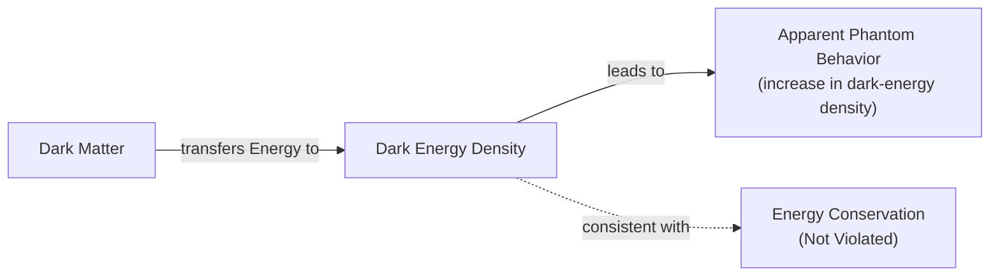
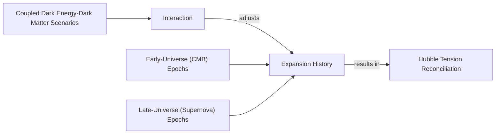
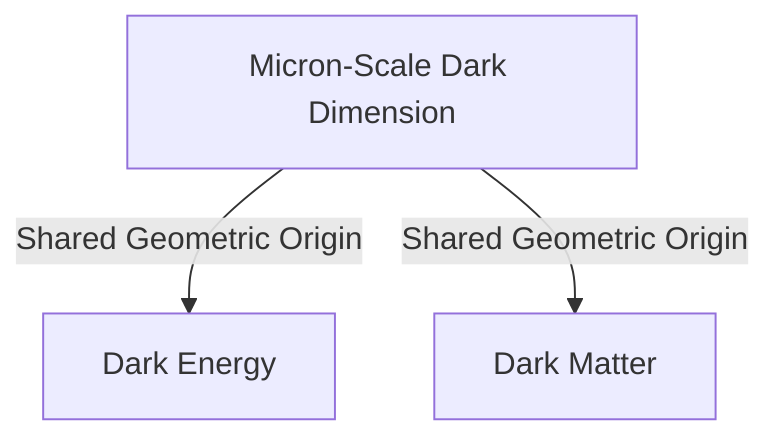
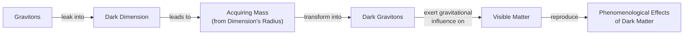
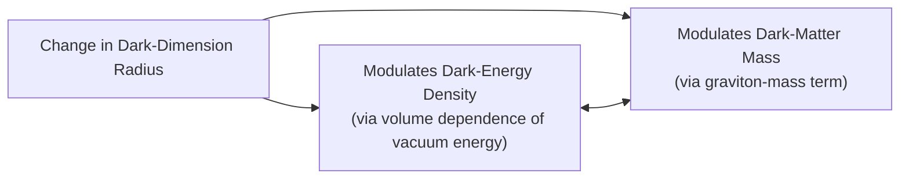

# The Phantom Universe: Is Dark Energy Coupled to Dark Matter?

Our universe is dominated by mysteries. Approximately 70% is dark energy, the enigmatic force driving cosmic acceleration, and 25% is dark matter, the unseen scaffolding upon which galaxies are built. Both are invisible, interacting with the cosmos primarily through gravity. The remaining 5% is the ordinary matter we can see and touch. For decades, the standard model of cosmology, Lambda-CDM (ΛCDM), has treated these two dark components as entirely separate phenomena. Dark energy was a simple cosmological constant, unchanging in space and time, while dark matter was a stable, non-interacting particle.

This clean separation is now being challenged. Emerging observational evidence suggests that dark energy and dark matter might be physically intertwined, influencing each other through a shared origin or a direct interaction. The most compelling data comes from the Dark Energy Spectroscopic Instrument (DESI). Results from 2024 and 2025, based on the largest 3D map of the universe ever created, indicate that dark energy’s strength has not been constant. The data hints that its influence peaked roughly two billion years ago and has been weakening ever since [[3]](https://www.pnas.org/doi/10.1073/pnas.2524499122), [[5]](https://www.ohio.edu/news/2025/03/universe-might-be-changing-new-desi-data-shows-dark-energy-may-evolve-over-time). Even more puzzling, some analyses suggest dark energy could have grown stronger in an earlier era, a behavior that seems to defy the laws of physics [[21]](https://arxiv.org/abs/2503.14738).

This behavior, where the density of dark energy increases as the universe expands, is known as the "phantom regime." It is like a ball spontaneously rolling uphill, seemingly creating energy from nothing. Such an observation would appear to violate the fundamental law of energy conservation unless some external influence is at play. This observational puzzle is not entirely unexpected. From a theoretical standpoint, the idea of a static cosmological constant has long been problematic. It creates the infamous "cosmological constant problem"—a staggering 120-order-of-magnitude discrepancy between the observed value and predictions from particle physics. Furthermore, many frameworks in string theory, our best candidate for a quantum theory of gravity, struggle to accommodate a stable, positive cosmological constant but can naturally produce time-dependent dark energy [[34]](https://cerncourier.com/four-reasons-dark-energy-should-evolve-with-time).

This has led researchers to explore the possibility of a unified dark-sector theory, where one component directly influences the other. Instead of two separate mysteries, we may be looking at two sides of the same coin. We next examine concrete dark-interaction models that turn the phantom appearance into a bookkeeping artifact and simultaneously ease the Hubble tension.

## Dark Interactions

The idea that dark energy and dark matter might interact is not new. In 2005, a model proposed by Justin Khoury and colleagues explored whether dark energy's density could increase over time by drawing energy from dark matter [[6]](https://cerncourier.com/four-reasons-dark-energy-should-evolve-with-time), [[31]](https://arxiv.org/abs/astro-ph/0510628). This would produce an *apparent* phantom behavior—an illusion of energy creation that does not violate conservation laws but instead reflects an interaction between the two sectors. “It is the most natural, simplest way of achieving this,” Khoury explained [[17]](https://www.quantamagazine.org/a-dark-dimension-could-link-two-of-the-universes-great-unknowns-20260622).


Image 1: Flowchart illustrating the 2005 Khoury et al. model, showing energy transfer from Dark Matter to Dark Energy Density, leading to apparent phantom behavior, while emphasizing energy conservation is not violated.

Building on this, Khoury, along with Meng-Xiang Lin and Mark Trodden, recently constructed a model based on a dark-sector analogue of quantum chromodynamics (QCD), the theory governing the strong nuclear force [[17]](https://www.quantamagazine.org/a-dark-dimension-could-link-two-of-the-universes-great-unknowns-20260622), [[18]](https://indico.global/event/14705/contributions/155116/attachments/72358/141320/PASCOS2026.pptx%20(1).pdf). In this framework, both the energy density of dark energy and the mass of dark matter particles change in concert, mirroring the complex dynamics of quarks and gluons but operating entirely within the dark sector.

```mermaid
flowchart LR
  subgraph "Dark Sector"
    DED["Dark Energy Density"]
    DMPM["Dark Matter Particle Mass"]
    DED <-->|"evolve in concert"| DMPM
  end

  "Dark Sector" -. "analogue to / mirrors" .-> QCD["QCD Dynamics"]
```
Image 2: A diagram illustrating the Khoury, Lin, Trodden dark-sector QCD analogue model.

An alternative model, proposed in January 2025, suggests that dark matter could have transferred a small fraction of its energy to dark energy in the past [[20]](https://www.quantamagazine.org/a-dark-dimension-could-link-two-of-the-universes-great-unknowns-20260622). “Dark matter is the main brake on [the universe’s] expansion,” explained cosmologist Elsa Teixeira, one of the study's authors, so "easing up on that brake would have caused the expansion of the universe to accelerate" [[20]](https://www.quantamagazine.org/a-dark-dimension-could-link-two-of-the-universes-great-unknowns-20260622). This transfer naturally generates the observed late-time acceleration [[19]](https://www.pnas.org/doi/10.1073/pnas.2524499122).

Physicist David Andriot argues that the appearance of a phantom regime is fundamentally a bookkeeping problem. “Any change or evolution of the mass of dark matter has been put into the box of dark energy,” he said [[20]](https://www.quantamagazine.org/a-dark-dimension-could-link-two-of-the-universes-great-unknowns-20260622). When cosmologists analyze data, they assume the mass of dark matter particles is constant. If this assumption is wrong and dark matter's mass is actually evolving, that change is incorrectly attributed to dark energy's behavior, creating the illusion of a phantom fluid [[30]](https://arxiv.org/abs/2505.10410). In this view, the total energy-momentum of the dark sector is conserved, but the way energy is distributed between dark matter and dark energy changes. Standard analyses, by fixing the dark matter mass, force this change onto the dark energy side of the ledger, creating an artificial phantom signal where none truly exists.

Harvard physicist Cumrun Vafa agrees, stating that calculating dark energy independently of dark matter is a flawed approach. “The notion that you can compute dark energy independently of dark matter is wrong,” he said. “That assumption, often made by cosmologists and also followed by the DESI team, led to the physically unacceptable phantom behavior” [[20]](https://www.quantamagazine.org/a-dark-dimension-could-link-two-of-the-universes-great-unknowns-20260622). Such an assumption leads to mathematical inconsistencies within the standard cosmological model. Allowing particle mass to vary with time disrupts the model's self-consistency, reinforcing that an independent analysis is invalid and new physics is required [[35]](https://astrobites.org/2025/08/30/the-continuing-saga-of-the-not-so-constant-constant).

This interconnectedness may also solve the "Hubble tension." The tension arises from a conflict in measuring the Hubble constant (H₀), the rate at which the universe is expanding today. Measurements based on the "late" universe, like those from Type Ia supernovae, yield a value around 73 kilometers per second per megaparsec. However, predictions based on the "early" universe, derived from the cosmic microwave background (CMB), give a value closer to 67. This ~9% gap has persisted despite increasingly precise measurements. As Teixeira and her co-authors wrote, this discrepancy “has provoked heated debates in the cosmology community about whether this difference could be due to systematic errors or whether it is a signal of new physics” [[29]](https://link.aps.org/doi/10.1103/9lf2-33zf). In a coupled dark sector, the interaction naturally adjusts the expansion history over cosmic time, reconciling the measurements from different epochs without needing to invoke measurement errors or entirely new particles [[29]](https://link.aps.org/doi/10.1103/9lf2-33zf).

It is important to note that these models achieve this by postulating an energy exchange between dark components within the established laws of general relativity. This distinguishes them from alternative theories that seek to resolve cosmic puzzles by modifying gravity itself over large scales [[36]](https://www.preprints.org/manuscript/202606.1022).


Image 3: A flowchart illustrating how Coupled Dark Energy-Dark Matter Scenarios reconcile the Hubble Tension.

These phenomenological models provide compelling frameworks for understanding the DESI data. They receive a natural geometric origin within string theory, which we explore next through the "dark dimension" proposal.

## A Dark Dimension

String theory provides a foundation where varying dark energy and time-dependent dark matter masses can arise naturally. This proposal stems from string theory's "Swampland" program, which identifies criteria for consistent theories of quantum gravity. Applied to our universe, these criteria predict a "tower" of new light particles. Astrophysical constraints, like the cooling rates of neutron stars, then restrict this tower to be the result of exactly one extra dimension in the micron range [[37]](https://indico.in2p3.fr/event/24773/contributions/110484/attachments/70934/100876/The%20Dark%20Dimension.pdf).

The theory posits the existence of extra spatial dimensions beyond our familiar three. While these are typically thought to be curled up at the unimaginably small Planck scale (10⁻³⁵ meters), one proposal—related to a broader class of "braneworld" models—suggests that a "dark dimension" could be significantly larger—on the order of a micron (10⁻⁶ meters) [[9]](https://www.advancedsciencenews.com/a-dark-dimension-could-help-explain-the-origin-of-dark-energy), [[10]](https://www.quantamagazine.org/in-a-dark-dimension-physicists-search-for-missing-matter-20240201), [[33]](https://arxiv.org/abs/2205.12293), [[40]](https://arxiv.org/abs/2507.07193). This micron-scale dimension could provide a shared geometric origin for both dark energy and dark matter.


Image 4: A concept map illustrating the Micron-Scale Dark Dimension as the shared geometric origin for Dark Energy and Dark Matter.

The mechanism is precise: gravitons, the hypothetical particles that carry the force of gravity, could "leak" into this larger dark dimension. In doing so, they would acquire a small mass determined by the dimension's radius. These massive "dark gravitons" would be confined to the dark dimension, but their gravitational influence would still be felt in our dimensions. The cumulative effect of these dark gravitons would exactly reproduce the phenomena we attribute to dark matter [[11]](https://www.quantamagazine.org/a-dark-dimension-could-link-two-of-the-universes-great-unknowns-20260622).


Image 5: A flowchart illustrating the Graviton Leakage Mechanism.

This scenario has a critical feature: a built-in, natural coupling between the two dark components. As physicist Georges Obied explained, “there is a very natural coupling between dark energy and dark matter” [[20]](https://www.quantamagazine.org/a-dark-dimension-could-link-two-of-the-universes-great-unknowns-20260622). Any change in the radius of the dark dimension would simultaneously alter both the dark energy density (which depends on the volume of extra dimensions) and the dark matter mass (set by the graviton mass). The two cannot be varied independently [[20]](https://www.quantamagazine.org/a-dark-dimension-could-link-two-of-the-universes-great-unknowns-20260622).


Image 6: Diagram illustrating the "Built-in Natural Coupling" in the dark dimension scenario.

In a July 2025 paper, Obied and Vafa, along with Alek Bedroya and David Wu, showed that this scenario is consistent with the DESI data [[12]](https://www.quantamagazine.org/a-dark-dimension-could-link-two-of-the-universes-great-unknowns-20260622). Their model predicts that the strength of dark energy and the mass of dark matter will both decrease over time, with the rate of change for dark energy being proportional to its density. Since dark energy's density is extraordinarily small, this change happens very slowly. As Vafa noted, “it won’t change fast” [[12]](https://www.quantamagazine.org/a-dark-dimension-could-link-two-of-the-universes-great-unknowns-20260622). This slow decay is precisely what would be needed to explain the DESI data, which suggests dark energy's influence may have peaked around two billion years ago and has been weakening since. The model provides a physical mechanism for this evolution, where the slow expansion of the dark dimension drives both the change in dark energy and dark matter's mass.

Researchers acknowledge these results are preliminary. A key limitation is that calculations do not yet account for the exact geometry of other compactified dimensions, an unknown factor that could refine the predictions [[38]](https://www.advancedsciencenews.com/a-dark-dimension-could-help-explain-the-origin-of-dark-energy).

A direct consequence of this coupling is the emergence of a new, long-range force between dark matter particles, separate from gravity [[22]](https://www.quantamagazine.org/a-dark-dimension-could-link-two-of-the-universes-great-unknowns-20260622). This new force, mediated by the massive dark gravitons, would be distinct from gravity and would cause dark matter to clump differently than predicted by standard models. Its strength is directly tied to the size of the dark dimension, making it a key predictive feature of the theory. The good news, Obied said, is that “there could be astrophysical ways of testing this” [[22]](https://www.quantamagazine.org/a-dark-dimension-could-link-two-of-the-universes-great-unknowns-20260622).

In 2006, long before the dark dimension model was proposed, physicists Michael Kesden and Marc Kamionkowski realized that such a force would affect how satellite galaxies are torn apart by the Milky Way's gravity. They used observations of these "tidal tails" to place an upper limit on the strength of any such extra force [[32]](https://arxiv.org/abs/2505.10410). Remarkably, the value predicted by the dark dimension model falls comfortably within this pre-existing observational bound, passing its first major astrophysical test [[22]](https://www.quantamagazine.org/a-dark-dimension-could-link-two-of-the-universes-great-unknowns-20260622).

Of course, a rough agreement with evidence does not prove a theory correct. Still, any correspondence between string theory and experiment is gratifying to Vafa and others who have spent decades trying to generate testable predictions from the purely conceptual realm [[12]](https://www.quantamagazine.org/a-dark-dimension-could-link-two-of-the-universes-great-unknowns-20260622).

The puzzle of the dark sector is being attacked from complementary directions: observational cosmology with instruments like DESI, particle physics with analogues like the QCD model, and fundamental string theory with ultraviolet completions like the dark dimension. This interdisciplinary convergence illustrates a powerful method. By constraining the problem from multiple angles, the scientific community can systematically narrow down the possibilities until accumulating data selects the correct framework. Future experimental tests at the interface of cosmology, particle physics, and gravitational phenomenology will be required to either lend support to or falsify the presence of a dark dimension [[39]](https://www.emergentmind.com/topics/dark-dimension-proposal).

## References

- [1] Evolving Dark Sector and the Dark Dimension Scenario. (2025). [https://arxiv.org/abs/2507.03090](https://arxiv.org/abs/2507.03090)
- [2] DESI DR2 Results II: Measurements of Baryon Acoustic Oscillations and Cosmological Constraints. (2025). [https://arxiv.org/abs/2503.14738](https://arxiv.org/abs/2503.14738)
- [3] Could dark energy be changing over time? | PNAS. (2025). [https://www.pnas.org/doi/10.1073/pnas.2524499122](https://www.pnas.org/doi/10.1073/pnas.2524499122)
- [4] New DESI results strengthen hints that dark energy may evolve. (2025). [https://news.fnal.gov/2025/03/new-desi-results-strengthen-hints-that-dark-energy-may-evolve](https://news.fnal.gov/2025/03/new-desi-results-strengthen-hints-that-dark-energy-may-evolve)
- [5] Universe might be changing: New DESI data shows dark energy may evolve over time. (2025). [https://www.ohio.edu/news/2025/03/universe-might-be-changing-new-desi-data-shows-dark-energy-may-evolve-over-time](https://www.ohio.edu/news/2025/03/universe-might-be-changing-new-desi-data-shows-dark-energy-may-evolve-over-time)
- [6] Four reasons dark energy should evolve with time. (2025). [https://cerncourier.com/four-reasons-dark-energy-should-evolve-with-time](https://cerncourier.com/four-reasons-dark-energy-should-evolve-with-time)
- [7] The Dark Energy Spectroscopic Instrument (DESI). (2018). [https://www.desi.lbl.gov](https://www.desi.lbl.gov)
- [8] Dark Energy and Cosmology Science Updates. (2025). [https://indico.global/event/15767/contributions/138193/attachments/65687/127027/2025.12%20DPF%20Dark%20Energy%20and%20Cosmology%20v1%20(B%20Field).pdf](https://indico.global/event/15767/contributions/138193/attachments/65687/127027/2025.12%20DPF%20Dark%20Energy%20and%20Cosmology%20v1%20(B%20Field).pdf)
- [9] A dark dimension could help explain the origin of dark energy. (2024). [https://www.advancedsciencenews.com/a-dark-dimension-could-help-explain-the-origin-of-dark-energy](https://www.advancedsciencenews.com/a-dark-dimension-could-help-explain-the-origin-of-dark-energy)
- [10] In a ‘Dark Dimension,’ Physicists Search for Missing Matter. (2024). [https://www.quantamagazine.org/in-a-dark-dimension-physicists-search-for-missing-matter-20240201](https://www.quantamagazine.org/in-a-dark-dimension-physicists-search-for-missing-matter-20240201)
- [11] A ‘Dark Dimension’ Could Link Two of the Universe’s Great Unknowns. (2026). [https://www.quantamagazine.org/a-dark-dimension-could-link-two-of-the-universes-great-unknowns-20260622](https://www.quantamagazine.org/a-dark-dimension-could-link-two-of-the-universes-great-unknowns-20260622)
- [12] Evolving Dark Sector and the Dark Dimension Scenario. (2025). [https://www.quantamagazine.org/a-dark-dimension-could-link-two-of-the-universes-great-unknowns-20260622](https://www.quantamagazine.org/a-dark-dimension-could-link-two-of-the-universes-great-unknowns-20260622)
- [13] Dark Sector and the Swampland. (2025). [https://indico.global/event/551/contributions/130592/attachments/61097/117637/Dark%20Sector%20and%20the%20Swampland.pdf](https://indico.global/event/551/contributions/130592/attachments/61097/117637/Dark%20Sector%20and%20the%20Swampland.pdf)
- [14] Evolving Dark Sector and the Dark Dimension Scenario. (2025). [https://ui.adsabs.harvard.edu/abs/2025arXiv250703090B/abstract](https://ui.adsabs.harvard.edu/abs/2025arXiv250703090B/abstract)
- [15] Evolving dark sector and the dark dimension scenario. (2025). [https://scholar.google.com/citations?user=24NnAxcAAAAJ&hl=en](https://scholar.google.com/citations?user=24NnAxcAAAAJ&hl=en)
- [16] A unified dark-sector theory?. (2014). [https://indico.cern.ch/event/473000/contributions/1993414/attachments/1209863/1764345/tait-Aspen.pdf](https://indico.cern.ch/event/473000/contributions/1993414/attachments/1209863/1764345/tait-Aspen.pdf)
- [17] A ‘Dark Dimension’ Could Link Two of the Universe’s Great Unknowns. (2026). [https://www.quantamagazine.org/a-dark-dimension-could-link-two-of-the-universes-great-unknowns-20260622](https://www.quantamagazine.org/a-dark-dimension-could-link-two-of-the-universes-great-unknowns-20260622)
- [18] Screened Forces in a QCD-Like Dark Sector on Galactic Scales. (2026). [https://indico.global/event/14705/contributions/155116/attachments/72358/141320/PASCOS2026.pptx%20(1).pdf](https://indico.global/event/14705/contributions/155116/attachments/72358/141320/PASCOS2026.pptx%20(1).pdf)
- [19] Could dark energy be changing over time?. (2025). [https://www.pnas.org/doi/10.1073/pnas.2524499122](https://www.pnas.org/doi/10.1073/pnas.2524499122)
- [20] A ‘Dark Dimension’ Could Link Two of the Universe’s Great Unknowns. (2026). [https://www.quantamagazine.org/a-dark-dimension-could-link-two-of-the-universes-great-unknowns-20260622](https://www.quantamagazine.org/a-dark-dimension-could-link-two-of-the-universes-great-unknowns-20260622)
- [21] DESI DR2 Results II: Measurements of Baryon Acoustic Oscillations and Cosmological Constraints. (2025). [https://arxiv.org/abs/2503.14738](https://arxiv.org/abs/2503.14738)
- [22] A ‘Dark Dimension’ Could Link Two of the Universe’s Great Unknowns. (2026). [https://www.quantamagazine.org/a-dark-dimension-could-link-two-of-the-universes-great-unknowns-20260622](https://www.quantamagazine.org/a-dark-dimension-could-link-two-of-the-universes-great-unknowns-20260622)
- [23] A new dimension in the quest to understand dark matter. (2021). [https://news.ucr.edu/articles/2021/06/02/new-dimension-quest-understand-dark-matter](https://news.ucr.edu/articles/2021/06/02/new-dimension-quest-understand-dark-matter)
- [24] An important aspect of this model is that the coupling of the radion to SM fields must be suppressed to avoid conflicts with limits on long range forces. (2024). [https://d-nb.info/1336107839/34](https://d-nb.info/1336107839/34)
- [25] An important aspect of this model is that the coupling of the radion to SM fields must be suppressed to avoid conflicts with limits on long range forces. (2024). [https://link.springer.com/article/10.1140/epjc/s10052-024-12622-y](https://link.springer.com/article/10.1140/epjc/s10052-024-12622-y)
- [26] Evolving Dark Sector and the Dark Dimension Scenario. (2025). [https://arxiv.org/abs/2507.03090](https://arxiv.org/abs/2507.03090)
- [27] The Dark Dimension and the Swampland. (2022). [https://arxiv.org/abs/2205.12293](https://arxiv.org/abs/2205.12293)
- [28] Screened Forces in a QCD-Like Dark Sector on Galactic Scales. (2026). [https://indico.global/event/14705/contributions/155116/attachments/72358/141320/PASCOS2026.pptx%20(1).pdf](https://indico.global/event/14705/contributions/155116/attachments/72358/141320/PASCOS2026.pptx%20(1).pdf)
- [29] Alleviating cosmological tensions with a hybrid dark sector. (2026). [https://link.aps.org/doi/10.1103/9lf2-33zf](https://link.aps.org/doi/10.1103/9lf2-33zf)
- [30] Phantom matters. (2025). [https://arxiv.org/abs/2505.10410](https://arxiv.org/abs/2505.10410)
- [31] Super-acceleration as Signature of Dark Sector Interaction. (2005). [https://arxiv.org/abs/astro-ph/0510628](https://arxiv.org/abs/astro-ph/0510628)
- [32] Galilean Equivalence for Galactic Dark Matter. (2021). [https://arxiv.org/abs/2505.10410](https://arxiv.org/abs/2505.10410)
- [33] The Dark Dimension and the Swampland. (2022). [https://arxiv.org/abs/2205.12293](https://arxiv.org/abs/2205.12293)
- [34] Four reasons dark energy should evolve with time. (2025). [https://cerncourier.com/four-reasons-dark-energy-should-evolve-with-time](https://cerncourier.com/four-reasons-dark-energy-should-evolve-with-time)
- [35] The continuing saga of the not-so-constant constant. (2025). [https://astrobites.org/2025/08/30/the-continuing-saga-of-the-not-so-constant-constant](https://astrobites.org/2025/08/30/the-continuing-saga-of-the-not-so-constant-constant)
- [36] Coupled Dark Sectors: a Macroscopic-Gravity Approach. (2026). [https://www.preprints.org/manuscript/202606.1022](https://www.preprints.org/manuscript/202606.1022)
- [37] The Dark Dimension and the Swampland. (2022). [https://indico.in2p3.fr/event/24773/contributions/110484/attachments/70934/100876/The%20Dark%20Dimension.pdf](https://indico.in2p3.fr/event/24773/contributions/110484/attachments/70934/100876/The%20Dark%20Dimension.pdf)
- [38] A dark dimension could help explain the origin of dark energy. (2024). [https://www.advancedsciencenews.com/a-dark-dimension-could-help-explain-the-origin-of-dark-energy](https://www.advancedsciencenews.com/a-dark-dimension-could-help-explain-the-origin-of-dark-energy)
- [39] The Dark Dimension Proposal. (2024). [https://www.emergentmind.com/topics/dark-dimension-proposal](https://www.emergentmind.com/topics/dark-dimension-proposal)
- [40] Braneworld Dark Energy in light of DESI DR2. (2025). [https://arxiv.org/abs/2507.07193](https://arxiv.org/abs/2507.07193)