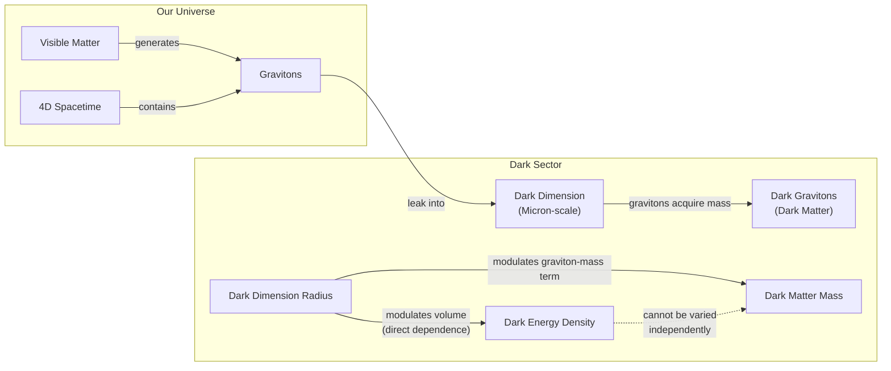

# A Dark Dimension Could Link the Universe’s Greatest Unknowns

The universe is a vast, dark, and mostly empty place. Ordinary matter, the stuff that makes up stars, planets, and you, accounts for just 5% of the cosmos. The rest is a mystery, divided between approximately 70% dark energy and 25% dark matter. Dark energy is an unknown force driving the universe's accelerated expansion, while dark matter is an unseen substance that holds galaxies together. These components are not "dark" in the literal sense; they are invisible, as they do not emit, reflect, or absorb light, and have so far proven impossible to observe directly [[1]](#1).

For decades, the standard model of cosmology, Lambda-CDM, has treated dark energy and dark matter as separate, unrelated phenomena. Dark energy is modeled as a cosmological constant (Lambda), an unchanging property of spacetime, while cold dark matter (CDM) is a stable, non-interacting particle. However, recent astronomical observations are beginning to challenge this assumption, suggesting the two might be physically intertwined [[2]](#2).

In 2024 and 2025, new results from the Dark Energy Spectroscopic Instrument (DESI) collaboration provided the most precise measurements of the expanding universe to date [[3]](#3), [[4]](#4). DESI is a 5-year survey that measures the spectra of tens of millions of galaxies and quasars, creating the largest 3D map of the universe and allowing scientists to look back as far as 11 billion years [[5]](#5), [[6]](#6). The data indicates that the strength of dark energy has not been constant. Instead, it seems to have peaked about two billion years ago and has been weakening ever since. More surprisingly, the results suggest that in an earlier cosmic era, dark energy may have grown stronger [[2]](#2), [[7]](#7).

This behavior, where dark energy appears to grow stronger, is known as the "phantom regime." It is like watching a ball spontaneously roll uphill, seemingly creating energy from nothing and defying the law of conservation [[2]](#2). Such an observation is only possible if the ball is under the influence of an unseen force. For dark energy, this implies its evolution might be tied to dark matter. As particle physicist Tim Tait noted, "you can imagine a case where one influences the other. And it would not be surprising if [they] were manifestations of a kind of unified theory of the dark universe" [[1]](#1).

These findings have spurred theorists to explore models where dark energy and dark matter are not separate entities but are coupled. We will examine how these dark-interaction models turn the phantom appearance into a bookkeeping artifact and simultaneously ease other cosmological puzzles, like the Hubble tension.

## Dark Interactions

The idea that dark energy and dark matter interact is not new. In 2005, a model proposed by physicist Justin Khoury and his collaborators explored a hypothetical question: could dark energy's density increase over time? They found that if dark energy and dark matter could exchange energy, they could produce what looked like phantom behavior without actually violating any physical laws. This happens because the interaction alters how dark matter's density changes as the universe expands. An observer who assumes dark matter is non-interacting would incorrectly attribute this change to dark energy, making it seem like dark energy has an equation of state less than -1 [[8]](#8). "It is the most natural, simplest way of achieving this," Khoury explained [[1]](#1).

Two decades later, the DESI results revived this line of inquiry. Khoury, along with Meng-Xiang Lin and Mark Trodden, constructed a model of dark interactions based on a dark-sector analogue of quantum chromodynamics (QCD), a fundamental theory of particle physics. In their model, the energy density of dark energy and the mass of dark matter particles change in concert, providing a concrete physical mechanism for the interaction [[1]](#1), [[9]](#9).

Another model, published in January 2025, suggests that dark matter could have transferred a small fraction of its energy to dark energy in the past [[10]](#10). Elsa Teixeira, a cosmologist and one of the paper's authors, explained the effect: "Dark matter is the main brake on [the universe’s] expansion," so easing up on that brake by transferring some of its energy would have caused the universe's expansion to accelerate [[1]](#1).

Physicist David Andriot argues that the appearance of a phantom regime is simply a result of bookkeeping. "Any change or evolution of the mass of dark matter has been put into the box of dark energy," he said [[1]](#1), [[11]](#11). This view is shared by Cumrun Vafa, a physicist at Harvard University. "The notion that you can compute dark energy independently of dark matter is wrong," Vafa stated. "That assumption, often made by cosmologists and also followed by the DESI team, led to the physically unacceptable phantom behavior" [[1]](#1). In other words, if dark matter's mass is changing, but you assume it is constant, the "missing" or "extra" energy gets incorrectly attributed to dark energy, making it appear to behave in impossible ways.

This perspective also offers a potential solution to the Hubble tension. This tension refers to the approximately 9% discrepancy between measurements of the universe's current expansion rate. Measurements from the early universe (via the cosmic microwave background) give one value, while measurements from the more recent universe (via supernovas) give a different, higher one [[1]](#1). According to the standard model, these values should be the same.

This discrepancy "has provoked heated debates in the cosmology community about whether this difference could be due to systematic errors or whether it is a signal of new physics," wrote Teixeira and her co-authors. Their model suggests that in a universe where dark energy and dark matter interact, this difference is not a crisis but an expected outcome [[1]](#1). The interaction alters the expansion history of the universe, naturally reconciling the measurements from different cosmic epochs without needing to invoke errors or entirely new particles.

These phenomenological interaction models receive a natural ultraviolet completion and common geometric origin within string theory, which we explore next through the dark-dimension proposal.

## A Dark Dimension

If dark energy and dark matter do interact, it could mean they share a common origin [[1]](#1). Work in string theory—the idea that the universe is made of vibrating strings—suggests how this might be possible. In 2019, building on ideas from string theory, Vafa and collaborators proposed that the mass of dark matter particles may vary over time, leading them to a shared link with dark energy through a "dark dimension" [[1]](#1), [[12]](#12).

String theory posits the existence of six or seven extra spatial dimensions curled up to an unobservable size. While these are typically thought to be near the minuscule Planck scale (10⁻³⁵ meters), the dark dimension proposal suggests one of these dimensions could be significantly larger—on the order of a micron (10⁻⁶ meters) [[13]](#13), [[14]](#14). This is still tiny, but enormous by comparison. This idea stems from the Swampland program, which explores which low-energy theories can be consistently combined with quantum gravity. One of its principles, the Distance Conjecture, suggests that the extremely small value of dark energy should be accompanied by a tower of light particles, which in this case points to a larger extra dimension [[12]](#12).

The mechanism works like this: gravitons, the theoretical particles that carry the force of gravity, could leak into this enlarged dark dimension. In doing so, they would acquire mass, becoming "dark gravitons." While residing in the dark dimension, their gravitational effects would still be felt in our familiar dimensions, allowing them to play the role of dark matter [[13]](#13), [[14]](#14). The mass they acquire is directly related to the size of the extra dimension.

Image 1: A conceptual architecture diagram illustrating the "Dark Dimension" proposal, showing graviton leakage, mass acquisition, and the coupled modulation of Dark Energy Density and Dark Matter Mass by the Dark Dimension Radius.

This scenario creates an inherent link between the dark sector's two main components. As Georges Obied, a physicist at the University of Chicago, puts it, "there is a very natural coupling between dark energy and dark matter" [[1]](#1). Any change in the size of the dark dimension would simultaneously affect both the density of dark energy (which depends on the volume of space) and the mass of dark matter (as the mass of dark gravitons is tied to the dimension's radius). The two cannot be varied independently.

In a July 2025 paper, Obied and Vafa, along with Alek Bedroya and David Wu, demonstrated that this scenario was consistent with the DESI data [[15]](#15), [[16]](#16), [[17]](#17). Their model, called the Fading Dark Sector model, predicts that both the strength of dark energy and the mass of dark matter will decrease over time as the radius of the dark dimension evolves. Furthermore, it predicts that the rate at which dark energy changes is proportional to its own energy density. Because this density is extraordinarily small, "it won’t change fast," Vafa explained. "It’s not surprising that we didn’t see it until now. We had to wait the entire age of the universe to detect something that small" [[1]](#1). The model's predictions align well with the DESI observations, including the peak around two billion years ago and the subsequent weakening [[15]](#15).

This coupling has a testable consequence: it predicts the existence of a new, long-range force between dark matter particles, separate from gravity [[18]](#18). Coincidentally, physicists Marc Kamionkowski and Michael Kesden had already searched for such a force back in 2006. They reasoned that if dark matter has a stronger attraction to itself than to ordinary matter, it would affect how galaxies are pulled apart by gravity, creating a distinctive "tidal tail" of stars and gas [[18]](#18).

They did not find evidence for this effect, which allowed them to set an upper limit on the strength of any such extra force. The value predicted by Vafa's team falls comfortably within this observational bound, meaning the theory is consistent with what we see [[1]](#1). "It is interesting that we are now finding connections between that fairly abstract work and observational and experimental work," Kamionkowski remarked [[1]](#1).

The fact that a prediction from string theory aligns with astrophysical evidence does not prove the theory is correct. However, any correspondence between the purely conceptual realm of string theory and the world of observation is an important step for researchers like Vafa, who have spent decades trying to generate testable predictions [[15]](#15), [[1]](#1).

Understanding the nature of dark energy and dark matter is a monumental challenge. The convergence of evidence and theory from different fields offers a promising path forward. As Obied said, "it’s the job of theoretical physicists to explore everything that’s possible, to get all the possibilities on the table. And eventually, the data will help us decide" [[1]](#1). By attacking the problem from multiple angles—observational cosmology, particle physics, and string theory—we move closer to a unified picture of the universe's dark side.

## References

- [1]  https://www.quantamagazine.org/a-dark-dimension-could-link-two-of-the-universes-great-unknowns-20260622
- [2]  https://www.instagram.com/reel/DZ5qWCPK7LF
- [3]  https://www.desi.lbl.gov
- [4]  https://news.fnal.gov/2025/03/new-desi-results-strengthen-hints-that-dark-energy-may-evolve
- [5]  https://news.fnal.gov/2021/05/dark-energy-spectroscopic-instrument-starts-5-year-survey
- [6]  https://www.ohio.edu/news/2025/03/universe-might-be-changing-new-desi-data-shows-dark-energy-may-evolve-over-time
- [7]  https://indico.global/event/15767/contributions/138193/attachments/65687/127027/2025.12%20DPF%20Dark%20Energy%20and%20Cosmology%20v1%20(B%20Field).pdf
- [8]  https://arxiv.org/abs/astro-ph/0510628
- [9]  https://indico.global/event/14705/contributions/155116/attachments/72358/141320/PASCOS2026.pptx%20(1).pdf
- [10]  https://www.pnas.org/doi/10.1073/pnas.2524499122
- [11]  https://arxiv.org/abs/2505.10410
- [12]  https://arxiv.org/abs/2205.12293
- [13]  https://www.advancedsciencenews.com/a-dark-dimension-could-help-explain-the-origin-of-dark-energy
- [14]  https://www.quantamagazine.org/in-a-dark-dimension-physicists-search-for-missing-matter-20240201
- [15]  https://arxiv.org/abs/2507.03090
- [16]  https://ui.adsabs.harvard.edu/abs/2025arXiv250703090B/abstract
- [17]  https://scholar.google.com/citations?user=24NnAxcAAAAJ&hl=en
- [18]  https://arxiv.org/abs/astro-ph/0606566
- [19]  https://cerncourier.com/four-reasons-dark-energy-should-evolve-with-time
- [20]  https://indico.global/event/551/contributions/130592/attachments/61097/117637/Dark%20Sector%20and%20the%20Swampland.pdf
- [21]  https://link.aps.org/doi/10.1103/9lf2-33zf
- [22]  https://news.ucr.edu/articles/2021/06/02/new-dimension-quest-understand-dark-matter
- [23]  https://d-nb.info/1336107839/34
- [24]  https://link.springer.com/article/10.1140/epjc/s10052-024-12622-y
- [25]  https://link.aps.org/doi/10.1103/p51k-7rw2
- [26]  https://indico.cern.ch/event/473000/contributions/1993414/attachments/1209863/1764345/tait-Aspen.pdf