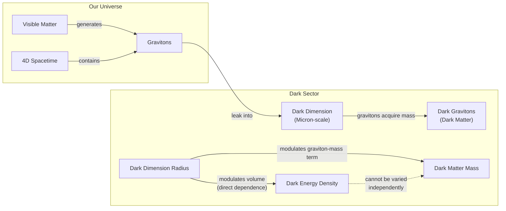

# The Cosmic Web: Are Dark Matter and Dark Energy Two Sides of the Same Coin?

According to our best estimates, the universe we see is just the tip of the iceberg. Approximately 70% of the cosmos consists of dark energy, an unknown force driving space to expand, and another 25% is dark matter, a mysterious material holding galaxies together. The ordinary matter we can see and touch accounts for a mere 5% [[1]](https://www.quantamagazine.org/in-a-dark-dimension-physicists-search-for-missing-matter-20240201). Semantically, these dominant components are not so much “dark” as they are invisible; they do not emit, reflect, or absorb light, making them impossible to observe directly [[2]](https://www.quantamagazine.org/a-dark-dimension-could-link-two-of-the-universes-great-unknowns-20260622).

The standard model of cosmology, Lambda-CDM, treats dark energy as a cosmological constant (Lambda) and assumes it has nothing to do with dark matter. They are regarded as separate, elusive entities. However, recent astronomical observations have spurred scientists to investigate a less popular idea: that the two are, in fact, physically intertwined [[2]](https://www.quantamagazine.org/a-dark-dimension-could-link-two-of-the-universes-great-unknowns-20260622).

In 2024 and 2025, results from the Dark Energy Spectroscopic Instrument (DESI) collaboration provided evidence that the strength of dark energy has not been constant. The data suggests it may have peaked about two billion years ago and has weakened since. More perplexingly, the results also hinted that in an earlier era, dark energy could have grown stronger [[3]](https://www.instagram.com/reel/DZ5qWCPK7LF), [[4]](https://www.ohio.edu/news/2025/03/universe-might-be-changing-new-desi-data-shows-dark-energy-may-evolve-over-time), [[5]](https://news.fnal.gov/2025/03/new-desi-results-strengthen-hints-that-dark-energy-may-evolve). Researchers describe this as dark energy entering the “phantom regime,” a situation likened to a ball spontaneously rolling uphill. This behavior seems to defy the law of energy conservation unless some external influence is at play [[3]](https://www.instagram.com/reel/DZ5qWCPK7LF). A growing number of theorists are now looking into the possibility that what’s influencing dark energy are its ties to dark matter.

Even though scientists have assumed that dark energy and dark matter “don’t have anything to do with each other,” said Tim Tait, a particle physicist at the University of California, Irvine, “you can imagine a case where one influences the other. And it would not be surprising if [they] were manifestations of a kind of unified theory of the dark universe” [[2]](https://www.quantamagazine.org/a-dark-dimension-could-link-two-of-the-universes-great-unknowns-20260622). We will next examine concrete dark-interaction models that turn the phantom appearance into a bookkeeping artifact and simultaneously ease the Hubble tension.

## Dark Interactions

The idea that dark matter and dark energy interact is not new. In 2005, a model proposed by Justin Khoury and collaborators challenged the standard Lambda-CDM model by suggesting a time-varying dark energy density that could increase by drawing energy from dark matter [[6]](https://cerncourier.com/four-reasons-dark-energy-should-evolve-with-time). This interaction could produce what looked like phantom behavior without actually violating energy conservation. “It is the most natural, simplest way of achieving this,” Khoury said [[2]](https://www.quantamagazine.org/a-dark-dimension-could-link-two-of-the-universes-great-unknowns-20260622).

Two decades later, the DESI findings spurred Khoury and his colleagues, Meng-Xiang Lin and Mark Trodden, to construct a model of dark interactions based on a dark-sector analogue of quantum chromodynamics (QCD), a cornerstone of particle physics. In this new model, both the energy density of dark energy and the mass of dark matter particles change in concert [[2]](https://www.quantamagazine.org/a-dark-dimension-could-link-two-of-the-universes-great-unknowns-20260622).

Another recent model, published in January 2025, imagines something similar. It proposes that dark matter could have transferred a small fraction of its energy to dark energy in a previous cosmic era. “Dark matter is the main brake on [the universe’s] expansion,” explained Elsa Teixeira, a cosmologist at the University of Montpellier and one of the authors. Easing up on that brake would have caused the expansion to accelerate [[2]](https://www.quantamagazine.org/a-dark-dimension-could-link-two-of-the-universes-great-unknowns-20260622), [[7]](https://www.pnas.org/doi/10.1073/pnas.2524499122).

The appearance of phantom behavior is essentially a result of bookkeeping, according to David Andriot, a physicist at CNRS. When cosmologists analyze observational data, they typically assume that the energy density of dark matter scales with the universe's expansion as a simple inverse cube of the scale factor. However, if dark matter's mass is evolving due to an interaction, its energy density will follow a different history. The discrepancy between the assumed evolution and the actual evolution is then incorrectly attributed to the dark energy component. “Any change or evolution of the mass of dark matter has been put into the box of dark energy,” said Andriot, who presented his own coupled model in May 2025 [[2]](https://www.quantamagazine.org/a-dark-dimension-could-link-two-of-the-universes-great-unknowns-20260622).

Harvard physicist Cumrun Vafa agrees, stating that the assumption of treating the two components independently leads to unphysical results. “The notion that you can compute dark energy independently of dark matter is wrong,” he said. “That assumption, often made by cosmologists and also followed by the DESI team, led to the physically unacceptable phantom behavior” [[2]](https://www.quantamagazine.org/a-dark-dimension-could-link-two-of-the-universes-great-unknowns-20260622).

These interacting-sector models also offer a potential solution to one of cosmology's most persistent problems: the Hubble tension. This tension refers to the approximately 9% discrepancy between the universe's expansion rate as measured from the early universe and from the more recent universe. The early-universe measurement is derived from the Cosmic Microwave Background (CMB), which provides a snapshot of how the cosmos was growing in its infancy. The late-universe measurement relies on more recent phenomena, such as Type Ia supernovae, which act as "standard candles" to reveal how the universe is growing now. According to the standard model, these rates should be the same [[2]](https://www.quantamagazine.org/a-dark-dimension-could-link-two-of-the-universes-great-unknowns-20260622).

This discrepancy “has provoked heated debates in the cosmology community about whether this difference could be due to systematic errors or whether it is a signal of new physics,” Teixeira and her co-authors wrote. Their model suggests that in a world where dark energy and dark matter interact, the expansion history is modified. What seemed to be a crisis caused by disparate expansion rates instead becomes something to be expected [[2]](https://www.quantamagazine.org/a-dark-dimension-could-link-two-of-the-universes-great-unknowns-20260622). These phenomenological models receive a natural geometric origin within string theory, which we explore next through the dark-dimension proposal.

## A Dark Dimension

If dark energy and dark matter do interact, it could mean they share a common origin [[2]](https://www.quantamagazine.org/a-dark-dimension-could-link-two-of-the-universes-great-unknowns-20260622). Ongoing work in string theory, which posits that our universe is fundamentally made of vibrating strings, suggests how. Building on this framework, Vafa and collaborators proposed in 2019 and 2022 that both dark energy and the mass of dark matter particles may vary over time, linked to a so-called "dark dimension" [[2]](https://www.quantamagazine.org/a-dark-dimension-could-link-two-of-the-universes-great-unknowns-20260622).

String theory requires the existence of extra dimensions beyond our familiar three of space and one of time. While these are typically thought to be curled up at the incredibly tiny Planck scale (10⁻³⁵ meters), the new theory proposes that one of these could actually be much larger. This is the "dark dimension," and it could be on the order of a micron (10⁻⁶ meters) [[8]](https://www.advancedsciencenews.com/a-dark-dimension-could-help-explain-the-origin-of-dark-energy), [[2]](https://www.quantamagazine.org/a-dark-dimension-could-link-two-of-the-universes-great-unknowns-20260622). This is still minute, but enormous in comparison.

The mechanism works like this: gravitons, the theoretical particles that carry the force of gravity, could leak into this enlarged dark dimension. In doing so, they would acquire mass, becoming "dark gravitons." While residing in the dark dimension, their gravitational effects would still be felt in our dimensions, allowing them to fulfill the role normally ascribed to dark matter [[2]](https://www.quantamagazine.org/a-dark-dimension-could-link-two-of-the-universes-great-unknowns-20260622).

In this scenario, “there is a very natural coupling between dark energy and dark matter,” said Georges Obied, a physicist at the University of Chicago. Changes in the size of the dark dimension would affect both dark energy (via the volume dependence of vacuum energy) and dark matter (as the mass of dark gravitons depends on the dimension's radius) [[2]](https://www.quantamagazine.org/a-dark-dimension-could-link-two-of-the-universes-great-unknowns-20260622).

Image 1: A conceptual diagram illustrating the "Dark Dimension" proposal, showing graviton leakage, mass acquisition, and the coupled modulation of Dark Energy Density and Dark Matter Mass by the Dark Dimension Radius.

In a July 2025 paper, Obied and Vafa, along with Alek Bedroya and David Wu, demonstrated the consistency of this scenario, known as the Fading Dark Sector (FDS) model, with the DESI data [[10]](https://ui.adsabs.harvard.edu/abs/2025arXiv250703090B/abstract), [[11]](https://scholar.google.com/citations?user=24NnAxcAAAAJ&hl=en). The model's predictions align point-by-point with observations. First, it naturally accommodates an evolving dark energy, consistent with DESI's primary finding. Second, the coupled evolution provides a physical explanation for the apparent phantom behavior. Third, the model predicts that the strength of dark energy and the mass of dark matter will decrease over time, with the rate of change in dark energy being proportional to its energy density. Because astrophysical measurements tell us the energy density of dark energy is extraordinarily small, “it won’t change fast,” Vafa said [[2]](https://www.quantamagazine.org/a-dark-dimension-could-link-two-of-the-universes-great-unknowns-20260622). "It’s not surprising that we didn’t see it until now. We had to wait the entire age of the universe to detect something that small" [[2]](https://www.quantamagazine.org/a-dark-dimension-could-link-two-of-the-universes-great-unknowns-20260622). Finally, the FDS model provides an excellent quantitative fit to the DESI DR2 data, reproducing the same statistical significance as other phenomenological models while offering a physical explanation for the phantom behavior.

A direct consequence of this coupling is the emergence of a new, long-range force between dark matter particles, separate from gravity. The good news, Obied said, is that “there could be astrophysical ways of testing this” [[2]](https://www.quantamagazine.org/a-dark-dimension-could-link-two-of-the-universes-great-unknowns-20260622). Coincidentally, physicists Marc Kamionkowski and Michael Kesden had already looked into such a test back in 2006. They theorized that if dark matter has a stronger gravitational attraction to other dark matter, it would create a special kind of "tidal tail." This is an extended stream of stars and gas that forms during galactic interactions. They looked for this effect and did not find it, allowing them to set an upper bound on the strength of this extra force. The value predicted by Vafa's team falls well within this observational limit [[2]](https://www.quantamagazine.org/a-dark-dimension-could-link-two-of-the-universes-great-unknowns-20260622). "It is interesting that we are now finding connections between that fairly abstract work and observational and experimental work,” Kamionkowski said [[2]](https://www.quantamagazine.org/a-dark-dimension-could-link-two-of-the-universes-great-unknowns-20260622).

The fact that a prediction based on string theory calculations roughly agrees with astrophysical evidence does not confirm these "stringy" models. But any correspondence between string theory and experiment is gratifying to Vafa, who has spent decades trying to generate testable predictions from the purely conceptual realm [[2]](https://www.quantamagazine.org/a-dark-dimension-could-link-two-of-the-universes-great-unknowns-20260622).

Understanding dark energy and dark matter is a daunting problem. “And I think it’s very beneficial to come at this in different ways,” Obied commented, whether from observational cosmology, particle physics, or string theory [[2]](https://www.quantamagazine.org/a-dark-dimension-could-link-two-of-the-universes-great-unknowns-20260622). This interdisciplinary convergence underscores a powerful methodological approach. "It’s the job of theoretical physicists to explore everything that’s possible, to get all the possibilities on the table," Obied said. "And eventually, the data will help us decide" [[2]](https://www.quantamagazine.org/a-dark-dimension-could-link-two-of-the-universes-great-unknowns-20260622).

## References

- [1] https://www.quantamagazine.org/in-a-dark-dimension-physicists-search-for-missing-matter-20240201
- [2] https://www.quantamagazine.org/a-dark-dimension-could-link-two-of-the-universes-great-unknowns-20260622
- [3] https://www.instagram.com/reel/DZ5qWCPK7LF
- [4] https://www.ohio.edu/news/2025/03/universe-might-be-changing-new-desi-data-shows-dark-energy-may-evolve-over-time
- [5] https://news.fnal.gov/2025/03/new-desi-results-strengthen-hints-that-dark-energy-may-evolve
- [6] https://cerncourier.com/four-reasons-dark-energy-should-evolve-with-time
- [7] https://www.pnas.org/doi/10.1073/pnas.2524499122
- [8] https://www.advancedsciencenews.com/a-dark-dimension-could-help-explain-the-origin-of-dark-energy
- [9] https://indico.global/event/551/contributions/130592/attachments/61097/117637/Dark%20Sector%20and%20the%20Swampland.pdf
- [10] https://ui.adsabs.harvard.edu/abs/2025arXiv250703090B/abstract
- [11] https://scholar.google.com/citations?user=24NnAxcAAAAJ&hl=en
- [12] https://indico.global/event/14705/contributions/155116/attachments/72358/141320/PASCOS2026.pptx%20(1).pdf
- [13] https://indico.cern.ch/event/473000/contributions/1993414/attachments/1209863/1764345/tait-Aspen.pdf
- [14] https://news.ucr.edu/articles/2021/06/02/new-dimension-quest-understand-dark-matter
- [15] https://d-nb.info/1336107839/34
- [16] https://link.springer.com/article/10.1140/epjc/s10052-024-12622-y
- [17] https://link.aps.org/doi/10.1103/p51k-7rw2
- [18] https://indico.global/event/15767/contributions/138193/attachments/65687/127027/2025.12%20DPF%20Dark%20Energy%20and%20Cosmology%20v1%20(B%20Field).pdf
- [19] https://news.fnal.gov/2021/05/dark-energy-spectroscopic-instrument-starts-5-year-survey
</article>