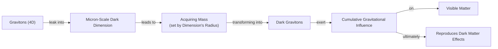

# The Phantom Universe: Is Dark Energy Coupled to Dark Matter?

Our universe is a dark place. According to current estimates, approximately 70% of the cosmos consists of dark energy, an unknown force pushing space to expand, while another 25% is dark matter, a mysterious material holding galaxies together. The ordinary matter we can see and interact with, such as stars, planets, and ourselves, makes up a mere 5%. Semantically, "dark" energy and "dark" matter are not so much dark as they are invisible. They do not emit, reflect, or absorb light, and have so far proven impossible to observe directly [[11]](https://www.quantamagazine.org/a-dark-dimension-could-link-two-of-the-universes-great-unknowns-20260622).

The standard model of cosmology, Lambda-CDM (ΛCDM), treats these two components as separate and unrelated. Dark matter is cold and non-interacting, while dark energy is a cosmological constant, an intrinsic property of space itself with a fixed, unchanging strength. However, recent astronomical observations have begun to challenge this assumption, suggesting the two might be physically intertwined.

The idea of a cosmological constant has a winding history. Einstein first introduced it to force a static universe in his theory of general relativity. He later dismissed it as his "biggest blunder" when the universe was found to be expanding. Decades later, the concept was revived to represent the constant dark energy driving the accelerated expansion, becoming a cornerstone of the standard model for over twenty years [[18]](https://www.ukri.org/news/desi-results-suggest-dark-energy-may-evolve-over-time).

In 2024 and 2025, the Dark Energy Spectroscopic Instrument (DESI) collaboration released results from the largest 3D map of the universe ever created. Mounted on the Mayall 4-meter Telescope, DESI uses 5,000 robotic fiber-optic cables to capture light from millions of galaxies and quasars, mapping the universe's expansion over 11 billion years [[15]](https://news.fnal.gov/2025/03/new-desi-results-strengthen-hints-that-dark-energy-may-evolve), [[3]](https://news.fnal.gov/2021/05/dark-energy-spectroscopic-instrument-starts-5-year-survey), [[5]](https://www.ohio.edu/news/2025/03/universe-might-be-changing-new-desi-data-shows-dark-energy-may-evolve-over-time). The data indicates that the strength of dark energy has not been constant. It appears to have peaked about two billion years ago and has been weakening ever since.

More surprisingly, the results suggest that in an earlier cosmic era, dark energy could have grown stronger, entering what physicists call the "phantom regime" [[11]](https://www.quantamagazine.org/a-dark-dimension-could-link-two-of-the-universes-great-unknowns-20260622). This behavior is like a ball spontaneously rolling uphill. It seems to violate the law of energy conservation, creating energy from nothing, unless some external force is at play. This has led a growing number of theorists to investigate the possibility that dark energy is coupled to dark matter. As Tim Tait, a particle physicist at the University of California, Irvine, puts it, "you can imagine a case where one influences the other. And it would not be surprising if [they] were manifestations of a kind of unified theory of the dark universe" [[11]](https://www.quantamagazine.org/a-dark-dimension-could-link-two-of-the-universes-great-unknowns-20260622).

In this article, we will explore the theoretical models that resolve this apparent violation. We will examine how dark-interaction models can explain the phantom appearance as a simple bookkeeping artifact and, in the process, ease other persistent tensions in cosmology.

## Dark Interactions

The idea that dark energy and dark matter might interact is not new. As far back as 2005, a model proposed by physicist Justin Khoury and his colleagues posed a hypothetical question: could there be a form of dark energy whose density increases over time? They found that if dark energy could receive energy from dark matter, it could produce what looked like phantom behavior without actually violating energy conservation [[6]](https://cerncourier.com/four-reasons-dark-energy-should-evolve-with-time), [[11]](https://www.quantamagazine.org/a-dark-dimension-could-link-two-of-the-universes-great-unknowns-20260622). The mechanism works by altering the redshift-dependence of the matter density. An observer who fits the data assuming non-interacting dark matter would infer an effective dark energy fluid with an equation of state less than -1. "It is the most natural, simplest way of achieving this," Khoury said [[11]](https://www.quantamagazine.org/a-dark-dimension-could-link-two-of-the-universes-great-unknowns-20260622).

Two decades later, the DESI results spurred Khoury and his colleagues Meng-Xiang Lin and Mark Trodden to construct a more explicit model. Their framework is based on a dark-sector analogue of quantum chromodynamics (QCD), a cornerstone of particle physics. Their model draws an analogy to QCD, the theory of the strong nuclear force, where particle masses and energy scales are dynamically linked. By proposing a similar dynamic involving screened forces in the dark sector, they provide a concrete physical mechanism for the coordinated evolution of dark matter and dark energy [[11]](https://www.quantamagazine.org/a-dark-dimension-could-link-two-of-the-universes-great-unknowns-20260622), [[13]](https://indico.global/event/14705/contributions/155116/attachments/72358/141320/PASCOS2026.pptx%20(1).pdf).

Another recent model, published in January 2025 and inspired by hybrid inflation, imagines a similar energy transfer using two interacting scalar fields for dark energy and dark matter. According to this scenario, dark matter could have transferred a small fraction of its energy to dark energy in a previous cosmic era [[11]](https://www.quantamagazine.org/a-dark-dimension-could-link-two-of-the-universes-great-unknowns-20260622), [[14]](https://www.pnas.org/doi/10.1073/pnas.2524499122). This transfer would reduce the overall gravitational pull of dark matter that acts as a brake on cosmic expansion. A lighter touch on the brakes naturally leads to the observed acceleration, without dark energy needing to be a constant property of space itself. "Dark matter is the main brake on [the universe’s] expansion," explained Elsa Teixeira, a cosmologist at the University of Montpellier and one of the study's authors. Easing up on that brake would cause the universe's expansion to accelerate [[11]](https://www.quantamagazine.org/a-dark-dimension-could-link-two-of-the-universes-great-unknowns-20260622).

The appearance of phantom behavior, then, is a result of bookkeeping. David Andriot, a physicist at CNRS, the French National Center for Scientific Research, argued that "any change or evolution of the mass of dark matter has been put into the box of dark energy" [[11]](https://www.quantamagazine.org/a-dark-dimension-could-link-two-of-the-universes-great-unknowns-20260622). Andriot's argument suggests that cosmologists, assuming a constant mass for dark matter particles as per ΛCDM, would misinterpret any energy lost from a decaying dark matter particle as an increase in dark energy, creating the illusion of a phantom regime. Harvard physicist Cumrun Vafa agreed, stating, "The notion that you can compute dark energy independently of dark matter is wrong. That assumption, often made by cosmologists and also followed by the DESI team, led to the physically unacceptable phantom behavior" [[11]](https://www.quantamagazine.org/a-dark-dimension-could-link-two-of-the-universes-great-unknowns-20260622).

Beyond explaining the phantom regime, these interaction models may also help resolve one of cosmology's most persistent problems: the Hubble tension. This tension arises from a discrepancy in measurements of the universe's current expansion rate, the Hubble constant. Measurements from the early universe (via the cosmic microwave background) and the more recent universe (via supernovae) vary by about 9%, a difference that the standard ΛCDM model cannot explain [[11]](https://www.quantamagazine.org/a-dark-dimension-could-link-two-of-the-universes-great-unknowns-20260622). By altering the expansion history, particularly in the transition from the early, matter-dominated era to the late, dark-energy-dominated era, these models can reconcile the two measurements without requiring new particles or undiscovered errors. This discrepancy "has provoked heated debates in the cosmology community about whether this difference could be due to systematic errors or whether it is a signal of new physics," Teixeira and her co-authors wrote. Their model suggests that in a universe where dark energy and dark matter interact, this tension is not a crisis but an expected outcome [[11]](https://www.quantamagazine.org/a-dark-dimension-could-link-two-of-the-universes-great-unknowns-20260622).

These phenomenological models receive a natural geometric origin within string theory, which we explore next through the dark-dimension proposal.

## A Dark Dimension

If dark energy and dark matter do interact, it could mean they share a common origin [[11]](https://www.quantamagazine.org/a-dark-dimension-could-link-two-of-the-universes-great-unknowns-20260622). Ongoing work in string theory—specifically a 2019 proposal from Vafa and collaborators, extended in 2022—suggests a way these concepts might be connected. This framework naturally allows dark energy to vary through the dynamics of "moduli fields," which control the size and shape of extra dimensions [[11]](https://www.quantamagazine.org/a-dark-dimension-could-link-two-of-the-universes-great-unknowns-20260622), [[8]](https://indico.global/event/551/contributions/130592/attachments/61097/117637/Dark%20Sector%20and%20the%20Swampland.pdf). This approach is guided by the "distance conjecture," which posits that when a physical parameter in string theory takes on an extreme value—like the incredibly small observed value of dark energy—other particles in the theory should become exceptionally light [[7]](https://www.quantamagazine.org/in-a-dark-dimension-physicists-search-for-missing-matter-20240201). This led Vafa and his collaborators to propose that both dark energy and the mass of dark matter particles may vary over time, linked through a so-called "dark dimension" [[11]](https://www.quantamagazine.org/a-dark-dimension-could-link-two-of-the-universes-great-unknowns-20260622).

String theory suggests the existence of six or seven extra spatial dimensions. While these are typically thought to be infinitesimally small (near the Planck scale of 10⁻³⁵ meters), the researchers proposed that one of these—the dark dimension—could be significantly larger, on the order of a micron (10⁻⁶ meters) [[11]](https://www.quantamagazine.org/a-dark-dimension-could-link-two-of-the-universes-great-unknowns-20260622), [[9]](https://www.advancedsciencenews.com/a-dark-dimension-could-help-explain-the-origin-of-dark-energy).

This enlarged dimension provides a mechanism for unifying the dark sector. Gravitons, the theoretical particles that carry the force of gravity, could leak into this dark dimension. According to the model, this doesn't just create one type of particle, but an entire "tower" of dark gravitons with a spectrum of different masses. The lightest of these are stable enough to persist until the present day. While residing in the dark dimension, their cumulative gravitational effects would still be felt in our familiar dimensions, allowing them to fulfill the role normally ascribed to dark matter [[7]](https://www.quantamagazine.org/in-a-dark-dimension-physicists-search-for-missing-matter-20240201), [[11]](https://www.quantamagazine.org/a-dark-dimension-could-link-two-of-the-universes-great-unknowns-20260622). This process is illustrated in Image 1.



Image 1: A flowchart illustrating the mechanism by which gravitons acquire mass and mimic dark matter within the dark dimension scenario.

In this scenario, "there is a very natural coupling between dark energy and dark matter," said Georges Obied, a physicist at the University of Chicago [[11]](https://www.quantamagazine.org/a-dark-dimension-could-link-two-of-the-universes-great-unknowns-20260622). Any change in the size of the dark dimension would affect both dark energy (via the volume dependence of vacuum energy) and dark matter (as the mass of dark gravitons depends on the dimension's radius). Thus, the two components cannot be varied independently, as shown in Image 2.

```mermaid
graph TD
    A["Change in Dark-Dimension Radius"]
    B["Volume Dependence of Vacuum Energy"]
    C["Dark-Energy Density"]
    D["Graviton-Mass Term"]
    E["Dark-Matter Mass"]

    A -- "affects" --> B
    B -- "modulates" --> C
    A -- "affects" --> D
    D -- "modulates" --> E

    C <-->| "Cannot be Varied Independently" | E
```

Image 2: A dependency diagram showing the natural coupling between dark energy and dark matter.

In a July 2025 paper, Obied, Vafa, and collaborators showed this scenario was consistent with DESI data [[11]](https://www.quantamagazine.org/a-dark-dimension-could-link-two-of-the-universes-great-unknowns-20260622), [[10]](https://ui.adsabs.harvard.edu/abs/2025arXiv250703090B/abstract). Their Fading Dark Sector (FDS) model, parameterized by `V = V0 exp(-cφ)` and `m_DM = m0 exp(-c'φ)`, predicts that dark energy's strength and dark matter's mass both decrease over time [[12]](https://arxiv.org/abs/2507.03090). The rate of change is proportional to dark energy's density, which is so small that the effect is subtle. "It’s not surprising that we didn’t see it until now," Vafa explained. "We had to wait the entire age of the universe to detect something that small" [[11]](https://www.quantamagazine.org/a-dark-dimension-could-link-two-of-the-universes-great-unknowns-20260622).

This coupling implies a new force between dark matter particles, leading to several testable predictions [[11]](https://www.quantamagazine.org/a-dark-dimension-could-link-two-of-the-universes-great-unknowns-20260622). For instance, the decay of heavier dark gravitons would give lighter ones a "kick velocity," potentially altering galaxy formation in ways consistent with recent survey data [[7]](https://www.quantamagazine.org/in-a-dark-dimension-physicists-search-for-missing-matter-20240201). The model also predicts subtle changes to gravitational wave signals and deviations from gravity at the micron scale, both of which are targets for future experiments [[19]](https://arxiv.org/html/2605.12948v1), [[7]](https://www.quantamagazine.org/in-a-dark-dimension-physicists-search-for-missing-matter-20240201).

An earlier search for such a force was conducted by Marc Kamionkowski and Michael Kesden in 2006. They used the tidal streams of the Sagittarius dwarf galaxy to set an upper bound on any extra self-attraction for dark matter. A stronger force would preferentially enhance the trailing stream over the leading one. The value predicted by Vafa's team fell comfortably within this observational bound [[11]](https://www.quantamagazine.org/a-dark-dimension-could-link-two-of-the-universes-great-unknowns-20260622). "It is interesting that we are now finding connections between that fairly abstract work and observational and experimental work," Kamionkowski said [[11]](https://www.quantamagazine.org/a-dark-dimension-could-link-two-of-the-universes-great-unknowns-20260622). The FDS model's best-fit value for the coupling parameter `c'` is remarkably consistent with the experimental upper bound from these fifth-force searches [[12]](https://arxiv.org/abs/2507.03090).

The fact that a prediction from string theory agreed with astrophysical evidence does not confirm the model. The proposal has its skeptics. "The conjectures it is based on are somewhat ambitious, and I think the current evidence for them is rather weak," noted Oxford physicist Joseph Conlon [[7]](https://www.quantamagazine.org/in-a-dark-dimension-physicists-search-for-missing-matter-20240201). Still, any correspondence between theory and experiment is gratifying to Vafa, who has spent decades trying to generate testable predictions from the purely conceptual realm of string theory [[11]](https://www.quantamagazine.org/a-dark-dimension-could-link-two-of-the-universes-great-unknowns-20260622).

Ultimately, understanding the true nature of the dark sector requires a multi-pronged approach. As Obied noted, "I think it’s very beneficial to come at this in different ways—be it from observational cosmology, from particle physics, or from string theory. This is how people should do science. It’s the job of theoretical physicists to explore everything that’s possible... And eventually, the data will help us decide" [[11]](https://www.quantamagazine.org/a-dark-dimension-could-link-two-of-the-universes-great-unknowns-20260622).

## Conclusion

The recent findings from DESI are challenging the long-held assumption that dark energy and dark matter are independent components of our universe. The evidence for a time-varying dark energy, particularly its apparent entry into a "phantom regime," has spurred a wave of theoretical work exploring the possibility of a coupled dark sector. Models where dark matter and dark energy interact or share a common origin can naturally explain these observations as bookkeeping effects, while also offering a potential resolution to the Hubble tension.

Frameworks rooted in string theory, like the dark dimension scenario, provide a promising geometric foundation for this coupling. By unifying dark energy and dark matter, these models make concrete, testable predictions, such as a new long-range force, that are already being constrained by astronomical observations. While still far from confirmed, the convergence of evidence from cosmology, particle physics, and string theory points toward a more interconnected and dynamic dark universe than we previously imagined.

## References

- [1] https://indico.global/event/15767/contributions/138193/attachments/65687/127027/2025.12%20DPF%20Dark%20Energy%20and%20Cosmology%20v1%20(B%20Field).pdf
- [2] https://news.ucr.edu/articles/2021/06/02/new-dimension-quest-understand-dark-matter
- [3] https://news.fnal.gov/2021/05/dark-energy-spectroscopic-instrument-starts-5-year-survey
- [4] https://link.springer.com/article/10.1140/epjc/s10052-024-12622-y
- [5] https://www.ohio.edu/news/2025/03/universe-might-be-changing-new-desi-data-shows-dark-energy-may-evolve-over-time
- [6] https://cerncourier.com/four-reasons-dark-energy-should-evolve-with-time
- [7] https://www.quantamagazine.org/in-a-dark-dimension-physicists-search-for-missing-matter-20240201
- [8] https://indico.global/event/551/contributions/130592/attachments/61097/117637/Dark%20Sector%20and%20the%20Swampland.pdf
- [9] https://www.advancedsciencenews.com/a-dark-dimension-could-help-explain-the-origin-of-dark-energy
- [10] https://ui.adsabs.harvard.edu/abs/2025arXiv250703090B/abstract
- [11] https://www.quantamagazine.org/a-dark-dimension-could-link-two-of-the-universes-great-unknowns-20260622
- [12] https://arxiv.org/abs/2507.03090
- [13] https://indico.global/event/14705/contributions/155116/attachments/72358/141320/PASCOS2026.pptx%20(1).pdf
- [14] https://www.pnas.org/doi/10.1073/pnas.2524499122
- [15] https://news.fnal.gov/2025/03/new-desi-results-strengthen-hints-that-dark-energy-may-evolve
- [16] https://indico.cern.ch/event/473000/contributions/1993414/attachments/1209863/1764345/tait-Aspen.pdf
- [17] https://link.aps.org/doi/10.1103/p51k-7rw2
- [18] https://www.ukri.org/news/desi-results-suggest-dark-energy-may-evolve-over-time
- [19] https://arxiv.org/html/2605.12948v1
</article>