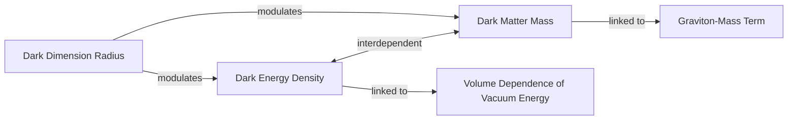

# The Dark Couple: Are Dark Matter and Dark Energy a Single Unified Force?

Our universe is dominated by mysteries. Approximately 70% of its energy density is in the form of dark energy, the enigmatic force driving cosmic acceleration. Another 25% is dark matter, an invisible substance whose gravity holds galaxies together. The remaining 5% is the ordinary, observable matter that constitutes everything we can see and touch. The term "dark" is a statement about our ignorance; these components are invisible because they do not appear to emit or absorb light, making them impossible to observe directly.

The standard model of cosmology, Lambda-CDM (ΛCDM), treats these two phenomena as entirely separate. It assumes dark energy is a cosmological constant—a fixed, unchanging property of spacetime—and that dark matter is a stable, non-interacting particle. This framework has been remarkably successful, but new evidence challenges its core assumption of independence. Recent results from the Dark Energy Spectroscopic Instrument (DESI) collaboration suggest that dark energy and dark matter may be physically intertwined, sharing a common origin or interacting directly [[1]](https://arxiv.org/abs/2503.14738).

The 2024/2025 DESI data, which created the largest 3D map of the universe to date, indicates that the strength of dark energy has not been constant. The data suggests its influence peaked roughly two billion years ago and has been weakening ever since [[11]](https://www.pnas.org/doi/10.1073/pnas.2524499122), [[12]](https://indico.global/event/15767/contributions/138193/attachments/65687/127027/2025.12%20DPF%20Dark%20Energy%20and%20Cosmology%20v1%20(B%20Field).pdf). Even more puzzling, the analysis points to a "phantom regime" in the past, where dark energy grew stronger over time [[1]](https://arxiv.org/abs/2503.14738). This is like a ball spontaneously rolling uphill, appearing to create energy from nothing and violating fundamental conservation laws.

This apparent paradox has galvanized theorists to explore models where the dark sector is not separate but unified. As particle physicist Tim Tait noted, while scientists have generally assumed the two "don’t have anything to do with each other," one can "imagine a case where one influences the other. And it would not be surprising if [they] were manifestations of a kind of unified theory of the dark universe" [[17]](https://www.quantamagazine.org/a-dark-dimension-could-link-two-of-the-universes-great-unknowns-20260622). If they can exchange energy, what looks like a violation of physics could simply be an accounting error. We next examine concrete dark-interaction models that turn the phantom appearance into a bookkeeping artifact and simultaneously ease the long-standing Hubble tension.

## Dark Interactions

The tension between early and late-universe measurements of the cosmic expansion rate, known as the Hubble tension, represents a roughly 9% discrepancy that has resisted explanation [[5]](https://link.aps.org/doi/10.1103/9lf2-33zf). While some suspect systematic errors in the measurements, another possibility is that our model of the universe is incomplete. Interacting dark sector models offer a compelling solution by modifying the expansion history itself.

From a theoretical standpoint, a time-dependent dark energy is more plausible than a static cosmological constant, which suffers from a 120-order-of-magnitude discrepancy with particle physics and is difficult to reconcile with superstring theory [[31]](https://cerncourier.com/four-reasons-dark-energy-should-evolve-with-time).

As far back as 2005, a model by Justin Khoury and collaborators posed a hypothetical question: could dark energy’s density increase over time by drawing energy from dark matter? They found that if the two sectors could affect one another, they could produce what looked like phantom behavior without actually violating energy conservation [[2]](https://arxiv.org/abs/astro-ph/0510628), [[17]](https://www.quantamagazine.org/a-dark-dimension-could-link-two-of-the-universes-great-unknowns-20260622). "It is the most natural, simplest way of achieving this," Khoury said [[17]](https://www.quantamagazine.org/a-dark-dimension-could-link-two-of-the-universes-great-unknowns-20260622). Two decades later, spurred by the DESI findings, Khoury, Meng-Xiang Lin, and Mark Trodden constructed a more explicit model. Their "dark-sector QCD analogue" proposes interactions based on quantum chromodynamics (QCD), the theory of the strong nuclear force, but operating entirely within the dark sector. In this framework, both the energy density of dark energy and the mass of dark matter particles change in concert [[17]](https://www.quantamagazine.org/a-dark-dimension-could-link-two-of-the-universes-great-unknowns-20260622), [[18]](https://indico.global/event/14705/contributions/155116/attachments/72358/141320/PASCOS2026.pptx%20(1).pdf).

Other recent studies imagine similar energy transfers. A January 2025 model suggests that dark matter could have transferred a small fraction of its energy to dark energy in a previous cosmic era [[20]](https://www.quantamagazine.org/a-dark-dimension-could-link-two-of-the-universes-great-unknowns-20260622). As cosmologist Elsa Teixeira, one of the authors, explained, "Dark matter is the main brake on [the universe’s] expansion," so easing up on that brake would naturally cause the universe's expansion to accelerate [[20]](https://www.quantamagazine.org/a-dark-dimension-could-link-two-of-the-universes-great-unknowns-20260622).

These models suggest the phantom regime is not a physical reality but a "bookkeeping" artifact. Physicist David Andriot argues that when we analyze cosmological data, we assume dark matter's mass is constant. If its mass is actually evolving, that change is incorrectly assigned to the dark energy column of our cosmic ledger [[6]](https://arxiv.org/abs/2505.10410). "Any change or evolution of the mass of dark matter has been put into the box of dark energy," Andriot said [[20]](https://www.quantamagazine.org/a-dark-dimension-could-link-two-of-the-universes-great-unknowns-20260622).

This perspective is shared by Harvard physicist Cumrun Vafa. He argues that the very idea of treating the two components independently is flawed. "The notion that you can compute dark energy independently of dark matter is wrong," Vafa stated. "That assumption, often made by cosmologists and also followed by the DESI team, led to the physically unacceptable phantom behavior" [[20]](https://www.quantamagazine.org/a-dark-dimension-could-link-two-of-the-universes-great-unknowns-20260622). Such calculations can produce mathematical inconsistencies within the ΛCDM framework if dark matter's mass is not constant, further suggesting that new physics is required [[32]](https://astrobites.org/2025/08/30/the-continuing-saga-of-the-not-so-constant-constant).

This framework also offers a natural explanation for the Hubble tension. As Teixeira and her co-authors wrote, the discrepancy "has provoked heated debates... about whether this difference could be due to systematic errors or whether it is a signal of new physics" [[5]](https://link.aps.org/doi/10.1103/9lf2-33zf). Their model posits that in a universe where dark energy and dark matter interact, "what seemed to be a crisis caused by disparate expansion rates instead becomes something to be expected" [[17]](https://www.quantamagazine.org/a-dark-dimension-could-link-two-of-the-universes-great-unknowns-20260622). The interaction simply adjusts the expansion history in just the right way to reconcile the measurements from the early and late universe. These phenomenological models receive a natural geometric origin within string theory, which we explore next through the "dark dimension" proposal.

## A Dark Dimension

String theory provides a foundational framework where the properties of our universe are not fundamental constants but are determined by the geometry of extra dimensions. This line of reasoning stems from string theory's "Swampland" program, which uses consistency criteria for quantum gravity to make predictions. The program suggests our universe's tiny dark energy value implies an evolving cosmic geometry, controlled by fields called moduli [[33]](https://indico.in2p3.fr/event/24773/contributions/110484/attachments/70934/100876/The%20Dark%20Dimension.pdf), [[7]](https://arxiv.org/abs/2205.12293). This naturally allows for a time-varying dark energy and, by extension, time-dependent dark matter particle masses.

While string theory typically posits extra dimensions curled up at the Planck scale (10⁻³⁵ meters), this proposal suggests one could be much larger. The idea connects to earlier "braneworld" models, which also explored how large extra dimensions could influence gravity and cosmic expansion [[35]](https://arxiv.org/abs/2507.07193). This specific "dark dimension" would be on the order of a micron (10⁻⁶ meters), a staggering 29 orders of magnitude larger than the others, and could provide a shared geometric origin for both dark energy and dark matter [[9]](https://www.advancedsciencenews.com/a-dark-dimension-could-help-explain-the-origin-of-dark-energy), [[8]](https://arxiv.org/abs/2205.12293).

The mechanism is precise: gravitons, the theoretical particles that mediate gravity, can leak into this micron-scale dark dimension. In doing so, they acquire a tiny mass determined by the dimension's radius, becoming "dark gravitons." While these massive gravitons would reside in the dark dimension, their gravitational effects would still be felt in our familiar dimensions. The cumulative influence of this tower of dark gravitons would exactly reproduce the large-scale gravitational effects we attribute to dark matter [[11]](https://www.pnas.org/doi/10.1073/pnas.2524499122), [[10]](https://www.quantamagazine.org/in-a-dark-dimension-physicists-search-for-missing-matter-20240201). Crucially, this framework explains cosmic phenomena through energy exchange within the dark sector, preserving General Relativity rather than modifying it, which distinguishes it from many alternative gravity theories [[37]](https://www.preprints.org/manuscript/202606.1022).

Image 1: A flowchart illustrating the precise mechanism by which gravitons in a micron-scale dark dimension acquire mass and mimic dark matter.

This model has a crucial feature: a built-in, natural coupling between dark energy and dark matter. As physicist Georges Obied noted, "there is a very natural coupling between dark energy and dark matter" [[20]](https://www.quantamagazine.org/a-dark-dimension-could-link-two-of-the-universes-great-unknowns-20260622). Any change in the radius of the dark dimension simultaneously alters two fundamental quantities. First, it modulates the dark energy density, which is tied to the volume of the extra dimension. Second, it changes the mass of the dark gravitons, which is inversely proportional to the radius. The two dark components are therefore inextricably linked; one cannot be varied without affecting the other.

Image 2: A diagram illustrating the natural coupling where the Dark Dimension Radius modulates Dark Energy Density and Dark Matter Mass, which are themselves interdependent and linked to specific physical mechanisms.

In a July 2025 paper, Obied and Vafa, along with Alek Bedroya and David Wu, showed that this scenario is consistent with the DESI data [[7]](https://arxiv.org/abs/2205.12293), [[12]](https://www.quantamagazine.org/a-dark-dimension-could-link-two-of-the-universes-great-unknowns-20260622). Their model predicts that both the strength of dark energy and the mass of dark matter should decrease slowly over time. Because the energy density of dark energy is known to be extraordinarily small, Vafa explained that "it won’t change fast" [[12]](https://www.quantamagazine.org/a-dark-dimension-could-link-two-of-the-universes-great-unknowns-20260622). This slow evolution aligns remarkably well with the subtle time-variation observed by DESI, including the peak strength around two billion years ago and the subsequent weakening.

A key testable prediction of this coupling is the emergence of a new, long-range force between dark matter particles, separate from gravity [[22]](https://www.quantamagazine.org/a-dark-dimension-could-link-two-of-the-universes-great-unknowns-20260622). As Obied said, "there could be astrophysical ways of testing this" [[22]](https://www.quantamagazine.org/a-dark-dimension-could-link-two-of-the-universes-great-unknowns-20260622). Such a force would alter galactic dynamics, and future experiments at the intersection of cosmology, particle physics, and gravitational phenomenology are being designed to probe these core predictions [[36]](https://www.emergentmind.com/topics/dark-dimension-proposal).

In 2006, Michael Kesden and Marc Kamionkowski used observations of the Sagittarius dwarf galaxy's tidal streams—long tails of stars stripped away as it orbits the Milky Way—to place an upper limit on the strength of any such extra force [[30]](https://arxiv.org/abs/astro-ph/0608095). Remarkably, the value predicted by Vafa's team falls comfortably within this pre-existing observational bound, about 20 times weaker than the maximum allowed limit [[22]](https://www.quantamagazine.org/a-dark-dimension-could-link-two-of-the-universes-great-unknowns-20260622). The model is also directly falsifiable by improving precision measurements of Newton's law at the micron scale, which would detect or rule out gravitational effects from the extra dimension [[33]](https://indico.in2p3.fr/event/24773/contributions/110484/attachments/70934/100876/The%20Dark%20Dimension.pdf).

Of course, a rough agreement with astrophysical evidence does not prove the validity of these string theory models. However, as Vafa noted, any correspondence between string theory and experiment is gratifying for researchers who have spent decades trying to generate testable predictions from a purely conceptual realm [[12]](https://www.quantamagazine.org/a-dark-dimension-could-link-two-of-the-universes-great-unknowns-20260622).

It is important to note that these results are still preliminary. The calculations are order-of-magnitude estimates and do not yet account for the exact geometry of the other compactified dimensions [[34]](https://www.advancedsciencenews.com/a-dark-dimension-could-help-explain-the-origin-of-dark-energy). However, the model's prediction of a single large dimension is constrained by astrophysical observations of neutron stars and supernovae, which rule out scenarios with more than one micron-scale dimension [[33]](https://indico.in2p3.fr/event/24773/contributions/110484/attachments/70934/100876/The%20Dark%20Dimension.pdf).

The journey to understand the dark sector is a powerful example of modern science in action. It requires a convergence of complementary approaches: observational cosmology from projects like DESI to provide the data, phenomenological models from physicists like Khoury to frame the possibilities, and fundamental ultraviolet completions from string theory to provide a deeper origin. Each perspective constrains the others, and together they chart a path toward resolving one of the deepest mysteries of our universe.

## References

- [1] [DESI DR2 Results II: Measurements of Baryon Acoustic Oscillations and Cosmological Constraints](https://arxiv.org/abs/2503.14738)
- [2] [Super-acceleration as Signature of Dark Sector Interaction](https://arxiv.org/abs/astro-ph/0510628)
- [3] [https://www.quantamagazine.org/in-a-dark-dimension-physicists-search-for-missing-matter-20240201](https://www.quantamagazine.org/in-a-dark-dimension-physicists-search-for-missing-matter-20240201)
- [4] [https://cerncourier.com/four-reasons-dark-energy-should-evolve-with-time](https://cerncourier.com/four-reasons-dark-energy-should-evolve-with-time)
- [5] [Alleviating cosmological tensions with a hybrid dark sector](https://link.aps.org/doi/10.1103/9lf2-33zf)
- [6] [Phantom matters](https://arxiv.org/abs/2505.10410)
- [7] [Evolving Dark Sector and the Dark Dimension Scenario](https://arxiv.org/abs/2205.12293)
- [8] [The Dark Dimension and the Swampland](https://arxiv.org/abs/2205.12293)
- [9] [A dark dimension could help explain the origin of dark energy](https://www.advancedsciencenews.com/a-dark-dimension-could-help-explain-the-origin-of-dark-energy)
- [10] [Galilean Equivalence for Galactic Dark Matter](https://arxiv.org/abs/astro-ph/0608095)
- [11] [Could dark energy be changing over time?](https://www.pnas.org/doi/10.1073/pnas.2524499122)
- [12] [Dark Energy and Cosmology Science Updates](https://indico.global/event/15767/contributions/138193/attachments/65687/127027/2025.12%20DPF%20Dark%20Energy%20and%20Cosmology%20v1%20(B%20Field).pdf)
- [13] [https://www.desi.lbl.gov](https://www.desi.lbl.gov)
- [14] [https://www.ohio.edu/news/2025/03/universe-might-be-changing-new-desi-data-shows-dark-energy-may-evolve-over-time](https://www.ohio.edu/news/2025/03/universe-might-be-changing-new-desi-data-shows-dark-energy-may-evolve-over-time)
- [15] [https://indico.global/event/551/contributions/130592/attachments/61097/117637/Dark%20Sector%20and%20the%20Swampland.pdf](https://indico.global/event/551/contributions/130592/attachments/61097/117637/Dark%20Sector%20and%20the%20Swampland.pdf)
- [16] [https://news.fnal.gov/2025/03/new-desi-results-strengthen-hints-that-dark-energy-may-evolve](https://news.fnal.gov/2025/03/new-desi-results-strengthen-hints-that-dark-energy-may-evolve)
- [17] [https://www.quantamagazine.org/a-dark-dimension-could-link-two-of-the-universes-great-unknowns-20260622](https://www.quantamagazine.org/a-dark-dimension-could-link-two-of-the-universes-great-unknowns-20260622)
- [18] [Screened Forces in a QCD-Like Dark Sector on Galactic Scales](https://indico.global/event/14705/contributions/155116/attachments/72358/141320/PASCOS2026.pptx%20(1).pdf)
- [19] [https://www.pnas.org/doi/10.1073/pnas.2524499122](https://www.pnas.org/doi/10.1073/pnas.2524499122)
- [20] [https://www.quantamagazine.org/a-dark-dimension-could-link-two-of-the-universes-great-unknowns-20260622](https://www.quantamagazine.org/a-dark-dimension-could-link-two-of-the-universes-great-unknowns-20260622)
- [21] [https://news.ucr.edu/articles/2021/06/02/new-dimension-quest-understand-dark-matter](https://news.ucr.edu/articles/2021/06/02/new-dimension-quest-understand-dark-matter)
- [22] [https://www.quantamagazine.org/a-dark-dimension-could-link-two-of-the-universes-great-unknowns-20260622](https://www.quantamagazine.org/a-dark-dimension-could-link-two-of-the-universes-great-unknowns-20260622)
- [23] [https://d-nb.info/1336107839/34](https://d-nb.info/1336107839/34)
- [24] [https://link.springer.com/article/10.1140/epjc/s10052-024-12622-y](https://link.springer.com/article/10.1140/epjc/s10052-024-12622-y)
- [25] [https://indico.cern.ch/event/473000/contributions/1993414/attachments/1209863/1764345/tait-Aspen.pdf](https://indico.cern.ch/event/473000/contributions/1993414/attachments/1209863/1764345/tait-Aspen.pdf)
- [26] [https://ui.adsabs.harvard.edu/abs/2025arXiv250703090B/abstract](https://ui.adsabs.harvard.edu/abs/2025arXiv250703090B/abstract)
- [27] [https://scholar.google.com/citations?user=24NnAxcAAAAJ&hl=en](https://scholar.google.com/citations?user=24NnAxcAAAAJ&hl=en)
- [28] [https://www.quantamagazine.org/a-dark-dimension-could-link-two-of-the-universes-great-unknowns-20260622](https://www.quantamagazine.org/a-dark-dimension-could-link-two-of-the-universes-great-unknowns-20260622)
- [29] [https://www.quantamagazine.org/a-dark-dimension-could-link-two-of-the-universes-great-unknowns-20260622](https://www.quantamagazine.org/a-dark-dimension-could-link-two-of-the-universes-great-unknowns-20260622)
- [30] [Galilean Equivalence for Galactic Dark Matter](https://arxiv.org/abs/astro-ph/0608095)
- [31] [Four reasons dark energy should evolve with time](https://cerncourier.com/four-reasons-dark-energy-should-evolve-with-time)
- [32] [The Continuing Saga of the Not-So-Constant Constant](https://astrobites.org/2025/08/30/the-continuing-saga-of-the-not-so-constant-constant)
- [33] [The Dark Dimension and the Swampland](https://indico.in2p3.fr/event/24773/contributions/110484/attachments/70934/100876/The%20Dark%20Dimension.pdf)
- [34] [A dark dimension could help explain the origin of dark energy](https://www.advancedsciencenews.com/a-dark-dimension-could-help-explain-the-origin-of-dark-energy)
- [35] [Braneworld Dark Energy in light of DESI DR2](https://arxiv.org/abs/2507.07193)
- [36] [The Dark Dimension Proposal](https://www.emergentmind.com/topics/dark-dimension-proposal)
- [37] [Dark matter and dark energy as a macroscopic response to the growth of structure](https://www.preprints.org/manuscript/202606.1022)