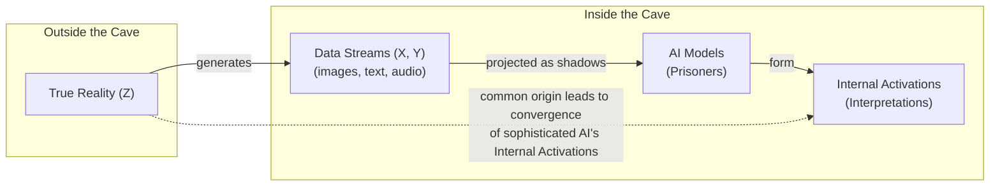
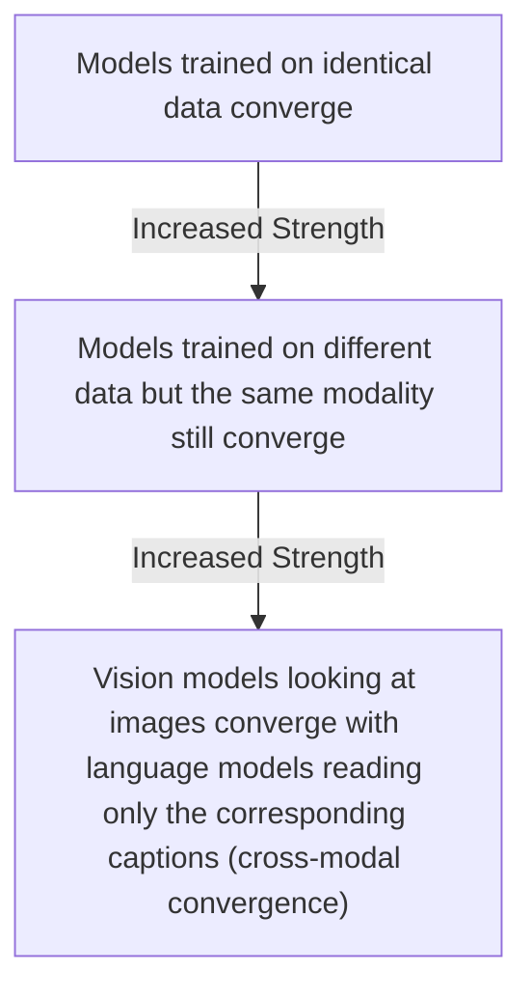
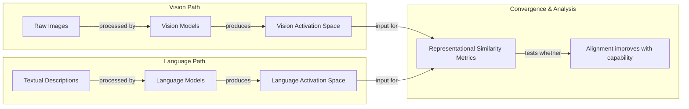

# The Platonic Representation Hypothesis

Read a story about dogs, and you may remember it the next time you see one bounding through a park. This is only possible because you have a unified concept of "dog" that is not tied to words or images alone. AI systems, however, often learn from data of a single type, like text for language models or images for computer vision systems. This raises a fundamental question: to what extent do language and vision models have a shared understanding of the same object?

Researchers investigate such questions by peering inside AI systems and studying how they represent scenes and sentences. They have found that different AI models can develop similar internal representations, even if they are trained on different datasets or entirely different data types [[1]](https://arxiv.org/html/2507.01201v5). Furthermore, these representations grow more similar as the models become more capable [[2]](https://aiscientist.substack.com/p/musing-38-the-platonic-representation). These findings form the basis of the Platonic Representation Hypothesis (PRH), an idea that has inspired a lively debate among researchers [[3]](https://phillipi.github.io/prh), [[4]](https://www.quantamagazine.org/distinct-ai-models-seem-to-converge-on-how-they-encode-reality-20260107).

The hypothesis gets its name from Plato's 2,400-year-old Allegory of the Cave [[5]](https://www.mdpi.com/2079-9292/13/8/1457). In it, prisoners trapped in a cave perceive the world only through shadows cast on a wall. For AI, the real world outside the cave is the true underlying reality. The data streams we feed our models—images, text, audio—are the shadows projected on the cave wall [[3]](https://phillipi.github.io/prh), [[6]](https://sergeylevine.substack.com/p/language-models-in-platos-cave). The AI models are the prisoners, and their internal activations are their emerging interpretations. The PRH predicts that as models become more sophisticated, their interpretations of the same shadows start to resemble one another. Why? Because the shadows originate from the same real-world objects [[3]](https://phillipi.github.io/prh).

Image 1: A conceptual diagram illustrating Plato's Cave allegory adapted for AI.

This idea builds on a long history of philosophical and scientific thought. It echoes philosopher Hilary Putnam’s concept of “convergent realism,” which argues that scientific theories, through observation and refinement, progressively converge on a true description of reality [[3]](https://phillipi.github.io/prh). The PRH suggests that deep neural networks operate similarly. The hypothesis posits a universal, idealized representation that underlies different data modalities, a concept with roots not only in philosophy but also in mathematics and cognitive science [[14]](https://www.emergentmind.com/topics/platonic-representation-hypothesis).

This idea is not without its critics. Key points of contention involve how to define a "representation" and how to compare them across vastly different models. It is unlikely that researchers will reach a consensus anytime soon. As Phillip Isola, a senior author of the PRH paper, noted: "Half the community says this is obvious, and the other half says this is obviously wrong. We were happy with that response" [[4]](https://www.quantamagazine.org/distinct-ai-models-seem-to-converge-on-how-they-encode-reality-20260107).

Having framed the hypothesis and its philosophical roots, we will now explore the geometric mechanism that makes such comparisons possible.

## The Company Being Kept

If researchers do not agree on Plato, they might find common ground with his predecessor Pythagoras, whose philosophy started from the premise "All is number." This is an apt description of neural networks. Their representations of words or pictures are just long lists of numbers, or high-dimensional vectors, indicating the activation of each artificial neuron [[4]](https://www.quantamagazine.org/distinct-ai-models-seem-to-converge-on-how-they-encode-reality-20260107). These vectors are impossible to visualize directly, but they provide a geometric basis for comparison.

It does not make sense to directly compare activation vectors from separate networks, as their coordinate systems are arbitrary. However, we can compare the relational geometry. If the vectors for "dog" and "cat" are close in one model, are they also close in another? If the distance between "dog" and "furniture" is large in both, we have evidence of alignment.

This idea echoes the linguistic principle articulated by John Rupert Firth over 60 years ago: "You shall know a word by the company it keeps" [[4]](https://www.quantamagazine.org/distinct-ai-models-seem-to-converge-on-how-they-encode-reality-20260107). The meaning of a concept inside a model is defined by its relationships to all other concepts. We can compare models by asking whether a concept like "dog" sits in the same relational neighborhood in both spaces. This extends beyond simple proximity to higher-order relationships. For example, researchers can check if the geometric relationship between a pair of objects in a 3D scan corresponds to the linguistic relationship (e.g., “left of”) expressed in a textual description [[15]](https://openaccess.thecvf.com/content/CVPR2026/papers/Tao_Geometry-Aware_Cross-Modal_Graph_Alignment_for_Referring_Segmentation_in_3D_Gaussian_CVPR_2026_paper.pdf). This concept of reuse also appears in biology, where the same genetic information is reused to form symmetric structures [[6]](https://arxiv.org/html/2505.11581v1).

Instead of trying to rotate one model's embedding space into another, researchers have devised indirect ways to assess this relational structure. The technique involves measuring the "similarity of similarities." As AI researcher Ilia Sucholutsky puts it, "It can kind of be described as measuring the similarity of similarities" [[7]](https://www.quantamagazine.org/distinct-ai-models-seem-to-converge-on-how-they-encode-reality-20260107). This is done by comparing the kernels of two representations, where a kernel captures the distance structure between all data points [[1]](https://arxiv.org/html/2507.01201v5).

This process is often framed as a task of **visual grounding**, where linguistic representations are connected to perceptual experiences. A common technique to achieve this is multimodal contrastive learning, which trains models to maximize the agreement between paired image-text data while minimizing it for unrelated pairs, effectively pulling corresponding concepts together in the shared embedding space [[16]](https://arxiv.org/html/2411.05036v1).

This leads to a fascinating observation known as the "Anna Karenina scenario," a nod to the opening line of Tolstoy's novel [[8]](https://www.quantamagazine.org/distinct-ai-models-seem-to-converge-on-how-they-encode-reality-20260107), [[9]](https://aiscientist.substack.com/p/musing-38-the-platonic-representation). The idea is that all successful, high-performing models are alike in their representational geometry, while every unsuccessful model is unsuccessful in its own way [[10]](https://www.quantamagazine.org/distinct-ai-models-seem-to-converge-on-how-they-encode-reality-20260107). This pattern suggests there is a single, optimal structure for models to discover.

Much of the early work on representational similarity focused only on computer vision, which was the most popular branch of AI research at the time [[8]](https://www.quantamagazine.org/distinct-ai-models-seem-to-converge-on-how-they-encode-reality-20260107). The arrival of powerful language models created an opportunity to see just how far representational similarity could go.

With these measurement tools in hand, we can now look at the hierarchy of experimental evidence showing that convergence strengthens as models scale.

## Convergent Evolution

The story of the Platonic representation hypothesis paper began in early 2023. ChatGPT had been released a few months before, and it was clear that simply scaling up AI models made them better at many tasks. But it was unclear why. This period sparked an existential question in the AI community: when performance improves with scale, are models just memorizing dataset quirks, or are they getting better at approximating a true underlying world model? This question of what emerges from scale runs parallel to recent research into multimodal scaling laws, which seeks to formalize the relationship between total compute, dataset size, and model performance, extending principles first discovered in language-only models [[17]](https://arxiv.org/html/2409.06754v4).

"Everyone in AI research was going through an existential life crisis," said Minyoung Huh, who was a graduate student at the time [[8]](https://www.quantamagazine.org/distinct-ai-models-seem-to-converge-on-how-they-encode-reality-20260107). He began meeting with his colleagues Phillip Isola, Brian Cheung, and Tongzhou Wang to discuss how scaling might affect internal representations [[8]](https://www.quantamagazine.org/distinct-ai-models-seem-to-converge-on-how-they-encode-reality-20260107).

They considered a hierarchy of evidence that would support the convergence hypothesis, with each level providing stronger proof.

Image 2: A hierarchical diagram illustrating the "hierarchy of potential convergence evidence" in increasing order of strength.

A year after their initial conversations, Isola and his colleagues wrote a paper reviewing the evidence for convergent representations and arguing for the PRH [[8]](https://www.quantamagazine.org/distinct-ai-models-seem-to-converge-on-how-they-encode-reality-20260107). By then, other researchers had already found evidence of alignment between vision and language models. Huh conducted his own experiment to test cross-modal convergence using a dataset of captioned pictures from Wikipedia.

Image 3: Flowchart depicting the core experimental design by Huh to test cross-modal convergence.

He fed the pictures into vision models and the captions into language models, then compared the resulting activation spaces. He observed a steady increase in representational similarity as the models became more powerful, exactly what the Platonic representation hypothesis predicted [[8]](https://www.quantamagazine.org/distinct-ai-models-seem-to-converge-on-how-they-encode-reality-20260107).

This evidence is compelling, but the story is not so simple. The validity of these results depends on a host of experimental choices.

## Find the Universals

Measurements of representational similarity involve a host of experimental choices that can affect the outcome. Which layers do you look at in each network? Which of the many available similarity metrics do you use? And which data do you measure in the first place?

Christopher Wolfram, a researcher who has studied representational similarity, critiques the generalizability of these findings. "If you only test one dataset, you don’t necessarily know how [the result] generalizes," he said. "Who knows what would happen if you did some weirder dataset?" [[8]](https://www.quantamagazine.org/distinct-ai-models-seem-to-converge-on-how-they-encode-reality-20260107). Other potential failure modes include scalability issues, challenges in aligning concepts with many-to-many relationships across modalities, and the presence of modality-specific information that has no counterpart [[18]](https://akoepke.github.io/cave_umwelten). The central problem is choosing what properties of a representation are arbitrary and which are fundamental [[11]](https://arxiv.org/html/2504.08775v1).

This uncertainty has led to two complementary attitudes in the research community. One, associated with Phillip Isola, is to actively seek the universals that models appear to share. "The endeavor of science is to find the universals," Isola said. "We could study the ways in which models are different or disagree, but that somehow has less explanatory power than identifying the commonalities" [[8]](https://www.quantamagazine.org/distinct-ai-models-seem-to-converge-on-how-they-encode-reality-20260107).

One explanation for the emergence of these universals is the "Contravariance Principle," which posits that as models are required to solve more tasks, the set of internal representations that can satisfy all constraints shrinks, forcing them to become more alike [[3]](https://phillipi.github.io/prh). The PRH authors take this further, suggesting a candidate for this universal structure: a representation whose kernel approximates the pointwise mutual information (PMI) between the underlying real-world concepts that generate the data [[3]](https://phillipi.github.io/prh).

The other attitude, held by researchers like Alexei Efros, argues that it is more productive to focus on where models' representations differ. Efros noted that in the Wikipedia dataset Huh used, the images and text contained very similar information by design. But most data we encounter has features that resist translation. "There is a reason why you go to an art museum instead of just reading the catalog," he said [[8]](https://www.quantamagazine.org/distinct-ai-models-seem-to-converge-on-how-they-encode-reality-20260107).

Despite the debate, any intrinsic sameness across models, even if imperfect, has practical payoffs. Researchers have already used this partial alignment to translate internal representations of sentences from one language model to another [[12]](https://arxiv.org/html/2505.12540v5). If language and vision model representations are somewhat interchangeable, it could lead to new ways to train models that learn from both data types, a possibility explored in recent work [[13]](https://arxiv.org/abs/2510.08492). For instance, shared embeddings allow autonomous robots to manipulate novel objects based on language instructions, generalizing from past experience without explicit programming for each new item [[16]](https://arxiv.org/html/2411.05036v1). These applications are foundational for building robust multimodal systems.

However, it is unlikely that any single theory will fully capture the behavior of modern AI models. The PRH offers a clean philosophical story, but as AI researcher Jeff Clune noted, the reality is far more complex. "You can’t reduce a trillion-parameter system to simple explanations," he said. "The answers are going to be complicated" [[8]](https://www.quantamagazine.org/distinct-ai-models-seem-to-converge-on-how-they-encode-reality-20260107).

## Conclusion

The Platonic Representation Hypothesis offers a compelling framework for understanding a fundamental trend in AI: as models become more powerful, their internal representations of the world appear to converge. This convergence, observed across different architectures, training objectives, and even data modalities, suggests that these systems are not just memorizing data but are developing a shared statistical model of reality.

We have explored the philosophical underpinnings of this idea, the geometric techniques used to measure it, and the experimental evidence supporting it. While the debate over its universality continues, the practical implications are already emerging. The ability to translate representations and build more efficient multimodal systems highlights the value of this shared structure. As we continue to build larger and more complex AI, understanding this convergent evolution will be key to engineering systems that are not just powerful, but also coherent and predictable.

## References

- [1] [Escaping Plato’s Cave: JAM for Aligning Independently Trained Vision and Language Models](https://arxiv.org/html/2507.01201v5)
- [2] [Musing 38: The Platonic Representation Hypothesis](https://aiscientist.substack.com/p/musing-38-the-platonic-representation)
- [3] [The Platonic Representation Hypothesis](https://phillipi.github.io/prh)
- [4] [Distinct AI Models Seem To Converge On How They Encode Reality](https://www.quantamagazine.org/distinct-ai-models-seem-to-converge-on-how-they-encode-reality-20260107)
- [5] [Plato’s Cave Allegory and Its Contemporary Interpretation in the Context of Generative AI (GenAI)](https://www.mdpi.com/2079-9292/13/8/1457)
- [6] [Questioning Representational Optimism in Deep Learning: The Fractured Entangled Representation Hypothesis](https://arxiv.org/html/2505.11581v1)
- [7] [Distinct AI Models Seem To Converge On How They Encode Reality](https://www.quantamagazine.org/distinct-ai-models-seem-to-converge-on-how-they-encode-reality-20260107)
- [8] [Distinct AI Models Seem To Converge On How They Encode Reality](https://www.quantamagazine.org/distinct-ai-models-seem-to-converge-on-how-they-encode-reality-20260107)
- [9] [Musing 38: The Platonic Representation Hypothesis](https://aiscientist.substack.com/p/musing-38-the-platonic-representation)
- [10] [Distinct AI Models Seem To Converge On How They Encode Reality](https://www.quantamagazine.org/distinct-ai-models-seem-to-converge-on-how-they-encode-reality-20260107)
- [11] [Layers at Similar Depths Generate Similar Activations Across LLM Architectures](https://arxiv.org/html/2504.08775v1)
- [12] [Harnessing the Universal Geometry of Embeddings](https://arxiv.org/html/2505.12540v5)
- [13] [Better Together: Leveraging Unpaired Multimodal Data for Stronger Unimodal Models](https://arxiv.org/abs/2510.08492)
- [14] [Platonic Representation Hypothesis](https://www.emergentmind.com/topics/platonic-representation-hypothesis)
- [15] [Geometry-Aware Cross-Modal Graph Alignment for Referring Segmentation in 3D Gaussian](https://openaccess.thecvf.com/content/CVPR2026/papers/Tao_Geometry-Aware_Cross-Modal_Graph_Alignment_for_Referring_Segmentation_in_3D_Gaussian_CVPR_2026_paper.pdf)
- [16] [From Word Vectors to Multimodal Embeddings: Techniques, Applications, and Future Directions For Large Language Models](https://arxiv.org/html/2411.05036v1)
- [17] [A Scaling Law for Multimodal Model](https://arxiv.org/html/2409.06754v4)
- [18] [What are the limitations of cross-modal generation?](https://akoepke.github.io/cave_umwelten)
</article>