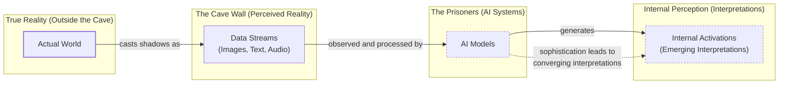

# The Platonic Representation Hypothesis: Are All AI Models Learning the Same Reality?

Read a story about dogs, and you might remember it the next time you see one in a park. This is possible because you have a unified concept of "dog" that is not tied to words or images alone. Whether it is a bulldog or a border collie, barking or getting its belly rubbed, a dog remains a dog in your mind.

AI systems are not always so fortunate. They often learn by ingesting data of a single type. This includes text for language models, images for computer vision systems, or other exotic data for specialized tasks [[1]](https://www.quantamagazine.org/distinct-ai-models-seem-to-converge-on-how-they-encode-reality-20260107). This raises a fundamental question: to what extent do language and vision models have a shared understanding of a concept like "dog"?

### The Multimodal Gap

Researchers investigate this by peering inside AI systems to study how they represent scenes and sentences. They have found that different AI models can develop similar internal representations, even if they are trained on different datasets or entirely different types of data [[3]](https://3dvar.com/Huh2024The.pdf), [[4]](https://phillipi.github.io/prh). Furthermore, these representations grow more similar as the models become more capable [[3]](https://3dvar.com/Huh2024The.pdf). This idea, dubbed the Platonic Representation Hypothesis (PRH), has inspired a lively debate and a wave of follow-up research exploring its implications and limitations [[1]](https://www.quantamagazine.org/distinct-ai-models-seem-to-converge-on-how-they-encode-reality-20260107).

The quest for a universal language of thought is not new. In the 17th century, the philosopher Gottfried Wilhelm von Leibniz envisioned a system where all concepts could be broken down into elementary atomic parts, each assigned a unique number. He believed this would allow all philosophical questions to be answered by calculation, a direct philosophical ancestor to modern AI's search for shared representations [[6]](https://web.eecs.utk.edu/~bmaclenn/papers/HistoryAIBeforeComputers.pdf).

### The Platonic Representation Hypothesis

The hypothesis gets its name from Plato's 2,400-year-old allegory of the cave [[5]](https://en.wikipedia.org/wiki/Allegory_of_the_cave), [[2]](https://www.mdpi.com/2079-9292/13/8/1457). In the allegory, prisoners trapped in a cave see the world only through shadows cast on a wall. They mistake these projections for reality. Plato argued that we are all like these prisoners, and the objects we encounter are just pale shadows of ideal "forms" that exist in a transcendent realm.

The AI adaptation of this allegory is less abstract. The true reality outside the cave is the actual world. The shadows projected on the wall are the machine-readable data streams, such as images, text, and audio. The AI models are the prisoners, and their internal activations are their emerging interpretations of these shadows. The PRH predicts that as models become more sophisticated, their interpretations of the same shadows begin to resemble one another because the shadows originate from the same objects [[7]](https://arxiv.org/html/2507.01201v5), [[4]](https://phillipi.github.io/prh).

Image 1: A Mermaid diagram illustrating Plato's Cave allegory adapted for AI, showing the flow from True Reality to AI models' internal interpretations and the hypothesis of converging interpretations.

However, not everyone is convinced. The main points of contention involve which representations to focus on and how to compare them across different models [[1]](https://www.quantamagazine.org/distinct-ai-models-seem-to-converge-on-how-they-encode-reality-20260107). A consensus is unlikely to be reached soon, but that does not bother Phillip Isola, a senior author of the paper that formalized the hypothesis. "Half the community says this is obvious, and the other half says this is obviously wrong," he said. "We were happy with that response" [[1]](https://www.quantamagazine.org/distinct-ai-models-seem-to-converge-on-how-they-encode-reality-20260107).

Having framed the PRH and its philosophical roots, we will now explore the geometric mechanism that makes such comparisons possible by examining how representations are compared through the company their vectors keep.

## The Company Being Kept

If researchers do not agree on Plato, they might find more common ground with his predecessor Pythagoras, whose philosophy started from the premise "All is number." This is an apt description of neural networks. Their representations of words or pictures are just long lists of numbers, each indicating the activation of a specific artificial neuron [[1]](https://www.quantamagazine.org/distinct-ai-models-seem-to-converge-on-how-they-encode-reality-20260107).

### All is Number: Representations as Vectors

Researchers typically write these neuron activations as a geometric object called a vector. This is an arrow pointing in a particular direction in an abstract, high-dimensional space that is impossible to visualize directly. This introduces the geometric basis for comparison: when vectors for the same concept point in similar directions, or more importantly, when the *relative distances and angles* between many concepts match, we have evidence of conceptual alignment. This holds even if the absolute coordinate systems of the models differ completely [[1]](https://www.quantamagazine.org/distinct-ai-models-seem-to-converge-on-how-they-encode-reality-20260107).

### The Company a Word Keeps

Within a single AI model, similar inputs tend to have similar representations. For instance, in a language model, the vector for "dog" will be close to vectors for "pet" and "furry" but far from "Platonic" or "molasses." This aligns with a principle from British linguist John Rupert Firth: "You shall know a word by the company it keeps" [[1]](https://www.quantamagazine.org/distinct-ai-models-seem-to-converge-on-how-they-encode-reality-20260107), [[8]](https://arxiv.org/html/2505.11581v1). The meaning of any concept inside a model is defined by its relationships—proximity, opposition, clustering—to all other concepts. We can therefore compare models by asking whether "dog" sits in the same relational neighborhood relative to "mammal," "animal," "pet," and "furniture" in both spaces.

### Measuring the Similarity of Similarities

What about comparing representations in different models? It does not make sense to directly compare activation vectors from separate networks. Instead, researchers have devised indirect ways to assess representational similarity. One popular approach is to measure whether two models' representations of an input keep the same company [[1]](https://www.quantamagazine.org/distinct-ai-models-seem-to-converge-on-how-they-encode-reality-20260107).

Suppose you want to compare how two language models represent animals. You would feed a list of words—dog, cat, wolf, jellyfish—into both networks and record their representations. In each network, these representations form a cluster of vectors. You can then ask: how similar are the overall shapes of the two clusters? "It can kind of be described as measuring the similarity of similarities," said Ilia Sucholutsky, an AI researcher at New York University [[1]](https://www.quantamagazine.org/distinct-ai-models-seem-to-converge-on-how-they-encode-reality-20260107).

This geometric approach is formalized in theories like the contrast model, which proposes that the similarity between two concepts is a function of their common and distinctive features. This provides a mathematical basis for understanding why some relationships are preserved across models while others diverge, and why similarity isn't always symmetrical—for instance, a "pigeon" is seen as more similar to a "sparrow" than a "sparrow" is to a "pigeon" [[9]](https://cogsci.ucsd.edu/~coulson/203/tvgati.pdf).

You would expect some similarity. The "cat" vector would likely be close to the "dog" vector in both networks, while the "jellyfish" vector would point in a different direction. However, the clusters probably will not look exactly the same. Is "dog" more like "cat" than "wolf," or vice versa? Models trained on different datasets or with different architectures might not agree [[1]](https://www.quantamagazine.org/distinct-ai-models-seem-to-converge-on-how-they-encode-reality-20260107).

### The Anna Karenina Scenario

A few studies found that more powerful models seemed to have more similarities in their representations. A 2021 paper dubbed this the "Anna Karenina scenario," a nod to the opening line of the novel: perhaps all successful AI models are alike, and every unsuccessful model is unsuccessful in its own way [[10]](https://aiscientist.substack.com/p/musing-38-the-platonic-representation), [[1]](https://www.quantamagazine.org/distinct-ai-models-seem-to-converge-on-how-they-encode-reality-20260107). This suggests that all well-performing models may ultimately resemble each other [[7]](https://arxiv.org/html/2507.01201v5).

Much of the early work on representational similarity focused only on computer vision, which was then the most popular branch of AI research. The rise of powerful language models presented an opportunity for Phillip Isola to see just how far representational similarity could go [[1]](https://www.quantamagazine.org/distinct-ai-models-seem-to-converge-on-how-they-encode-reality-20260107).

With these measurement tools in hand, we can now look at the hierarchy of experimental evidence showing that convergence strengthens as models scale.

## Convergent Evolution

The story of the PRH paper began in early 2023. After ChatGPT’s release, it was clear that scaling models improved performance at many tasks, but it was unclear why [[1]](https://www.quantamagazine.org/distinct-ai-models-seem-to-converge-on-how-they-encode-reality-20260107).

### An Existential Crisis in AI

"Everyone in AI research was going through an existential life crisis," said Minyoung Huh, an OpenAI researcher who was a graduate student in Isola’s lab at the time. He began meeting with Isola and their colleagues Brian Cheung and Tongzhou Wang to discuss how scaling might affect internal representations [[1]](https://www.quantamagazine.org/distinct-ai-models-seem-to-converge-on-how-they-encode-reality-20260107), [[4]](https://phillipi.github.io/prh).

### A Hierarchy of Evidence

They considered a hierarchy of evidence for convergence. If multiple models trained on the same data learn more similar representations as they get stronger, it is not necessarily because they are creating a more accurate likeness of the world; they could just be better at grasping quirks of the training dataset. However, if models trained on different datasets also converge, that would be more compelling evidence that they are grasping shared features of the world behind the data. Convergence between models that learned from entirely different data types, like language and vision models, would provide the strongest evidence [[1]](https://www.quantamagazine.org/distinct-ai-models-seem-to-converge-on-how-they-encode-reality-20260107).

### The Cross-Modal Experiment

A year after their initial conversations, Isola and his colleagues wrote a paper reviewing the evidence for convergent representations and presenting their argument for the PRH [[1]](https://www.quantamagazine.org/distinct-ai-models-seem-to-converge-on-how-they-encode-reality-20260107). By then, other researchers had found evidence of alignment between vision and language model representations [[1]](https://www.quantamagazine.org/distinct-ai-models-seem-to-converge-on-how-they-encode-reality-20260107). Huh conducted his own experiment, testing five vision models and 11 language models of varying sizes on a dataset of captioned pictures from Wikipedia. He fed the pictures into the vision models and the captions into the language models, then compared the vector clusters. He observed a steady increase in representational similarity as models became more powerful, just as the PRH predicted [[1]](https://www.quantamagazine.org/distinct-ai-models-seem-to-converge-on-how-they-encode-reality-20260107).

After reviewing the evidence for convergence, we must examine a host of experimental choices regarding the measurements of representational similarity that may affect the validity and generalizability of the result.

## Find the Universals

Of course, it is never so simple. Measurements of representational similarity involve a host of experimental choices that can affect the outcome.

### Experimental Degrees of Freedom

Which layers do you look at in each network? Which of the many available metrics, such as Centered Kernel Alignment (CKA) or Representational Similarity Analysis (RSA), do you use to compare the vector clusters? And which representations do you measure in the first place [[1]](https://www.quantamagazine.org/distinct-ai-models-seem-to-converge-on-how-they-encode-reality-20260107)? The central challenge is choosing which properties of representations are arbitrary (like the sign or order of dimensions) and which are fundamental (like nearest-neighbor relationships) [[12]](https://arxiv.org/html/2504.08775v1).

"If you only test one dataset, you don’t necessarily know how [the result] generalizes," said Christopher Wolfram, a researcher at the University of Chicago. "Who knows what would happen if you did some weirder dataset?" [[11]](https://openreview.net/forum?id=8wKec6faAT), [[12]](https://arxiv.org/html/2504.08775v1), [[13]](https://www.preprints.org/manuscript/202601.1018), [[1]](https://www.quantamagazine.org/distinct-ai-models-seem-to-converge-on-how-they-encode-reality-20260107).

### Two Scientific Attitudes

This leads to two complementary scientific attitudes. One, associated with Isola, actively seeks the universals that models appear to share. "The endeavor of science is to find the universals," Isola said. "We could study the ways in which models are different or disagree, but that somehow has less explanatory power than identifying the commonalities" [[1]](https://www.quantamagazine.org/distinct-ai-models-seem-to-converge-on-how-they-encode-reality-20260107).

The other attitude, associated with Alexei Efros at the University of California, Berkeley, argues that it is more productive to focus on where models' representations differ. "They’re all good friends and they’re all very, very smart people," Efros said. "I think they’re wrong, but that’s what science is about" [[1]](https://www.quantamagazine.org/distinct-ai-models-seem-to-converge-on-how-they-encode-reality-20260107). He noted that in the Wikipedia dataset Huh used, the images and text contained very similar information by design. However, most data we encounter has features that resist translation. "There is a reason why you go to an art museum instead of just reading the catalog," he said [[1]](https://www.quantamagazine.org/distinct-ai-models-seem-to-converge-on-how-they-encode-reality-20260107).

### Practical Payoffs of Partial Alignment

Even with only partial alignment, there are immediate practical payoffs. Researchers have developed methods to translate internal representations of sentences from one language model to another [[1]](https://www.quantamagazine.org/distinct-ai-models-seem-to-converge-on-how-they-encode-reality-20260107). If language and vision model representations are somewhat interchangeable, it could lead to new ways to train models that learn from both data types [[14]](https://arxiv.org/html/2511.12121v4), [[15]](https://ojs.aaai.org/index.php/AAAI/article/view/39248/43209), [[16]](https://www.emergentmind.com/topics/multimodal-alignment), [[17]](https://arxiv.org/html/2411.17040v1), [[18]](https://www.itm-conferences.org/articles/itmconf/pdf/2025/09/itmconf_cseit2025_04036.pdf). This enables more efficient joint multi-modal training and allows for the construction of agentic systems that can route information across modalities without losing semantic fidelity. Isola and others have explored this in a recent paper [[1]](https://www.quantamagazine.org/distinct-ai-models-seem-to-converge-on-how-they-encode-reality-20260107).

### The Limits of Elegance

Despite these promising developments, some researchers think it is unlikely that a single theory will fully capture the behavior of modern AI models. "You can’t reduce a trillion-parameter system to simple explanations," said Jeff Clune, an AI researcher at the University of British Columbia. "The answers are going to be complicated" [[1]](https://www.quantamagazine.org/distinct-ai-models-seem-to-converge-on-how-they-encode-reality-20260107), [[19]](https://tpc.dev/wp-content/uploads/2025/02/TPC-Introduction-and-Structure.pdf), [[20]](https://www.forbes.com/sites/amirhusain/2025/11/25/trillion-parameter-models-tiny-software-kernels-and-the-future-of-ai). While the PRH offers a clean philosophical story, real models contain so many interacting parts that full convergence may coexist with vast regions of model-specific idiosyncrasy.

## Conclusion

The Platonic Representation Hypothesis suggests that as AI models grow more capable, they are not just becoming better performers but are also converging on a shared internal model of reality. This convergence, observed across different architectures, training objectives, and even data modalities, points toward a universal structure that these systems are independently discovering. While the debate continues and measurement challenges remain, the evidence suggests a powerful trend toward alignment.

For AI engineers, this is more than a philosophical curiosity. Understanding this convergence is key to building more robust and integrated multimodal systems. It opens the door to translating representations between specialized models, enabling them to share a common "world model" for more reliable reasoning. As we continue to build larger and more complex AI, the pursuit of these universal representations will be a critical part of creating systems that truly understand our world.

## References

- [1] [Distinct AI Models Seem To Converge On How They Encode Reality](https://www.quantamagazine.org/distinct-ai-models-seem-to-converge-on-how-they-encode-reality-20260107)
- [2] [Cultural Biases in Generative AI: A Comprehensive Review from the Lens of Plato’s Cave Allegory](https://www.mdpi.com/2079-9292/13/8/1457)
- [3] [The Platonic Representation Hypothesis](https://3dvar.com/Huh2024The.pdf)
- [4] [The Platonic Representation Hypothesis](https://phillipi.github.io/prh)
- [5] [Allegory of the cave - Wikipedia](https://en.wikipedia.org/wiki/Allegory_of_the_cave)
- [6] [A History of AI Before Computers](https://web.eecs.utk.edu/~bmaclenn/papers/HistoryAIBeforeComputers.pdf)
- [7] [Escaping Plato’s Cave: JAM for Aligning Independently Trained Vision and Language Models](https://arxiv.org/html/2507.01201v5)
- [8] [Fractured and Entangled Representations in Deep Neural Networks](https://arxiv.org/html/2505.11581v1)
- [9] [Features and Similarity](https://cogsci.ucsd.edu/~coulson/203/tvgati.pdf)
- [10] [Musing #38: The Platonic Representation Hypothesis](https://aiscientist.substack.com/p/musing-38-the-platonic-representation)
- [11] [Anonymous submission to ICLR 2025](https://openreview.net/forum?id=8wKec6faAT)
- [12] [Layers at Similar Depths Generate Similar Activations Across LLM Architectures](https://arxiv.org/html/2504.08775v1)
- [13] [The Platonic Representation Hypothesis](https://www.preprints.org/manuscript/202601.1018)
- [14] [To Align or Not to Align: Strategic Multimodal Representation Alignment for Optimal Performance](https://arxiv.org/html/2511.12121v4)
- [15] [To Align or Not to Align: Strategic Multimodal Representation Alignment for Optimal Performance](https://ojs.aaai.org/index.php/AAAI/article/view/39248/43209)
- [16] [Multimodal Alignment - Emergent Mind](https://www.emergentmind.com/topics/multimodal-alignment)
- [17] [A Survey on Multimodal Large Language Models: Architectures, Tasks, and Challenges](https://arxiv.org/html/2411.17040v1)
- [18] [Multimodal AI: Alignment and Fusion Technology Progress and Future Trends](https://www.itm-conferences.org/articles/itmconf/pdf/2025/09/itmconf_cseit2025_04036.pdf)
- [19] [TPC Introduction and Structure](https://tpc.dev/wp-content/uploads/2025/02/TPC-Introduction-and-Structure.pdf)
- [20] [Trillion Parameter Models, Tiny Software Kernels, And The Future Of AI](https://www.forbes.com/sites/amirhusain/2025/11/25/trillion-parameter-models-tiny-software-kernels-and-the-future-of-ai)
- [21] [The Platonic Representation Hypothesis](https://arxiv.org/html/2405.07987v1)
- [22] [Cross-Modal Fusion Transformer with Symmetrical Integration and Channel–Spatial Attention for Infrared and Visible Image Fusion](https://www.mdpi.com/2076-3417/15/22/12185)