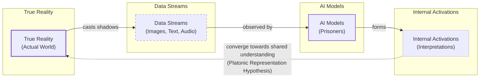
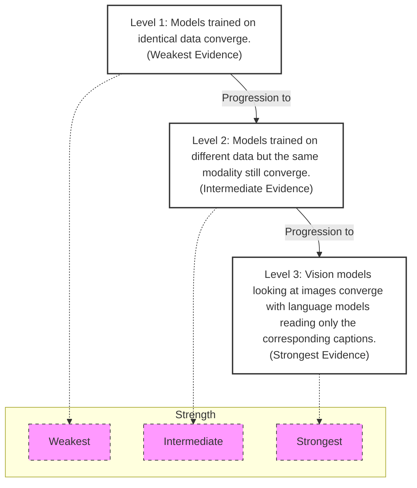

# The Platonic Representation Hypothesis

If you read a story about a dog, you might remember it the next time you see one in a park. This is possible because you have a unified concept of "dog" that is not tied to words or images alone. We humans navigate a multimodal world, seamlessly connecting what we see, hear, and read into a coherent understanding. This ability to form abstract, modality-independent concepts is a cornerstone of our intelligence.

AI systems, however, are not always so lucky. They often learn from data of a single type. A language model trains on text, a computer vision system trains on images, and a speech model trains on audio. This specialization has been effective, but it raises a fundamental question: to what extent do these specialized models, trained in their separate digital worlds, develop a shared understanding of a concept like "dog"? Can a vision model's internal idea of a dog align with a language model's?

Researchers investigate this by peering inside AI systems to study how they represent scenes and sentences. Their findings are pointing toward a compelling conclusion. First, models with different architectures, trained on different datasets or even entirely different data types, can develop remarkably similar internal representations. Second, these representations become more similar as the models grow more capable. This idea, dubbed the Platonic representation hypothesis, has inspired a lively debate and a wave of follow-up research [[1]](https://phillipi.github.io/prh), [[2]](https://arxiv.org/html/2504.08775v1), [[3]](https://www.quantamagazine.org/distinct-ai-models-seem-to-converge-on-how-they-encode-reality-20260107), [[4]](https://arxiv.org/html/2507.01201v5), [[5]](https://arxiv.org/html/2511.12121v4), [[6]](https://www.emergentmind.com/topics/multimodal-alignment).

The hypothesis gets its name from Plato's 2,400-year-old Allegory of the Cave. In the allegory, prisoners trapped in a cave perceive the world only through shadows cast on a wall, mistaking these projections for reality [[7]](https://www.alignmentforum.org/posts/kFCu3batN8k8mwtmh/the-cave-allegory-revisited-understanding-gpt-s-worldview). They believe the flickering shapes are the true objects, unaware of the richer reality that exists just outside their limited perception.

The Platonic representation hypothesis adapts this for AI. The real world outside the cave casts machine-readable shadows as data streams—images, text, and audio. AI models are the prisoners, exposed only to these streams. The hypothesis claims that as different models become more sophisticated, their internal interpretations of these shadows—their representations—begin to converge on a shared understanding of the world behind the data [[1]](https://phillipi.github.io/prh), [[7]](https://www.alignmentforum.org/posts/kFCu3batN8k8mwtmh/the-cave-allegory-revisited-understanding-gpt-s-worldview).

Image 1: An adaptation of Plato's Cave Allegory for AI, illustrating how models might converge on a shared representation of reality from data.

Not everyone is convinced. A key point of contention is how to define and compare these representations. You cannot inspect a model’s representation for every possible sentence or image, so how do you decide which ones are representative? It is unlikely researchers will reach a consensus soon, but that does not bother Phillip Isola, a senior author of the paper that formalized the hypothesis. "Half the community says this is obvious, and the other half says this is obviously wrong," he said. "We were happy with that response" [[3]](https://www.quantamagazine.org/distinct-ai-models-seem-to-converge-on-how-they-encode-reality-20260107).

This philosophical framing is grounded in a precise geometric mechanism that makes such comparisons possible. The next step is to examine how representations are compared through the company their vectors keep.

## The Company Being Kept

If researchers do not agree on Plato, they might find common ground with his predecessor Pythagoras, whose philosophy started from the premise "All is number." This perfectly describes the neural networks that power AI models. Their representations of words or pictures are just long lists of numbers, each indicating the activation of an artificial neuron [[3]](https://www.quantamagazine.org/distinct-ai-models-seem-to-converge-on-how-they-encode-reality-20260107).

Researchers typically focus on a single layer of a network, writing down the neuron activations as a geometric object called a vector. Modern AI models have thousands of neurons per layer, so their representations are high-dimensional vectors impossible to visualize directly. However, vectors make it easy to compare representations. While the absolute coordinate systems differ between models, evidence of conceptual alignment emerges when the relative distances and angles between many concepts match. Two representations are considered similar if their corresponding vectors point in similar directions within their respective spaces [[3]](https://www.quantamagazine.org/distinct-ai-models-seem-to-converge-on-how-they-encode-reality-20260107).

Within a single model, similar inputs tend to have similar representations. The vector for "dog" will be close to vectors for "pet" and "furry," but far from "molasses." This reflects a principle expressed over 60 years ago by linguist John Rupert Firth: "You shall know a word by the company it keeps" [[3]](https://www.quantamagazine.org/distinct-ai-models-seem-to-converge-on-how-they-encode-reality-20260107). The meaning of a concept is defined not in isolation, but by its relationships—proximity, opposition, clustering—to all other concepts in the space.

But what about representations in different models? Directly comparing activation vectors from separate networks is not meaningful because their coordinate systems are arbitrary. A simple permutation of neuron order would change the vector completely without altering the underlying information. Instead, researchers use indirect methods. One popular approach embraces Firth's quote and measures whether two models' representations of an input keep the same company [[3]](https://www.quantamagazine.org/distinct-ai-models-seem-to-converge-on-how-they-encode-reality-20260107).

Suppose you want to compare how two language models represent animals. You feed a list of words—dog, cat, wolf, jellyfish—into both and record their representations. In each network, these representations form a cluster of vectors. The question then becomes: how similar are the overall shapes of the two clusters? This technique avoids direct vector comparison by focusing on relational geometry. "It can kind of be described as measuring the similarity of similarities," said Ilia Sucholutsky, an AI researcher at New York University [[3]](https://www.quantamagazine.org/distinct-ai-models-seem-to-converge-on-how-they-encode-reality-20260107).

Researchers began exploring this in the mid-2010s and found that representations were often similar, though not identical. Notably, a few studies found that more powerful models had more similarities than weaker ones. One 2021 paper dubbed this the "Anna Karenina scenario," a nod to the opening line of Tolstoy's novel. Perhaps successful AI models are all alike, while every unsuccessful model is unsuccessful in its own way [[8]](https://aiscientist.substack.com/p/musing-38-the-platonic-representation), [[9]](https://arxiv.org/html/2106.07682v3). This pattern suggests that as models improve, they are not just getting better at their tasks but are also converging toward a common representational geometry.

Much of this early work focused only on computer vision, which was then the most popular branch of AI research. This focus had inherent limitations, as the methods developed for comparing Convolutional Neural Network (CNN) architectures on image datasets did not seamlessly transfer to the complexities of language. The rise of powerful language models, and later, large-scale paired vision-language datasets, created an opportunity to see just how far representational similarity could go [[3]](https://www.quantamagazine.org/distinct-ai-models-seem-to-converge-on-how-they-encode-reality-20260107). With these measurement tools in hand, it is now possible to look at the hierarchy of experimental evidence showing that convergence strengthens as models scale.

## Convergent Evolution

The story of the Platonic representation hypothesis paper began in early 2023. ChatGPT had been released a few months prior, and it was clear that simply scaling up AI models made them better at many tasks. But it was unclear why. This created an existential question for the field: when performance improves with scale, are models just memorizing dataset quirks, or are they getting better at approximating a true world model?

"Everyone in AI research was going through an existential life crisis," said Minyoung Huh, an OpenAI researcher who was a graduate student in Isola’s lab at the time. He began meeting with Isola and their colleagues to discuss how scaling might affect internal representations [[3]](https://www.quantamagazine.org/distinct-ai-models-seem-to-converge-on-how-they-encode-reality-20260107).

Their discussions led to a hierarchy of potential evidence for the hypothesis, ordered by increasing strength. The weakest evidence is when models trained on identical data converge. Stronger evidence comes from models trained on different datasets within the same modality. The most compelling evidence would be convergence between models trained on entirely different data types, like vision and language models [[3]](https://www.quantamagazine.org/distinct-ai-models-seem-to-converge-on-how-they-encode-reality-20260107).

Image 2: Hierarchy of potential convergence evidence for the Platonic representation hypothesis, ordered by increasing strength.

A year after their initial conversations, Isola and his colleagues wrote a paper reviewing the evidence and arguing for the hypothesis [[3]](https://www.quantamagazine.org/distinct-ai-models-seem-to-converge-on-how-they-encode-reality-20260107). By then, other researchers had already found evidence of alignment between vision and language models [[1]](https://phillipi.github.io/prh). Huh conducted his own experiment, testing five vision models and eleven language models on a dataset of captioned pictures from Wikipedia. He fed the pictures to the vision models and the captions to the language models, then compared the vector clusters. He observed a steady increase in representational similarity as models became more powerful, exactly as the hypothesis predicted [[3]](https://www.quantamagazine.org/distinct-ai-models-seem-to-converge-on-how-they-encode-reality-20260107).

After reviewing this evidence, it is also necessary to examine the experimental choices that can affect the validity of these results.

## Find the Universals

The process of measuring representational similarity is not straightforward. It involves numerous experimental choices that can influence the outcome. Researchers must decide which layers to compare, which of the many similarity metrics to use (like Centered Kernel Alignment or Representational Similarity Analysis), and which dataset to probe. These decisions complicate any strong claims of convergence [[3]](https://www.quantamagazine.org/distinct-ai-models-seem-to-converge-on-how-they-encode-reality-20260107).

"If you only test one dataset, you don’t necessarily know how [the result] generalizes," said Christopher Wolfram, a researcher who has studied representational similarity. "Who knows what would happen if you did some weirder dataset?" [[3]](https://www.quantamagazine.org/distinct-ai-models-seem-to-converge-on-how-they-encode-reality-20260107). His critique highlights the challenge of distinguishing fundamental properties from arbitrary ones that might reflect structural constraints rather than meaningful convergence. For example, trivial differences like permuted axes or flipped signs in activation vectors can make representations appear different when they are functionally equivalent [[2]](https://arxiv.org/html/2504.08775v1).

This uncertainty has led to two complementary scientific attitudes. One, associated with Isola, actively seeks the universals that models appear to share. "The endeavor of science is to find the universals," he said. "We could study the ways in which models are different or disagree, but that somehow has less explanatory power than identifying the commonalities" [[3]](https://www.quantamagazine.org/distinct-ai-models-seem-to-converge-on-how-they-encode-reality-20260107).

The other attitude, held by researchers like Alexei Efros, argues it is more productive to focus on where models differ. Efros noted that in the dataset Huh used, the images and text contained very similar information by design. But much of the data we encounter has features that resist translation. "There is a reason why you go to an art museum instead of just reading the catalog," he said [[3]](https://www.quantamagazine.org/distinct-ai-models-seem-to-converge-on-how-they-encode-reality-20260107).

Even if imperfect, any intrinsic sameness across models can be useful. Last summer, researchers used this partial alignment to translate internal representations of sentences from one language model to another. If language and vision representations are interchangeable to some extent, it could lead to new ways to train models that learn from both data types, enabling more efficient multimodal systems [[3]](https://www.quantamagazine.org/distinct-ai-models-seem-to-converge-on-how-they-encode-reality-20260107), [[5]](https://arxiv.org/html/2511.12121v4), [[6]](https://www.emergentmind.com/topics/multimodal-alignment), [[10]](https://arxiv.org/html/2505.12540v1), [[11]](https://arxiv.org/html/2510.08492v1).

Despite these promising developments, other researchers think it is unlikely any single theory will fully capture the behavior of modern AI. "You can’t reduce a trillion-parameter system to simple explanations," said Jeff Clune, an AI researcher. "The answers are going to be complicated" [[3]](https://www.quantamagazine.org/distinct-ai-models-seem-to-converge-on-how-they-encode-reality-20260107).

## References

- [1] The Platonic Representation Hypothesis https://phillipi.github.io/prh
- [2] Layers at Similar Depths Generate Similar Activations Across LLM Architectures https://arxiv.org/html/2504.08775v1
- [3] Distinct AI Models Seem To Converge On How They Encode Reality https://www.quantamagazine.org/distinct-ai-models-seem-to-converge-on-how-they-encode-reality-20260107
- [4] Escaping Plato’s Cave: JAM for Aligning Independently Trained Vision and Language Models https://arxiv.org/html/2507.01201v5
- [5] To Align or Not to Align: Strategic Multimodal Representation Alignment for Optimal Performance https://arxiv.org/html/2511.12121v4
- [6] Multimodal Alignment https://www.emergentmind.com/topics/multimodal-alignment
- [7] The Cave Allegory Revisited: Understanding GPT's Worldview https://www.alignmentforum.org/posts/kFCu3batN8k8mwtmh/the-cave-allegory-revisited-understanding-gpt-s-worldview
- [8] Musing 38: The Platonic Representation Hypothesis https://aiscientist.substack.com/p/musing-38-the-platonic-representation
- [9] Revisiting Model Stitching to Compare Neural Representations https://arxiv.org/html/2106.07682v3
- [10] Harnessing the Universal Geometry of Embeddings https://arxiv.org/html/2505.12540v1
- [11] Better Together: Leveraging Unpaired Multimodal Data for Stronger Unimodal Models https://arxiv.org/html/2510.08492v1
</article>