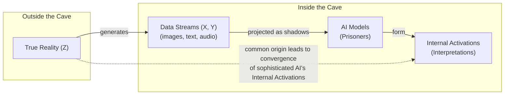
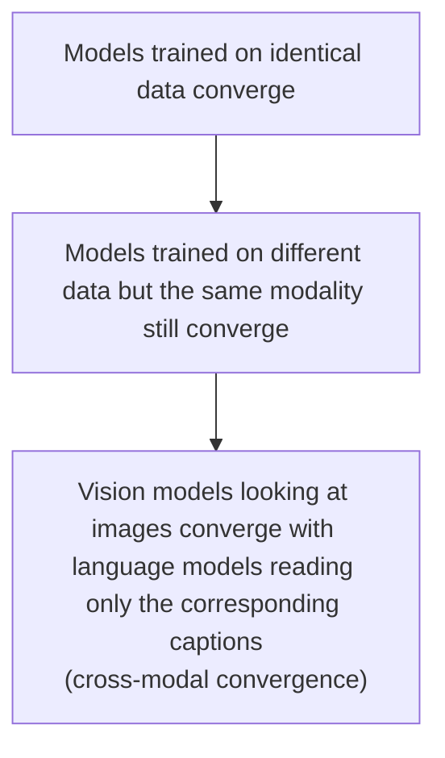
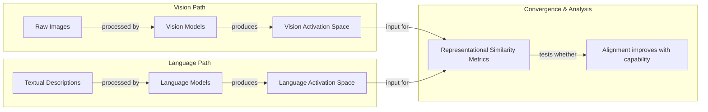

# Do AI Models Dream of Platonic Forms?

Read a story about dogs, and you may remember it the next time you see one bounding through a park. This is only possible because you have a unified concept of “dog” that is not tied to words or images alone. Bulldog or border collie, barking or getting its belly rubbed, a dog can be many things while still remaining a dog.

Artificial intelligence systems are not always so lucky. These systems often learn by ingesting data of a single type—text for language models, images for computer vision systems, or more exotic data for systems designed to predict the smell of molecules or the shape of proteins. This raises a fundamental question: to what extent do language and vision models have a shared understanding of dogs?

Researchers investigate such questions by peering inside AI systems and studying how they represent scenes and sentences. Their findings point to a remarkable trend: different AI models can develop similar internal representations, even when trained on different datasets or entirely different data types. This suggests a level of universality in how these systems learn to model data. What is more, a few studies have suggested that these representations grow more similar as the models themselves become more capable. In a paper from the Massachusetts Institute of Technology, four AI researchers argued that these hints of convergence are no fluke. Their idea, dubbed the Platonic representation hypothesis, has since inspired a lively debate and a series of follow-up studies [[1]](https://www.quantamagazine.org/distinct-ai-models-seem-to-converge-on-how-they-encode-reality-20260107), [[2]](https://arxiv.org/pdf/2405.07987), [[3]](http://arxiv.org/abs/2502.16282), [[4]](https://arxiv.org/abs/2503.05283), [[5]](https://arxiv.org/abs/2512.03750), [[6]](https://arxiv.org/abs/2511.02767), [[14]](https://arxiv.org/abs/2405.07987), [[15]](https://arxiv.org/html/2507.01201v5), [[16]](https://arxiv.org/html/2505.11581v1).

The team’s hypothesis gets its name from a 2,400-year-old allegory by the Greek philosopher Plato. In it, prisoners trapped inside a cave perceive the world only through shadows cast by outside objects. Plato maintained that we are all like those prisoners. The objects we encounter in everyday life, in his view, are pale shadows of ideal “forms” that reside in a transcendent realm beyond our senses [[17]](https://en.wikipedia.org/wiki/Allegory_of_the_cave).

The Platonic representation hypothesis is less abstract. In this version of the metaphor, the real world is outside the cave, and it casts machine-readable shadows as streams of data. AI models are the prisoners. The MIT team’s claim is that very different models, exposed only to these data streams, are beginning to converge on a shared “Platonic representation” of the world behind the data. This idea echoes a concept from the philosophy of science known as "convergent realism," which holds that as scientific theories improve, they progressively converge on a true description of reality. The hypothesis suggests that large neural networks, like scientists, are independently discovering the same underlying structure of the world through their "observations" of data. "Why do the language model and the vision model align?" asks Phillip Isola, the senior author of the paper. "Because they’re both shadows of the same world" [[1]](https://www.quantamagazine.org/distinct-ai-models-seem-to-converge-on-how-they-encode-reality-20260107), [[2]](https://arxiv.org/pdf/2405.07987), [[19]](https://phillipi.github.io/prh).

Image 1: A conceptual diagram illustrating Plato's Cave allegory adapted for AI.

Not everyone is convinced. One of the main points of contention involves which representations to focus on and how to compare them across very different models. You cannot inspect a language model’s internal representation of every conceivable sentence, or a vision model’s representation of every image. So how do you decide which ones are representative? Where do you look for the representations, and how do you compare them across vastly different model architectures? It is unlikely that researchers will reach a consensus on the Platonic representation hypothesis anytime soon, but that does not bother Isola. "Half the community says this is obvious, and the other half says this is obviously wrong," he said. "We were happy with that response" [[1]](https://www.quantamagazine.org/distinct-ai-models-seem-to-converge-on-how-they-encode-reality-20260107).

Having framed the hypothesis and its philosophical roots, we can now look at the precise geometric mechanism that makes such comparisons possible by examining how representations are compared through the company their vectors keep.

## The Company Being Kept

If AI researchers do not agree on Plato, they might find more common ground with his predecessor Pythagoras, whose philosophy supposedly started from the premise “All is number.” That is an apt description of the neural networks that power AI models. Their representations of words or pictures are just long lists of numbers, each indicating the degree of activation of a specific artificial neuron.

To simplify the math, researchers typically focus on a single layer of a neural network, which is like taking a snapshot of brain activity at a specific moment. They write down the neuron activations in this layer as a geometric object called a vector. This vector is an arrow that points in a particular direction in an abstract space. Modern AI models have many thousands of neurons in each layer, so their representations are high-dimensional vectors that are impossible to visualize directly. But vectors make it easy to compare a network’s representations: two are similar if their vectors point in similar directions [[2]](https://arxiv.org/pdf/2405.07987).

Within a single AI model, similar inputs tend to have similar representations. In a language model, the vector for “dog” will be close to vectors for “pet,” “bark,” and “furry,” and farther from “Platonic” and “molasses.” This is a modern, geometric version of an idea memorably expressed over 60 years ago by the British linguist John Rupert Firth: “You shall know a word by the company it keeps” [[7]](https://www.quantamagazine.org/how-embeddings-encode-what-words-mean-sort-of-20240918/), [[18]](https://arxiv.org/html/2505.11581v1).

What about representations in different models? It does not make sense to directly compare activation vectors from separate networks, as the coordinate systems are arbitrary. One model might learn a representation that is simply a rotated or permuted version of another's. To get around this, researchers have devised indirect ways to assess similarity. One popular approach is to embrace Firth’s quote and measure whether two models’ representations of an input keep the same company. Imagine you want to compare how two language models represent animals. You feed a list of words—dog, cat, wolf, jellyfish—into both networks and record their representations. In each network, these representations form a cluster of vectors. You can then ask: how similar are the overall shapes of the two clusters?

“It can kind of be described as measuring the similarity of similarities,” said Ilia Sucholutsky, an AI researcher at New York University. This method characterizes a representation by its kernel—how it measures similarity between inputs. Two representations are considered aligned if their kernels are the same for corresponding inputs. For example, if a text encoder is aligned with an image encoder, then the similarity between "apple" and "orange" in the text space should be approximately equal to the similarity between an image of an apple and an image of an orange in the vision space. In our animal example, you would expect some similarity. The “cat” vector would probably be close to the “dog” vector in both networks, and the “jellyfish” vector would point in a different direction. But the clusters probably will not look exactly the same. Is “dog” more like “cat” than “wolf,” or vice versa? If your models were trained on different datasets or have different architectures, they might not agree [[1]](https://www.quantamagazine.org/distinct-ai-models-seem-to-converge-on-how-they-encode-reality-20260107), [[19]](https://phillipi.github.io/prh).

Researchers began measuring representational similarity with this approach in the mid-2010s and found that different models’ representations were often similar, though not identical. A few studies found a notable pattern: more powerful models seemed to have more similarities in their representations than weaker ones. One 2021 paper dubbed this the “Anna Karenina scenario,” a nod to the opening line of the famous novel. The idea is that all successful, high-performing models converge toward the same representational geometry, while each unsuccessful or under-trained model diverges idiosyncratically in its own unproductive ways. This pattern mirrors the hypothesis that there is a single "correct" structure for models to discover, and that better models are simply better at finding it [[8]](https://arxiv.org/abs/2106.07682), [[9]](https://arxiv.org/abs/1511.07543).

But what is this shared structure that successful models supposedly find? The authors of the hypothesis offer a specific candidate: pointwise mutual information (PMI). In an idealized setting, they show that certain representation learning algorithms will converge on a geometry where the similarity between any two concepts equals the PMI between their underlying real-world causes. This suggests a simple, powerful learning rule: find an embedding in which similarity equals statistical co-occurrence [[19]](https://phillipi.github.io/prh).

Much of this early work on representational similarity, however, focused almost exclusively on computer vision, which was then the most popular branch of AI research. Studies typically compared different convolutional neural network (CNN) architectures trained on datasets like ImageNet. This focus created a blind spot. The methods were well-suited for comparing models within the same modality, but extending them to compare a vision model with a language model was not straightforward. The lack of large-scale, high-quality paired vision-language datasets made it difficult to establish a common ground for comparison. The advent of powerful language models, and later, datasets like Wikipedia-based Image Text (WIT), created a new opportunity to test just how far representational similarity could go, pushing the research into the cross-modal territory where the Platonic hypothesis is most compelling [[1]](https://www.quantamagazine.org/distinct-ai-models-seem-to-converge-on-how-they-encode-reality-20260107).

With these measurement tools in hand, we can now look at the hierarchy of experimental evidence showing that convergence strengthens as models scale.

## Convergent Evolution

The story of the Platonic representation hypothesis paper began in early 2023, a turbulent time for AI researchers. ChatGPT had been released a few months before, and it was increasingly clear that simply scaling up AI models—training larger neural networks on more data—made them better at many different tasks. But it was unclear why. This scaling phenomenon prompted a wave of research into new scaling laws for multimodal systems, extending the predictable performance gains seen in language models to vision and other domains. The central question was whether these performance gains were just a result of better memorization or if the models were genuinely developing a more accurate internal model of the world. “Everyone in AI research was going through an existential life crisis,” said Minyoung Huh, an OpenAI researcher who was a graduate student in Isola’s lab at the time. He began meeting regularly with Isola and their colleagues Brian Cheung and Tongzhou Wang to discuss how scaling might affect internal representations [[1]](https://www.quantamagazine.org/distinct-ai-models-seem-to-converge-on-how-they-encode-reality-20260107), [[20]](https://arxiv.org/html/2409.06754v4).

This discussion led to a clear framework for testing the hypothesis. If models are just memorizing quirks of their training data, then models trained on different datasets should have different representations. However, if they are getting better at grasping shared features of the world, their representations should converge. This creates a hierarchy of evidence for the Platonic hypothesis, with each level providing a stronger test. The most basic test is showing that models trained on identical data converge. A stronger test is showing that models trained on different data within the same modality still converge. The most striking evidence, however, would be to show cross-modal convergence: that a vision model looking at an image converges with a language model reading only the corresponding caption.

Image 2: A hierarchical diagram illustrating the hierarchy of potential convergence evidence in increasing order of strength.

A year after their initial conversations, Isola and his colleagues decided to write a paper reviewing the evidence and presenting their argument. By then, other researchers had already found evidence of alignment between vision and language model representations. Huh conducted his own experiment to test this cross-modal convergence. He fed pictures from Wikipedia into a set of five vision models and the corresponding captions into eleven language models of varying sizes. He then used representational similarity metrics to compare the clusters of vectors produced by the two types of models [[1]](https://www.quantamagazine.org/distinct-ai-models-seem-to-converge-on-how-they-encode-reality-20260107), [[2]](https://arxiv.org/pdf/2405.07987), [[10]](https://arxiv.org/abs/2209.15162), [[11]](https://arxiv.org/abs/2302.06555), [[12]](https://arxiv.org/abs/2401.05224).

Image 3: Flowchart depicting the core experimental design by Huh to test cross-modal convergence.

He observed a steady increase in representational similarity as models became more powerful, exactly as the Platonic representation hypothesis predicted. After reviewing this evidence, we must examine the experimental choices that affect the validity of the results.

## Find the Universals

Of course, it is never so simple. Measurements of representational similarity invariably involve a host of experimental choices that can affect the outcome. Which layers do you look at in each network? Different layers are known to capture different levels of abstraction, from low-level features to high-level semantics. Once you have a cluster of vectors from each model, which of the many similarity metrics do you use? Options like Centered Kernel Alignment (CKA), Singular Value Canonical Correlation Analysis (SVCCA), and nearest-neighbor metrics each have their own biases and sensitivities. And which representations do you measure in the first place? The choice of dataset is critical [[1]](https://www.quantamagazine.org/distinct-ai-models-seem-to-converge-on-how-they-encode-reality-20260107).

The central problem is that neural networks can generate activations that differ in trivial ways, such as permuted axes or flipped signs. The challenge is choosing which properties are arbitrary and which are fundamental. “If you only test one dataset, you don’t necessarily know how [the result] generalizes,” said Christopher Wolfram, a researcher who has studied these issues. “Who knows what would happen if you did some weirder dataset?” This critique highlights the risk of mistaking dataset-specific artifacts for genuine, generalizable convergence [[1]](https://www.quantamagazine.org/distinct-ai-models-seem-to-converge-on-how-they-encode-reality-20260107), [[13]](https://arxiv.org/abs/2504.08775).

Isola acknowledged that the issue is far from settled. To him, cases where models do exhibit convergence are more compelling than cases where they may not. “The endeavor of science is to find the universals,” Isola said. “We could study the ways in which models are different or disagree, but that somehow has less explanatory power than identifying the commonalities.” This pressure towards a shared structure is sometimes called the "Contravariance Principle": the more tasks a model must solve, the fewer representations can satisfy all constraints, forcing generalist models to converge [[1]](https://www.quantamagazine.org/distinct-ai-models-seem-to-converge-on-how-they-encode-reality-20260107), [[19]](https://phillipi.github.io/prh).

Other researchers argue that it is more productive to focus on where models’ representations differ. Among them is Alexei Efros, a researcher at the University of California, Berkeley. “I think they’re wrong, but that’s what science is about,” Efros said. He noted that in the Wikipedia dataset Huh used, the images and text contained very similar information by design. But most data we encounter has features that resist translation. “There is a reason why you go to an art museum instead of just reading the catalog,” he said. Other potential failure modes include scalability issues and modality-specific features that resist translation, like the rhythm of speech [[1]](https://www.quantamagazine.org/distinct-ai-models-seem-to-converge-on-how-they-encode-reality-20260107), [[21]](https://akoepke.github.io/cave_umwelten).

Any intrinsic sameness across models does not have to be perfect to be useful. The practical payoffs of even partial alignment are already being explored. For instance, researchers have successfully used this shared structure to translate internal representations of sentences from one language model to another, without any paired data. This suggests a "universal geometry" that can be harnessed. Furthermore, if language and vision model representations are to some extent interchangeable, it could lead to new, more efficient ways to train multimodal models. Isola and others explored this in a recent paper, showing that leveraging unpaired data from an auxiliary modality can consistently improve the representations of a target modality, all without requiring explicit pairs [[14]](http://arxiv.org/abs/2505.12540), [[15]](https://arxiv.org/abs/2510.08492).

Despite these promising developments, other researchers think it is unlikely that any single theory will fully capture the behavior of modern AI models. This view is sometimes framed by the "Fractured Entangled Representation (FER) hypothesis," which posits that models trained via standard methods like SGD often learn disorganized, redundant, and entangled internal representations, even when their external performance is perfect. This is like spaghetti code: it works, but it's a mess inside and doesn't generalize well. “You can’t reduce a trillion-parameter system to simple explanations,” said Jeff Clune, an AI researcher at the University of British Columbia. “The answers are going to be complicated” [[1]](https://www.quantamagazine.org/distinct-ai-models-seem-to-converge-on-how-they-encode-reality-20260107), [[16]](https://arxiv.org/html/2505.11581v1).

## Conclusion

The Platonic Representation Hypothesis offers a compelling framework for understanding a surprising trend in AI: as models become more capable, their internal "world models" start to look more and more alike. This convergence, observed across different architectures, training data, and even modalities like vision and language, suggests that these systems are not just memorizing patterns but are independently discovering a shared, underlying statistical structure of reality.

We have seen how researchers use geometric comparisons—the "similarity of similarities"—to measure this alignment and have reviewed evidence showing that this alignment strengthens with model scale. While the debate continues, with valid critiques about measurement and the importance of model differences, the practical implications are already emerging. The ability to translate representations and build more efficient multimodal systems hinges on this shared structure. Whether this convergence will lead to a single, universal "Platonic representation" remains an open question, but its pursuit is pushing the boundaries of how we build and understand intelligent systems.

## References

- [1] [Distinct AI Models Seem To Converge On How They Encode Reality](https://www.quantamagazine.org/distinct-ai-models-seem-to-converge-on-how-they-encode-reality-20260107)
- [2] [The Platonic Representation Hypothesis](https://arxiv.org/pdf/2405.07987)
- [3] [Follow-up research on PRH 1](http://arxiv.org/abs/2502.16282)
- [4] [Follow-up research on PRH 2](https://arxiv.org/abs/2503.05283)
- [5] [Follow-up research on PRH 3](https://arxiv.org/abs/2512.03750)
- [6] [Follow-up research on PRH 4](https://arxiv.org/abs/2511.02767)
- [7] [How Embeddings Encode What Words Mean (Sort Of)](https://www.quantamagazine.org/how-embeddings-encode-what-words-mean-sort-of-20240918/)
- [8] [Revisiting Model Stitching to Compare Neural Representations](https://arxiv.org/abs/2106.07682)
- [9] [Early work on representational similarity](https://arxiv.org/abs/1511.07543)
- [10] [Vision-language convergence study 1](https://arxiv.org/abs/2209.15162)
- [11] [Vision-language convergence study 2](https://arxiv.org/abs/2302.06555)
- [12] [Vision-language convergence study 3](https://arxiv.org/abs/2401.05224)
- [13] [Layers at Similar Depths Generate Similar Activations Across LLM Architectures](https://arxiv.org/abs/2504.08775)
- [14] [Harnessing the Universal Geometry of Embeddings](http://arxiv.org/abs/2505.12540)
- [15] [Better Together: Leveraging Unpaired Multimodal Data for Stronger Unimodal Models](https://arxiv.org/abs/2510.08492)
- [16] [Questioning Representational Optimism in Deep Learning: The Fractured Entangled Representation Hypothesis](https://arxiv.org/html/2505.11581v1)
- [17] [Allegory of the cave](https://en.wikipedia.org/wiki/Allegory_of_the_cave)
- [18] [Escaping Plato’s Cave: JAM for Aligning Independently Trained Vision and Language Models](https://arxiv.org/html/2507.01201v5)
- [19] [The Platonic Representation Hypothesis (summary page)](https://phillipi.github.io/prh)
- [20] [Scaling Law Hypothesis for Multimodal Model](https://arxiv.org/html/2409.06754v4)
- [21] [Plato's Cave and the Umwelten of AI Models](https://akoepke.github.io/cave_umwelten)
</article>