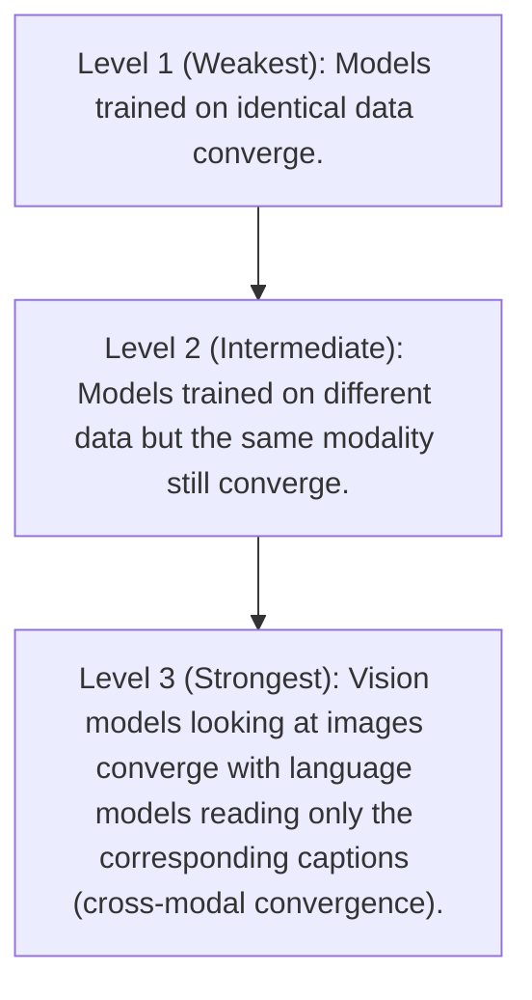

# The Platonic Representation Hypothesis: Are All AI Models Secretly the Same?

Read a story about dogs, and you may remember it the next time you see one bounding through a park. This is only possible because you have a unified concept of "dog" that is not tied to words or images alone. Bulldog or border collie, barking or getting its belly rubbed, a dog can be many things while still remaining a dog.

AI systems are not always so lucky. They often learn by ingesting data of a single type. For example, text for language models, images for computer vision systems, or more exotic data for systems designed to predict the shapes of proteins. This specialization has led to powerful unimodal systems, but it also raises a fundamental question: to what extent do language and vision models, trained in their separate digital worlds, develop a shared understanding of a concept like "dog"?

Researchers investigate such questions by peering inside AI systems and studying how they represent scenes and sentences. They have found that different AI models can develop similar representations, even if they are trained using different datasets or entirely different data types [[1]](https://arxiv.org/abs/2310.13018). Furthermore, a few studies have suggested that those representations are growing more similar as models grow more capable. In a 2024 paper, four AI researchers at the Massachusetts Institute of Technology argued that these hints of convergence are no fluke [[2]](https://phillipi.github.io/prh). Their idea, dubbed the Platonic Representation Hypothesis, has since inspired a lively debate and a series of follow-up studies [[3]](https://arxiv.org/html/2502.16282v1), [[4]](https://arxiv.org/html/2503.05283v1), [[5]](https://arxiv.org/html/2512.03750v1).

The hypothesis gets its name from Plato's 2,400-year-old allegory of the cave [[6]](https://en.wikipedia.org/wiki/Allegory_of_the_cave). In it, prisoners trapped inside a cave perceive the world only through shadows cast by outside objects. Plato maintained that we are all like those prisoners. The objects we encounter are pale shadows of ideal "forms" that reside in a transcendent realm.

The Platonic Representation Hypothesis is less abstract. In this version, the real world is outside the cave, and it casts machine-readable shadows as streams of data. The AI models are the prisoners. The claim is that very different models, exposed only to data streams, are beginning to converge on a shared "Platonic representation" of the world behind the data [[7]](https://arxiv.org/html/2507.01201v5). This idea is related to "convergent realism" in the philosophy of science, which suggests that science is converging on truth, and the "Anna Karenina scenario" in representation learning, which posits that all well-performing models may ultimately resemble each other [[2]](https://phillipi.github.io/prh).

```mermaid
flowchart LR
  %% Outside the Cave
  subgraph "Outside the Cave"
    TrueReality["True Reality<br/>(Actual World)"]
  end

  %% Inside the Cave
  subgraph "Inside the Cave"
    DataStreams["Data Streams<br/>(Images, Text, Audio)"]
    Shadows["Shadows<br/>(on Cave Wall)"]
    AIModels["AI Models<br/>(Prisoners)"]
    InternalActivations["Internal Activations<br/>(Emerging Interpretations)"]
  end

  %% Relationships
  TrueReality -- "originates" --> DataStreams
  DataStreams -- "projected as" --> Shadows
  Shadows -- "observed by" --> AIModels
  AIModels -- "generate" --> InternalActivations

  %% The diagram visually conveys that as AI models become more sophisticated, their interpretations of the same shadows (data streams) converge because the shadows originate from identical objects in the true reality.
  %% This convergence is an emergent property of the AI Models' learning process over time, based on consistent input from True Reality.

  %% Visual grouping
  classDef reality stroke-width:2px
  classDef internal stroke-dasharray:3,3
  classDef agent stroke-width:2px

  class TrueReality reality
  class DataStreams,Shadows,InternalActivations internal
  class AIModels agent
```

Image 1: A Mermaid diagram illustrating Plato's Cave Allegory adapted for AI, showing the flow from true reality to AI's internal interpretations of data streams as shadows.

Not everyone is convinced. One of the main points of contention involves which representations to focus on. You cannot inspect a language model’s internal representation of every conceivable sentence, or a vision model’s representation of every image. So how do you decide which ones are representative? Where do you look for the representations, and how do you compare them across very different models? It is unlikely that researchers will reach a consensus on the Platonic Representation Hypothesis anytime soon. That does not bother Phillip Isola, a senior author of the paper. "Half the community says this is obvious, and the other half says this is obviously wrong," he said. "We were happy with that response" [[8]](https://www.quantamagazine.org/distinct-ai-models-seem-to-converge-on-how-they-encode-reality-20260107).

Having framed the hypothesis and its philosophical roots, we will now look at the precise geometric mechanism that makes such comparisons possible by examining how representations are compared through the company their vectors keep.

## The Company Being Kept

If AI researchers do not agree on Plato, they might find more common ground with his predecessor Pythagoras, whose philosophy supposedly started from the premise "All is number." That is an apt description of the neural networks that power AI models. Their representations of words or pictures are just long lists of numbers, each indicating the degree of activation of a specific artificial neuron. These representations are high-dimensional vectors that are impossible to visualize directly.

This high dimensionality makes direct comparison tricky. However, the geometric basis for comparison remains sound. Even if the absolute coordinate systems of two models differ, we can find evidence of conceptual alignment by looking at the relative geometry. When vectors for the same concept point in similar directions, or when the relative distances and angles between many concepts match across two independently trained models, we can infer that they share a similar understanding.

Within a single AI model, similar inputs tend to have similar representations. In a language model, the vector for "dog" will be relatively close to vectors for "pet," "bark," and "furry," and farther from "Platonic" and "molasses." This is a geometric version of an idea expressed more than 60 years ago by the British linguist John Rupert Firth: "You shall know a word by the company it keeps" [[8]](https://www.quantamagazine.org/distinct-ai-models-seem-to-converge-on-how-they-encode-reality-20260107).

But what about representations in different models? It does not make sense to directly compare activation vectors from separate networks. Instead, researchers have devised indirect ways to assess representational similarity. One popular approach is to embrace Firth's quote and measure whether two models’ representations of an input keep the same company. Suppose you want to compare how two language models represent words for animals. First, you compile a list of words: dog, cat, wolf, jellyfish, and so on. You then feed these words into both networks and record their representations. In each network, the representations will form a cluster of vectors. You can then ask: How similar are the overall shapes of the two clusters?

This technique measures the similarity of similarities. As Ilia Sucholutsky, an AI researcher at New York University, said, "It can kind of be described as measuring the similarity of similarities" [[8]](https://www.quantamagazine.org/distinct-ai-models-seem-to-converge-on-how-they-encode-reality-20260107). You would expect some similarity between the two models. The "cat" vector would probably be close to the "dog" vector in both, and the "jellyfish" vector would point in a different direction. But the two clusters probably will not look exactly the same. Is "dog" more like "cat" than "wolf," or vice versa? If your models were trained on different datasets or built on different architectures, they might not agree.

Researchers began measuring representational similarity among AI models with this approach in the mid-2010s. They found that different models’ representations of the same concepts were often similar, though far from identical. A few studies found that more powerful models seemed to have more similarities in their representations than weaker ones. One 2021 paper dubbed this the "Anna Karenina scenario," a nod to the opening line of Tolstoy's novel [[9]](https://arxiv.org/html/2106.07682v3). Perhaps successful AI models are all alike, and every unsuccessful model is unsuccessful in its own way. This pattern suggests that there might be a single "correct" or optimal structure for models to discover.

That paper, like much of the early work on representational similarity, focused only on computer vision. The advent of powerful language models was about to change that. For Isola, it was also an opportunity to see just how far representational similarity could go.

With these measurement tools in hand, we can now look at the hierarchy of experimental evidence showing that convergence strengthens as models scale.

## Convergent Evolution

The story of the Platonic Representation Hypothesis paper began in early 2023. ChatGPT had been released a few months before, and it was increasingly clear that simply scaling up AI models made them better at many different tasks. But it was unclear why. This period was marked by a sense of uncertainty and re-evaluation within the AI community. “Everyone in AI research was going through an existential life crisis,” said Minyoung Huh, an OpenAI researcher who was a graduate student in Isola’s lab at the time [[8]](https://www.quantamagazine.org/distinct-ai-models-seem-to-converge-on-how-they-encode-reality-20260107). He began meeting regularly with Isola and their colleagues Brian Cheung and Tongzhou Wang to discuss how scaling might affect internal representations.

When multiple models are trained on the same data, and the stronger models learn more similar representations, it is not necessarily because these models are creating a more accurate likeness of the world. They could just be better at grasping quirks of the training dataset. This led to a hierarchy of evidence for the hypothesis, with each level providing more compelling proof.

Image 2: A hierarchy diagram illustrating the increasing strength of evidence for the Platonic representation hypothesis.

A year after their initial conversations, Isola and his colleagues decided to write a paper reviewing the evidence for convergent representations and presenting an argument for the Platonic Representation Hypothesis [[2]](https://phillipi.github.io/prh). By then, other researchers had found evidence of alignment between vision and language model representations [[10]](https://arxiv.org/html/2209.15162v1), [[11]](https://arxiv.org/html/2302.06555v1), [[12]](https://arxiv.org/html/2401.05224v1). Huh conducted his own experiment, in which he tested a set of five vision models and 11 language models of varying sizes on a dataset of captioned pictures from Wikipedia. He would feed the pictures into the vision models and the captions into the language models, and then compare clusters of vectors. He observed a steady increase in representational similarity as models became more powerful. It was exactly what the Platonic Representation Hypothesis predicted [[8]](https://www.quantamagazine.org/distinct-ai-models-seem-to-converge-on-how-they-encode-reality-20260107).

This convergence is not limited to artificial systems. Parallels exist in cognitive neuroscience, where the brain is seen to construct perceptual experiences from non-geometric, primitive signals. Some frameworks even aim to recover an intrinsic, modality-independent representation for each neuron, stable across different contexts, which corresponds to extracting the "Platonic form" of neuronal identity [[13]](https://www.emergentmind.com/topics/platonic-representation-hypothesis). This suggests that both biological and artificial systems, when faced with similar tasks and data constraints, may converge on similar representational solutions [[14]](https://arxiv.org/html/2405.07987v1).

After reviewing the evidence for convergence, we must examine the experimental choices that may affect the validity and generalizability of the results.

## Find the Universals

Of course, it is never so simple. Measurements of representational similarity invariably involve a host of experimental choices that can affect the outcome. Which layers do you look at in each network? Which of the many available metrics do you use to compare them? And which representations do you measure in the first place [[1]](https://arxiv.org/abs/2310.13018)?

“If you only test one dataset, you don’t necessarily know how [the result] generalizes,” said Christopher Wolfram, a researcher at the University of Chicago. “Who knows what would happen if you did some weirder dataset?” [[8]](https://www.quantamagazine.org/distinct-ai-models-seem-to-converge-on-how-they-encode-reality-20260107). The central problem is that neural networks can generate activations that differ in trivial ways, like permuted axes or flipped signs. The challenge lies in choosing what properties are arbitrary and what properties are fundamental, like nearest neighbor relationships [[15]](https://arxiv.org/html/2504.08775v1). Observed similarities may simply reflect unavoidable structural constraints rather than meaningful convergence [[16]](https://www.preprints.org/manuscript/202601.1018).

This debate reflects two complementary scientific attitudes. One, associated with Isola, actively seeks the universals models appear to share. “The endeavor of science is to find the universals,” he said. “We could study the ways in which models are different or disagree, but that somehow has less explanatory power than identifying the commonalities” [[8]](https://www.quantamagazine.org/distinct-ai-models-seem-to-converge-on-how-they-encode-reality-20260107).

Other researchers, like Alexei Efros at UC Berkeley, argue that it is more productive to focus on where models’ representations differ. “They’re all good friends and they’re all very, very smart people,” Efros said. “I think they’re wrong, but that’s what science is about.” He noted that in the Wikipedia dataset Huh used, the images and text contained very similar information by design. But most data we encounter has features that resist translation. “There is a reason why you go to an art museum instead of just reading the catalog,” he said [[8]](https://www.quantamagazine.org/distinct-ai-models-seem-to-converge-on-how-they-encode-reality-20260107).

Any sameness across models does not have to be perfect to be useful. This partial alignment has been used to translate representations between language models [[17]](https://arxiv.org/html/2505.12540v1) and can lead to new ways of training models on both text and images [[18]](https://unpaired-multimodal.github.io/). In robotics, it allows a single policy to control different robots, enabling skill transfer from a dexterous hand to a simple gripper and boosting success rates [[19]](https://arxiv.org/html/2506.14608v3). These are practical payoffs for building agentic systems that route information across modalities without losing semantic fidelity [[20]](https://arxiv.org/html/2511.12121v4).

Despite these promising developments, other researchers think it is unlikely that any single theory will fully capture the behavior of modern AI models. “You can’t reduce a trillion-parameter system to simple explanations,” said Jeff Clune, an AI researcher at the University of British Columbia. “The answers are going to be complicated” [[8]](https://www.quantamagazine.org/distinct-ai-models-seem-to-converge-on-how-they-encode-reality-20260107).

## Conclusion

The Platonic Representation Hypothesis offers a compelling narrative: as AI models grow more capable, they are not just becoming better at their tasks, but are also converging on a shared, underlying model of reality. This convergence happens across different architectures, training data, and even modalities like vision and language. By measuring the "similarity of similarities," we can see evidence that successful models are indeed all alike.

This is not just a philosophical point. For AI engineers, it suggests that the specialized models we build for different tasks might share a common "world model." This understanding opens the door to more robust multimodal reasoning, efficient transfer learning, and agentic systems that can effectively integrate information from diverse sources. While the debate is far from settled, the evidence for a universal geometry of representations is growing, pointing toward a future where AI systems are not just a collection of isolated tools, but a network of interconnected intelligences sharing a common ground.

## References

- [1] Collins, C., et al. (2023). GETTING ALIGNED ON REPRESENTATIONAL ALIGNMENT. [https://arxiv.org/abs/2310.13018](https://arxiv.org/abs/2310.13018)
- [2] Huh, M., Cheung, B., Wang, T., & Isola, P. (2024). The Platonic Representation Hypothesis. [https://phillipi.github.io/prh](https://phillipi.github.io/prh)
- [3] Tjandrasuwita, M., Ekbote, C., Ziyin, L., & Liang, P. P. (2025). Understanding the Emergence of Multimodal Representation Alignment. [https://arxiv.org/html/2502.16282v1](https://arxiv.org/html/2502.16282v1)
- [4] Gurnee, W., & Tegmark, M. (2025). The Geometry of Truth: Emergent Linear Structure in Large Language Model Representations of True/False Statements. [https://arxiv.org/html/2503.05283v1](https://arxiv.org/html/2503.05283v1)
- [5] Nassar, A., et al. (2025). Escaping Plato's Cave: A Study of the Trivial Subspace in Contrastive Learning. [https://arxiv.org/html/2512.03750v1](https://arxiv.org/html/2512.03750v1)
- [6] Wikipedia. (n.d.). Allegory of the cave. [https://en.wikipedia.org/wiki/Allegory_of_the_cave](https://en.wikipedia.org/wiki/Allegory_of_the_cave)
- [7] Yoon, L. H., Yue, Y., & Kim, B. (2025). Escaping Plato’s Cave: JAM for Aligning Independently Trained Vision and Language Models. [https://arxiv.org/html/2507.01201v5](https://arxiv.org/html/2507.01201v5)
- [8] Brubaker, B. (2026). Distinct AI Models Seem To Converge On How They Encode Reality. Quanta Magazine. [https://www.quantamagazine.org/distinct-ai-models-seem-to-converge-on-how-they-encode-reality-20260107](https://www.quantamagazine.org/distinct-ai-models-seem-to-converge-on-how-they-encode-reality-20260107)
- [9] Bansal, Y., Nakkiran, P., & Barak, B. (2021). Revisiting Model Stitching to Compare Neural Representations. [https://arxiv.org/html/2106.07682v3](https://arxiv.org/html/2106.07682v3)
- [10] Li, C., et al. (2022). A-la-carte Prompt Tuning (APT): Combining Distinct Data Via Composable Prompting. [https://arxiv.org/html/2209.15162v1](https://arxiv.org/html/2209.15162v1)
- [11] Wang, Z., et al. (2023). Images Speak in the Same Language as Text. [https://arxiv.org/html/2302.06555v1](https://arxiv.org/html/2302.06555v1)
- [12] Chiley, A., et al. (2024). A-STAR: Test-time Attention Segregation and Recognition for Text-to-Image Synthesis. [https://arxiv.org/html/2401.05224v1](https://arxiv.org/html/2401.05224v1)
- [13] EmergentMind. (n.d.). Platonic Representation Hypothesis. [https://www.emergentmind.com/topics/platonic-representation-hypothesis](https://www.emergentmind.com/topics/platonic-representation-hypothesis)
- [14] Huh, M., Cheung, B., Wang, T., & Isola, P. (2024). The Platonic Representation Hypothesis. [https://arxiv.org/html/2405.07987v1](https://arxiv.org/html/2405.07987v1)
- [15] Wolfram, C., & Schein, A. (2025). Layers at Similar Depths Generate Similar Activations Across LLM Architectures. [https://arxiv.org/html/2504.08775v1](https://arxiv.org/html/2504.08775v1)
- [16] Wolfram, C. (2026). On the Generalizability of Representational Similarity. [https://www.preprints.org/manuscript/202601.1018](https://www.preprints.org/manuscript/202601.1018)
- [17] Jha, R., et al. (2025). Harnessing the Universal Geometry of Embeddings. [https://arxiv.org/html/2505.12540v1](https://arxiv.org/html/2505.12540v1)
- [18] Gupta, S., et al. (2025). Better Together: Leveraging Unpaired Multimodal Data for Stronger Unimodal Models. [https://unpaired-multimodal.github.io/](https://unpaired-multimodal.github.io/)
- [19] Al-Hafez, F., et al. (2025). Learning Latent Cross-Embodiment Policies for Robot Control. [https://arxiv.org/html/2506.14608v3](https://arxiv.org/html/2506.14608v3)
- [20] Fang, W., et al. (2025). To Align or Not to Align: Strategic Multimodal Representation Alignment for Optimal Performance. [https://arxiv.org/html/2511.12121v4](https://arxiv.org/html/2511.12121v4)
</article>