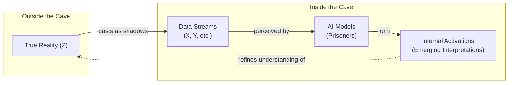
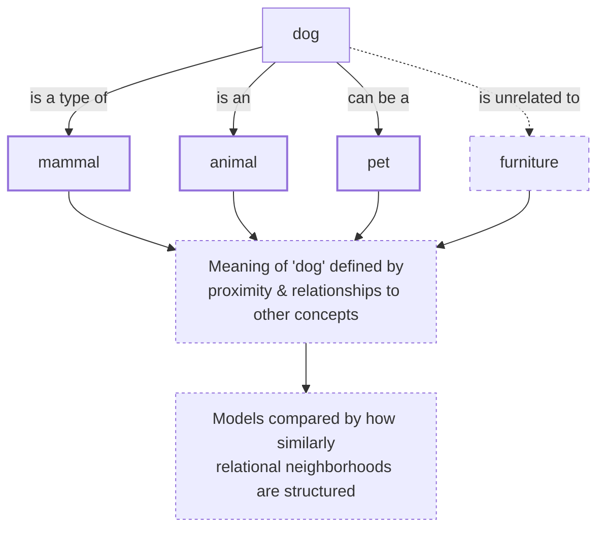
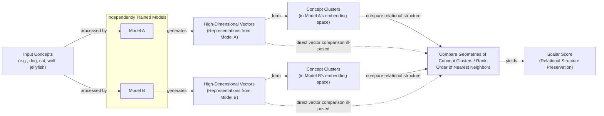
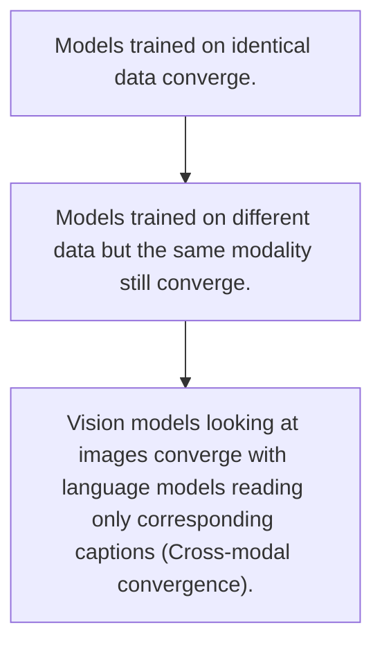
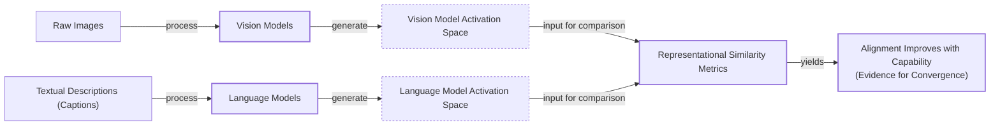

# The Platonic Representation Hypothesis: Are All AI Models Secretly Alike?

Read a story about dogs, and you may remember it the next time you see one bounding through a park. This is only possible because you have a unified concept of "dog" that is not tied to words or images alone. Bulldog or border collie, barking or getting its belly rubbed, a dog can be many things while still remaining a dog.

Artificial intelligence systems are not always so lucky. These systems often learn by ingesting data of a single type—text for language models, images for computer vision systems. This raises a fundamental question: to what extent do language and vision models have a shared understanding of a dog?

Researchers investigate such questions by peering inside AI systems and studying how they represent scenes and sentences. They have found that different AI models can develop similar representations, even if they are trained using different datasets or entirely different data types. What is more, a few studies have suggested that those representations are growing more similar as models grow more capable. In a 2024 paper, four AI researchers at the Massachusetts Institute of Technology (MIT) argued that these hints of convergence are no fluke [[1], [2]].

Their idea, dubbed the Platonic representation hypothesis, has inspired a lively debate among researchers and a flurry of follow-up work [[3], [4], [5], [6]]. The hypothesis gets its name from a 2,400-year-old allegory by the Greek philosopher Plato. In it, prisoners trapped inside a cave perceive the world only through shadows cast by outside objects. Plato maintained that we are all like those prisoners. The objects we encounter in everyday life, in his view, are pale shadows of ideal "forms" that reside in a transcendent realm beyond our senses [[7]].

In this AI-adapted version of the metaphor, the actual world is the true reality outside the cave. It casts machine-readable shadows as streams of data. The AI models are the prisoners. The MIT team’s claim is that very different models, exposed only to these data streams, are beginning to converge on a shared “Platonic representation” of the world behind the data.

Image 1: A conceptual diagram illustrating Plato's Cave allegory adapted for AI, showing True Reality casting data streams as shadows, which AI models observe to form internal interpretations that converge towards understanding True Reality.

"Why do the language model and the vision model align? Because they’re both shadows of the same world," said Phillip Isola, the senior author of the paper [[8]].

Not everyone is convinced. One of the main points of contention involves which representations to focus on. You cannot inspect a language model’s internal representation of every conceivable sentence, or a vision model’s representation of every image. It is unlikely that researchers will reach a consensus on the Platonic representation hypothesis anytime soon, but that does not bother Isola.

“Half the community says this is obvious, and the other half says this is obviously wrong,” he said. “We were happy with that response” [[8]].

Having framed the Platonic representation hypothesis and its philosophical roots, we will now look at the precise geometric mechanism that makes such comparisons possible by examining how representations are compared through the company their vectors keep.

## The Company Being Kept

If AI researchers do not agree on Plato, they might find more common ground with his predecessor Pythagoras, whose philosophy supposedly started from the premise “All is number.” The German polymath Gottfried Wilhelm von Leibniz pursued a similar vision in the 17th century, proposing that all concepts could be broken down into elementary parts, each assigned a unique number, allowing philosophical questions to be answered by calculation [[14]]. That is an apt description of the neural networks that power AI models. Their representations of words or pictures are just long lists of numbers, each indicating the degree of activation of a specific artificial neuron [[8]].

To simplify the math, researchers typically focus on a single layer of a neural network in isolation. They write down the neuron activations in this layer as a geometric object called a vector—an arrow that points in a particular direction in an abstract space. Modern AI models have many thousands of neurons in each layer, so their representations are high-dimensional vectors that are impossible to visualize directly. But vectors make it easy to compare a network’s representations: two are similar if the corresponding vectors point in similar directions. This geometric approach, which has long dominated the theoretical analysis of similarity, represents concepts as points in a coordinate space where metric distances reflect similarity [[8], [15]].

Within a single model, similar inputs tend to have similar representations. This is a version of an idea memorably expressed more than 60 years ago by the British linguist John Rupert Firth: “You shall know a word by the company it keeps.” In a language model, the vector for “dog” will be relatively close to vectors for “pet,” “bark,” and “furry,” and farther from “Platonic” and “molasses.” The meaning of any concept is defined by its relationships—proximity, opposition, clustering—to all other concepts [[6], [8]].

Image 2: A conceptual diagram illustrating Firth's linguistic principle applied to neural network representations, showing 'dog' as a central concept within a relational neighborhood and a distant concept 'furniture', along with explanatory nodes for the principle.

What about representations in different models? It does not make sense to directly compare activation vectors from separate networks, but researchers have devised indirect ways to assess their similarity. One popular approach is to embrace Firth's lesson and measure whether two models’ representations of an input keep the same company. Instead of trying to rotate one model's embedding space into another, which is ill-posed, we can compare the geometries of concept clusters or the rank-order of nearest neighbors. This yields a scalar score telling us how much the relational structure is preserved across models [[8]].

“It can kind of be described as measuring the similarity of similarities,” said Ilia Sucholutsky, an AI researcher at New York University [[9]].

Image 3: A flowchart detailing the technique of "measuring similarity of similarities" between independently trained models.

Researchers first started measuring representational similarity among AI models with this approach in the mid-2010s. They found that different models’ representations of the same concepts were often similar, though far from identical. Notably, a few studies found that more powerful models seemed to have more similarities in their representations than weaker ones. One 2021 paper dubbed this the “Anna Karenina scenario,” a nod to the opening line of the famous novel. Perhaps successful AI models are all alike, and every unsuccessful model is unsuccessful in its own way [[2], [8]].

That paper, like much of the early work on representational similarity, focused only on computer vision, which was then the most popular branch of AI research. The advent of powerful language models was about to change that. For Isola, it was also an opportunity to see just how far representational similarity could go [[8]].

With these measurement tools in hand, we can now look at the hierarchy of experimental evidence showing that convergence strengthens as models scale.

## Convergent Evolution

The story of the Platonic representation hypothesis paper began in early 2023, a turbulent time for AI researchers. ChatGPT had been released a few months before, and it was increasingly clear that simply scaling up AI models made them better at many different tasks. But it was unclear why. This led to a key question: when performance improves with scale, are models simply memorizing more dataset quirks, or are they getting better at approximating a true world model?

One potential answer is simplicity bias, an implicit preference in deep networks for simple solutions that strengthens with scale. This adherence to Occam’s razor may be what drives convergence [[3]].

“Everyone in AI research was going through an existential life crisis,” said Minyoung Huh, an OpenAI researcher who was a graduate student in Isola’s lab at the time. He began meeting with Isola and colleagues Brian Cheung and Tongzhou Wang to discuss how scaling might affect internal representations [[8]].

Their discussions led to a hierarchy of evidence that could support the Platonic representation hypothesis, with each level providing a stronger case for convergence. First, models trained on identical data converge. Second, models trained on different data but the same modality still converge. Finally, and most strikingly, vision models looking at images converge with language models reading only the corresponding captions [[8]].

Image 4: Hierarchy diagram illustrating the increasing order of strength of convergence evidence for the Platonic representation hypothesis.

A year after their initial conversations, Isola and his colleagues decided to write a paper reviewing the evidence for convergent representations and arguing for the Platonic representation hypothesis. By then, other researchers had already found evidence of alignment between vision and language model representations. Some have even noted this trend extends to biology, as neural networks also show alignment with representations in the brain [[1], [3], [8]].

Huh conducted his own experiment to test this cross-modal convergence. He tested a set of five vision models and 11 language models of varying sizes on a dataset of captioned pictures from Wikipedia. He would feed the pictures into the vision models and the captions into the language models, and then compare clusters of vectors in the two types. He observed a steady increase in representational similarity as models became more powerful. It was exactly what the Platonic representation hypothesis predicted [[8]].

Image 5: A flowchart illustrating Minyoung Huh's core experimental design to test cross-modal convergence between vision and language models.

After reviewing the evidence for convergence, we must examine the experimental choices related to measuring representational similarity that may affect the validity and generalizability of the results.

## Find the Universals

Of course, it is never so simple. Measurements of representational similarity involve a host of experimental choices that can affect the outcome. Which layers do you look at in each network? Which of the many similarity metrics do you use? And which representations do you measure in the first place [[8]]?

“If you only test one dataset, you don’t necessarily know how [the result] generalizes,” said Christopher Wolfram, a researcher at the University of Chicago. “Who knows what would happen if you did some weirder dataset?” The central problem is to distinguish arbitrary properties from fundamental ones, like nearest-neighbor relationships. Newer metrics like topological representation alignment aim to solve this by focusing on preserving local neighborhood geometry, which is less sensitive to layer choice [[4], [8], [10], [16]].

Isola acknowledged the issue is unsettled but argues that finding universals has more explanatory power. “The endeavor of science is to find the universals,” Isola said. “We could study the ways in which models are different or disagree, but that somehow has less explanatory power than identifying the commonalities” [[8]].

Other researchers argue that it is more productive to focus on where models’ representations differ. Among them is Alexei Efros, a researcher at the University of California, Berkeley. “They’re all good friends and they’re all very, very smart people,” Efros said. “I think they’re wrong, but that’s what science is about” [[8]].

Efros noted that in the Wikipedia dataset Huh used, the images and text contained very similar information by design. But most data we encounter has features that resist translation. “There is a reason why you go to an art museum instead of just reading the catalog,” he said. This is especially true when modalities have non-overlapping information, as simple fusion methods often fail to capture subtle interactions or handle the imperfect alignment found in real-world data [[8], [17]].

Any intrinsic sameness across models does not have to be perfect to be useful. The concept of partial or approximate alignment, where representations are similar but not identical, is a key area of research. Researchers have already used this partial alignment to translate internal representations of sentences from one language model to another [[5], [18]].

If language and vision model representations are to some extent interchangeable, that could lead to new ways to train models that learn from both data types, a concept explored in recent work. Strategic alignment can also improve unimodal encoders, especially when redundant information is shared between modalities [[6], [11], [12]].

Still, some researchers think no single theory will capture the behavior of modern AI. “You can’t reduce a trillion-parameter system to simple explanations,” said Jeff Clune, an AI researcher at the University of British Columbia. While the hypothesis offers an elegant story, real models are so complex that full convergence may coexist with vast regions of model-specific idiosyncrasy [[8], [13]].

## References

- [1] Yoon, L. H., Yue, Y., & Kim, B. (2025). Escaping Plato’s Cave: JAM for Aligning Independently Trained Vision and Language Models. *arXiv preprint arXiv:2507.01201*. https://arxiv.org/html/2507.01201v5
- [2] Bansal, Y., Nakkiran, P., & Barak, B. (2021). Revisiting Model Stitching to Compare Neural Representations. *arXiv preprint arXiv:2106.07682*. https://arxiv.org/html/2106.07682
- [3] Huh, M., Cheung, B., Wang, T., & Isola, P. (2024). The Platonic Representation Hypothesis. *International Conference on Machine Learning*. https://phillipi.github.io/prh
- [4] Wolfram, C., & Schein, A. (2025). Layers at Similar Depths Generate Similar Activations Across LLM Architectures. *arXiv preprint arXiv:2504.08775*. https://arxiv.org/html/2504.08775v1
- [5] Jha, R., Zhang, C., Shmatikov, V., & Morris, J. X. (2025). Harnessing the Universal Geometry of Embeddings. *arXiv preprint arXiv:2505.12540*. https://arxiv.org/html/2505.12540
- [6] Gupta, S., Sundaram, S., Wang, C., Jegelka, S., & Isola, P. (2025). Better Together: Leveraging Unpaired Multimodal Data for Stronger Unimodal Models. *arXiv preprint arXiv:2510.08492*. https://arxiv.org/html/2510.08492
- [7] Plato. (c. 375 BC). *Republic*. https://en.wikipedia.org/wiki/Allegory_of_the_cave
- [8] Brubaker, B. (2026). Distinct AI Models Seem To Converge On How They Encode Reality. *Quanta Magazine*. https://www.quantamagazine.org/distinct-ai-models-seem-to-converge-on-how-they-encode-reality-20260107
- [9] Sucholutsky, I. (2026). In *Distinct AI Models Seem To Converge On How They Encode Reality*. Quanta Magazine. https://www.quantamagazine.org/distinct-ai-models-seem-to-converge-on-how-they-encode-reality-20260107
- [10] Wolfram, C. (2025). Critique of representational similarity generalizability. *arXiv preprint arXiv:2504.08775*. https://arxiv.org/html/2504.08775v1
- [11] Fang, W., Zhang, T., & Chan, A. (2025). To Align or Not to Align: Strategic Multimodal Representation Alignment for Optimal Performance. *arXiv preprint arXiv:2511.12121*. https://arxiv.org/html/2511.12121v4
- [12] Fang, W., Zhang, T., & Chan, A. (2025). To Align or Not to Align: Strategic Multimodal Representation Alignment for Optimal Performance. *AAAI*. https://ojs.aaai.org/index.php/AAAI/article/view/39248/43209
- [13] Clune, J. (2025). In *Trillion Parameter Consortium*. https://tpc.dev/wp-content/uploads/2025/02/TPC-Introduction-and-Structure.pdf
- [14] MacLennan, B. J. (n.d.). A History of Predicate Logic and AI Before Computers. *University of Tennessee*. https://web.eecs.utk.edu/~bmaclenn/papers/HistoryAIBeforeComputers.pdf
- [15] Tversky, A. (1977). Features of Similarity. *Psychological Review*. https://cogsci.ucsd.edu/~coulson/203/tvgati.pdf
- [16] Zhang, Z., et al. (2025). Universal Geometry of Foundation Model Representations. *arXiv preprint arXiv:2502.18710*. https://arxiv.org/html/2502.18710v3
- [17] Liu, Y., et al. (2024). A Cross-Modal Fusion Framework for Infrared and Visible Image Based on Content-Awareness and Texture-Guidance. *Applied Sciences*. https://www.mdpi.com/2076-3417/15/22/12185
- [18] Dauphin, G., et al. (2023). Reasoning with Alignment. *University of Luxembourg*. https://orbilu.uni.lu/bitstream/10993/66946/1/Reasoning%20alignment.pdf
</article>