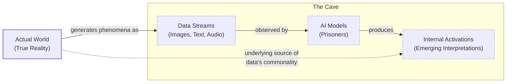
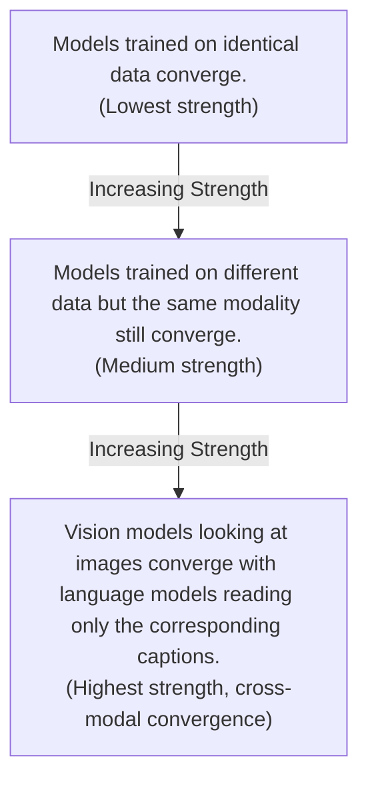

# The Platonic Code: Are All AI Models Learning the Same Reality?

Read a story about dogs, and you may remember it the next time you see one bounding through a park. That is only possible because you have a unified concept of “dog” that is not tied to words or images alone. Bulldog or border collie, a bark or a belly rub, a dog can be many things while remaining a dog.

AI systems are not always so lucky. These systems often learn from data of a single type. Text for language models, images for computer vision systems, and other exotic data for systems designed to predict smells or protein structures. This unimodal training raises a fundamental question: to what extent do language and vision models have a shared understanding of the same object?

Researchers investigate such questions by peering inside AI systems and studying how they represent scenes and sentences. They have found that different AI models can develop similar representations, even if they are trained using different datasets or entirely different data types. Furthermore, a few studies have suggested that those representations grow more similar as models become more capable [[1](https://arxiv.org/abs/2405.07987)], [[2](https://arxiv.org/abs/1905.00414)], [[3](https://arxiv.org/html/2511.12121v4)]. In a 2024 paper, four AI researchers at the Massachusetts Institute of Technology argued that these hints of convergence are no fluke. Their idea, dubbed the Platonic representation hypothesis, has inspired a lively debate and a series of follow-up studies [[4](https://arxiv.org/html/2507.01201v5)], [[5](https://arxiv.org/html/2504.08775v1)], [[6](https://arxiv.org/abs/2505.12540)], [[7](https://arxiv.org/abs/2510.08492)].

The hypothesis gets its name from a 2,400-year-old allegory by the Greek philosopher Plato. In it, prisoners trapped inside a cave perceive the world only through shadows cast by outside objects. Plato maintained that we are all like those prisoners. The objects we encounter are pale shadows of ideal “forms” that reside in a transcendent realm beyond our senses [[8](https://www.alignmentforum.org/posts/kFCu3batN8k8mwtmh/the-cave-allegory-revisited-understanding-gpt-s-worldview)].

In this version of the metaphor, the actual world outside the cave casts machine-readable shadows as data streams. AI models are the prisoners. The hypothesis claims that as these models grow more sophisticated, their internal interpretations of the shadows begin to converge on a shared “Platonic representation” of the world behind the data [[9](https://phillipi.github.io/prh)]. This idea finds a parallel in cognitive science, where the theory of predictive processing suggests that "predicting the shadows" is a large part of what our own minds do to build complex generative models of the world [[8](https://www.alignmentforum.org/posts/kFCu3batN8k8mwtmh/the-cave-allegory-revisited-understanding-gpt-s-worldview)]. “Why do the language model and the vision model align? Because they’re both shadows of the same world,” said Phillip Isola, the senior author of the paper [[10](https://www.quantamagazine.org/distinct-ai-models-seem-to-converge-on-how-they-encode-reality-20260107)].

Image 1: A conceptual diagram illustrating Plato's Cave allegory adapted for AI, showing the flow from the Actual World to Data Streams, AI Models, and Internal Activations, with an emphasis on the common origin of data leading to similar interpretations.

Not everyone is convinced. One main point of contention involves which representations to focus on and how to compare them across vastly different models. It is unlikely that researchers will reach a consensus anytime soon, but that does not bother Isola. “Half the community says this is obvious, and the other half says this is obviously wrong,” he said. “We were happy with that response” [[10](https://www.quantamagazine.org/distinct-ai-models-seem-to-converge-on-how-they-encode-reality-20260107)].

Having framed the Platonic representation hypothesis and its philosophical roots, we will now transition to the precise geometric mechanism that makes such comparisons possible, by examining how representations are compared through the company their vectors keep.

## The Company Being Kept

If AI researchers do not agree on Plato, they might find more common ground with his predecessor Pythagoras, whose philosophy supposedly started from the premise “All is number.” That is an apt description of the neural networks that power AI models. Their representations of words or pictures are just long lists of numbers, each indicating the degree of activation of a specific artificial neuron [[10](https://www.quantamagazine.org/distinct-ai-models-seem-to-converge-on-how-they-encode-reality-20260107)].

Researchers typically focus on a single layer of a neural network, writing down the neuron activations as a geometric object called a vector. Modern AI models have thousands of neurons in each layer, so their representations are high-dimensional vectors that are impossible to visualize directly. However, this geometric basis allows for comparison: two representations are similar if their vectors point in similar directions. When vectors for the same concept point in similar directions across two models, we have evidence of conceptual alignment, even if the absolute coordinate systems differ.

It does not make sense to directly compare activation vectors from separate networks, but researchers have devised indirect ways to assess this similarity. One popular approach embraces a pithy quote from the British linguist John Rupert Firth: “You shall know a word by the company it keeps.” The meaning of any concept inside a model is defined by its relationships—proximity, opposition, clustering—to all other concepts. For example, the vector for "dog" will be relatively close to vectors for "pet" and "furry," and farther from "molasses." We can compare models by asking whether "dog" sits in the same relational neighborhood in both spaces [[10](https://www.quantamagazine.org/distinct-ai-models-seem-to-converge-on-how-they-encode-reality-20260107)].

This technique measures the "similarity of similarities." Instead of trying to rotate one model's embedding space into another, which is ill-posed, we compare the geometries of concept clusters. This produces a scalar score indicating how much the relational structure is preserved across models. As AI researcher Ilia Sucholutsky put it, “It can kind of be described as measuring the similarity of similarities” [[10](https://www.quantamagazine.org/distinct-ai-models-seem-to-converge-on-how-they-encode-reality-20260107)].

A concrete example from recent research illustrates this. Given the text "Training For Ice and Mixed Climbing Series brought to you by Furnace Industries continues...", layer 10 of Llama-3.1-8B identifies its three nearest neighbors from a large text corpus. Surprisingly, layer 20 of Gemma-2-9B, a different model from a different company, identifies the exact same three neighbors. This agreement is remarkable because the neighbors seem arbitrary at first glance. However, a different layer in the same model, layer 30 of Llama-3.1-8B, produces a completely different set of neighbors, which in turn aligns with layer 40 of Gemma-2-9B. This suggests that models generate a shared progression of distinct geometries from layer to layer [[5](https://arxiv.org/html/2504.08775v1)].

This leads to the "Anna Karenina scenario," a nod to the opening line of the famous novel. The idea is that all successful, high-performing models might converge toward the same representational geometry, while each unsuccessful model is unsuccessful in its own way. The Platonic representation hypothesis takes this a step further, arguing that the "happy representation" they converge upon reflects a statistical model of the underlying reality [[11](https://aiscientist.substack.com/p/musing-38-the-platonic-representation)], [[12](https://arxiv.org/abs/2106.07682)]. This pattern suggests there is a single "correct" structure for models to discover.

Early work on representational similarity focused on computer vision, which was then the most popular branch of AI research [[10](https://www.quantamagazine.org/distinct-ai-models-seem-to-converge-on-how-they-encode-reality-20260107)]. Researchers started exploring this in the mid-2010s and found that different models' representations were often similar, though not identical. Some studies found that more powerful models had more similarities than weaker ones. However, these methods had inherent limitations once researchers tried to extend them to language models, before large-scale paired vision-language datasets became available.

With these measurement tools in hand, we can now look at the hierarchy of experimental evidence showing that this convergence strengthens as models scale.

## Convergent Evolution

In early 2023, just a few months after ChatGPT's release, a key question dominated the AI research community: when models improve with scale, are they just memorizing dataset quirks, or are they getting better at approximating a true world model? “Everyone in AI research was going through an existential life crisis,” said Minyoung Huh, an OpenAI researcher who was a graduate student in Isola’s lab at the time. He began meeting regularly with Isola and their colleagues to discuss how scaling might affect internal representations [[10](https://www.quantamagazine.org/distinct-ai-models-seem-to-converge-on-how-they-encode-reality-20260107)].

This led to a hierarchy of potential evidence for the Platonic representation hypothesis, with each level providing stronger support.

Image 2: Hierarchy of evidence strength for the Platonic representation hypothesis.

If models trained on different datasets converge, it suggests they are grasping shared features of the world behind the data. Convergence between models trained on entirely different data types, like vision and language, would provide even stronger evidence. This convergence is thought to be driven by several factors. The **multitask scaling hypothesis** suggests that as models are trained on more tasks, the number of viable representations shrinks. The **capacity hypothesis** posits that larger models are more likely to find a shared representation. Finally, the **simplicity bias hypothesis** argues that deep networks favor simple solutions, and this bias strengthens with model size, leading to a smaller solution space [[11](https://aiscientist.substack.com/p/musing-38-the-platonic-representation)].

A year after their initial conversations, Isola and his colleagues wrote a paper reviewing the evidence for these convergent representations and arguing for the Platonic hypothesis [[1](https://arxiv.org/abs/2405.07987)]. By then, other researchers had already found alignment between vision and language model representations [[4](https://arxiv.org/html/2507.01201v5)]. Huh conducted his own experiment, testing a set of vision and language models of varying sizes on the Wikipedia-based Image Text (WIT) dataset. He fed the pictures into the vision models and the captions into the language models, then compared the vector clusters. He observed a steady increase in representational similarity as models became more powerful, just as the hypothesis predicted [[10](https://www.quantamagazine.org/distinct-ai-models-seem-to-converge-on-how-they-encode-reality-20260107)].

After reviewing the evidence for convergence, we must examine the experimental choices that can affect the validity and generalizability of these results.

## Find the Universals

Of course, it is never so simple. Measurements of representational similarity involve a host of experimental choices that can affect the outcome. Which layers do you look at? Which of the many similarity metrics do you use? These can range from global metrics like Canonical Correlation Analysis (CCA) and Centered Kernel Alignment (CKA), which capture holistic patterns, to local ones like Centered Kernel Nearest Neighbors Alignment (CKNNA), which focuses on neighborhood-level similarity. Each choice can lead to different conclusions [[4](https://arxiv.org/html/2507.01201v5)].

“If you only test one dataset, you don’t necessarily know how [the result] generalizes,” said Christopher Wolfram, a researcher who has studied this problem. “Who knows what would happen if you did some weirder dataset?” [[10](https://www.quantamagazine.org/distinct-ai-models-seem-to-converge-on-how-they-encode-reality-20260107)], [[5](https://arxiv.org/html/2504.08775v1)]. The core challenge is choosing what properties of representations are fundamental versus arbitrary [[5](https://arxiv.org/html/2504.08775v1)]. Critics argue that observed similarities may reflect structural constraints rather than meaningful convergence, questioning the generalizability of such findings [[13](https://www.preprints.org/manuscript/202601.1018)].

This has led to two complementary scientific attitudes. One, associated with Isola, actively seeks out the universals that models appear to share. “The endeavor of science is to find the universals,” Isola said. “We could study the ways in which models are different or disagree, but that somehow has less explanatory power than identifying the commonalities” [[10](https://www.quantamagazine.org/distinct-ai-models-seem-to-converge-on-how-they-encode-reality-20260107)]. Others, like Alexei Efros, argue it is more productive to focus on where models differ. Efros noted that in the Wikipedia dataset Huh used, the images and text contained very similar information by design. But most data we encounter has features that resist translation. “There is a reason why you go to an art museum instead of just reading the catalog,” he said [[10](https://www.quantamagazine.org/distinct-ai-models-seem-to-converge-on-how-they-encode-reality-20260107)].

Despite the debate, even partial alignment has immediate practical payoffs. Researchers have used it to translate representations from one language model to another [[6](https://arxiv.org/abs/2505.12540)]. If language and vision representations are interchangeable, it could lead to new ways to train models that learn from both data types [[7](https://arxiv.org/abs/2510.08492)], [[3](https://arxiv.org/html/2511.12121v4)]. This has implications for cross-modal search, robotics, and robust information fusion [[14](https://www.emergentmind.com/topics/multimodal-alignment)].

Still, some researchers think it is unlikely that a single theory will fully capture the behavior of modern AI. “You can’t reduce a trillion-parameter system to simple explanations,” said Jeff Clune, an AI researcher. “The answers are going to be complicated” [[10](https://www.quantamagazine.org/distinct-ai-models-seem-to-converge-on-how-they-encode-reality-20260107)]. While the Platonic hypothesis offers a clean philosophical story, the irreducible complexity of these massive systems means that full convergence may coexist with vast regions of model-specific idiosyncrasy.

## Conclusion

The Platonic representation hypothesis offers a compelling framework for understanding a surprising phenomenon in modern AI: the convergence of internal representations across different models, architectures, and even data modalities. By adapting Plato's ancient allegory, we can conceptualize AI models as prisoners in a digital cave, all observing the same shadows of reality cast by data streams. As these models become more capable, their internal interpretations appear to align, suggesting they are all converging on a shared statistical model of the world.

We have explored the geometric techniques, like measuring the "similarity of similarities," that allow researchers to quantify this alignment without needing to directly compare incompatible vector spaces. The evidence, from the "Anna Karenina scenario" to cross-modal experiments, increasingly suggests that more powerful models are indeed more alike internally. However, the debate is far from settled. Critical questions remain about measurement methodologies, the generalizability of findings, and whether we should focus on the universal commonalities or the instructive differences between models.

Regardless of the outcome of this philosophical debate, the practical implications are already emerging. The discovery of this shared structure opens up new possibilities for building more efficient and robust multimodal systems, enabling representation translation and better transfer learning. For AI engineers, this is not just an abstract theory; it is a glimpse into the fundamental principles that could govern the future of interoperable and truly intelligent systems.

## References

- [1] [The Platonic Representation Hypothesis](https://arxiv.org/abs/2405.07987)
- [2] [Similarity of neural network representations revisited](https://arxiv.org/abs/1905.00414)
- [3] [To Align or Not to Align: Strategic Multimodal Representation Alignment for Optimal Performance](https://arxiv.org/html/2511.12121v4)
- [4] [Escaping Plato’s Cave: JAM for Aligning Independently Trained Vision and Language Models](https://arxiv.org/html/2507.01201v5)
- [5] [Layers at Similar Depths Generate Similar Activations Across LLM Architectures](https://arxiv.org/html/2504.08775v1)
- [6] [Harnessing the Universal Geometry of Embeddings](https://arxiv.org/abs/2505.12540)
- [7] [Better Together: Leveraging Unpaired Multimodal Data for Stronger Unimodal Models](https://arxiv.org/abs/2510.08492)
- [8] [The Cave Allegory, Revisited: Understanding GPT’s Worldview](https://www.alignmentforum.org/posts/kFCu3batN8k8mwtmh/the-cave-allegory-revisited-understanding-gpt-s-worldview)
- [9] [The Platonic Representation Hypothesis](https://phillipi.github.io/prh)
- [10] [Distinct AI Models Seem To Converge On How They Encode Reality](https://www.quantamagazine.org/distinct-ai-models-seem-to-converge-on-how-they-encode-reality-20260107)
- [11] [Musing 38: The Platonic Representation Hypothesis](https://aiscientist.substack.com/p/musing-38-the-platonic-representation)
- [12] [Revisiting model stitching to compare neural representations](https://arxiv.org/abs/2106.07682)
- [13] [Christopher Wolfram's critique of representational similarity generalizability](https://www.preprints.org/manuscript/202601.1018)
- [14] [Multimodal Alignment](https://www.emergentmind.com/topics/multimodal-alignment)
</article>