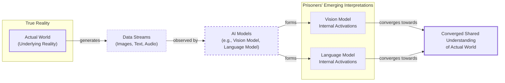

# The Platonic Ideal of AI: Are All Models Learning the Same Reality?

If you read a story about dogs, you can remember it the next time you see one in a park. This is possible because you have a unified concept of "dog" that is not tied to words or images alone. Bulldog or border collie, barking or getting its belly rubbed, a dog can be many things while still remaining a dog.

Artificial intelligence systems are not always so lucky. These systems often learn by ingesting data of a single type—text for language models, images for computer vision systems, or other specialized data. [[1]](https://sergeylevine.substack.com/p/language-models-in-platos-cave) This raises a fundamental question for any AI engineer: to what extent do language and vision models, trained in their separate digital worlds, develop a shared understanding of a concept like "dog"?

Researchers investigate this by peering inside AI systems to study how they represent scenes and sentences. They have found that different AI models can develop similar representations, even if trained on different datasets or data types. [[2]](https://www.quantamagazine.org/distinct-ai-models-seem-to-converge-on-how-they-encode-reality-20260107) Furthermore, studies suggest these representations grow more similar as the models become more capable. [[3]](https://3dvar.com/Huh2024The.pdf), [[4]](https://phillipi.github.io/prh) In a 2024 paper, a team of MIT researchers argued that these hints of convergence are no accident. [[5]](https://arxiv.org/html/2405.07987v1) Their idea, dubbed the Platonic Representation Hypothesis, has since inspired a lively debate. [[2]](https://www.quantamagazine.org/distinct-ai-models-seem-to-converge-on-how-they-encode-reality-20260107), [[6]](https://arxiv.org/html/2511.12121v4)

The hypothesis gets its name from a 2,400-year-old story by the Greek philosopher Plato. [[7]](https://en.wikipedia.org/wiki/Allegory_of_the_cave) In his allegory, a group of prisoners has been chained inside a cave their entire lives, facing a blank wall. Behind them, a fire burns, and objects passing in front of it cast shadows on the wall. For the prisoners, these flickering shadows are the only reality they know. [[23]](https://www.mdpi.com/2079-9292/13/8/1457) Plato argued that we are all like those prisoners, and the objects we encounter are just pale shadows of ideal "forms" that exist in a higher reality.

The AI adaptation of this story is less abstract. The real world outside the cave casts machine-readable shadows as streams of data. AI models are the prisoners, exposed only to these data streams. Some have even described models like GPT as a "blind oracle in a deeper cave," one that does not even see the shadows but only hears our conversations about them. [[24]](https://www.alignmentforum.org/posts/kFCu3batN8k8mwtmh/the-cave-allegory-revisited-understanding-gpt-s-worldview) The hypothesis claims that very different models are beginning to converge on a shared "Platonic representation" of the world behind the data. [[8]](https://arxiv.org/html/2507.01201v5) As Phillip Isola, a senior author of the paper, puts it, "Why do the language model and the vision model align? Because they’re both shadows of the same world". [[2]](https://www.quantamagazine.org/distinct-ai-models-seem-to-converge-on-how-they-encode-reality-20260107)

Image 1: Plato's Cave Allegory for AI representations, illustrating the flow from true reality to data streams, AI model interpretations, and their convergence towards a shared understanding.

Not everyone is convinced. A key point of contention involves which representations to focus on and how to compare them across different models. In fact, there is little agreement in either neuroscience or AI on how the term "representation" should be understood in the first place, making the debate's foundation itself a moving target. [[9]](https://philosophymindscience.org/index.php/phimisci/announcement/view/53) A consensus on the Platonic Representation Hypothesis is unlikely to be reached soon, but that does not bother Isola. "Half the community says this is obvious, and the other half says this is obviously wrong," he said. "We were happy with that response". [[2]](https://www.quantamagazine.org/distinct-ai-models-seem-to-converge-on-how-they-encode-reality-20260107)

Having framed the hypothesis and its philosophical roots, the next step is to understand the precise geometric mechanism that makes such comparisons possible. This involves examining how representations are compared through the company their vectors keep.

## The Company Being Kept

If AI researchers do not agree on Plato, they might find more common ground with his predecessor Pythagoras, whose philosophy supposedly started from the premise "All is number." That is an apt description of neural networks. Their representations of words or pictures are just long lists of numbers, each indicating the activation of a specific artificial neuron. [[2]](https://www.quantamagazine.org/distinct-ai-models-seem-to-converge-on-how-they-encode-reality-20260107)

Researchers typically focus on a single layer of a network and write down the neuron activations as a geometric object called a vector. Modern AI models have thousands of neurons per layer, so their representations are high-dimensional vectors that are impossible to visualize directly. These vectors make it easy to compare representations within a single model: two are similar if their vectors point in similar directions. [[2]](https://www.quantamagazine.org/distinct-ai-models-seem-to-converge-on-how-they-encode-reality-20260107)

However, this geometric intuition can be misleading in the high-dimensional spaces where these vectors live. Traditional metrics like Euclidean distance become less reliable, and even cosine similarity has limitations, as the angles between random vectors tend to concentrate, making distinctions less meaningful. [[10]](https://khoury.northeastern.edu/home/pandey/courses/cs7800/spring26/papers/sshds.pdf), [[11]](https://arxiv.org/html/2407.08623v4) Since directly comparing activation vectors from separate networks is impossible, researchers use indirect ways to assess similarity. This is where the geometric basis for comparison becomes critical. Instead of matching absolute vector coordinates, which differ between models, we can compare the relational geometry. When vectors for the same concept point in similar directions, or when the relative distances and angles between many concepts match across two models, we have evidence of conceptual alignment.

One popular approach applies a principle from the British linguist John Rupert Firth, who memorably said: "You shall know a word by the company it keeps". [[2]](https://www.quantamagazine.org/distinct-ai-models-seem-to-converge-on-how-they-encode-reality-20260107) This principle can be applied to AI representations. Instead of comparing vectors directly, you can measure whether two models' representations of an input keep the same company. Suppose you want to compare how two language models represent animals. You would feed a list of words—dog, cat, wolf, jellyfish—into both networks and record their vector representations. In each network, these vectors form a cluster. The question then becomes: how similar are the overall shapes of these two clusters? [[2]](https://www.quantamagazine.org/distinct-ai-models-seem-to-converge-on-how-they-encode-reality-20260107)

This comparison is not about aligning individual vector coordinates but about matching the relational geometry. You are checking if the relative distances and angles between concepts are preserved. For example, is the distance between "dog" and "cat" in model A proportional to the same distance in model B? Is the angle between the "dog" and "wolf" vectors similar in both spaces? By comparing these geometric relationships across many concepts, you can get a robust measure of alignment.

As Ilia Sucholutsky, an AI researcher at New York University, said, "It can kind of be described as measuring the similarity of similarities". [[2]](https://www.quantamagazine.org/distinct-ai-models-seem-to-converge-on-how-they-encode-reality-20260107) The choice of metric is not trivial. Different mathematical bounds lead to measures with different saturation conditions. For example, some measures reach their maximum score with mere ordinal concordance (the rank order of neighbors is the same), while others require near-perfect vector identity. [[12]](https://arxiv.org/html/2602.05266v1) You would expect some similarity; the "cat" and "dog" vectors would likely be close in both models, while "jellyfish" would be farther away. But the clusters will not be identical. Is "dog" more like "cat" than "wolf"? Models trained on different datasets or with different architectures might not agree. [[2]](https://www.quantamagazine.org/distinct-ai-models-seem-to-converge-on-how-they-encode-reality-20260107)

Researchers began exploring this in the mid-2010s and found that representations were often similar but not identical. A few studies found that more powerful models seemed to have more similar representations. One 2021 paper dubbed this the "Anna Karenina scenario," a reference to Tolstoy's famous opening line: perhaps all successful AI models are alike, while every unsuccessful model is unsuccessful in its own way. [[13]](https://aiscientist.substack.com/p/musing-38-the-platonic-representation), [[14]](https://arxiv.org/html/2106.07682v2) This scenario suggests that as models improve, they are not just getting better at their tasks but are also converging on a single, optimal way to represent the world.

That paper, like much of the early work, focused on computer vision, which was then the most popular branch of AI research. The rise of powerful language models presented an opportunity to see just how far representational similarity could go. With these measurement tools in hand, we can examine the hierarchy of experimental evidence showing that convergence strengthens as models scale.

## Convergent Evolution

The story of the Platonic Representation Hypothesis paper began in early 2023, a turbulent time for AI researchers. ChatGPT had been released a few months prior, and it was becoming clear that simply scaling up AI models made them better at many different tasks. But it was not clear why. This led to an existential question: were these scaled-up models simply getting better at memorizing the quirks of their training data, or were they genuinely forming a more accurate model of the world?

"Everyone in AI research was going through an existential life crisis," said Minyoung Huh, an OpenAI researcher who was a graduate student at the time. He began meeting with his colleagues to discuss how scaling might affect internal representations. [[2]](https://www.quantamagazine.org/distinct-ai-models-seem-to-converge-on-how-they-encode-reality-20260107) When multiple models are trained on the same data, and stronger models learn more similar representations, it could just be that they are better at grasping quirks of the training dataset.

The evidence becomes more compelling when models trained on different datasets also converge. This hierarchy of evidence provides a useful framework for thinking about convergence:
1.  **Identical Data:** Models trained on the same data converge. This is the weakest evidence, as it could just reflect better memorization of the dataset.
2.  **Different Data, Same Modality:** Models trained on different datasets but the same modality (e.g., two vision models on different image sets) still converge. This is stronger evidence that they are learning something fundamental about the visual world.
3.  **Different Modalities:** The strongest evidence comes from convergence between models trained on entirely different data types, like a vision model looking at images and a language model reading their captions. This suggests they are both tapping into a shared, underlying reality. [[2]](https://www.quantamagazine.org/distinct-ai-models-seem-to-converge-on-how-they-encode-reality-20260107)

A year after their initial conversations, Isola and his colleagues wrote a paper reviewing the evidence and arguing for the Platonic Representation Hypothesis. [[2]](https://www.quantamagazine.org/distinct-ai-models-seem-to-converge-on-how-they-encode-reality-20260107) By then, other researchers had found evidence of alignment between vision and language model representations. [[2]](https://www.quantamagazine.org/distinct-ai-models-seem-to-converge-on-how-they-encode-reality-20260107) Huh conducted his own experiment, testing five vision models and eleven language models of varying sizes on a dataset of captioned pictures from Wikipedia. He fed the pictures to the vision models and the captions to the language models, then compared the vector clusters. He observed a steady increase in representational similarity as the models became more powerful—exactly what the hypothesis predicted. [[2]](https://www.quantamagazine.org/distinct-ai-models-seem-to-converge-on-how-they-encode-reality-20260107)

While the evidence for convergence is compelling, it is crucial to examine the experimental choices that can affect the validity of these results.

## Find the Universals

Of course, it is never so simple. Measurements of representational similarity involve a host of experimental choices that can affect the outcome. Which layers do you look at? Early layers might capture low-level features like edges and textures, while later layers handle more abstract concepts. Which of the many available metrics do you use? Some, like Centered Kernel Alignment (CKA), measure global similarity, while others focus on local neighborhood structures. And which representations do you measure in the first place? [[2]](https://www.quantamagazine.org/distinct-ai-models-seem-to-converge-on-how-they-encode-reality-20260107)

Christopher Wolfram, a researcher who has studied representational similarity, critiques that similarities may reflect "unavoidable structural constraints rather than meaningful representational convergence," questioning their generalizability. [[15]](https://openreview.net/forum?id=8wKec6faAT), [[16]](https://www.preprints.org/manuscript/202601.1018) The core challenge is distinguishing between arbitrary properties of a representation (like the order of dimensions) and fundamental ones (like nearest-neighbor relationships). [[17]](https://arxiv.org/html/2504.08775v1) Wolfram notes, "If you only test one dataset, you don’t necessarily know how [the result] generalizes. Who knows what would happen if you did some weirder dataset?". [[2]](https://www.quantamagazine.org/distinct-ai-models-seem-to-converge-on-how-they-encode-reality-20260107)

Isola acknowledges the issue is far from settled. He argues that cases where models do converge are more compelling than cases where they may not. "The endeavor of science is to find the universals," he said. "We could study the ways in which models are different or disagree, but that somehow has less explanatory power than identifying the commonalities". [[2]](https://www.quantamagazine.org/distinct-ai-models-seem-to-converge-on-how-they-encode-reality-20260107)

Other researchers, like Alexei Efros at UC Berkeley, argue it is more productive to focus on where models differ. "They’re all good friends and they’re all very, very smart people," Efros said. "I think they’re wrong, but that’s what science is about". [[2]](https://www.quantamagazine.org/distinct-ai-models-seem-to-converge-on-how-they-encode-reality-20260107) He points out that in the Wikipedia dataset Huh used, the images and text contained similar information by design. But most data has features that resist translation. "There is a reason why you go to an art museum instead of just reading the catalog," he said. [[2]](https://www.quantamagazine.org/distinct-ai-models-seem-to-converge-on-how-they-encode-reality-20260107)

Even partial alignment can have practical payoffs. Researchers have used this emerging sameness to translate sentence representations from one language model to another. [[18]](https://arxiv.org/html/2505.12540v1) If language and vision representations are somewhat interchangeable, it could lead to new ways to train models that learn from both data types, enabling applications like cross-modal search and sensor fusion. [[19]](https://www.emergentmind.com/topics/multimodal-alignment), [[20]](https://arxiv.org/html/2510.08492v1) This is especially true in robotics, where unifying action spaces across different hardware allows a single policy to learn a shared task representation, improving skill transfer and manipulation success rates even across significant hardware differences. [[21]](https://www.emergentmind.com/topics/cross-embodiment-robot-data), [[22]](https://arxiv.org/html/2506.14608v3)

Despite these promising developments, some researchers think it is unlikely that a single theory will fully capture the behavior of modern AI models. The Platonic hypothesis offers a clean, elegant story, but the reality of these complex systems is likely a mix of this convergence and vast regions of model-specific idiosyncrasy. "You can’t reduce a trillion-parameter system to simple explanations," said Jeff Clune, an AI researcher at the University of British Columbia. "The answers are going to be complicated". [[2]](https://www.quantamagazine.org/distinct-ai-models-seem-to-converge-on-how-they-encode-reality-20260107)

## References

- [1] Language Models in Plato's Cave. (2023, October 23). [https://sergeylevine.substack.com/p/language-models-in-platos-cave](https://sergeylevine.substack.com/p/language-models-in-platos-cave)
- [2] Distinct AI Models Seem To Converge On How They Encode Reality. (2026, January 7). [https://www.quantamagazine.org/distinct-ai-models-seem-to-converge-on-how-they-encode-reality-20260107](https://www.quantamagazine.org/distinct-ai-models-seem-to-converge-on-how-they-encode-reality-20260107)
- [3] The Platonic Representation Hypothesis. (2024). [https://3dvar.com/Huh2024The.pdf](https://3dvar.com/Huh2024The.pdf)
- [4] The Platonic Representation Hypothesis. (n.d.). [https://phillipi.github.io/prh](https://phillipi.github.io/prh)
- [5] The Platonic Representation Hypothesis. (2024). [https://arxiv.org/html/2405.07987v1](https://arxiv.org/html/2405.07987v1)
- [6] To Align or Not to Align: Strategic Multimodal Representation Alignment for Optimal Performance. (2025). [https://arxiv.org/html/2511.12121v4](https://arxiv.org/html/2511.12121v4)
- [7] Allegory of the cave. (n.d.). [https://en.wikipedia.org/wiki/Allegory_of_the_cave](https://en.wikipedia.org/wiki/Allegory_of_the_cave)
- [8] Escaping Plato’s Cave: JAM for Aligning Independently Trained Vision and Language Models. (2025). [https://arxiv.org/html/2507.01201v5](https://arxiv.org/html/2507.01201v5)
- [9] On What is a Representation. (2024). [https://philosophymindscience.org/index.php/phimisci/announcement/view/53](https://philosophymindscience.org/index.php/phimisci/announcement/view/53)
- [10] Similarity Search in High Dimensional Spaces. (2026). [https://khoury.northeastern.edu/home/pandey/courses/cs7800/spring26/papers/sshds.pdf](https://khoury.northeastern.edu/home/pandey/courses/cs7800/spring26/papers/sshds.pdf)
- [11] DIEM: A Dimension-Insensitive metric for high-dimension datasets. (2024). [https://arxiv.org/html/2407.08623v4](https://arxiv.org/html/2407.08623v4)
- [12] Beyond Cosine Similarity: The Ordinal-Concordance-based Similarity Measure for High-Dimensional Embedding Spaces. (2026). [https://arxiv.org/html/2602.05266v1](https://arxiv.org/html/2602.05266v1)
- [13] Musing 38: The Platonic Representation Hypothesis. (2024, May 22). [https://aiscientist.substack.com/p/musing-38-the-platonic-representation](https://aiscientist.substack.com/p/musing-38-the-platonic-representation)
- [14] Revisiting Model Stitching to Compare Neural Representations. (2021). [https://arxiv.org/html/2106.07682v2](https://arxiv.org/html/2106.07682v2)
- [15] Layers at Similar Depths Generate Similar Activations Across LLM Architectures. (2025). [https://openreview.net/forum?id=8wKec6faAT](https://openreview.net/forum?id=8wKec6faAT)
- [16] Layers at Similar Depths Generate Similar Activations Across LLM Architectures. (2026). [https://www.preprints.org/manuscript/202601.1018](https://www.preprints.org/manuscript/202601.1018)
- [17] Layers at Similar Depths Generate Similar Activations Across LLM Architectures. (2025). [https://arxiv.org/html/2504.08775v1](https://arxiv.org/html/2504.08775v1)
- [18] Harnessing the Universal Geometry of Embeddings. (2025). [https://arxiv.org/html/2505.12540v1](https://arxiv.org/html/2505.12540v1)
- [19] Multimodal Alignment. (n.d.). [https://www.emergentmind.com/topics/multimodal-alignment](https://www.emergentmind.com/topics/multimodal-alignment)
- [20] Better Together: Leveraging Unpaired Multimodal Data for Stronger Unimodal Models. (2025). [https://arxiv.org/html/2510.08492v1](https://arxiv.org/html/2510.08492v1)
- [21] Cross-Embodiment Robot Data. (n.d.). [https://www.emergentmind.com/topics/cross-embodiment-robot-data](https://www.emergentmind.com/topics/cross-embodiment-robot-data)
- [22] Latent Cross-Embodiment Policies for Efficient and Scalable Multi-Robot Control. (2025). [https://arxiv.org/html/2506.14608v3](https://arxiv.org/html/2506.14608v3)
- [23] Cultural Biases in GenAI: A Comparative Study through the Lens of Plato’s Cave. (2024). [https://www.mdpi.com/2079-9292/13/8/1457](https://www.mdpi.com/2079-9292/13/8/1457)
- [24] The Cave Allegory Revisited: Understanding GPT's Worldview. (2023, February 14). [https://www.alignmentforum.org/posts/kFCu3batN8k8mwtmh/the-cave-allegory-revisited-understanding-gpt-s-worldview](https://www.alignmentforum.org/posts/kFCu3batN8k8mwtmh/the-cave-allegory-revisited-understanding-gpt-s-worldview)
</article>