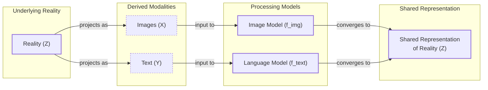
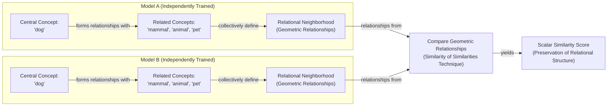
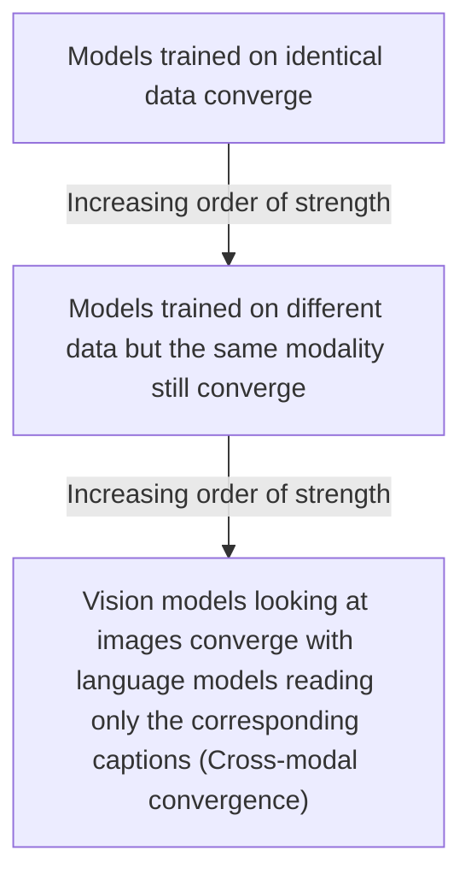

# The Platonic Representation Hypothesis: Are All AI Models Secretly Alike?

If you read a story about dogs, you might remember it the next time you see one bounding through a park. This is only possible because you have a unified concept of "dog" that is not tied to words or images alone. AI systems, however, are not always so lucky. They often learn from data of a single type—text for language models or images for computer vision systems. This raises a fundamental question: to what extent do language and vision models have a shared understanding of a "dog"?

Researchers investigate such questions by peering inside AI systems and studying how they represent scenes and sentences. They have found that different AI models can develop similar internal representations, even if they are trained on different datasets or entirely different data types [[1]](https://arxiv.org/abs/2405.07987). Furthermore, a few studies have suggested that these representations grow more similar as models become more capable [[2]](https://arxiv.org/abs/2106.07682). This idea, dubbed the Platonic representation hypothesis, has inspired a lively debate among researchers and a series of follow-up studies [[3]](https://arxiv.org/html/2507.01201v5), [[4]](https://arxiv.org/html/2505.11581v1), [[5]](https://arxiv.org/abs/2505.12540), [[6]](https://arxiv.org/html/2504.08775v1).

The hypothesis gets its name from Plato's 2,400-year-old allegory of the cave, in which prisoners trapped inside perceive the world only through shadows cast on a wall [[7]](https://en.wikipedia.org/wiki/Allegory_of_the_cave). In the AI adaptation of this metaphor, the real world outside the cave casts machine-readable shadows as streams of data. The AI models are the prisoners. The hypothesis claims that as these models grow more powerful, their internal interpretations of the shadows begin to converge on a shared "Platonic representation" of the world behind the data [[1]](https://arxiv.org/abs/2405.07987). The idea is not entirely new; it echoes concepts from the philosophy of science, such as Hilary Putnam's "convergent realism," which argues that scientific theories, over time, converge toward a true description of reality [[20]](https://www.jstor.org/stable/2219323).

Image 1: Conceptual diagram of the Platonic Representation Hypothesis, illustrating the derivation of modalities from reality and their convergence to a shared representation.

Not everyone is convinced. One of the main points of contention involves which representations to focus on. You cannot inspect a language model’s internal representation of every sentence or a vision model’s representation of every image. How do you decide which ones are representative? Where do you look for the representations, and how do you compare them across different models? It is unlikely that researchers will reach a consensus on the Platonic representation hypothesis anytime soon. Phillip Isola, a senior author of the paper proposing the hypothesis, is not bothered by this. "Half the community says this is obvious, and the other half says this is obviously wrong," he said. "We were happy with that response" [[8]](https://www.quantamagazine.org/distinct-ai-models-seem-to-converge-on-how-they-encode-reality-20260107).

Having framed the hypothesis and its philosophical roots, we will now look at the geometric mechanism that makes such comparisons possible by examining how representations are compared through the company their vectors keep.

## The Company Being Kept

If researchers do not agree on Plato, they might find common ground with his predecessor Pythagoras, whose philosophy supposedly started from the premise "All is number." This is an apt description of the neural networks that power AI models. Their representations of words or pictures are just long lists of numbers, each indicating the activation of a specific artificial neuron. Researchers typically focus on a single layer, writing down the neuron activations as a geometric object called a vector—an arrow pointing in a particular direction in an abstract space. Modern AI models have thousands of neurons per layer, so their representations are high-dimensional vectors that are impossible to visualize directly.

It does not make sense to directly compare activation vectors from separate networks, but researchers have devised indirect ways to assess representational similarity. Within a single AI model, similar inputs tend to have similar representations. In a language model, the vector for "dog" will be close to vectors for "pet" and "furry," and farther from "Platonic." This reflects a principle from the British linguist John Rupert Firth: "You shall know a word by the company it keeps." This idea is central to comparing different models. The meaning of any concept inside a model is defined by its relationships to all other concepts. We can compare models by asking whether "dog" sits in the same relational neighborhood relative to "mammal," "animal," and "pet" in both spaces.

This leads to the technique of measuring the "similarity of similarities." Instead of trying to rotate one model's embedding space into another, we compare the geometries of concept clusters. We can ask: how similar are the overall shapes of the two clusters? "It can kind of be described as measuring the similarity of similarities," said Ilia Sucholutsky, an AI researcher at New York University [[8]](https://www.quantamagazine.org/distinct-ai-models-seem-to-converge-on-how-they-encode-reality-20260107).

The authors of the hypothesis offer a specific theory for what this shared structure might be. In an idealized model, they show that representation learners converge to a kernel equivalent to the pointwise mutual information (PMI) between the underlying real-world concepts that generate the data. This suggests a simple principle: find an embedding where similarity equals the statistical co-occurrence of the concepts themselves, independent of the data modality [[21]](https://phillipi.github.io/prh).

Image 2: A conceptual diagram illustrating the "similarity of similarities" technique for comparing neural network representations across two independently trained models.

You would expect some similarity between the two models—the "cat" vector would probably be close to the "dog" vector in both, for instance. But the two clusters will not look exactly the same. Is "dog" more like "cat" than "wolf," or vice versa? If models were trained on different datasets or architectures, they might not agree. Researchers began exploring this in the mid-2010s and found that more powerful models seemed to have more similarities in their representations [[9]](https://arxiv.org/abs/1511.07543).

One 2021 paper dubbed this the "Anna Karenina scenario," a nod to the opening line of the novel: "All happy families are alike; each unhappy family is unhappy in its own way" [[2]](https://arxiv.org/abs/2106.07682). The idea is that all successful, high-performing AI models might be alike in their internal representations, while every unsuccessful model is unsuccessful in its own way. This paper, like much of the early work, focused only on computer vision. The rise of powerful language models presented an opportunity to see just how far representational similarity could go.

With these measurement tools in hand, we can now look at the hierarchy of experimental evidence showing that convergence strengthens as models scale.

## Convergent Evolution

The story of the Platonic representation hypothesis paper began in early 2023. ChatGPT had been released a few months before, and it was increasingly clear that simply scaling up AI models made them better at many tasks. But it was unclear why. "Everyone in AI research was going through an existential life crisis," said Minyoung Huh, an OpenAI researcher who was a graduate student in Isola’s lab at the time [[8]](https://www.quantamagazine.org/distinct-ai-models-seem-to-converge-on-how-they-encode-reality-20260107). He began meeting with Isola and their colleagues to discuss how scaling might affect internal representations.

When performance improves with scale, are models simply memorizing more dataset quirks, or are they getting better at approximating a true underlying world model? One proposed driver for this is the "Contravariance Principle": as models are trained to solve more tasks, the space of internal representations that can satisfy all constraints shrinks, forcing general-purpose models to converge on similar solutions [[21]](https://phillipi.github.io/prh). The team considered a hierarchy of evidence for convergence. If models trained on the same data learn similar representations, it is not necessarily because they are creating a more accurate likeness of the world; they could just be grasping quirks of the training data. However, if models trained on different datasets also converge, that would be more compelling evidence. Convergence between models that learned from entirely different data types, such as language and vision models, would provide even stronger evidence.

Image 3: A hierarchy diagram illustrating the increasing strength of evidence for representational convergence.

A year after their initial conversations, Isola and his colleagues wrote a paper reviewing the evidence and arguing for the Platonic representation hypothesis [[1]](https://arxiv.org/abs/2405.07987). By then, other researchers had found evidence of alignment between vision and language model representations [[10]](https://arxiv.org/abs/2209.15162), [[11]](https://arxiv.org/abs/2302.06555), [[12]](https://arxiv.org/abs/2401.05224). Huh conducted his own experiment using a dataset of captioned pictures from Wikipedia. He fed the pictures into vision models and the captions into language models, then compared the vector clusters. He observed a steady increase in representational similarity as models became more powerful, exactly as the hypothesis predicted [[8]](https://www.quantamagazine.org/distinct-ai-models-seem-to-converge-on-how-they-encode-reality-20260107).

After reviewing this evidence, we must also examine the experimental choices that can affect the validity and generalizability of these results.

## Find the Universals

Measurements of representational similarity involve a host of experimental choices that can affect the outcome. Which layers do you look at in each network? Which of the many available metrics do you use to compare the vector clusters [[13]](https://www.frontiersin.org/journals/systems-neuroscience/articles/10.3389/neuro.06.004.2008/full), [[14]](https://arxiv.org/abs/1905.00414), [[15]](https://arxiv.org/abs/2305.06329)? And which representations do you measure in the first place? "If you only test one dataset, you don’t necessarily know how [the result] generalizes," said Christopher Wolfram, a researcher who has studied these issues. "Who knows what would happen if you did some weirder dataset?" [[8]](https://www.quantamagazine.org/distinct-ai-models-seem-to-converge-on-how-they-encode-reality-20260107), [[16]](https://arxiv.org/html/2504.08775v1).

Isola acknowledged that the issue is far from settled. To him, cases where models exhibit convergence are more compelling than cases where they may not. "The endeavor of science is to find the universals," Isola said. "We could study the ways in which models are different or disagree, but that somehow has less explanatory power than identifying the commonalities" [[8]](https://www.quantamagazine.org/distinct-ai-models-seem-to-converge-on-how-they-encode-reality-20260107).

This search for universals is not unique to AI. In cognitive neuroscience, researchers are finding similar geometric alignments between the internal embeddings of language models and patterns of human brain activity recorded while processing language. This suggests that both artificial and biological neural networks may converge on common computational principles for representing meaning [[23]](https://arxiv.org/html/2411.05036v1).

Other researchers argue that it is more productive to focus on where models’ representations differ. Among them is Alexei Efros, a researcher at UC Berkeley. "I think they’re wrong, but that’s what science is about," Efros said. He noted that in the Wikipedia dataset Huh used, the images and text contained very similar information by design. But most data has features that resist translation. "There is a reason why you go to an art museum instead of just reading the catalog," he remarked [[8]](https://www.quantamagazine.org/distinct-ai-models-seem-to-converge-on-how-they-encode-reality-20260107). His point is echoed by findings on empirical failure modes, where convergence is limited by many-to-many relationships between modalities and features that are inherently specific to one data type, such as the meter of a poem or the texture in a photograph [[22]](https://akoepke.github.io/cave_umwelten).

Any sameness across models does not have to be perfect to be useful. Researchers have already used this property to translate internal representations of sentences from one language model to another [[5]](https://arxiv.org/abs/2505.12540). In robotics, agents can use shared embeddings to generalize from experience, manipulating novel objects based on natural language instructions without explicit programming for every new scenario [[23]](https://arxiv.org/html/2411.05036v1). These practical payoffs exist even with only partial alignment, enabling more efficient multimodal training and agentic systems that can route information across modalities without losing semantic fidelity [[18]](https://arxiv.org/html/2411.17040v1).

Despite these promising developments, other researchers think it is unlikely that any single theory will fully capture the behavior of modern AI models. "You can’t reduce a trillion-parameter system to simple explanations," said Jeff Clune, an AI researcher at the University of British Columbia. "The answers are going to be complicated" [[8]](https://www.quantamagazine.org/distinct-ai-models-seem-to-converge-on-how-they-encode-reality-20260107).

## References

- [1] Huh, M., Cheung, B., Wang, T., & Isola, P. (2024). *The Platonic Representation Hypothesis*. arXiv. https://arxiv.org/abs/2405.07987
- [2] Bansal, Y., Nakkiran, P., & Barak, B. (2021). *Revisiting Model Stitching to Compare Neural Representations*. arXiv. https://arxiv.org/abs/2106.07682
- [3] Yoon, L. H., Yue, Y., & Kim, B. (2025). *Escaping Plato’s Cave: JAM for Aligning Independently Trained Vision and Language Models*. arXiv. https://arxiv.org/html/2507.01201v5
- [4] Kumar, A., Nguyen, A., Clune, J., & Stanley, K. O. (2025). *Questioning Representational Optimism in Deep Learning: The Fractured Entangled Representation Hypothesis*. arXiv. https://arxiv.org/html/2505.11581v1
- [5] Jha, R., Zhang, C., Shmatikov, V., & Morris, J. X. (2025). *Harnessing the Universal Geometry of Embeddings*. arXiv. https://arxiv.org/abs/2505.12540
- [6] Wolfram, C., & Schein, A. (2025). *Layers at Similar Depths Generate Similar Activations Across LLM Architectures*. arXiv. https://arxiv.org/html/2504.08775v1
- [7] Wikipedia. *Allegory of the cave*. https://en.wikipedia.org/wiki/Allegory_of_the_cave
- [8] Brubaker, B. (2026). *Distinct AI Models Seem To Converge On How They Encode Reality*. Quanta Magazine. https://www.quantamagazine.org/distinct-ai-models-seem-to-converge-on-how-they-encode-reality-20260107
- [9] Lenc, K., & Vedaldi, A. (2015). *Understanding image representations by measuring their equivariance and equivalence*. arXiv. https://arxiv.org/abs/1511.07543
- [10] Merullo, J., Liu, T., Ridder, D., Zellers, R., & Kembhavi, A. (2022). *Linearly Mapping from Image to Text Space*. arXiv. https://arxiv.org/abs/2209.15162
- [11] Gurnee, W., & Tegmark, M. (2023). *Language Models Represent Space and Time*. arXiv. https://arxiv.org/abs/2302.06555
- [12] Li, J., Li, D., Savarese, S., & Hoi, S. (2024). *Vision-Language Pre-training with Frozen LLMs*. arXiv. https://arxiv.org/abs/2401.05224
- [13] Kriegeskorte, N., Mur, M., & Bandettini, P. (2008). *Representational similarity analysis - connecting the branches of systems neuroscience*. Frontiers in Systems Neuroscience. https://www.frontiersin.org/journals/systems-neuroscience/articles/10.3389/neuro.06.004.2008/full
- [14] Kornblith, S., Norouzi, M., Lee, H., & Hinton, G. (2019). *Similarity of Neural Network Representations Revisited*. arXiv. https://arxiv.org/abs/1905.00414
- [15] Klabunde, J. A., Williams, A. H., & Conwell, C. (2023). *A framework for comparing neural network representations*. arXiv. https://arxiv.org/abs/2305.06329
- [16] Wolfram, C., & Schein, A. (2025). *Layers at Similar Depths Generate Similar Activations Across LLM Architectures*. arXiv. https://arxiv.org/html/2504.08775v1
- [17] Gupta, S., Sundaram, S., Wang, C., Jegelka, S., & Isola, P. (2025). *Better Together: Leveraging Unpaired Multimodal Data for Stronger Unimodal Models*. arXiv. https://arxiv.org/abs/2510.08492
- [18] Chen, W., Liu, Z., Liu, S., & Liu, Z. (2024). *A Comprehensive Survey on Multimodal Alignment and Fusion*. arXiv. https://arxiv.org/html/2411.17040v1
- [19] EmergentMind. *Multimodal Alignment*. https://www.emergentmind.com/topics/multimodal-alignment
- [20] Putnam, H. (1982). *Three Kinds of Scientific Realism*. The Philosophical Quarterly. https://www.jstor.org/stable/2219323
- [21] Isola, P., et al. *The Platonic Representation Hypothesis*. https://phillipi.github.io/prh
- [22] Koepke, A. *Plato’s Cave and Machine Umwelten*. https://akoepke.github.io/cave_umwelten
- [23] Zhang, C., et al. (2024). *From Word Vectors to Multimodal Embeddings: Techniques, Applications, and Future Directions For Large Language Models*. arXiv. https://arxiv.org/html/2411.05036v1