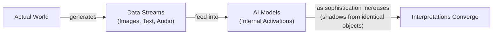
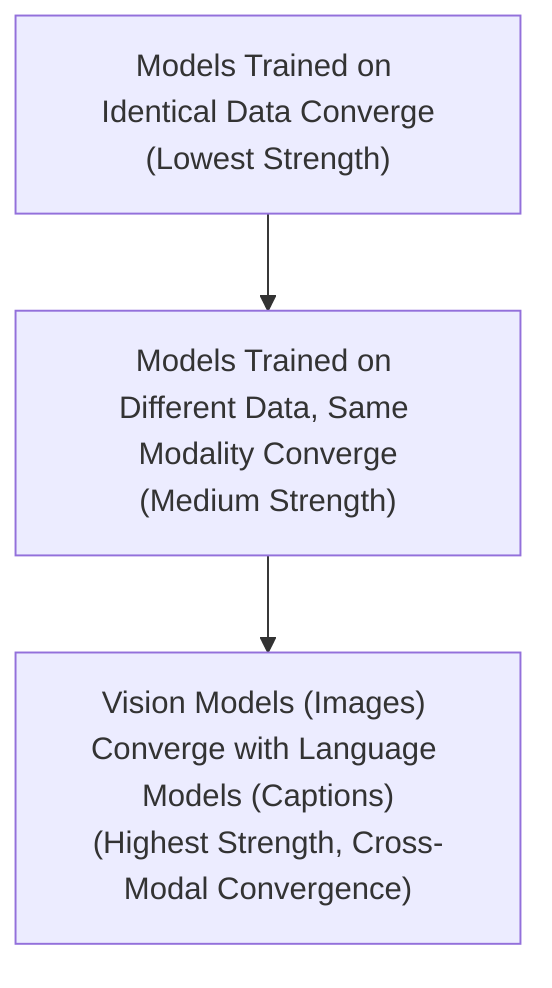

# The Platonic Representation Hypothesis: Are All AI Models Learning the Same Reality?

Read a story about dogs, and you may remember it the next time you see one bounding through a park. This is possible because you have a unified concept of "dog" that is not tied to words or images alone. Bulldog or border collie, barking or getting its belly rubbed, a dog can be many things while still remaining a dog.

AI systems are not always so lucky. These systems often learn from data of a single type—text for language models, images for computer vision systems. To what extent, then, do language and vision models have a shared understanding of a dog?

Researchers investigate such questions by peering inside AI systems and studying how they represent scenes and sentences. They have found that different AI models can develop similar internal representations, even if they are trained on different datasets or entirely different data types. Furthermore, a few studies have suggested that these representations grow more similar as models become more capable [[1]]. This idea, dubbed the Platonic representation hypothesis, has inspired a lively debate among researchers and a number of follow-up studies [[2]].

The hypothesis gets its name from a 2,400-year-old allegory by the Greek philosopher Plato. In his "Allegory of the Cave," prisoners trapped inside a cave perceive the world only through shadows cast by outside objects on a wall. Plato maintained that we are all like those prisoners, and the objects we encounter are pale shadows of ideal "forms" that exist beyond our senses.

The Platonic representation hypothesis adapts this for AI. The real world outside the cave casts machine-readable shadows as streams of data. AI models are the prisoners. The hypothesis claims that very different models, exposed only to these data streams, are beginning to converge on a shared "Platonic representation" of the world behind the data.

Image 1: A conceptual diagram illustrating Plato's Cave Allegory adapted for AI, showing the flow from the Actual World to AI model interpretations.

Phillip Isola, a senior author of the paper proposing the hypothesis, explains the core idea: "Why do the language model and the vision model align? Because they’re both shadows of the same world" [[3]].

Not everyone is convinced. One of the main points of contention involves which representations to focus on. You cannot inspect a language model’s internal representation of every sentence or a vision model’s representation of every image. How do you decide which ones are representative? Where do you look for the representations, and how do you compare them across different models? It is unlikely that researchers will reach a consensus on the Platonic representation hypothesis anytime soon.

"Half the community says this is obvious, and the other half says this is obviously wrong," Isola said. "We were happy with that response" [[3]].

Having framed the hypothesis and its philosophical roots, we will now explore the geometric mechanism that makes such comparisons possible by examining how representations are compared through the company their vectors keep.

## The Company Being Kept

If researchers do not agree on Plato, they might find more common ground with his predecessor Pythagoras, whose philosophy supposedly started from the premise "All is number." That is an apt description of the neural networks that power AI models. Their representations of words or pictures are just long lists of numbers, each indicating the activation of a specific artificial neuron.

This quest for a universal representational language has deep roots. In the 17th century, the philosopher Gottfried Wilhelm von Leibniz envisioned an "alphabet of human thought"—a system where all concepts could be broken down into elementary parts, each assigned a unique number, allowing all questions to be answered by calculation [[14]](https://web.eecs.utk.edu/~bmaclenn/papers/HistoryAIBeforeComputers.pdf).

Researchers typically focus on a single layer of a neural network, taking a snapshot of its activity. They write down the neuron activations in this layer as a geometric object called a vector—an arrow pointing in a particular direction in an abstract space. Modern AI models have thousands of neurons in each layer, so their representations are high-dimensional vectors that are impossible to visualize directly. This makes it easy to compare a network’s representations: two are similar if their vectors point in similar directions.

Within a single model, similar inputs tend to have similar representations. In a language model, the vector for "dog" will be relatively close to vectors for "pet," "bark," and "furry," and farther from "Platonic" and "molasses." This is a geometric interpretation of an idea from the British linguist John Rupert Firth: "You shall know a word by the company it keeps."

What about representations in different models? It does not make sense to directly compare activation vectors from separate networks, but researchers have devised indirect ways to assess representational similarity. One popular approach is to embrace Firth's lesson and measure whether two models’ representations of an input keep the same company. Imagine you want to compare how two language models represent words for animals. First, you compile a list of words—dog, cat, wolf, jellyfish, and so on. You then feed these words into both networks and record their representations. In each network, the representations will form a cluster of vectors. You can then ask: how similar are the overall shapes of the two clusters?

"It can kind of be described as measuring the similarity of similarities," said Ilia Sucholutsky, an AI researcher at New York University [[4]].

This approach is part of a family of geometric models for similarity. One such framework, the contrast model, formalizes similarity as a combination of the measures of common and distinctive features between objects [[15]](https://cogsci.ucsd.edu/~coulson/203/tvgati.pdf). The goal is to see if the metric distances between concepts reflect the observed similarities in both models.

In this example, you would expect some similarity. The "cat" vector would probably be close to the "dog" vector in both networks, and the "jellyfish" vector would point in a different direction. But the clusters probably will not look exactly the same. Is "dog" more like "cat" than "wolf," or vice versa? If your models were trained on different datasets or built on different network architectures, they might not agree.

Researchers began exploring representational similarity with this approach in the mid-2010s. They found that different models’ representations of the same concepts were often similar, though far from identical. Intriguingly, a few studies found that more powerful models seemed to have more similarities in their representations than weaker ones.

What would stop a billion-parameter model from learning an overly complicated and unique representation? One potential answer is a phenomenon known as simplicity bias. Deep networks, even without explicit instruction, naturally adhere to Occam’s razor, favoring the simplest solutions that fit the data. As models grow larger, this bias may strengthen, driving them toward a shared, smaller solution space [[16]](https://arxiv.org/html/2405.07987v1).

One 2021 paper dubbed this the "Anna Karenina scenario," a nod to the opening line of the novel [[2]]. Perhaps successful AI models are all alike, and every unsuccessful model is unsuccessful in its own way.

That paper, like much of the early work on representational similarity, focused only on computer vision. The advent of powerful language models was about to change that. For Isola, it was also an opportunity to see just how far representational similarity could go. With these measurement tools in hand, we can now look at the hierarchy of experimental evidence showing that convergence strengthens as models scale.

## Convergent Evolution

The story of the Platonic representation hypothesis paper began in early 2023. ChatGPT had been released a few months before, and it was clear that simply scaling up AI models made them better at many tasks. But it was unclear why.

"Everyone in AI research was going through an existential life crisis," said Minyoung Huh, an OpenAI researcher who was a graduate student in Isola’s lab at the time [[5]]. He began meeting regularly with Isola and their colleagues Brian Cheung and Tongzhou Wang to discuss how scaling might affect internal representations.

This phenomenon is captured by neural scaling laws, which show that an AI model’s error rate often decreases predictably as its size, dataset, or computation time increases [[17]](https://kempnerinstitute.harvard.edu/news/the-power-of-scale-in-machine-learning). When performance improves with scale, are models simply memorizing more dataset quirks, or are they getting better at approximating a true underlying world model? The team identified a hierarchy of evidence that could support the latter.

Image 2: A hierarchical diagram illustrating the increasing strength of evidence for the Platonic representation hypothesis.

If models trained on the same data converge, that is weak evidence; they could just be grasping the same dataset quirks. If models trained on different datasets of the same type (e.g., two different image datasets) converge, that is more compelling. A fourth line of evidence comes from biology, where neural networks show substantial alignment with representations in the brain. This suggests that both artificial and biological systems, when faced with similar data and tasks, may converge on similar solutions [[18]](https://3dvar.com/Huh2024The.pdf). The strongest evidence would be convergence between models trained on entirely different data types, such as language and vision models.

A year after their initial conversations, Isola and his colleagues wrote a paper reviewing the evidence and arguing for the Platonic representation hypothesis [[1]]. By then, other researchers had also found evidence of alignment between vision and language models [[6], [7], [8]]. Huh conducted his own experiment, testing five vision models and 11 language models of varying sizes on a dataset of captioned pictures from Wikipedia. He would feed the pictures into the vision models and the captions into the language models, then compare the vector clusters. He observed a steady increase in representational similarity as models became more powerful, exactly what the hypothesis predicted.

After reviewing the evidence for convergence, we must examine a host of experimental choices with respect to the measurements of representational similarity that may affect the validity and generalizability of the result.

## Find the Universals

Measurements of representational similarity involve a host of experimental choices that can affect the outcome. Which layers do you look at in each network? Which of the many similarity metrics do you use? And which representations do you measure in the first place?

To address these issues, newer metrics like topological representation alignment are being developed, which focus on preserving local neighborhood geometry across models rather than seeking a global match [[19]](https://arxiv.org/html/2502.18710v3).

"If you only test one dataset, you don’t necessarily know how [the result] generalizes," said Christopher Wolfram, a researcher at the University of Chicago. "Who knows what would happen if you did some weirder dataset?" [[9]].

This has led to two complementary scientific attitudes. One, associated with Isola, actively seeks the universals that models appear to share. "The endeavor of science is to find the universals," he said. "We could study the ways in which models are different or disagree, but that somehow has less explanatory power than identifying the commonalities" [[3]].

Other researchers argue that it is more productive to focus on where models’ representations differ. Among them is Alexei Efros, a researcher at the University of California, Berkeley. "They’re all good friends and they’re all very, very smart people," Efros said. "I think they’re wrong, but that’s what science is about" [[10]]. He noted that in the Wikipedia dataset Huh used, the images and text contained very similar information by design. But most data we encounter has features that resist translation. "There is a reason why you go to an art museum instead of just reading the catalog," he said [[10]].

This is a known challenge where information channels do not overlap; for example, a medical model might miss diagnostic clues in an image that have no direct correlate in genomic data, limiting convergence [[20]](https://pmc.ncbi.nlm.nih.gov/articles/PMC11926988).

Any intrinsic sameness across models does not have to be perfect to be useful. Even with only partial alignment, there are immediate practical payoffs. Last summer, researchers used this emerging property to translate internal representations of sentences from one language model to another [[11]]. If language and vision model representations are to some extent interchangeable, that could lead to new ways to train models that learn from both data types [[12]]. This enables more reliable multimodal reasoning and transfer learning, instead of treating every new model as an isolated black box.

Still, open questions remain around ensuring robust, explainable behavior as these systems scale [[21]](https://www.mdpi.com/1424-8220/26/8/2330). Despite these promising developments, some think it is unlikely that any single theory will fully capture the behavior of modern AI models. "You can’t reduce a trillion-parameter system to simple explanations," said Jeff Clune, an AI researcher at the University of British Columbia. "The answers are going to be complicated" [[13]]. While the Platonic hypothesis offers a clean philosophical story, real models contain so many interacting parts that full convergence may coexist with vast regions of model-specific idiosyncrasy.

## References

- [1]  https://phillipi.github.io/prh
- [2]  https://arxiv.org/abs/2106.07682
- [3]  https://www.quantamagazine.org/distinct-ai-models-seem-to-converge-on-how-they-encode-reality-20260107
- [4]  https://www.quantamagazine.org/distinct-ai-models-seem-to-converge-on-how-they-encode-reality-20260107
- [5]  https://www.quantamagazine.org/distinct-ai-models-seem-to-converge-on-how-they-encode-reality-20260107
- [6]  https://arxiv.org/abs/2209.15162
- [7]  https://arxiv.org/abs/2302.06555
- [8]  https://arxiv.org/abs/2401.05224
- [9]  https://www.quantamagazine.org/distinct-ai-models-seem-to-converge-on-how-they-encode-reality-20260107
- [10]  https://www.quantamagazine.org/distinct-ai-models-seem-to-converge-on-how-they-encode-reality-20260107
- [11]  http://arxiv.org/abs/2505.12540
- [12]  https://arxiv.org/abs/2510.08492
- [13]  https://www.quantamagazine.org/distinct-ai-models-seem-to-converge-on-how-they-encode-reality-20260107
- [14]  https://web.eecs.utk.edu/~bmaclenn/papers/HistoryAIBeforeComputers.pdf
- [15]  https://cogsci.ucsd.edu/~coulson/203/tvgati.pdf
- [16]  https://arxiv.org/html/2405.07987v1
- [17]  https://kempnerinstitute.harvard.edu/news/the-power-of-scale-in-machine-learning
- [18]  https://3dvar.com/Huh2024The.pdf
- [19]  https://arxiv.org/html/2502.18710v3
- [20]  https://pmc.ncbi.nlm.nih.gov/articles/PMC11926988
- [21]  https://www.mdpi.com/1424-8220/26/8/2330
</article>