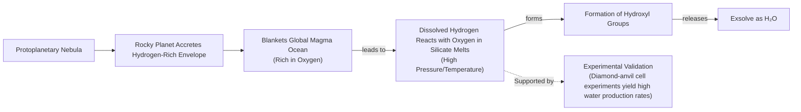

# Where Did Earth's Water Come From? The Three-Way Scientific Debate

At this moment, a spacecraft is headed from Earth to Europa, an ice-veiled moon of Jupiter thought to contain a vast subsurface ocean. Affixed to the craft is a metal plate engraved with a poem by Ada Limón, commissioned by NASA for the Europa Clipper mission. It reads, in part: "*And it is not darkness that unites us, not the cold distance of space, but the offering of water, each drop of rain, each rivulet, each pulse, each vein*" [[32]](https://poets.org/poem/praise-mystery-poem-europa). For decades, the search for water has driven our exploration of the solar system, because as far as we know, water is essential for life.

It may come as a surprise, then, that scientists do not have a definitive answer for how water first arrived here on Earth. Despite decades of spacecraft flybys, sample-return missions, and precise laboratory analysis, the origin of our planet’s oceans remains one of the most compelling unsolved mysteries in planetary science. You might assume the question was settled long ago, but the scientific consensus has shifted multiple times.

For years, the leading theory was that comets—icy relics from the dawn of the solar system—delivered water to a primeval Earth. This idea faced serious challenges when spacecraft measurements revealed that cometary water did not chemically match our own. After that, "comets sort of fell out of favor," said Ashley King, a meteoriticist at the Natural History Museum in London [[1]](https://www.quantamagazine.org/where-did-earth-get-its-oceans-maybe-it-made-them-itself-20260612). Asteroids, rockier bodies that impact Earth more frequently, became the new frontrunner, as water found in certain meteorites was a near-perfect match. However, the asteroid theory has its own problems, failing to explain the mix of other volatile elements on our planet [[1]](https://www.quantamagazine.org/where-did-earth-get-its-oceans-maybe-it-made-them-itself-20260612). This has opened the door for a radical new idea: Earth may have made most of its water all by itself.

The historical cometary model first dominated scientific thought, but isotopic data forced a reconsideration, bringing forward both asteroidal alternatives and the possibility that Earth generated its water internally. To understand the current state of this debate, we need to examine the evidence from each mission and meteorite that has shaped our view.

## A Showdown Between Comets and Asteroids

The central problem is straightforward. Earth formed about 4.54 billion years ago, and while much about its earliest eon has been lost to time, the basics are agreed upon: it began as a ball of mostly molten rock before becoming the blue marble we know today. How did this transformation happen [[1]](https://www.quantamagazine.org/where-did-earth-get-its-oceans-maybe-it-made-them-itself-20260612)?

Comets were the early frontrunner. These objects formed in the cold outer reaches of the solar system, in the Kuiper Belt beyond Neptune or the more distant Oort cloud, where water ice could remain stable. Composed of frozen gases and ice, they were seen as efficient water delivery vehicles. Compared to drier, rock-dominated asteroids, comets give you "a lot of bang for your buck," said James Bryson, a meteoriticist at the University of Oxford [[1]](https://www.quantamagazine.org/where-did-earth-get-its-oceans-maybe-it-made-them-itself-20260612). But to prove this theory, scientists needed to compare the chemical signature of cometary water to our own.

The decisive diagnostic is the ratio of deuterium to hydrogen (D/H). Deuterium is a heavier form of hydrogen, and its proportion in water acts as a chemical fingerprint, revealing where in the solar system the water originated. In 1986, the European Space Agency's (ESA) Giotto mission made the first deep-space flyby of Halley's comet, sending back dramatic images and crucial measurements. The results were a surprise. The D/H ratio on Halley's comet was about twice that of Earth's oceans. "It didn’t match at all," said Karen Meech, a planetary astronomer at the University of Hawai‘i [[1]](https://www.quantamagazine.org/where-did-earth-get-its-oceans-maybe-it-made-them-itself-20260612), [[22]](https://research.hawaii.edu/noelo/water-and-habitability).

https://www.quantamagazine.org/wp-content/uploads/2026/06/Giotto_launch_preparations-cr.ESA_.webp
Image 1: ESA’s Giotto spacecraft (top) took the first close-up images of a cometary nucleus (bottom) as part of its mission to Halley’s comet. (Source: ESA; Courtesy of Dr. H.U. Keller [[1]](https://www.quantamagazine.org/where-did-earth-get-its-oceans-maybe-it-made-them-itself-20260612))

https://www.quantamagazine.org/wp-content/uploads/2026/06/Giotto_images_of_Comet_Halley-cr.MPAE-courtesy-Dr.-H.U.-Keller.webp

Over the next two decades, spectroscopic observations of other comets, like Hale-Bopp, also found elevated levels of heavy water [[1]](https://www.quantamagazine.org/where-did-earth-get-its-oceans-maybe-it-made-them-itself-20260612). The final blow to the comet-only theory came from Giotto's successor, ESA's Rosetta mission. In 2014, Rosetta began orbiting comet 67P/Churyumov-Gerasimenko, making the most precise measurements of a comet's composition to date. It found that 67P had a D/H ratio more than three times greater than Earth's seawater, the highest concentration of deuterium measured in any comet [[1]](https://www.quantamagazine.org/where-did-earth-get-its-oceans-maybe-it-made-them-itself-20260612), [[37]](https://www.esa.int/Science_Exploration/Space_Science/Rosetta/Rosetta_fuels_debate_on_origin_of_Earth_s_oceans). This effectively ruled out comets from the Oort cloud as the primary source of our planet's oceans.

With comets sidelined, attention turned to asteroids. These rocky objects, mostly found between Mars and Jupiter, impact our planet far more often than comets, arriving as meteorites. Scientists have collected thousands of them, and a particular group known as carbonaceous chondrites contains water molecules that closely resemble our own. In 2021, a meteorite plunged into the British town of Winchcombe, landing on a family's driveway. Analysis of this pristine sample revealed a D/H ratio that almost perfectly matched Earth's oceans [[1]](https://www.quantamagazine.org/where-did-earth-get-its-oceans-maybe-it-made-them-itself-20260612), [[38]](https://www.science.org/doi/10.1126/sciadv.abq3925).

https://www.quantamagazine.org/wp-content/uploads/2024/11/TheComet_crChristianStangl-Lede-2-scaled.webp
Image 2: Comet 67P/Churyumov-Gerasimenko was photographed in 2014 by ESA’s Rosetta mission, which also sent a lander to the comet’s surface. (Source: ESA/ Christian Stangl [[1]](https://www.quantamagazine.org/where-did-earth-get-its-oceans-maybe-it-made-them-itself-20260612))

However, meteorites can be contaminated during their fiery descent through the atmosphere. To get around this, spacecraft have flown to asteroids to collect material directly. In 2023, analysis of samples from the asteroid Ryugu, returned by Japan's Hayabusa2 mission, confirmed that its water also had a D/H ratio similar to Earth's [[1]](https://www.quantamagazine.org/where-did-earth-get-its-oceans-maybe-it-made-them-itself-20260612), [[39]](https://iopscience.iop.org/article/10.3847/2041-8213/acc393). These findings made asteroids the most likely candidate for delivering water to Earth.

But the asteroid-only model is not without its flaws. While the water matches, other volatile elements do not. Asteroids contain small amounts of noble gases like argon, krypton, and xenon, and their isotopic mixtures do not correspond to what we find in Earth's atmosphere [[1]](https://www.quantamagazine.org/where-did-earth-get-its-oceans-maybe-it-made-them-itself-20260612), [[40]](https://link.springer.com/article/10.1007/s11214-022-00929-9). Furthermore, both the comet and asteroid theories rely on a period of intense bombardment late in Earth's formation to deliver the water, a scenario that is still heavily debated. The quantitative contradictions in both models have led scientists to consider a radical alternative: what if Earth did not need water to be delivered at all?

https://www.quantamagazine.org/wp-content/uploads/2026/06/arrival-bennu-full-rotation-cr.NASAs-Goddard-Space-Flight-Center_University-Of-Arizona-still.jpg
Image 3: The asteroid Ryugu, visited by the Hayabusa2 spacecraft in 2018, contained water similar to the most common kind found on Earth. (Source: NASA’s Goddard Space Flight Center/University of Arizona [[1]](https://www.quantamagazine.org/where-did-earth-get-its-oceans-maybe-it-made-them-itself-20260612))

The ongoing debate between exogenous delivery models leaves unresolved tensions in both isotopic and dynamical constraints. This has pushed researchers to reexamine the very building blocks of our planet, previously assumed to be dry, to see if they could have provided an early, internal source of water.

## Hydrogen, Meet Magma

When astronomers simulate the formation of exoplanets, they find that many rocky worlds likely started their lives with thick, hydrogen-rich atmospheres. Could the early Earth have been similar [[1]](https://www.quantamagazine.org/where-did-earth-get-its-oceans-maybe-it-made-them-itself-20260612)?

This idea gained traction with a reevaluation of meteorites called enstatite chondrites. These meteorites are considered the closest chemical match to Earth's building blocks [[41]](https://www.science.org/doi/10.1126/science.aba1948). For a long time, they were thought to be completely dry, supporting the idea that Earth must have received its water from an external source. However, recent studies found that there was hydrogen in these meteorites all along, hidden within their organic molecules and silicate glasses [[1]](https://www.quantamagazine.org/where-did-earth-get-its-oceans-maybe-it-made-them-itself-20260612), [[42]](https://www.sciencedirect.com/science/article/pii/S0019103525001356). This discovery suggested that the raw materials of our planet may have contained far more hydrogen than previously thought.

At the same time, studies of exoplanets have shown that rocky planets commonly form with hydrogen-rich envelopes accreted from the protoplanetary nebula [[7]](https://www.nature.com/articles/s41586-023-05823-0). If early Earth also had such an atmosphere, it would have blanketed a global magma ocean rich in oxygen. This set the stage for a powerful chemical reaction. Under the extreme pressures and temperatures at the base of a magma ocean, hydrogen from the atmosphere could dissolve into the molten rock and react with oxygen atoms in the silicate melts. This process would form hydroxyl groups, which could then combine to form water (H₂O) [[7]](https://www.nature.com/articles/s41586-023-05823-0), [[43]](https://doi.org/10.1038/s41586-025-09630-7). This endogenous pathway bypasses the need for external delivery from comets or asteroids.

Image 4: Flowchart illustrating the endogenous water production model for rocky planets.

This theory remained speculative until recent laboratory breakthroughs provided strong supporting evidence. Scientists used diamond-anvil cells to compress hydrogen and rock samples to pressures of tens of gigapascals, while laser-heating them to thousands of degrees Kelvin, replicating the conditions at the base of a magma ocean. The results were dramatic. The reaction between high-pressure hydrogen and molten rock was so efficient that it produced far more water than predicted—up to 1,000 times more than models based on low-pressure extrapolations had suggested [[11]](https://arxiv.org/pdf/2511.01351), [[12]](https://faculty.epss.ucla.edu/~eyoung/reprints/Miozzi_etal_2025.pdf), [[43]](https://doi.org/10.1038/s41586-025-09630-7). "It doesn’t seem unreasonable [that you could] produce a huge amount of water quite quickly," said Paul Byrne, a planetary scientist at Washington University in St. Louis. "And this is all homegrown, indigenous water" [[1]](https://www.quantamagazine.org/where-did-earth-get-its-oceans-maybe-it-made-them-itself-20260612).

But does this mean Earth created its own oceans? The experiments were designed to model sub-Neptunes, exoplanets larger than Earth that are better at holding onto their light, hydrogen-rich atmospheres. "The paper doesn’t make strong claims about Earth," said one of the researchers, but the link is a valid one to make [[1]](https://www.quantamagazine.org/where-did-earth-get-its-oceans-maybe-it-made-them-itself-20260612). Other scientists are more cautious. "I’d say it’s certainly possible that some water could be generated by reaction with hydrogen early on," said Quentin Williams, an experimental geophysicist at the University of California, Santa Cruz. "How much might be generated is, however, pretty enigmatic" [[1]](https://www.quantamagazine.org/where-did-earth-get-its-oceans-maybe-it-made-them-itself-20260612).

The main issue is whether a planet of Earth's mass could have retained enough hydrogen in its early atmosphere to create the pressure needed for the reaction to occur at scale. Some scientists are doubtful. "I’m a little bit doubtful whether you can have this for an Earth-mass planet," said Anders Johansen, an astrophysicist at the University of Copenhagen [[1]](https://www.quantamagazine.org/where-did-earth-get-its-oceans-maybe-it-made-them-itself-20260612). However, the experiments suggest the reaction is so efficient that it might not need to last long. Earth may have been a water factory for only a brief period, but that moment could have been enough to forge its oceans [[1]](https://www.quantamagazine.org/where-did-earth-get-its-oceans-maybe-it-made-them-itself-20260612).

If this is the case, the implications are profound. It suggests that countless rocky planets across the galaxy could meet a necessary condition for hosting life because, as Byrne said, they "are born water-rich" [[1]](https://www.quantamagazine.org/where-did-earth-get-its-oceans-maybe-it-made-them-itself-20260612). This internal mechanism relaxes the need for a "lucky" late delivery of water, potentially expanding the number of habitable worlds. While the endogenous model provides a powerful new perspective, it does not necessarily exclude all external contributions. The final picture is likely a blend of sources, a possibility we will explore next.

## Drowning in a Sea of Possibilities

While the endogenous production model offers a compelling alternative, it does not close the book on external delivery. In fact, just as the homegrown water theory was gaining steam, new evidence began to rehabilitate comets as a potential, if partial, source.

By the time Rosetta reached comet 67P in 2014, scientists had studied the water of 11 other comets, and all but one had D/H ratios unlike Earth's. The exception was Hartley 2. In 2011, ESA's Herschel Space Observatory found that the water in this Jupiter-family comet had a much more Earth-like signature [[2]](https://sci.esa.int/web/herschel/-/49386-herschel-finds-first-evidence-of-earth-like-water-in-a-comet), [[5]](https://www.jpl.nasa.gov/images/pia14737-heavy-and-light-just-right), [[6]](https://herscheltelescope.org.uk/results/comet-hartley-2-and-the-oceans-of-earth). This observation initially seemed anomalous. However, a 2024 reanalysis of Rosetta's data from comet 67P suggested that its high D/H measurements might have been skewed by dust in the comet's coma; the icy body itself could have been more Earth-like [[1]](https://www.quantamagazine.org/where-did-earth-get-its-oceans-maybe-it-made-them-itself-20260612), [[44]](https://www.science.org/doi/10.1126/sciadv.adp2191). Then, in 2025, observations of comet 12P/Pons-Brooks also detected an Earth-like D/H ratio [[1]](https://www.quantamagazine.org/where-did-earth-get-its-oceans-maybe-it-made-them-itself-20260612).

https://www.quantamagazine.org/wp-content/uploads/2026/06/Comet-Hartley-2-cr-NASA-JPL-Caltech-UMD-still-1.jpg
Image 5: Comet Hartley 2, studied by the Herschel Space Observatory, has an Earth-like ratio of heavy to normal water. (Source: NASA/JPL-Caltech/UMD [[1]](https://www.quantamagazine.org/where-did-earth-get-its-oceans-maybe-it-made-them-itself-20260612))

So, was it comets all along? Or asteroids? Or did Earth turn on the taps itself? "I suspect it was a combination of all of them," Meech said [[1]](https://www.quantamagazine.org/where-did-earth-get-its-oceans-maybe-it-made-them-itself-20260612). The most plausible scenario is a mixed-source model where Earth's water is a cocktail from multiple origins: a majority from asteroids, a smaller fraction from certain comets, and a foundational amount produced endogenously.

This picture is further complicated by the fact that Earth is not a static museum. Over billions of years, geological processes like mantle convection, atmospheric escape, and biological activity have all had the potential to alter the original isotopic signatures [[27]](https://www.aaas.org/membership/member-spotlight/where-did-earths-water-come-aaas-fellow-karen-meech-investigates). These processes act as filters, tweaking and erasing parts of the forensic record. "We may never know," Meech concluded [[1]](https://www.quantamagazine.org/where-did-earth-get-its-oceans-maybe-it-made-them-itself-20260612).

This ambiguity draws a compelling parallel to the study of the origin of life. Just as deeper knowledge of prebiotic chemistry has replaced a single "warm little pond" with a network of possible pathways, our understanding of water's origins is evolving from a simple answer to a richer, more complex story. "It’s like asking, what’s the origin of life?" Meech said. "The more you learn, the less you know—but the story becomes richer and more exciting" [[1]](https://www.quantamagazine.org/where-did-earth-get-its-oceans-maybe-it-made-them-itself-20260612). This complexity is scientifically productive, generating new questions and testable predictions for the next generation of missions and laboratory experiments.

## Conclusion

We have journeyed through a scientific debate spanning decades, from the icy hearts of comets to the fiery depths of magma oceans. The search for the origin of Earth's water has led us from a simple delivery model to a complex, multi-source narrative involving comets, asteroids, and the planet's own geological alchemy. Each new mission and experiment adds another layer to this rich and evolving story.

This exploration highlights a fundamental aspect of scientific progress. As our tools become more powerful and our understanding deepens, simple certainties often give way to nuanced possibilities. The question is no longer "which one?" but "how much of each?" This shift from a single answer to a dynamic interplay of processes is what makes planetary science, and the search for our own origins, so compelling.

## References

- [1] https://www.quantamagazine.org/where-did-earth-get-its-oceans-maybe-it-made-them-itself-20260612
- [2] https://sci.esa.int/web/herschel/-/49386-herschel-finds-first-evidence-of-earth-like-water-in-a-comet
- [3] https://sci.esa.int/web/herschel/-/49378-the-deuterium-to-hydrogen-ratio-in-the-solar-system
- [4] https://www.aanda.org/articles/aa/abs/2012/08/aa19744-12/aa19744-12.html
- [5] https://www.jpl.nasa.gov/images/pia14737-heavy-and-light-just-right
- [6] https://herscheltelescope.org.uk/results/comet-hartley-2-and-the-oceans-of-earth
- [7] https://www.nature.com/articles/s41586-023-05823-0
- [8] https://arxiv.org/abs/2304.07845
- [9] https://astrobiology.com/2023/04/how-did-earth-get-its-water.html
- [10] https://www.researchgate.net/publication/370070865_Earth_shaped_by_primordial_H_2_atmospheres
- [11] https://arxiv.org/pdf/2511.01351
- [12] https://faculty.epss.ucla.edu/~eyoung/reprints/Miozzi_etal_2025.pdf
- [13] https://www.nature.com/articles/s41586-025-09630-7
- [14] https://www.earth.ox.ac.uk/article/earth-sciences-conversation-james-bryson
- [15] https://doi.org/10.1038/s41586-025-09816-z
- [16] https://www.mpg.de/20541783/water-discovered-in-rocky-planet-forming-zone-offers-clues-on-habitability
- [17] https://news.mit.edu/2025/planets-without-water-could-still-produce-certain-liquids-0811
- [18] https://pmc.ncbi.nlm.nih.gov/articles/PMC12783251
- [19] https://www.nasa.gov/missions/kepler/about-half-of-sun-like-stars-could-host-rocky-potentially-habitable-planets
- [20] https://eos.org/editors-vox/terrestrial-planets-guide-our-search-for-habitable-exoplanets
- [21] https://www.aaas.org/membership/member-spotlight/where-did-earths-water-come-aaas-fellow-karen-meech-investigates
- [22] https://research.hawaii.edu/noelo/water-and-habitability
- [23] https://www.science.org/doi/10.1126/sciadv.adp2191
- [24] https://www.science.org/doi/10.1126/sciadv.abq3925
- [25] https://iopscience.iop.org/article/10.3847/2041-8213/acc393
- [26] https://www.earth.ox.ac.uk/article/earth-sciences-conversation-james-bryson
- [27] https://www.aaas.org/membership/member-spotlight/where-did-earths-water-come-aaas-fellow-karen-meech-investigates
- [28] https://www.science.org/doi/10.1126/science.aba1948
- [29] https://www.sciencedirect.com/science/article/pii/S0019103525001356
- [30] https://link.springer.com/article/10.1007/s11214-022-00929-9
- [31] https://www.esa.int/Science_Exploration/Space_Science/Rosetta/Rosetta_fuels_debate_on_origin_of_Earth_s_oceans
- [32] https://poets.org/poem/praise-mystery-poem-europa
- [33] https://www.youtube.com/watch?v=EgWbeDNPD6o
- [34] https://www.slowdownshow.org/story/2023/08/25/full-version-in-praise-of-mystery-a-poem-for-europa
- [35] https://www.loc.gov/programs/poetry-and-literature/poet-laureate/poet-laureate-projects/a-poem-for-europa
- [36] https://www.bookpage.com/reviews/in-praise-of-mystery-ada-limon-book-review
- [37] https://www.esa.int/Science_Exploration/Space_Science/Rosetta/Rosetta_fuels_debate_on_origin_of_Earth_s_oceans
- [38] https://www.science.org/doi/10.1126/sciadv.abq3925
- [39] https://iopscience.iop.org/article/10.3847/2041-8213/acc393
- [40] https://link.springer.com/article/10.1007/s11214-022-00929-9
- [41] https://www.science.org/doi/10.1126/science.aba1948
- [42] https://www.sciencedirect.com/science/article/pii/S0019103525001356
- [43] https://doi.org/10.1038/s41586-025-09630-7
- [44] https://www.science.org/doi/10.1126/sciadv.adp2191