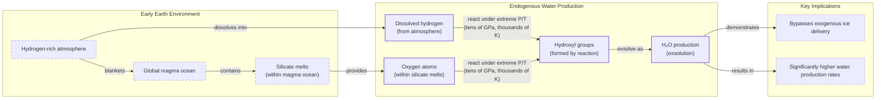

# Where Did Earth Get Its Oceans?

_Arching under the night sky inky with black expansiveness, we point to the planets we know, we pin quick wishes on stars._

This excerpt from Ada Limón's poem "In Praise of Mystery" is engraved on a metal plate on NASA's Europa Clipper spacecraft, currently journeying to Jupiter's icy moon [[32]](https://poets.org/poem/praise-mystery-poem-europa). For decades, our exploration of the solar system has been driven by the search for water. As far as we know, it is the essential ingredient for life.

As an AI engineer, this quest for a fundamental origin reminds me of our own work. We build complex systems that rely on a "source of truth," whether it's a knowledge base for a RAG system or a user's history for a personalized agent. The system's performance depends entirely on the quality and origin of its context. It might surprise you, then, that for our own planet, the origin of its most critical component—water—is still an open scientific question.

For years, the leading theory was that comets, icy relics from the dawn of the solar system, delivered our oceans. This was the accepted "ground truth." But as we gathered more data from spacecraft, we found chemical mismatches that challenged this model. After that, “comets sort of fell out of favor,” said Ashley King, a meteoriticist at the Natural History Museum in London [[1]](https://www.quantamagazine.org/where-did-earth-get-its-oceans-maybe-it-made-them-itself-20260612). The scientific community pivoted, and asteroids became the new frontrunner. Their water looked much more like our own, making them a compelling candidate [[1]](https://www.quantamagazine.org/where-did-earth-get-its-oceans-maybe-it-made-them-itself-20260612).

But the asteroid model also has its own bugs and inconsistencies. This has led to a radical new hypothesis that challenges the entire paradigm of external delivery. What if Earth made its own water?

The historical cometary model first dominated our thinking but was challenged by new isotopic data. This forced a re-evaluation, opening the door to both asteroidal alternatives and the possibility that Earth generated its water internally. In this article, we will examine the evidence for and against these external sources, much like debugging a complex system, before exploring the science behind our planet’s own potential water-making capabilities.

## A Showdown Between Comets and Asteroids

The central problem is straightforward. Earth formed about 4.54 billion years ago. It began as a ball of mostly molten rock before becoming the blue marble we know today [[1]](https://www.quantamagazine.org/where-did-earth-get-its-oceans-maybe-it-made-them-itself-20260612). The intense heat of its formation should have boiled off any original water. So, how did the oceans appear?

Comets were the first and most intuitive answer. Formed in the cold outer regions of the solar system, like the Kuiper Belt and Oort cloud, these objects are rich in water ice. When they impact a planet, they deliver a significant amount of water. Compared to the drier, rock-dominated asteroids, comets give you "a lot of bang for your buck," according to James Bryson, a meteoriticist at the University of Oxford [[1]](https://www.quantamagazine.org/where-did-earth-get-its-oceans-maybe-it-made-them-itself-20260612).

The key to testing this hypothesis is a chemical signature known as the deuterium-to-hydrogen (D/H) ratio. Water (H₂O) is composed of hydrogen and oxygen atoms. However, there is a heavier form of hydrogen called deuterium (D), which contains an extra neutron. The ratio of deuterium to regular hydrogen in a celestial body's water acts as a fingerprint, revealing its origin. If comets were the source of our oceans, their D/H ratio should match that of Earth's water.

In 1986, the European Space Agency's (ESA) Giotto mission provided the first close-up measurements of Halley's Comet [[1]](https://www.quantamagazine.org/where-did-earth-get-its-oceans-maybe-it-made-them-itself-20260612). The results were a surprise. The D/H ratio of Halley’s water was roughly twice that of Earth’s oceans. “It didn’t seem logical that today’s oceans should match the D/H chemistry of the primordial water present at Earth’s formation,” said planetary astronomer Karen Meech [[22]](https://research.hawaii.edu/noelo/water-and-habitability). This significant mismatch was a major blow to the comet theory.
Image 1: ESA’s Giotto spacecraft during launch preparations. (Source: [Where Did Earth Get Its Oceans? Maybe It Made Them Itself. [1]](https://www.quantamagazine.org/where-did-earth-get-its-oceans-maybe-it-made-them-itself-20260612))

More evidence against the comet hypothesis accumulated over the following decades. Spectroscopic observations of other comets, such as Hale-Bopp, also revealed high levels of deuterium [[1]](https://www.quantamagazine.org/where-did-earth-get-its-oceans-maybe-it-made-them-itself-20260612). The definitive evidence arrived in 2014 from ESA’s Rosetta mission, which orbited and landed on Comet 67P/Churyumov-Gerasimenko. Rosetta's precise instruments measured 67P's D/H ratio to be more than three times greater than that of Earth's oceans, the highest ever recorded for a comet at that time [[1]](https://www.quantamagazine.org/where-did-earth-get-its-oceans-maybe-it-made-them-itself-20260612), [[40]](https://www.esa.int/Science_Exploration/Space_Science/Rosetta/Rosetta_fuels_debate_on_origin_of_Earth_s_oceans). This finding effectively ruled out the idea that comets of this type were the primary source of Earth's water, forcing scientists to look for other explanations [[40]](https://www.esa.int/Science_Exploration/Space_Science/Rosetta/Rosetta_fuels_debate_on_origin_of_Earth_s_oceans).
Image 2: Comet 67P/Churyumov-Gerasimenko was photographed in 2014 by ESA’s Rosetta mission, which also sent a lander to the comet’s surface. ESA/ [Christian Stangl] (Source: [Where Did Earth Get Its Oceans? Maybe It Made Them Itself. [1]](https://www.quantamagazine.org/where-did-earth-get-its-oceans-maybe-it-made-them-itself-20260612))

With comets largely ruled out, the focus shifted to asteroids. These rocky bodies, primarily located in the asteroid belt between Mars and Jupiter, impact our planet much more frequently than comets. Although they contain less water overall, the analysis of meteorites—fragments of asteroids that survive their descent to Earth—revealed a promising link. The water molecules found in a specific group of meteorites, known as carbonaceous chondrites, have a D/H ratio that closely matches the water in our oceans [[1]](https://www.quantamagazine.org/where-did-earth-get-its-oceans-maybe-it-made-them-itself-20260612).

A compelling piece of evidence came from the Winchcombe meteorite, which fell in a British town in 2021. Because it was recovered just hours after landing, it was exceptionally pristine. Analysis showed its D/H ratio was a near-perfect match for Earth’s water [[1]](https://www.quantamagazine.org/where-did-earth-get-its-oceans-maybe-it-made-them-itself-20260612), [[41]](https://www.science.org/doi/10.1126/sciadv.abq3925). To eliminate any possibility of terrestrial contamination, scientists have also analyzed samples collected directly from asteroids in space. In 2018, Japan's Hayabusa2 mission visited the asteroid Ryugu. The analysis of the returned samples, published in 2023, confirmed that Ryugu's water also had a D/H ratio similar to Earth's [[1]](https://www.quantamagazine.org/where-did-earth-get-its-oceans-maybe-it-made-them-itself-20260612), [[42]](https://iopscience.iop.org/article/10.3847/2041-8213/acc393). These findings have solidified asteroids as the leading candidate for the delivery of Earth's water. While asteroids today contain relatively little water, it is believed they were much richer in water during the early days of the solar system, making them a more plausible delivery mechanism for Earth's oceans [[49]](https://www.space.com/36661-late-heavy-bombardment.html).
Image 3: The asteroid Ryugu, visited by the Hayabusa2spacecraft in 2018, contained water similar to the most common kind found on Earth. NASA’s Goddard Space Flight Center/University of Arizona (Source: [Where Did Earth Get Its Oceans? Maybe It Made Them Itself. [1]](https://www.quantamagazine.org/where-did-earth-get-its-oceans-maybe-it-made-them-itself-20260612))

However, the asteroid-only model is not without its own set of problems. One major issue is the mismatch in the isotopic ratios of noble gases, such as xenon and krypton, found in meteorites compared to Earth's atmosphere [[1]](https://www.quantamagazine.org/where-did-earth-get-its-oceans-maybe-it-made-them-itself-20260612), [[43]](https://link.springer.com/article/10.1007/s11214-022-00929-9). Additionally, the entire theory relies on a period of intense impacts known as the Late Heavy Bombardment (LHB) to deliver this "late veneer" of water after Earth had cooled [[1]](https://www.quantamagazine.org/where-did-earth-get-its-oceans-maybe-it-made-them-itself-20260612).

The LHB itself remains a topic of debate. While evidence from lunar craters suggests a spike in impacts around 3.9 billion years ago, scientists are uncertain about its duration, with estimates ranging from 20 to 200 million years. It is also unclear whether it was a single, cataclysmic event or a more gradual process [[48]](https://science.nasa.gov/moon/lunar-craters/what-is-the-late-heavy-bombardment). The proposed triggers, such as the "Nice model," which suggests that the migration of giant planets scattered the asteroid belt, are still theoretical [[49]](https://www.space.com/36661-late-heavy-bombardment.html).

Furthermore, some studies argue that the asteroid belt may not have contained enough large bodies to account for all the observed craters. This has led to other theories, such as impacts from failed planets, and even challenges the idea of a single, late bombardment event [[50]](https://astrobites.org/2017/02/10/dont-blame-asteroids-for-the-late-heavy-bombardment). These unresolved issues in both isotopic and dynamical models have prompted scientists to consider another possibility, one that doesn't depend on cosmic chance but on our planet's own geology.

The next section explores whether Earth could have created its own water, re-examining the very building blocks once thought to be dry. This would shift the source of our oceans from a late delivery to an early, internal process.

## Hydrogen, Meet Magma

When we, as engineers, simulate complex systems, we often find that initial conditions have a profound impact on the final outcome. The same is true for planets. When astronomers simulate how exoplanets form, they find that many rocky worlds likely began with thick, hydrogen-rich atmospheres [[44]](https://www.nature.com/articles/s41586-023-05823-0). Could early Earth have been similar? For a long time, the consensus was no. Scientists believed our planet's building blocks were hydrogen-poor, a conclusion based on a class of meteorites known as enstatite chondrites. These meteorites have a chemical composition remarkably similar to Earth but appeared to be dry [[1]](https://www.quantamagazine.org/where-did-earth-get-its-oceans-maybe-it-made-them-itself-20260612).

However, recent studies have overturned this assumption. Researchers discovered that hydrogen was present in these meteorites all along, locked away within their organic molecules and mineral structures [[1]](https://www.quantamagazine.org/where-did-earth-get-its-oceans-maybe-it-made-them-itself-20260612), [[45]](https://www.science.org/doi/10.1126/science.aba1948), [[46]](https://www.sciencedirect.com/science/article/pii/S0019103525001356). This finding opened the door to a new theory. If Earth formed from hydrogen-rich materials and was enveloped by a hydrogen atmosphere, it might have possessed the necessary ingredients to produce its own water. The planet's early surface was a global magma ocean, rich in oxygen bound within silicate minerals. A 2023 study in *Nature* proposed that if the hydrogen from the atmosphere could mix with the oxygen in the magma, water could be generated, although the potential quantity was unknown [[7]](https://www.nature.com/articles/s41586-023-05823-0).

Image 4: A diagram illustrating the endogenous water production model on early Earth, depicting the interaction between a hydrogen-rich atmosphere and a global magma ocean to form water.

A set of ambitious laboratory experiments provided a breakthrough. Researchers were investigating how some exoplanets, called sub-Neptunes, could maintain water-rich atmospheres despite orbiting very close to their scorching stars. They hypothesized that a reaction between a hydrogen atmosphere and a magma ocean could be the cause, but only if the magma was subjected to immense pressure [[1]](https://www.quantamagazine.org/where-did-earth-get-its-oceans-maybe-it-made-them-itself-20260612), [[47]](https://doi.org/10.1038/s41586-025-09630-7).

To test this, the team used diamond anvils to compress hydrogen gas and lasers to melt rock samples, simulating the extreme conditions inside a young planet. After five years of refining their techniques, the experiments demonstrated that the reaction between high-pressure hydrogen and molten rock was incredibly efficient. It produced far more water than scientists had previously predicted [[12]](https://faculty.epss.ucla.edu/~eyoung/reprints/Miozzi_etal_2025.pdf), [[47]](https://doi.org/10.1038/s41586-025-09630-7). "It doesn't seem unreasonable [that you could] produce a huge amount of water quite quickly," commented planetary scientist Paul Byrne. "And this is all homegrown, indigenous water" [[1]](https://www.quantamagazine.org/where-did-earth-get-its-oceans-maybe-it-made-them-itself-20260612).

But could this process have occurred on Earth? The sub-Neptunes modeled in the experiments are significantly more massive than our planet. Their powerful gravity is more effective at retaining the dense hydrogen atmosphere necessary to create the required pressure. "Earth is right on the edge of where that kind of thing can start happening," noted physicist H. W. Horn, one of the study's authors [[1]](https://www.quantamagazine.org/where-did-earth-get-its-oceans-maybe-it-made-them-itself-20260612). Some scientists remain skeptical, questioning whether an Earth-mass planet could have held onto enough hydrogen for this process to operate at a large scale [[1]](https://www.quantamagazine.org/where-did-earth-get-its-oceans-maybe-it-made-them-itself-20260612).

However, the experiments also suggest that the reaction is so efficient that it would not need to continue for long to generate a vast quantity of water. It is possible that Earth was a water factory for only a brief period, but that this was sufficient to form its oceans [[1]](https://www.quantamagazine.org/where-did-earth-get-its-oceans-maybe-it-made-them-itself-20260612). If this is the case, the implications are profound. If rocky planets can produce their own water, the reliance on a chance delivery from comets or asteroids is greatly diminished. This would significantly expand the number of potentially habitable worlds in the galaxy, as many planets "are born water-rich" [[1]](https://www.quantamagazine.org/where-did-earth-get-its-oceans-maybe-it-made-them-itself-20260612).

While this endogenous mechanism provides a powerful new framework, it does not necessarily exclude all external contributions. The final section will consider a mixed-source model, re-examine recent cometary data, and explore how our understanding of water's origins is evolving into a richer, more complex narrative.

## Drowning in a Sea of Possibilities

It seems likely that at least some of Earth’s water was produced internally, but that is not the whole story. Recent discoveries have brought comets back into the discussion. While early measurements of comets like Halley and 67P indicated high D/H ratios, not all comets are the same. In 2011, the Herschel Space Observatory found that the water in Comet Hartley 2 had a D/H ratio that closely matched Earth's oceans [[2]](https://sci.esa.int/web/herschel/-/49386-herschel-finds-first-evidence-of-earth-like-water-in-a-comet), [[5]](https://www.jpl.nasa.gov/images/pia14737-heavy-and-light-just-right).
Image 5: Comet Hartley 2, studied by the Herschel Space Observatory, has an Earth-like ratio of heavy to normal water. NASA/JPL-Caltech/UMD (Source: [Where Did Earth Get Its Oceans? Maybe It Made Them Itself. [1]](https://www.quantamagazine.org/where-did-earth-get-its-oceans-maybe-it-made-them-itself-20260612))

This initially appeared to be an outlier. However, a 2024 reanalysis of Rosetta's data from comet 67P suggested that the original high D/H measurements might have been skewed by dust in the comet's coma. The comet's icy core itself could have been more Earth-like [[1]](https://www.quantamagazine.org/where-did-earth-get-its-oceans-maybe-it-made-them-itself-20260612), [[39]](https://www.science.org/doi/10.1126/sciadv.adp2191). Additionally, recent observations of comet 12P/Pons-Brooks also detected an Earth-like D/H ratio [[1]](https://www.quantamagazine.org/where-did-earth-get-its-oceans-maybe-it-made-them-itself-20260612).

So, where does this leave us? Was it comets, asteroids, or Earth's own geological engine? "I suspect it was a combination of all of them," Meech said [[1]](https://www.quantamagazine.org/where-did-earth-get-its-oceans-maybe-it-made-them-itself-20260612). Earth's water is likely a complex mixture, sourced from multiple origins and then altered over billions of years by the planet's geology, atmosphere, and biology. These processes can erase the original isotopic fingerprints, making it difficult to identify a single source [[27]](https://www.aaas.org/membership/member-spotlight/where-did-earths-water-come-aaas-fellow-karen-meech-investigates).

This journey into our planet's past mirrors the search for the origin of life. Just as that field has expanded from a single "warm little pond" to a network of possibilities, the story of Earth’s water is shifting from a single source to a complex interplay of delivery and creation [[51]](https://www.nature.com/nature-index/topics/l4/prebiotic-chemistry-and-origins-of-life). "The more you learn, the less you know—but the story becomes richer and more exciting," Meech observed [[1]](https://www.quantamagazine.org/where-did-earth-get-its-oceans-maybe-it-made-them-itself-20260612). We are left not with a simple answer, but with a more nuanced and interconnected story of planetary formation.

## References

- [1] [Where Did Earth Get Its Oceans? Maybe It Made Them Itself.](https://www.quantamagazine.org/where-did-earth-get-its-oceans-maybe-it-made-them-itself-20260612)
- [2] [Herschel finds first evidence of Earth-like water in a comet](https://sci.esa.int/web/herschel/-/49386-herschel-finds-first-evidence-of-earth-like-water-in-a-comet)
- [3] [The deuterium-to-hydrogen ratio in the Solar System](https://sci.esa.int/web/herschel/-/49378-the-deuterium-to-hydrogen-ratio-in-the-solar-system)
- [4] [Ocean-like water in the Jupiter-family comet 103P/Hartley 2](https://www.aanda.org/articles/aa/abs/2012/08/aa19744-12/aa19744-12.html)
- [5] [Heavy and Light, Just Right](https://www.jpl.nasa.gov/images/pia14737-heavy-and-light-just-right)
- [6] [Comet Hartley 2 and the oceans of Earth](https://herscheltelescope.org.uk/results/comet-hartley-2-and-the-oceans-of-earth)
- [7] [Earth shaped by primordial H2 atmospheres](https://www.nature.com/articles/s41586-023-05823-0)
- [8] [Earth shaped by primordial H2 atmospheres](https://arxiv.org/abs/2304.07845)
- [9] [How Did Earth Get Its Water?](https://astrobiology.com/2023/04/how-did-earth-get-its-water.html)
- [10] [Earth shaped by primordial H 2 atmospheres](https://www.researchgate.net/publication/370070865_Earth_shaped_by_primordial_H_2_atmospheres)
- [11] [Diamond-anvil cell laser-heating experiments showed substantial water production from magma-hydrogen reactions](https://arxiv.org/pdf/2511.01351)
- [12] [Laser heating diamond anvil cell experiments were conducted between 16 and 60 GPa at temperatures above 4000 K](https://faculty.epss.ucla.edu/~eyoung/reprints/Miozzi_etal_2025.pdf)
- [13] [Laser-heated diamond-anvil cell experiments on silicate melts in a hydrogen medium](https://www.nature.com/articles/s41586-025-09630-7)
- [14] [Building wet planets through high-pressure magma-hydrogen reactions](https://doi.org/10.1038/s41586-025-09630-7)
- [15] [Earth shaped by primordial H2 atmospheres](https://doi.org/10.1038/s41586-023-05823-0)
- [16] [Water discovered in rocky planet-forming zone offers clues on habitability](https://www.mpg.de/20541783/water-discovered-in-rocky-planet-forming-zone-offers-clues-on-habitability)
- [17] [Planets without water could still produce certain liquids](https://news.mit.edu/2025/planets-without-water-could-still-produce-certain-liquids-0811)
- [18] [Endogenous water production expands rocky-planet habitability](https://pmc.ncbi.nlm.nih.gov/articles/PMC12783251)
- [19] [About Half of Sun-Like Stars Could Host Rocky, Potentially Habitable Planets](https://www.nasa.gov/missions/kepler/about-half-of-sun-like-stars-could-host-rocky-potentially-habitable-planets)
- [20] [Terrestrial Planets Guide Our Search for Habitable Exoplanets](https://eos.org/editors-vox/terrestrial-planets-guide-our-search-for-habitable-exoplanets)
- [21] [ESA Science & Technology - Herschel finds first evidence of Earth-like water in a comet](https://sci.esa.int/web/herschel/-/49386-herschel-finds-first-evidence-of-earth-like-water-in-a-comet)
- [22] [Water and Habitability – Noelo](https://research.hawaii.edu/noelo/water-and-habitability)
- [23] [Where Did Earth Get Its Oceans? Maybe It Made Them Itself.](https://www.quantamagazine.org/where-did-earth-get-its-oceans-maybe-it-made-them-itself-20260612)
- [24] [Where did Earth’s water come from? AAAS Fellow Karen Meech investigates | American Association for the Advancement of Science (AAAS)](https://www.aaas.org/membership/member-spotlight/where-did-earths-water-come-aaas-fellow-karen-meech-investigates)
- [25] [A nearly terrestrial D/H for comet 67P/Churyumov-Gerasimenko](https://www.science.org/doi/10.1126/sciadv.adp2191)
- [26] [Earth Sciences in Conversation: James Bryson](https://www.earth.ox.ac.uk/article/earth-sciences-conversation-james-bryson)
- [27] [Where did Earth’s water come from? AAAS Fellow Karen Meech investigates | American Association for the Advancement of Science (AAAS)](https://www.aaas.org/membership/member-spotlight/where-did-earths-water-come-aaas-fellow-karen-meech-investigates)
- [28] [Earth's water may have been inherited from material similar to enstatite chondrite meteorites](https://www.science.org/doi/10.1126/science.aba1948)
- [29] [The Winchcombe meteorite, a unique and pristine witness from the outer solar system](https://www.science.org/doi/10.1126/sciadv.abq3925)
- [30] [Hydrogen Isotopic Composition of Hydrous Minerals in Asteroid Ryugu](https://iopscience.iop.org/article/10.3847/2041-8213/acc393)
- [31] [The source of hydrogen in earth's building blocks](https://www.sciencedirect.com/science/article/pii/S0019103525001356)
- [32] [In Praise of Mystery: A Poem for Europa](https://poets.org/poem/praise-mystery-poem-europa)
- [33] [In Praise of Mystery: A Poem for Europa by Ada Limón](https://www.youtube.com/watch?v=EgWbeDNPD6o)
- [34] [In Praise of Mystery: A Poem for Europa by Ada Limón](https://www.slowdownshow.org/story/2023/08/25/full-version-in-praise-of-mystery-a-poem-for-europa)
- [35] [A Poem for Europa](https://www.loc.gov/programs/poetry-and-literature/poet-laureate/poet-laureate-projects/a-poem-for-europa)
- [36] [In Praise of Mystery](https://www.bookpage.com/reviews/in-praise-of-mystery-ada-limon-book-review)
- [37] [Noble Gases and Stable Isotopes Track the Origin and Early Evolution of the Venus Atmosphere](https://link.springer.com/article/10.1007/s11214-022-00929-9)
- [38] [Rosetta fuels debate on origin of Earth’s oceans](https://www.esa.int/Science_Exploration/Space_Science/Rosetta/Rosetta_fuels_debate_on_origin_of_Earth_s_oceans)
- [39] [A nearly terrestrial D/H for comet 67P/Churyumov-Gerasimenko](https://www.science.org/doi/10.1126/sciadv.adp2191)
- [40] [Rosetta fuels debate on origin of Earth’s oceans](https://www.esa.int/Science_Exploration/Space_Science/Rosetta/Rosetta_fuels_debate_on_origin_of_Earth_s_oceans)
- [41] [The Winchcombe meteorite, a unique and pristine witness from the outer solar system](https://www.science.org/doi/10.1126/sciadv.abq3925)
- [42] [Hydrogen Isotopic Composition of Hydrous Minerals in Asteroid Ryugu](https://iopscience.iop.org/article/10.3847/2041-8213/acc393)
- [43] [Noble Gases and Stable Isotopes Track the Origin and Early Evolution of the Venus Atmosphere](https://link.springer.com/article/10.1007/s11214-022-00929-9)
- [44] [Earth shaped by primordial H2 atmospheres](https://www.nature.com/articles/s41586-023-05823-0)
- [45] [Earth’s water may have been inherited from material similar to enstatite chondrite meteorites](https://www.science.org/doi/10.1126/science.aba1948)
- [46] [The source of hydrogen in earth's building blocks](https://www.sciencedirect.com/science/article/pii/S0019103525001356)
- [47] [Building wet planets through high-pressure magma-hydrogen reactions](https://doi.org/10.1038/s41586-025-09630-7)
- [48] [What Is the Late Heavy Bombardment?](https://science.nasa.gov/moon/lunar-craters/what-is-the-late-heavy-bombardment)
- [49] [The Late Heavy Bombardment: A Violent Assault on Young Earth](https://www.space.com/36661-late-heavy-bombardment.html)
- [50] [Don’t Blame Asteroids for the Late Heavy Bombardment](https://astrobites.org/2017/02/10/dont-blame-asteroids-for-the-late-heavy-bombardment)
- [51] [Prebiotic chemistry and origins of life](https://www.nature.com/nature-index/topics/l4/prebiotic-chemistry-and-origins-of-life)
- [52] [The Abiotic World-System Hypothesis for the Origin of Life](https://pmc.ncbi.nlm.nih.gov/articles/PMC12653978)