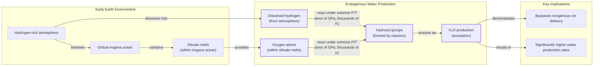

# Where Did Earth Get Its Oceans?

_Arching under the night sky inky with black expansiveness, we point to the planets we know, we pin quick wishes on stars._

This excerpt from Ada Limón's poem "In Praise of Mystery" is engraved on a metal plate affixed to NASA's Europa Clipper spacecraft, currently on its way to investigate the subsurface ocean of Jupiter's icy moon [[32]](https://poets.org/poem/praise-mystery-poem-europa). For decades, the search for water has driven our exploration of the solar system because, as far as we know, it is essential for life.

It might come as a surprise, then, that scientists do not know for certain how water first arrived on Earth. Despite decades of spacecraft flybys, sample-return missions, and laboratory analysis, the precise origin of our planet’s oceans remains an open question. For years, the leading theory was that water was delivered by comets, icy relics from the dawn of the solar system. This idea was intuitive; comets are essentially giant, dirty snowballs, and it seemed logical they would be the primary source.

However, as spacecraft got close enough to examine them, the data revealed a chemical mismatch, casting serious doubt on the theory. After that, “comets sort of fell out of favor,” said Ashley King, a meteoriticist at the Natural History Museum in London [[1]](https://www.quantamagazine.org/where-did-earth-get-its-oceans-maybe-it-made-them-itself-20260612). Asteroids, rockier bodies that impact Earth more frequently, became the most popular alternative. Their water reserves looked much more like our own, making them a compelling candidate [[1]](https://www.quantamagazine.org/where-did-earth-get-its-oceans-maybe-it-made-them-itself-20260612).

However, the asteroid theory also has its problems, leaving key questions unanswered. This has led to the rise of a radical new idea that challenges the entire paradigm of extraterrestrial delivery: Earth may have made its own water.

The historical cometary model first dominated scientific thought but was challenged by isotopic data. This opened the door not only to asteroidal alternatives but also to the possibility that Earth generated its water internally. In this article, we will examine the evidence for and against these extraterrestrial candidates before exploring the science behind our planet’s own water-making potential.

## A Showdown Between Comets and Asteroids

The central problem is straightforward. Earth formed about 4.54 billion years ago, beginning as a ball of mostly molten rock before becoming the blue marble we know today [[1]](https://www.quantamagazine.org/where-did-earth-get-its-oceans-maybe-it-made-them-itself-20260612). The intense heat of its formation should have boiled off any original water. So, how did the oceans appear?

Comets provided an intuitive answer. These objects, formed in the cold outer reaches of the solar system like the Kuiper Belt and Oort cloud, are rich in water ice. When they crash into a planet, they deliver a substantial amount of water. Compared to drier, rock-dominated asteroids, comets give you "a lot of bang for your buck," according to James Bryson, a meteoriticist at the University of Oxford [[1]](https://www.quantamagazine.org/where-did-earth-get-its-oceans-maybe-it-made-them-itself-20260612).

The key to verifying this hypothesis lies in a chemical signature known as the deuterium-to-hydrogen (D/H) ratio. Water (H₂O) is made of hydrogen and oxygen. A heavier form of hydrogen, called deuterium (D), contains an extra neutron. The ratio of deuterium to regular hydrogen in a celestial body's water provides a fingerprint of its origin. If comets supplied our oceans, their D/H ratio should match that of Earth's water.

In 1986, the European Space Agency's (ESA) Giotto mission made the first up-close measurements of Halley's Comet [[1]](https://www.quantamagazine.org/where-did-earth-get-its-oceans-maybe-it-made-them-itself-20260612). The results were surprising. The D/H ratio of Halley’s water was about twice that of Earth’s oceans. “It didn’t seem logical that today’s oceans should match the D/H chemistry of the primordial water present at Earth’s formation,” said planetary astronomer Karen Meech [[22]](https://research.hawaii.edu/noelo/water-and-habitability). The mismatch was a major blow to the comet theory.
Image 1: ESA’s Giotto spacecraft (top) took the first close-up images of a cometary nucleus (bottom) as part of its mission to Halley’s comet. ESA (left); Courtesy of Dr. H.U. Kelle (Source: [Where Did Earth Get Its Oceans? Maybe It Made Them Itself. [1]](https://www.quantamagazine.org/where-did-earth-get-its-oceans-maybe-it-made-them-itself-20260612))

More evidence accumulated over the following decades. Spectroscopic observations of other comets, like Hale-Bopp, also found high levels of deuterium [[1]](https://www.quantamagazine.org/where-did-earth-get-its-oceans-maybe-it-made-them-itself-20260612). The final blow came in 2014 from ESA’s Rosetta mission, which orbited and landed on Comet 67P/Churyumov-Gerasimenko. Rosetta's precise measurements revealed that 67P had a D/H ratio more than three times greater than Earth's oceans, the highest ever recorded for a comet at the time [[1]](https://www.quantamagazine.org/where-did-earth-get-its-oceans-maybe-it-made-them-itself-20260612), [[40]](https://www.esa.int/Science_Exploration/Space_Science/Rosetta/Rosetta_fuels_debate_on_origin_of_Earth_s_oceans). This finding effectively ruled out the idea that comets of this type were the primary source of Earth's water [[40]](https://www.esa.int/Science_Exploration/Space_Science/Rosetta/Rosetta_fuels_debate_on_origin_of_Earth_s_oceans).
Image 2: Comet 67P/Churyumov-Gerasimenko was photographed in 2014 by ESA’s Rosetta mission, which also sent a lander to the comet’s surface. ESA/ [Christian Stangl] (Source: [Where Did Earth Get Its Oceans? Maybe It Made Them Itself. [1]](https://www.quantamagazine.org/where-did-earth-get-its-oceans-maybe-it-made-them-itself-20260612))

With comets sidelined, attention turned to asteroids. These rocky objects, mostly found between Mars and Jupiter, strike our planet far more often than comets. While they contain less water overall, analysis of meteorites—fragments of asteroids that survive the fall to Earth—revealed a promising connection. The water molecules found in a particular group of meteorites, carbonaceous chondrites, closely match those in our oceans [[1]](https://www.quantamagazine.org/where-did-earth-get-its-oceans-maybe-it-made-them-itself-20260612).

A notable example is the Winchcombe meteorite, which fell in a British town in 2021. Recovered just hours after landing, this pristine sample was found to have a D/H ratio that nearly perfectly matched Earth’s water [[1]](https://www.quantamagazine.org/where-did-earth-get-its-oceans-maybe-it-made-them-itself-20260612), [[41]](https://www.science.org/doi/10.1126/sciadv.abq3925). To avoid the issue of terrestrial contamination, spacecraft have also collected samples directly from asteroids. In 2018, Japan's Hayabusa2 mission visited the asteroid Ryugu. Analysis of the returned samples, published in 2023, confirmed that Ryugu's water also had a D/H ratio similar to Earth's [[1]](https://www.quantamagazine.org/where-did-earth-get-its-oceans-maybe-it-made-them-itself-20260612), [[42]](https://iopscience.iop.org/article/10.3847/2041-8213/acc393). These findings have made asteroids the favored candidate. While asteroids today contain little water, it is theorized that they were much richer in water during the solar system's early history, making them a more viable delivery system for Earth's oceans [[49]](https://www.space.com/36661-late-heavy-bombardment.html).
Image 3: The asteroid Ryugu, visited by the Hayabusa2spacecraft in 2018, contained water similar to the most common kind found on Earth. NASA’s Goddard Space Flight Center/University of Arizona (Source: [Where Did Earth Get Its Oceans? Maybe It Made Them Itself. [1]](https://www.quantamagazine.org/where-did-earth-get-its-oceans-maybe-it-made-them-itself-20260612))

However, the asteroid-only model is not without its flaws. Besides mismatches in the isotopic ratios of noble gases like xenon found in meteorites compared to Earth's atmosphere, the entire theory hinges on a period of intense impacts known as the Late Heavy Bombardment to deliver this "late veneer" of water [[1]](https://www.quantamagazine.org/where-did-earth-get-its-oceans-maybe-it-made-them-itself-20260612), [[43]](https://link.springer.com/article/10.1007/s11214-022-00929-9). Without this event, it's difficult to explain how Earth acquired its oceans after the initial heat of formation would have boiled them away.

Yet, the LHB itself is a puzzle. While evidence from lunar craters suggests a spike in impacts around 3.9 billion years ago, scientists debate its duration. Estimates range from 20 to 200 million years, and it is unclear whether it was a singular cataclysm or a more gradual process [[48]](https://science.nasa.gov/moon/lunar-craters/what-is-the-late-heavy-bombardment). The proposed triggers, such as the "Nice model" where giant planets migrated and scattered the asteroid belt, are still theoretical [[49]](https://www.space.com/36661-late-heavy-bombardment.html).

Furthermore, some studies suggest the asteroid belt could not have contained enough large bodies to create all the observed craters. This points to other possible sources like failed planets or challenges the very idea of a single, late bombardment event [[50]](https://astrobites.org/2017/02/10/dont-blame-asteroids-for-the-late-heavy-bombardment). The unresolved tensions in both isotopic and dynamical constraints have led scientists to consider another possibility, one that does not rely on cosmic chance but on our planet’s own geology.

The next section examines whether Earth could have manufactured its own water by reanalyzing the very building blocks previously assumed to be dry. This would replace the need for late delivery with an early, internal source.

## Hydrogen, Meet Magma

When astronomers study exoplanets, they find that many rocky worlds likely started their lives with thick, hydrogen-rich atmospheres [[44]](https://www.nature.com/articles/s41586-023-05823-0). Could early Earth have been similar? For a long time, scientists thought our planet's building blocks were hydrogen-poor. This conclusion was based on a class of meteorites called enstatite chondrites, which have a chemical makeup suspiciously similar to Earth but seemed to lack hydrogen [[1]](https://www.quantamagazine.org/where-did-earth-get-its-oceans-maybe-it-made-them-itself-20260612).

However, recent studies have found that there was hydrogen in these meteorites all along, hidden within their organic molecules and mineral structures [[1]](https://www.quantamagazine.org/where-did-earth-get-its-oceans-maybe-it-made-them-itself-20260612), [[45]](https://www.science.org/doi/10.1126/science.aba1948), [[46]](https://www.sciencedirect.com/science/article/pii/S0019103525001356). This discovery opened the door to a new theory: if Earth formed from hydrogen-rich materials and was blanketed by a hydrogen atmosphere, it might have had the ingredients to make its own water. The planet's early magma ocean was full of oxygen locked in silicate minerals. A 2023 study in *Nature* proposed that if the atmospheric hydrogen could mix with the magma's oxygen, water could be produced, though the amount was uncertain [[7]](https://www.nature.com/articles/s41586-023-05823-0).

Image 4: A diagram illustrating the endogenous water production model on early Earth, depicting the interaction between a hydrogen-rich atmosphere and a global magma ocean to form water.

This is where a set of ambitious laboratory experiments provided a breakthrough. Researchers wanted to understand how some exoplanets, known as sub-Neptunes, could have water-rich atmospheres despite orbiting close to their scorching stars. They suspected that a reaction between a hydrogen atmosphere and a magma ocean could be the answer, but only if the magma was under immense pressure [[1]](https://www.quantamagazine.org/where-did-earth-get-its-oceans-maybe-it-made-them-itself-20260612), [[47]](https://doi.org/10.1038/s41586-025-09630-7).

To test this, they used diamond anvils to compress hydrogen gas and lasers to melt rock samples, re-creating the extreme conditions of an adolescent planet's interior. After five years of development, their experiments showed that the reaction of high-pressure hydrogen with molten rock was incredibly efficient, producing far more water than scientists had predicted [[12]](https://faculty.epss.ucla.edu/~eyoung/reprints/Miozzi_etal_2025.pdf), [[47]](https://doi.org/10.1038/s41586-025-09630-7). "It doesn't seem unreasonable [that you could] produce a huge amount of water quite quickly," said planetary scientist Paul Byrne. "And this is all homegrown, indigenous water" [[1]](https://www.quantamagazine.org/where-did-earth-get-its-oceans-maybe-it-made-them-itself-20260612).

But could this process have happened on Earth? The sub-Neptunes in the experiments are much more massive than Earth, and their intense gravity is better at holding on to a hydrogen atmosphere needed to create the required pressure. "Earth is right on the edge of where that kind of thing can start happening," said physicist H. W. Horn, one of the study's authors [[1]](https://www.quantamagazine.org/where-did-earth-get-its-oceans-maybe-it-made-them-itself-20260612). Some scientists are doubtful that an Earth-mass planet could have retained enough hydrogen for this process to work at scale [[1]](https://www.quantamagazine.org/where-did-earth-get-its-oceans-maybe-it-made-them-itself-20260612).

However, the experiments suggest the reaction is so efficient that it would not need to last long to create a vast amount of water. Earth might have been a water factory for only a brief period, but that moment may have been enough to forge its oceans [[1]](https://www.quantamagazine.org/where-did-earth-get-its-oceans-maybe-it-made-them-itself-20260612). If so, the implications are profound. If rocky planets can generate their own water, the need for a chance delivery from comets or asteroids is greatly reduced. This would expand the number of potentially habitable worlds in the galaxy, as many planets "are born water-rich" [[1]](https://www.quantamagazine.org/where-did-earth-get-its-oceans-maybe-it-made-them-itself-20260612).

While the endogenous mechanism offers a powerful new explanation, it does not necessarily exclude all external contributions. The final section will weigh a mixed-source synthesis, re-examine recent cometary data, and explore how our understanding of water's origins is becoming richer and more complex.

## Drowning in a Sea of Possibilities

It is possible that at least some of Earth’s water was produced internally, but that is not the end of the story. Recent findings have brought comets back into the conversation. While early measurements of comets like Halley and 67P showed high D/H ratios, not all comets are the same. In 2011, ESA's Herschel Space Observatory found that the water in Comet Hartley 2 had a D/H ratio that closely matched Earth's oceans [[2]](https://sci.esa.int/web/herschel/-/49386-herschel-finds-first-evidence-of-earth-like-water-in-a-comet), [[5]](https://www.jpl.nasa.gov/images/pia14737-heavy-and-light-just-right).
Image 5: Comet Hartley 2, studied by the Herschel Space Observatory, has an Earth-like ratio of heavy to normal water. NASA/JPL-Caltech/UMD (Source: [Where Did Earth Get Its Oceans? Maybe It Made Them Itself. [1]](https://www.quantamagazine.org/where-did-earth-get-its-oceans-maybe-it-made-them-itself-20260612))

This once seemed like an anomaly. However, a 2024 reanalysis of Rosetta's data from comet 67P suggested that the initial high D/H measurements might have been skewed by dust in the comet's coma, and the comet's icy body itself could have been more Earth-like [[1]](https://www.quantamagazine.org/where-did-earth-get-its-oceans-maybe-it-made-them-itself-20260612), [[39]](https://www.science.org/doi/10.1126/sciadv.adp2191). Furthermore, observations of comet 12P/Pons-Brooks in 2025 also detected an Earth-like D/H ratio [[1]](https://www.quantamagazine.org/where-did-earth-get-its-oceans-maybe-it-made-them-itself-20260612).

So, where does this leave us? Was it comets, asteroids, or Earth's own geological processes? "I suspect it was a combination of all of them," Meech said [[1]](https://www.quantamagazine.org/where-did-earth-get-its-oceans-maybe-it-made-them-itself-20260612). Earth's water is likely a diverse cocktail, sourced from multiple places and then altered over billions of years by the planet's geology, atmosphere, and biology. These processes can erase the original isotopic fingerprints, making it difficult to pinpoint a single origin [[27]](https://www.aaas.org/membership/member-spotlight/where-did-earths-water-come-aaas-fellow-karen-meech-investigates).

This journey into the origin of our oceans mirrors the search for the origin of life itself. Just as origin-of-life research has moved beyond a single "warm little pond" to explore a network of possibilities—from deep-sea hydrothermal vents to the catalytic properties of mineral-rich environments—the story of Earth’s water is shifting from a single source to a complex interplay of delivery and creation [[51]](https://www.nature.com/nature-index/topics/l4/prebiotic-chemistry-and-origins-of-life). Modern theories in that field, like Assembly Theory, focus on how complexity emerges from historical pathways rather than a single event, a direct parallel to our evolving understanding of planetary habitability [[52]](https://pmc.ncbi.nlm.nih.gov/articles/PMC12653978). "The more you learn, the less you know—but the story becomes richer and more exciting," Meech observed [[1]](https://www.quantamagazine.org/where-did-earth-get-its-oceans-maybe-it-made-them-itself-20260612). Instead of a simple answer, we are finding a complex and interconnected story of planetary formation, a narrative that continues to unfold with each new mission and discovery.

## References

- [1] [Where Did Earth Get Its Oceans? Maybe It Made Them Itself.](https://www.quantamagazine.org/where-did-earth-get-its-oceans-maybe-it-made-them-itself-20260612)
- [2] [Herschel finds first evidence of Earth-like water in a comet](https://sci.esa.int/web/herschel/-/49386-herschel-finds-first-evidence-of-earth-like-water-in-a-comet)
- [3] [The deuterium-to-hydrogen ratio in the Solar System](https://sci.esa.int/web/herschel/-/49378-the-deuterium-to-hydrogen-ratio-in-the-solar-system)
- [4] [Ocean-like water in the Jupiter-family comet 103P/Hartley 2](https://www.aanda.org/articles/aa/abs/2012/08/aa19744-12/aa19744-12.html)
- [5] [Heavy and Light, Just Right](https://www.jpl.nasa.gov/images/pia14737-heavy-and-light-just-right)
- [6] [Comet Hartley 2 and the oceans of Earth](https://herscheltelescope.org.uk/results/comet-hartley-2-and-the-oceans-of-earth)
- [7] [Earth shaped by primordial H2 atmospheres](https://www.nature.com/articles/s41586-023-05823-0)
- [8] [Earth shaped by primordial H2 atmospheres](https://arxiv.org/abs/2304.07845)
- [9] [How Did Earth Get Its Water?](https://astrobiology.com/2023/04/how-did-earth-get-its-water.html)
- [10] [Earth shaped by primordial H 2 atmospheres](https://www.researchgate.net/publication/370070865_Earth_shaped_by_primordial_H_2_atmospheres)
- [11] [Diamond-anvil cell laser-heating experiments showed substantial water production from magma-hydrogen reactions](https://arxiv.org/pdf/2511.01351)
- [12] [Laser heating diamond anvil cell experiments were conducted between 16 and 60 GPa at temperatures above 4000 K](https://faculty.epss.ucla.edu/~eyoung/reprints/Miozzi_etal_2025.pdf)
- [13] [Laser-heated diamond-anvil cell experiments on silicate melts in a hydrogen medium](https://www.nature.com/articles/s41586-025-09630-7)
- [14] [Building wet planets through high-pressure magma-hydrogen reactions](https://doi.org/10.1038/s41586-025-09630-7)
- [15] [Earth shaped by primordial H2 atmospheres](https://doi.org/10.1038/s41586-023-05823-0)
- [16] [Water discovered in rocky planet-forming zone offers clues on habitability](https://www.mpg.de/20541783/water-discovered-in-rocky-planet-forming-zone-offers-clues-on-habitability)
- [17] [Planets without water could still produce certain liquids](https://news.mit.edu/2025/planets-without-water-could-still-produce-certain-liquids-0811)
- [18] [Endogenous water production expands rocky-planet habitability](https://pmc.ncbi.nlm.nih.gov/articles/PMC12783251)
- [19] [About Half of Sun-Like Stars Could Host Rocky, Potentially Habitable Planets](https://www.nasa.gov/missions/kepler/about-half-of-sun-like-stars-could-host-rocky-potentially-habitable-planets)
- [20] [Terrestrial Planets Guide Our Search for Habitable Exoplanets](https://eos.org/editors-vox/terrestrial-planets-guide-our-search-for-habitable-exoplanets)
- [21] [ESA Science & Technology - Herschel finds first evidence of Earth-like water in a comet](https://sci.esa.int/web/herschel/-/49386-herschel-finds-first-evidence-of-earth-like-water-in-a-comet)
- [22] [Water and Habitability – Noelo](https://research.hawaii.edu/noelo/water-and-habitability)
- [23] [Where Did Earth Get Its Oceans? Maybe It Made Them Itself.](https://www.quantamagazine.org/where-did-earth-get-its-oceans-maybe-it-made-them-itself-20260612)
- [24] [Where did Earth’s water come from? AAAS Fellow Karen Meech investigates | American Association for the Advancement of Science (AAAS)](https://www.aaas.org/membership/member-spotlight/where-did-earths-water-come-aaas-fellow-karen-meech-investigates)
- [25] [A nearly terrestrial D/H for comet 67P/Churyumov-Gerasimenko](https://www.science.org/doi/10.1126/sciadv.adp2191)
- [26] [Earth Sciences in Conversation: James Bryson](https://www.earth.ox.ac.uk/article/earth-sciences-conversation-james-bryson)
- [27] [Where did Earth’s water come from? AAAS Fellow Karen Meech investigates | American Association for the Advancement of Science (AAAS)](https://www.aaas.org/membership/member-spotlight/where-did-earths-water-come-aaas-fellow-karen-meech-investigates)
- [28] [Earth's water may have been inherited from material similar to enstatite chondrite meteorites](https://www.science.org/doi/10.1126/science.aba1948)
- [29] [The Winchcombe meteorite, a unique and pristine witness from the outer solar system](https://www.science.org/doi/10.1126/sciadv.abq3925)
- [30] [Hydrogen Isotopic Composition of Hydrous Minerals in Asteroid Ryugu](https://iopscience.iop.org/article/10.3847/2041-8213/acc393)
- [31] [The source of hydrogen in earth's building blocks](https://www.sciencedirect.com/science/article/pii/S0019103525001356)
- [32] [In Praise of Mystery: A Poem for Europa](https://poets.org/poem/praise-mystery-poem-europa)
- [33] [In Praise of Mystery: A Poem for Europa by Ada Limón](https://www.youtube.com/watch?v=EgWbeDNPD6o)
- [34] [In Praise of Mystery: A Poem for Europa by Ada Limón](https://www.slowdownshow.org/story/2023/08/25/full-version-in-praise-of-mystery-a-poem-for-europa)
- [35] [A Poem for Europa](https://www.loc.gov/programs/poetry-and-literature/poet-laureate/poet-laureate-projects/a-poem-for-europa)
- [36] [In Praise of Mystery](https://www.bookpage.com/reviews/in-praise-of-mystery-ada-limon-book-review)
- [37] [Noble Gases and Stable Isotopes Track the Origin and Early Evolution of the Venus Atmosphere](https://link.springer.com/article/10.1007/s11214-022-00929-9)
- [38] [Rosetta fuels debate on origin of Earth’s oceans](https://www.esa.int/Science_Exploration/Space_Science/Rosetta/Rosetta_fuels_debate_on_origin_of_Earth_s_oceans)
- [39] [A nearly terrestrial D/H for comet 67P/Churyumov-Gerasimenko](https://www.science.org/doi/10.1126/sciadv.adp2191)
- [40] [Rosetta fuels debate on origin of Earth’s oceans](https://www.esa.int/Science_Exploration/Space_Science/Rosetta/Rosetta_fuels_debate_on_origin_of_Earth_s_oceans)
- [41] [The Winchcombe meteorite, a unique and pristine witness from the outer solar system](https://www.science.org/doi/10.1126/sciadv.abq3925)
- [42] [Hydrogen Isotopic Composition of Hydrous Minerals in Asteroid Ryugu](https://iopscience.iop.org/article/10.3847/2041-8213/acc393)
- [43] [Noble Gases and Stable Isotopes Track the Origin and Early Evolution of the Venus Atmosphere](https://link.springer.com/article/10.1007/s11214-022-00929-9)
- [44] [Earth shaped by primordial H2 atmospheres](https://www.nature.com/articles/s41586-023-05823-0)
- [45] [Earth’s water may have been inherited from material similar to enstatite chondrite meteorites](https://www.science.org/doi/10.1126/science.aba1948)
- [46] [The source of hydrogen in earth's building blocks](https://www.sciencedirect.com/science/article/pii/S0019103525001356)
- [47] [Building wet planets through high-pressure magma-hydrogen reactions](https://doi.org/10.1038/s41586-025-09630-7)
- [48] [What Is the Late Heavy Bombardment?](https://science.nasa.gov/moon/lunar-craters/what-is-the-late-heavy-bombardment)
- [49] [The Late Heavy Bombardment: A Violent Assault on Young Earth](https://www.space.com/36661-late-heavy-bombardment.html)
- [50] [Don’t Blame Asteroids for the Late Heavy Bombardment](https://astrobites.org/2017/02/10/dont-blame-asteroids-for-the-late-heavy-bombardment)
- [51] [Prebiotic chemistry and origins of life](https://www.nature.com/nature-index/topics/l4/prebiotic-chemistry-and-origins-of-life)
- [52] [The Abiotic World-System Hypothesis for the Origin of Life](https://pmc.ncbi.nlm.nih.gov/articles/PMC12653978)