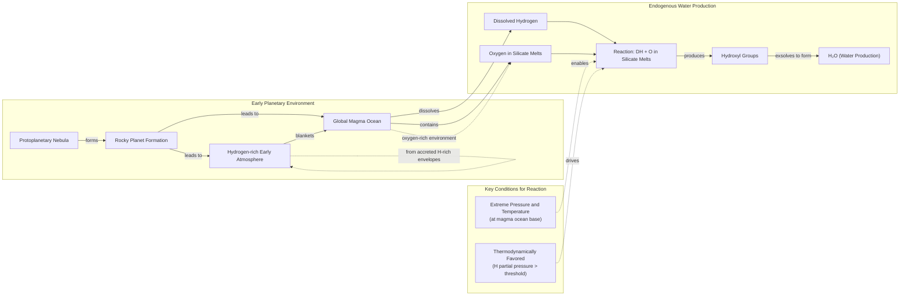

# Where Did Earth's Oceans Come From?

## Introduction

At this moment, a spacecraft is hurtling toward Europa, an ice-veiled moon of Jupiter, on a mission to investigate its subsurface ocean. Affixed to the craft is a metal plate engraved with a poem by Ada Limón, which reads in part: "And it is not darkness that unites us, not the cold distance of space, but the offering of water, each drop of rain, each rivulet, each pulse, each vein" [[14]](https://poets.org/poem/praise-mystery-poem-europa). For decades, our search for water has dominated the exploration of the solar system, because as far as we know, it is the essential ingredient for life. It may come as a surprise, then, that we still do not know for sure how water first arrived here on Earth, despite decades of exploration, spacecraft flybys, and laboratory work. You might assume this question was settled long ago, but the scientific story is far from over.

For years, the leading theory was that our planet’s water was delivered by comets. These are icy relics from the dawn of the solar system, and they seemed like the perfect candidates. But as our spacecraft got close enough to "taste" them, the data revealed a chemical mismatch, posing serious challenges to the theory. This finding caused a major shift in thinking. After that, “comets sort of fell out of favor,” said Ashley King, a meteoriticist at the Natural History Museum in London. Asteroids then became the most popular choice. These rockier bodies impact Earth far more frequently, and their water reserves looked much more like our own [[1]](https://www.quantamagazine.org/where-did-earth-get-its-oceans-maybe-it-made-them-itself-20260612). However, the asteroid theory has its own problems, particularly with matching the isotopic signatures of other volatile elements. This has led to the rise of a radical new idea that challenges the entire paradigm of external delivery: Earth may have made its own water.

In this article, we will explore the evidence behind these competing theories. The historical cometary model first dominated, then faced falsification through isotopic data. This opened the door to both asteroidal alternatives and the radical possibility that Earth generated its own water internally. We will start by presenting the detailed showdown between the two external delivery candidates, using concrete mission and meteorite evidence so you can evaluate each hypothesis.

## A Showdown Between Comets and Asteroids

Earth formed about 4.54 billion years ago. While much of its earliest eon has been lost to time, the basics are agreed upon. It began as a ball of mostly molten rock, and then it became a blue marble. The question is, how? Comets provided an early, compelling answer. Formed in the frigid outer reaches of the solar system, like the Kuiper Belt beyond Neptune or the more distant Oort cloud, they are rich in water ice. When a comet’s orbit brings it close to the sun, this ice vaporizes, creating a spectacular tail. Compared to the drier, rock-dominated asteroids, comets give you “a lot of bang for your buck” when it comes to water delivery, said James Bryson, a meteoriticist at the University of Oxford [[1]](https://www.quantamagazine.org/where-did-earth-get-its-oceans-maybe-it-made-them-itself-20260612).

The key to testing this theory lies in a chemical fingerprint: the ratio of deuterium to hydrogen (D/H). Deuterium is a heavier form of hydrogen, and the D/H ratio in water provides clues about where and how it formed. If comets were the primary source of our oceans, their water should have a D/H ratio similar to Earth's. In the 1980s, the European Space Agency (ESA) decided to check. Their Giotto mission was the first to get an up-close look at a comet's nucleus [[1]](https://www.quantamagazine.org/where-did-earth-get-its-oceans-maybe-it-made-them-itself-20260612).
Image 1: ESA’s Giotto spacecraft during launch preparations. (Source: [ESA](https://www.quantamagazine.org/where-did-earth-get-its-oceans-maybe-it-made-them-itself-20260612))

In 1986, Giotto intercepted Halley’s Comet. Its measurements were a surprise. The D/H ratio in Halley’s water was twice that of Earth’s oceans. “It didn’t seem logical that today’s oceans should match the D/H chemistry of the primordial water present at Earth’s formation,” said Karen Meech, a planetary astronomer at the University of Hawai‘i, highlighting the discrepancy [[12]](https://research.hawaii.edu/noelo/water-and-habitability).
Image 2: Close-up images of Comet Halley's nucleus from the Giotto mission. (Source: [MPAE/Dr. H.U. Keller](https://www.quantamagazine.org/where-did-earth-get-its-oceans-maybe-it-made-them-itself-20260612))

More evidence accumulated through the 1990s and 2000s from ground-based spectroscopic observations of other comets, like Hale-Bopp, which also showed high levels of deuterium [[1]](https://www.quantamagazine.org/where-did-earth-get-its-oceans-maybe-it-made-them-itself-20260612). The final blow came in 2014 from Giotto's successor, ESA's Rosetta mission. Rosetta orbited and sent a lander to Comet 67P/Churyumov-Gerasimenko, making the most precise measurements of a comet's composition to date. It found that 67P had a D/H ratio more than three times that of Earth's water, the highest ever measured in a comet [[1]](https://www.quantamagazine.org/where-did-earth-get-its-oceans-maybe-it-made-them-itself-20260612), [[10]](https://www.esa.int/Science_Exploration/Space_Science/Rosetta/Rosetta_fuels_debate_on_origin_of_Earth_s_oceans). This effectively ruled out comets from the Oort cloud as the primary source of our oceans.
Image 3: Comet 67P/Churyumov-Gerasimenko was photographed in 2014 by ESA’s Rosetta mission. (Source: [ESA/Christian Stangl](https://www.quantamagazine.org/where-did-earth-get-its-oceans-maybe-it-made-them-itself-20260612))

With comets sidelined, our attention turned to asteroids. These rocky objects, mostly found between Mars and Jupiter, regularly impact our planet as meteorites. We have collected thousands of them and found that a particular group, carbonaceous chondrites, contains water with a D/H ratio that closely resembles our own. A prime example is the Winchcombe meteorite, which fell in the UK in 2021. Because it was recovered just hours after landing, it was exceptionally pristine. Analysis showed its water had a D/H ratio that almost perfectly matched that of Earth’s oceans [[1]](https://www.quantamagazine.org/where-did-earth-get-its-oceans-maybe-it-made-them-itself-20260612), [[4]](https://www.science.org/doi/10.1126/sciadv.abq3925).

This finding was bolstered by sample-return missions. In 2018, Japan’s Hayabusa2 spacecraft visited the asteroid Ryugu and brought back material for analysis. The water from Ryugu also had a D/H ratio similar to Earth's [[1]](https://www.quantamagazine.org/where-did-earth-get-its-oceans-maybe-it-made-them-itself-20260612), [[5]](https://iopscience.iop.org/article/10.3847/2041-8213/acc393). Today, the scientific community is "probably more favorable of asteroids than comets," according to King [[1]](https://www.quantamagazine.org/where-did-earth-get-its-oceans-maybe-it-made-them-itself-20260612).
Image 4: The asteroid Ryugu, visited by the Hayabusa2 spacecraft in 2018, contained water similar to that on Earth. (Source: [NASA’s Goddard Space Flight Center/University of Arizona](https://www.quantamagazine.org/where-did-earth-get-its-oceans-maybe-it-made-them-itself-20260612))

However, the asteroid-only model is not without its own problems. While the D/H ratios match, asteroids also contain small amounts of noble gases like argon, krypton, and xenon, and the mix of these inert elements does not usually correspond to what we find in Earth's atmosphere [[1]](https://www.quantamagazine.org/where-did-earth-get-its-oceans-maybe-it-made-them-itself-20260612), [[9]](https://link.springer.com/article/10.1007/s11214-022-00929-9). The xenon ratios are particularly problematic. Earth’s atmosphere has a unique isotopic signature, with excesses of certain xenon isotopes (like 129Xe, from the decay of long-extinct iodine-129) that cannot be fully explained by contributions from meteorites or the solar wind [[15]](https://earthandsolarsystem.wordpress.com/2011/05/18/xenon).

Furthermore, both the comet and asteroid theories rely on a period of intense bombardment late in Earth’s formation to deliver the water. The existence and intensity of this "late veneer" are still heavily debated. These unresolved tensions in both isotopic and dynamical constraints have pushed some of us to consider a radical alternative. The next section, therefore, examines whether Earth could have manufactured its own water by reanalyzing the very building blocks previously assumed to be dry, replacing the need for late delivery with an early, planet-internal source.

## Hydrogen, Meet Magma

When we simulate the ways exoplanets, with their diverse atmospheres, took shape, we find that many could have started out with abundant hydrogen. This has led scientists to wonder if Earth’s early years were similar [[7]](https://www.nature.com/articles/s41586-023-05823-0). Traditionally, the building blocks of Earth, represented by meteorites called enstatite chondrites, were thought to be dry [[8]](https://www.science.org/doi/10.1126/science.aba1948). These meteorites have a chemical makeup very similar to our planet, and since they appeared to lack hydrogen, it was assumed Earth started out with very little as well.

However, recent studies have overturned this assumption. Scientists, including James Bryson, found that there was hydrogen in these meteorites all along, hidden within organic molecules, silicate glasses, and sulfur compounds [[1]](https://www.quantamagazine.org/where-did-earth-get-its-oceans-maybe-it-made-them-itself-20260612), [[6]](https://www.sciencedirect.com/science/article/pii/S0019103525001356?via%3Dihub). This suggests that the early Earth may have been awash in hydrogen. At the same time, the planet was a sphere of molten rock—a global magma ocean full of oxygen. This sets up a tantalizing possibility: what would happen if the hydrogen in the atmosphere and the oxygen in the magma were to mix?

A 2023 study proposed that such a process would allow a planet to make its own water, though they were unsure how much [[7]](https://www.nature.com/articles/s41586-023-05823-0). The answer came from a series of ambitious lab experiments designed to recreate the conditions of young, hydrogen-rich exoplanets known as sub-Neptunes. These planets are thought to have pressures at their core-envelope boundary far greater than on Earth. Researchers suspected that under such extreme pressure, the reaction between hydrogen and magma could be highly efficient. "That higher pressure is a big part of what facilitates the water production," said H. W. Horn of Lawrence Livermore National Laboratory. "It actually enhances the chemical reactions" [[1]](https://www.quantamagazine.org/where-did-earth-get-its-oceans-maybe-it-made-them-itself-20260612).

To test this, a team led by Horn and Sang-Heon Shim at Arizona State University used diamond anvils to put hydrogen gas under immense pressure and then combined it with rock samples melted by lasers. The setup was dangerous and took five years to perfect. "We broke a lot of diamonds," Shim recalled [[1]](https://www.quantamagazine.org/where-did-earth-get-its-oceans-maybe-it-made-them-itself-20260612). These experiments face extreme technical hurdles, from maintaining optical alignment under pressure to preventing chemical reactions between the hot sample and the diamond anvils themselves, which can form unwanted carbides and contaminate the results [[18]](https://epub.uni-bayreuth.de/5250/1/GAprilis_thesis_06.pdf).

The result was dramatic. The reaction was so efficient that it produced far more water than scientists had predicted—up to tens of weight percent [[3]](https://www.nature.com/articles/s41586-025-09630-7). The key is that at these pressures, hydrogen can readily reduce oxides in the silicate melt. While early models focused on the reduction of iron oxide (FeO), recent work suggests the reaction with silicon dioxide (SiO2), which is far more abundant in Earth's mantle, may be an even more important source of water [[16]](https://www.nature.com/articles/s41586-025-09970-4). The experiments showed that these reactions can produce water amounting to tens of weight percent of the magma, provided enough hydrogen is available [[17]](https://pmc.ncbi.nlm.nih.gov/articles/PMC12571897). "It doesn’t seem unreasonable [that you could] produce a huge amount of water quite quickly," commented Paul Byrne, a planetary scientist at Washington University in St. Louis. "And this is all homegrown, indigenous water"—no comets or asteroids required [[1]](https://www.quantamagazine.org/where-did-earth-get-its-oceans-maybe-it-made-them-itself-20260612).

Image 5: Flowchart illustrating the endogenous water production model on early rocky planets.

The question is whether this process could have happened on Earth. Sub-Neptunes are far more massive than our planet, and their intense gravity is better at holding onto a hydrogen atmosphere, which is necessary to create the required pressure. "Earth is right on the edge of where that kind of thing can start happening," Horn noted [[1]](https://www.quantamagazine.org/where-did-earth-get-its-oceans-maybe-it-made-them-itself-20260612).

Some scientists are doubtful. “I’m a little bit doubtful whether you can have this for an Earth-mass planet,” said Anders Johansen, an astrophysicist at the University of Copenhagen [[1]](https://www.quantamagazine.org/where-did-earth-get-its-oceans-maybe-it-made-them-itself-20260612). For the process to work, a planet must be massive enough—at least a quarter of Earth's mass—to gravitationally hold on to a thick hydrogen atmosphere long enough for the reactions to occur [[19]](https://faculty.epss.ucla.edu/~eyoung/reprints/Miozzi_etal_2025.pdf). Earth’s early history, marked by events like the giant impact that formed the Moon, likely involved significant atmospheric loss, making long-term hydrogen retention a major challenge [[20]](https://ntrs.nasa.gov/citations/19920019357). If the magma ocean solidifies before enough water is produced, the remaining dissolved hydrogen could become trapped in the solid mantle, halting the process [[21]](https://iopscience.iop.org/article/10.3847/PSJ/ac5fb1).

Others, like Byrne, suggest that the reaction is so efficient it might not need to last long. Earth could have been a water factory for only a brief moment, but that moment may have been enough to forge its oceans. If this is true, the implications are profound. It would mean that countless rocky planets across the galaxy might not need a lucky streak of icy impacts to become water-worlds. Instead, they could be "born water-rich," greatly expanding the potential for habitable worlds beyond our solar system [[1]](https://www.quantamagazine.org/where-did-earth-get-its-oceans-maybe-it-made-them-itself-20260612). This endogenous production model helps explain observations of water-rich super-Earths orbiting close to their stars, inside the 'snow line' where water ice could not have condensed [[17]](https://pmc.ncbi.nlm.nih.gov/articles/PMC12571897). While some super-Earths may have migrated from beyond the snow line, forming water in place offers a more direct explanation. Observational data suggests that most super-Earths have a water mass fraction of less than 3%, a figure consistent with the yields predicted by these magma-ocean reactions [[22]](https://astrobiology.com/2024/09/most-super-earths-have-less-than-3-water.html).

While the endogenous mechanism provides a powerful new explanation, it does not necessarily exclude all external contributions. We will now weigh a mixed-source synthesis, re-examine recent cometary data that partially rehabilitate some comets as water sources, and emphasize how increasing knowledge replaces simple certainty with a richer, more nuanced story.

## Drowning in a Sea of Possibilities

Just as the case against comets seemed closed, new evidence has prompted a partial comeback. By the time Rosetta reached comet 67P in 2014, we had studied the water of 11 other comets. All but one had D/H ratios unlike Earth's. The exception was Comet Hartley 2. In 2011, ESA's Herschel Space Observatory found that the water in Hartley 2 had a much more Earth-like signature [[2]](https://sci.esa.int/web/herschel/-/49386-herschel-finds-first-evidence-of-earth-like-water-in-a-comet), [[1]](https://www.quantamagazine.org/where-did-earth-get-its-oceans-maybe-it-made-them-itself-20260612).
Image 6: Comet Hartley 2, studied by the Herschel Space Observatory, has an Earth-like ratio of heavy to normal water. (Source: [NASA/JPL-Caltech/UMD](https://www.quantamagazine.org/where-did-earth-get-its-oceans-maybe-it-made-them-itself-20260612))

This observation seemed like an anomaly at the time. However, a 2024 reanalysis of Rosetta's data from comet 67P suggested that the original high D/H measurement may have been skewed by dust in the comet's coma [[11]](https://www.science.org/doi/10.1126/sciadv.adp2191). This was explained by laboratory experiments showing heavy water (HDO) preferentially sticks to dust grains [[23]](https://pmc.ncbi.nlm.nih.gov/articles/PMC11559612). The reanalysis concluded Rosetta's early, close-up measurements were skewed by this enriched dust. Farther out, the well-mixed gas showed a nearly terrestrial D/H ratio [[11]](https://www.science.org/doi/10.1126/sciadv.adp2191). The icy nucleus itself might have been more Earth-like after all. More recently, observations of comet 12P/Pons-Brooks also detected a D/H ratio similar to our oceans [[1]](https://www.quantamagazine.org/where-did-earth-get-its-oceans-maybe-it-made-them-itself-20260612).

So where does this leave us? It seems increasingly likely that Earth's oceans are not from a single source but a cocktail. “I suspect it was a combination of all of them,” Meech said. Perhaps the water came from a mix of asteroids, some comets, and homegrown production from Earth's own magma ocean. Evidence from within our own planet supports this: Earth's deep mantle has a deuterium-poor signature, suggesting the oceans represent a later veneer from mixed sources [[24]](https://insu.hal.science/insu-03971858/file/Izidoro-Piani_2022_share.pdf).

This would explain why it has been so hard to find a perfect extraterrestrial match for our planet's chemistry. Furthermore, that initial cocktail has been tweaked and filtered over billions of years by Earth’s own geological, atmospheric, and biological processes, which can erase original isotopic signatures [[1]](https://www.quantamagazine.org/where-did-earth-get-its-oceans-maybe-it-made-them-itself-20260612), [[13]](https://www.aaas.org/membership/member-spotlight/where-did-earths-water-come-aaas-fellow-karen-meech-investigates).

In many ways, the search for the origin of Earth's water mirrors the search for the origin of life itself. "It’s like asking, what’s the origin of life?" Meech remarked. "The more you learn, the less you know—but the story becomes richer and more exciting" [[1]](https://www.quantamagazine.org/where-did-earth-get-its-oceans-maybe-it-made-them-itself-20260612). This brings us back to where we started: the search for water on other worlds. Understanding how Earth became a habitable planet informs our search for life on icy moons like Europa and Enceladus.

These moons may harbor subsurface oceans, and detecting biosignatures in their icy plumes or on their surfaces is a key goal for upcoming missions [[25]](https://www.mdpi.com/2075-1729/13/2/478). The complex story of our own planet's water suggests that habitable environments may arise from a variety of pathways, expanding the real estate for life in the universe [[26]](https://astrobiology.com/2020/03/the-subsurface-habitability-of-small-icy-exomoons.html). We may never find a single, simple answer, but the pursuit continues to reveal the complex and rich history of our own world.

## References

- [1] [Where Did Earth Get Its Oceans? Maybe It Made Them Itself.](https://www.quantamagazine.org/where-did-earth-get-its-oceans-maybe-it-made-them-itself-20260612)
- [2] [Herschel finds first evidence of Earth-like water in a comet](https://sci.esa.int/web/herschel/-/49386-herschel-finds-first-evidence-of-earth-like-water-in-a-comet)
- [3] [Building wet planets through high-pressure magma–hydrogen reactions](https://www.nature.com/articles/s41586-025-09630-7)
- [4] [The Winchcombe meteorite, a unique and pristine witness from the outer solar system](https://www.science.org/doi/10.1126/sciadv.abq3925)
- [5] [Hydrogen Isotopic Composition of Hydrous Minerals in Asteroid Ryugu](https://iopscience.iop.org/article/10.3847/2041-8213/acc393)
- [6] [The source of hydrogen in earth's building blocks](https://www.sciencedirect.com/science/article/pii/S0019103525001356?via%3Dihub)
- [7] [Earth shaped by primordial H2 atmospheres](https://www.nature.com/articles/s41586-023-05823-0)
- [8] [Earth’s water may have been inherited from material similar to enstatite chondrite meteorites](https://www.science.org/doi/10.1126/science.aba1948)
- [9] [Noble Gases and Stable Isotopes Track the Origin and Early Evolution of the Venus Atmosphere](https://link.springer.com/article/10.1007/s11214-022-00929-9)
- [10] [Rosetta fuels debate on origin of Earth’s oceans](https://www.esa.int/Science_Exploration/Space_Science/Rosetta/Rosetta_fuels_debate_on_origin_of_Earth_s_oceans)
- [11] [A nearly terrestrial D/H for comet 67P/Churyumov-Gerasimenko](https://www.science.org/doi/10.1126/sciadv.adp2191)
- [12] [Water and Habitability – Noelo](https://research.hawaii.edu/noelo/water-and-habitability)
- [13] [Where did Earth’s water come from? AAAS Fellow Karen Meech investigates](https://www.aaas.org/membership/member-spotlight/where-did-earths-water-come-aaas-fellow-karen-meech-investigates)
- [14] [In Praise of Mystery: A Poem for Europa](https://poets.org/poem/praise-mystery-poem-europa)
- [15] [Xenon](https://earthandsolarsystem.wordpress.com/2011/05/18/xenon)
- [16] [Miscibility of SiO2 and H2 at deep planetary interior conditions](https://www.nature.com/articles/s41586-025-09970-4)
- [17] [Water production from silicate-rich planets with H2 atmospheres](https://pmc.ncbi.nlm.nih.gov/articles/PMC12571897)
- [18] [Pulsed Laser Heating in the Diamond Anvil Cell](https://epub.uni-bayreuth.de/5250/1/GAprilis_thesis_06.pdf)
- [19] [Hydrogen ingassing in magma oceans as a source of planetary water](https://faculty.epss.ucla.edu/~eyoung/reprints/Miozzi_etal_2025.pdf)
- [20] [The thermal state of the Earth at the time relevant to formation of a magma ocean](https://ntrs.nasa.gov/citations/19920019357)
- [21] [Magma Ocean Outgassing of H2 in the Runaway Greenhouse](https://iopscience.iop.org/article/10.3847/PSJ/ac5fb1)
- [22] [Most Super-Earths Have Less Than 3% Water](https://astrobiology.com/2024/09/most-super-earths-have-less-than-3-water.html)
- [23] [A nearly terrestrial D/H for comet 67P/Churyumov-Gerasimenko](https://pmc.ncbi.nlm.nih.gov/articles/PMC11559612)
- [24] [The origin of water on the terrestrial planets](https://insu.hal.science/insu-03971858/file/Izidoro-Piani_2022_share.pdf)
- [25] [Biosignatures on Icy Worlds: From Planetary Field Analogs to Space Missions](https://www.mdpi.com/2075-1729/13/2/478)
- [26] [The Subsurface Habitability of Small, Icy Exomoons](https://astrobiology.com/2020/03/the-subsurface-habitability-of-small-icy-exomoons.html)