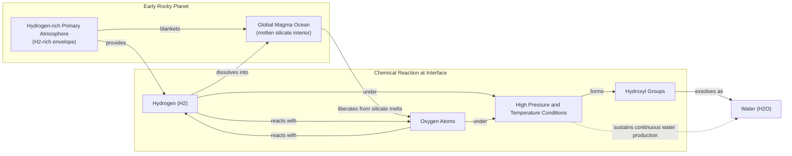

# Where Did Earth's Water Come From? The Three-Way Race Between Comets, Asteroids, and the Planet Itself

At this moment, a spacecraft is headed from Earth to Europa, an ice-veiled moon of Jupiter thought to contain a vast subsurface ocean. Affixed to the craft is a metal plate engraved with a poem by Ada Limón, which reads in part: “*And it is not darkness that unites us, / not the cold distance of space, but / the offering of water, each drop of rain, / each rivulet, each pulse, each vein*” [[32]](https://poets.org/poem/praise-mystery-poem-europa). For decades, the search for water has dominated our exploration of the solar system because, as far as we know, it is essential for life.

It may come as a surprise, then, that scientists do not know for certain how water first arrived here on Earth. The question seems simple, but the answer is a complex story of cosmic bombardment, planetary evolution, and chemical alchemy. For years, the leading theory was that comets, icy relics from the dawn of the solar system, delivered our oceans. But as spacecraft got close enough to "sniff" their vapor, the chemical evidence did not add up.

After that, “comets sort of fell out of favor,” said Ashley King, a meteoriticist at the Natural History Museum in London [[1]](https://www.quantamagazine.org/where-did-earth-get-its-oceans-maybe-it-made-them-itself-20260612). Asteroids, rockier bodies that rain down on Earth more frequently, became the new frontrunner, as water found in meteorites looked much more like our own. Yet, the asteroid theory also has its problems, leaving the door open for a more radical idea: Earth made its own water.

This historical debate, from comets to asteroids and now to an internal source, reveals how science progresses. Early models faced falsification by new data, paving the way for alternatives. We will first examine the evidence for and against comets and asteroids, looking at data from historic space missions. Then, we will explore the new theory that Earth generated its oceans from the inside out.

## A Showdown Between Comets and Asteroids

Earth formed about 4.54 billion years ago. While much of its earliest eon has been lost to time, the basic story is agreed upon: it began as a ball of mostly molten rock and somehow became a blue marble. How?

Comets were the early frontrunner. These objects, often lingering in the distant Kuiper Belt or Oort cloud, are made of frozen matter. Compared to rocky asteroids, comets give you “a lot of bang for your buck,” said James Bryson, a meteoriticist at the University of Oxford, because they are so rich in water ice [[26]](https://www.earth.ox.ac.uk/article/earth-sciences-conversation-james-bryson). The idea was simple: a bombardment of comets could have delivered the oceans to a young, cooling Earth. But proving it required getting close enough to taste their water.

In the 1980s, the European Space Agency (ESA) launched *Giotto*, its first deep-space mission, to do just that [[23]](https://www.quantamagazine.org/where-did-earth-get-its-oceans-maybe-it-made-them-itself-20260612). Its target was Halley’s comet. To determine if its water matched Earth’s, scientists measured its deuterium-to-hydrogen (D/H) ratio. Water (H₂O) is mostly made of hydrogen and oxygen, but a "heavy" version exists where one hydrogen atom is replaced by deuterium, a heavier hydrogen isotope. If comets supplied our oceans, their D/H ratio should be similar to ours.

https://www.quantamagazine.org/wp-content/uploads/2026/06/Giotto_launch_preparations-cr.ESA_.webp
<small><em>ESA’s Giotto spacecraft (top) took the first close-up images of a cometary nucleus (bottom) as part of its mission to Halley’s comet. ESA (left); Courtesy of Dr. H.U. Kelle </em></small>

https://www.quantamagazine.org/wp-content/uploads/2026/06/Giotto_images_of_Comet_Halley-cr.MPAE-courtesy-Dr.-H.U.-Keller.webp

*Giotto*’s measurements in 1986 were a surprise. “It didn’t match at all,” said Karen Meech, a planetary astronomer at the University of Hawai‘i [[23]](https://www.quantamagazine.org/where-did-earth-get-its-oceans-maybe-it-made-them-itself-20260612). Halley’s D/H ratio was twice that of Earth’s water [[22]](https://research.hawaii.edu/noelo/water-and-habitability). More cracks in the comet theory appeared in the 1990s and 2000s, as observations of other comets like Hale-Bopp also found high levels of heavy water [[23]](https://www.quantamagazine.org/where-did-earth-get-its-oceans-maybe-it-made-them-itself-20260612). The final blow came in 2014 from *Giotto*’s successor, ESA’s *Rosetta* mission. *Rosetta* orbited comet 67P/Churyumov-Gerasimenko and found it had the highest D/H ratio of any comet measured, over three times that of Earth’s oceans [[24]](https://www.esa.int/Science_Exploration/Space_Science/Rosetta/Rosetta_fuels_debate_on_origin_of_Earth_s_oceans).

https://www.quantamagazine.org/wp-content/uploads/2024/11/TheComet_crChristianStangl-Lede-2-scaled.webp
<small><em>Comet 67P/Churyumov-Gerasimenko was photographed in 2014 by ESA’s Rosetta mission, which also sent a lander to the comet’s surface. ESA/ [Christian Stangl]</em></small>

With comets largely ruled out, attention shifted to asteroids. These rocky bodies, mostly found between Mars and Jupiter, impact our planet far more often than comets. Scientists have collected thousands of meteorites and found that a particular group, carbonaceous chondrites, contains water with a D/H ratio that closely resembles our own. The meteorite that fell in Winchcombe, UK, in 2021 was recovered just hours after landing, providing a uniquely pristine sample. Analysis showed its D/H ratio was a near-perfect match for Earth’s oceans [[25]](https://www.science.org/doi/10.1126/sciadv.abq3925).

This finding was confirmed by Japan’s Hayabusa2 mission, which collected samples directly from the asteroid Ryugu in 2018 and returned them to Earth. The analysis, free from terrestrial contamination, revealed that Ryugu's water also had a D/H ratio similar to Earth's [[23]](https://www.quantamagazine.org/where-did-earth-get-its-oceans-maybe-it-made-them-itself-20260612), [[28]](https://iopscience.iop.org/article/10.3847/2041-8213/acc393). “The community is probably more favorable of asteroids than comets these days,” King said [[1]](https://www.quantamagazine.org/where-did-earth-get-its-oceans-maybe-it-made-them-itself-20260612).

https://www.quantamagazine.org/wp-content/uploads/2026/06/arrival-bennu-full-rotation-cr.NASAs-Goddard-Space-Flight-Center_University-Of-Arizona-still.jpg
<small><em>The asteroid Ryugu, visited by the Hayabusa2spacecraft in 2018, contained water similar to the most common kind found on Earth. NASA’s Goddard Space Flight Center/University of Arizona</em></small>

However, the asteroid-only model is not a perfect fit. Asteroids contain small amounts of noble gases like argon, krypton, and xenon, and their isotopic mixtures do not match what we find in Earth’s atmosphere [[29]](https://link.springer.com/article/10.1007/s11214-022-00929-9). Furthermore, both the comet and asteroid theories rely on a "late veneer"—a period of intense bombardment after Earth’s initial formation—whose existence and intensity are still heavily debated. These unresolved issues have led scientists to consider another possibility, one that relies not on cosmic chance but on our planet’s own chemistry.

## Hydrogen, Meet Magma

When astronomers simulate the formation of exoplanets, they find that many rocky worlds likely started with hydrogen-rich atmospheres. This has led scientists to wonder: could early Earth have been similar?

For a long time, the answer was thought to be no. This conclusion was based on enstatite chondrites, a type of meteorite with a chemical makeup so similar to Earth that they are considered our planet's primary building blocks [[30]](https://www.science.org/doi/10.1126/science.aba1948). These meteorites appeared to lack hydrogen, suggesting Earth also formed "dry." However, recent studies found that hydrogen was there all along, hidden within organic molecules and other compounds [[30]](https://www.science.org/doi/10.1126/science.aba1948), [[31]](https://www.sciencedirect.com/science/article/pii/S0019103525001356). This opened the possibility that early Earth was awash in hydrogen.

If a hydrogen-rich atmosphere blanketed a global magma ocean, which was full of oxygen, what would happen? A 2023 study concluded that under such conditions, a planet could make its own water; they just were not sure how much [[7]](https://www.nature.com/articles/s41586-023-05823-0). The answer came from a series of ambitious lab experiments designed to recreate the extreme conditions on young, hot exoplanets known as sub-Neptunes. These planets, larger than Earth, are often observed with water-rich atmospheres despite orbiting close to their stars.

Image 1: A diagram illustrating the endogenous water production model on early rocky planets.

The research team suspected that the immense pressure from a thick hydrogen atmosphere could facilitate chemical reactions with the underlying magma. “That higher pressure is a big part of what facilitates the water production,” said H. W. Horn, a physicist at Lawrence Livermore National Laboratory. “It actually enhances the chemical reactions” [[23]](https://www.quantamagazine.org/where-did-earth-get-its-oceans-maybe-it-made-them-itself-20260612).

To test this, they used diamond anvils to put hydrogen under intense pressure and combined it with rock samples melted by lasers, a process that took five years to perfect. “We broke a lot of diamonds,” said Sang-Heon Shim, a geophysicist at Arizona State University. The result was extreme: the reaction was so efficient that it produced far more water than predicted [[11]](https://arxiv.org/pdf/2511.01351), [[14]](https://doi.org/10.1038/s41586-025-09630-7). A similar study published around the same time reported comparable results [[12]](https://faculty.epss.ucla.edu/~eyoung/reprints/Miozzi_etal_2025.pdf). “It doesn’t seem unreasonable [that you could] produce a huge amount of water quite quickly,” said Paul Byrne, a planetary scientist at Washington University in St. Louis. “And this is all homegrown, indigenous water” [[23]](https://www.quantamagazine.org/where-did-earth-get-its-oceans-maybe-it-made-them-itself-20260612).

But could this have happened on Earth? “The paper doesn’t make strong claims about Earth,” Horn said, but both he and Shim think it is a valid link to make [[23]](https://www.quantamagazine.org/where-did-earth-get-its-oceans-maybe-it-made-them-itself-20260612). The main issue is whether Earth’s early atmosphere contained enough hydrogen. Sub-Neptunes are far more massive and their intense gravity is better at holding on to light gases like hydrogen. “Earth is right on the edge of where that kind of thing can start happening,” Horn noted [[23]](https://www.quantamagazine.org/where-did-earth-get-its-oceans-maybe-it-made-them-itself-20260612).

Some scientists are skeptical. “I’m a little bit doubtful whether you can have this for an Earth-mass planet,” said Anders Johansen, an astrophysicist at the University of Copenhagen [[23]](https://www.quantamagazine.org/where-did-earth-get-its-oceans-maybe-it-made-them-itself-20260612). However, Byrne pointed out that the reaction might not need to last long to create a huge quantity of water. Earth may have been a water factory for only a moment, but that moment may have been enough. If so, the implications are vast. Perhaps countless planets are “born water-rich,” greatly expanding the potential for habitable worlds across the galaxy [[16]](https://www.mpg.de/20541783/water-discovered-in-rocky-planet-forming-zone-offers-clues-on-habitability).

## Drowning in a Sea of Possibilities

While the indigenous water theory is compelling, it does not mean the story is over. In fact, comets are making a comeback. By 2014, scientists had studied the water of 11 comets, and all had D/H ratios unlike Earth’s, with one exception. In 2011, ESA’s Herschel Space Observatory found that the water in comet Hartley 2 had an Earth-like signature [[5]](https://www.jpl.nasa.gov/images/pia14737-heavy-and-light-just-right), [[2]](https://sci.esa.int/web/herschel/-/49386-herschel-finds-first-evidence-of-earth-like-water-in-a-comet).

https://www.quantamagazine.org/wp-content/uploads/2026/06/Comet-Hartley-2-cr-NASA-JPL-Caltech-UMD-still-1.jpg
<small><em>Comet Hartley 2, studied by the Herschel Space Observatory, has an Earth-like ratio of heavy to normal water. NASA/JPL-Caltech/UMD</em></small>

This seemed like an anomaly at the time. But in 2024, a re-investigation of *Rosetta*'s data from comet 67P suggested that the original high D/H measurement might have been skewed by dust in the comet's coma [[15]](https://www.science.org/doi/10.1126/sciadv.adp2191). The icy nucleus itself may have been more Earth-like. Then, in 2025, observations of comet 12P/Pons-Brooks also detected a D/H ratio similar to our oceans [[23]](https://www.quantamagazine.org/where-did-earth-get-its-oceans-maybe-it-made-them-itself-20260612).

So, was it comets all along? Or asteroids? Or did Earth make its own water? “I suspect it was a combination of all of them,” Meech said. Perhaps the reason it is so hard to find a perfect extraterrestrial match for our planet’s chemistry is that it is a diverse cocktail, one that has been filtered over billions of years by Earth’s geology, atmosphere, and biology [[27]](https://www.aaas.org/membership/member-spotlight/where-did-earths-water-come-aaas-fellow-karen-meech-investigates). “We may never know,” she added [[23]](https://www.quantamagazine.org/where-did-earth-get-its-oceans-maybe-it-made-them-itself-20260612).

But that will not stop scientists from trying to answer one of the most fundamental questions about our planet. “It’s like asking, what’s the origin of life?” Meech said. “The more you learn, the less you know—but the story becomes richer and more exciting” [[23]](https://www.quantamagazine.org/where-did-earth-get-its-oceans-maybe-it-made-them-itself-20260612).

## Conclusion

The quest to understand the origin of Earth’s water is a perfect example of the scientific process in action. What began as a seemingly straightforward question has evolved into a complex narrative involving multiple cosmic actors and planetary processes. We have moved from a simple "delivery" model to a richer story that includes comets, asteroids, and the surprising possibility that Earth itself was an active participant in creating its own oceans.

This journey from certainty to a more nuanced, multi-faceted understanding is not a failure of science but its greatest strength. Each new mission, each meteorite analysis, and each laboratory experiment adds another layer to the story. While a definitive answer may remain elusive, the pursuit continues to expand our understanding of how habitable worlds form, not just in our solar system, but across the galaxy.

## References

- [1] [Where Did Earth Get Its Oceans? Maybe It Made Them Itself.](https://www.quantamagazine.org/where-did-earth-get-its-oceans-maybe-it-made-them-itself-20260612)
- [2] [Herschel finds first evidence of Earth-like water in a comet](https://sci.esa.int/web/herschel/-/49386-herschel-finds-first-evidence-of-earth-like-water-in-a-comet)
- [3] [The deuterium-to-hydrogen ratio in the Solar System](https://sci.esa.int/web/herschel/-/49378-the-deuterium-to-hydrogen-ratio-in-the-solar-system)
- [4] [Ocean-like water in the Jupiter-family comet 103P/Hartley 2](https://www.aanda.org/articles/aa/abs/2012/08/aa19744-12/aa19744-12.html)
- [5] [Heavy and Light, Just Right](https://www.jpl.nasa.gov/images/pia14737-heavy-and-light-just-right)
- [6] [Comet Hartley 2 and the oceans of Earth](https://herscheltelescope.org.uk/results/comet-hartley-2-and-the-oceans-of-earth)
- [7] [Earth shaped by primordial H2 atmospheres](https://www.nature.com/articles/s41586-023-05823-0)
- [8] [Earth shaped by primordial H2 atmospheres](https://arxiv.org/abs/2304.07845)
- [9] [How Did Earth Get Its Water?](https://astrobiology.com/2023/04/how-did-earth-get-its-water.html)
- [10] [Earth shaped by primordial H 2 atmospheres](https://www.researchgate.net/publication/370070865_Earth_shaped_by_primordial_H_2_atmospheres)
- [11] [Experiments reveal extreme water generation during planet formation](https://arxiv.org/pdf/2511.01351)
- [12] [Experiments reveal extreme water generation during planet formation](https://faculty.epss.ucla.edu/~eyoung/reprints/Miozzi_etal_2025.pdf)
- [13] [Building wet planets through high-pressure magma–hydrogen reactions](https://www.nature.com/articles/s41586-025-09630-7)
- [14] [Building wet planets through high-pressure magma–hydrogen reactions](https://doi.org/10.1038/s41586-025-09630-7)
- [15] [A nearly terrestrial D/H for comet 67P/Churyumov-Gerasimenko](https://www.science.org/doi/10.1126/sciadv.adp2191)
- [16] [Water discovered in rocky planet-forming zone offers clues on habitability](https://www.mpg.de/20541783/water-discovered-in-rocky-planet-forming-zone-offers-clues-on-habitability)
- [17] [Planets without water could still produce certain liquids](https://news.mit.edu/2025/planets-without-water-could-still-produce-certain-liquids-0811)
- [18] [What Is Habitability?](https://pmc.ncbi.nlm.nih.gov/articles/PMC12783251)
- [19] [About Half of Sun-like Stars Could Host Rocky, Potentially Habitable Planets](https://www.nasa.gov/missions/kepler/about-half-of-sun-like-stars-could-host-rocky-potentially-habitable-planets)
- [20] [Terrestrial Planets Guide Our Search for Habitable Exoplanets](https://eos.org/editors-vox/terrestrial-planets-guide-our-search-for-habitable-exoplanets)
- [21] [Where did Earth’s water come from? AAAS Fellow Karen Meech investigates](https://www.aaas.org/membership/member-spotlight/where-did-earths-water-come-aaas-fellow-karen-meech-investigates)
- [22] [Water and Habitability](https://research.hawaii.edu/noelo/water-and-habitability)
- [23] [Where Did Earth Get Its Oceans? Maybe It Made Them Itself.](https://www.quantamagazine.org/where-did-earth-get-its-oceans-maybe-it-made-them-itself-20260612)
- [24] [Rosetta fuels debate on origin of Earth’s oceans](https://www.esa.int/Science_Exploration/Space_Science/Rosetta/Rosetta_fuels_debate_on_origin_of_Earth_s_oceans)
- [25] [The Winchcombe meteorite, a unique and pristine witness from the outer solar system](https://www.science.org/doi/10.1126/sciadv.abq3925)
- [26] [Earth Sciences in Conversation: James Bryson](https://www.earth.ox.ac.uk/article/earth-sciences-conversation-james-bryson)
- [27] [Where did Earth’s water come from? AAAS Fellow Karen Meech investigates](https://www.aaas.org/membership/member-spotlight/where-did-earths-water-come-aaas-fellow-karen-meech-investigates)
- [28] [Hydrogen Isotopic Composition of Hydrous Minerals in Asteroid Ryugu](https://iopscience.iop.org/article/10.3847/2041-8213/acc393)
- [29] [Noble Gases and Stable Isotopes Track the Origin and Early Evolution of the Venus Atmosphere](https://link.springer.com/article/10.1007/s11214-022-00929-9)
- [30] [Earth’s water may have been inherited from material similar to enstatite chondrite meteorites](https://www.science.org/doi/10.1126/science.aba1948)
- [31] [The source of hydrogen in earth's building blocks](https://www.sciencedirect.com/science/article/pii/S0019103525001356)
- [32] [In Praise of Mystery: A Poem for Europa by Ada Limón](https://poets.org/poem/praise-mystery-poem-europa)
- [33] [Ada Limón Reads Her Poem for the Europa Clipper Mission](https://www.youtube.com/watch?v=EgWbeDNPD6o)
- [34] [Full Version: In Praise of Mystery: A Poem for Europa](https://www.slowdownshow.org/story/2023/08/25/full-version-in-praise-of-mystery-a-poem-for-europa)
- [35] [A Poem for Europa](https://www.loc.gov/programs/poetry-and-literature/poet-laureate/poet-laureate-projects/a-poem-for-europa)
- [36] [In Praise of Mystery](https://www.bookpage.com/reviews/in-praise-of-mystery-ada-limon-book-review)