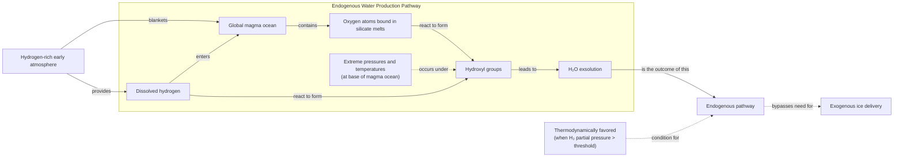

# Where Did Earth Get Its Oceans?

## Introduction

At this moment, a spacecraft is headed from Earth to Europa, an ice-veiled moon of Jupiter thought to contain a vast subsurface ocean. Affixed to the spacecraft is a metal plate engraved with a poem by Ada Limón, which reads, in part: "*And it is not darkness that unites us, not the cold distance of space, but the offering of water, each drop of rain, each rivulet, each pulse, each vein.*" [[1]](https://poets.org/poem/praise-mystery-poem-europa) For decades, the search for water has dominated the exploration of the solar system, because as far as is currently known, water is essential for life. It might come as a surprise, then, that scientists do not really know how water first arrived here on Earth.

For years, the top theory was that icy comets, relics from the dawn of the solar system, delivered our oceans as they rained down on a primeval Earth. It was an elegant and intuitive idea. But as spacecraft got close enough to "taste" the water from these cosmic travelers, the data told a different story. The chemical signature, specifically the ratio of heavy to normal hydrogen, did not match.

"Comets sort of fell out of favor," said Ashley King, a meteoriticist at the Natural History Museum in London. The scientific community then shifted its focus to asteroids. These rockier bodies impact Earth far more frequently, and their water reserves appeared to be a much closer match to our own [[2]](https://www.quantamagazine.org/where-did-earth-get-its-oceans-maybe-it-made-them-itself-20260612). Yet, the asteroid theory has its own problems, leaving nagging inconsistencies in other chemical tracers like noble gases.

This uncertainty has opened the door to a radical new idea: Earth may have made its own water. Through explosive lab experiments and observations of distant worlds, a new picture is emerging. It suggests that rocky planets have a way to forge water all by themselves, using an ocean of magma and a thick hydrogen atmosphere. This challenges the entire paradigm that our planet’s most vital resource had to be delivered from the outside. The historical arc of this scientific question shows a classic pattern. A simple, elegant theory gives way to a more complex and nuanced reality. In the next section, the evidence that first dethroned comets, then elevated asteroids, and finally, how the very building blocks of our planet might have held the recipe for water all along will be explored.

## A Showdown Between Comets and Asteroids

Earth formed about 4.54 billion years ago. While much of its earliest eon has been erased by time, the basic story is agreed upon. It began as a ball of mostly molten rock and then, somehow, became a blue marble. The "how" is the heart of the debate. Comets were the early frontrunner in this story. Formed in the frigid outer reaches of the solar system, the Kuiper Belt and the more distant Oort cloud, they are essentially dirty snowballs, rich in the water ice that was stable in those cold regions. Compared to the drier, rock-dominated asteroids, comets offered "a lot of bang for your buck" in terms of water delivery per impact, as meteoriticist James Bryson of the University of Oxford puts it [[3]](https://www.earth.ox.ac.uk/article/earth-sciences-conversation-james-bryson).

The key to testing this hypothesis lay in a chemical fingerprint: the ratio of deuterium to hydrogen (D/H). Deuterium is a heavier form of hydrogen, and the D/H ratio in water provides clues about its origin. If comets were the source of our oceans, their water should have a D/H ratio similar to Earth's. In the 1980s, the European Space Agency (ESA) sent its first deep-space mission, Giotto, to find out. In 1986, it flew through the cloud of gas surrounding Halley’s Comet and measured its water. The result was a shock. “It didn’t match at all,” said Karen Meech, a planetary astronomer at the University of Hawai‘i. Halley’s D/H ratio was twice that of Earth’s oceans [[4]](https://research.hawaii.edu/noelo/water-and-habitability).

<https://www.quantamagazine.org/wp-content/uploads/2026/06/Giotto_launch_preparations-cr.ESA_.webp>
<small><em>Image 1: ESA’s Giotto spacecraft (top) took the first close-up images of a cometary nucleus (bottom) as part of its mission to Halley’s comet. ESA (left); Courtesy of Dr. H.U. Kelle </em></small>
<https://www.quantamagazine.org/wp-content/uploads/2026/06/Giotto_images_of_Comet_Halley-cr.MPAE-courtesy-Dr.-H.U.-Keller.webp>

This was not an isolated finding. Over the next two decades, observations of other comets, like Hale-Bopp, also revealed elevated levels of heavy water. The final blow to the simple comet theory came in 2014 from Giotto's successor, ESA's Rosetta mission. Rosetta did not just fly by its target, Comet 67P/Churyumov-Gerasimenko. It orbited the duck-shaped body for two years, making the most precise measurements of a comet's composition ever. It found that 67P’s water had a D/H ratio more than three times that of Earth's oceans, the highest ever measured in a comet at the time [[5]](https://www.esa.int/Science_Exploration/Space_Science/Rosetta/Rosetta_fuels_debate_on_origin_of_Earth_s_oceans).

<https://www.quantamagazine.org/wp-content/uploads/2024/11/TheComet_crChristianStangl-Lede-2-scaled.webp>
<small><em>Image 2: Comet 67P/Churyumov-Gerasimenko was photographed in 2014 by ESA’s Rosetta mission, which also sent a lander to the comet’s surface. ESA/ [Christian Stangl]</em></small>

With comets seemingly ruled out, attention turned to asteroids. These rocky objects, mostly orbiting between Mars and Jupiter, rain down on Earth as meteorites. Thousands have been collected, and a particular group known as carbonaceous chondrites contains water molecules that closely resemble our own. A spectacular example came in 2021 when a meteorite crashed into the English town of Winchcombe. Recovered within hours, the meteorite was largely unmodified by the terrestrial environment. This pristine sample was found to have a D/H ratio that almost perfectly matched Earth's oceans [[6]](https://www.science.org/doi/10.1126/sciadv.abq3925).

This finding was bolstered by sample-return missions. In 2023, analysis of material from the asteroid Ryugu, collected by Japan's Hayabusa2 spacecraft, also revealed a D/H ratio similar to Earth's. The returned samples, which avoided terrestrial contamination, are our best proxy for the composition of water in this type of asteroidal material [[7]](https://iopscience.iop.org/article/10.3847/2041-8213/acc393).

<https://www.quantamagazine.org/wp-content/uploads/2026/06/arrival-bennu-full-rotation-cr.NASAs-Goddard-Space-Flight-Center_University-Of-Arizona-still.jpg>
<small><em>Image 3: The asteroid Ryugu, visited by the Hayabusa2spacecraft in 2018, contained water similar to the most common kind found on Earth. NASA’s Goddard Space Flight Center/University of Arizona</em></small>

However, the asteroid-only model is not a perfect fit either. While the water matches, other volatile elements found in these meteorites, like the noble gases argon, krypton, and xenon, do not align with the composition of Earth's atmosphere. This is part of the "missing xenon problem," where Earth's atmosphere is depleted in xenon relative to chondritic abundances [[8]](https://link.springer.com/article/10.1007/s11214-022-00929-9). If asteroids were the sole delivery mechanism, we would expect to see other chemical signatures that simply are not there.

Furthermore, the entire scenario relies on a "late veneer." This was a period of intense bombardment by asteroids *after* Earth’s initial formation and cooling. The magnitude of this event is still heavily debated. The leading "Nice model" suggests the Late Heavy Bombardment was triggered by a gravitational instability among the giant planets. Jupiter and Saturn's shifting orbits scattered vast numbers of asteroids and comets from stable reservoirs into the inner solar system [[9]](https://en.wikipedia.org/wiki/Late_Heavy_Bombardment), [[10]](https://www2.boulder.swri.edu/~bottke/Reprints/Bottke_Norman_2017_AnnuRev-Earth-Planet_45_619_Late_Heavy_Bombardment.pdf). However, the precise timing and intensity of this event remain poorly constrained. Some models suggest comets from this period could have delivered at most 10% of Earth's water, and substantial uncertainties remain about the total mass delivered by asteroids [[11]](http://web-static-aws.seas.harvard.edu/climate/eli/Courses/EPS281r/Sources/Origin-of-oceans/more/Morbidelli%202000%20water%20on%20Earth.pdf), [[12]](https://www.nationalacademies.org/read/26522/chapter/9).

The persistent contradictions in both the comet and asteroid hypotheses have forced scientists to consider a more radical possibility. Perhaps Earth did not need water to be delivered at all. The evidence is mounting that our planet may have manufactured its own water, using the raw ingredients it had from the very beginning. This shifts the focus from external delivery to internal chemistry, a process that will be explored next.

## Hydrogen, Meet Magma

When astronomers simulate the ways exoplanets take shape, they find that many rocky worlds larger than Earth likely began their lives cloaked in thick, hydrogen-rich atmospheres. These atmospheres are accreted from their star's protoplanetary disk. This has led scientists to ask a fundamental question: could our own planet have had a similar start? [[13]](https://sustainability.stanford.edu/news/plethora-planets-with-water-rich-atmospheres)

The conventional view was that Earth's building blocks were "dry." This idea was based on the study of enstatite chondrites, a class of meteorites with an isotopic makeup strikingly similar to Earth's, suggesting they formed from the same raw materials. These meteorites appeared to lack hydrogen, leading to the conclusion that the early Earth was also hydrogen-poor [[14]](https://www.science.org/doi/10.1126/science.aba1948). However, more recent and detailed analyses have overturned this assumption. It was discovered that hydrogen was there all along, hidden within organic molecules, silicate glasses, and sulfur compounds. This means Earth's building blocks were not as dry as once thought [[15]](https://www.sciencedirect.com/science/article/pii/S0019103525001356).

This finding, combined with insights from exoplanet formation, sets the stage for the endogenous water theory. The early Earth was a molten world, its surface a global ocean of magma. If it also possessed a dense hydrogen atmosphere, the boundary between the two would have been a zone of extreme chemistry. A 2023 paper in *Nature* explored what would happen if the hydrogen from the atmosphere and the oxygen locked within the magma ocean were to mix. The authors concluded that this interaction could produce water, but they were not sure how much [[16]](https://www.nature.com/articles/s41586-023-05823-0), [[17]](https://arxiv.org/abs/2304.07845), [[18]](https://astrobiology.com/2023/04/how-did-earth-get-its-water.html), [[19]](https://www.researchgate.net/publication/370070865_Earth_shaped_by_primordial_H_2_atmospheres).

<small><em>Image 4: Flowchart illustrating the endogenous water production within Earth's early magma ocean.</em></small>

The answer came from a series of daring laboratory experiments. Researchers used diamond-anvil cells to compress hydrogen gas to immense pressures, between 16 and 60 GPa, while simultaneously melting rock samples with high-powered lasers. This setup recreated the conditions at the core-envelope boundary of a young, hydrogen-rich planet. The technical challenges were immense. It took five years to perfect the technique using pulsed lasers to avoid catastrophic diamond failure. As one of the researchers, S.-H. Shim, noted, "We broke a lot of diamonds" [[2]](https://www.quantamagazine.org/where-did-earth-get-its-oceans-maybe-it-made-them-itself-20260612), [[20]](https://www.nature.com/articles/s41586-025-09630-7), [[21]](https://doi.org/10.1038/s41586-025-09816-z).

The results, published in 2025, were astonishing. The reaction between high-pressure hydrogen and molten rock was so efficient that it produced far more water than theoretical models had predicted. Some experimental yields were 2,000 to 3,000 times higher than expected based on extrapolations from low-pressure data [[22]](https://pmc.ncbi.nlm.nih.gov/articles/PMC12571897). "It doesn't seem unreasonable [that you could] produce a huge amount of water quite quickly," said Paul Byrne, a planetary scientist at Washington University in St. Louis. This water is "all homegrown, indigenous." No comets or asteroids are required [[2]](https://www.quantamagazine.org/where-did-earth-get-its-oceans-maybe-it-made-them-itself-20260612).

But could this process have happened on a planet the size of Earth? Sub-Neptunes are more massive and their stronger gravity is better at holding onto a light gas like hydrogen. "Earth is right on the edge of where that kind of thing can start happening," said H. W. Horn, a physicist involved in the experiments [[2]](https://www.quantamagazine.org/where-did-earth-get-its-oceans-maybe-it-made-them-itself-20260612). Some scientists, like Anders Johansen at the University of Copenhagen, are skeptical that an Earth-mass planet could have retained a hydrogen atmosphere dense enough for the reaction to occur at scale [[2]](https://www.quantamagazine.org/where-did-earth-get-its-oceans-maybe-it-made-them-itself-20260612). However, the experiments suggest the reaction is so rapid that it might not need to last long. Earth could have been a water factory for only a brief period, but that moment may have been enough to forge its oceans.

If this is true, the implications are profound. It suggests that the conditions for life might not be so rare after all. If rocky planets can be "born water-rich" through their own internal geology, it relaxes the need for a "lucky" delivery of water from the outer solar system [[23]](https://www.mpg.de/20541783/water-discovered-in-rocky-planet-forming-zone-offers-clues-on-habitability). This could mean that countless planets across the galaxy are born with one of the key ingredients for habitability, expanding the cosmic search for life [[24]](https://news.mit.edu/2025/planets-without-water-could-still-produce-certain-liquids-0811), [[25]](https://pmc.ncbi.nlm.nih.gov/articles/PMC12783251), [[26]](https://www.nasa.gov/missions/kepler/about-half-of-sun-like-stars-could-host-rocky-potentially-habitable-planets), [[27]](https://eos.org/editors-vox/terrestrial-planets-guide-our-search-for-habitable-exoplanets). This homegrown mechanism also challenges a long-standing tenet of planet formation theory: the "snow line." Conventional models hold that water-rich planets can only form far from their star, beyond this line where water ice is stable, and then migrate inward. Endogenous water production breaks this rule, allowing "wet" planets to form close to their star. It suggests that hydrogen-rich gas dwarfs and water-rich worlds may not be different types of planets, but different evolutionary stages of the same body, decoupling a planet's final composition from its birthplace [[20]](https://www.nature.com/articles/s41586-025-09630-7). This internal mechanism, however, does not exclude contributions from external sources. The final picture is likely a blend of possibilities, a topic that will be explored in the concluding section.

## Drowning in a Sea of Possibilities

While the homegrown water theory provides a compelling new chapter, it does not close the book. In a surprising turn, comets are making a bit of a comeback. In 2011, ESA’s Herschel Space Observatory found that the water in Comet Hartley 2 had a D/H ratio that was a much better match for Earth’s oceans [[28]](https://sci.esa.int/web/herschel/-/49386-herschel-finds-first-evidence-of-earth-like-water-in-a-comet), [[29]](https://www.jpl.nasa.gov/images/pia14737-heavy-and-light-just-right), [[30]](https://herscheltelescope.org.uk/results/comet-hartley-2-and-the-oceans-of-earth). At the time, this was seen as an anomaly. But a 2024 reanalysis of the data from Rosetta's visit to comet 67P suggested that the original high D/H measurements might have been skewed by dust in the comet's coma. The nucleus ice itself could have been more Earth-like [[31]](https://www.science.org/doi/10.1126/sciadv.adp2191). More recently, observations of comet 12P/Pons-Brooks also detected a D/H ratio similar to our planet's. It seems not all comets are isotopically heavy after all [[2]](https://www.quantamagazine.org/where-did-earth-get-its-oceans-maybe-it-made-them-itself-20260612).

<https://www.quantamagazine.org/wp-content/uploads/2026/06/Comet-Hartley-2-cr-NASA-JPL-Caltech-UMD-still-1.jpg>
<small><em>Image 5: Comet Hartley 2, studied by the Herschel Space Observatory, has an Earth-like ratio of heavy to normal water. NASA/JPL-Caltech/UMD</em></small>

So, where does that leave the scientific community? "I suspect it was a combination of all of them," says Karen Meech [[2]](https://www.quantamagazine.org/where-did-earth-get-its-oceans-maybe-it-made-them-itself-20260612). The most plausible scenario is that Earth's water is a cocktail, with ingredients from multiple sources. It likely includes a portion from comets, a larger contribution from asteroids, and a foundational amount produced endogenously in its own magma ocean.

Finding a perfect extraterrestrial match might be impossible because Earth's water has been continuously tweaked and filtered over billions of years. Geological processes like mantle convection, atmospheric escape, and the emergence of life itself can alter isotopic signatures, gradually erasing the original forensic record [[32]](https://www.aaas.org/membership/member-spotlight/where-did-earths-water-come-aaas-fellow-karen-meech-investigates). The journey to understand the origin of our oceans mirrors the quest to understand the origin of life itself. The more that is learned, the more it is realized there likely is not a single, simple answer. As Meech puts it, "The more you learn, the less you know—but the story becomes richer and more complex" [[2]](https://www.quantamagazine.org/where-did-earth-get-its-oceans-maybe-it-made-them-itself-20260612).

## References

- [1] [In Praise of Mystery: A Poem for Europa](https://poets.org/poem/praise-mystery-poem-europa)
- [2] [Where Did Earth Get Its Oceans? Maybe It Made Them Itself.](https://www.quantamagazine.org/where-did-earth-get-its-oceans-maybe-it-made-them-itself-20260612)
- [3] [Earth Sciences in Conversation: James Bryson](https://www.earth.ox.ac.uk/article/earth-sciences-conversation-james-bryson)
- [4] [Water and Habitability – Noelo](https://research.hawaii.edu/noelo/water-and-habitability)
- [5] [Rosetta fuels debate on origin of Earth’s oceans](https://www.esa.int/Science_Exploration/Space_Science/Rosetta/Rosetta_fuels_debate_on_origin_of_Earth_s_oceans)
- [6] [The Winchcombe meteorite, a unique and pristine witness from the outer solar system](https://www.science.org/doi/10.1126/sciadv.abq3925)
- [7] [Hydrogen Isotopic Composition of Hydrous Minerals in Asteroid Ryugu](https://iopscience.iop.org/article/10.3847/2041-8213/acc393)
- [8] [Noble Gases and Stable Isotopes Track the Origin and Early Evolution of the Venus Atmosphere](https://link.springer.com/article/10.1007/s11214-022-00929-9)
- [9] [Late Heavy Bombardment](https://en.wikipedia.org/wiki/Late_Heavy_Bombardment)
- [10] [The Late Heavy Bombardment](https://www2.boulder.swri.edu/~bottke/Reprints/Bottke_Norman_2017_AnnuRev-Earth-Planet_45_619_Late_Heavy_Bombardment.pdf)
- [11] [A source of water for the Earth from the outer Solar System](http://web-static-aws.seas.harvard.edu/climate/eli/Courses/EPS281r/Sources/Origin-of-oceans/more/Morbidelli%202000%20water%20on%20Earth.pdf)
- [12] [The Grand Tack and the Delivery of Water to Earth](https://www.nationalacademies.org/read/26522/chapter/9)
- [13] [A plethora of planets with water-rich atmospheres](https://sustainability.stanford.edu/news/plethora-planets-with-water-rich-atmospheres)
- [14] [Earth’s water may have been inherited from material similar to enstatite chondrite meteorites](https://www.science.org/doi/10.1126/science.aba1948)
- [15] [The source of hydrogen in earth's building blocks](https://www.sciencedirect.com/science/article/pii/S0019103525001356)
- [16] [Earth shaped by primordial H2 atmospheres](https://www.nature.com/articles/s41586-023-05823-0)
- [17] [Earth shaped by primordial H2 atmospheres](https://arxiv.org/abs/2304.07845)
- [18] [How Did Earth Get Its Water?](https://astrobiology.com/2023/04/how-did-earth-get-its-water.html)
- [19] [Earth shaped by primordial H2 atmospheres](https://www.researchgate.net/publication/370070865_Earth_shaped_by_primordial_H_2_atmospheres)
- [20] [Building wet planets through high-pressure magma–hydrogen reactions](https://www.nature.com/articles/s41586-025-09630-7)
- [21] [Experiments reveal extreme water generation during planet formation](https://doi.org/10.1038/s41586-025-09816-z)
- [22] [Endogenic water production on Earth-sized planets](https://pmc.ncbi.nlm.nih.gov/articles/PMC12571897)
- [23] [Water discovered in rocky planet-forming zone offers clues on habitability](https://www.mpg.de/20541783/water-discovered-in-rocky-planet-forming-zone-offers-clues-on-habitability)
- [24] [Planets without water could still produce certain liquids](https://news.mit.edu/2025/planets-without-water-could-still-produce-certain-liquids-0811)
- [25] [Water/Land Ratios on Terrestrial Planets](https://pmc.ncbi.nlm.nih.gov/articles/PMC12783251)
- [26] [About Half of Sun-Like Stars Could Host Rocky, Potentially Habitable Planets](https://www.nasa.gov/missions/kepler/about-half-of-sun-like-stars-could-host-rocky-potentially-habitable-planets)
- [27] [Terrestrial Planets Guide Our Search for Habitable Exoplanets](https://eos.org/editors-vox/terrestrial-planets-guide-our-search-for-habitable-exoplanets)
- [28] [Herschel finds first evidence of Earth-like water in a comet](https://sci.esa.int/web/herschel/-/49386-herschel-finds-first-evidence-of-earth-like-water-in-a-comet)
- [29] [Heavy and Light, Just Right](https://www.jpl.nasa.gov/images/pia14737-heavy-and-light-just-right)
- [30] [Comet Hartley 2 and the oceans of Earth](https://herscheltelescope.org.uk/results/comet-hartley-2-and-the-oceans-of-earth)
- [31] [A nearly terrestrial D/H for comet 67P/Churyumov-Gerasimenko](https://www.science.org/doi/10.1126/sciadv.adp2191)
- [32] [Where did Earth’s water come from? AAAS Fellow Karen Meech investigates](https://www.aaas.org/membership/member-spotlight/where-did-earths-water-come-aaas-fellow-karen-meech-investigates)

</article>